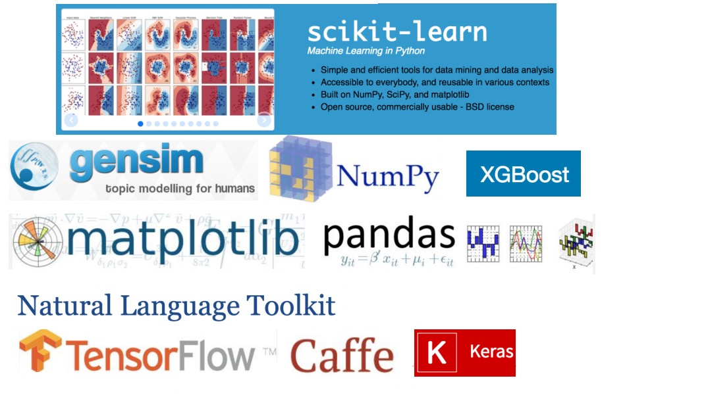
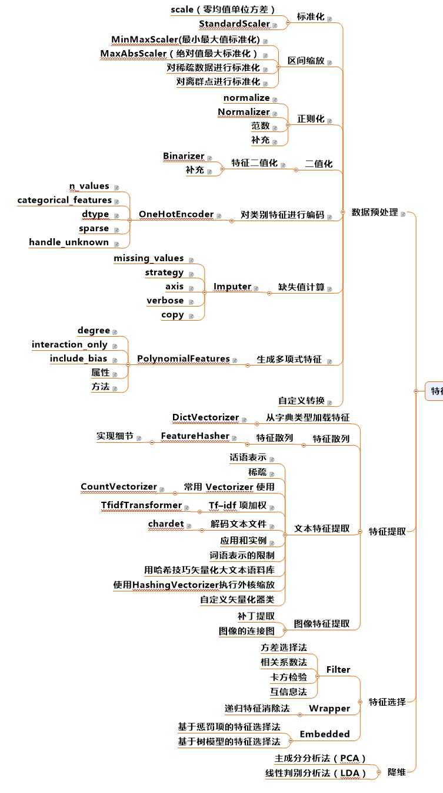

# Kaggle
 

> **欢迎任何人参与和完善：一个人可以走的很快，但是一群人却可以走的更远**
* <strong>ApacheCN - Kaggle组队群【686932392】<a target="_blank" href="//shang.qq.com/wpa/qunwpa?idkey=716b584bbd7cdf64e961b499c7fb5891faf1f6c92dad026e3c596a57c834f1ec"></a></strong></li>
* [Kaggle](https://www.kaggle.com) 是一个流行的数据科学竞赛平台。
* [GitHub 入门操作指南](docs/GitHub/README.md) 和 [Kaggle 入门操作指南](docs/kaggle-quickstart.md)，适合于学习过 [MachineLearning(机器学习实战)](https://github.com/apachecn/MachineLearning) 的小盆友
* Kaggle 已被 Google 收购，请参阅[《谷歌收购 Kaggle 为什么会震动三界（AI、机器学习、数据科学界）》](https://www.leiphone.com/news/201703/ZjpnddCoUDr3Eh8c.html)

> Note:

* 号外号外 [**kaggle组队开始啦**](docs/kaggle-start.md) 
* [【Kaggle 入门篇】资源整理完毕，跟我们一起来学习吧！](http://www.apachecn.org/kaggle/379.html)
* [关于 ApacheCN](http://cwiki.apachecn.org/pages/viewpage.action?pageId=2887240): 一边学习和整理，一边录制项目视频，希望能组建一个开源的公益团队对国内机器学习社区做一些贡献，同时也为装逼做准备!!

## [竞赛](https://www.kaggle.com/competitions)

```
机器学习比赛，奖金很高，业界承认分数。
现在我们已经准备好尝试 Kaggle 竞赛了，这些竞赛分成以下几个类别。
```

> [第1部分：课业比赛 InClass](https://www.kaggle.com/competitions?sortBy=deadline&group=all&page=1&pageSize=20&segment=inClass)

`课业比赛 InClass` 是学校教授机器学习的老师留作业的地方，这里的竞赛有些会向public开放参赛，也有些仅仅是学校内部教学使用。

> [第2部分：入门比赛 Getting Started](https://www.kaggle.com/competitions?sortBy=deadline&group=all&page=1&pageSize=20&segment=gettingStarted)

`入门比赛 Getting Started` 给萌新们一个试水的机会，没有奖金，但有非常多的前辈经验可供学习。很久以前Kaggle这个栏目名称是101的时候，比赛题目还很多，但是现在只保留了4个最经典的入门竞赛：手写数字识别、沉船事故幸存估计、脸部识别、Julia语言入门。

* [**数字识别**](/competitions/getting-started/digit-recognizer)
* [**泰坦尼克**](/competitions/getting-started/titanic)
* [**房价预测**](/competitions/getting-started/house-price)

> [第3部分：训练场 Playground](https://www.kaggle.com/competitions?sortBy=deadline&group=all&page=1&pageSize=20&segment=playground)

`训练场 Playground`里的题目以有趣为主，比如猫狗照片分类的问题。现在这个分类下的题目不算多，但是热度很高。

* [**猫狗识别**](/competitions/playground/dogs-vs-cats)

> [第4部分： 研究项目(少奖金) Research](https://www.kaggle.com/competitions?sortBy=prize&group=active&page=1&pageSize=20&segment=research)

`研究型 Research` 竞赛通常是机器学习前沿技术或者公益性质的题目。竞赛奖励可能是现金，也有一部分以会议邀请、发表论文的形式奖励。

> [第5部分：人才征募 Recruitment](https://www.kaggle.com/competitions?sortBy=prize&group=active&page=1&pageSize=20&segment=recruitment)

`人才征募 Recruitment` 竞赛是赞助企业寻求数据科学家、算法设计人才的渠道。只允许个人参赛，不接受团队报名。

> [第6部分： 大型组织比赛(大奖金) Featured](https://www.kaggle.com/competitions?sortBy=prize&group=active&page=1&pageSize=20&segment=featured)

`推荐比赛 Featured` 是瞄准商业问题带有奖金的公开竞赛。如果有幸赢得比赛，不但可以获得奖金，模型也可能会被竞赛赞助商应用到商业实践中呢。

* [**Mercari 价格推荐挑战**](/competitions/featured/mercari-price-suggestion-challenge)

## 其他部分

* [数据集](https://www.kaggle.com/datasets): 数据集，可直接用于机器学习。
* [核心思想](https://www.kaggle.com/kernels): 在线编程。（猜测，基于 jupyter 实现）
* [论坛](https://www.kaggle.com/discussion): 发帖回帖讨论的平台
* [招聘](https://www.kaggle.com/jobs): 企业招聘数据科学家的位置

## 机器学习算法

> 常用算法选择


> 常用工具选择



> 解决问题的流程

1. 链接场景和目标
2. 链接评估准则
3. 认识数据
4. 数据预处理（清洗、调权）
5. 特征工程
6. 模型调参
7. 模型状态分析
8. 模型融合

> 数据预处理

* 数据清洗
    * 去掉样本数据的异常数据。（比如连续型数据中的离群点）
    * 去除缺失大量特征的数据
* 数据采样
    * 下/上采样（假设正负样本比例1:100，把正样本的数量重复100次，这就叫上采样，也就是把比例小的样本放大。下采样同理，把比例大的数据抽取一部分，从而使比例变得接近于1；1）
    * 保证样本均衡
* 工具 sql、pandas等

> 特征工程



> 特征处理

- 数值型：连续型数据离散化或者归一化、数据变化（log、指数、box-cox）
- 类别型：做编码，eg：one-hot编码，如果类别数据有缺失，把缺失也作为一个类别即可。
- 时间类：间隔化（距离某个节日多少天）、与其他特征（eg：次数）融合，变成一周登陆几次、离散化（eg：外卖，把时间分为【饭店、非饭店】）
- 文本类：N-gram、Bag-of-words、TF-IDF
- 统计型：与业务强关联
- 组合特征

## 活动时间

时间段：2017-11-15 ～ 2017-11-30

## 联系方式

> 项目负责人

* [@jiangzhonglian](https://github.com/jiangzhonglian)（片刻）

> 项目发起人

* [@jiangzhonglian](https://github.com/jiangzhonglian)（片刻）
* [@wangyangting](https://github.com/wangyangting)（那伊抹微笑）
* [@chenyyx](https://github.com/chenyyx)（瑶妹）

> 项目贡献者（请手动添加）

* [@jiangzhonglian](https://github.com/jiangzhonglian)（片刻）
* [@wangyangting](https://github.com/wangyangting)（那伊抹微笑）
* [@chenyyx](https://github.com/chenyyx)（瑶妹）
* [@zehuichen](https://github.com/zehuichen123)(loveSnowBest)
* [@谈笑风生](https://github.com/zhu1040028623)（谈笑风生）
* [@诺木人](https://github.com/1mrliu)（诺木人）

> 加入方式

有任何建议反馈, 或想参与文档翻译, 麻烦联系下面的企鹅
* 企鹅: 529815144(片刻) 1042658081(那伊抹微笑) 190442212(瑶妹)
* **ApacheCN - 学习机器学习群【629470233】<a target="_blank" href="//shang.qq.com/wpa/qunwpa?idkey=30e5f1123a79867570f665aa3a483ca404b1c3f77737bc01ec520ed5f078ddef"></a>**
* **Kaggle (数据科学竞赛平台) | [ApacheCN(apache中文网)](http://www.apachecn.org/)**

## [ApacheCN 组织资源](http://www.apachecn.org/)

> [kaggle: 机器学习竞赛](https://github.com/apachecn/kaggle)

| 深度学习 | 机器学习  | 大数据 | 运维工具 |
| --- | --- | --- | --- |
| [TensorFlow R1.2 中文文档](http://cwiki.apachecn.org/pages/viewpage.action?pageId=10030122) | [机器学习实战-教学](https://github.com/apachecn/MachineLearning) | [Spark 2.2.0和2.0.2 中文文档](http://spark.apachecn.org/) | [Zeppelin 0.7.2 中文文档](http://cwiki.apachecn.org/pages/viewpage.action?pageId=10030467) |
| [Pytorch 0.3 中文文档 ](http://pytorch.apachecn.org/cn/0.3.0/) | [Sklearn 0.19 中文文档](http://sklearn.apachecn.org/) | [Storm 1.1.0和1.0.1 中文文档](http://storm.apachecn.org/) | [Kibana 5.2 中文文档](http://cwiki.apachecn.org/pages/viewpage.action?pageId=8159377) |
|  | [LightGBM 中文文档](http://lightgbm.apachecn.org/cn/latest) | [Kudu 1.4.0 中文文档](http://cwiki.apachecn.org/pages/viewpage.action?pageId=10813594) |  |
|  | [XGBoost 中文文档](http://xgboost.apachecn.org/cn/latest)  | [Elasticsearch 5.4 中文文档](http://cwiki.apachecn.org/pages/viewpage.action?pageId=4260364) |
|  |  | [Beam 中文文档](http://beam.apachecn.org/) |
Test