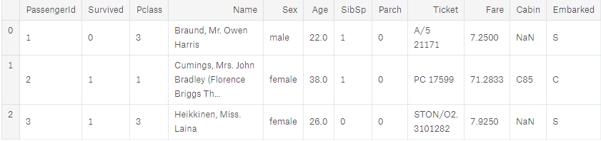
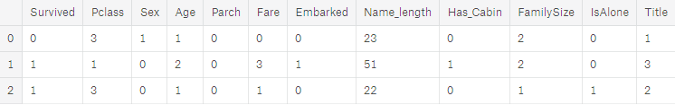
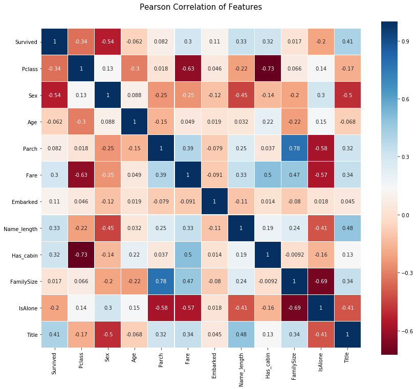

# Titanic 第一次试水 | 瑶瑶亲卫队

* fork from https://www.kaggle.com/arthurtok/introduction-to-ensembling-stacking-in-python
* 开源组织: [ApacheCN ~ apachecn.org](http://www.apachecn.org) 
* team：瑶瑶亲卫队
* 鸣谢：咸鱼大佬，帮忙调试错误，并上传

我们主要根据这个 [kernel](https://www.kaggle.com/arthurtok/introduction-to-ensembling-stacking-in-python) 写的，当然生成的 submission ，已经提交到 kaggle 上评分出来了。

## 目录

* 1、加载我们要用到的库
* 2、特征工程
* 3、可视化
* 4、整合模型
* 5、生成基本的模型
* 6、训练模型
* 7、生成 submission 文件


## 1、加载我们要用到的库

```python
# 加载我们的库
import pandas as pd
import numpy as np
# 使用 re 写正则匹配
import re
# 使用 sklearn 的模型来进行预测
import sklearn
# 使用 seaborn 进行可视化
import seaborn as sns
import matplotlib.pyplot as plt
%matplotlib inline

import plotly.offline as py
py.init_notebook_mode(connected=True)
import plotly.graph_objs as go
import plotly.tools as tls

import warnings
warnings.filterwarnings('ignore')

# 我们使用 5 种模型来预测
from sklearn.ensemble import RandomForestClassifier, AdaBoostClassifier, GradientBoostingClassifier, ExtraTreesClassifier
from sklearn.svm import SVC
from sklearn.cross_validation import KFold
```

## 2、特征工程

### 2.1、初步查看

```python
# 加载 train 和 test 数据集
train = pd.read_csv('../input/train.csv')
test = pd.read_csv('../input/test.csv')

# 存储 Passenger ID 方便后续操作
PassengerId = test['PassengerId']

train.head(3)
```

是下面这样(NaN 不是咱们想要的结果)：




### 2.2、加入一些特征，删除一些特征，映射一些特征

```python
# 整体的全部数据
full_data = [train, test]

# 一些从原始 features 中衍生出的 features ，我认为可以算是一个 feature
# Name_length 特征
train['Name_length'] = train['Name'].apply(len)
test['Name_length'] = test['Name'].apply(len)
# 在 Titanic 上是否具有一个 cabin
train['Has_Cabin'] = train["Cabin"].apply(lambda x: 0 if type(x) == float else 1)
test['Has_Cabin'] = test["Cabin"].apply(lambda x: 0 if type(x) == float else 1)

# 创建一个新的 feature FamilySize 作为 SibSp 和 Parch 的混合 features
for dataset in full_data:
    dataset['FamilySize'] = dataset['SibSp'] + dataset['Parch'] + 1
# 从 FamilySize 特征中 创建一个新的 feature IsAlone 
for dataset in full_data:
    dataset['IsAlone'] = 0
    dataset.loc[dataset['FamilySize'] == 1, 'IsAlone'] = 1
# 删除 Embarked 列中的所有的 NULLS值，使用 S 来填充（算是超级暴力的吧）
for dataset in full_data:
    dataset['Embarked'] = dataset['Embarked'].fillna('S')
# 删除 Fare 中所有的 NULLS 值，并生成一个新的 feature 列 CategoricalFare
for dataset in full_data:
    dataset['Fare'] = dataset['Fare'].fillna(train['Fare'].median())
train['CategoricalFare'] = pd.qcut(train['Fare'], 4)
# 创建一个新特征 CategoricalAge
for dataset in full_data:
    age_avg = dataset['Age'].mean()
    age_std = dataset['Age'].std()
    age_null_count = dataset['Age'].isnull().sum()
    age_null_random_list = np.random.randint(age_avg - age_std, age_avg + age_std, size=age_null_count)
    dataset['Age'][np.isnan(dataset['Age'])] = age_null_random_list
    dataset['Age'] = dataset['Age'].astype(int)
train['CategoricalAge'] = pd.cut(train['Age'], 5)

# 定义函数从 passenger 名字中获取 titles
def get_title(name):
    title_search = re.search(' ([A-Za-z]+)\.', name)
    # 如果 title 存在，返回
    if title_search:
        return title_search.group(1)
    return ""
# 创建一个新的特征 Title, 包含乘客的名字的 titles
for dataset in full_data:
    dataset['Title'] = dataset['Name'].apply(get_title)
# 将所有的非常见的 title 分类到一个 “Rare” 特征
for dataset in full_data:
    dataset['Title'] = dataset['Title'].replace(['Lady', 'Countess','Capt', 'Col','Don', 'Dr', 'Major', 'Rev', 'Sir', 'Jonkheer', 'Dona'], 'Rare')

    dataset['Title'] = dataset['Title'].replace('Mlle', 'Miss')
    dataset['Title'] = dataset['Title'].replace('Ms', 'Miss')
    dataset['Title'] = dataset['Title'].replace('Mme', 'Mrs')

# 将数据集中的数据映射成离散型数据
for dataset in full_data:
    # 映射 Sex
    dataset['Sex'] = dataset['Sex'].map( {'female': 0, 'male': 1} ).astype(int)
    
    # 映射 titles
    title_mapping = {"Mr": 1, "Miss": 2, "Mrs": 3, "Master": 4, "Rare": 5}
    dataset['Title'] = dataset['Title'].map(title_mapping)
    dataset['Title'] = dataset['Title'].fillna(0)
    
    # 映射 Embarked
    dataset['Embarked'] = dataset['Embarked'].map( {'S': 0, 'C': 1, 'Q': 2} ).astype(int)
    
    # 映射 Fare
    dataset.loc[ dataset['Fare'] <= 7.91, 'Fare'] 						        = 0
    dataset.loc[(dataset['Fare'] > 7.91) & (dataset['Fare'] <= 14.454), 'Fare'] = 1
    dataset.loc[(dataset['Fare'] > 14.454) & (dataset['Fare'] <= 31), 'Fare']   = 2
    dataset.loc[ dataset['Fare'] > 31, 'Fare'] 							        = 3
    dataset['Fare'] = dataset['Fare'].astype(int)
    
    # 映射 Age
    dataset.loc[ dataset['Age'] <= 16, 'Age'] 					       = 0
    dataset.loc[(dataset['Age'] > 16) & (dataset['Age'] <= 32), 'Age'] = 1
    dataset.loc[(dataset['Age'] > 32) & (dataset['Age'] <= 48), 'Age'] = 2
    dataset.loc[(dataset['Age'] > 48) & (dataset['Age'] <= 64), 'Age'] = 3
    dataset.loc[ dataset['Age'] > 64, 'Age'] = 4
```

选择一些特征：

```python
# Feature selection
drop_elements = ['PassengerId', 'Name', 'Ticket', 'Cabin', 'SibSp']
train = train.drop(drop_elements, axis = 1)
train = train.drop(['CategoricalAge', 'CategoricalFare'], axis = 1)
test  = test.drop(drop_elements, axis = 1)
```

### 2.3、将新的数据特征存储起来（没有必要，我这儿闲的蛋疼）

我将这些新的数据特征存储起来了，其实完全没有必要。

```python
# 生成一个临时文件，专门存储我们已经转化/映射完成之后的 train 和 test 文件，我写的很烂，，，
def saveTmpTrainFile(tmpFile,csvName):
    with open(csvName, 'w', newline='') as myFile:
        myWriter=csv.writer(myFile)
        myWriter.writerow(["Survived","Pclass","Sex","Age","Parch","Fare","Embarked","Name_length","Has_cabin","FamilySize","IsAlone","Title"])
        for lines in tmpFile.index:
            tmp=[]
            tmp.append(tmpFile.loc[lines].values[1])
            tmp.append(tmpFile.loc[lines].values[2])
            tmp.append(tmpFile.loc[lines].values[4])
            tmp.append(tmpFile.loc[lines].values[5])
            tmp.append(tmpFile.loc[lines].values[7])
            tmp.append(tmpFile.loc[lines].values[9])
            tmp.append(tmpFile.loc[lines].values[11])
            tmp.append(tmpFile.loc[lines].values[12])
            tmp.append(tmpFile.loc[lines].values[13])
            tmp.append(tmpFile.loc[lines].values[14])
            tmp.append(tmpFile.loc[lines].values[15])
            tmp.append(tmpFile.loc[lines].values[-1])
            myWriter.writerow(tmp)
            
saveTmpTrainFile(train,'D:/titanic/titanic_dataset/train_later.csv')

# 生成一个临时文件，专门存储我们已经转化/映射完成之后的 train 和 test 文件
def saveTmpTestFile(tmpFile,csvName):
    with open(csvName, 'w', newline='') as myFile:
        myWriter=csv.writer(myFile)
        myWriter.writerow(["Pclass","Sex","Age","Parch","Fare","Embarked","Name_length","Has_cabin","FamilySize","IsAlone","Title"])
        for lines in tmpFile.index:
            tmp=[]
            tmp.append(tmpFile.loc[lines].values[1])
            tmp.append(tmpFile.loc[lines].values[3])
            tmp.append(tmpFile.loc[lines].values[4])
            tmp.append(tmpFile.loc[lines].values[6])
            tmp.append(tmpFile.loc[lines].values[8])
            tmp.append(tmpFile.loc[lines].values[10])
            tmp.append(tmpFile.loc[lines].values[11])
            tmp.append(tmpFile.loc[lines].values[12])
            tmp.append(tmpFile.loc[lines].values[13])
            tmp.append(tmpFile.loc[lines].values[14])
            tmp.append(tmpFile.loc[lines].values[15])
            myWriter.writerow(tmp)
            
# 存储 test 文件
saveTmpFile(test,'D:/titanic/titanic_dataset/test_later.csv')
```

## 3、可视化

我们处理完成之后的 train 数据集为：



让我们生成一些特征的关联图，以查看一个特征与下一个特征之间的相关性。 为此，我们将利用 Seaborn 绘图软件包，使我们能够非常方便地绘制热图，如下所示：

```python
<matplotlib.axes._subplots.AxesSubplot at 0x7f714b716048>
```



皮尔逊相关图可以告诉我们的一件事是，没有太多的特征与彼此强相关。 从将这些特征提供给您的学习模型的角度来看，这是很好的，因为这意味着我们的训练集中没有太多冗余或多余的数据，我们很高兴每个特征都带有一些独特的信息。 这里有两个最相关的功能是 FamilySize 和 Parch（家长和儿童）。但是这儿没有删除，依然留着。


## 4、整合模型

我们这儿使用一个 SklearnHelper 类，来方便我们的面向对象编程，它允许扩展所有 Sklearn 分类器共有的内置方法（如 train, predict 和 fit）。因此，如果我们想要调用五个不同的分类器，就可以省去五次冗余。

```python
# 加载我们生成的 train 和 test 文件
# # -----------注意一下哈，这个地方，需要调整一下生成的文件-------------------------------------------------------------
train_later = pd.read_csv('D:/titanic/titanic_dataset/train_later.csv')
test_later = pd.read_csv('D:/titanic/titanic_dataset/test_later.csv')

# train.head(3)
# test.head(3)

# # 使用 seaborn 将 特征的 Person 系数画出来
# colormap = plt.cm.RdBu
# plt.figure(figsize=(14,12))
# plt.title('Pearson Correlation of Features', y=1.05, size=15)
# sns.heatmap(train.astype(float).corr(),linewidths=0.1,vmax=1.0, 
#             square=True, cmap=colormap, linecolor='white', annot=True)

# 一些比较有用参数，后边会派上用场
ntrain = train_later.shape[0]
ntest = test_later.shape[0]
SEED = 0 # 重现性
NFOLDS = 5 # 设置交叉验证的折数，以便后面的 K 折交叉验证
kf = KFold(ntrain, n_folds= NFOLDS, random_state=SEED)

# sklearn 的分类器
class SklearnHelper(object):
    def __init__(self, clf, seed=0, params=None):
        params['random_state'] = seed
        self.clf = clf(**params)

    def train(self, x_train, y_train):
        self.clf.fit(x_train, y_train)

    def predict(self, x):
        return self.clf.predict(x)
    
    def fit(self,x,y):
        return self.clf.fit(x,y)
    
    def feature_importances(self,x,y):
        print(self.clf.fit(x,y).feature_importances_)

# 获取最后的 预测结果        
def get_oof(clf, x_train, y_train, x_test):
    oof_train = np.zeros((ntrain,))
    oof_test = np.zeros((ntest,))
    oof_test_skf = np.empty((NFOLDS, ntest))

    for i, (train_index, test_index) in enumerate(kf):
        x_tr = x_train[train_index]
        y_tr = y_train[train_index]
        x_te = x_train[test_index]

        clf.train(x_tr, y_tr)

        oof_train[test_index] = clf.predict(x_te)
        oof_test_skf[i, :] = clf.predict(x_test)

    oof_test[:] = oof_test_skf.mean(axis=0)
    return oof_train.reshape(-1, 1), oof_test.reshape(-1, 1)
```

## 5、生成基本模型

以下是 sklearn 中的 5 个模型，都可以很方便的调用

* Random Forest classifier --- Score 0.78947
* Extra Trees classifier --- Score 0.79425
* AdaBoost classifer --- Score  0.74162
* Gradient Boosting classifer --- Score 0.77033
* Support Vector Machine  --- Score 0.77990

参数：

* n_jobs：用于训练过程的 core 的数量。如果设置为-1，则使用所有内核。
* n_estimators：学习模型中分类树的数量（默认设置为10）
* max_depth：树的最大深度，或者应该展开多少节点。要小心，如果设置得太高，就会有过度配合的风险，因为会使树太深
* verbose：控制在学习过程中是否要输出任何文本。值为0会抑制所有的文本，而值3会在每次迭代时输出树学习过程。

详细的参数介绍，请参考 [sklearn 官方文档](http://sklearn.apachecn.org/cn/0.19.0/)。

```python
# 将参数加载到调用的分类器中，进行调试
# Random Forest 的参数
rf_params = {
    'n_jobs': -1,
    'n_estimators': 500,
     'warm_start': True, 
     #'max_features': 0.2,
    'max_depth': 6,
    'min_samples_leaf': 2,
    'max_features' : 'sqrt',
    'verbose': 0
}

# Extra Trees 的参数
et_params = {
    'n_jobs': -1,
    'n_estimators':500,
    #'max_features': 0.5,
    'max_depth': 8,
    'min_samples_leaf': 2,
    'verbose': 0
}

# AdaBoost 的参数
ada_params = {
    'n_estimators': 500,
    'learning_rate' : 0.75
}

# Gradient Boosting 的参数
gb_params = {
    'n_estimators': 500,
     #'max_features': 0.2,
    'max_depth': 5,
    'min_samples_leaf': 2,
    'verbose': 0
}

# Support Vector Classifier 的参数
svc_params = {
    'kernel' : 'linear',
    'C' : 0.025
    }
```

## 6、训练模型

```python
# 创建代表模型的 5 个对象
rf = SklearnHelper(clf=RandomForestClassifier, seed=SEED, params=rf_params)
et = SklearnHelper(clf=ExtraTreesClassifier, seed=SEED, params=et_params)
ada = SklearnHelper(clf=AdaBoostClassifier, seed=SEED, params=ada_params)
gb = SklearnHelper(clf=GradientBoostingClassifier, seed=SEED, params=gb_params)
svc = SklearnHelper(clf=SVC, seed=SEED, params=svc_params)

# 创建 Numpy arrays 来代表 train, test 和 target
y_train = train['Survived'].ravel()
train = train.drop(['Survived'], axis=1)
x_train = train.values # 创建 train 的 array
x_test = test.values # 创建 test 的 array

# 创建代表模型的 5 个对象
rf = SklearnHelper(clf=RandomForestClassifier, seed=SEED, params=rf_params)
et = SklearnHelper(clf=ExtraTreesClassifier, seed=SEED, params=et_params)
ada = SklearnHelper(clf=AdaBoostClassifier, seed=SEED, params=ada_params)
gb = SklearnHelper(clf=GradientBoostingClassifier, seed=SEED, params=gb_params)
svc = SklearnHelper(clf=SVC, seed=SEED, params=svc_params)

# 创建 Numpy arrays 来代表 train, test 和 target
y_train = train['Survived'].ravel()
train = train.drop(['Survived'], axis=1)
x_train = train.values # 创建 train 的 array
x_test = test.values # 创建 test 的 array

# 创建您的 OOF 的 train 和 test 预测
et_oof_train, et_oof_test = get_oof(et, x_train, y_train, x_test) # Extra Trees
rf_oof_train, rf_oof_test = get_oof(rf,x_train, y_train, x_test) # Random Forest
ada_oof_train, ada_oof_test = get_oof(ada, x_train, y_train, x_test) # AdaBoost 
gb_oof_train, gb_oof_test = get_oof(gb,x_train, y_train, x_test) # Gradient Boost
svc_oof_train, svc_oof_test = get_oof(svc,x_train, y_train, x_test) # Support Vector Classifier

print("Training is complete")
```

## 7、生成 submission 结果

生成文件的位置都需要自定义以下：

```python
# 创建 submission 文件，接下来就是提交到 kaggle 页面看一下得分和排名啦
def saveResult(result,csvName):
    with open(csvName,'w',newline='') as myFile:    
        myWriter=csv.writer(myFile)
        myWriter.writerow(["PassengerId","Survived"])
        index=891
        for i in result:
            tmp=[]
            index=index+1
            tmp.append(index)
            tmp.append(int(i))
            myWriter.writerow(tmp)
            

saveResult(et_oof_test,'D:/titanic/titanic_dataset/result/et.csv')
saveResult(rf_oof_test,'D:/titanic/titanic_dataset/result/rf.csv')
saveResult(ada_oof_test,'D:/titanic/titanic_dataset/result/ada.csv')
saveResult(gb_oof_test,'D:/titanic/titanic_dataset/result/gb.csv')
saveResult(svc_oof_test,'D:/titanic/titanic_dataset/result/svc.csv')
```

将生成的文件在 [这里](https://www.kaggle.com/c/titanic/submit) 提交，看一下评分。