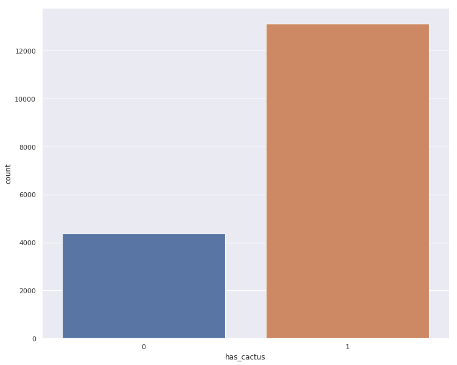

# Cactus Identification (Ensemble+Transfer Learning)

> Author: https://www.kaggle.com/harshel7

> From: https://www.kaggle.com/harshel7/cactus-identification-ensemble-transfer-learning

> License: [Apache 2.0](http://www.apache.org/licenses/LICENSE-2.0)

> Score: 0.9970

In [1]:

```py
# This Python 3 environment comes with many helpful analytics libraries installed
# It is defined by the kaggle/python docker image: https://github.com/kaggle/docker-python
# For example, here's several helpful packages to load in 

import numpy as np # linear algebra
import pandas as pd # data processing, CSV file I/O (e.g. pd.read_csv)
import glob
import os
import matplotlib.pyplot as plt
import seaborn as sns
import cv2
from tqdm import tqdm_notebook

# Input data files are available in the "../input/" directory.
# For example, running this (by clicking run or pressing Shift+Enter) will list the files in the input directory

import os
print(os.listdir("../input"))

# Any results you write to the current directory are saved as output.

```

```
['test', 'train', 'train.csv', 'sample_submission.csv']

```

In [2]:

```py
#read in all our files
train_df = pd.read_csv('../input/train.csv')
train_images = '../input/train/*'
test_images = '../input/test/*'

```

In [3]:

```py
train_df.head()

```

Out[3]:

|  | id | has_cactus |
| --- | --- | --- |
| 0 | 0004be2cfeaba1c0361d39e2b000257b.jpg | 1 |
| --- | --- | --- |
| 1 | 000c8a36845c0208e833c79c1bffedd1.jpg | 1 |
| --- | --- | --- |
| 2 | 000d1e9a533f62e55c289303b072733d.jpg | 1 |
| --- | --- | --- |
| 3 | 0011485b40695e9138e92d0b3fb55128.jpg | 1 |
| --- | --- | --- |
| 4 | 0014d7a11e90b62848904c1418fc8cf2.jpg | 1 |
| --- | --- | --- |

In [4]:

```py
sns.set(style = 'darkgrid')
plt.figure(figsize = (12,10))
sns.countplot(train_df['has_cactus'])

```

Out[4]:

```
<matplotlib.axes._subplots.AxesSubplot at 0x7f98563abac8>
```

In [5]:

```py
#let's visualize some cactus images
IMAGES = os.path.join(train_images, "*")
all_images = glob.glob(IMAGES)

```

In [6]:

```py
#visualize some images

plt.figure(figsize = (12,10))
plt.subplot(1, 3, 1)
plt.imshow(plt.imread(all_images[0]))
plt.xticks([])
plt.yticks([])

plt.subplot(1, 3, 2)
plt.imshow(plt.imread(all_images[10]))
plt.xticks([])
plt.yticks([])

plt.subplot(1, 3, 3)
plt.imshow(plt.imread(all_images[20]))
plt.xticks([])
plt.yticks([])

```

Out[6]:

```
([], <a list of 0 Text yticklabel objects>)
```

In [7]:

```py
train_path = '../input/train/train/'
test_path = '../input/test/test/'

```

In [8]:

```py
#let's get our image data and image labels toegether
#read in all the images
images_id = train_df['id'].values
X = [] #this list will contain all our images
for id_ in images_id:
    img = cv2.imread(train_path + id_)
    X.append(img)

```

In [9]:

```py
#now let's get our labels
label_list = [] #will contain all our labels
for img_id in images_id:
    label_list.append(train_df[train_df['id'] == img_id]['has_cactus'].values[0])

```

In [10]:

```py
#now we can convert our images list and the labels list into numpy array
X = np.array(X)
y = np.array(label_list)

```

In [11]:

```py
print(f"THE SIZE OF OUR TRAINING DATA : {X.shape}")
print(f"THE SIZE OF OUR TRAINING LABELS : {y.shape}")

```

```
THE SIZE OF OUR TRAINING DATA : (17500, 32, 32, 3)
THE SIZE OF OUR TRAINING LABELS : (17500,)

```

In [12]:

```py
#let's do some preprocessing such as normalizing our data
X = X.astype('float32') / 255

```

In [13]:

```py
#loading in and preprocessing the test data
X_test = []
test_images = []
for img_id in tqdm_notebook(os.listdir(test_path)):
    X_test.append(cv2.imread(test_path + img_id))     
    test_images.append(img_id)
X_test = np.array(X_test)
X_test = X_test.astype('float32') / 255

```

## BUILD CNN

In [14]:

```py
#import the required libraries
import keras
from keras.layers import Conv2D
from keras.layers import Dense
from keras.layers import BatchNormalization
from keras.layers import Flatten
from keras.layers import Activation
from keras.layers import Dropout
from keras.layers import MaxPooling2D
from keras.models import Sequential
from keras import optimizers
from keras.callbacks import ModelCheckpoint, ReduceLROnPlateau
from keras import backend as K

```

```
Using TensorFlow backend.

```

In [15]:

```py
class CNN:
    def build(height, width, classes, channels):
        model = Sequential()
        inputShape = (height, width, channels)
        chanDim = -1

        if K.image_data_format() == 'channels_first':
            inputShape = (channels, height, width)
            chanDim = 1
        model.add(Conv2D(32, (3,3), padding = 'same', input_shape = inputShape))
        model.add(BatchNormalization(axis = chanDim))
        model.add(Activation('relu'))
        model.add(Conv2D(32, (3,3), padding = 'same'))
        model.add(BatchNormalization(axis = chanDim))
        model.add(Activation('relu'))
        model.add(MaxPooling2D(2,2))
        model.add(Dropout(0.25))

        model.add(Conv2D(128, (3,3), padding = 'same', input_shape = inputShape))
        model.add(BatchNormalization(axis = chanDim))
        model.add(Activation('relu'))
        model.add(Conv2D(128, (3,3), padding = 'same'))
        model.add(BatchNormalization(axis = chanDim))
        model.add(Activation('relu'))
        model.add(MaxPooling2D(2,2))
        model.add(Dropout(0.25))

        model.add(Conv2D(256, (3,3), padding = 'same', input_shape = inputShape))
        model.add(BatchNormalization(axis = chanDim))
        model.add(Activation('relu'))
        model.add(Conv2D(256, (3,3), padding = 'same'))
        model.add(BatchNormalization(axis = chanDim))
        model.add(Activation('relu'))
        model.add(MaxPooling2D(2,2))
        model.add(Dropout(0.25))

        model.add(Flatten())

        model.add(Dense(128, activation = 'relu'))
        model.add(BatchNormalization(axis = chanDim))
        model.add(Dropout(0.5))

        model.add(Dense(32, activation = 'relu'))
        model.add(BatchNormalization(axis = chanDim))
        model.add(Dropout(0.5))

        model.add(Dense(classes, activation = 'sigmoid'))

        return model

```

## ENSEMBLE NEURAL NETWORK

OutputIn [16]:

```py
input_dim = X.shape[1:]
activation = 'relu'
classes = 1
height = 32
width = 32
channels = 3

history = dict() #dictionery to store the history of individual models for later visualization
prediction_scores = dict() #dictionery to store the predicted scores of individual models on the test dataset

#here we will be training the same model for a total of 10 times and will be considering the mean of the output values for predictions
for i in np.arange(0, 5):
    optim = optimizers.Adam(lr = 0.001)
    ensemble_model = CNN.build(height = height, width = width, classes = classes, channels = channels)
    ensemble_model.compile(loss = 'binary_crossentropy', optimizer = optim, metrics = ['accuracy'])
    print('TRAINING MODEL NO : {}'.format(i))
    H = ensemble_model.fit(X, y,
                           batch_size = 32,
                           epochs = 200,
                           verbose = 1)
    history[i] = H

    ensemble_model.save('MODEL_{}.model'.format(i))

    predictions = ensemble_model.predict(X_test, verbose = 1, batch_size = 32)
    prediction_scores[i] = predictions

```

```
TRAINING MODEL NO : 0
Epoch 1/200
17500/17500 [==============================] - 12s 711us/step - loss: 0.2101 - acc: 0.9271
Epoch 2/200
17500/17500 [==============================] - 8s 461us/step - loss: 0.0847 - acc: 0.9743
Epoch 3/200
17500/17500 [==============================] - 8s 467us/step - loss: 0.0669 - acc: 0.9787
Epoch 4/200
17500/17500 [==============================] - 8s 460us/step - loss: 0.0560 - acc: 0.9831
Epoch 5/200
17500/17500 [==============================] - 8s 463us/step - loss: 0.0398 - acc: 0.9883
Epoch 6/200
17500/17500 [==============================] - 8s 461us/step - loss: 0.0435 - acc: 0.9875
Epoch 7/200
17500/17500 [==============================] - 8s 460us/step - loss: 0.0310 - acc: 0.9905
Epoch 8/200
17500/17500 [==============================] - 8s 461us/step - loss: 0.0294 - acc: 0.9914
Epoch 9/200
17500/17500 [==============================] - 8s 457us/step - loss: 0.0223 - acc: 0.9937
Epoch 10/200
17500/17500 [==============================] - 8s 458us/step - loss: 0.0260 - acc: 0.9921
Epoch 11/200
17500/17500 [==============================] - 8s 460us/step - loss: 0.0248 - acc: 0.9931
Epoch 12/200
17500/17500 [==============================] - 8s 460us/step - loss: 0.0168 - acc: 0.9946
Epoch 13/200
17500/17500 [==============================] - 8s 460us/step - loss: 0.0230 - acc: 0.9933
Epoch 14/200
17500/17500 [==============================] - 8s 458us/step - loss: 0.0149 - acc: 0.9955
Epoch 15/200
17500/17500 [==============================] - 8s 458us/step - loss: 0.0171 - acc: 0.9949
Epoch 16/200
17500/17500 [==============================] - 8s 459us/step - loss: 0.0141 - acc: 0.9964
Epoch 17/200
17500/17500 [==============================] - 8s 458us/step - loss: 0.0107 - acc: 0.9969
Epoch 18/200
17500/17500 [==============================] - 8s 460us/step - loss: 0.0118 - acc: 0.9966
Epoch 19/200
17500/17500 [==============================] - 8s 459us/step - loss: 0.0116 - acc: 0.9966
Epoch 20/200
17500/17500 [==============================] - 8s 458us/step - loss: 0.0113 - acc: 0.9966
Epoch 21/200
17500/17500 [==============================] - 8s 458us/step - loss: 0.0081 - acc: 0.9980
Epoch 22/200
17500/17500 [==============================] - 8s 460us/step - loss: 0.0102 - acc: 0.9969
Epoch 23/200
17500/17500 [==============================] - 8s 459us/step - loss: 0.0080 - acc: 0.9978
Epoch 24/200
17500/17500 [==============================] - 8s 460us/step - loss: 0.0103 - acc: 0.9973
Epoch 25/200
17500/17500 [==============================] - 8s 460us/step - loss: 0.0071 - acc: 0.9981
Epoch 26/200
17500/17500 [==============================] - 9s 504us/step - loss: 0.0060 - acc: 0.9982
Epoch 27/200
17500/17500 [==============================] - 8s 458us/step - loss: 0.0087 - acc: 0.9975
Epoch 28/200
17500/17500 [==============================] - 8s 457us/step - loss: 0.0079 - acc: 0.9974
Epoch 29/200
17500/17500 [==============================] - 8s 461us/step - loss: 0.0036 - acc: 0.9987
Epoch 30/200
17500/17500 [==============================] - 8s 458us/step - loss: 0.0045 - acc: 0.9986
Epoch 31/200
17500/17500 [==============================] - 8s 457us/step - loss: 0.0095 - acc: 0.9975
Epoch 32/200
17500/17500 [==============================] - 9s 494us/step - loss: 0.0064 - acc: 0.9976
Epoch 33/200
17500/17500 [==============================] - 9s 514us/step - loss: 0.0058 - acc: 0.9982
Epoch 34/200
17500/17500 [==============================] - 8s 460us/step - loss: 0.0061 - acc: 0.9984
Epoch 35/200
17500/17500 [==============================] - 8s 459us/step - loss: 0.0015 - acc: 0.9997
Epoch 36/200
17500/17500 [==============================] - 8s 459us/step - loss: 0.0065 - acc: 0.9981
Epoch 37/200
17500/17500 [==============================] - 8s 461us/step - loss: 0.0058 - acc: 0.9982
Epoch 38/200
17500/17500 [==============================] - 8s 459us/step - loss: 0.0035 - acc: 0.9989
Epoch 39/200
17500/17500 [==============================] - 8s 460us/step - loss: 0.0030 - acc: 0.9991
Epoch 40/200
17500/17500 [==============================] - 8s 459us/step - loss: 0.0049 - acc: 0.9985
Epoch 41/200
17500/17500 [==============================] - 8s 465us/step - loss: 0.0044 - acc: 0.9987
Epoch 42/200
17500/17500 [==============================] - 8s 459us/step - loss: 0.0032 - acc: 0.9990
Epoch 43/200
17500/17500 [==============================] - 8s 458us/step - loss: 0.0086 - acc: 0.9974
Epoch 44/200
17500/17500 [==============================] - 8s 460us/step - loss: 0.0027 - acc: 0.9991
Epoch 45/200
17500/17500 [==============================] - 8s 461us/step - loss: 0.0020 - acc: 0.9997
Epoch 46/200
 3488/17500 [====>.........................] - ETA: 6s - loss: 2.9141e-04 - acc: 1.0000
```

## VGG16

In [17]:

```py
from keras.applications.vgg16 import VGG16

```

In [18]:

```py
vgg16 = VGG16(weights = 'imagenet', input_shape = (32, 32, 3), include_top = False)
vgg16.summary()

```

```
Downloading data from https://github.com/fchollet/deep-learning-models/releases/download/v0.1/vgg16_weights_tf_dim_ordering_tf_kernels_notop.h5
58892288/58889256 [==============================] - 1s 0us/step
_________________________________________________________________
Layer (type)                 Output Shape              Param #   
=================================================================
input_1 (InputLayer)         (None, 32, 32, 3)         0         
_________________________________________________________________
block1_conv1 (Conv2D)        (None, 32, 32, 64)        1792      
_________________________________________________________________
block1_conv2 (Conv2D)        (None, 32, 32, 64)        36928     
_________________________________________________________________
block1_pool (MaxPooling2D)   (None, 16, 16, 64)        0         
_________________________________________________________________
block2_conv1 (Conv2D)        (None, 16, 16, 128)       73856     
_________________________________________________________________
block2_conv2 (Conv2D)        (None, 16, 16, 128)       147584    
_________________________________________________________________
block2_pool (MaxPooling2D)   (None, 8, 8, 128)         0         
_________________________________________________________________
block3_conv1 (Conv2D)        (None, 8, 8, 256)         295168    
_________________________________________________________________
block3_conv2 (Conv2D)        (None, 8, 8, 256)         590080    
_________________________________________________________________
block3_conv3 (Conv2D)        (None, 8, 8, 256)         590080    
_________________________________________________________________
block3_pool (MaxPooling2D)   (None, 4, 4, 256)         0         
_________________________________________________________________
block4_conv1 (Conv2D)        (None, 4, 4, 512)         1180160   
_________________________________________________________________
block4_conv2 (Conv2D)        (None, 4, 4, 512)         2359808   
_________________________________________________________________
block4_conv3 (Conv2D)        (None, 4, 4, 512)         2359808   
_________________________________________________________________
block4_pool (MaxPooling2D)   (None, 2, 2, 512)         0         
_________________________________________________________________
block5_conv1 (Conv2D)        (None, 2, 2, 512)         2359808   
_________________________________________________________________
block5_conv2 (Conv2D)        (None, 2, 2, 512)         2359808   
_________________________________________________________________
block5_conv3 (Conv2D)        (None, 2, 2, 512)         2359808   
_________________________________________________________________
block5_pool (MaxPooling2D)   (None, 1, 1, 512)         0         
=================================================================
Total params: 14,714,688
Trainable params: 14,714,688
Non-trainable params: 0
_________________________________________________________________

```

In [19]:

```py
for layer in vgg16.layers:
    layer.trainable = False

```

In [20]:

```py
vgg_model = Sequential()
vgg_model.add(vgg16)
vgg_model.add(Flatten())
vgg_model.add(Dense(256, activation = 'relu'))
vgg_model.add(BatchNormalization())
vgg_model.add(Dropout(0.5))
vgg_model.add(Dense(128, activation = 'relu'))
vgg_model.add(BatchNormalization())
vgg_model.add(Dropout(0.5))
vgg_model.add(Dense(1, activation = 'sigmoid'))

vgg_model.summary()

```

```
_________________________________________________________________
Layer (type)                 Output Shape              Param #   
=================================================================
vgg16 (Model)                (None, 1, 1, 512)         14714688  
_________________________________________________________________
flatten_6 (Flatten)          (None, 512)               0         
_________________________________________________________________
dense_16 (Dense)             (None, 256)               131328    
_________________________________________________________________
batch_normalization_41 (Batc (None, 256)               1024      
_________________________________________________________________
dropout_26 (Dropout)         (None, 256)               0         
_________________________________________________________________
dense_17 (Dense)             (None, 128)               32896     
_________________________________________________________________
batch_normalization_42 (Batc (None, 128)               512       
_________________________________________________________________
dropout_27 (Dropout)         (None, 128)               0         
_________________________________________________________________
dense_18 (Dense)             (None, 1)                 129       
=================================================================
Total params: 14,880,577
Trainable params: 165,121
Non-trainable params: 14,715,456
_________________________________________________________________

```

In [21]:

```py
#compile the model
vgg_model.compile(loss = 'binary_crossentropy', optimizer = optim, metrics = ['accuracy'])

```

In [22]:

```py
#fit the model on our data
vgg_history = vgg_model.fit(X, y,
                            batch_size = 64,
                            epochs = 500,
                            verbose = 1) 

```

```
Epoch 1/500
17500/17500 [==============================] - 6s 320us/step - loss: 0.1719 - acc: 0.9358
Epoch 2/500
17500/17500 [==============================] - 4s 203us/step - loss: 0.1074 - acc: 0.9611
Epoch 3/500
17500/17500 [==============================] - 4s 203us/step - loss: 0.0990 - acc: 0.9636
Epoch 4/500
17500/17500 [==============================] - 4s 203us/step - loss: 0.0892 - acc: 0.9658
Epoch 5/500
17500/17500 [==============================] - 4s 203us/step - loss: 0.0869 - acc: 0.9683
Epoch 6/500
17500/17500 [==============================] - 4s 203us/step - loss: 0.0828 - acc: 0.9701
Epoch 7/500
17500/17500 [==============================] - 4s 203us/step - loss: 0.0766 - acc: 0.9723
Epoch 8/500
17500/17500 [==============================] - 4s 201us/step - loss: 0.0802 - acc: 0.9686
Epoch 9/500
17500/17500 [==============================] - 4s 202us/step - loss: 0.0755 - acc: 0.9718
Epoch 10/500
17500/17500 [==============================] - 4s 202us/step - loss: 0.0752 - acc: 0.9714
Epoch 11/500
17500/17500 [==============================] - 4s 201us/step - loss: 0.0719 - acc: 0.9731
Epoch 12/500
17500/17500 [==============================] - 4s 202us/step - loss: 0.0718 - acc: 0.9762
Epoch 13/500
17500/17500 [==============================] - 4s 201us/step - loss: 0.0702 - acc: 0.9744
Epoch 14/500
17500/17500 [==============================] - 4s 203us/step - loss: 0.0694 - acc: 0.9745
Epoch 15/500
17500/17500 [==============================] - 4s 202us/step - loss: 0.0687 - acc: 0.9751
Epoch 16/500
17500/17500 [==============================] - 3s 200us/step - loss: 0.0699 - acc: 0.9752
Epoch 17/500
17500/17500 [==============================] - 4s 203us/step - loss: 0.0667 - acc: 0.9755
Epoch 18/500
17500/17500 [==============================] - 4s 203us/step - loss: 0.0639 - acc: 0.9765
Epoch 19/500
17500/17500 [==============================] - 4s 203us/step - loss: 0.0636 - acc: 0.9763
Epoch 20/500
17500/17500 [==============================] - 4s 202us/step - loss: 0.0661 - acc: 0.9759
Epoch 21/500
17500/17500 [==============================] - 4s 202us/step - loss: 0.0607 - acc: 0.9777
Epoch 22/500
17500/17500 [==============================] - 4s 201us/step - loss: 0.0627 - acc: 0.9763
Epoch 23/500
17500/17500 [==============================] - 4s 203us/step - loss: 0.0609 - acc: 0.9781
Epoch 24/500
17500/17500 [==============================] - 4s 205us/step - loss: 0.0618 - acc: 0.9776
Epoch 25/500
17500/17500 [==============================] - 4s 229us/step - loss: 0.0636 - acc: 0.9764
Epoch 26/500
17500/17500 [==============================] - 4s 229us/step - loss: 0.0623 - acc: 0.9777
Epoch 27/500
17500/17500 [==============================] - 4s 215us/step - loss: 0.0576 - acc: 0.9797
Epoch 28/500
17500/17500 [==============================] - 4s 202us/step - loss: 0.0604 - acc: 0.9779
Epoch 29/500
17500/17500 [==============================] - 4s 203us/step - loss: 0.0590 - acc: 0.9782
Epoch 30/500
17500/17500 [==============================] - 4s 201us/step - loss: 0.0600 - acc: 0.9779
Epoch 31/500
17500/17500 [==============================] - 4s 201us/step - loss: 0.0557 - acc: 0.9782
Epoch 32/500
17500/17500 [==============================] - 4s 201us/step - loss: 0.0586 - acc: 0.9778
Epoch 33/500
17500/17500 [==============================] - 4s 203us/step - loss: 0.0575 - acc: 0.9791
Epoch 34/500
17500/17500 [==============================] - 4s 203us/step - loss: 0.0586 - acc: 0.9777
Epoch 35/500
17500/17500 [==============================] - 4s 202us/step - loss: 0.0609 - acc: 0.9779
Epoch 36/500
17500/17500 [==============================] - 4s 203us/step - loss: 0.0544 - acc: 0.9805
Epoch 37/500
17500/17500 [==============================] - 4s 202us/step - loss: 0.0550 - acc: 0.9800
Epoch 38/500
17500/17500 [==============================] - 4s 202us/step - loss: 0.0560 - acc: 0.9797
Epoch 39/500
17500/17500 [==============================] - 4s 202us/step - loss: 0.0554 - acc: 0.9796
Epoch 40/500
17500/17500 [==============================] - 4s 204us/step - loss: 0.0581 - acc: 0.9791
Epoch 41/500
17500/17500 [==============================] - 4s 201us/step - loss: 0.0549 - acc: 0.9795
Epoch 42/500
17500/17500 [==============================] - 4s 203us/step - loss: 0.0544 - acc: 0.9799
Epoch 43/500
17500/17500 [==============================] - 4s 202us/step - loss: 0.0544 - acc: 0.9801
Epoch 44/500
17500/17500 [==============================] - 4s 201us/step - loss: 0.0534 - acc: 0.9803
Epoch 45/500
17500/17500 [==============================] - 4s 201us/step - loss: 0.0526 - acc: 0.9812
Epoch 46/500
17500/17500 [==============================] - 4s 203us/step - loss: 0.0547 - acc: 0.9801
Epoch 47/500
17500/17500 [==============================] - 4s 204us/step - loss: 0.0536 - acc: 0.9800
Epoch 48/500
17500/17500 [==============================] - 4s 202us/step - loss: 0.0492 - acc: 0.9817
Epoch 49/500
17500/17500 [==============================] - 4s 202us/step - loss: 0.0553 - acc: 0.9802
Epoch 50/500
17500/17500 [==============================] - 4s 202us/step - loss: 0.0502 - acc: 0.9820
Epoch 51/500
17500/17500 [==============================] - 4s 201us/step - loss: 0.0505 - acc: 0.9823
Epoch 52/500
17500/17500 [==============================] - 4s 203us/step - loss: 0.0534 - acc: 0.9801
Epoch 53/500
17500/17500 [==============================] - 4s 204us/step - loss: 0.0505 - acc: 0.9809
Epoch 54/500
17500/17500 [==============================] - 4s 202us/step - loss: 0.0460 - acc: 0.9831
Epoch 55/500
17500/17500 [==============================] - 4s 203us/step - loss: 0.0492 - acc: 0.9819
Epoch 56/500
17500/17500 [==============================] - 4s 201us/step - loss: 0.0481 - acc: 0.9826
Epoch 57/500
17500/17500 [==============================] - 4s 203us/step - loss: 0.0515 - acc: 0.9814
Epoch 58/500
17500/17500 [==============================] - 4s 201us/step - loss: 0.0495 - acc: 0.9816
Epoch 59/500
17500/17500 [==============================] - 4s 203us/step - loss: 0.0476 - acc: 0.9837
Epoch 60/500
17500/17500 [==============================] - 4s 203us/step - loss: 0.0483 - acc: 0.9821
Epoch 61/500
17500/17500 [==============================] - 4s 216us/step - loss: 0.0456 - acc: 0.9830
Epoch 62/500
17500/17500 [==============================] - 4s 227us/step - loss: 0.0472 - acc: 0.9829
Epoch 63/500
17500/17500 [==============================] - 4s 202us/step - loss: 0.0462 - acc: 0.9833
Epoch 64/500
17500/17500 [==============================] - 4s 202us/step - loss: 0.0496 - acc: 0.9828
Epoch 65/500
17500/17500 [==============================] - 4s 202us/step - loss: 0.0482 - acc: 0.9826
Epoch 66/500
17500/17500 [==============================] - 4s 202us/step - loss: 0.0477 - acc: 0.9828
Epoch 67/500
17500/17500 [==============================] - 4s 201us/step - loss: 0.0465 - acc: 0.9825
Epoch 68/500
17500/17500 [==============================] - 4s 203us/step - loss: 0.0481 - acc: 0.9827
Epoch 69/500
17500/17500 [==============================] - 4s 202us/step - loss: 0.0470 - acc: 0.9830
Epoch 70/500
17500/17500 [==============================] - 4s 202us/step - loss: 0.0469 - acc: 0.9833
Epoch 71/500
17500/17500 [==============================] - 4s 203us/step - loss: 0.0470 - acc: 0.9819
Epoch 72/500
17500/17500 [==============================] - 4s 203us/step - loss: 0.0471 - acc: 0.9829
Epoch 73/500
17500/17500 [==============================] - 4s 201us/step - loss: 0.0466 - acc: 0.9835
Epoch 74/500
17500/17500 [==============================] - 4s 202us/step - loss: 0.0461 - acc: 0.9838
Epoch 75/500
17500/17500 [==============================] - 4s 201us/step - loss: 0.0439 - acc: 0.9841
Epoch 76/500
17500/17500 [==============================] - 4s 203us/step - loss: 0.0462 - acc: 0.9830
Epoch 77/500
17500/17500 [==============================] - 4s 203us/step - loss: 0.0465 - acc: 0.9831
Epoch 78/500
17500/17500 [==============================] - 4s 201us/step - loss: 0.0452 - acc: 0.9832
Epoch 79/500
17500/17500 [==============================] - 4s 205us/step - loss: 0.0452 - acc: 0.9829
Epoch 80/500
17500/17500 [==============================] - 4s 204us/step - loss: 0.0444 - acc: 0.9835
Epoch 81/500
17500/17500 [==============================] - 4s 201us/step - loss: 0.0463 - acc: 0.9823
Epoch 82/500
17500/17500 [==============================] - 4s 203us/step - loss: 0.0461 - acc: 0.9829
Epoch 83/500
17500/17500 [==============================] - 4s 201us/step - loss: 0.0436 - acc: 0.9845
Epoch 84/500
17500/17500 [==============================] - 4s 202us/step - loss: 0.0468 - acc: 0.9837
Epoch 85/500
17500/17500 [==============================] - 4s 203us/step - loss: 0.0405 - acc: 0.9850
Epoch 86/500
17500/17500 [==============================] - 4s 201us/step - loss: 0.0416 - acc: 0.9845
Epoch 87/500
17500/17500 [==============================] - 4s 202us/step - loss: 0.0419 - acc: 0.9842
Epoch 88/500
17500/17500 [==============================] - 4s 202us/step - loss: 0.0439 - acc: 0.9841
Epoch 89/500
17500/17500 [==============================] - 4s 200us/step - loss: 0.0393 - acc: 0.9858
Epoch 90/500
17500/17500 [==============================] - 4s 202us/step - loss: 0.0440 - acc: 0.9853
Epoch 91/500
17500/17500 [==============================] - 4s 203us/step - loss: 0.0428 - acc: 0.9847
Epoch 92/500
17500/17500 [==============================] - 4s 202us/step - loss: 0.0451 - acc: 0.9838
Epoch 93/500
17500/17500 [==============================] - 4s 202us/step - loss: 0.0410 - acc: 0.9849
Epoch 94/500
17500/17500 [==============================] - 4s 202us/step - loss: 0.0419 - acc: 0.9846
Epoch 95/500
17500/17500 [==============================] - 4s 203us/step - loss: 0.0427 - acc: 0.9847
Epoch 96/500
17500/17500 [==============================] - 4s 203us/step - loss: 0.0394 - acc: 0.9855
Epoch 97/500
17500/17500 [==============================] - 4s 202us/step - loss: 0.0419 - acc: 0.9844
Epoch 98/500
17500/17500 [==============================] - 4s 202us/step - loss: 0.0412 - acc: 0.9850
Epoch 99/500
17500/17500 [==============================] - 4s 202us/step - loss: 0.0390 - acc: 0.9859
Epoch 100/500
17500/17500 [==============================] - 4s 201us/step - loss: 0.0442 - acc: 0.9843
Epoch 101/500
17500/17500 [==============================] - 4s 203us/step - loss: 0.0414 - acc: 0.9853
Epoch 102/500
17500/17500 [==============================] - 4s 204us/step - loss: 0.0414 - acc: 0.9844
Epoch 103/500
17500/17500 [==============================] - 4s 203us/step - loss: 0.0390 - acc: 0.9864
Epoch 104/500
17500/17500 [==============================] - 4s 204us/step - loss: 0.0426 - acc: 0.9846
Epoch 105/500
17500/17500 [==============================] - 4s 203us/step - loss: 0.0394 - acc: 0.9859
Epoch 106/500
17500/17500 [==============================] - 4s 202us/step - loss: 0.0399 - acc: 0.9861
Epoch 107/500
17500/17500 [==============================] - 4s 202us/step - loss: 0.0398 - acc: 0.9857
Epoch 108/500
17500/17500 [==============================] - 4s 203us/step - loss: 0.0426 - acc: 0.9851
Epoch 109/500
17500/17500 [==============================] - 4s 203us/step - loss: 0.0407 - acc: 0.9852
Epoch 110/500
17500/17500 [==============================] - 4s 203us/step - loss: 0.0421 - acc: 0.9847
Epoch 111/500
17500/17500 [==============================] - 4s 204us/step - loss: 0.0386 - acc: 0.9860
Epoch 112/500
17500/17500 [==============================] - 4s 227us/step - loss: 0.0422 - acc: 0.9847
Epoch 113/500
17500/17500 [==============================] - 4s 230us/step - loss: 0.0382 - acc: 0.9863
Epoch 114/500
17500/17500 [==============================] - 4s 219us/step - loss: 0.0386 - acc: 0.9865
Epoch 115/500
17500/17500 [==============================] - 4s 203us/step - loss: 0.0391 - acc: 0.9857
Epoch 116/500
17500/17500 [==============================] - 4s 202us/step - loss: 0.0406 - acc: 0.9843
Epoch 117/500
17500/17500 [==============================] - 4s 200us/step - loss: 0.0376 - acc: 0.9864
Epoch 118/500
17500/17500 [==============================] - 4s 202us/step - loss: 0.0397 - acc: 0.9853
Epoch 119/500
17500/17500 [==============================] - 4s 202us/step - loss: 0.0394 - acc: 0.9861
Epoch 120/500
17500/17500 [==============================] - 4s 201us/step - loss: 0.0365 - acc: 0.9866
Epoch 121/500
17500/17500 [==============================] - 4s 202us/step - loss: 0.0391 - acc: 0.9855
Epoch 122/500
17500/17500 [==============================] - 4s 202us/step - loss: 0.0383 - acc: 0.9861
Epoch 123/500
17500/17500 [==============================] - 4s 202us/step - loss: 0.0360 - acc: 0.9874
Epoch 124/500
17500/17500 [==============================] - 4s 201us/step - loss: 0.0357 - acc: 0.9869
Epoch 125/500
17500/17500 [==============================] - 4s 202us/step - loss: 0.0376 - acc: 0.9862
Epoch 126/500
17500/17500 [==============================] - 4s 201us/step - loss: 0.0389 - acc: 0.9855
Epoch 127/500
17500/17500 [==============================] - 4s 202us/step - loss: 0.0405 - acc: 0.9852
Epoch 128/500
17500/17500 [==============================] - 4s 203us/step - loss: 0.0370 - acc: 0.9861
Epoch 129/500
17500/17500 [==============================] - 4s 202us/step - loss: 0.0378 - acc: 0.9867
Epoch 130/500
17500/17500 [==============================] - 4s 203us/step - loss: 0.0367 - acc: 0.9861
Epoch 131/500
17500/17500 [==============================] - 4s 202us/step - loss: 0.0375 - acc: 0.9861
Epoch 132/500
17500/17500 [==============================] - 4s 201us/step - loss: 0.0376 - acc: 0.9860
Epoch 133/500
17500/17500 [==============================] - 4s 202us/step - loss: 0.0380 - acc: 0.9867
Epoch 134/500
17500/17500 [==============================] - 3s 200us/step - loss: 0.0394 - acc: 0.9866
Epoch 135/500
17500/17500 [==============================] - 4s 201us/step - loss: 0.0371 - acc: 0.9875
Epoch 136/500
17500/17500 [==============================] - 4s 204us/step - loss: 0.0399 - acc: 0.9859
Epoch 137/500
17500/17500 [==============================] - 4s 203us/step - loss: 0.0377 - acc: 0.9874
Epoch 138/500
17500/17500 [==============================] - 4s 202us/step - loss: 0.0368 - acc: 0.9874
Epoch 139/500
17500/17500 [==============================] - 4s 202us/step - loss: 0.0400 - acc: 0.9851
Epoch 140/500
17500/17500 [==============================] - 4s 201us/step - loss: 0.0395 - acc: 0.9854
Epoch 141/500
17500/17500 [==============================] - 4s 203us/step - loss: 0.0366 - acc: 0.9869
Epoch 142/500
17500/17500 [==============================] - 4s 202us/step - loss: 0.0375 - acc: 0.9871
Epoch 143/500
17500/17500 [==============================] - 4s 202us/step - loss: 0.0354 - acc: 0.9881
Epoch 144/500
17500/17500 [==============================] - 4s 202us/step - loss: 0.0367 - acc: 0.9861
Epoch 145/500
17500/17500 [==============================] - 4s 202us/step - loss: 0.0380 - acc: 0.9864
Epoch 146/500
17500/17500 [==============================] - 4s 202us/step - loss: 0.0352 - acc: 0.9876
Epoch 147/500
17500/17500 [==============================] - 4s 221us/step - loss: 0.0343 - acc: 0.9874
Epoch 148/500
17500/17500 [==============================] - 4s 219us/step - loss: 0.0351 - acc: 0.9873
Epoch 149/500
17500/17500 [==============================] - 4s 201us/step - loss: 0.0364 - acc: 0.9863
Epoch 150/500
17500/17500 [==============================] - 4s 202us/step - loss: 0.0376 - acc: 0.9870
Epoch 151/500
17500/17500 [==============================] - 4s 201us/step - loss: 0.0385 - acc: 0.9869
Epoch 152/500
17500/17500 [==============================] - 4s 202us/step - loss: 0.0342 - acc: 0.9883
Epoch 153/500
17500/17500 [==============================] - 4s 203us/step - loss: 0.0355 - acc: 0.9867
Epoch 154/500
17500/17500 [==============================] - 4s 202us/step - loss: 0.0338 - acc: 0.9874
Epoch 155/500
17500/17500 [==============================] - 4s 201us/step - loss: 0.0360 - acc: 0.9868
Epoch 156/500
17500/17500 [==============================] - 4s 202us/step - loss: 0.0329 - acc: 0.9874
Epoch 157/500
17500/17500 [==============================] - 4s 202us/step - loss: 0.0383 - acc: 0.9856
Epoch 158/500
17500/17500 [==============================] - 4s 202us/step - loss: 0.0362 - acc: 0.9872
Epoch 159/500
17500/17500 [==============================] - 4s 201us/step - loss: 0.0361 - acc: 0.9862
Epoch 160/500
17500/17500 [==============================] - 4s 201us/step - loss: 0.0361 - acc: 0.9866
Epoch 161/500
17500/17500 [==============================] - 4s 202us/step - loss: 0.0342 - acc: 0.9875
Epoch 162/500
17500/17500 [==============================] - 4s 201us/step - loss: 0.0348 - acc: 0.9873
Epoch 163/500
17500/17500 [==============================] - 4s 202us/step - loss: 0.0350 - acc: 0.9871
Epoch 164/500
17500/17500 [==============================] - 4s 206us/step - loss: 0.0364 - acc: 0.9859
Epoch 165/500
17500/17500 [==============================] - 4s 205us/step - loss: 0.0317 - acc: 0.9881
Epoch 166/500
17500/17500 [==============================] - 3s 200us/step - loss: 0.0355 - acc: 0.9872
Epoch 167/500
17500/17500 [==============================] - 4s 203us/step - loss: 0.0406 - acc: 0.9864
Epoch 168/500
17500/17500 [==============================] - 4s 202us/step - loss: 0.0364 - acc: 0.9866
Epoch 169/500
17500/17500 [==============================] - 4s 202us/step - loss: 0.0352 - acc: 0.9879
Epoch 170/500
17500/17500 [==============================] - 4s 202us/step - loss: 0.0366 - acc: 0.9869
Epoch 171/500
17500/17500 [==============================] - 4s 203us/step - loss: 0.0362 - acc: 0.9872
Epoch 172/500
17500/17500 [==============================] - 4s 201us/step - loss: 0.0359 - acc: 0.9866
Epoch 173/500
17500/17500 [==============================] - 4s 202us/step - loss: 0.0345 - acc: 0.9869
Epoch 174/500
17500/17500 [==============================] - 4s 201us/step - loss: 0.0364 - acc: 0.9877
Epoch 175/500
17500/17500 [==============================] - 4s 202us/step - loss: 0.0339 - acc: 0.9875
Epoch 176/500
17500/17500 [==============================] - 4s 201us/step - loss: 0.0356 - acc: 0.9871
Epoch 177/500
17500/17500 [==============================] - 4s 201us/step - loss: 0.0323 - acc: 0.9886
Epoch 178/500
17500/17500 [==============================] - 4s 202us/step - loss: 0.0336 - acc: 0.9882
Epoch 179/500
17500/17500 [==============================] - 4s 202us/step - loss: 0.0336 - acc: 0.9886
Epoch 180/500
 4928/17500 [=======>......................] - ETA: 2s - loss: 0.0328 - acc: 0.9874
```

In [23]:

```py
#making predictions on test dat
predictions_vgg = vgg_model.predict(X_test)

```

In [24]:

```py
predictions_vgg.shape

```

Out[24]:

```
(4000, 1)
```

## RESNET50

In [25]:

```py
from keras.applications.resnet50 import ResNet50

```

OutputIn [26]:

```py
resnet = ResNet50(weights = 'imagenet', input_shape = (32, 32, 3), include_top = False)
resnet.summary()

```

```
/opt/conda/lib/python3.6/site-packages/keras_applications/resnet50.py:265: UserWarning: The output shape of `ResNet50(include_top=False)` has been changed since Keras 2.2.0.
  warnings.warn('The output shape of `ResNet50(include_top=False)` '

```

```
Downloading data from https://github.com/fchollet/deep-learning-models/releases/download/v0.2/resnet50_weights_tf_dim_ordering_tf_kernels_notop.h5
94658560/94653016 [==============================] - 1s 0us/step
__________________________________________________________________________________________________
Layer (type)                    Output Shape         Param #     Connected to                     
==================================================================================================
input_2 (InputLayer)            (None, 32, 32, 3)    0                                            
__________________________________________________________________________________________________
conv1_pad (ZeroPadding2D)       (None, 38, 38, 3)    0           input_2[0][0]                    
__________________________________________________________________________________________________
conv1 (Conv2D)                  (None, 16, 16, 64)   9472        conv1_pad[0][0]                  
__________________________________________________________________________________________________
bn_conv1 (BatchNormalization)   (None, 16, 16, 64)   256         conv1[0][0]                      
__________________________________________________________________________________________________
activation_31 (Activation)      (None, 16, 16, 64)   0           bn_conv1[0][0]                   
__________________________________________________________________________________________________
pool1_pad (ZeroPadding2D)       (None, 18, 18, 64)   0           activation_31[0][0]              
__________________________________________________________________________________________________
max_pooling2d_16 (MaxPooling2D) (None, 8, 8, 64)     0           pool1_pad[0][0]                  
__________________________________________________________________________________________________
res2a_branch2a (Conv2D)         (None, 8, 8, 64)     4160        max_pooling2d_16[0][0]           
__________________________________________________________________________________________________
bn2a_branch2a (BatchNormalizati (None, 8, 8, 64)     256         res2a_branch2a[0][0]             
__________________________________________________________________________________________________
activation_32 (Activation)      (None, 8, 8, 64)     0           bn2a_branch2a[0][0]              
__________________________________________________________________________________________________
res2a_branch2b (Conv2D)         (None, 8, 8, 64)     36928       activation_32[0][0]              
__________________________________________________________________________________________________
bn2a_branch2b (BatchNormalizati (None, 8, 8, 64)     256         res2a_branch2b[0][0]             
__________________________________________________________________________________________________
activation_33 (Activation)      (None, 8, 8, 64)     0           bn2a_branch2b[0][0]              
__________________________________________________________________________________________________
res2a_branch2c (Conv2D)         (None, 8, 8, 256)    16640       activation_33[0][0]              
__________________________________________________________________________________________________
res2a_branch1 (Conv2D)          (None, 8, 8, 256)    16640       max_pooling2d_16[0][0]           
__________________________________________________________________________________________________
bn2a_branch2c (BatchNormalizati (None, 8, 8, 256)    1024        res2a_branch2c[0][0]             
__________________________________________________________________________________________________
bn2a_branch1 (BatchNormalizatio (None, 8, 8, 256)    1024        res2a_branch1[0][0]              
__________________________________________________________________________________________________
add_1 (Add)                     (None, 8, 8, 256)    0           bn2a_branch2c[0][0]              
                                                                 bn2a_branch1[0][0]               
__________________________________________________________________________________________________
activation_34 (Activation)      (None, 8, 8, 256)    0           add_1[0][0]                      
__________________________________________________________________________________________________
res2b_branch2a (Conv2D)         (None, 8, 8, 64)     16448       activation_34[0][0]              
__________________________________________________________________________________________________
bn2b_branch2a (BatchNormalizati (None, 8, 8, 64)     256         res2b_branch2a[0][0]             
__________________________________________________________________________________________________
activation_35 (Activation)      (None, 8, 8, 64)     0           bn2b_branch2a[0][0]              
__________________________________________________________________________________________________
res2b_branch2b (Conv2D)         (None, 8, 8, 64)     36928       activation_35[0][0]              
__________________________________________________________________________________________________
bn2b_branch2b (BatchNormalizati (None, 8, 8, 64)     256         res2b_branch2b[0][0]             
__________________________________________________________________________________________________
activation_36 (Activation)      (None, 8, 8, 64)     0           bn2b_branch2b[0][0]              
__________________________________________________________________________________________________
res2b_branch2c (Conv2D)         (None, 8, 8, 256)    16640       activation_36[0][0]              
__________________________________________________________________________________________________
bn2b_branch2c (BatchNormalizati (None, 8, 8, 256)    1024        res2b_branch2c[0][0]             
__________________________________________________________________________________________________
add_2 (Add)                     (None, 8, 8, 256)    0           bn2b_branch2c[0][0]              
                                                                 activation_34[0][0]              
__________________________________________________________________________________________________
activation_37 (Activation)      (None, 8, 8, 256)    0           add_2[0][0]                      
__________________________________________________________________________________________________
res2c_branch2a (Conv2D)         (None, 8, 8, 64)     16448       activation_37[0][0]              
__________________________________________________________________________________________________
bn2c_branch2a (BatchNormalizati (None, 8, 8, 64)     256         res2c_branch2a[0][0]             
__________________________________________________________________________________________________
activation_38 (Activation)      (None, 8, 8, 64)     0           bn2c_branch2a[0][0]              
__________________________________________________________________________________________________
res2c_branch2b (Conv2D)         (None, 8, 8, 64)     36928       activation_38[0][0]              
__________________________________________________________________________________________________
bn2c_branch2b (BatchNormalizati (None, 8, 8, 64)     256         res2c_branch2b[0][0]             
__________________________________________________________________________________________________
activation_39 (Activation)      (None, 8, 8, 64)     0           bn2c_branch2b[0][0]              
__________________________________________________________________________________________________
res2c_branch2c (Conv2D)         (None, 8, 8, 256)    16640       activation_39[0][0]              
__________________________________________________________________________________________________
bn2c_branch2c (BatchNormalizati (None, 8, 8, 256)    1024        res2c_branch2c[0][0]             
__________________________________________________________________________________________________
add_3 (Add)                     (None, 8, 8, 256)    0           bn2c_branch2c[0][0]              
                                                                 activation_37[0][0]              
__________________________________________________________________________________________________
activation_40 (Activation)      (None, 8, 8, 256)    0           add_3[0][0]                      
__________________________________________________________________________________________________
res3a_branch2a (Conv2D)         (None, 4, 4, 128)    32896       activation_40[0][0]              
__________________________________________________________________________________________________
bn3a_branch2a (BatchNormalizati (None, 4, 4, 128)    512         res3a_branch2a[0][0]             
__________________________________________________________________________________________________
activation_41 (Activation)      (None, 4, 4, 128)    0           bn3a_branch2a[0][0]              
__________________________________________________________________________________________________
res3a_branch2b (Conv2D)         (None, 4, 4, 128)    147584      activation_41[0][0]              
__________________________________________________________________________________________________
bn3a_branch2b (BatchNormalizati (None, 4, 4, 128)    512         res3a_branch2b[0][0]             
__________________________________________________________________________________________________
activation_42 (Activation)      (None, 4, 4, 128)    0           bn3a_branch2b[0][0]              
__________________________________________________________________________________________________
res3a_branch2c (Conv2D)         (None, 4, 4, 512)    66048       activation_42[0][0]              
__________________________________________________________________________________________________
res3a_branch1 (Conv2D)          (None, 4, 4, 512)    131584      activation_40[0][0]              
__________________________________________________________________________________________________
bn3a_branch2c (BatchNormalizati (None, 4, 4, 512)    2048        res3a_branch2c[0][0]             
__________________________________________________________________________________________________
bn3a_branch1 (BatchNormalizatio (None, 4, 4, 512)    2048        res3a_branch1[0][0]              
__________________________________________________________________________________________________
add_4 (Add)                     (None, 4, 4, 512)    0           bn3a_branch2c[0][0]              
                                                                 bn3a_branch1[0][0]               
__________________________________________________________________________________________________
activation_43 (Activation)      (None, 4, 4, 512)    0           add_4[0][0]                      
__________________________________________________________________________________________________
res3b_branch2a (Conv2D)         (None, 4, 4, 128)    65664       activation_43[0][0]              
__________________________________________________________________________________________________
bn3b_branch2a (BatchNormalizati (None, 4, 4, 128)    512         res3b_branch2a[0][0]             
__________________________________________________________________________________________________
activation_44 (Activation)      (None, 4, 4, 128)    0           bn3b_branch2a[0][0]              
__________________________________________________________________________________________________
res3b_branch2b (Conv2D)         (None, 4, 4, 128)    147584      activation_44[0][0]              
__________________________________________________________________________________________________
bn3b_branch2b (BatchNormalizati (None, 4, 4, 128)    512         res3b_branch2b[0][0]             
__________________________________________________________________________________________________
activation_45 (Activation)      (None, 4, 4, 128)    0           bn3b_branch2b[0][0]              
__________________________________________________________________________________________________
res3b_branch2c (Conv2D)         (None, 4, 4, 512)    66048       activation_45[0][0]              
__________________________________________________________________________________________________
bn3b_branch2c (BatchNormalizati (None, 4, 4, 512)    2048        res3b_branch2c[0][0]             
__________________________________________________________________________________________________
add_5 (Add)                     (None, 4, 4, 512)    0           bn3b_branch2c[0][0]              
                                                                 activation_43[0][0]              
__________________________________________________________________________________________________
activation_46 (Activation)      (None, 4, 4, 512)    0           add_5[0][0]                      
__________________________________________________________________________________________________
res3c_branch2a (Conv2D)         (None, 4, 4, 128)    65664       activation_46[0][0]              
__________________________________________________________________________________________________
bn3c_branch2a (BatchNormalizati (None, 4, 4, 128)    512         res3c_branch2a[0][0]             
__________________________________________________________________________________________________
activation_47 (Activation)      (None, 4, 4, 128)    0           bn3c_branch2a[0][0]              
__________________________________________________________________________________________________
res3c_branch2b (Conv2D)         (None, 4, 4, 128)    147584      activation_47[0][0]              
__________________________________________________________________________________________________
bn3c_branch2b (BatchNormalizati (None, 4, 4, 128)    512         res3c_branch2b[0][0]             
__________________________________________________________________________________________________
activation_48 (Activation)      (None, 4, 4, 128)    0           bn3c_branch2b[0][0]              
__________________________________________________________________________________________________
res3c_branch2c (Conv2D)         (None, 4, 4, 512)    66048       activation_48[0][0]              
__________________________________________________________________________________________________
bn3c_branch2c (BatchNormalizati (None, 4, 4, 512)    2048        res3c_branch2c[0][0]             
__________________________________________________________________________________________________
add_6 (Add)                     (None, 4, 4, 512)    0           bn3c_branch2c[0][0]              
                                                                 activation_46[0][0]              
__________________________________________________________________________________________________
activation_49 (Activation)      (None, 4, 4, 512)    0           add_6[0][0]                      
__________________________________________________________________________________________________
res3d_branch2a (Conv2D)         (None, 4, 4, 128)    65664       activation_49[0][0]              
__________________________________________________________________________________________________
bn3d_branch2a (BatchNormalizati (None, 4, 4, 128)    512         res3d_branch2a[0][0]             
__________________________________________________________________________________________________
activation_50 (Activation)      (None, 4, 4, 128)    0           bn3d_branch2a[0][0]              
__________________________________________________________________________________________________
res3d_branch2b (Conv2D)         (None, 4, 4, 128)    147584      activation_50[0][0]              
__________________________________________________________________________________________________
bn3d_branch2b (BatchNormalizati (None, 4, 4, 128)    512         res3d_branch2b[0][0]             
__________________________________________________________________________________________________
activation_51 (Activation)      (None, 4, 4, 128)    0           bn3d_branch2b[0][0]              
__________________________________________________________________________________________________
res3d_branch2c (Conv2D)         (None, 4, 4, 512)    66048       activation_51[0][0]              
__________________________________________________________________________________________________
bn3d_branch2c (BatchNormalizati (None, 4, 4, 512)    2048        res3d_branch2c[0][0]             
__________________________________________________________________________________________________
add_7 (Add)                     (None, 4, 4, 512)    0           bn3d_branch2c[0][0]              
                                                                 activation_49[0][0]              
__________________________________________________________________________________________________
activation_52 (Activation)      (None, 4, 4, 512)    0           add_7[0][0]                      
__________________________________________________________________________________________________
res4a_branch2a (Conv2D)         (None, 2, 2, 256)    131328      activation_52[0][0]              
__________________________________________________________________________________________________
bn4a_branch2a (BatchNormalizati (None, 2, 2, 256)    1024        res4a_branch2a[0][0]             
__________________________________________________________________________________________________
activation_53 (Activation)      (None, 2, 2, 256)    0           bn4a_branch2a[0][0]              
__________________________________________________________________________________________________
res4a_branch2b (Conv2D)         (None, 2, 2, 256)    590080      activation_53[0][0]              
__________________________________________________________________________________________________
bn4a_branch2b (BatchNormalizati (None, 2, 2, 256)    1024        res4a_branch2b[0][0]             
__________________________________________________________________________________________________
activation_54 (Activation)      (None, 2, 2, 256)    0           bn4a_branch2b[0][0]              
__________________________________________________________________________________________________
res4a_branch2c (Conv2D)         (None, 2, 2, 1024)   263168      activation_54[0][0]              
__________________________________________________________________________________________________
res4a_branch1 (Conv2D)          (None, 2, 2, 1024)   525312      activation_52[0][0]              
__________________________________________________________________________________________________
bn4a_branch2c (BatchNormalizati (None, 2, 2, 1024)   4096        res4a_branch2c[0][0]             
__________________________________________________________________________________________________
bn4a_branch1 (BatchNormalizatio (None, 2, 2, 1024)   4096        res4a_branch1[0][0]              
__________________________________________________________________________________________________
add_8 (Add)                     (None, 2, 2, 1024)   0           bn4a_branch2c[0][0]              
                                                                 bn4a_branch1[0][0]               
__________________________________________________________________________________________________
activation_55 (Activation)      (None, 2, 2, 1024)   0           add_8[0][0]                      
__________________________________________________________________________________________________
res4b_branch2a (Conv2D)         (None, 2, 2, 256)    262400      activation_55[0][0]              
__________________________________________________________________________________________________
bn4b_branch2a (BatchNormalizati (None, 2, 2, 256)    1024        res4b_branch2a[0][0]             
__________________________________________________________________________________________________
activation_56 (Activation)      (None, 2, 2, 256)    0           bn4b_branch2a[0][0]              
__________________________________________________________________________________________________
res4b_branch2b (Conv2D)         (None, 2, 2, 256)    590080      activation_56[0][0]              
__________________________________________________________________________________________________
bn4b_branch2b (BatchNormalizati (None, 2, 2, 256)    1024        res4b_branch2b[0][0]             
__________________________________________________________________________________________________
activation_57 (Activation)      (None, 2, 2, 256)    0           bn4b_branch2b[0][0]              
__________________________________________________________________________________________________
res4b_branch2c (Conv2D)         (None, 2, 2, 1024)   263168      activation_57[0][0]              
__________________________________________________________________________________________________
bn4b_branch2c (BatchNormalizati (None, 2, 2, 1024)   4096        res4b_branch2c[0][0]             
__________________________________________________________________________________________________
add_9 (Add)                     (None, 2, 2, 1024)   0           bn4b_branch2c[0][0]              
                                                                 activation_55[0][0]              
__________________________________________________________________________________________________
activation_58 (Activation)      (None, 2, 2, 1024)   0           add_9[0][0]                      
__________________________________________________________________________________________________
res4c_branch2a (Conv2D)         (None, 2, 2, 256)    262400      activation_58[0][0]              
__________________________________________________________________________________________________
bn4c_branch2a (BatchNormalizati (None, 2, 2, 256)    1024        res4c_branch2a[0][0]             
__________________________________________________________________________________________________
activation_59 (Activation)      (None, 2, 2, 256)    0           bn4c_branch2a[0][0]              
__________________________________________________________________________________________________
res4c_branch2b (Conv2D)         (None, 2, 2, 256)    590080      activation_59[0][0]              
__________________________________________________________________________________________________
bn4c_branch2b (BatchNormalizati (None, 2, 2, 256)    1024        res4c_branch2b[0][0]             
__________________________________________________________________________________________________
activation_60 (Activation)      (None, 2, 2, 256)    0           bn4c_branch2b[0][0]              
__________________________________________________________________________________________________
res4c_branch2c (Conv2D)         (None, 2, 2, 1024)   263168      activation_60[0][0]              
__________________________________________________________________________________________________
bn4c_branch2c (BatchNormalizati (None, 2, 2, 1024)   4096        res4c_branch2c[0][0]             
__________________________________________________________________________________________________
add_10 (Add)                    (None, 2, 2, 1024)   0           bn4c_branch2c[0][0]              
                                                                 activation_58[0][0]              
__________________________________________________________________________________________________
activation_61 (Activation)      (None, 2, 2, 1024)   0           add_10[0][0]                     
__________________________________________________________________________________________________
res4d_branch2a (Conv2D)         (None, 2, 2, 256)    262400      activation_61[0][0]              
__________________________________________________________________________________________________
bn4d_branch2a (BatchNormalizati (None, 2, 2, 256)    1024        res4d_branch2a[0][0]             
__________________________________________________________________________________________________
activation_62 (Activation)      (None, 2, 2, 256)    0           bn4d_branch2a[0][0]              
__________________________________________________________________________________________________
res4d_branch2b (Conv2D)         (None, 2, 2, 256)    590080      activation_62[0][0]              
__________________________________________________________________________________________________
bn4d_branch2b (BatchNormalizati (None, 2, 2, 256)    1024        res4d_branch2b[0][0]             
__________________________________________________________________________________________________
activation_63 (Activation)      (None, 2, 2, 256)    0           bn4d_branch2b[0][0]              
__________________________________________________________________________________________________
res4d_branch2c (Conv2D)         (None, 2, 2, 1024)   263168      activation_63[0][0]              
__________________________________________________________________________________________________
bn4d_branch2c (BatchNormalizati (None, 2, 2, 1024)   4096        res4d_branch2c[0][0]             
__________________________________________________________________________________________________
add_11 (Add)                    (None, 2, 2, 1024)   0           bn4d_branch2c[0][0]              
                                                                 activation_61[0][0]              
__________________________________________________________________________________________________
activation_64 (Activation)      (None, 2, 2, 1024)   0           add_11[0][0]                     
__________________________________________________________________________________________________
res4e_branch2a (Conv2D)         (None, 2, 2, 256)    262400      activation_64[0][0]              
__________________________________________________________________________________________________
bn4e_branch2a (BatchNormalizati (None, 2, 2, 256)    1024        res4e_branch2a[0][0]             
__________________________________________________________________________________________________
activation_65 (Activation)      (None, 2, 2, 256)    0           bn4e_branch2a[0][0]              
__________________________________________________________________________________________________
res4e_branch2b (Conv2D)         (None, 2, 2, 256)    590080      activation_65[0][0]              
__________________________________________________________________________________________________
bn4e_branch2b (BatchNormalizati (None, 2, 2, 256)    1024        res4e_branch2b[0][0]             
__________________________________________________________________________________________________
activation_66 (Activation)      (None, 2, 2, 256)    0           bn4e_branch2b[0][0]              
__________________________________________________________________________________________________
res4e_branch2c (Conv2D)         (None, 2, 2, 1024)   263168      activation_66[0][0]              
__________________________________________________________________________________________________
bn4e_branch2c (BatchNormalizati (None, 2, 2, 1024)   4096        res4e_branch2c[0][0]             
__________________________________________________________________________________________________
add_12 (Add)                    (None, 2, 2, 1024)   0           bn4e_branch2c[0][0]              
                                                                 activation_64[0][0]              
__________________________________________________________________________________________________
activation_67 (Activation)      (None, 2, 2, 1024)   0           add_12[0][0]                     
__________________________________________________________________________________________________
res4f_branch2a (Conv2D)         (None, 2, 2, 256)    262400      activation_67[0][0]              
__________________________________________________________________________________________________
bn4f_branch2a (BatchNormalizati (None, 2, 2, 256)    1024        res4f_branch2a[0][0]             
__________________________________________________________________________________________________
activation_68 (Activation)      (None, 2, 2, 256)    0           bn4f_branch2a[0][0]              
__________________________________________________________________________________________________
res4f_branch2b (Conv2D)         (None, 2, 2, 256)    590080      activation_68[0][0]              
__________________________________________________________________________________________________
bn4f_branch2b (BatchNormalizati (None, 2, 2, 256)    1024        res4f_branch2b[0][0]             
__________________________________________________________________________________________________
activation_69 (Activation)      (None, 2, 2, 256)    0           bn4f_branch2b[0][0]              
__________________________________________________________________________________________________
res4f_branch2c (Conv2D)         (None, 2, 2, 1024)   263168      activation_69[0][0]              
__________________________________________________________________________________________________
bn4f_branch2c (BatchNormalizati (None, 2, 2, 1024)   4096        res4f_branch2c[0][0]             
__________________________________________________________________________________________________
add_13 (Add)                    (None, 2, 2, 1024)   0           bn4f_branch2c[0][0]              
                                                                 activation_67[0][0]              
__________________________________________________________________________________________________
activation_70 (Activation)      (None, 2, 2, 1024)   0           add_13[0][0]                     
__________________________________________________________________________________________________
res5a_branch2a (Conv2D)         (None, 1, 1, 512)    524800      activation_70[0][0]              
__________________________________________________________________________________________________
bn5a_branch2a (BatchNormalizati (None, 1, 1, 512)    2048        res5a_branch2a[0][0]             
__________________________________________________________________________________________________
activation_71 (Activation)      (None, 1, 1, 512)    0           bn5a_branch2a[0][0]              
__________________________________________________________________________________________________
res5a_branch2b (Conv2D)         (None, 1, 1, 512)    2359808     activation_71[0][0]              
__________________________________________________________________________________________________
bn5a_branch2b (BatchNormalizati (None, 1, 1, 512)    2048        res5a_branch2b[0][0]             
__________________________________________________________________________________________________
activation_72 (Activation)      (None, 1, 1, 512)    0           bn5a_branch2b[0][0]              
__________________________________________________________________________________________________
res5a_branch2c (Conv2D)         (None, 1, 1, 2048)   1050624     activation_72[0][0]              
__________________________________________________________________________________________________
res5a_branch1 (Conv2D)          (None, 1, 1, 2048)   2099200     activation_70[0][0]              
__________________________________________________________________________________________________
bn5a_branch2c (BatchNormalizati (None, 1, 1, 2048)   8192        res5a_branch2c[0][0]             
__________________________________________________________________________________________________
bn5a_branch1 (BatchNormalizatio (None, 1, 1, 2048)   8192        res5a_branch1[0][0]              
__________________________________________________________________________________________________
add_14 (Add)                    (None, 1, 1, 2048)   0           bn5a_branch2c[0][0]              
                                                                 bn5a_branch1[0][0]               
__________________________________________________________________________________________________
activation_73 (Activation)      (None, 1, 1, 2048)   0           add_14[0][0]                     
__________________________________________________________________________________________________
res5b_branch2a (Conv2D)         (None, 1, 1, 512)    1049088     activation_73[0][0]              
__________________________________________________________________________________________________
bn5b_branch2a (BatchNormalizati (None, 1, 1, 512)    2048        res5b_branch2a[0][0]             
__________________________________________________________________________________________________
activation_74 (Activation)      (None, 1, 1, 512)    0           bn5b_branch2a[0][0]              
__________________________________________________________________________________________________
res5b_branch2b (Conv2D)         (None, 1, 1, 512)    2359808     activation_74[0][0]              
__________________________________________________________________________________________________
bn5b_branch2b (BatchNormalizati (None, 1, 1, 512)    2048        res5b_branch2b[0][0]             
__________________________________________________________________________________________________
activation_75 (Activation)      (None, 1, 1, 512)    0           bn5b_branch2b[0][0]              
__________________________________________________________________________________________________
res5b_branch2c (Conv2D)         (None, 1, 1, 2048)   1050624     activation_75[0][0]              
__________________________________________________________________________________________________
bn5b_branch2c (BatchNormalizati (None, 1, 1, 2048)   8192        res5b_branch2c[0][0]             
__________________________________________________________________________________________________
add_15 (Add)                    (None, 1, 1, 2048)   0           bn5b_branch2c[0][0]              
                                                                 activation_73[0][0]              
__________________________________________________________________________________________________
activation_76 (Activation)      (None, 1, 1, 2048)   0           add_15[0][0]                     
__________________________________________________________________________________________________
res5c_branch2a (Conv2D)         (None, 1, 1, 512)    1049088     activation_76[0][0]              
__________________________________________________________________________________________________
bn5c_branch2a (BatchNormalizati (None, 1, 1, 512)    2048        res5c_branch2a[0][0]             
__________________________________________________________________________________________________
activation_77 (Activation)      (None, 1, 1, 512)    0           bn5c_branch2a[0][0]              
__________________________________________________________________________________________________
res5c_branch2b (Conv2D)         (None, 1, 1, 512)    2359808     activation_77[0][0]              
__________________________________________________________________________________________________
bn5c_branch2b (BatchNormalizati (None, 1, 1, 512)    2048        res5c_branch2b[0][0]             
__________________________________________________________________________________________________
activation_78 (Activation)      (None, 1, 1, 512)    0           bn5c_branch2b[0][0]              
__________________________________________________________________________________________________
res5c_branch2c (Conv2D)         (None, 1, 1, 2048)   1050624     activation_78[0][0]              
__________________________________________________________________________________________________
bn5c_branch2c (BatchNormalizati (None, 1, 1, 2048)   8192        res5c_branch2c[0][0]             
__________________________________________________________________________________________________
add_16 (Add)                    (None, 1, 1, 2048)   0           bn5c_branch2c[0][0]              
                                                                 activation_76[0][0]              
__________________________________________________________________________________________________
activation_79 (Activation)      (None, 1, 1, 2048)   0           add_16[0][0]                     
==================================================================================================
Total params: 23,587,712
Trainable params: 23,534,592
Non-trainable params: 53,120
__________________________________________________________________________________________________

```

In [27]:

```py
for layer in resnet.layers:
    layer.trainable = False

```

In [28]:

```py
resnet_model = Sequential()
resnet_model.add(resnet)
resnet_model.add(Flatten())
resnet_model.add(Dense(256, activation = 'relu'))
resnet_model.add(BatchNormalization())
resnet_model.add(Dropout(0.5))
resnet_model.add(Dense(128, activation = 'relu'))
resnet_model.add(BatchNormalization())
resnet_model.add(Dropout(0.5))
resnet_model.add(Dense(1, activation = 'sigmoid'))

resnet_model.summary()

```

```
_________________________________________________________________
Layer (type)                 Output Shape              Param #   
=================================================================
resnet50 (Model)             (None, 1, 1, 2048)        23587712  
_________________________________________________________________
flatten_7 (Flatten)          (None, 2048)              0         
_________________________________________________________________
dense_19 (Dense)             (None, 256)               524544    
_________________________________________________________________
batch_normalization_43 (Batc (None, 256)               1024      
_________________________________________________________________
dropout_28 (Dropout)         (None, 256)               0         
_________________________________________________________________
dense_20 (Dense)             (None, 128)               32896     
_________________________________________________________________
batch_normalization_44 (Batc (None, 128)               512       
_________________________________________________________________
dropout_29 (Dropout)         (None, 128)               0         
_________________________________________________________________
dense_21 (Dense)             (None, 1)                 129       
=================================================================
Total params: 24,146,817
Trainable params: 558,337
Non-trainable params: 23,588,480
_________________________________________________________________

```

In [29]:

```py
#compile the model
resnet_model.compile(loss = 'binary_crossentropy', optimizer = optim, metrics = ['accuracy'])

```

OutputIn [30]:

```py
#fit the model on our data
resnet_history = resnet_model.fit(X, y,
                                  batch_size = 64, 
                                  epochs = 500,
                                  verbose = 1) 

```

```
Epoch 1/500
17500/17500 [==============================] - 10s 574us/step - loss: 0.1821 - acc: 0.9312
Epoch 2/500
17500/17500 [==============================] - 5s 298us/step - loss: 0.1203 - acc: 0.9552
Epoch 3/500
17500/17500 [==============================] - 5s 295us/step - loss: 0.0996 - acc: 0.9625
Epoch 4/500
17500/17500 [==============================] - 5s 295us/step - loss: 0.0987 - acc: 0.9617
Epoch 5/500
17500/17500 [==============================] - 5s 295us/step - loss: 0.0914 - acc: 0.9627
Epoch 6/500
17500/17500 [==============================] - 5s 299us/step - loss: 0.0881 - acc: 0.9666
Epoch 7/500
17500/17500 [==============================] - 5s 295us/step - loss: 0.0886 - acc: 0.9674
Epoch 8/500
17500/17500 [==============================] - 5s 294us/step - loss: 0.0824 - acc: 0.9683
Epoch 9/500
17500/17500 [==============================] - 5s 294us/step - loss: 0.0769 - acc: 0.9713
Epoch 10/500
17500/17500 [==============================] - 5s 293us/step - loss: 0.0718 - acc: 0.9721
Epoch 11/500
17500/17500 [==============================] - 5s 295us/step - loss: 0.0688 - acc: 0.9737
Epoch 12/500
17500/17500 [==============================] - 5s 294us/step - loss: 0.0660 - acc: 0.9747
Epoch 13/500
17500/17500 [==============================] - 5s 294us/step - loss: 0.0658 - acc: 0.9750
Epoch 14/500
17500/17500 [==============================] - 5s 295us/step - loss: 0.0670 - acc: 0.9743
Epoch 15/500
17500/17500 [==============================] - 5s 295us/step - loss: 0.0645 - acc: 0.9766
Epoch 16/500
17500/17500 [==============================] - 5s 294us/step - loss: 0.0617 - acc: 0.9771
Epoch 17/500
17500/17500 [==============================] - 5s 294us/step - loss: 0.0586 - acc: 0.9785
Epoch 18/500
17500/17500 [==============================] - 5s 294us/step - loss: 0.0560 - acc: 0.9789
Epoch 19/500
17500/17500 [==============================] - 5s 296us/step - loss: 0.0584 - acc: 0.9782
Epoch 20/500
17500/17500 [==============================] - 5s 293us/step - loss: 0.0611 - acc: 0.9762
Epoch 21/500
17500/17500 [==============================] - 5s 295us/step - loss: 0.0542 - acc: 0.9798
Epoch 22/500
17500/17500 [==============================] - 5s 295us/step - loss: 0.0596 - acc: 0.9769
Epoch 23/500
17500/17500 [==============================] - 5s 295us/step - loss: 0.0545 - acc: 0.9807
Epoch 24/500
17500/17500 [==============================] - 5s 295us/step - loss: 0.0498 - acc: 0.9818
Epoch 25/500
17500/17500 [==============================] - 5s 295us/step - loss: 0.0532 - acc: 0.9797
Epoch 26/500
17500/17500 [==============================] - 5s 301us/step - loss: 0.0511 - acc: 0.9816
Epoch 27/500
17500/17500 [==============================] - 6s 326us/step - loss: 0.0536 - acc: 0.9803
Epoch 28/500
17500/17500 [==============================] - 5s 312us/step - loss: 0.0502 - acc: 0.9813
Epoch 29/500
17500/17500 [==============================] - 5s 294us/step - loss: 0.0491 - acc: 0.9823
Epoch 30/500
17500/17500 [==============================] - 5s 294us/step - loss: 0.0485 - acc: 0.9818
Epoch 31/500
17500/17500 [==============================] - 5s 294us/step - loss: 0.0461 - acc: 0.9831
Epoch 32/500
17500/17500 [==============================] - 5s 295us/step - loss: 0.0423 - acc: 0.9842
Epoch 33/500
17500/17500 [==============================] - 5s 294us/step - loss: 0.0476 - acc: 0.9832
Epoch 34/500
17500/17500 [==============================] - 5s 295us/step - loss: 0.0431 - acc: 0.9836
Epoch 35/500
17500/17500 [==============================] - 5s 294us/step - loss: 0.0428 - acc: 0.9842
Epoch 36/500
17500/17500 [==============================] - 5s 294us/step - loss: 0.0466 - acc: 0.9827
Epoch 37/500
17500/17500 [==============================] - 5s 295us/step - loss: 0.0439 - acc: 0.9844
Epoch 38/500
17500/17500 [==============================] - 5s 295us/step - loss: 0.0403 - acc: 0.9850
Epoch 39/500
17500/17500 [==============================] - 5s 294us/step - loss: 0.0407 - acc: 0.9847
Epoch 40/500
17500/17500 [==============================] - 5s 297us/step - loss: 0.0430 - acc: 0.9846
Epoch 41/500
17500/17500 [==============================] - 5s 295us/step - loss: 0.0402 - acc: 0.9855
Epoch 42/500
17500/17500 [==============================] - 5s 294us/step - loss: 0.0366 - acc: 0.9869
Epoch 43/500
17500/17500 [==============================] - 5s 295us/step - loss: 0.0399 - acc: 0.9857
Epoch 44/500
17500/17500 [==============================] - 5s 294us/step - loss: 0.0408 - acc: 0.9838
Epoch 45/500
17500/17500 [==============================] - 5s 294us/step - loss: 0.0391 - acc: 0.9856
Epoch 46/500
17500/17500 [==============================] - 6s 319us/step - loss: 0.0378 - acc: 0.9862
Epoch 47/500
17500/17500 [==============================] - 5s 301us/step - loss: 0.0400 - acc: 0.9851
Epoch 48/500
17500/17500 [==============================] - 5s 296us/step - loss: 0.0375 - acc: 0.9865
Epoch 49/500
17500/17500 [==============================] - 5s 293us/step - loss: 0.0368 - acc: 0.9874
Epoch 50/500
17500/17500 [==============================] - 5s 294us/step - loss: 0.0420 - acc: 0.9849
Epoch 51/500
17500/17500 [==============================] - 5s 297us/step - loss: 0.0394 - acc: 0.9851
Epoch 52/500
17500/17500 [==============================] - 5s 297us/step - loss: 0.0363 - acc: 0.9873
Epoch 53/500
17500/17500 [==============================] - 5s 295us/step - loss: 0.0351 - acc: 0.9863
Epoch 54/500
17500/17500 [==============================] - 5s 296us/step - loss: 0.0323 - acc: 0.9881
Epoch 55/500
17500/17500 [==============================] - 5s 295us/step - loss: 0.0395 - acc: 0.9861
Epoch 56/500
17500/17500 [==============================] - 5s 299us/step - loss: 0.0378 - acc: 0.9872
Epoch 57/500
17500/17500 [==============================] - 5s 297us/step - loss: 0.0376 - acc: 0.9866
Epoch 58/500
17500/17500 [==============================] - 5s 296us/step - loss: 0.0332 - acc: 0.9883
Epoch 59/500
17500/17500 [==============================] - 5s 295us/step - loss: 0.0351 - acc: 0.9881
Epoch 60/500
17500/17500 [==============================] - 5s 296us/step - loss: 0.0341 - acc: 0.9888
Epoch 61/500
17500/17500 [==============================] - 5s 294us/step - loss: 0.0381 - acc: 0.9850
Epoch 62/500
17500/17500 [==============================] - 5s 295us/step - loss: 0.0372 - acc: 0.9881
Epoch 63/500
17500/17500 [==============================] - 5s 297us/step - loss: 0.0328 - acc: 0.9874
Epoch 64/500
17500/17500 [==============================] - 5s 296us/step - loss: 0.0323 - acc: 0.9883
Epoch 65/500
17500/17500 [==============================] - 5s 295us/step - loss: 0.0340 - acc: 0.9878
Epoch 66/500
17500/17500 [==============================] - 5s 297us/step - loss: 0.0295 - acc: 0.9891
Epoch 67/500
17500/17500 [==============================] - 5s 296us/step - loss: 0.0342 - acc: 0.9878
Epoch 68/500
17500/17500 [==============================] - 5s 296us/step - loss: 0.0318 - acc: 0.9885
Epoch 69/500
17500/17500 [==============================] - 5s 296us/step - loss: 0.0345 - acc: 0.9873
Epoch 70/500
17500/17500 [==============================] - 5s 295us/step - loss: 0.0301 - acc: 0.9895
Epoch 71/500
17500/17500 [==============================] - 5s 295us/step - loss: 0.0321 - acc: 0.9880
Epoch 72/500
17500/17500 [==============================] - 5s 295us/step - loss: 0.0295 - acc: 0.9894
Epoch 73/500
17500/17500 [==============================] - 5s 295us/step - loss: 0.0318 - acc: 0.9883
Epoch 74/500
17500/17500 [==============================] - 5s 294us/step - loss: 0.0308 - acc: 0.9890
Epoch 75/500
17500/17500 [==============================] - 5s 298us/step - loss: 0.0296 - acc: 0.9898
Epoch 76/500
17500/17500 [==============================] - 5s 294us/step - loss: 0.0274 - acc: 0.9899
Epoch 77/500
17500/17500 [==============================] - 5s 294us/step - loss: 0.0292 - acc: 0.9902
Epoch 78/500
17500/17500 [==============================] - 5s 295us/step - loss: 0.0267 - acc: 0.9902
Epoch 79/500
17500/17500 [==============================] - 5s 294us/step - loss: 0.0295 - acc: 0.9897
Epoch 80/500
17500/17500 [==============================] - 5s 295us/step - loss: 0.0309 - acc: 0.9894
Epoch 81/500
17500/17500 [==============================] - 5s 294us/step - loss: 0.0294 - acc: 0.9901
Epoch 82/500
17500/17500 [==============================] - 5s 296us/step - loss: 0.0276 - acc: 0.9905
Epoch 83/500
17500/17500 [==============================] - 5s 299us/step - loss: 0.0308 - acc: 0.9891
Epoch 84/500
17500/17500 [==============================] - 5s 295us/step - loss: 0.0263 - acc: 0.9903
Epoch 85/500
17500/17500 [==============================] - 5s 294us/step - loss: 0.0292 - acc: 0.9899
Epoch 86/500
17500/17500 [==============================] - 5s 307us/step - loss: 0.0277 - acc: 0.9895
Epoch 87/500
17500/17500 [==============================] - 6s 325us/step - loss: 0.0271 - acc: 0.9901
Epoch 88/500
17500/17500 [==============================] - 5s 306us/step - loss: 0.0263 - acc: 0.9910
Epoch 89/500
17500/17500 [==============================] - 5s 295us/step - loss: 0.0280 - acc: 0.9900
Epoch 90/500
17500/17500 [==============================] - 5s 294us/step - loss: 0.0280 - acc: 0.9895
Epoch 91/500
17500/17500 [==============================] - 5s 295us/step - loss: 0.0262 - acc: 0.9907
Epoch 92/500
17500/17500 [==============================] - 5s 295us/step - loss: 0.0290 - acc: 0.9902
Epoch 93/500
17500/17500 [==============================] - 5s 295us/step - loss: 0.0278 - acc: 0.9899
Epoch 94/500
17500/17500 [==============================] - 5s 296us/step - loss: 0.0264 - acc: 0.9902
Epoch 95/500
17500/17500 [==============================] - 5s 296us/step - loss: 0.0268 - acc: 0.9905
Epoch 96/500
17500/17500 [==============================] - 5s 296us/step - loss: 0.0266 - acc: 0.9908
Epoch 97/500
17500/17500 [==============================] - 5s 295us/step - loss: 0.0299 - acc: 0.9896
Epoch 98/500
17500/17500 [==============================] - 5s 298us/step - loss: 0.0242 - acc: 0.9924
Epoch 99/500
17500/17500 [==============================] - 5s 294us/step - loss: 0.0305 - acc: 0.9905
Epoch 100/500
17500/17500 [==============================] - 5s 296us/step - loss: 0.0224 - acc: 0.9920
Epoch 101/500
17500/17500 [==============================] - 5s 296us/step - loss: 0.0268 - acc: 0.9901
Epoch 102/500
17500/17500 [==============================] - 5s 295us/step - loss: 0.0269 - acc: 0.9899
Epoch 103/500
17500/17500 [==============================] - 5s 295us/step - loss: 0.0261 - acc: 0.9916
Epoch 104/500
17500/17500 [==============================] - 5s 294us/step - loss: 0.0245 - acc: 0.9914
Epoch 105/500
17500/17500 [==============================] - 6s 325us/step - loss: 0.0243 - acc: 0.9916
Epoch 106/500
17500/17500 [==============================] - 5s 295us/step - loss: 0.0239 - acc: 0.9911
Epoch 107/500
17500/17500 [==============================] - 5s 296us/step - loss: 0.0211 - acc: 0.9924
Epoch 108/500
17500/17500 [==============================] - 5s 295us/step - loss: 0.0250 - acc: 0.9908
Epoch 109/500
17500/17500 [==============================] - 5s 295us/step - loss: 0.0225 - acc: 0.9919
Epoch 110/500
17500/17500 [==============================] - 5s 294us/step - loss: 0.0283 - acc: 0.9908
Epoch 111/500
17500/17500 [==============================] - 5s 293us/step - loss: 0.0264 - acc: 0.9906
Epoch 112/500
17500/17500 [==============================] - 5s 294us/step - loss: 0.0244 - acc: 0.9921
Epoch 113/500
17500/17500 [==============================] - 5s 295us/step - loss: 0.0251 - acc: 0.9917
Epoch 114/500
17500/17500 [==============================] - 5s 297us/step - loss: 0.0196 - acc: 0.9936
Epoch 115/500
17500/17500 [==============================] - 5s 296us/step - loss: 0.0235 - acc: 0.9916
Epoch 116/500
17500/17500 [==============================] - 5s 295us/step - loss: 0.0221 - acc: 0.9921
Epoch 117/500
17500/17500 [==============================] - 5s 295us/step - loss: 0.0237 - acc: 0.9910
Epoch 118/500
17500/17500 [==============================] - 5s 294us/step - loss: 0.0222 - acc: 0.9909
Epoch 119/500
17500/17500 [==============================] - 5s 295us/step - loss: 0.0226 - acc: 0.9925
Epoch 120/500
17500/17500 [==============================] - 5s 295us/step - loss: 0.0205 - acc: 0.9930
Epoch 121/500
17500/17500 [==============================] - 5s 294us/step - loss: 0.0219 - acc: 0.9922
Epoch 122/500
17500/17500 [==============================] - 5s 294us/step - loss: 0.0243 - acc: 0.9910
Epoch 123/500
17500/17500 [==============================] - 5s 294us/step - loss: 0.0238 - acc: 0.9915
Epoch 124/500
17500/17500 [==============================] - 5s 294us/step - loss: 0.0213 - acc: 0.9919
Epoch 125/500
17500/17500 [==============================] - 5s 295us/step - loss: 0.0238 - acc: 0.9914
Epoch 126/500
17500/17500 [==============================] - 5s 294us/step - loss: 0.0214 - acc: 0.9926
Epoch 127/500
17500/17500 [==============================] - 5s 295us/step - loss: 0.0218 - acc: 0.9925
Epoch 128/500
17500/17500 [==============================] - 5s 295us/step - loss: 0.0243 - acc: 0.9915
Epoch 129/500
17500/17500 [==============================] - 5s 295us/step - loss: 0.0217 - acc: 0.9921
Epoch 130/500
17500/17500 [==============================] - 5s 295us/step - loss: 0.0244 - acc: 0.9916
Epoch 131/500
17500/17500 [==============================] - 5s 294us/step - loss: 0.0232 - acc: 0.9922
Epoch 132/500
17500/17500 [==============================] - 5s 295us/step - loss: 0.0210 - acc: 0.9928
Epoch 133/500
17500/17500 [==============================] - 5s 296us/step - loss: 0.0210 - acc: 0.9925
Epoch 134/500
17500/17500 [==============================] - 5s 294us/step - loss: 0.0230 - acc: 0.9917
Epoch 135/500
17500/17500 [==============================] - 5s 295us/step - loss: 0.0209 - acc: 0.9927
Epoch 136/500
 1984/17500 [==>...........................] - ETA: 4s - loss: 0.0189 - acc: 0.9940
```

In [31]:

```py
resnet_predictions = resnet_model.predict(X_test)

```

## MAKING SUBMISSIONS

1.  Ensemble Model

In [32]:

```py
#making predictions
prediction = np.hstack([p.reshape(-1,1) for p in prediction_scores.values()]) #taking the scores of all the trained models
predictions_ensemble = np.mean(prediction, axis = 1)
print(predictions_ensemble.shape)

```

```
(4000,)

```

In [33]:

```py
df_ensemble = pd.DataFrame(predictions_ensemble, columns = ['has_cactus'])
df_ensemble['has_cactus'] = df_ensemble['has_cactus'].apply(lambda x: 1 if x > 0.75 else 0)

```

In [34]:

```py
df_ensemble['id'] = ''
cols = df_ensemble.columns.tolist()
cols = cols[-1:] + cols[:-1]
df_ensemble = df_ensemble[cols]

for i, img in enumerate(test_images):
    df_ensemble.set_value(i,'id',img)

#making submission
df_ensemble.to_csv('ensemble_submission.csv',index = False)

```

```
/opt/conda/lib/python3.6/site-packages/ipykernel_launcher.py:7: FutureWarning: set_value is deprecated and will be removed in a future release. Please use .at[] or .iat[] accessors instead
  import sys

```

1.  VGG16

In [35]:

```py
df_vgg = pd.DataFrame(predictions_vgg, columns = ['has_cactus'])
df_vgg['has_cactus'] = df_vgg['has_cactus'].apply(lambda x: 1 if x > 0.75 else 0)

```

In [36]:

```py
df_vgg['id'] = ''
cols = df_vgg.columns.tolist()
cols = cols[-1:] + cols[:-1]
df_vgg = df_vgg[cols]

for i, img in enumerate(test_images):
    df_vgg.set_value(i,'id',img)

#making submission
df_vgg.to_csv('vgg_submission.csv',index = False)

```

```
/opt/conda/lib/python3.6/site-packages/ipykernel_launcher.py:7: FutureWarning: set_value is deprecated and will be removed in a future release. Please use .at[] or .iat[] accessors instead
  import sys

```

In [37]:

```py
df_vgg.head()

```

Out[37]:

|  | id | has_cactus |
| --- | --- | --- |
| 0 | c662bde123f0f83b3caae0ffda237a93.jpg | 1 |
| --- | --- | --- |
| 1 | 9553eed7793d4cf88b5226d446d93dae.jpg | 0 |
| --- | --- | --- |
| 2 | 19f059a7ce41b25be1548bc4049b45ec.jpg | 1 |
| --- | --- | --- |
| 3 | fb4f464486f4894330273346ce939252.jpg | 1 |
| --- | --- | --- |
| 4 | b52558a522db6ec2501ae188b6d6e526.jpg | 1 |
| --- | --- | --- |

1.  Resnet50

In [38]:

```py
df_resnet = pd.DataFrame(resnet_predictions, columns = ['has_cactus'])
df_resnet['has_cactus'] = df_resnet['has_cactus'].apply(lambda x: 1 if x > 0.75 else 0)

```

In [39]:

```py
df_resnet['id'] = ''
cols = df_resnet.columns.tolist()
cols = cols[-1:] + cols[:-1]
df_resnet = df_resnet[cols]

for i, img in enumerate(test_images):
    df_resnet.set_value(i,'id',img)

#making submission
df_resnet.to_csv('resnet_submission.csv',index = False)

```

```
/opt/conda/lib/python3.6/site-packages/ipykernel_launcher.py:7: FutureWarning: set_value is deprecated and will be removed in a future release. Please use .at[] or .iat[] accessors instead
  import sys

```

1.  Ensemble and VGG16

In [40]:

```py
df_vgg1 = pd.DataFrame(predictions_vgg, columns = ['has_cactus'])
df_ensemble1 = pd.DataFrame(predictions_ensemble, columns = ['has_cactus'])

df_t = 0.5 * df_vgg1['has_cactus'] + 0.5 * df_ensemble1['has_cactus']
df_t = pd.DataFrame(df_t, columns = ['has_cactus'])
df_t['has_cactus'] = df_t['has_cactus'].apply(lambda x: 1 if x > 0.75 else 0)

df_t['id'] = ''
cols = df_t.columns.tolist()
cols = cols[-1:] + cols[:-1]
df_t = df_t[cols]

for i, img in enumerate(test_images):
    df_t.set_value(i,'id',img)

#making submission
df_t.to_csv('vgg_ensemble_submission.csv',index = False)

```

```
/opt/conda/lib/python3.6/site-packages/ipykernel_launcher.py:14: FutureWarning: set_value is deprecated and will be removed in a future release. Please use .at[] or .iat[] accessors instead

```

1.  Ensemble, VGG16 and ResNet50

In [41]:

```py
df_vgg2 = pd.DataFrame(predictions_vgg, columns = ['has_cactus'])
df_ensemble2 = pd.DataFrame(predictions_ensemble, columns = ['has_cactus'])
df_resnet2 = pd.DataFrame(resnet_predictions, columns = ['has_cactus'])

df_t2 = 0.45 * df_vgg2['has_cactus'] + 0.45 * df_ensemble2['has_cactus'] + 0.10 * df_resnet2['has_cactus']
df_t2 = pd.DataFrame(df_t2, columns = ['has_cactus'])
df_t2['has_cactus'] = df_t2['has_cactus'].apply(lambda x: 1 if x > 0.75 else 0)

df_t2['id'] = ''
cols = df_t2.columns.tolist()
cols = cols[-1:] + cols[:-1]
df_t2 = df_t2[cols]

for i, img in enumerate(test_images):
    df_t2.set_value(i,'id',img)

#making submission
df_t2.to_csv('vgg_ensemble_resnet_submission.csv',index = False)

```

```
/opt/conda/lib/python3.6/site-packages/ipykernel_launcher.py:15: FutureWarning: set_value is deprecated and will be removed in a future release. Please use .at[] or .iat[] accessors instead
  from ipykernel import kernelapp as app

```