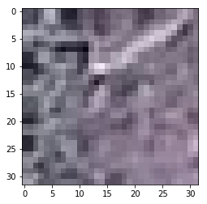

# Data Augmentation + VGG16 + CNN

> Author: https://www.kaggle.com/alperkoc

> From: https://www.kaggle.com/alperkoc/data-augmentation-vgg16-cnn

> License: [Apache 2.0](http://www.apache.org/licenses/LICENSE-2.0)

> Score: 0.9995

## Import Packages

In [1]:

```
import cv2
from sklearn.model_selection import train_test_split
import numpy as np
import matplotlib.pyplot as plt
import os
from tqdm import tqdm, tqdm_notebook
from keras.models import Sequential
import keras
from keras.layers import Activation, Dropout, Flatten, Dense,Conv2D,Conv3D,MaxPooling2D,AveragePooling2D,BatchNormalization
import numpy as np
import pandas as pd
from sklearn.metrics import confusion_matrix,classification_report,roc_auc_score
import seaborn as sns
import tensorflow as tf
import matplotlib.image as mpimg
print(os.listdir("../input"))
print(os.listdir("../input/weights/"))
IMAGE_SIZE = 32

```

```
Using TensorFlow backend.

```

```
['aerial-cactus-identification', 'weights']
['vgg16_weights_tf_dim_ordering_tf_kernels_notop.h5']

```

## Set Directories

In [2]:

```
train_dir = "../input/aerial-cactus-identification/train/train/"
test_dir = "../input/aerial-cactus-identification/test/test/"
train_df = pd.read_csv('../input/aerial-cactus-identification/train.csv')
train_df.head()

```

Out[2]:

|  | id | has_cactus |
| --- | --- | --- |
| 0 | 0004be2cfeaba1c0361d39e2b000257b.jpg | 1 |
| --- | --- | --- |
| 1 | 000c8a36845c0208e833c79c1bffedd1.jpg | 1 |
| --- | --- | --- |
| 2 | 000d1e9a533f62e55c289303b072733d.jpg | 1 |
| --- | --- | --- |
| 3 | 0011485b40695e9138e92d0b3fb55128.jpg | 1 |
| --- | --- | --- |
| 4 | 0014d7a11e90b62848904c1418fc8cf2.jpg | 1 |
| --- | --- | --- |

## Check out an image sample

In [3]:

```
im = cv2.imread("../input/aerial-cactus-identification/train/train/01e30c0ba6e91343a12d2126fcafc0dd.jpg")
plt.imshow(im)

```

Out[3]:

```
<matplotlib.image.AxesImage at 0x7fa15e5ab208>
```



## Read and convert horizontally an vertically augmented images to numpy array

In [4]:

```
X_tr = []
Y_tr = []
imges = train_df['id'].values
for img_id in tqdm_notebook(imges):
    image = np.array(cv2.imread(train_dir + img_id))
    X_tr.append(image)
    Y_tr.append(train_df[train_df['id'] == img_id]['has_cactus'].values[0])  

    X_tr.append(np.flip(image))
    Y_tr.append(train_df[train_df['id'] == img_id]['has_cactus'].values[0])  

    X_tr.append(np.flipud(image))
    Y_tr.append(train_df[train_df['id'] == img_id]['has_cactus'].values[0])  

    X_tr.append(np.fliplr(image))
    Y_tr.append(train_df[train_df['id'] == img_id]['has_cactus'].values[0])  

X_tr = np.asarray(X_tr)
X_tr = X_tr.astype('float32')
X_tr /= 255
Y_tr = np.asarray(Y_tr)

```

# Save an instance of initial images for future use

In [5]:

```
X_tr_2 = X_tr
Y_tr_2 = Y_tr

```

In [6]:

```
X_tr = X_tr_2
Y_tr = Y_tr_2

```

In [7]:

```
X_tr.shape,Y_tr.shape

```

Out[7]:

```
((70000, 32, 32, 3), (70000,))
```

# Read test images

In [8]:

```
test_image_names = []
for filename in os.listdir(test_dir):
    test_image_names.append(filename)
test_image_names.sort()
X_ts = []
#imges = test_df['id'].values
for img_id in tqdm_notebook(test_image_names):
    X_ts.append(cv2.imread(test_dir + img_id))    
X_ts = np.asarray(X_ts)
X_ts = X_ts.astype('float32')
X_ts /= 255

```

In [9]:

```
x_train,x_test,y_train,y_test = train_test_split(X_tr, Y_tr, test_size = 0.2 , stratify = Y_tr )

```

# Load weights of pretrained VGG16 model

In [10]:

```
base=keras.applications.vgg16.VGG16(include_top=False, weights='../input/weights/vgg16_weights_tf_dim_ordering_tf_kernels_notop.h5',input_shape=(32,32,3))

```

# Train

In [11]:

```
print("Current train size:",X_tr.shape)
model = Sequential()
model.add(base)

model.add(Flatten())
model.add(Dense(256, use_bias=True))
model.add(BatchNormalization())
model.add(Activation("relu"))
model.add(Dropout(0.5))
model.add(Dense(256,activation='relu'))
model.add(BatchNormalization())
model.add(Dense(16, activation='tanh'))
model.add(Dense(1, activation='sigmoid'))

model.compile(optimizer='rmsprop', loss='binary_crossentropy', metrics=['accuracy'])
model.summary()
callback=[keras.callbacks.EarlyStopping(monitor='val_acc', patience=20, verbose=1, mode='auto', restore_best_weights=True),
         keras.callbacks.ReduceLROnPlateau(monitor='val_loss', factor=0.1, patience=10, verbose=1, mode='auto')]
model.fit(X_tr,Y_tr,batch_size=64, epochs=80, verbose=1,   validation_split=0.1,callbacks=callback)

```

```
Current train size: (70000, 32, 32, 3)
_________________________________________________________________
Layer (type)                 Output Shape              Param #   
=================================================================
vgg16 (Model)                (None, 1, 1, 512)         14714688  
_________________________________________________________________
flatten_1 (Flatten)          (None, 512)               0         
_________________________________________________________________
dense_1 (Dense)              (None, 256)               131328    
_________________________________________________________________
batch_normalization_1 (Batch (None, 256)               1024      
_________________________________________________________________
activation_1 (Activation)    (None, 256)               0         
_________________________________________________________________
dropout_1 (Dropout)          (None, 256)               0         
_________________________________________________________________
dense_2 (Dense)              (None, 256)               65792     
_________________________________________________________________
batch_normalization_2 (Batch (None, 256)               1024      
_________________________________________________________________
dense_3 (Dense)              (None, 16)                4112      
_________________________________________________________________
dense_4 (Dense)              (None, 1)                 17        
=================================================================
Total params: 14,917,985
Trainable params: 14,916,961
Non-trainable params: 1,024
_________________________________________________________________
Train on 63000 samples, validate on 7000 samples
Epoch 1/80
63000/63000 [==============================] - 33s 519us/step - loss: 0.0982 - acc: 0.9667 - val_loss: 0.1541 - val_acc: 0.9523
Epoch 2/80
63000/63000 [==============================] - 30s 472us/step - loss: 0.0478 - acc: 0.9842 - val_loss: 0.1781 - val_acc: 0.9426
Epoch 3/80
63000/63000 [==============================] - 30s 471us/step - loss: 0.0353 - acc: 0.9891 - val_loss: 0.0701 - val_acc: 0.9766
Epoch 4/80
63000/63000 [==============================] - 30s 471us/step - loss: 0.0292 - acc: 0.9907 - val_loss: 0.0387 - val_acc: 0.9890
Epoch 5/80
63000/63000 [==============================] - 30s 473us/step - loss: 0.0237 - acc: 0.9925 - val_loss: 0.1911 - val_acc: 0.9254
Epoch 6/80
63000/63000 [==============================] - 30s 470us/step - loss: 0.0195 - acc: 0.9940 - val_loss: 0.3157 - val_acc: 0.8936
Epoch 7/80
63000/63000 [==============================] - 30s 469us/step - loss: 0.0183 - acc: 0.9945 - val_loss: 0.0464 - val_acc: 0.9847
Epoch 8/80
63000/63000 [==============================] - 30s 472us/step - loss: 0.0144 - acc: 0.9955 - val_loss: 0.0153 - val_acc: 0.9950
Epoch 9/80
63000/63000 [==============================] - 30s 468us/step - loss: 0.0122 - acc: 0.9962 - val_loss: 0.0357 - val_acc: 0.9931
Epoch 10/80
63000/63000 [==============================] - 30s 469us/step - loss: 0.0118 - acc: 0.9966 - val_loss: 0.0175 - val_acc: 0.9957
Epoch 11/80
63000/63000 [==============================] - 30s 472us/step - loss: 0.0114 - acc: 0.9969 - val_loss: 0.0346 - val_acc: 0.9924
Epoch 12/80
63000/63000 [==============================] - 30s 473us/step - loss: 0.0095 - acc: 0.9973 - val_loss: 0.0335 - val_acc: 0.9923
Epoch 13/80
63000/63000 [==============================] - 30s 470us/step - loss: 0.0089 - acc: 0.9975 - val_loss: 0.0187 - val_acc: 0.9947
Epoch 14/80
63000/63000 [==============================] - 30s 469us/step - loss: 0.0088 - acc: 0.9976 - val_loss: 0.0195 - val_acc: 0.9954
Epoch 15/80
63000/63000 [==============================] - 30s 469us/step - loss: 0.0078 - acc: 0.9979 - val_loss: 0.0191 - val_acc: 0.9963
Epoch 16/80
63000/63000 [==============================] - 30s 472us/step - loss: 0.0070 - acc: 0.9983 - val_loss: 0.0293 - val_acc: 0.9943
Epoch 17/80
63000/63000 [==============================] - 30s 468us/step - loss: 0.0077 - acc: 0.9980 - val_loss: 0.3062 - val_acc: 0.9326
Epoch 18/80
63000/63000 [==============================] - 30s 469us/step - loss: 0.0054 - acc: 0.9985 - val_loss: 0.1900 - val_acc: 0.9586

Epoch 00018: ReduceLROnPlateau reducing learning rate to 0.00010000000474974513.
Epoch 19/80
63000/63000 [==============================] - 30s 472us/step - loss: 0.0016 - acc: 0.9996 - val_loss: 0.0134 - val_acc: 0.9977
Epoch 20/80
63000/63000 [==============================] - 30s 469us/step - loss: 5.7911e-04 - acc: 0.9999 - val_loss: 0.0169 - val_acc: 0.9974
Epoch 21/80
63000/63000 [==============================] - 30s 472us/step - loss: 3.5007e-04 - acc: 0.9999 - val_loss: 0.0155 - val_acc: 0.9981
Epoch 22/80
63000/63000 [==============================] - 30s 476us/step - loss: 5.3868e-04 - acc: 0.9998 - val_loss: 0.0155 - val_acc: 0.9979
Epoch 23/80
63000/63000 [==============================] - 30s 469us/step - loss: 3.6740e-04 - acc: 0.9999 - val_loss: 0.0179 - val_acc: 0.9977
Epoch 24/80
32320/63000 [==============>...............] - ETA: 13s - loss: 1.1531e-04 - acc: 1.0000
```

# Results

In [12]:

```
clf=model
y_pred_proba = clf.predict_proba(X_tr_2)

y_pred = clf.predict_classes(X_tr_2)
conf_mat = confusion_matrix(Y_tr_2, y_pred)
fig, ax = plt.subplots(figsize=(10,10))

sns.heatmap(conf_mat, annot=True, fmt='d', xticklabels=['0','1'], yticklabels=['0','1'])
plt.ylabel('Actual')
plt.xlabel('Predicted')
plt.show()

print(classification_report(Y_tr_2, y_pred, target_names=['0','1']))
print("\n\n AUC: {:<0.4f}".format(roc_auc_score(Y_tr_2,y_pred_proba)))

```


```
              precision    recall  f1-score   support

           0       1.00      1.00      1.00     17456
           1       1.00      1.00      1.00     52544

   micro avg       1.00      1.00      1.00     70000
   macro avg       1.00      1.00      1.00     70000
weighted avg       1.00      1.00      1.00     70000

 AUC: 1.0000

```

# Submit

In [13]:

```
test_df = pd.read_csv('../input/aerial-cactus-identification/sample_submission.csv')
X_test = []
imges = test_df['id'].values
for img_id in tqdm_notebook(imges):
    X_test.append(cv2.imread(test_dir + img_id))     
X_test = np.asarray(X_test)
X_test = X_test.astype('float32')
X_test /= 255

y_test_pred  = model.predict_proba(X_test)

test_df['has_cactus'] = y_test_pred
test_df.to_csv('tf_learning_vgg16_aug2_80epoch.csv', index=False)

```