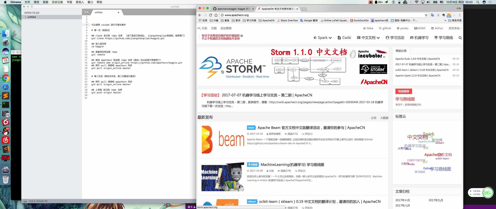

# GitHub 入门须知

## 基本介绍

* git 是一个版本控制工具.
* Github 是一个基于 git 的社会化代码分享社区, 所谓 social coding.
* 开源项目是可以免费托管到 GitHub 上面, 在 GitHub 上你基本上可以找到任何你想要的代码.

## 基本用途

| 名称 | 描述 |
| - | - |
| 个人写作 | 个人笔记（支持 .md 格式）<br/>Note: 写书，可以去 GitBook |
| 多人写作 | 1.适合内容协同和迭代<br/> 2.适合即将步入职场的人熟悉职场操作 |
| 搭建网站 | GitHub Pages 用于免费搭建个人网站，支持绑定个人域名 | 
| 个人简历 | 你会发现，GitHub 是一个不错的求职敲门砖，可以理解为程序员的个人简历 |
| 开源项目 | 开源社区流行着一句话叫「不要重复发明轮子」，也就是站在巨人的肩膀上看得更远 | 

## 下载地址

### 1.客户端安装(三种方式都可行)

> (一 客户端操作: https://desktop.github.com/

> (二 通过 homebrew 安装 git

* 1.安装homebrew

```
/usr/bin/ruby -e "$(curl -fsSL https://raw.githubusercontent.com/Homebrew/install/master/install)"
```

* 2.安装 git

```
brew install git
```

> (三 通过 Xcode 安装

* 直接从 AppStore 安装 Xcode, Xcode 集成了 Git.
* 不过默认没有安装, 你需要运行 Xcode, 选择菜单 Xcode -> Preferences.
* 在弹出窗口中找到 Downloads, 选择 Command Line Tools, 点 Install 就可以完成安装了.

### 2.创建 ssh key、 配置 git

> 1、设置 username 和 email（github 每次 commit 都会记录他们）

```
git config --global user.name "jiangzhonglian"
git config --global user.email "jiang-s@163.com"
```

> 2、通过终端命令创建 ssh key

```
ssh-keygen -t rsa -C "jiang-s@163.com"
```

`jiang-s@163.com` 是我的邮件名，回车会有以下输出

```
Last login: Sat Jan  6 14:12:16 on ttys000
jiangzl@jiangzhongliandeMacBook-Pro:~$ ssh-keygen -t rsa -C "jiang-s@163.com"
Generating public/private rsa key pair.
Enter file in which to save the key (/Users/jiangzl/.ssh/id_rsa): 
/Users/jiangzl/.ssh/id_rsa already exists.
Overwrite (y/n)? n
jiangzl@jiangzhongliandeMacBook-Pro:~$
```

* 这里我原来已经创建过，这里我选 n.
* 没有创建过的就选择 y, 我们默认的一路回车就行（有特殊癖好: 可以确认路径和输入密码） .
* 成功的话会在 ~/ 下生成 .ssh 文件夹, 进去打开 id_rsa.pub, 复制里面的key.
* 终端查看 `.ssh/id_rsa.pub` 文件, 然后复制里面的key.

### 3.上传 ssh key 到 GitHub 服务器上面

> 1.注册 GitHub 帐号， 登录GitHub

> 2.点击 Settings, 添加ssh key

 

> 3.点击 New SSH key

 

> 4.链接验证

```
ssh -T git@github.com 
```

终端输出结果

```
Last login: Sat Jan  6 14:42:55 on ttys000
jiangzl@jiangzhongliandeMacBook-Pro:~$ ssh -T git@github.com 
Hi jiangzhonglian! You've successfully authenticated, but GitHub does not provide shell access.
jiangzl@jiangzhongliandeMacBook-Pro:~$
```

说明已经链接成功。

## 基本命令

<a href="https://www.bilibili.com/video/av15705305/" target="_blank">此图片链接为 bilibili 视频地址: (视频图片下面为文本操作指南)

</a>

> 一) fork apachecn/kaggle 项目


> 二) jiangzhonglian/kaggle 第一次初始化

可以使用 vscode 进行可视化操作

```
clone 自己的 repo 仓库  （这个是自己的地址， jiangzhonglian是我的，别弄错了）
$ git clone https://github.com/jiangzhonglian/kaggle.git

## 进入该仓库的文件夹
$ cd kaggle

## 查看该仓库远程 repo
$ git remote

## 添加 apachecn 的远程 repo 仓库（添加一次以后就不用使用了）
$ git remote add origin_online https://github.com/apachecn/kaggle.git
```

> 三) jiangzhonglian/kaggle 文件更新（修改文件后，第二次要进行提交）

```
# 用于 pull 保持和 apachecn 同步
$ git pull origin_online master

#上传到 自己的 repo 仓库
$ git push origin master
```

> 四) pull requests 到 apachecn/kaggle


### Patrick Wang