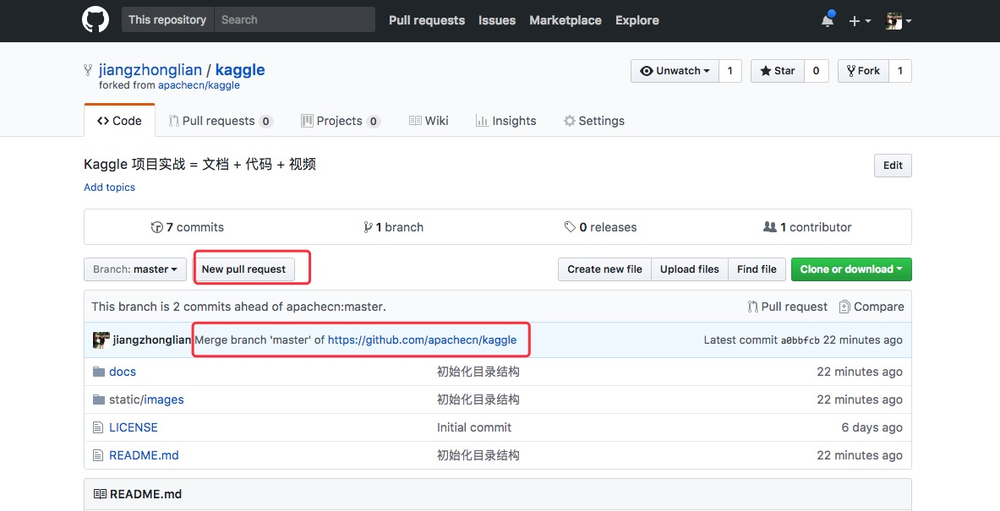

# GitHub 入门操作指南

<a href="https://www.bilibili.com/video/av15705305/"> 此图片链接为 bilibili 视频地址: (视频图片下面为文本操作指南)

</a>

> 一) fork apachecn/kaggle 项目


> 二) jiangzhonglian/kaggle 第一次初始化

可以使用 vscode 进行可视化操作

```
clone 自己的 repo 仓库  （这个是自己的地址， jiangzhonglian是我的，别弄错了）
$ git clone https://github.com/jiangzhonglian/kaggle.git

## 进入该仓库的文件夹
$ cd kaggle

## 查看该仓库远程 repo
$ git remote

## 添加 apachecn 的远程 repo 仓库（添加一次以后就不用使用了）
$ git remote add origin_online https://github.com/apachecn/kaggle.git
```

> 三) jiangzhonglian/kaggle 文件更新（修改文件后，第二次要进行提交）

```
# 用于 pull 保持和 apachecn 同步
$ git pull origin_online master

#上传到 自己的 repo 仓库
$ git push origin master
```

> 四) pull requests 到 apachecn/kaggle




