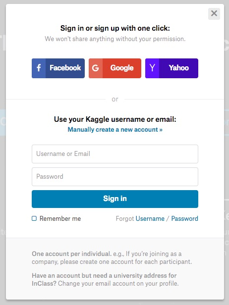

# [Kaggle](https://www.kaggle.com) 入门操作指南

## [注册](https://www.kaggle.com/?login=true)

1. 首先注册账号
2. 关联 GitHub 账号



## [竞赛 - competitions](https://www.kaggle.com/competitions)

* [选择 - All 和 Getting Started](https://www.kaggle.com/competitions?sortBy=deadline&group=all&page=1&pageSize=20&segment=gettingStarted)


* [选择 - Digit Recognizer（数字识别器）](https://www.kaggle.com/c/digit-recognizer)


* [阅读资料 - Digit Recognizer（数字识别器）](https://www.kaggle.com/c/digit-recognizer)

**选择 版本框架 和 star 最高的 Kernels 编辑就行，然后模仿 [**数字识别**](../competitions/GettingStarted/DigitRecognizer.md) 案例更新**


## 项目规范(以：DigitRecognizer 为例)

> 文档：结尾文件名为项目名.md

* 案例：`competitions/getting-started/digit-recognizer.md`
* 例如：数字识别，文档是属于 `competitions -> GettingStarted` 下面，所以创建 `competitions/getting-started` 存放文档就行

> 图片：结尾文件名可自由定义

* 案例：`static/images/comprtitions/getting-started/digit-recognizer/front_page.png`
* 例如：数字识别，图片是属于 `competitions -> GettingStarted -> DigitRecognizer` 下面，所以创建 `competitions/getting-started/digit-recognizer` 存放文档的图片就行


> 代码：结尾文件名可自由定义.py

* 案例：`src/python/getting-started/digit-recognizer/dr_knn_pandas.py`
* 例如：数字识别，代码只有 `竞赛` 有，所以直接创建 `getting-started/digit-recognizer` 存放代码就行
* 要求（方法：完全解耦）
    1. 加载数据
    2. 预处理数据(可没)
    3. 训练模型
    4. 评估模型(可没)
    5. 导出数据
* 标注python和编码格式

```python
#!/usr/bin/python
# coding: utf-8
```

*  标注项目的描述

```python
'''
Created on 2017-10-26
Update  on 2017-10-26
Author: 【如果是个人】片刻
Team:   【如果是团队】装逼从不退缩（张三、李四 等等）
Github: https://github.com/apachecn/kaggle
'''
```

> 数据：结尾文件名可自由定义

* 输入：`datasets/getting-started/digit-recognizer/input/train.csv`
* 输出：`datasets/getting-started/digit-recognizer/ouput/Result_sklearn_knn.csv`
* 例如：数字识别，数据只有 `竞赛` 有，所以直接创建 `getting-started/digit-recognizer` 存放数据就行

> 结果提交

将数据的输出结果提交到项目的页面中

<a href="https://www.kaggle.com/c/digit-recognizer/submit" target="_blank">

</a>

## docs目录（可忽略）

`docs 目录存放的是 ApacheCN 整理的操作or说明文档，和 kaggle 网站内容没有关系`

**后面会持续更新**
