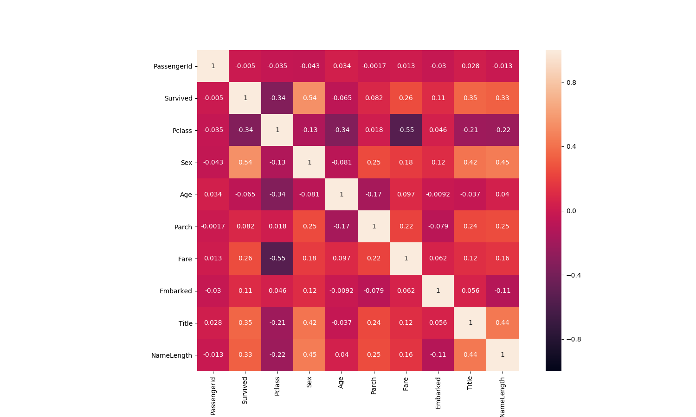

# **泰坦尼克号**

## 比赛说明

* [**泰坦尼克号**](https://www.kaggle.com/c/titanic) 的沉没是历史上最臭名昭着的沉船之一。1912年4月15日，在首航期间，泰坦尼克号撞上一座冰山后沉没，2224名乘客和机组人员中有1502人遇难。这一耸人听闻的悲剧震撼了国际社会，并导致了更好的船舶安全条例。
* 沉船导致生命损失的原因之一是乘客和船员没有足够的救生艇。虽然幸存下来的运气有一些因素，但有些人比其他人更有可能生存，比如妇女，儿童和上层阶级。
* 在这个挑战中，我们要求你完成对什么样的人可能生存的分析。特别是，我们要求你运用机器学习的工具来预测哪些乘客幸存下来的悲剧。

## 参赛成员

* 开源组织: [ApacheCN ~ apachecn.org](http://www.apachecn.org/)
* **菜鸡互啄(团队)**: [@那伊抹微笑](https://github.com/wangyangting), [@风风](https://github.com/fengfengtzp), [@李铭哲](https://github.com/limingzhe), [@刘海飞](https://github.com/WindZQ), [@DL - 小王子](https://github.com/VPrincekin), [@成飘飘](https://github.com/chengpiaopiao)
* **瑶瑶亲卫队(团队)**: [@瑶妹](https://github.com/chenyyx) 张俊皓 kngines [@谈笑风生](https://github.com/zhu1040028623) Yukine ~守护 程威 屋檐听雨 Gladiator 吃着狗粮的电酱PRPR

## 比赛分析

* 分类问题：预测的是`生`与`死`的问题
* 常用算法： `K紧邻(knn)`、`逻辑回归(LogisticRegression)`、`随机森林(RandomForest)`、`支持向量机(SVM)`、`xgboost`、`GBDT`

```
步骤:
一. 数据分析
1. 下载并加载数据
2. 总体预览:了解每列数据的含义,数据的格式等
3. 数据初步分析,使用统计学与绘图:初步了解数据之间的相关性,为构造特征工程以及模型建立做准备

二. 特征工程
1.根据业务,常识,以及第二步的数据分析构造特征工程.
2.将特征转换为模型可以辨别的类型(如处理缺失值,处理文本进行等)

三. 模型选择
1.根据目标函数确定学习类型,是无监督学习还是监督学习,是分类问题还是回归问题等.
2.比较各个模型的分数,然后取效果较好的模型作为基础模型.

四. 模型融合
1. Bagging:   同一模型的投票选举
2. Boosting:  同一模型的再学习
3. Voting:    不同模型的投票选举
4. Stacking:  分层预测 – K-1份数据预测1份模型拼接，得到 预测结果*算法数（作为特征） => 从而预测最终结果
5. Blending:  分层预测 – 将数据分成2部分（A部分训练B部分得到预测结果），得到 预测结果*算法数（作为特征） => 从而预测最终结果

五. 参数优化
1.可以通过添加或者修改特征,提高模型的上限.
2.通过修改模型的参数,是模型逼近上限
```

## 一. 数据分析

### 数据下载和观察

* 数据集下载地址：<https://www.kaggle.com/c/titanic/data>

> 特征说明

| 特征 | 描述 | 值|
| - | - | - |
| PassengerId | 乘客ID      | |
| Survived | 生存           | 0 = No, 1 = Yes |
| Pclass   | 票类别-社会地位 | 1 = 1st, 2 = 2nd, 3 = 3rd |  
| Name     | 姓名           | |  
| Sex      | 性别           | |
| Age      | 年龄           | |    
| SibSp    | 兄弟姐妹/配偶   | | 
| Parch    | 父母/孩子的数量 | |
| Ticket   | 票号           | |   
| Fare     | 乘客票价       | |  
| Cabin    | 客舱号码       | |    
| Embarked | 登船港口       | C=Cherbourg, Q=Queenstown, S=Southampton |  

### 特征详情

```python
# 导入相关数据包
import numpy as np
import pandas as pd
import seaborn as sns
import matplotlib.pyplot as plt
%matplotlib inline
```

```python
root_path = '/opt/data/datasets/getting-started/titanic/input'

train = pd.read_csv('%s/%s' % (root_path, 'train.csv'))
test = pd.read_csv('%s/%s' % (root_path, 'test.csv'))
```

```python
train.head(5)
```


```py
>>> # 返回每列列名,该列非nan值个数,以及该列类型
>>> train.info()
>>> # test.info()

<class 'pandas.core.frame.DataFrame'>
RangeIndex: 891 entries, 0 to 890
Data columns (total 12 columns):
PassengerId    891 non-null int64
Survived       891 non-null int64
Pclass         891 non-null int64
Name           891 non-null object
Sex            891 non-null object
Age            714 non-null float64
SibSp          891 non-null int64
Parch          891 non-null int64
Ticket         891 non-null object
Fare           891 non-null float64
Cabin          204 non-null object
Embarked       889 non-null object
dtypes: float64(2), int64(5), object(5)
memory usage: 83.6+ KB
```

```py
>>> # 返回数值型变量的统计量
>>> # train.describe(percentiles=[0.00, 0.25, 0.5, 0.75, 1.00])
>>> print(titanic.describe())
        PassengerId    Survived      Pclass         Age       SibSp       Parch        Fare
count   891.000000  891.000000  891.000000  714.000000  891.000000  891.000000  891.000000
mean    446.000000    0.383838    2.308642   29.699118    0.523008    0.381594   32.204208
std     257.353842    0.486592    0.836071   14.526497    1.102743    0.806057   49.693429
min       1.000000    0.000000    1.000000    0.420000    0.000000    0.000000    0.000000
25%     223.500000    0.000000    2.000000   20.125000    0.000000    0.000000    7.910400
50%     446.000000    0.000000    3.000000   28.000000    0.000000    0.000000   14.454200
75%     668.500000    1.000000    3.000000   38.000000    1.000000    0.000000   31.000000
max     891.000000    1.000000    3.000000   80.000000    8.000000    6.000000  512.329200
```

## 二. 特征工程

### 特征处理

目的:初步了解数据之间的相关性,为构造特征工程以及模型建立做准备

```python
# 存活人数
train['Survived'].value_counts()

0    549
1    342
Name: Survived, dtype: int64


# 对缺失值处理（Age 中位数不错）
titanic["Age"] = titanic["Age"].fillna(titanic["Age"].median())
titanic["Fare"] = titanic["Fare"].fillna(titanic["Fare"].median())


# 对文本特征进行处理（性别， 登船港口）
print(titanic["Sex"].unique())
titanic.loc[titanic["Sex"]=="male", "Sex"] = 0
titanic.loc[titanic["Sex"]=="female", "Sex"] = 1

# 组合特征(特征组合相关性变差了)
# titanic["FamilySize"] = titanic["SibSp"] + titanic["Parch"]

# S的概率最大，当然我们也可以按照概率随机算，都可以
print(titanic["Embarked"].unique())
"""
titanic[["Embarked"]].groupby("Embarked").agg({"Embarked": "count"})
            Embarked
Embarked          
C              168
Q               77
S              644
"""
titanic["Embarked"] = titanic["Embarked"].fillna('S')
titanic.loc[titanic["Embarked"] == "S", "Embarked"] = 0
titanic.loc[titanic["Embarked"] == "C", "Embarked"] = 1
titanic.loc[titanic["Embarked"] == "Q", "Embarked"] = 2


def get_title(name):
    # 名字的尊称
    title_search = re.search(' ([A-Za-z]+)\.', name)
    if title_search:
        return title_search.group(1)
    return ""
titles = titanic["Name"].apply(get_title)
# print(pandas.value_counts(titles))
# 对尊称建立mapping字典
# 在数据的Name项中包含了对该乘客的称呼，如Mr、Miss等，这些信息包含了乘客的年龄、性别、也有可能包含社会地位，如Dr、Lady、Major、Master等称呼。这一项不方便用图表展示，但是在特征工程中，我们会将其提取出来,然后放到模型中。
# 剩余因素还有船票价格、船舱号和船票号，这三个因素都可能会影响乘客在船中的位置从而影响逃生顺序，但是因为这三个因素与生存之间看不出明显规律，所以在后期模型融合时，将这些因素交给模型来决定其重要性。
title_mapping = {"Mr": 1, "Miss": 2, "Mrs": 3, "Master": 4, "Dr": 5, "Rev": 6, "Major": 7, "Col": 7, "Mlle": 8, "Mme": 8, "Don": 9, "Dona": 9, "Lady": 10, "Countess": 10, "Jonkheer": 10, "Sir": 9, "Capt": 7, "Ms": 2}
for k, v in title_mapping.items():
    titles[titles == k] = v
# print(pd.value_counts(titles))


# 添加一个新特征表示拥护尊称
titanic["Title"] = [int(i) for i in titles.values.tolist()]
# 添加一个新特征表示名字长度
titanic["NameLength"] = titanic["Name"].apply(lambda x: len(x))


# 相关性太差，删除
# titanic.drop(['PassengerId'], axis=1,inplace=True)
titanic.drop(['Cabin'], axis=1,inplace=True)
titanic.drop(['SibSp'], axis=1,inplace=True)
# titanic.drop(['Parch'],axis=1,inplace=True)
titanic.drop(['Ticket'], axis=1,inplace=True)
titanic.drop(['Name'],   axis=1,inplace=True)
```

### 特征相关性

> 1)数值型数据协方差 corr()函数

来个总览,快速了解个数据的相关性

```python
# 相关性协方差表,corr()函数,返回结果接近0说明无相关性,大于0说明是正相关,小于0是负相关.
train_corr = train.corr()
train_corr
```

|    相关性   |  Survived  |    Pclass  |       Sex |       Age |     Parch  |      Fare |  Embarked |     Title | NameLength | 
|   ------   |   ------   |   ------   |   ------  |   ------  |   ------   |   ------  |   ------  |   ------  |  ------    |
| Survived   |  1.000000  | -0.338481  |  0.543351 | -0.064910 |  0.081629  |  0.257307 |  0.106811 |  0.354072 |   0.332350 |
| Pclass     | -0.338481  |  1.000000  | -0.131900 | -0.339898 |  0.018443  | -0.549500 |  0.045702 | -0.211552 |  -0.220001 |
| Sex        |  0.543351  | -0.131900  |  1.000000 | -0.081163 |  0.245489  |  0.182333 |  0.116569 |  0.419760 |   0.448759 |
| Age        | -0.064910  | -0.339898  | -0.081163 |  1.000000 | -0.172482  |  0.096688 | -0.009165 | -0.037174 |   0.039702 |
| Parch      |  0.081629  |  0.018443  |  0.245489 | -0.172482 |  1.000000  |  0.216225 | -0.078665 |  0.235164 |   0.252282 |
| Fare       |  0.257307  | -0.549500  |  0.182333 |  0.096688 |  0.216225  |  1.000000 |  0.062142 |  0.122872 |   0.155832 |
| Embarked   |  0.106811  |  0.045702  |  0.116569 | -0.009165 | -0.078665  |  0.062142 |  1.000000 |  0.055788 |  -0.107749 |
| Title      |  0.354072  | -0.211552  |  0.419760 | -0.037174 |  0.235164  |  0.122872 |  0.055788 |  1.000000 |   0.436099 |
| NameLength |  0.332350  | -0.220001  |  0.448759 |  0.039702 |  0.252282  |  0.155832 | -0.107749 |  0.436099 |   1.000000 |

```python
# 画出相关性热力图
a = plt.subplots(figsize=(15,9))#调整画布大小
a = sns.heatmap(train_corr, vmin=-1, vmax=1 , annot=True , square=True)#画热力图
```




### 特征标准化和降维

* 数据标准化

1. 线性模型需要用标准化的数据建模, 而树类模型不需要标准化的数据
2. 处理标准化的时候,注意将测试集的数据transform到test集上

```py
def do_FeatureEngineering(data, COMPONENT_NUM=0.9):
    # scale values  对一化
    scaler = preprocessing.StandardScaler()
    s_data = scaler.fit_transform(data)
    return s_data

    # # 降维(不降维，准确率还上升了)
    # '''
    # 使用说明：https://www.cnblogs.com/pinard/p/6243025.html
    # n_components>=1
    #   n_components=NUM   设置占特征数量比
    # 0 < n_components < 1
    #   n_components=0.99  设置阈值总方差占比
    # '''
    # pca = PCA(n_components=COMPONENT_NUM, whiten=False)
    # pca.fit(s_data)  # Fit the model with X
    # pca_data = pca.transform(s_data)  # Fit the model with X and 在X上完成降维.

    # # pca 方差大小、方差占比、特征数量
    # # print("方差大小:\n", pca.explained_variance_, "方差占比:\n", pca.explained_variance_ratio_)
    # print("特征数量: %s" % pca.n_components_)
    # print("总方差占比: %s" % sum(pca.explained_variance_ratio_))

    # return pca_data
```


## 三. 建立模型

### 模型发现

1. 可选单个模型模型有逻辑回归, 随机森林, svm, xgboost, gbdt等.
2. 也可以将多个模型组合起来,进行模型融合,比如voting,stacking等方法
3. 好的特征决定模型上限,好的模型和参数可以无线逼近上限.
4. 我测试了多种模型,模型结果最高的随机森林,最高有0.8.

### 构建模型

```py
# 0.8069524400247253 [0.79329609 0.81564246 0.8258427  0.80337079 0.79661017]
model = LogisticRegression(random_state=1)

# 0.8272091118939124 [0.82122905 0.80446927 0.84831461 0.82022472 0.84180791]
model = RandomForestClassifier(random_state=1, n_estimators=100, min_samples_split=4, min_samples_leaf=2)

# 0.822670577600365  [0.82681564 0.82122905 0.83146067 0.80898876 0.82485876]
model = RandomForestClassifier(random_state=1, n_estimators=50, min_samples_split=8, min_samples_leaf=4)

# 0.8294499549079417   [0.82122905 0.80446927 0.86516854 0.82022472 0.83615819]
model = XGBClassifier(n_estimators=196, max_depth=4, learning_rate=0.03)
```

## 四. 模型融合

```py
print("模型融合")
"""
Bagging:   同一模型的投票选举
Boosting:  同一模型的再学习
Voting:    不同模型的投票选举
Stacking:  分层预测 – K-1份数据预测1份模型拼接，得到 预测结果*算法数（作为特征） => 从而预测最终结果
Blending:  分层预测 – 将数据分成2部分（A部分训练B部分得到预测结果），得到 预测结果*算法数（作为特征） => 从而预测最终结果
"""
# 1. Bagging 算法实现
# 0.8691726623564537  [0.86179183 0.82700922 0.8855615  0.87700535 0.89449541]
model = RandomForestClassifier(random_state=1, n_estimators=100, min_samples_split=4, min_samples_leaf=2)

# 2. Boosting 算法实现
# 0.8488710896477386  [0.8198946  0.82285903 0.87780749 0.84906417 0.87473017]
model = AdaBoostClassifier(random_state=1, n_estimators=100, learning_rate=1)

# 3. Voting
# 0.8695399796790022  [0.87259552 0.8370224  0.87433155 0.86885027 0.89490016]
model = VotingClassifier(
    estimators=[
        ('log_clf', LogisticRegression()),
        ('ab_clf', AdaBoostClassifier()),
        ('svm_clf', SVC(probability=True)),
        ('rf_clf', RandomForestClassifier()),
        ('gbdt_clf', GradientBoostingClassifier()),
        ('rb_clf', AdaBoostClassifier())
    ], voting='soft') # , voting='hard')
scores = cross_val_score(model, trainData, trainLabel, cv=5, scoring='roc_auc')
print(scores.mean(), "\n", scores)

# 4. Stacking
# 0.8713813265814722  [0.87747036 0.83886693 0.86590909 0.87085561 0.90380464]
clfs = [
    AdaBoostClassifier(),
    SVC(probability=True),
    AdaBoostClassifier(),
    LogisticRegression(C=0.1,max_iter=100),
    XGBClassifier(max_depth=6,n_estimators=100,num_round = 5),
    RandomForestClassifier(n_estimators=100,max_depth=6,oob_score=True),
    GradientBoostingClassifier(learning_rate=0.3,max_depth=6,n_estimators=100)
]

kf = KFold(n_splits=5, shuffle=True, random_state=1)

# 创建零矩阵
dataset_stacking_train = np.zeros((trainData.shape[0], len(clfs)))
# dataset_stacking_label  = np.zeros((trainLabel.shape[0], len(clfs)))

for j, clf in enumerate(clfs):
    '''依次训练各个单模型'''
    for i,(train, test) in enumerate(kf.split(trainLabel)):
        '''使用第i个部分作为预测，剩余的部分来训练模型，获得其预测的输出作为第i部分的新特征。'''
        # print("Fold", i)
        X_train, y_train, X_test, y_test = trainData[train], trainLabel[train], trainData[test], trainLabel[test]
        clf.fit(X_train, y_train)
        y_submission = clf.predict_proba(X_test)[:, 1]

        # j 表示每一次的算法，而 test是交叉验证得到的每一行（也就是每一个算法把测试机和都预测了一遍）
        dataset_stacking_train[test, j] = y_submission
    
# 用建立第二层模型
model = LogisticRegression(C=0.1, max_iter=100)
model.fit(dataset_stacking_train, trainLabel)

scores = cross_val_score(model, dataset_stacking_train, trainLabel, cv=5, scoring='roc_auc')
print(scores.mean(), "\n", scores)

# 5. Blending
# 0.8838950287185581 [0.87584416 0.91064935 0.89714286 0.85294118 0.8828976 ]
clfs = [
    AdaBoostClassifier(),
    SVC(probability=True),
    AdaBoostClassifier(),
    LogisticRegression(C=0.1,max_iter=100),
    XGBClassifier(max_depth=6,n_estimators=100,num_round = 5),
    RandomForestClassifier(n_estimators=100,max_depth=6,oob_score=True),
    GradientBoostingClassifier(learning_rate=0.3,max_depth=6,n_estimators=100)
]
X_d1, X_d2, y_d1, y_d2 = train_test_split(trainData, trainLabel, test_size=0.5, random_state=2017)
dataset_d1 = np.zeros((X_d2.shape[0], len(clfs)))
dataset_d2 = np.zeros((trainLabel.shape[0], len(clfs)))

for j, clf in enumerate(clfs):
    #依次训练各个单模型
    # 对于测试集，直接用这k个模型的预测值作为新的特征。
    clf.fit(X_d1, y_d1)
    dataset_d1[:, j] = clf.predict_proba(X_d2)[:, 1]

# 用建立第二层模型
model = LogisticRegression(C=0.1, max_iter=100)
model.fit(dataset_d1, y_d2)

scores = cross_val_score(model, dataset_d1, y_d2, cv=5, scoring='roc_auc')
print(scores.mean(), "\n", scores)
```

## 五. 参数优化

```py
from sklearn.model_selection import GridSearchCV
param_test = {
    # 'n_estimators': np.arange(190, 240, 2), 
    # 'max_depth': np.arange(4, 7, 1), 
    # 'learning_rate': np.array([0.01, 0.03, 0.05, 0.08, 0.1, 0.15, 0.2]), 

    'n_estimators': np.array([196]), 
    'max_depth': np.array([4]),     
    'learning_rate': np.array([0.01, 0.02, 0.03, 0.04, 0.05]), 
    # 'min_child_weight': np.arange(1, 6, 2), 
    # 'C': (1, 1.1, 1.2, 1.3, 1.4, 1.5, 1.6, 1.7, 1.8, 1.9)
}

# 0.8294499549079417   [0.82122905 0.80446927 0.86516854 0.82022472 0.83615819]
model = XGBClassifier()
grid_search = GridSearchCV(estimator=model, param_grid=param_test, scoring='roc_auc', cv=5)
grid_search.fit(trainData, trainLabel)
print("最优得分 >>>", grid_search.best_score_)
print("最优参数 >>>", grid_search.best_params_)

# 0.8685305085155506  [0.85770751 0.82002635 0.89632353 0.87018717 0.89840799]
model = XGBClassifier(n_estimators=196, max_depth=4, learning_rate=0.03)

scores = cross_val_score(model, trainData, trainLabel, cv=5, scoring='roc_auc')
print(scores.mean(), "\n", scores)
```
