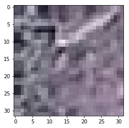
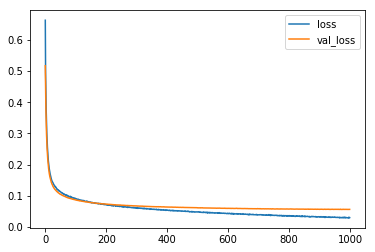
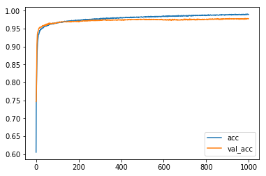

# Keras _Transfer_VGG16

> Author: https://www.kaggle.com/ateplyuk

> From: https://www.kaggle.com/ateplyuk/keras-transfer-vgg16

> License: [Apache 2.0](http://www.apache.org/licenses/LICENSE-2.0)

In [1]:

```py
import cv2
import pandas as pd
import numpy as np
import matplotlib.pyplot as plt
import json
import os
from tqdm import tqdm, tqdm_notebook
from keras.models import Sequential
from keras.layers import Activation, Dropout, Flatten, Dense
from keras.applications import VGG16
from keras.optimizers import Adam

```

```
Using TensorFlow backend.

```

In [2]:

```py
train_dir = "../input/train/train/"
test_dir = "../input/test/test/"
train_df = pd.read_csv('../input/train.csv')
train_df.head()

```

Out[2]:

|  | id | has_cactus |
| --- | --- | --- |
| 0 | 0004be2cfeaba1c0361d39e2b000257b.jpg | 1 |
| --- | --- | --- |
| 1 | 000c8a36845c0208e833c79c1bffedd1.jpg | 1 |
| --- | --- | --- |
| 2 | 000d1e9a533f62e55c289303b072733d.jpg | 1 |
| --- | --- | --- |
| 3 | 0011485b40695e9138e92d0b3fb55128.jpg | 1 |
| --- | --- | --- |
| 4 | 0014d7a11e90b62848904c1418fc8cf2.jpg | 1 |
| --- | --- | --- |

In [3]:

```py
im = cv2.imread("../input/train/train/01e30c0ba6e91343a12d2126fcafc0dd.jpg")
plt.imshow(im)

```

Out[3]:

```
<matplotlib.image.AxesImage at 0x7f884392a0f0>
```

In [4]:

```py
vgg16_net = VGG16(weights='imagenet', 
                  include_top=False, 
                  input_shape=(32, 32, 3))

```

```
Downloading data from https://github.com/fchollet/deep-learning-models/releases/download/v0.1/vgg16_weights_tf_dim_ordering_tf_kernels_notop.h5
58892288/58889256 [==============================] - 2s 0us/step

```

In [5]:

```py
vgg16_net.trainable = False
vgg16_net.summary()

```

```
_________________________________________________________________
Layer (type)                 Output Shape              Param #   
=================================================================
input_1 (InputLayer)         (None, 32, 32, 3)         0         
_________________________________________________________________
block1_conv1 (Conv2D)        (None, 32, 32, 64)        1792      
_________________________________________________________________
block1_conv2 (Conv2D)        (None, 32, 32, 64)        36928     
_________________________________________________________________
block1_pool (MaxPooling2D)   (None, 16, 16, 64)        0         
_________________________________________________________________
block2_conv1 (Conv2D)        (None, 16, 16, 128)       73856     
_________________________________________________________________
block2_conv2 (Conv2D)        (None, 16, 16, 128)       147584    
_________________________________________________________________
block2_pool (MaxPooling2D)   (None, 8, 8, 128)         0         
_________________________________________________________________
block3_conv1 (Conv2D)        (None, 8, 8, 256)         295168    
_________________________________________________________________
block3_conv2 (Conv2D)        (None, 8, 8, 256)         590080    
_________________________________________________________________
block3_conv3 (Conv2D)        (None, 8, 8, 256)         590080    
_________________________________________________________________
block3_pool (MaxPooling2D)   (None, 4, 4, 256)         0         
_________________________________________________________________
block4_conv1 (Conv2D)        (None, 4, 4, 512)         1180160   
_________________________________________________________________
block4_conv2 (Conv2D)        (None, 4, 4, 512)         2359808   
_________________________________________________________________
block4_conv3 (Conv2D)        (None, 4, 4, 512)         2359808   
_________________________________________________________________
block4_pool (MaxPooling2D)   (None, 2, 2, 512)         0         
_________________________________________________________________
block5_conv1 (Conv2D)        (None, 2, 2, 512)         2359808   
_________________________________________________________________
block5_conv2 (Conv2D)        (None, 2, 2, 512)         2359808   
_________________________________________________________________
block5_conv3 (Conv2D)        (None, 2, 2, 512)         2359808   
_________________________________________________________________
block5_pool (MaxPooling2D)   (None, 1, 1, 512)         0         
=================================================================
Total params: 14,714,688
Trainable params: 0
Non-trainable params: 14,714,688
_________________________________________________________________

```

In [6]:

```py
model = Sequential()
model.add(vgg16_net)
model.add(Flatten())
model.add(Dense(256))
model.add(Activation('relu'))
model.add(Dropout(0.5))
model.add(Dense(1))
model.add(Activation('sigmoid'))

```

In [7]:

```py
model.compile(loss='binary_crossentropy',
              optimizer=Adam(lr=1e-5), 
              metrics=['accuracy'])

```

In [8]:

```py
X_tr = []
Y_tr = []
imges = train_df['id'].values
for img_id in tqdm_notebook(imges):
    X_tr.append(cv2.imread(train_dir + img_id))    
    Y_tr.append(train_df[train_df['id'] == img_id]['has_cactus'].values[0])  
X_tr = np.asarray(X_tr)
X_tr = X_tr.astype('float32')
X_tr /= 255
Y_tr = np.asarray(Y_tr)

```

In [9]:

```py
batch_size = 32
nb_epoch = 1000

```

In [10]:

```py
%%time
# Train model
history = model.fit(X_tr, Y_tr,
              batch_size=batch_size,
              epochs=nb_epoch,
              validation_split=0.1,
              shuffle=True,
              verbose=2)

```

```
Train on 15750 samples, validate on 1750 samples
Epoch 1/1000
 - 6s - loss: 0.6634 - acc: 0.6057 - val_loss: 0.5174 - val_acc: 0.7469
Epoch 2/1000
 - 4s - loss: 0.4968 - acc: 0.7640 - val_loss: 0.4371 - val_acc: 0.7491
Epoch 3/1000
 - 4s - loss: 0.4248 - acc: 0.7969 - val_loss: 0.3778 - val_acc: 0.7846
Epoch 4/1000
 - 4s - loss: 0.3735 - acc: 0.8302 - val_loss: 0.3338 - val_acc: 0.8429
Epoch 5/1000
 - 4s - loss: 0.3326 - acc: 0.8596 - val_loss: 0.2985 - val_acc: 0.9057
Epoch 6/1000
 - 4s - loss: 0.3004 - acc: 0.8844 - val_loss: 0.2719 - val_acc: 0.9200
Epoch 7/1000
 - 4s - loss: 0.2755 - acc: 0.8990 - val_loss: 0.2502 - val_acc: 0.9326
Epoch 8/1000
 - 4s - loss: 0.2560 - acc: 0.9116 - val_loss: 0.2326 - val_acc: 0.9383
Epoch 9/1000
 - 4s - loss: 0.2406 - acc: 0.9180 - val_loss: 0.2184 - val_acc: 0.9400
Epoch 10/1000
 - 4s - loss: 0.2257 - acc: 0.9233 - val_loss: 0.2064 - val_acc: 0.9423
Epoch 11/1000
 - 4s - loss: 0.2124 - acc: 0.9278 - val_loss: 0.1955 - val_acc: 0.9423
Epoch 12/1000
 - 4s - loss: 0.2035 - acc: 0.9333 - val_loss: 0.1866 - val_acc: 0.9469
Epoch 13/1000
 - 4s - loss: 0.1951 - acc: 0.9349 - val_loss: 0.1787 - val_acc: 0.9491
Epoch 14/1000
 - 4s - loss: 0.1870 - acc: 0.9342 - val_loss: 0.1723 - val_acc: 0.9503
Epoch 15/1000
 - 4s - loss: 0.1809 - acc: 0.9382 - val_loss: 0.1664 - val_acc: 0.9509
Epoch 16/1000
 - 4s - loss: 0.1760 - acc: 0.9385 - val_loss: 0.1612 - val_acc: 0.9526
Epoch 17/1000
 - 4s - loss: 0.1700 - acc: 0.9423 - val_loss: 0.1572 - val_acc: 0.9514
Epoch 18/1000
 - 4s - loss: 0.1654 - acc: 0.9448 - val_loss: 0.1524 - val_acc: 0.9531
Epoch 19/1000
 - 4s - loss: 0.1617 - acc: 0.9438 - val_loss: 0.1491 - val_acc: 0.9543
Epoch 20/1000
 - 4s - loss: 0.1576 - acc: 0.9448 - val_loss: 0.1459 - val_acc: 0.9549
Epoch 21/1000
 - 4s - loss: 0.1532 - acc: 0.9462 - val_loss: 0.1424 - val_acc: 0.9543
Epoch 22/1000
 - 4s - loss: 0.1501 - acc: 0.9495 - val_loss: 0.1404 - val_acc: 0.9549
Epoch 23/1000
 - 4s - loss: 0.1476 - acc: 0.9474 - val_loss: 0.1371 - val_acc: 0.9543
Epoch 24/1000
 - 4s - loss: 0.1454 - acc: 0.9477 - val_loss: 0.1359 - val_acc: 0.9549
Epoch 25/1000
 - 4s - loss: 0.1437 - acc: 0.9486 - val_loss: 0.1330 - val_acc: 0.9549
Epoch 26/1000
 - 4s - loss: 0.1424 - acc: 0.9490 - val_loss: 0.1306 - val_acc: 0.9543
Epoch 27/1000
 - 4s - loss: 0.1399 - acc: 0.9501 - val_loss: 0.1291 - val_acc: 0.9554
Epoch 28/1000
 - 4s - loss: 0.1371 - acc: 0.9505 - val_loss: 0.1274 - val_acc: 0.9549
Epoch 29/1000
 - 4s - loss: 0.1369 - acc: 0.9503 - val_loss: 0.1262 - val_acc: 0.9566
Epoch 30/1000
 - 4s - loss: 0.1338 - acc: 0.9514 - val_loss: 0.1241 - val_acc: 0.9577
Epoch 31/1000
 - 4s - loss: 0.1328 - acc: 0.9514 - val_loss: 0.1224 - val_acc: 0.9577
Epoch 32/1000
 - 4s - loss: 0.1324 - acc: 0.9520 - val_loss: 0.1213 - val_acc: 0.9589
Epoch 33/1000
 - 4s - loss: 0.1290 - acc: 0.9540 - val_loss: 0.1202 - val_acc: 0.9589
Epoch 34/1000
 - 4s - loss: 0.1287 - acc: 0.9532 - val_loss: 0.1188 - val_acc: 0.9583
Epoch 35/1000
 - 4s - loss: 0.1276 - acc: 0.9528 - val_loss: 0.1177 - val_acc: 0.9583
Epoch 36/1000
 - 4s - loss: 0.1277 - acc: 0.9528 - val_loss: 0.1171 - val_acc: 0.9589
Epoch 37/1000
 - 4s - loss: 0.1255 - acc: 0.9545 - val_loss: 0.1158 - val_acc: 0.9589
Epoch 38/1000
 - 4s - loss: 0.1227 - acc: 0.9561 - val_loss: 0.1152 - val_acc: 0.9594
Epoch 39/1000
 - 4s - loss: 0.1230 - acc: 0.9554 - val_loss: 0.1137 - val_acc: 0.9583
Epoch 40/1000
 - 4s - loss: 0.1209 - acc: 0.9559 - val_loss: 0.1127 - val_acc: 0.9583
Epoch 41/1000
 - 4s - loss: 0.1202 - acc: 0.9563 - val_loss: 0.1126 - val_acc: 0.9606
Epoch 42/1000
 - 4s - loss: 0.1198 - acc: 0.9561 - val_loss: 0.1117 - val_acc: 0.9606
Epoch 43/1000
 - 4s - loss: 0.1184 - acc: 0.9565 - val_loss: 0.1101 - val_acc: 0.9589
Epoch 44/1000
 - 4s - loss: 0.1165 - acc: 0.9583 - val_loss: 0.1096 - val_acc: 0.9589
Epoch 45/1000
 - 4s - loss: 0.1179 - acc: 0.9574 - val_loss: 0.1086 - val_acc: 0.9594
Epoch 46/1000
 - 4s - loss: 0.1160 - acc: 0.9580 - val_loss: 0.1081 - val_acc: 0.9594
Epoch 47/1000
 - 4s - loss: 0.1156 - acc: 0.9573 - val_loss: 0.1073 - val_acc: 0.9600
Epoch 48/1000
 - 4s - loss: 0.1144 - acc: 0.9570 - val_loss: 0.1074 - val_acc: 0.9629
Epoch 49/1000
 - 4s - loss: 0.1145 - acc: 0.9575 - val_loss: 0.1058 - val_acc: 0.9594
Epoch 50/1000
 - 4s - loss: 0.1135 - acc: 0.9589 - val_loss: 0.1053 - val_acc: 0.9617
Epoch 51/1000
 - 4s - loss: 0.1127 - acc: 0.9590 - val_loss: 0.1047 - val_acc: 0.9611
Epoch 52/1000
 - 4s - loss: 0.1119 - acc: 0.9582 - val_loss: 0.1046 - val_acc: 0.9634
Epoch 53/1000
 - 4s - loss: 0.1110 - acc: 0.9596 - val_loss: 0.1039 - val_acc: 0.9629
Epoch 54/1000
 - 4s - loss: 0.1108 - acc: 0.9593 - val_loss: 0.1032 - val_acc: 0.9623
Epoch 55/1000
 - 4s - loss: 0.1097 - acc: 0.9593 - val_loss: 0.1024 - val_acc: 0.9617
Epoch 56/1000
 - 4s - loss: 0.1089 - acc: 0.9585 - val_loss: 0.1021 - val_acc: 0.9623
Epoch 57/1000
 - 4s - loss: 0.1074 - acc: 0.9611 - val_loss: 0.1018 - val_acc: 0.9640
Epoch 58/1000
 - 4s - loss: 0.1082 - acc: 0.9592 - val_loss: 0.1008 - val_acc: 0.9617
Epoch 59/1000
 - 4s - loss: 0.1076 - acc: 0.9608 - val_loss: 0.1006 - val_acc: 0.9623
Epoch 60/1000
 - 4s - loss: 0.1065 - acc: 0.9615 - val_loss: 0.1003 - val_acc: 0.9651
Epoch 61/1000
 - 4s - loss: 0.1060 - acc: 0.9605 - val_loss: 0.0995 - val_acc: 0.9623
Epoch 62/1000
 - 4s - loss: 0.1051 - acc: 0.9615 - val_loss: 0.0990 - val_acc: 0.9629
Epoch 63/1000
 - 4s - loss: 0.1059 - acc: 0.9609 - val_loss: 0.0991 - val_acc: 0.9657
Epoch 64/1000
 - 4s - loss: 0.1042 - acc: 0.9622 - val_loss: 0.0989 - val_acc: 0.9657
Epoch 65/1000
 - 4s - loss: 0.1040 - acc: 0.9619 - val_loss: 0.0981 - val_acc: 0.9646
Epoch 66/1000
 - 4s - loss: 0.1040 - acc: 0.9630 - val_loss: 0.0973 - val_acc: 0.9640
Epoch 67/1000
 - 4s - loss: 0.1024 - acc: 0.9624 - val_loss: 0.0973 - val_acc: 0.9646
Epoch 68/1000
 - 4s - loss: 0.1019 - acc: 0.9634 - val_loss: 0.0967 - val_acc: 0.9640
Epoch 69/1000
 - 4s - loss: 0.1022 - acc: 0.9634 - val_loss: 0.0966 - val_acc: 0.9651
Epoch 70/1000
 - 4s - loss: 0.1004 - acc: 0.9641 - val_loss: 0.0955 - val_acc: 0.9646
Epoch 71/1000
 - 4s - loss: 0.1021 - acc: 0.9622 - val_loss: 0.0952 - val_acc: 0.9640
Epoch 72/1000
 - 4s - loss: 0.1025 - acc: 0.9625 - val_loss: 0.0947 - val_acc: 0.9640
Epoch 73/1000
 - 4s - loss: 0.1002 - acc: 0.9627 - val_loss: 0.0943 - val_acc: 0.9646
Epoch 74/1000
 - 4s - loss: 0.0998 - acc: 0.9631 - val_loss: 0.0941 - val_acc: 0.9640
Epoch 75/1000
 - 4s - loss: 0.1006 - acc: 0.9632 - val_loss: 0.0943 - val_acc: 0.9640
Epoch 76/1000
 - 4s - loss: 0.0991 - acc: 0.9636 - val_loss: 0.0935 - val_acc: 0.9651
Epoch 77/1000
 - 4s - loss: 0.0991 - acc: 0.9650 - val_loss: 0.0931 - val_acc: 0.9646
Epoch 78/1000
 - 4s - loss: 0.0983 - acc: 0.9642 - val_loss: 0.0935 - val_acc: 0.9651
Epoch 79/1000
 - 4s - loss: 0.0983 - acc: 0.9636 - val_loss: 0.0926 - val_acc: 0.9651
Epoch 80/1000
 - 4s - loss: 0.0965 - acc: 0.9651 - val_loss: 0.0921 - val_acc: 0.9651
Epoch 81/1000
 - 4s - loss: 0.0970 - acc: 0.9630 - val_loss: 0.0920 - val_acc: 0.9646
Epoch 82/1000
 - 4s - loss: 0.0962 - acc: 0.9648 - val_loss: 0.0916 - val_acc: 0.9651
Epoch 83/1000
 - 4s - loss: 0.0984 - acc: 0.9632 - val_loss: 0.0915 - val_acc: 0.9646
Epoch 84/1000
 - 4s - loss: 0.0980 - acc: 0.9639 - val_loss: 0.0912 - val_acc: 0.9646
Epoch 85/1000
 - 4s - loss: 0.0964 - acc: 0.9655 - val_loss: 0.0910 - val_acc: 0.9651
Epoch 86/1000
 - 4s - loss: 0.0956 - acc: 0.9650 - val_loss: 0.0910 - val_acc: 0.9651
Epoch 87/1000
 - 4s - loss: 0.0942 - acc: 0.9643 - val_loss: 0.0904 - val_acc: 0.9651
Epoch 88/1000
 - 4s - loss: 0.0953 - acc: 0.9648 - val_loss: 0.0901 - val_acc: 0.9651
Epoch 89/1000
 - 4s - loss: 0.0944 - acc: 0.9658 - val_loss: 0.0898 - val_acc: 0.9651
Epoch 90/1000
 - 4s - loss: 0.0945 - acc: 0.9651 - val_loss: 0.0895 - val_acc: 0.9651
Epoch 91/1000
 - 4s - loss: 0.0936 - acc: 0.9657 - val_loss: 0.0888 - val_acc: 0.9657
Epoch 92/1000
 - 4s - loss: 0.0924 - acc: 0.9658 - val_loss: 0.0891 - val_acc: 0.9646
Epoch 93/1000
 - 4s - loss: 0.0924 - acc: 0.9658 - val_loss: 0.0889 - val_acc: 0.9657
Epoch 94/1000
 - 4s - loss: 0.0935 - acc: 0.9655 - val_loss: 0.0883 - val_acc: 0.9663
Epoch 95/1000
 - 4s - loss: 0.0933 - acc: 0.9653 - val_loss: 0.0882 - val_acc: 0.9663
Epoch 96/1000
 - 4s - loss: 0.0923 - acc: 0.9654 - val_loss: 0.0884 - val_acc: 0.9669
Epoch 97/1000
 - 4s - loss: 0.0916 - acc: 0.9648 - val_loss: 0.0876 - val_acc: 0.9663
Epoch 98/1000
 - 4s - loss: 0.0920 - acc: 0.9659 - val_loss: 0.0877 - val_acc: 0.9669
Epoch 99/1000
 - 4s - loss: 0.0923 - acc: 0.9661 - val_loss: 0.0872 - val_acc: 0.9669
Epoch 100/1000
 - 4s - loss: 0.0909 - acc: 0.9674 - val_loss: 0.0871 - val_acc: 0.9669
Epoch 101/1000
 - 4s - loss: 0.0907 - acc: 0.9661 - val_loss: 0.0866 - val_acc: 0.9669
Epoch 102/1000
 - 4s - loss: 0.0906 - acc: 0.9668 - val_loss: 0.0863 - val_acc: 0.9674
Epoch 103/1000
 - 4s - loss: 0.0903 - acc: 0.9674 - val_loss: 0.0861 - val_acc: 0.9669
Epoch 104/1000
 - 4s - loss: 0.0893 - acc: 0.9665 - val_loss: 0.0861 - val_acc: 0.9669
Epoch 105/1000
 - 4s - loss: 0.0897 - acc: 0.9663 - val_loss: 0.0858 - val_acc: 0.9669
Epoch 106/1000
 - 4s - loss: 0.0894 - acc: 0.9672 - val_loss: 0.0855 - val_acc: 0.9674
Epoch 107/1000
 - 4s - loss: 0.0889 - acc: 0.9678 - val_loss: 0.0856 - val_acc: 0.9669
Epoch 108/1000
 - 4s - loss: 0.0886 - acc: 0.9672 - val_loss: 0.0856 - val_acc: 0.9669
Epoch 109/1000
 - 4s - loss: 0.0882 - acc: 0.9681 - val_loss: 0.0854 - val_acc: 0.9669
Epoch 110/1000
 - 4s - loss: 0.0889 - acc: 0.9671 - val_loss: 0.0851 - val_acc: 0.9669
Epoch 111/1000
 - 4s - loss: 0.0877 - acc: 0.9693 - val_loss: 0.0846 - val_acc: 0.9686
Epoch 112/1000
 - 4s - loss: 0.0876 - acc: 0.9674 - val_loss: 0.0844 - val_acc: 0.9680
Epoch 113/1000
 - 4s - loss: 0.0860 - acc: 0.9681 - val_loss: 0.0848 - val_acc: 0.9686
Epoch 114/1000
 - 4s - loss: 0.0866 - acc: 0.9684 - val_loss: 0.0840 - val_acc: 0.9686
Epoch 115/1000
 - 4s - loss: 0.0870 - acc: 0.9681 - val_loss: 0.0837 - val_acc: 0.9686
Epoch 116/1000
 - 4s - loss: 0.0861 - acc: 0.9681 - val_loss: 0.0836 - val_acc: 0.9686
Epoch 117/1000
 - 4s - loss: 0.0855 - acc: 0.9681 - val_loss: 0.0838 - val_acc: 0.9686
Epoch 118/1000
 - 4s - loss: 0.0859 - acc: 0.9684 - val_loss: 0.0832 - val_acc: 0.9686
Epoch 119/1000
 - 4s - loss: 0.0859 - acc: 0.9688 - val_loss: 0.0830 - val_acc: 0.9686
Epoch 120/1000
 - 4s - loss: 0.0858 - acc: 0.9674 - val_loss: 0.0830 - val_acc: 0.9691
Epoch 121/1000
 - 4s - loss: 0.0843 - acc: 0.9691 - val_loss: 0.0829 - val_acc: 0.9686
Epoch 122/1000
 - 4s - loss: 0.0853 - acc: 0.9684 - val_loss: 0.0827 - val_acc: 0.9691
Epoch 123/1000
 - 4s - loss: 0.0851 - acc: 0.9688 - val_loss: 0.0826 - val_acc: 0.9691
Epoch 124/1000
 - 4s - loss: 0.0845 - acc: 0.9689 - val_loss: 0.0822 - val_acc: 0.9691
Epoch 125/1000
 - 4s - loss: 0.0848 - acc: 0.9684 - val_loss: 0.0820 - val_acc: 0.9691
Epoch 126/1000
 - 4s - loss: 0.0831 - acc: 0.9688 - val_loss: 0.0820 - val_acc: 0.9691
Epoch 127/1000
 - 4s - loss: 0.0850 - acc: 0.9677 - val_loss: 0.0817 - val_acc: 0.9691
Epoch 128/1000
 - 4s - loss: 0.0846 - acc: 0.9685 - val_loss: 0.0815 - val_acc: 0.9691
Epoch 129/1000
 - 4s - loss: 0.0836 - acc: 0.9694 - val_loss: 0.0817 - val_acc: 0.9691
Epoch 130/1000
 - 4s - loss: 0.0828 - acc: 0.9697 - val_loss: 0.0811 - val_acc: 0.9691
Epoch 131/1000
 - 4s - loss: 0.0830 - acc: 0.9698 - val_loss: 0.0809 - val_acc: 0.9691
Epoch 132/1000
 - 4s - loss: 0.0825 - acc: 0.9700 - val_loss: 0.0810 - val_acc: 0.9691
Epoch 133/1000
 - 4s - loss: 0.0822 - acc: 0.9699 - val_loss: 0.0805 - val_acc: 0.9691
Epoch 134/1000
 - 4s - loss: 0.0823 - acc: 0.9701 - val_loss: 0.0806 - val_acc: 0.9691
Epoch 135/1000
 - 4s - loss: 0.0822 - acc: 0.9694 - val_loss: 0.0802 - val_acc: 0.9691
Epoch 136/1000
 - 4s - loss: 0.0816 - acc: 0.9711 - val_loss: 0.0807 - val_acc: 0.9691
Epoch 137/1000
 - 4s - loss: 0.0828 - acc: 0.9690 - val_loss: 0.0804 - val_acc: 0.9691
Epoch 138/1000
 - 4s - loss: 0.0820 - acc: 0.9693 - val_loss: 0.0801 - val_acc: 0.9691
Epoch 139/1000
 - 4s - loss: 0.0825 - acc: 0.9697 - val_loss: 0.0798 - val_acc: 0.9691
Epoch 140/1000
 - 4s - loss: 0.0820 - acc: 0.9690 - val_loss: 0.0797 - val_acc: 0.9691
Epoch 141/1000
 - 4s - loss: 0.0810 - acc: 0.9697 - val_loss: 0.0796 - val_acc: 0.9691
Epoch 142/1000
 - 4s - loss: 0.0804 - acc: 0.9707 - val_loss: 0.0797 - val_acc: 0.9691
Epoch 143/1000
 - 4s - loss: 0.0812 - acc: 0.9697 - val_loss: 0.0794 - val_acc: 0.9691
Epoch 144/1000
 - 4s - loss: 0.0805 - acc: 0.9695 - val_loss: 0.0791 - val_acc: 0.9686
Epoch 145/1000
 - 4s - loss: 0.0804 - acc: 0.9709 - val_loss: 0.0794 - val_acc: 0.9691
Epoch 146/1000
 - 4s - loss: 0.0799 - acc: 0.9706 - val_loss: 0.0789 - val_acc: 0.9691
Epoch 147/1000
 - 4s - loss: 0.0790 - acc: 0.9714 - val_loss: 0.0788 - val_acc: 0.9691
Epoch 148/1000
 - 4s - loss: 0.0794 - acc: 0.9703 - val_loss: 0.0787 - val_acc: 0.9691
Epoch 149/1000
 - 4s - loss: 0.0792 - acc: 0.9702 - val_loss: 0.0785 - val_acc: 0.9691
Epoch 150/1000
 - 4s - loss: 0.0802 - acc: 0.9709 - val_loss: 0.0783 - val_acc: 0.9691
Epoch 151/1000
 - 4s - loss: 0.0795 - acc: 0.9711 - val_loss: 0.0781 - val_acc: 0.9691
Epoch 152/1000
 - 4s - loss: 0.0778 - acc: 0.9706 - val_loss: 0.0780 - val_acc: 0.9691
Epoch 153/1000
 - 4s - loss: 0.0772 - acc: 0.9716 - val_loss: 0.0782 - val_acc: 0.9691
Epoch 154/1000
 - 4s - loss: 0.0783 - acc: 0.9710 - val_loss: 0.0779 - val_acc: 0.9691
Epoch 155/1000
 - 4s - loss: 0.0789 - acc: 0.9704 - val_loss: 0.0779 - val_acc: 0.9691
Epoch 156/1000
 - 4s - loss: 0.0782 - acc: 0.9708 - val_loss: 0.0781 - val_acc: 0.9703
Epoch 157/1000
 - 4s - loss: 0.0777 - acc: 0.9712 - val_loss: 0.0774 - val_acc: 0.9691
Epoch 158/1000
 - 4s - loss: 0.0775 - acc: 0.9715 - val_loss: 0.0779 - val_acc: 0.9703
Epoch 159/1000
 - 4s - loss: 0.0775 - acc: 0.9722 - val_loss: 0.0775 - val_acc: 0.9697
Epoch 160/1000
 - 4s - loss: 0.0767 - acc: 0.9719 - val_loss: 0.0770 - val_acc: 0.9686
Epoch 161/1000
 - 4s - loss: 0.0773 - acc: 0.9712 - val_loss: 0.0772 - val_acc: 0.9703
Epoch 162/1000
 - 4s - loss: 0.0770 - acc: 0.9716 - val_loss: 0.0770 - val_acc: 0.9697
Epoch 163/1000
 - 4s - loss: 0.0765 - acc: 0.9714 - val_loss: 0.0770 - val_acc: 0.9703
Epoch 164/1000
 - 4s - loss: 0.0779 - acc: 0.9707 - val_loss: 0.0767 - val_acc: 0.9691
Epoch 165/1000
 - 4s - loss: 0.0768 - acc: 0.9712 - val_loss: 0.0767 - val_acc: 0.9697
Epoch 166/1000
 - 4s - loss: 0.0765 - acc: 0.9719 - val_loss: 0.0763 - val_acc: 0.9686
Epoch 167/1000
 - 4s - loss: 0.0755 - acc: 0.9714 - val_loss: 0.0765 - val_acc: 0.9703
Epoch 168/1000
 - 4s - loss: 0.0755 - acc: 0.9731 - val_loss: 0.0762 - val_acc: 0.9691
Epoch 169/1000
 - 4s - loss: 0.0764 - acc: 0.9712 - val_loss: 0.0763 - val_acc: 0.9703
Epoch 170/1000
 - 4s - loss: 0.0759 - acc: 0.9721 - val_loss: 0.0760 - val_acc: 0.9697
Epoch 171/1000
 - 4s - loss: 0.0756 - acc: 0.9723 - val_loss: 0.0761 - val_acc: 0.9703
Epoch 172/1000
 - 4s - loss: 0.0753 - acc: 0.9719 - val_loss: 0.0758 - val_acc: 0.9703
Epoch 173/1000
 - 4s - loss: 0.0752 - acc: 0.9721 - val_loss: 0.0761 - val_acc: 0.9703
Epoch 174/1000
 - 4s - loss: 0.0757 - acc: 0.9712 - val_loss: 0.0755 - val_acc: 0.9703
Epoch 175/1000
 - 4s - loss: 0.0741 - acc: 0.9728 - val_loss: 0.0755 - val_acc: 0.9703
Epoch 176/1000
 - 4s - loss: 0.0753 - acc: 0.9721 - val_loss: 0.0755 - val_acc: 0.9703
Epoch 177/1000
 - 4s - loss: 0.0760 - acc: 0.9722 - val_loss: 0.0752 - val_acc: 0.9697
Epoch 178/1000
 - 4s - loss: 0.0748 - acc: 0.9729 - val_loss: 0.0752 - val_acc: 0.9703
Epoch 179/1000
 - 4s - loss: 0.0745 - acc: 0.9725 - val_loss: 0.0751 - val_acc: 0.9697
Epoch 180/1000
 - 4s - loss: 0.0744 - acc: 0.9723 - val_loss: 0.0751 - val_acc: 0.9703
Epoch 181/1000
 - 4s - loss: 0.0741 - acc: 0.9725 - val_loss: 0.0750 - val_acc: 0.9703
Epoch 182/1000
 - 4s - loss: 0.0739 - acc: 0.9723 - val_loss: 0.0747 - val_acc: 0.9703
Epoch 183/1000
 - 4s - loss: 0.0757 - acc: 0.9714 - val_loss: 0.0749 - val_acc: 0.9703
Epoch 184/1000
 - 4s - loss: 0.0739 - acc: 0.9734 - val_loss: 0.0749 - val_acc: 0.9703
Epoch 185/1000
 - 4s - loss: 0.0730 - acc: 0.9722 - val_loss: 0.0746 - val_acc: 0.9697
Epoch 186/1000
 - 4s - loss: 0.0739 - acc: 0.9735 - val_loss: 0.0744 - val_acc: 0.9703
Epoch 187/1000
 - 4s - loss: 0.0732 - acc: 0.9728 - val_loss: 0.0743 - val_acc: 0.9703
Epoch 188/1000
 - 4s - loss: 0.0735 - acc: 0.9732 - val_loss: 0.0743 - val_acc: 0.9703
Epoch 189/1000
 - 4s - loss: 0.0729 - acc: 0.9721 - val_loss: 0.0744 - val_acc: 0.9703
Epoch 190/1000
 - 4s - loss: 0.0739 - acc: 0.9731 - val_loss: 0.0743 - val_acc: 0.9703
Epoch 191/1000
 - 4s - loss: 0.0725 - acc: 0.9733 - val_loss: 0.0741 - val_acc: 0.9697
Epoch 192/1000
 - 4s - loss: 0.0731 - acc: 0.9731 - val_loss: 0.0743 - val_acc: 0.9709
Epoch 193/1000
 - 4s - loss: 0.0722 - acc: 0.9731 - val_loss: 0.0741 - val_acc: 0.9703
Epoch 194/1000
 - 4s - loss: 0.0717 - acc: 0.9736 - val_loss: 0.0741 - val_acc: 0.9709
Epoch 195/1000
 - 4s - loss: 0.0728 - acc: 0.9735 - val_loss: 0.0738 - val_acc: 0.9703
Epoch 196/1000
 - 4s - loss: 0.0722 - acc: 0.9734 - val_loss: 0.0737 - val_acc: 0.9703
Epoch 197/1000
 - 4s - loss: 0.0728 - acc: 0.9727 - val_loss: 0.0739 - val_acc: 0.9709
Epoch 198/1000
 - 4s - loss: 0.0720 - acc: 0.9736 - val_loss: 0.0735 - val_acc: 0.9703
Epoch 199/1000
 - 4s - loss: 0.0717 - acc: 0.9742 - val_loss: 0.0734 - val_acc: 0.9697
Epoch 200/1000
 - 4s - loss: 0.0712 - acc: 0.9737 - val_loss: 0.0735 - val_acc: 0.9709
Epoch 201/1000
 - 4s - loss: 0.0715 - acc: 0.9742 - val_loss: 0.0733 - val_acc: 0.9697
Epoch 202/1000
 - 4s - loss: 0.0716 - acc: 0.9742 - val_loss: 0.0732 - val_acc: 0.9697
Epoch 203/1000
 - 4s - loss: 0.0709 - acc: 0.9742 - val_loss: 0.0734 - val_acc: 0.9709
Epoch 204/1000
 - 4s - loss: 0.0719 - acc: 0.9726 - val_loss: 0.0730 - val_acc: 0.9697
Epoch 205/1000
 - 4s - loss: 0.0704 - acc: 0.9725 - val_loss: 0.0729 - val_acc: 0.9697
Epoch 206/1000
 - 5s - loss: 0.0710 - acc: 0.9740 - val_loss: 0.0731 - val_acc: 0.9709
Epoch 207/1000
 - 4s - loss: 0.0714 - acc: 0.9731 - val_loss: 0.0730 - val_acc: 0.9709
Epoch 208/1000
 - 4s - loss: 0.0707 - acc: 0.9739 - val_loss: 0.0728 - val_acc: 0.9709
Epoch 209/1000
 - 4s - loss: 0.0709 - acc: 0.9732 - val_loss: 0.0726 - val_acc: 0.9709
Epoch 210/1000
 - 4s - loss: 0.0693 - acc: 0.9745 - val_loss: 0.0727 - val_acc: 0.9709
Epoch 211/1000
 - 4s - loss: 0.0715 - acc: 0.9731 - val_loss: 0.0728 - val_acc: 0.9709
Epoch 212/1000
 - 4s - loss: 0.0696 - acc: 0.9739 - val_loss: 0.0726 - val_acc: 0.9709
Epoch 213/1000
 - 4s - loss: 0.0699 - acc: 0.9743 - val_loss: 0.0725 - val_acc: 0.9709
Epoch 214/1000
 - 4s - loss: 0.0698 - acc: 0.9748 - val_loss: 0.0723 - val_acc: 0.9709
Epoch 215/1000
 - 4s - loss: 0.0695 - acc: 0.9742 - val_loss: 0.0724 - val_acc: 0.9709
Epoch 216/1000
 - 4s - loss: 0.0694 - acc: 0.9744 - val_loss: 0.0721 - val_acc: 0.9714
Epoch 217/1000
 - 4s - loss: 0.0700 - acc: 0.9739 - val_loss: 0.0722 - val_acc: 0.9714
Epoch 218/1000
 - 4s - loss: 0.0679 - acc: 0.9747 - val_loss: 0.0720 - val_acc: 0.9714
Epoch 219/1000
 - 4s - loss: 0.0694 - acc: 0.9749 - val_loss: 0.0720 - val_acc: 0.9709
Epoch 220/1000
 - 4s - loss: 0.0698 - acc: 0.9744 - val_loss: 0.0719 - val_acc: 0.9709
Epoch 221/1000
 - 4s - loss: 0.0689 - acc: 0.9745 - val_loss: 0.0717 - val_acc: 0.9720
Epoch 222/1000
 - 4s - loss: 0.0680 - acc: 0.9747 - val_loss: 0.0716 - val_acc: 0.9720
Epoch 223/1000
 - 4s - loss: 0.0686 - acc: 0.9751 - val_loss: 0.0715 - val_acc: 0.9720
Epoch 224/1000
 - 4s - loss: 0.0678 - acc: 0.9759 - val_loss: 0.0715 - val_acc: 0.9720
Epoch 225/1000
 - 4s - loss: 0.0688 - acc: 0.9752 - val_loss: 0.0714 - val_acc: 0.9720
Epoch 226/1000
 - 4s - loss: 0.0680 - acc: 0.9737 - val_loss: 0.0714 - val_acc: 0.9720
Epoch 227/1000
 - 4s - loss: 0.0694 - acc: 0.9745 - val_loss: 0.0714 - val_acc: 0.9720
Epoch 228/1000
 - 4s - loss: 0.0694 - acc: 0.9747 - val_loss: 0.0714 - val_acc: 0.9714
Epoch 229/1000
 - 4s - loss: 0.0690 - acc: 0.9754 - val_loss: 0.0712 - val_acc: 0.9720
Epoch 230/1000
 - 4s - loss: 0.0682 - acc: 0.9745 - val_loss: 0.0715 - val_acc: 0.9714
Epoch 231/1000
 - 4s - loss: 0.0675 - acc: 0.9756 - val_loss: 0.0710 - val_acc: 0.9720
Epoch 232/1000
 - 4s - loss: 0.0690 - acc: 0.9750 - val_loss: 0.0711 - val_acc: 0.9720
Epoch 233/1000
 - 4s - loss: 0.0673 - acc: 0.9752 - val_loss: 0.0709 - val_acc: 0.9720
Epoch 234/1000
 - 4s - loss: 0.0670 - acc: 0.9764 - val_loss: 0.0708 - val_acc: 0.9720
Epoch 235/1000
 - 4s - loss: 0.0669 - acc: 0.9752 - val_loss: 0.0708 - val_acc: 0.9726
Epoch 236/1000
 - 4s - loss: 0.0673 - acc: 0.9754 - val_loss: 0.0709 - val_acc: 0.9714
Epoch 237/1000
 - 4s - loss: 0.0672 - acc: 0.9752 - val_loss: 0.0707 - val_acc: 0.9720
Epoch 238/1000
 - 4s - loss: 0.0672 - acc: 0.9747 - val_loss: 0.0706 - val_acc: 0.9720
Epoch 239/1000
 - 4s - loss: 0.0662 - acc: 0.9754 - val_loss: 0.0706 - val_acc: 0.9720
Epoch 240/1000
 - 4s - loss: 0.0669 - acc: 0.9752 - val_loss: 0.0705 - val_acc: 0.9720
Epoch 241/1000
 - 4s - loss: 0.0662 - acc: 0.9756 - val_loss: 0.0704 - val_acc: 0.9726
Epoch 242/1000
 - 4s - loss: 0.0667 - acc: 0.9755 - val_loss: 0.0705 - val_acc: 0.9720
Epoch 243/1000
 - 4s - loss: 0.0663 - acc: 0.9750 - val_loss: 0.0705 - val_acc: 0.9714
Epoch 244/1000
 - 4s - loss: 0.0654 - acc: 0.9748 - val_loss: 0.0706 - val_acc: 0.9720
Epoch 245/1000
 - 4s - loss: 0.0666 - acc: 0.9757 - val_loss: 0.0702 - val_acc: 0.9726
Epoch 246/1000
 - 4s - loss: 0.0662 - acc: 0.9761 - val_loss: 0.0702 - val_acc: 0.9726
Epoch 247/1000
 - 4s - loss: 0.0671 - acc: 0.9749 - val_loss: 0.0701 - val_acc: 0.9731
Epoch 248/1000
 - 4s - loss: 0.0660 - acc: 0.9756 - val_loss: 0.0706 - val_acc: 0.9720
Epoch 249/1000
 - 4s - loss: 0.0656 - acc: 0.9759 - val_loss: 0.0700 - val_acc: 0.9731
Epoch 250/1000
 - 4s - loss: 0.0670 - acc: 0.9754 - val_loss: 0.0699 - val_acc: 0.9731
Epoch 251/1000
 - 4s - loss: 0.0653 - acc: 0.9757 - val_loss: 0.0698 - val_acc: 0.9726
Epoch 252/1000
 - 4s - loss: 0.0667 - acc: 0.9749 - val_loss: 0.0700 - val_acc: 0.9720
Epoch 253/1000
 - 4s - loss: 0.0651 - acc: 0.9756 - val_loss: 0.0699 - val_acc: 0.9731
Epoch 254/1000
 - 4s - loss: 0.0667 - acc: 0.9765 - val_loss: 0.0698 - val_acc: 0.9731
Epoch 255/1000
 - 4s - loss: 0.0645 - acc: 0.9761 - val_loss: 0.0699 - val_acc: 0.9720
Epoch 256/1000
 - 4s - loss: 0.0657 - acc: 0.9759 - val_loss: 0.0697 - val_acc: 0.9720
Epoch 257/1000
 - 4s - loss: 0.0653 - acc: 0.9760 - val_loss: 0.0695 - val_acc: 0.9731
Epoch 258/1000
 - 4s - loss: 0.0640 - acc: 0.9759 - val_loss: 0.0695 - val_acc: 0.9731
Epoch 259/1000
 - 4s - loss: 0.0648 - acc: 0.9766 - val_loss: 0.0697 - val_acc: 0.9726
Epoch 260/1000
 - 4s - loss: 0.0641 - acc: 0.9771 - val_loss: 0.0694 - val_acc: 0.9731
Epoch 261/1000
 - 4s - loss: 0.0650 - acc: 0.9756 - val_loss: 0.0693 - val_acc: 0.9726
Epoch 262/1000
 - 4s - loss: 0.0648 - acc: 0.9759 - val_loss: 0.0692 - val_acc: 0.9731
Epoch 263/1000
 - 4s - loss: 0.0653 - acc: 0.9754 - val_loss: 0.0691 - val_acc: 0.9731
Epoch 264/1000
 - 4s - loss: 0.0651 - acc: 0.9760 - val_loss: 0.0693 - val_acc: 0.9726
Epoch 265/1000
 - 4s - loss: 0.0640 - acc: 0.9763 - val_loss: 0.0691 - val_acc: 0.9731
Epoch 266/1000
 - 4s - loss: 0.0640 - acc: 0.9770 - val_loss: 0.0689 - val_acc: 0.9731
Epoch 267/1000
 - 4s - loss: 0.0635 - acc: 0.9756 - val_loss: 0.0690 - val_acc: 0.9726
Epoch 268/1000
 - 4s - loss: 0.0637 - acc: 0.9764 - val_loss: 0.0688 - val_acc: 0.9731
Epoch 269/1000
 - 4s - loss: 0.0644 - acc: 0.9768 - val_loss: 0.0688 - val_acc: 0.9726
Epoch 270/1000
 - 4s - loss: 0.0637 - acc: 0.9769 - val_loss: 0.0691 - val_acc: 0.9731
Epoch 271/1000
 - 4s - loss: 0.0639 - acc: 0.9771 - val_loss: 0.0688 - val_acc: 0.9726
Epoch 272/1000
 - 4s - loss: 0.0622 - acc: 0.9771 - val_loss: 0.0688 - val_acc: 0.9726
Epoch 273/1000
 - 4s - loss: 0.0635 - acc: 0.9768 - val_loss: 0.0688 - val_acc: 0.9731
Epoch 274/1000
 - 4s - loss: 0.0635 - acc: 0.9763 - val_loss: 0.0687 - val_acc: 0.9726
Epoch 275/1000
 - 4s - loss: 0.0632 - acc: 0.9771 - val_loss: 0.0685 - val_acc: 0.9726
Epoch 276/1000
 - 4s - loss: 0.0643 - acc: 0.9760 - val_loss: 0.0684 - val_acc: 0.9726
Epoch 277/1000
 - 4s - loss: 0.0631 - acc: 0.9770 - val_loss: 0.0686 - val_acc: 0.9737
Epoch 278/1000
 - 4s - loss: 0.0627 - acc: 0.9764 - val_loss: 0.0683 - val_acc: 0.9726
Epoch 279/1000
 - 4s - loss: 0.0634 - acc: 0.9771 - val_loss: 0.0685 - val_acc: 0.9726
Epoch 280/1000
 - 4s - loss: 0.0631 - acc: 0.9766 - val_loss: 0.0683 - val_acc: 0.9737
Epoch 281/1000
 - 4s - loss: 0.0626 - acc: 0.9771 - val_loss: 0.0683 - val_acc: 0.9726
Epoch 282/1000
 - 4s - loss: 0.0628 - acc: 0.9768 - val_loss: 0.0683 - val_acc: 0.9726
Epoch 283/1000
 - 4s - loss: 0.0628 - acc: 0.9771 - val_loss: 0.0682 - val_acc: 0.9726
Epoch 284/1000
 - 4s - loss: 0.0621 - acc: 0.9768 - val_loss: 0.0684 - val_acc: 0.9737
Epoch 285/1000
 - 4s - loss: 0.0621 - acc: 0.9768 - val_loss: 0.0682 - val_acc: 0.9731
Epoch 286/1000
 - 4s - loss: 0.0623 - acc: 0.9761 - val_loss: 0.0680 - val_acc: 0.9726
Epoch 287/1000
 - 4s - loss: 0.0617 - acc: 0.9778 - val_loss: 0.0681 - val_acc: 0.9726
Epoch 288/1000
 - 4s - loss: 0.0627 - acc: 0.9772 - val_loss: 0.0679 - val_acc: 0.9731
Epoch 289/1000
 - 4s - loss: 0.0629 - acc: 0.9773 - val_loss: 0.0681 - val_acc: 0.9731
Epoch 290/1000
 - 4s - loss: 0.0620 - acc: 0.9774 - val_loss: 0.0679 - val_acc: 0.9726
Epoch 291/1000
 - 4s - loss: 0.0613 - acc: 0.9775 - val_loss: 0.0679 - val_acc: 0.9731
Epoch 292/1000
 - 4s - loss: 0.0627 - acc: 0.9769 - val_loss: 0.0677 - val_acc: 0.9726
Epoch 293/1000
 - 4s - loss: 0.0623 - acc: 0.9770 - val_loss: 0.0677 - val_acc: 0.9726
Epoch 294/1000
 - 4s - loss: 0.0613 - acc: 0.9773 - val_loss: 0.0677 - val_acc: 0.9731
Epoch 295/1000
 - 4s - loss: 0.0617 - acc: 0.9771 - val_loss: 0.0679 - val_acc: 0.9737
Epoch 296/1000
 - 4s - loss: 0.0621 - acc: 0.9773 - val_loss: 0.0675 - val_acc: 0.9731
Epoch 297/1000
 - 4s - loss: 0.0621 - acc: 0.9772 - val_loss: 0.0676 - val_acc: 0.9731
Epoch 298/1000
 - 4s - loss: 0.0607 - acc: 0.9777 - val_loss: 0.0675 - val_acc: 0.9726
Epoch 299/1000
 - 4s - loss: 0.0620 - acc: 0.9764 - val_loss: 0.0676 - val_acc: 0.9731
Epoch 300/1000
 - 4s - loss: 0.0608 - acc: 0.9780 - val_loss: 0.0674 - val_acc: 0.9731
Epoch 301/1000
 - 4s - loss: 0.0614 - acc: 0.9768 - val_loss: 0.0676 - val_acc: 0.9737
Epoch 302/1000
 - 4s - loss: 0.0620 - acc: 0.9772 - val_loss: 0.0672 - val_acc: 0.9731
Epoch 303/1000
 - 4s - loss: 0.0613 - acc: 0.9776 - val_loss: 0.0675 - val_acc: 0.9743
Epoch 304/1000
 - 4s - loss: 0.0596 - acc: 0.9791 - val_loss: 0.0671 - val_acc: 0.9737
Epoch 305/1000
 - 4s - loss: 0.0608 - acc: 0.9777 - val_loss: 0.0673 - val_acc: 0.9731
Epoch 306/1000
 - 4s - loss: 0.0598 - acc: 0.9779 - val_loss: 0.0673 - val_acc: 0.9743
Epoch 307/1000
 - 4s - loss: 0.0604 - acc: 0.9782 - val_loss: 0.0671 - val_acc: 0.9737
Epoch 308/1000
 - 4s - loss: 0.0603 - acc: 0.9785 - val_loss: 0.0671 - val_acc: 0.9737
Epoch 309/1000
 - 4s - loss: 0.0610 - acc: 0.9784 - val_loss: 0.0670 - val_acc: 0.9749
Epoch 310/1000
 - 4s - loss: 0.0603 - acc: 0.9786 - val_loss: 0.0668 - val_acc: 0.9731
Epoch 311/1000
 - 4s - loss: 0.0605 - acc: 0.9777 - val_loss: 0.0671 - val_acc: 0.9743
Epoch 312/1000
 - 4s - loss: 0.0605 - acc: 0.9785 - val_loss: 0.0670 - val_acc: 0.9749
Epoch 313/1000
 - 4s - loss: 0.0598 - acc: 0.9783 - val_loss: 0.0670 - val_acc: 0.9743
Epoch 314/1000
 - 4s - loss: 0.0602 - acc: 0.9772 - val_loss: 0.0668 - val_acc: 0.9737
Epoch 315/1000
 - 4s - loss: 0.0597 - acc: 0.9782 - val_loss: 0.0669 - val_acc: 0.9749
Epoch 316/1000
 - 4s - loss: 0.0602 - acc: 0.9790 - val_loss: 0.0667 - val_acc: 0.9743
Epoch 317/1000
 - 4s - loss: 0.0595 - acc: 0.9796 - val_loss: 0.0668 - val_acc: 0.9743
Epoch 318/1000
 - 4s - loss: 0.0599 - acc: 0.9776 - val_loss: 0.0669 - val_acc: 0.9743
Epoch 319/1000
 - 4s - loss: 0.0599 - acc: 0.9783 - val_loss: 0.0669 - val_acc: 0.9743
Epoch 320/1000
 - 4s - loss: 0.0596 - acc: 0.9780 - val_loss: 0.0666 - val_acc: 0.9743
Epoch 321/1000
 - 4s - loss: 0.0587 - acc: 0.9781 - val_loss: 0.0667 - val_acc: 0.9743
Epoch 322/1000
 - 4s - loss: 0.0598 - acc: 0.9779 - val_loss: 0.0664 - val_acc: 0.9743
Epoch 323/1000
 - 4s - loss: 0.0598 - acc: 0.9792 - val_loss: 0.0665 - val_acc: 0.9743
Epoch 324/1000
 - 4s - loss: 0.0588 - acc: 0.9780 - val_loss: 0.0664 - val_acc: 0.9743
Epoch 325/1000
 - 4s - loss: 0.0595 - acc: 0.9782 - val_loss: 0.0664 - val_acc: 0.9743
Epoch 326/1000
 - 4s - loss: 0.0588 - acc: 0.9783 - val_loss: 0.0663 - val_acc: 0.9743
Epoch 327/1000
 - 4s - loss: 0.0600 - acc: 0.9771 - val_loss: 0.0663 - val_acc: 0.9743
Epoch 328/1000
 - 4s - loss: 0.0591 - acc: 0.9783 - val_loss: 0.0662 - val_acc: 0.9737
Epoch 329/1000
 - 4s - loss: 0.0592 - acc: 0.9777 - val_loss: 0.0663 - val_acc: 0.9749
Epoch 330/1000
 - 4s - loss: 0.0588 - acc: 0.9787 - val_loss: 0.0663 - val_acc: 0.9749
Epoch 331/1000
 - 4s - loss: 0.0582 - acc: 0.9802 - val_loss: 0.0663 - val_acc: 0.9743
Epoch 332/1000
 - 4s - loss: 0.0579 - acc: 0.9788 - val_loss: 0.0662 - val_acc: 0.9731
Epoch 333/1000
 - 4s - loss: 0.0589 - acc: 0.9784 - val_loss: 0.0662 - val_acc: 0.9731
Epoch 334/1000
 - 4s - loss: 0.0593 - acc: 0.9789 - val_loss: 0.0662 - val_acc: 0.9743
Epoch 335/1000
 - 4s - loss: 0.0582 - acc: 0.9793 - val_loss: 0.0661 - val_acc: 0.9754
Epoch 336/1000
 - 4s - loss: 0.0579 - acc: 0.9785 - val_loss: 0.0660 - val_acc: 0.9743
Epoch 337/1000
 - 4s - loss: 0.0586 - acc: 0.9788 - val_loss: 0.0662 - val_acc: 0.9737
Epoch 338/1000
 - 4s - loss: 0.0582 - acc: 0.9787 - val_loss: 0.0660 - val_acc: 0.9743
Epoch 339/1000
 - 4s - loss: 0.0580 - acc: 0.9797 - val_loss: 0.0659 - val_acc: 0.9743
Epoch 340/1000
 - 4s - loss: 0.0580 - acc: 0.9787 - val_loss: 0.0660 - val_acc: 0.9749
Epoch 341/1000
 - 4s - loss: 0.0582 - acc: 0.9782 - val_loss: 0.0660 - val_acc: 0.9737
Epoch 342/1000
 - 4s - loss: 0.0581 - acc: 0.9786 - val_loss: 0.0662 - val_acc: 0.9737
Epoch 343/1000
 - 4s - loss: 0.0579 - acc: 0.9790 - val_loss: 0.0658 - val_acc: 0.9737
Epoch 344/1000
 - 4s - loss: 0.0565 - acc: 0.9792 - val_loss: 0.0661 - val_acc: 0.9737
Epoch 345/1000
 - 4s - loss: 0.0571 - acc: 0.9786 - val_loss: 0.0659 - val_acc: 0.9749
Epoch 346/1000
 - 4s - loss: 0.0578 - acc: 0.9784 - val_loss: 0.0658 - val_acc: 0.9749
Epoch 347/1000
 - 4s - loss: 0.0580 - acc: 0.9784 - val_loss: 0.0656 - val_acc: 0.9737
Epoch 348/1000
 - 4s - loss: 0.0565 - acc: 0.9790 - val_loss: 0.0655 - val_acc: 0.9737
Epoch 349/1000
 - 4s - loss: 0.0573 - acc: 0.9796 - val_loss: 0.0655 - val_acc: 0.9737
Epoch 350/1000
 - 4s - loss: 0.0573 - acc: 0.9796 - val_loss: 0.0656 - val_acc: 0.9737
Epoch 351/1000
 - 4s - loss: 0.0571 - acc: 0.9785 - val_loss: 0.0655 - val_acc: 0.9731
Epoch 352/1000
 - 4s - loss: 0.0569 - acc: 0.9795 - val_loss: 0.0654 - val_acc: 0.9743
Epoch 353/1000
 - 4s - loss: 0.0571 - acc: 0.9793 - val_loss: 0.0654 - val_acc: 0.9743
Epoch 354/1000
 - 4s - loss: 0.0566 - acc: 0.9797 - val_loss: 0.0653 - val_acc: 0.9737
Epoch 355/1000
 - 4s - loss: 0.0562 - acc: 0.9787 - val_loss: 0.0653 - val_acc: 0.9737
Epoch 356/1000
 - 4s - loss: 0.0566 - acc: 0.9795 - val_loss: 0.0652 - val_acc: 0.9737
Epoch 357/1000
 - 4s - loss: 0.0572 - acc: 0.9800 - val_loss: 0.0654 - val_acc: 0.9749
Epoch 358/1000
 - 4s - loss: 0.0564 - acc: 0.9797 - val_loss: 0.0652 - val_acc: 0.9743
Epoch 359/1000
 - 4s - loss: 0.0569 - acc: 0.9795 - val_loss: 0.0651 - val_acc: 0.9737
Epoch 360/1000
 - 4s - loss: 0.0564 - acc: 0.9794 - val_loss: 0.0653 - val_acc: 0.9743
Epoch 361/1000
 - 4s - loss: 0.0560 - acc: 0.9808 - val_loss: 0.0651 - val_acc: 0.9743
Epoch 362/1000
 - 4s - loss: 0.0563 - acc: 0.9799 - val_loss: 0.0651 - val_acc: 0.9749
Epoch 363/1000
 - 4s - loss: 0.0564 - acc: 0.9790 - val_loss: 0.0653 - val_acc: 0.9737
Epoch 364/1000
 - 4s - loss: 0.0564 - acc: 0.9786 - val_loss: 0.0650 - val_acc: 0.9743
Epoch 365/1000
 - 4s - loss: 0.0566 - acc: 0.9800 - val_loss: 0.0650 - val_acc: 0.9743
Epoch 366/1000
 - 4s - loss: 0.0558 - acc: 0.9806 - val_loss: 0.0650 - val_acc: 0.9743
Epoch 367/1000
 - 4s - loss: 0.0565 - acc: 0.9799 - val_loss: 0.0650 - val_acc: 0.9743
Epoch 368/1000
 - 4s - loss: 0.0555 - acc: 0.9796 - val_loss: 0.0650 - val_acc: 0.9743
Epoch 369/1000
 - 4s - loss: 0.0550 - acc: 0.9798 - val_loss: 0.0650 - val_acc: 0.9737
Epoch 370/1000
 - 4s - loss: 0.0557 - acc: 0.9804 - val_loss: 0.0649 - val_acc: 0.9743
Epoch 371/1000
 - 4s - loss: 0.0558 - acc: 0.9799 - val_loss: 0.0649 - val_acc: 0.9743
Epoch 372/1000
 - 4s - loss: 0.0553 - acc: 0.9796 - val_loss: 0.0648 - val_acc: 0.9743
Epoch 373/1000
 - 4s - loss: 0.0566 - acc: 0.9795 - val_loss: 0.0651 - val_acc: 0.9743
Epoch 374/1000
 - 4s - loss: 0.0555 - acc: 0.9798 - val_loss: 0.0647 - val_acc: 0.9743
Epoch 375/1000
 - 4s - loss: 0.0556 - acc: 0.9802 - val_loss: 0.0648 - val_acc: 0.9743
Epoch 376/1000
 - 4s - loss: 0.0555 - acc: 0.9792 - val_loss: 0.0648 - val_acc: 0.9749
Epoch 377/1000
 - 4s - loss: 0.0550 - acc: 0.9793 - val_loss: 0.0648 - val_acc: 0.9743
Epoch 378/1000
 - 4s - loss: 0.0558 - acc: 0.9792 - val_loss: 0.0648 - val_acc: 0.9737
Epoch 379/1000
 - 4s - loss: 0.0554 - acc: 0.9799 - val_loss: 0.0650 - val_acc: 0.9743
Epoch 380/1000
 - 4s - loss: 0.0548 - acc: 0.9807 - val_loss: 0.0647 - val_acc: 0.9743
Epoch 381/1000
 - 4s - loss: 0.0558 - acc: 0.9796 - val_loss: 0.0646 - val_acc: 0.9737
Epoch 382/1000
 - 4s - loss: 0.0546 - acc: 0.9810 - val_loss: 0.0647 - val_acc: 0.9743
Epoch 383/1000
 - 4s - loss: 0.0552 - acc: 0.9798 - val_loss: 0.0646 - val_acc: 0.9737
Epoch 384/1000
 - 4s - loss: 0.0549 - acc: 0.9801 - val_loss: 0.0646 - val_acc: 0.9749
Epoch 385/1000
 - 4s - loss: 0.0548 - acc: 0.9804 - val_loss: 0.0645 - val_acc: 0.9749
Epoch 386/1000
 - 4s - loss: 0.0542 - acc: 0.9799 - val_loss: 0.0644 - val_acc: 0.9743
Epoch 387/1000
 - 4s - loss: 0.0549 - acc: 0.9801 - val_loss: 0.0645 - val_acc: 0.9743
Epoch 388/1000
 - 4s - loss: 0.0543 - acc: 0.9803 - val_loss: 0.0647 - val_acc: 0.9749
Epoch 389/1000
 - 4s - loss: 0.0553 - acc: 0.9792 - val_loss: 0.0648 - val_acc: 0.9749
Epoch 390/1000
 - 4s - loss: 0.0556 - acc: 0.9790 - val_loss: 0.0644 - val_acc: 0.9749
Epoch 391/1000
 - 4s - loss: 0.0543 - acc: 0.9798 - val_loss: 0.0642 - val_acc: 0.9743
Epoch 392/1000
 - 4s - loss: 0.0539 - acc: 0.9804 - val_loss: 0.0645 - val_acc: 0.9749
Epoch 393/1000
 - 4s - loss: 0.0541 - acc: 0.9805 - val_loss: 0.0642 - val_acc: 0.9743
Epoch 394/1000
 - 4s - loss: 0.0539 - acc: 0.9801 - val_loss: 0.0642 - val_acc: 0.9743
Epoch 395/1000
 - 4s - loss: 0.0545 - acc: 0.9803 - val_loss: 0.0642 - val_acc: 0.9743
Epoch 396/1000
 - 4s - loss: 0.0532 - acc: 0.9813 - val_loss: 0.0641 - val_acc: 0.9743
Epoch 397/1000
 - 4s - loss: 0.0539 - acc: 0.9802 - val_loss: 0.0644 - val_acc: 0.9743
Epoch 398/1000
 - 4s - loss: 0.0538 - acc: 0.9808 - val_loss: 0.0643 - val_acc: 0.9749
Epoch 399/1000
 - 4s - loss: 0.0534 - acc: 0.9813 - val_loss: 0.0644 - val_acc: 0.9749
Epoch 400/1000
 - 4s - loss: 0.0548 - acc: 0.9799 - val_loss: 0.0641 - val_acc: 0.9737
Epoch 401/1000
 - 4s - loss: 0.0545 - acc: 0.9798 - val_loss: 0.0641 - val_acc: 0.9743
Epoch 402/1000
 - 4s - loss: 0.0540 - acc: 0.9807 - val_loss: 0.0641 - val_acc: 0.9737
Epoch 403/1000
 - 4s - loss: 0.0537 - acc: 0.9808 - val_loss: 0.0641 - val_acc: 0.9749
Epoch 404/1000
 - 4s - loss: 0.0535 - acc: 0.9810 - val_loss: 0.0640 - val_acc: 0.9743
Epoch 405/1000
 - 4s - loss: 0.0534 - acc: 0.9801 - val_loss: 0.0639 - val_acc: 0.9743
Epoch 406/1000
 - 4s - loss: 0.0535 - acc: 0.9800 - val_loss: 0.0640 - val_acc: 0.9749
Epoch 407/1000
 - 4s - loss: 0.0527 - acc: 0.9808 - val_loss: 0.0640 - val_acc: 0.9749
Epoch 408/1000
 - 4s - loss: 0.0533 - acc: 0.9802 - val_loss: 0.0640 - val_acc: 0.9743
Epoch 409/1000
 - 4s - loss: 0.0542 - acc: 0.9801 - val_loss: 0.0639 - val_acc: 0.9749
Epoch 410/1000
 - 4s - loss: 0.0532 - acc: 0.9807 - val_loss: 0.0638 - val_acc: 0.9737
Epoch 411/1000
 - 4s - loss: 0.0524 - acc: 0.9810 - val_loss: 0.0638 - val_acc: 0.9749
Epoch 412/1000
 - 4s - loss: 0.0521 - acc: 0.9806 - val_loss: 0.0639 - val_acc: 0.9749
Epoch 413/1000
 - 4s - loss: 0.0530 - acc: 0.9813 - val_loss: 0.0637 - val_acc: 0.9737
Epoch 414/1000
 - 4s - loss: 0.0525 - acc: 0.9806 - val_loss: 0.0640 - val_acc: 0.9749
Epoch 415/1000
 - 4s - loss: 0.0528 - acc: 0.9806 - val_loss: 0.0638 - val_acc: 0.9743
Epoch 416/1000
 - 4s - loss: 0.0533 - acc: 0.9809 - val_loss: 0.0639 - val_acc: 0.9743
Epoch 417/1000
 - 4s - loss: 0.0534 - acc: 0.9804 - val_loss: 0.0637 - val_acc: 0.9749
Epoch 418/1000
 - 4s - loss: 0.0525 - acc: 0.9806 - val_loss: 0.0635 - val_acc: 0.9743
Epoch 419/1000
 - 4s - loss: 0.0530 - acc: 0.9811 - val_loss: 0.0638 - val_acc: 0.9754
Epoch 420/1000
 - 4s - loss: 0.0522 - acc: 0.9814 - val_loss: 0.0636 - val_acc: 0.9749
Epoch 421/1000
 - 4s - loss: 0.0527 - acc: 0.9805 - val_loss: 0.0636 - val_acc: 0.9743
Epoch 422/1000
 - 4s - loss: 0.0522 - acc: 0.9811 - val_loss: 0.0635 - val_acc: 0.9749
Epoch 423/1000
 - 4s - loss: 0.0533 - acc: 0.9807 - val_loss: 0.0635 - val_acc: 0.9749
Epoch 424/1000
 - 4s - loss: 0.0520 - acc: 0.9823 - val_loss: 0.0634 - val_acc: 0.9749
Epoch 425/1000
 - 4s - loss: 0.0517 - acc: 0.9812 - val_loss: 0.0634 - val_acc: 0.9749
Epoch 426/1000
 - 4s - loss: 0.0518 - acc: 0.9814 - val_loss: 0.0635 - val_acc: 0.9749
Epoch 427/1000
 - 4s - loss: 0.0521 - acc: 0.9811 - val_loss: 0.0635 - val_acc: 0.9749
Epoch 428/1000
 - 4s - loss: 0.0526 - acc: 0.9811 - val_loss: 0.0636 - val_acc: 0.9749
Epoch 429/1000
 - 4s - loss: 0.0519 - acc: 0.9813 - val_loss: 0.0635 - val_acc: 0.9749
Epoch 430/1000
 - 4s - loss: 0.0517 - acc: 0.9813 - val_loss: 0.0633 - val_acc: 0.9749
Epoch 431/1000
 - 4s - loss: 0.0521 - acc: 0.9806 - val_loss: 0.0632 - val_acc: 0.9743
Epoch 432/1000
 - 4s - loss: 0.0523 - acc: 0.9814 - val_loss: 0.0631 - val_acc: 0.9754
Epoch 433/1000
 - 4s - loss: 0.0523 - acc: 0.9813 - val_loss: 0.0632 - val_acc: 0.9749
Epoch 434/1000
 - 4s - loss: 0.0512 - acc: 0.9817 - val_loss: 0.0633 - val_acc: 0.9754
Epoch 435/1000
 - 4s - loss: 0.0517 - acc: 0.9808 - val_loss: 0.0636 - val_acc: 0.9754
Epoch 436/1000
 - 4s - loss: 0.0523 - acc: 0.9817 - val_loss: 0.0632 - val_acc: 0.9754
Epoch 437/1000
 - 4s - loss: 0.0514 - acc: 0.9820 - val_loss: 0.0631 - val_acc: 0.9749
Epoch 438/1000
 - 4s - loss: 0.0519 - acc: 0.9814 - val_loss: 0.0630 - val_acc: 0.9754
Epoch 439/1000
 - 4s - loss: 0.0514 - acc: 0.9815 - val_loss: 0.0629 - val_acc: 0.9754
Epoch 440/1000
 - 4s - loss: 0.0519 - acc: 0.9817 - val_loss: 0.0631 - val_acc: 0.9754
Epoch 441/1000
 - 4s - loss: 0.0519 - acc: 0.9804 - val_loss: 0.0629 - val_acc: 0.9754
Epoch 442/1000
 - 4s - loss: 0.0513 - acc: 0.9811 - val_loss: 0.0630 - val_acc: 0.9749
Epoch 443/1000
 - 4s - loss: 0.0510 - acc: 0.9809 - val_loss: 0.0629 - val_acc: 0.9754
Epoch 444/1000
 - 4s - loss: 0.0513 - acc: 0.9815 - val_loss: 0.0629 - val_acc: 0.9760
Epoch 445/1000
 - 4s - loss: 0.0517 - acc: 0.9813 - val_loss: 0.0630 - val_acc: 0.9749
Epoch 446/1000
 - 4s - loss: 0.0512 - acc: 0.9813 - val_loss: 0.0630 - val_acc: 0.9743
Epoch 447/1000
 - 4s - loss: 0.0511 - acc: 0.9830 - val_loss: 0.0628 - val_acc: 0.9754
Epoch 448/1000
 - 4s - loss: 0.0512 - acc: 0.9816 - val_loss: 0.0628 - val_acc: 0.9754
Epoch 449/1000
 - 4s - loss: 0.0502 - acc: 0.9817 - val_loss: 0.0629 - val_acc: 0.9760
Epoch 450/1000
 - 4s - loss: 0.0509 - acc: 0.9814 - val_loss: 0.0627 - val_acc: 0.9754
Epoch 451/1000
 - 4s - loss: 0.0514 - acc: 0.9804 - val_loss: 0.0627 - val_acc: 0.9754
Epoch 452/1000
 - 4s - loss: 0.0511 - acc: 0.9817 - val_loss: 0.0630 - val_acc: 0.9754
Epoch 453/1000
 - 4s - loss: 0.0511 - acc: 0.9817 - val_loss: 0.0631 - val_acc: 0.9754
Epoch 454/1000
 - 4s - loss: 0.0505 - acc: 0.9819 - val_loss: 0.0627 - val_acc: 0.9760
Epoch 455/1000
 - 4s - loss: 0.0506 - acc: 0.9814 - val_loss: 0.0626 - val_acc: 0.9760
Epoch 456/1000
 - 4s - loss: 0.0503 - acc: 0.9828 - val_loss: 0.0626 - val_acc: 0.9760
Epoch 457/1000
 - 4s - loss: 0.0504 - acc: 0.9820 - val_loss: 0.0627 - val_acc: 0.9754
Epoch 458/1000
 - 4s - loss: 0.0512 - acc: 0.9815 - val_loss: 0.0628 - val_acc: 0.9754
Epoch 459/1000
 - 4s - loss: 0.0510 - acc: 0.9808 - val_loss: 0.0626 - val_acc: 0.9754
Epoch 460/1000
 - 4s - loss: 0.0500 - acc: 0.9820 - val_loss: 0.0626 - val_acc: 0.9754
Epoch 461/1000
 - 4s - loss: 0.0509 - acc: 0.9820 - val_loss: 0.0625 - val_acc: 0.9754
Epoch 462/1000
 - 4s - loss: 0.0499 - acc: 0.9827 - val_loss: 0.0625 - val_acc: 0.9760
Epoch 463/1000
 - 4s - loss: 0.0499 - acc: 0.9823 - val_loss: 0.0623 - val_acc: 0.9760
Epoch 464/1000
 - 4s - loss: 0.0501 - acc: 0.9816 - val_loss: 0.0624 - val_acc: 0.9754
Epoch 465/1000
 - 4s - loss: 0.0502 - acc: 0.9809 - val_loss: 0.0624 - val_acc: 0.9754
Epoch 466/1000
 - 4s - loss: 0.0498 - acc: 0.9816 - val_loss: 0.0626 - val_acc: 0.9754
Epoch 467/1000
 - 4s - loss: 0.0502 - acc: 0.9817 - val_loss: 0.0626 - val_acc: 0.9754
Epoch 468/1000
 - 4s - loss: 0.0504 - acc: 0.9820 - val_loss: 0.0623 - val_acc: 0.9754
Epoch 469/1000
 - 4s - loss: 0.0495 - acc: 0.9819 - val_loss: 0.0628 - val_acc: 0.9760
Epoch 470/1000
 - 4s - loss: 0.0506 - acc: 0.9818 - val_loss: 0.0623 - val_acc: 0.9760
Epoch 471/1000
 - 4s - loss: 0.0503 - acc: 0.9822 - val_loss: 0.0622 - val_acc: 0.9749
Epoch 472/1000
 - 4s - loss: 0.0496 - acc: 0.9821 - val_loss: 0.0622 - val_acc: 0.9760
Epoch 473/1000
 - 4s - loss: 0.0498 - acc: 0.9827 - val_loss: 0.0623 - val_acc: 0.9754
Epoch 474/1000
 - 4s - loss: 0.0481 - acc: 0.9821 - val_loss: 0.0623 - val_acc: 0.9760
Epoch 475/1000
 - 4s - loss: 0.0490 - acc: 0.9813 - val_loss: 0.0624 - val_acc: 0.9754
Epoch 476/1000
 - 4s - loss: 0.0492 - acc: 0.9822 - val_loss: 0.0624 - val_acc: 0.9749
Epoch 477/1000
 - 4s - loss: 0.0488 - acc: 0.9822 - val_loss: 0.0623 - val_acc: 0.9754
Epoch 478/1000
 - 4s - loss: 0.0489 - acc: 0.9827 - val_loss: 0.0623 - val_acc: 0.9760
Epoch 479/1000
 - 4s - loss: 0.0490 - acc: 0.9821 - val_loss: 0.0623 - val_acc: 0.9760
Epoch 480/1000
 - 4s - loss: 0.0496 - acc: 0.9815 - val_loss: 0.0621 - val_acc: 0.9754
Epoch 481/1000
 - 4s - loss: 0.0490 - acc: 0.9819 - val_loss: 0.0621 - val_acc: 0.9766
Epoch 482/1000
 - 4s - loss: 0.0495 - acc: 0.9818 - val_loss: 0.0621 - val_acc: 0.9754
Epoch 483/1000
 - 4s - loss: 0.0483 - acc: 0.9827 - val_loss: 0.0620 - val_acc: 0.9760
Epoch 484/1000
 - 4s - loss: 0.0494 - acc: 0.9812 - val_loss: 0.0620 - val_acc: 0.9760
Epoch 485/1000
 - 4s - loss: 0.0488 - acc: 0.9816 - val_loss: 0.0620 - val_acc: 0.9760
Epoch 486/1000
 - 4s - loss: 0.0493 - acc: 0.9818 - val_loss: 0.0620 - val_acc: 0.9760
Epoch 487/1000
 - 4s - loss: 0.0485 - acc: 0.9821 - val_loss: 0.0620 - val_acc: 0.9760
Epoch 488/1000
 - 4s - loss: 0.0485 - acc: 0.9827 - val_loss: 0.0618 - val_acc: 0.9760
Epoch 489/1000
 - 4s - loss: 0.0491 - acc: 0.9824 - val_loss: 0.0618 - val_acc: 0.9760
Epoch 490/1000
 - 4s - loss: 0.0486 - acc: 0.9825 - val_loss: 0.0620 - val_acc: 0.9766
Epoch 491/1000
 - 4s - loss: 0.0479 - acc: 0.9827 - val_loss: 0.0619 - val_acc: 0.9760
Epoch 492/1000
 - 4s - loss: 0.0473 - acc: 0.9830 - val_loss: 0.0619 - val_acc: 0.9766
Epoch 493/1000
 - 4s - loss: 0.0480 - acc: 0.9828 - val_loss: 0.0617 - val_acc: 0.9754
Epoch 494/1000
 - 4s - loss: 0.0484 - acc: 0.9829 - val_loss: 0.0617 - val_acc: 0.9760
Epoch 495/1000
 - 4s - loss: 0.0483 - acc: 0.9829 - val_loss: 0.0617 - val_acc: 0.9766
Epoch 496/1000
 - 4s - loss: 0.0483 - acc: 0.9833 - val_loss: 0.0617 - val_acc: 0.9754
Epoch 497/1000
 - 4s - loss: 0.0485 - acc: 0.9825 - val_loss: 0.0617 - val_acc: 0.9760
Epoch 498/1000
 - 4s - loss: 0.0486 - acc: 0.9823 - val_loss: 0.0619 - val_acc: 0.9760
Epoch 499/1000
 - 4s - loss: 0.0479 - acc: 0.9829 - val_loss: 0.0616 - val_acc: 0.9760
Epoch 500/1000
 - 4s - loss: 0.0482 - acc: 0.9818 - val_loss: 0.0616 - val_acc: 0.9760
Epoch 501/1000
 - 4s - loss: 0.0482 - acc: 0.9820 - val_loss: 0.0614 - val_acc: 0.9754
Epoch 502/1000
 - 4s - loss: 0.0486 - acc: 0.9821 - val_loss: 0.0617 - val_acc: 0.9760
Epoch 503/1000
 - 4s - loss: 0.0481 - acc: 0.9817 - val_loss: 0.0614 - val_acc: 0.9760
Epoch 504/1000
 - 4s - loss: 0.0487 - acc: 0.9823 - val_loss: 0.0613 - val_acc: 0.9760
Epoch 505/1000
 - 4s - loss: 0.0483 - acc: 0.9828 - val_loss: 0.0615 - val_acc: 0.9766
Epoch 506/1000
 - 4s - loss: 0.0474 - acc: 0.9831 - val_loss: 0.0614 - val_acc: 0.9766
Epoch 507/1000
 - 4s - loss: 0.0480 - acc: 0.9829 - val_loss: 0.0615 - val_acc: 0.9760
Epoch 508/1000
 - 4s - loss: 0.0474 - acc: 0.9829 - val_loss: 0.0614 - val_acc: 0.9766
Epoch 509/1000
 - 4s - loss: 0.0476 - acc: 0.9830 - val_loss: 0.0615 - val_acc: 0.9766
Epoch 510/1000
 - 4s - loss: 0.0483 - acc: 0.9827 - val_loss: 0.0612 - val_acc: 0.9754
Epoch 511/1000
 - 4s - loss: 0.0473 - acc: 0.9829 - val_loss: 0.0618 - val_acc: 0.9754
Epoch 512/1000
 - 4s - loss: 0.0468 - acc: 0.9837 - val_loss: 0.0614 - val_acc: 0.9754
Epoch 513/1000
 - 4s - loss: 0.0470 - acc: 0.9835 - val_loss: 0.0613 - val_acc: 0.9754
Epoch 514/1000
 - 4s - loss: 0.0470 - acc: 0.9823 - val_loss: 0.0614 - val_acc: 0.9766
Epoch 515/1000
 - 4s - loss: 0.0471 - acc: 0.9824 - val_loss: 0.0612 - val_acc: 0.9749
Epoch 516/1000
 - 4s - loss: 0.0470 - acc: 0.9827 - val_loss: 0.0614 - val_acc: 0.9760
Epoch 517/1000
 - 4s - loss: 0.0466 - acc: 0.9820 - val_loss: 0.0617 - val_acc: 0.9760
Epoch 518/1000
 - 4s - loss: 0.0466 - acc: 0.9836 - val_loss: 0.0611 - val_acc: 0.9760
Epoch 519/1000
 - 4s - loss: 0.0471 - acc: 0.9836 - val_loss: 0.0611 - val_acc: 0.9760
Epoch 520/1000
 - 4s - loss: 0.0482 - acc: 0.9825 - val_loss: 0.0611 - val_acc: 0.9766
Epoch 521/1000
 - 4s - loss: 0.0464 - acc: 0.9830 - val_loss: 0.0611 - val_acc: 0.9749
Epoch 522/1000
 - 4s - loss: 0.0466 - acc: 0.9828 - val_loss: 0.0611 - val_acc: 0.9760
Epoch 523/1000
 - 4s - loss: 0.0473 - acc: 0.9829 - val_loss: 0.0611 - val_acc: 0.9760
Epoch 524/1000
 - 4s - loss: 0.0470 - acc: 0.9828 - val_loss: 0.0610 - val_acc: 0.9749
Epoch 525/1000
 - 4s - loss: 0.0472 - acc: 0.9827 - val_loss: 0.0612 - val_acc: 0.9754
Epoch 526/1000
 - 4s - loss: 0.0471 - acc: 0.9829 - val_loss: 0.0612 - val_acc: 0.9754
Epoch 527/1000
 - 4s - loss: 0.0466 - acc: 0.9839 - val_loss: 0.0610 - val_acc: 0.9754
Epoch 528/1000
 - 4s - loss: 0.0457 - acc: 0.9844 - val_loss: 0.0612 - val_acc: 0.9754
Epoch 529/1000
 - 4s - loss: 0.0471 - acc: 0.9834 - val_loss: 0.0609 - val_acc: 0.9760
Epoch 530/1000
 - 4s - loss: 0.0472 - acc: 0.9839 - val_loss: 0.0608 - val_acc: 0.9760
Epoch 531/1000
 - 4s - loss: 0.0467 - acc: 0.9823 - val_loss: 0.0608 - val_acc: 0.9766
Epoch 532/1000
 - 4s - loss: 0.0473 - acc: 0.9828 - val_loss: 0.0610 - val_acc: 0.9749
Epoch 533/1000
 - 4s - loss: 0.0449 - acc: 0.9837 - val_loss: 0.0609 - val_acc: 0.9749
Epoch 534/1000
 - 4s - loss: 0.0467 - acc: 0.9827 - val_loss: 0.0608 - val_acc: 0.9754
Epoch 535/1000
 - 4s - loss: 0.0459 - acc: 0.9836 - val_loss: 0.0608 - val_acc: 0.9754
Epoch 536/1000
 - 4s - loss: 0.0464 - acc: 0.9829 - val_loss: 0.0608 - val_acc: 0.9766
Epoch 537/1000
 - 4s - loss: 0.0461 - acc: 0.9831 - val_loss: 0.0608 - val_acc: 0.9754
Epoch 538/1000
 - 4s - loss: 0.0456 - acc: 0.9843 - val_loss: 0.0608 - val_acc: 0.9760
Epoch 539/1000
 - 4s - loss: 0.0472 - acc: 0.9830 - val_loss: 0.0608 - val_acc: 0.9749
Epoch 540/1000
 - 4s - loss: 0.0457 - acc: 0.9837 - val_loss: 0.0609 - val_acc: 0.9754
Epoch 541/1000
 - 4s - loss: 0.0452 - acc: 0.9846 - val_loss: 0.0608 - val_acc: 0.9754
Epoch 542/1000
 - 4s - loss: 0.0457 - acc: 0.9833 - val_loss: 0.0608 - val_acc: 0.9760
Epoch 543/1000
 - 4s - loss: 0.0466 - acc: 0.9838 - val_loss: 0.0607 - val_acc: 0.9754
Epoch 544/1000
 - 4s - loss: 0.0457 - acc: 0.9834 - val_loss: 0.0608 - val_acc: 0.9754
Epoch 545/1000
 - 4s - loss: 0.0460 - acc: 0.9834 - val_loss: 0.0605 - val_acc: 0.9766
Epoch 546/1000
 - 4s - loss: 0.0460 - acc: 0.9841 - val_loss: 0.0607 - val_acc: 0.9760
Epoch 547/1000
 - 4s - loss: 0.0454 - acc: 0.9834 - val_loss: 0.0607 - val_acc: 0.9760
Epoch 548/1000
 - 4s - loss: 0.0462 - acc: 0.9834 - val_loss: 0.0607 - val_acc: 0.9760
Epoch 549/1000
 - 4s - loss: 0.0455 - acc: 0.9839 - val_loss: 0.0606 - val_acc: 0.9754
Epoch 550/1000
 - 4s - loss: 0.0463 - acc: 0.9834 - val_loss: 0.0606 - val_acc: 0.9754
Epoch 551/1000
 - 4s - loss: 0.0460 - acc: 0.9839 - val_loss: 0.0606 - val_acc: 0.9760
Epoch 552/1000
 - 4s - loss: 0.0453 - acc: 0.9836 - val_loss: 0.0605 - val_acc: 0.9760
Epoch 553/1000
 - 4s - loss: 0.0451 - acc: 0.9837 - val_loss: 0.0603 - val_acc: 0.9766
Epoch 554/1000
 - 4s - loss: 0.0451 - acc: 0.9835 - val_loss: 0.0605 - val_acc: 0.9754
Epoch 555/1000
 - 4s - loss: 0.0453 - acc: 0.9832 - val_loss: 0.0606 - val_acc: 0.9760
Epoch 556/1000
 - 4s - loss: 0.0445 - acc: 0.9827 - val_loss: 0.0607 - val_acc: 0.9754
Epoch 557/1000
 - 4s - loss: 0.0444 - acc: 0.9834 - val_loss: 0.0607 - val_acc: 0.9760
Epoch 558/1000
 - 4s - loss: 0.0456 - acc: 0.9843 - val_loss: 0.0606 - val_acc: 0.9760
Epoch 559/1000
 - 4s - loss: 0.0450 - acc: 0.9839 - val_loss: 0.0603 - val_acc: 0.9760
Epoch 560/1000
 - 4s - loss: 0.0454 - acc: 0.9836 - val_loss: 0.0605 - val_acc: 0.9754
Epoch 561/1000
 - 4s - loss: 0.0448 - acc: 0.9844 - val_loss: 0.0602 - val_acc: 0.9760
Epoch 562/1000
 - 4s - loss: 0.0453 - acc: 0.9832 - val_loss: 0.0603 - val_acc: 0.9760
Epoch 563/1000
 - 4s - loss: 0.0454 - acc: 0.9833 - val_loss: 0.0602 - val_acc: 0.9754
Epoch 564/1000
 - 4s - loss: 0.0449 - acc: 0.9830 - val_loss: 0.0601 - val_acc: 0.9749
Epoch 565/1000
 - 4s - loss: 0.0449 - acc: 0.9842 - val_loss: 0.0604 - val_acc: 0.9760
Epoch 566/1000
 - 4s - loss: 0.0446 - acc: 0.9842 - val_loss: 0.0603 - val_acc: 0.9749
Epoch 567/1000
 - 4s - loss: 0.0458 - acc: 0.9836 - val_loss: 0.0604 - val_acc: 0.9754
Epoch 568/1000
 - 4s - loss: 0.0446 - acc: 0.9841 - val_loss: 0.0606 - val_acc: 0.9760
Epoch 569/1000
 - 4s - loss: 0.0441 - acc: 0.9843 - val_loss: 0.0604 - val_acc: 0.9754
Epoch 570/1000
 - 4s - loss: 0.0447 - acc: 0.9836 - val_loss: 0.0604 - val_acc: 0.9754
Epoch 571/1000
 - 4s - loss: 0.0439 - acc: 0.9844 - val_loss: 0.0604 - val_acc: 0.9749
Epoch 572/1000
 - 4s - loss: 0.0460 - acc: 0.9836 - val_loss: 0.0604 - val_acc: 0.9754
Epoch 573/1000
 - 4s - loss: 0.0440 - acc: 0.9838 - val_loss: 0.0603 - val_acc: 0.9749
Epoch 574/1000
 - 4s - loss: 0.0445 - acc: 0.9834 - val_loss: 0.0605 - val_acc: 0.9754
Epoch 575/1000
 - 4s - loss: 0.0446 - acc: 0.9835 - val_loss: 0.0603 - val_acc: 0.9754
Epoch 576/1000
 - 4s - loss: 0.0447 - acc: 0.9837 - val_loss: 0.0602 - val_acc: 0.9754
Epoch 577/1000
 - 4s - loss: 0.0437 - acc: 0.9837 - val_loss: 0.0601 - val_acc: 0.9754
Epoch 578/1000
 - 4s - loss: 0.0441 - acc: 0.9846 - val_loss: 0.0600 - val_acc: 0.9754
Epoch 579/1000
 - 4s - loss: 0.0447 - acc: 0.9841 - val_loss: 0.0601 - val_acc: 0.9754
Epoch 580/1000
 - 4s - loss: 0.0440 - acc: 0.9841 - val_loss: 0.0602 - val_acc: 0.9749
Epoch 581/1000
 - 4s - loss: 0.0439 - acc: 0.9842 - val_loss: 0.0601 - val_acc: 0.9749
Epoch 582/1000
 - 4s - loss: 0.0440 - acc: 0.9843 - val_loss: 0.0600 - val_acc: 0.9754
Epoch 583/1000
 - 4s - loss: 0.0439 - acc: 0.9842 - val_loss: 0.0600 - val_acc: 0.9760
Epoch 584/1000
 - 4s - loss: 0.0446 - acc: 0.9835 - val_loss: 0.0600 - val_acc: 0.9749
Epoch 585/1000
 - 4s - loss: 0.0443 - acc: 0.9839 - val_loss: 0.0600 - val_acc: 0.9754
Epoch 586/1000
 - 4s - loss: 0.0446 - acc: 0.9834 - val_loss: 0.0600 - val_acc: 0.9749
Epoch 587/1000
 - 4s - loss: 0.0439 - acc: 0.9841 - val_loss: 0.0600 - val_acc: 0.9754
Epoch 588/1000
 - 4s - loss: 0.0439 - acc: 0.9844 - val_loss: 0.0601 - val_acc: 0.9749
Epoch 589/1000
 - 4s - loss: 0.0438 - acc: 0.9845 - val_loss: 0.0600 - val_acc: 0.9760
Epoch 590/1000
 - 4s - loss: 0.0435 - acc: 0.9843 - val_loss: 0.0605 - val_acc: 0.9766
Epoch 591/1000
 - 4s - loss: 0.0444 - acc: 0.9836 - val_loss: 0.0599 - val_acc: 0.9749
Epoch 592/1000
 - 4s - loss: 0.0438 - acc: 0.9839 - val_loss: 0.0600 - val_acc: 0.9754
Epoch 593/1000
 - 4s - loss: 0.0437 - acc: 0.9846 - val_loss: 0.0599 - val_acc: 0.9749
Epoch 594/1000
 - 4s - loss: 0.0435 - acc: 0.9849 - val_loss: 0.0598 - val_acc: 0.9760
Epoch 595/1000
 - 4s - loss: 0.0432 - acc: 0.9850 - val_loss: 0.0599 - val_acc: 0.9749
Epoch 596/1000
 - 4s - loss: 0.0428 - acc: 0.9846 - val_loss: 0.0598 - val_acc: 0.9743
Epoch 597/1000
 - 4s - loss: 0.0434 - acc: 0.9841 - val_loss: 0.0597 - val_acc: 0.9749
Epoch 598/1000
 - 4s - loss: 0.0435 - acc: 0.9846 - val_loss: 0.0597 - val_acc: 0.9749
Epoch 599/1000
 - 4s - loss: 0.0435 - acc: 0.9842 - val_loss: 0.0598 - val_acc: 0.9749
Epoch 600/1000
 - 4s - loss: 0.0443 - acc: 0.9846 - val_loss: 0.0598 - val_acc: 0.9743
Epoch 601/1000
 - 4s - loss: 0.0426 - acc: 0.9855 - val_loss: 0.0598 - val_acc: 0.9743
Epoch 602/1000
 - 4s - loss: 0.0427 - acc: 0.9842 - val_loss: 0.0597 - val_acc: 0.9749
Epoch 603/1000
 - 4s - loss: 0.0433 - acc: 0.9844 - val_loss: 0.0598 - val_acc: 0.9749
Epoch 604/1000
 - 4s - loss: 0.0436 - acc: 0.9846 - val_loss: 0.0598 - val_acc: 0.9743
Epoch 605/1000
 - 4s - loss: 0.0434 - acc: 0.9843 - val_loss: 0.0597 - val_acc: 0.9749
Epoch 606/1000
 - 4s - loss: 0.0441 - acc: 0.9839 - val_loss: 0.0598 - val_acc: 0.9749
Epoch 607/1000
 - 4s - loss: 0.0431 - acc: 0.9843 - val_loss: 0.0598 - val_acc: 0.9749
Epoch 608/1000
 - 4s - loss: 0.0431 - acc: 0.9844 - val_loss: 0.0596 - val_acc: 0.9749
Epoch 609/1000
 - 4s - loss: 0.0420 - acc: 0.9849 - val_loss: 0.0596 - val_acc: 0.9749
Epoch 610/1000
 - 4s - loss: 0.0425 - acc: 0.9854 - val_loss: 0.0600 - val_acc: 0.9760
Epoch 611/1000
 - 4s - loss: 0.0429 - acc: 0.9844 - val_loss: 0.0595 - val_acc: 0.9737
Epoch 612/1000
 - 4s - loss: 0.0439 - acc: 0.9837 - val_loss: 0.0596 - val_acc: 0.9743
Epoch 613/1000
 - 4s - loss: 0.0421 - acc: 0.9851 - val_loss: 0.0597 - val_acc: 0.9749
Epoch 614/1000
 - 4s - loss: 0.0429 - acc: 0.9843 - val_loss: 0.0597 - val_acc: 0.9749
Epoch 615/1000
 - 4s - loss: 0.0432 - acc: 0.9848 - val_loss: 0.0596 - val_acc: 0.9749
Epoch 616/1000
 - 4s - loss: 0.0422 - acc: 0.9851 - val_loss: 0.0597 - val_acc: 0.9737
Epoch 617/1000
 - 4s - loss: 0.0433 - acc: 0.9846 - val_loss: 0.0597 - val_acc: 0.9749
Epoch 618/1000
 - 4s - loss: 0.0425 - acc: 0.9838 - val_loss: 0.0594 - val_acc: 0.9754
Epoch 619/1000
 - 4s - loss: 0.0417 - acc: 0.9850 - val_loss: 0.0595 - val_acc: 0.9754
Epoch 620/1000
 - 4s - loss: 0.0431 - acc: 0.9841 - val_loss: 0.0594 - val_acc: 0.9754
Epoch 621/1000
 - 4s - loss: 0.0418 - acc: 0.9858 - val_loss: 0.0595 - val_acc: 0.9754
Epoch 622/1000
 - 4s - loss: 0.0424 - acc: 0.9839 - val_loss: 0.0594 - val_acc: 0.9743
Epoch 623/1000
 - 4s - loss: 0.0428 - acc: 0.9848 - val_loss: 0.0594 - val_acc: 0.9737
Epoch 624/1000
 - 4s - loss: 0.0424 - acc: 0.9848 - val_loss: 0.0595 - val_acc: 0.9749
Epoch 625/1000
 - 4s - loss: 0.0419 - acc: 0.9847 - val_loss: 0.0595 - val_acc: 0.9743
Epoch 626/1000
 - 4s - loss: 0.0417 - acc: 0.9861 - val_loss: 0.0594 - val_acc: 0.9749
Epoch 627/1000
 - 4s - loss: 0.0420 - acc: 0.9846 - val_loss: 0.0596 - val_acc: 0.9749
Epoch 628/1000
 - 4s - loss: 0.0421 - acc: 0.9851 - val_loss: 0.0594 - val_acc: 0.9743
Epoch 629/1000
 - 4s - loss: 0.0417 - acc: 0.9850 - val_loss: 0.0595 - val_acc: 0.9743
Epoch 630/1000
 - 4s - loss: 0.0428 - acc: 0.9846 - val_loss: 0.0600 - val_acc: 0.9766
Epoch 631/1000
 - 4s - loss: 0.0423 - acc: 0.9849 - val_loss: 0.0593 - val_acc: 0.9743
Epoch 632/1000
 - 4s - loss: 0.0418 - acc: 0.9844 - val_loss: 0.0594 - val_acc: 0.9754
Epoch 633/1000
 - 4s - loss: 0.0421 - acc: 0.9852 - val_loss: 0.0593 - val_acc: 0.9743
Epoch 634/1000
 - 4s - loss: 0.0410 - acc: 0.9847 - val_loss: 0.0593 - val_acc: 0.9743
Epoch 635/1000
 - 4s - loss: 0.0420 - acc: 0.9848 - val_loss: 0.0593 - val_acc: 0.9737
Epoch 636/1000
 - 4s - loss: 0.0422 - acc: 0.9846 - val_loss: 0.0594 - val_acc: 0.9749
Epoch 637/1000
 - 4s - loss: 0.0415 - acc: 0.9853 - val_loss: 0.0593 - val_acc: 0.9737
Epoch 638/1000
 - 4s - loss: 0.0420 - acc: 0.9851 - val_loss: 0.0593 - val_acc: 0.9749
Epoch 639/1000
 - 4s - loss: 0.0421 - acc: 0.9848 - val_loss: 0.0593 - val_acc: 0.9743
Epoch 640/1000
 - 4s - loss: 0.0421 - acc: 0.9845 - val_loss: 0.0593 - val_acc: 0.9737
Epoch 641/1000
 - 4s - loss: 0.0413 - acc: 0.9853 - val_loss: 0.0594 - val_acc: 0.9754
Epoch 642/1000
 - 4s - loss: 0.0420 - acc: 0.9853 - val_loss: 0.0593 - val_acc: 0.9754
Epoch 643/1000
 - 4s - loss: 0.0409 - acc: 0.9859 - val_loss: 0.0594 - val_acc: 0.9766
Epoch 644/1000
 - 4s - loss: 0.0412 - acc: 0.9854 - val_loss: 0.0592 - val_acc: 0.9754
Epoch 645/1000
 - 4s - loss: 0.0418 - acc: 0.9846 - val_loss: 0.0592 - val_acc: 0.9743
Epoch 646/1000
 - 4s - loss: 0.0416 - acc: 0.9855 - val_loss: 0.0592 - val_acc: 0.9743
Epoch 647/1000
 - 4s - loss: 0.0408 - acc: 0.9857 - val_loss: 0.0592 - val_acc: 0.9749
Epoch 648/1000
 - 4s - loss: 0.0409 - acc: 0.9851 - val_loss: 0.0590 - val_acc: 0.9743
Epoch 649/1000
 - 4s - loss: 0.0411 - acc: 0.9853 - val_loss: 0.0594 - val_acc: 0.9754
Epoch 650/1000
 - 4s - loss: 0.0428 - acc: 0.9843 - val_loss: 0.0591 - val_acc: 0.9749
Epoch 651/1000
 - 4s - loss: 0.0414 - acc: 0.9850 - val_loss: 0.0592 - val_acc: 0.9754
Epoch 652/1000
 - 4s - loss: 0.0405 - acc: 0.9856 - val_loss: 0.0591 - val_acc: 0.9766
Epoch 653/1000
 - 4s - loss: 0.0407 - acc: 0.9850 - val_loss: 0.0590 - val_acc: 0.9743
Epoch 654/1000
 - 4s - loss: 0.0413 - acc: 0.9849 - val_loss: 0.0592 - val_acc: 0.9754
Epoch 655/1000
 - 4s - loss: 0.0410 - acc: 0.9844 - val_loss: 0.0592 - val_acc: 0.9749
Epoch 656/1000
 - 4s - loss: 0.0411 - acc: 0.9851 - val_loss: 0.0590 - val_acc: 0.9749
Epoch 657/1000
 - 4s - loss: 0.0408 - acc: 0.9858 - val_loss: 0.0590 - val_acc: 0.9749
Epoch 658/1000
 - 4s - loss: 0.0416 - acc: 0.9845 - val_loss: 0.0590 - val_acc: 0.9743
Epoch 659/1000
 - 4s - loss: 0.0408 - acc: 0.9860 - val_loss: 0.0589 - val_acc: 0.9743
Epoch 660/1000
 - 4s - loss: 0.0409 - acc: 0.9862 - val_loss: 0.0589 - val_acc: 0.9749
Epoch 661/1000
 - 4s - loss: 0.0406 - acc: 0.9853 - val_loss: 0.0589 - val_acc: 0.9749
Epoch 662/1000
 - 4s - loss: 0.0406 - acc: 0.9859 - val_loss: 0.0590 - val_acc: 0.9743
Epoch 663/1000
 - 4s - loss: 0.0407 - acc: 0.9858 - val_loss: 0.0591 - val_acc: 0.9760
Epoch 664/1000
 - 4s - loss: 0.0407 - acc: 0.9848 - val_loss: 0.0589 - val_acc: 0.9743
Epoch 665/1000
 - 4s - loss: 0.0399 - acc: 0.9853 - val_loss: 0.0591 - val_acc: 0.9737
Epoch 666/1000
 - 4s - loss: 0.0405 - acc: 0.9848 - val_loss: 0.0588 - val_acc: 0.9743
Epoch 667/1000
 - 4s - loss: 0.0405 - acc: 0.9855 - val_loss: 0.0588 - val_acc: 0.9749
Epoch 668/1000
 - 4s - loss: 0.0407 - acc: 0.9849 - val_loss: 0.0588 - val_acc: 0.9743
Epoch 669/1000
 - 4s - loss: 0.0385 - acc: 0.9873 - val_loss: 0.0588 - val_acc: 0.9749
Epoch 670/1000
 - 4s - loss: 0.0395 - acc: 0.9852 - val_loss: 0.0588 - val_acc: 0.9743
Epoch 671/1000
 - 4s - loss: 0.0407 - acc: 0.9850 - val_loss: 0.0586 - val_acc: 0.9743
Epoch 672/1000
 - 4s - loss: 0.0399 - acc: 0.9853 - val_loss: 0.0586 - val_acc: 0.9743
Epoch 673/1000
 - 4s - loss: 0.0413 - acc: 0.9849 - val_loss: 0.0587 - val_acc: 0.9737
Epoch 674/1000
 - 4s - loss: 0.0404 - acc: 0.9858 - val_loss: 0.0587 - val_acc: 0.9743
Epoch 675/1000
 - 4s - loss: 0.0399 - acc: 0.9861 - val_loss: 0.0587 - val_acc: 0.9749
Epoch 676/1000
 - 4s - loss: 0.0397 - acc: 0.9860 - val_loss: 0.0588 - val_acc: 0.9743
Epoch 677/1000
 - 4s - loss: 0.0402 - acc: 0.9858 - val_loss: 0.0588 - val_acc: 0.9743
Epoch 678/1000
 - 4s - loss: 0.0398 - acc: 0.9853 - val_loss: 0.0588 - val_acc: 0.9743
Epoch 679/1000
 - 4s - loss: 0.0402 - acc: 0.9846 - val_loss: 0.0587 - val_acc: 0.9743
Epoch 680/1000
 - 4s - loss: 0.0402 - acc: 0.9853 - val_loss: 0.0586 - val_acc: 0.9749
Epoch 681/1000
 - 4s - loss: 0.0399 - acc: 0.9860 - val_loss: 0.0586 - val_acc: 0.9743
Epoch 682/1000
 - 4s - loss: 0.0396 - acc: 0.9867 - val_loss: 0.0586 - val_acc: 0.9749
Epoch 683/1000
 - 4s - loss: 0.0406 - acc: 0.9856 - val_loss: 0.0586 - val_acc: 0.9754
Epoch 684/1000
 - 4s - loss: 0.0402 - acc: 0.9856 - val_loss: 0.0585 - val_acc: 0.9749
Epoch 685/1000
 - 4s - loss: 0.0395 - acc: 0.9867 - val_loss: 0.0585 - val_acc: 0.9743
Epoch 686/1000
 - 4s - loss: 0.0395 - acc: 0.9853 - val_loss: 0.0586 - val_acc: 0.9754
Epoch 687/1000
 - 4s - loss: 0.0398 - acc: 0.9851 - val_loss: 0.0587 - val_acc: 0.9760
Epoch 688/1000
 - 4s - loss: 0.0396 - acc: 0.9857 - val_loss: 0.0587 - val_acc: 0.9743
Epoch 689/1000
 - 4s - loss: 0.0393 - acc: 0.9863 - val_loss: 0.0585 - val_acc: 0.9743
Epoch 690/1000
 - 4s - loss: 0.0392 - acc: 0.9855 - val_loss: 0.0587 - val_acc: 0.9749
Epoch 691/1000
 - 4s - loss: 0.0392 - acc: 0.9861 - val_loss: 0.0586 - val_acc: 0.9743
Epoch 692/1000
 - 4s - loss: 0.0400 - acc: 0.9857 - val_loss: 0.0586 - val_acc: 0.9743
Epoch 693/1000
 - 4s - loss: 0.0397 - acc: 0.9855 - val_loss: 0.0584 - val_acc: 0.9749
Epoch 694/1000
 - 4s - loss: 0.0403 - acc: 0.9857 - val_loss: 0.0584 - val_acc: 0.9749
Epoch 695/1000
 - 4s - loss: 0.0392 - acc: 0.9874 - val_loss: 0.0584 - val_acc: 0.9754
Epoch 696/1000
 - 4s - loss: 0.0390 - acc: 0.9868 - val_loss: 0.0585 - val_acc: 0.9743
Epoch 697/1000
 - 4s - loss: 0.0396 - acc: 0.9858 - val_loss: 0.0590 - val_acc: 0.9771
Epoch 698/1000
 - 4s - loss: 0.0387 - acc: 0.9862 - val_loss: 0.0587 - val_acc: 0.9760
Epoch 699/1000
 - 4s - loss: 0.0386 - acc: 0.9855 - val_loss: 0.0588 - val_acc: 0.9766
Epoch 700/1000
 - 4s - loss: 0.0392 - acc: 0.9854 - val_loss: 0.0585 - val_acc: 0.9754
Epoch 701/1000
 - 4s - loss: 0.0391 - acc: 0.9860 - val_loss: 0.0585 - val_acc: 0.9754
Epoch 702/1000
 - 4s - loss: 0.0389 - acc: 0.9860 - val_loss: 0.0584 - val_acc: 0.9743
Epoch 703/1000
 - 4s - loss: 0.0390 - acc: 0.9863 - val_loss: 0.0583 - val_acc: 0.9766
Epoch 704/1000
 - 4s - loss: 0.0389 - acc: 0.9857 - val_loss: 0.0585 - val_acc: 0.9766
Epoch 705/1000
 - 4s - loss: 0.0396 - acc: 0.9855 - val_loss: 0.0586 - val_acc: 0.9766
Epoch 706/1000
 - 4s - loss: 0.0395 - acc: 0.9863 - val_loss: 0.0589 - val_acc: 0.9766
Epoch 707/1000
 - 4s - loss: 0.0391 - acc: 0.9869 - val_loss: 0.0584 - val_acc: 0.9749
Epoch 708/1000
 - 4s - loss: 0.0395 - acc: 0.9853 - val_loss: 0.0586 - val_acc: 0.9760
Epoch 709/1000
 - 4s - loss: 0.0396 - acc: 0.9862 - val_loss: 0.0582 - val_acc: 0.9754
Epoch 710/1000
 - 4s - loss: 0.0390 - acc: 0.9857 - val_loss: 0.0582 - val_acc: 0.9749
Epoch 711/1000
 - 4s - loss: 0.0386 - acc: 0.9865 - val_loss: 0.0583 - val_acc: 0.9766
Epoch 712/1000
 - 4s - loss: 0.0395 - acc: 0.9858 - val_loss: 0.0582 - val_acc: 0.9749
Epoch 713/1000
 - 4s - loss: 0.0389 - acc: 0.9854 - val_loss: 0.0585 - val_acc: 0.9743
Epoch 714/1000
 - 4s - loss: 0.0388 - acc: 0.9865 - val_loss: 0.0582 - val_acc: 0.9743
Epoch 715/1000
 - 4s - loss: 0.0393 - acc: 0.9851 - val_loss: 0.0584 - val_acc: 0.9749
Epoch 716/1000
 - 4s - loss: 0.0382 - acc: 0.9862 - val_loss: 0.0585 - val_acc: 0.9743
Epoch 717/1000
 - 4s - loss: 0.0382 - acc: 0.9868 - val_loss: 0.0585 - val_acc: 0.9760
Epoch 718/1000
 - 4s - loss: 0.0389 - acc: 0.9856 - val_loss: 0.0584 - val_acc: 0.9749
Epoch 719/1000
 - 4s - loss: 0.0383 - acc: 0.9859 - val_loss: 0.0584 - val_acc: 0.9766
Epoch 720/1000
 - 4s - loss: 0.0382 - acc: 0.9869 - val_loss: 0.0580 - val_acc: 0.9749
Epoch 721/1000
 - 4s - loss: 0.0385 - acc: 0.9868 - val_loss: 0.0582 - val_acc: 0.9760
Epoch 722/1000
 - 4s - loss: 0.0380 - acc: 0.9870 - val_loss: 0.0581 - val_acc: 0.9743
Epoch 723/1000
 - 4s - loss: 0.0387 - acc: 0.9866 - val_loss: 0.0581 - val_acc: 0.9749
Epoch 724/1000
 - 4s - loss: 0.0382 - acc: 0.9861 - val_loss: 0.0583 - val_acc: 0.9777
Epoch 725/1000
 - 4s - loss: 0.0377 - acc: 0.9868 - val_loss: 0.0584 - val_acc: 0.9760
Epoch 726/1000
 - 4s - loss: 0.0387 - acc: 0.9860 - val_loss: 0.0581 - val_acc: 0.9760
Epoch 727/1000
 - 4s - loss: 0.0376 - acc: 0.9858 - val_loss: 0.0582 - val_acc: 0.9749
Epoch 728/1000
 - 4s - loss: 0.0384 - acc: 0.9860 - val_loss: 0.0582 - val_acc: 0.9749
Epoch 729/1000
 - 4s - loss: 0.0377 - acc: 0.9859 - val_loss: 0.0581 - val_acc: 0.9743
Epoch 730/1000
 - 4s - loss: 0.0383 - acc: 0.9867 - val_loss: 0.0581 - val_acc: 0.9743
Epoch 731/1000
 - 4s - loss: 0.0387 - acc: 0.9854 - val_loss: 0.0581 - val_acc: 0.9760
Epoch 732/1000
 - 4s - loss: 0.0379 - acc: 0.9870 - val_loss: 0.0583 - val_acc: 0.9760
Epoch 733/1000
 - 4s - loss: 0.0379 - acc: 0.9863 - val_loss: 0.0582 - val_acc: 0.9766
Epoch 734/1000
 - 4s - loss: 0.0379 - acc: 0.9867 - val_loss: 0.0580 - val_acc: 0.9754
Epoch 735/1000
 - 4s - loss: 0.0398 - acc: 0.9856 - val_loss: 0.0579 - val_acc: 0.9754
Epoch 736/1000
 - 4s - loss: 0.0376 - acc: 0.9869 - val_loss: 0.0580 - val_acc: 0.9754
Epoch 737/1000
 - 4s - loss: 0.0375 - acc: 0.9867 - val_loss: 0.0579 - val_acc: 0.9754
Epoch 738/1000
 - 4s - loss: 0.0377 - acc: 0.9865 - val_loss: 0.0581 - val_acc: 0.9760
Epoch 739/1000
 - 4s - loss: 0.0384 - acc: 0.9867 - val_loss: 0.0580 - val_acc: 0.9749
Epoch 740/1000
 - 4s - loss: 0.0364 - acc: 0.9876 - val_loss: 0.0584 - val_acc: 0.9766
Epoch 741/1000
 - 4s - loss: 0.0380 - acc: 0.9857 - val_loss: 0.0581 - val_acc: 0.9766
Epoch 742/1000
 - 4s - loss: 0.0378 - acc: 0.9865 - val_loss: 0.0578 - val_acc: 0.9760
Epoch 743/1000
 - 4s - loss: 0.0371 - acc: 0.9870 - val_loss: 0.0578 - val_acc: 0.9754
Epoch 744/1000
 - 4s - loss: 0.0378 - acc: 0.9870 - val_loss: 0.0576 - val_acc: 0.9760
Epoch 745/1000
 - 4s - loss: 0.0388 - acc: 0.9866 - val_loss: 0.0575 - val_acc: 0.9754
Epoch 746/1000
 - 4s - loss: 0.0376 - acc: 0.9869 - val_loss: 0.0584 - val_acc: 0.9766
Epoch 747/1000
 - 4s - loss: 0.0374 - acc: 0.9871 - val_loss: 0.0583 - val_acc: 0.9749
Epoch 748/1000
 - 4s - loss: 0.0376 - acc: 0.9863 - val_loss: 0.0579 - val_acc: 0.9743
Epoch 749/1000
 - 4s - loss: 0.0371 - acc: 0.9871 - val_loss: 0.0579 - val_acc: 0.9749
Epoch 750/1000
 - 4s - loss: 0.0378 - acc: 0.9865 - val_loss: 0.0578 - val_acc: 0.9749
Epoch 751/1000
 - 4s - loss: 0.0375 - acc: 0.9872 - val_loss: 0.0580 - val_acc: 0.9743
Epoch 752/1000
 - 4s - loss: 0.0375 - acc: 0.9862 - val_loss: 0.0579 - val_acc: 0.9749
Epoch 753/1000
 - 4s - loss: 0.0369 - acc: 0.9865 - val_loss: 0.0579 - val_acc: 0.9754
Epoch 754/1000
 - 4s - loss: 0.0375 - acc: 0.9867 - val_loss: 0.0577 - val_acc: 0.9754
Epoch 755/1000
 - 4s - loss: 0.0374 - acc: 0.9872 - val_loss: 0.0576 - val_acc: 0.9749
Epoch 756/1000
 - 4s - loss: 0.0377 - acc: 0.9865 - val_loss: 0.0577 - val_acc: 0.9766
Epoch 757/1000
 - 4s - loss: 0.0374 - acc: 0.9870 - val_loss: 0.0579 - val_acc: 0.9743
Epoch 758/1000
 - 4s - loss: 0.0377 - acc: 0.9870 - val_loss: 0.0580 - val_acc: 0.9749
Epoch 759/1000
 - 4s - loss: 0.0368 - acc: 0.9872 - val_loss: 0.0580 - val_acc: 0.9749
Epoch 760/1000
 - 4s - loss: 0.0373 - acc: 0.9863 - val_loss: 0.0578 - val_acc: 0.9771
Epoch 761/1000
 - 4s - loss: 0.0371 - acc: 0.9872 - val_loss: 0.0581 - val_acc: 0.9760
Epoch 762/1000
 - 4s - loss: 0.0369 - acc: 0.9867 - val_loss: 0.0578 - val_acc: 0.9766
Epoch 763/1000
 - 4s - loss: 0.0369 - acc: 0.9864 - val_loss: 0.0577 - val_acc: 0.9754
Epoch 764/1000
 - 4s - loss: 0.0374 - acc: 0.9867 - val_loss: 0.0581 - val_acc: 0.9760
Epoch 765/1000
 - 4s - loss: 0.0360 - acc: 0.9869 - val_loss: 0.0578 - val_acc: 0.9766
Epoch 766/1000
 - 4s - loss: 0.0362 - acc: 0.9876 - val_loss: 0.0575 - val_acc: 0.9760
Epoch 767/1000
 - 4s - loss: 0.0364 - acc: 0.9875 - val_loss: 0.0576 - val_acc: 0.9760
Epoch 768/1000
 - 4s - loss: 0.0367 - acc: 0.9873 - val_loss: 0.0577 - val_acc: 0.9760
Epoch 769/1000
 - 4s - loss: 0.0364 - acc: 0.9876 - val_loss: 0.0578 - val_acc: 0.9766
Epoch 770/1000
 - 4s - loss: 0.0372 - acc: 0.9867 - val_loss: 0.0575 - val_acc: 0.9754
Epoch 771/1000
 - 4s - loss: 0.0360 - acc: 0.9870 - val_loss: 0.0578 - val_acc: 0.9749
Epoch 772/1000
 - 4s - loss: 0.0364 - acc: 0.9879 - val_loss: 0.0579 - val_acc: 0.9749
Epoch 773/1000
 - 4s - loss: 0.0371 - acc: 0.9866 - val_loss: 0.0580 - val_acc: 0.9760
Epoch 774/1000
 - 4s - loss: 0.0371 - acc: 0.9863 - val_loss: 0.0576 - val_acc: 0.9760
Epoch 775/1000
 - 4s - loss: 0.0363 - acc: 0.9874 - val_loss: 0.0578 - val_acc: 0.9754
Epoch 776/1000
 - 4s - loss: 0.0368 - acc: 0.9875 - val_loss: 0.0579 - val_acc: 0.9760
Epoch 777/1000
 - 4s - loss: 0.0370 - acc: 0.9867 - val_loss: 0.0577 - val_acc: 0.9760
Epoch 778/1000
 - 4s - loss: 0.0353 - acc: 0.9879 - val_loss: 0.0578 - val_acc: 0.9749
Epoch 779/1000
 - 4s - loss: 0.0362 - acc: 0.9878 - val_loss: 0.0577 - val_acc: 0.9760
Epoch 780/1000
 - 4s - loss: 0.0366 - acc: 0.9870 - val_loss: 0.0576 - val_acc: 0.9760
Epoch 781/1000
 - 4s - loss: 0.0353 - acc: 0.9884 - val_loss: 0.0575 - val_acc: 0.9760
Epoch 782/1000
 - 4s - loss: 0.0360 - acc: 0.9881 - val_loss: 0.0576 - val_acc: 0.9760
Epoch 783/1000
 - 4s - loss: 0.0369 - acc: 0.9870 - val_loss: 0.0577 - val_acc: 0.9766
Epoch 784/1000
 - 4s - loss: 0.0359 - acc: 0.9868 - val_loss: 0.0578 - val_acc: 0.9754
Epoch 785/1000
 - 4s - loss: 0.0363 - acc: 0.9872 - val_loss: 0.0575 - val_acc: 0.9766
Epoch 786/1000
 - 4s - loss: 0.0356 - acc: 0.9883 - val_loss: 0.0576 - val_acc: 0.9749
Epoch 787/1000
 - 4s - loss: 0.0367 - acc: 0.9876 - val_loss: 0.0575 - val_acc: 0.9754
Epoch 788/1000
 - 4s - loss: 0.0356 - acc: 0.9875 - val_loss: 0.0577 - val_acc: 0.9749
Epoch 789/1000
 - 4s - loss: 0.0362 - acc: 0.9873 - val_loss: 0.0577 - val_acc: 0.9760
Epoch 790/1000
 - 4s - loss: 0.0363 - acc: 0.9870 - val_loss: 0.0576 - val_acc: 0.9766
Epoch 791/1000
 - 4s - loss: 0.0365 - acc: 0.9874 - val_loss: 0.0577 - val_acc: 0.9754
Epoch 792/1000
 - 4s - loss: 0.0355 - acc: 0.9877 - val_loss: 0.0579 - val_acc: 0.9766
Epoch 793/1000
 - 4s - loss: 0.0353 - acc: 0.9878 - val_loss: 0.0576 - val_acc: 0.9760
Epoch 794/1000
 - 4s - loss: 0.0365 - acc: 0.9866 - val_loss: 0.0576 - val_acc: 0.9760
Epoch 795/1000
 - 4s - loss: 0.0352 - acc: 0.9888 - val_loss: 0.0578 - val_acc: 0.9760
Epoch 796/1000
 - 4s - loss: 0.0364 - acc: 0.9875 - val_loss: 0.0577 - val_acc: 0.9760
Epoch 797/1000
 - 4s - loss: 0.0361 - acc: 0.9876 - val_loss: 0.0577 - val_acc: 0.9760
Epoch 798/1000
 - 4s - loss: 0.0351 - acc: 0.9875 - val_loss: 0.0576 - val_acc: 0.9760
Epoch 799/1000
 - 4s - loss: 0.0359 - acc: 0.9863 - val_loss: 0.0576 - val_acc: 0.9760
Epoch 800/1000
 - 4s - loss: 0.0364 - acc: 0.9868 - val_loss: 0.0574 - val_acc: 0.9760
Epoch 801/1000
 - 4s - loss: 0.0353 - acc: 0.9879 - val_loss: 0.0575 - val_acc: 0.9754
Epoch 802/1000
 - 4s - loss: 0.0366 - acc: 0.9870 - val_loss: 0.0573 - val_acc: 0.9760
Epoch 803/1000
 - 4s - loss: 0.0360 - acc: 0.9879 - val_loss: 0.0574 - val_acc: 0.9771
Epoch 804/1000
 - 4s - loss: 0.0352 - acc: 0.9876 - val_loss: 0.0574 - val_acc: 0.9766
Epoch 805/1000
 - 4s - loss: 0.0356 - acc: 0.9879 - val_loss: 0.0573 - val_acc: 0.9760
Epoch 806/1000
 - 4s - loss: 0.0361 - acc: 0.9872 - val_loss: 0.0578 - val_acc: 0.9760
Epoch 807/1000
 - 4s - loss: 0.0349 - acc: 0.9884 - val_loss: 0.0576 - val_acc: 0.9749
Epoch 808/1000
 - 4s - loss: 0.0357 - acc: 0.9880 - val_loss: 0.0579 - val_acc: 0.9760
Epoch 809/1000
 - 4s - loss: 0.0353 - acc: 0.9876 - val_loss: 0.0575 - val_acc: 0.9766
Epoch 810/1000
 - 4s - loss: 0.0353 - acc: 0.9884 - val_loss: 0.0576 - val_acc: 0.9766
Epoch 811/1000
 - 4s - loss: 0.0360 - acc: 0.9880 - val_loss: 0.0575 - val_acc: 0.9760
Epoch 812/1000
 - 4s - loss: 0.0344 - acc: 0.9888 - val_loss: 0.0575 - val_acc: 0.9766
Epoch 813/1000
 - 4s - loss: 0.0358 - acc: 0.9871 - val_loss: 0.0576 - val_acc: 0.9760
Epoch 814/1000
 - 4s - loss: 0.0354 - acc: 0.9872 - val_loss: 0.0575 - val_acc: 0.9760
Epoch 815/1000
 - 4s - loss: 0.0362 - acc: 0.9874 - val_loss: 0.0570 - val_acc: 0.9771
Epoch 816/1000
 - 4s - loss: 0.0346 - acc: 0.9883 - val_loss: 0.0571 - val_acc: 0.9771
Epoch 817/1000
 - 4s - loss: 0.0354 - acc: 0.9872 - val_loss: 0.0572 - val_acc: 0.9771
Epoch 818/1000
 - 4s - loss: 0.0352 - acc: 0.9875 - val_loss: 0.0574 - val_acc: 0.9760
Epoch 819/1000
 - 4s - loss: 0.0347 - acc: 0.9880 - val_loss: 0.0572 - val_acc: 0.9766
Epoch 820/1000
 - 4s - loss: 0.0349 - acc: 0.9879 - val_loss: 0.0573 - val_acc: 0.9766
Epoch 821/1000
 - 4s - loss: 0.0337 - acc: 0.9888 - val_loss: 0.0573 - val_acc: 0.9760
Epoch 822/1000
 - 4s - loss: 0.0340 - acc: 0.9883 - val_loss: 0.0574 - val_acc: 0.9771
Epoch 823/1000
 - 4s - loss: 0.0348 - acc: 0.9884 - val_loss: 0.0573 - val_acc: 0.9766
Epoch 824/1000
 - 4s - loss: 0.0353 - acc: 0.9877 - val_loss: 0.0575 - val_acc: 0.9766
Epoch 825/1000
 - 4s - loss: 0.0345 - acc: 0.9877 - val_loss: 0.0575 - val_acc: 0.9766
Epoch 826/1000
 - 4s - loss: 0.0357 - acc: 0.9872 - val_loss: 0.0575 - val_acc: 0.9760
Epoch 827/1000
 - 4s - loss: 0.0348 - acc: 0.9878 - val_loss: 0.0573 - val_acc: 0.9766
Epoch 828/1000
 - 4s - loss: 0.0349 - acc: 0.9876 - val_loss: 0.0576 - val_acc: 0.9766
Epoch 829/1000
 - 4s - loss: 0.0343 - acc: 0.9879 - val_loss: 0.0573 - val_acc: 0.9760
Epoch 830/1000
 - 4s - loss: 0.0353 - acc: 0.9881 - val_loss: 0.0572 - val_acc: 0.9777
Epoch 831/1000
 - 4s - loss: 0.0352 - acc: 0.9878 - val_loss: 0.0571 - val_acc: 0.9766
Epoch 832/1000
 - 4s - loss: 0.0353 - acc: 0.9880 - val_loss: 0.0573 - val_acc: 0.9766
Epoch 833/1000
 - 4s - loss: 0.0344 - acc: 0.9882 - val_loss: 0.0574 - val_acc: 0.9766
Epoch 834/1000
 - 4s - loss: 0.0344 - acc: 0.9878 - val_loss: 0.0576 - val_acc: 0.9760
Epoch 835/1000
 - 4s - loss: 0.0350 - acc: 0.9876 - val_loss: 0.0572 - val_acc: 0.9766
Epoch 836/1000
 - 4s - loss: 0.0338 - acc: 0.9884 - val_loss: 0.0574 - val_acc: 0.9766
Epoch 837/1000
 - 4s - loss: 0.0347 - acc: 0.9877 - val_loss: 0.0573 - val_acc: 0.9760
Epoch 838/1000
 - 4s - loss: 0.0344 - acc: 0.9882 - val_loss: 0.0573 - val_acc: 0.9766
Epoch 839/1000
 - 4s - loss: 0.0338 - acc: 0.9883 - val_loss: 0.0571 - val_acc: 0.9766
Epoch 840/1000
 - 4s - loss: 0.0333 - acc: 0.9884 - val_loss: 0.0571 - val_acc: 0.9766
Epoch 841/1000
 - 4s - loss: 0.0345 - acc: 0.9881 - val_loss: 0.0574 - val_acc: 0.9766
Epoch 842/1000
 - 4s - loss: 0.0341 - acc: 0.9883 - val_loss: 0.0572 - val_acc: 0.9777
Epoch 843/1000
 - 4s - loss: 0.0353 - acc: 0.9869 - val_loss: 0.0573 - val_acc: 0.9766
Epoch 844/1000
 - 4s - loss: 0.0331 - acc: 0.9884 - val_loss: 0.0572 - val_acc: 0.9766
Epoch 845/1000
 - 4s - loss: 0.0352 - acc: 0.9881 - val_loss: 0.0571 - val_acc: 0.9766
Epoch 846/1000
 - 4s - loss: 0.0340 - acc: 0.9883 - val_loss: 0.0572 - val_acc: 0.9771
Epoch 847/1000
 - 4s - loss: 0.0343 - acc: 0.9883 - val_loss: 0.0571 - val_acc: 0.9766
Epoch 848/1000
 - 4s - loss: 0.0341 - acc: 0.9881 - val_loss: 0.0571 - val_acc: 0.9766
Epoch 849/1000
 - 4s - loss: 0.0338 - acc: 0.9882 - val_loss: 0.0574 - val_acc: 0.9760
Epoch 850/1000
 - 4s - loss: 0.0337 - acc: 0.9885 - val_loss: 0.0573 - val_acc: 0.9766
Epoch 851/1000
 - 4s - loss: 0.0347 - acc: 0.9877 - val_loss: 0.0569 - val_acc: 0.9771
Epoch 852/1000
 - 4s - loss: 0.0335 - acc: 0.9885 - val_loss: 0.0571 - val_acc: 0.9766
Epoch 853/1000
 - 4s - loss: 0.0342 - acc: 0.9883 - val_loss: 0.0570 - val_acc: 0.9783
Epoch 854/1000
 - 4s - loss: 0.0329 - acc: 0.9884 - val_loss: 0.0572 - val_acc: 0.9766
Epoch 855/1000
 - 4s - loss: 0.0345 - acc: 0.9883 - val_loss: 0.0570 - val_acc: 0.9766
Epoch 856/1000
 - 4s - loss: 0.0341 - acc: 0.9880 - val_loss: 0.0573 - val_acc: 0.9771
Epoch 857/1000
 - 4s - loss: 0.0338 - acc: 0.9874 - val_loss: 0.0569 - val_acc: 0.9766
Epoch 858/1000
 - 4s - loss: 0.0337 - acc: 0.9879 - val_loss: 0.0570 - val_acc: 0.9777
Epoch 859/1000
 - 4s - loss: 0.0340 - acc: 0.9876 - val_loss: 0.0571 - val_acc: 0.9760
Epoch 860/1000
 - 4s - loss: 0.0342 - acc: 0.9879 - val_loss: 0.0570 - val_acc: 0.9766
Epoch 861/1000
 - 4s - loss: 0.0338 - acc: 0.9878 - val_loss: 0.0572 - val_acc: 0.9760
Epoch 862/1000
 - 4s - loss: 0.0344 - acc: 0.9876 - val_loss: 0.0573 - val_acc: 0.9766
Epoch 863/1000
 - 4s - loss: 0.0339 - acc: 0.9884 - val_loss: 0.0570 - val_acc: 0.9766
Epoch 864/1000
 - 4s - loss: 0.0331 - acc: 0.9891 - val_loss: 0.0569 - val_acc: 0.9771
Epoch 865/1000
 - 4s - loss: 0.0329 - acc: 0.9890 - val_loss: 0.0574 - val_acc: 0.9754
Epoch 866/1000
 - 4s - loss: 0.0333 - acc: 0.9883 - val_loss: 0.0570 - val_acc: 0.9760
Epoch 867/1000
 - 4s - loss: 0.0336 - acc: 0.9884 - val_loss: 0.0573 - val_acc: 0.9766
Epoch 868/1000
 - 4s - loss: 0.0329 - acc: 0.9879 - val_loss: 0.0568 - val_acc: 0.9771
Epoch 869/1000
 - 4s - loss: 0.0338 - acc: 0.9883 - val_loss: 0.0568 - val_acc: 0.9771
Epoch 870/1000
 - 4s - loss: 0.0323 - acc: 0.9885 - val_loss: 0.0571 - val_acc: 0.9754
Epoch 871/1000
 - 4s - loss: 0.0324 - acc: 0.9893 - val_loss: 0.0573 - val_acc: 0.9771
Epoch 872/1000
 - 4s - loss: 0.0320 - acc: 0.9889 - val_loss: 0.0570 - val_acc: 0.9771
Epoch 873/1000
 - 4s - loss: 0.0330 - acc: 0.9876 - val_loss: 0.0571 - val_acc: 0.9771
Epoch 874/1000
 - 4s - loss: 0.0338 - acc: 0.9888 - val_loss: 0.0569 - val_acc: 0.9760
Epoch 875/1000
 - 4s - loss: 0.0339 - acc: 0.9883 - val_loss: 0.0575 - val_acc: 0.9760
Epoch 876/1000
 - 4s - loss: 0.0336 - acc: 0.9890 - val_loss: 0.0570 - val_acc: 0.9777
Epoch 877/1000
 - 4s - loss: 0.0330 - acc: 0.9890 - val_loss: 0.0571 - val_acc: 0.9777
Epoch 878/1000
 - 4s - loss: 0.0338 - acc: 0.9886 - val_loss: 0.0570 - val_acc: 0.9760
Epoch 879/1000
 - 4s - loss: 0.0335 - acc: 0.9884 - val_loss: 0.0569 - val_acc: 0.9760
Epoch 880/1000
 - 4s - loss: 0.0334 - acc: 0.9883 - val_loss: 0.0570 - val_acc: 0.9771
Epoch 881/1000
 - 4s - loss: 0.0337 - acc: 0.9890 - val_loss: 0.0570 - val_acc: 0.9771
Epoch 882/1000
 - 4s - loss: 0.0330 - acc: 0.9885 - val_loss: 0.0568 - val_acc: 0.9777
Epoch 883/1000
 - 4s - loss: 0.0332 - acc: 0.9887 - val_loss: 0.0569 - val_acc: 0.9766
Epoch 884/1000
 - 4s - loss: 0.0329 - acc: 0.9884 - val_loss: 0.0569 - val_acc: 0.9771
Epoch 885/1000
 - 4s - loss: 0.0328 - acc: 0.9883 - val_loss: 0.0570 - val_acc: 0.9777
Epoch 886/1000
 - 4s - loss: 0.0329 - acc: 0.9889 - val_loss: 0.0569 - val_acc: 0.9771
Epoch 887/1000
 - 4s - loss: 0.0329 - acc: 0.9874 - val_loss: 0.0569 - val_acc: 0.9771
Epoch 888/1000
 - 4s - loss: 0.0334 - acc: 0.9878 - val_loss: 0.0569 - val_acc: 0.9771
Epoch 889/1000
 - 4s - loss: 0.0321 - acc: 0.9889 - val_loss: 0.0571 - val_acc: 0.9771
Epoch 890/1000
 - 4s - loss: 0.0327 - acc: 0.9889 - val_loss: 0.0567 - val_acc: 0.9766
Epoch 891/1000
 - 4s - loss: 0.0325 - acc: 0.9883 - val_loss: 0.0569 - val_acc: 0.9771
Epoch 892/1000
 - 4s - loss: 0.0331 - acc: 0.9879 - val_loss: 0.0568 - val_acc: 0.9777
Epoch 893/1000
 - 4s - loss: 0.0319 - acc: 0.9890 - val_loss: 0.0567 - val_acc: 0.9783
Epoch 894/1000
 - 4s - loss: 0.0318 - acc: 0.9895 - val_loss: 0.0573 - val_acc: 0.9766
Epoch 895/1000
 - 4s - loss: 0.0326 - acc: 0.9891 - val_loss: 0.0569 - val_acc: 0.9777
Epoch 896/1000
 - 4s - loss: 0.0322 - acc: 0.9885 - val_loss: 0.0569 - val_acc: 0.9771
Epoch 897/1000
 - 4s - loss: 0.0329 - acc: 0.9889 - val_loss: 0.0568 - val_acc: 0.9777
Epoch 898/1000
 - 4s - loss: 0.0332 - acc: 0.9886 - val_loss: 0.0569 - val_acc: 0.9771
Epoch 899/1000
 - 4s - loss: 0.0327 - acc: 0.9886 - val_loss: 0.0567 - val_acc: 0.9777
Epoch 900/1000
 - 4s - loss: 0.0324 - acc: 0.9890 - val_loss: 0.0569 - val_acc: 0.9777
Epoch 901/1000
 - 4s - loss: 0.0327 - acc: 0.9891 - val_loss: 0.0565 - val_acc: 0.9783
Epoch 902/1000
 - 4s - loss: 0.0315 - acc: 0.9891 - val_loss: 0.0568 - val_acc: 0.9771
Epoch 903/1000
 - 4s - loss: 0.0326 - acc: 0.9893 - val_loss: 0.0568 - val_acc: 0.9771
Epoch 904/1000
 - 4s - loss: 0.0324 - acc: 0.9882 - val_loss: 0.0569 - val_acc: 0.9766
Epoch 905/1000
 - 4s - loss: 0.0320 - acc: 0.9890 - val_loss: 0.0569 - val_acc: 0.9771
Epoch 906/1000
 - 4s - loss: 0.0333 - acc: 0.9889 - val_loss: 0.0570 - val_acc: 0.9771
Epoch 907/1000
 - 4s - loss: 0.0328 - acc: 0.9890 - val_loss: 0.0570 - val_acc: 0.9771
Epoch 908/1000
 - 4s - loss: 0.0321 - acc: 0.9891 - val_loss: 0.0568 - val_acc: 0.9766
Epoch 909/1000
 - 4s - loss: 0.0318 - acc: 0.9893 - val_loss: 0.0567 - val_acc: 0.9789
Epoch 910/1000
 - 4s - loss: 0.0317 - acc: 0.9900 - val_loss: 0.0568 - val_acc: 0.9777
Epoch 911/1000
 - 4s - loss: 0.0323 - acc: 0.9886 - val_loss: 0.0568 - val_acc: 0.9777
Epoch 912/1000
 - 4s - loss: 0.0320 - acc: 0.9897 - val_loss: 0.0569 - val_acc: 0.9766
Epoch 913/1000
 - 4s - loss: 0.0330 - acc: 0.9887 - val_loss: 0.0567 - val_acc: 0.9771
Epoch 914/1000
 - 4s - loss: 0.0323 - acc: 0.9897 - val_loss: 0.0564 - val_acc: 0.9777
Epoch 915/1000
 - 4s - loss: 0.0325 - acc: 0.9885 - val_loss: 0.0565 - val_acc: 0.9777
Epoch 916/1000
 - 4s - loss: 0.0317 - acc: 0.9893 - val_loss: 0.0568 - val_acc: 0.9777
Epoch 917/1000
 - 4s - loss: 0.0325 - acc: 0.9891 - val_loss: 0.0566 - val_acc: 0.9777
Epoch 918/1000
 - 4s - loss: 0.0318 - acc: 0.9895 - val_loss: 0.0568 - val_acc: 0.9771
Epoch 919/1000
 - 4s - loss: 0.0303 - acc: 0.9901 - val_loss: 0.0572 - val_acc: 0.9771
Epoch 920/1000
 - 4s - loss: 0.0326 - acc: 0.9879 - val_loss: 0.0565 - val_acc: 0.9777
Epoch 921/1000
 - 4s - loss: 0.0320 - acc: 0.9888 - val_loss: 0.0567 - val_acc: 0.9771
Epoch 922/1000
 - 4s - loss: 0.0319 - acc: 0.9892 - val_loss: 0.0566 - val_acc: 0.9777
Epoch 923/1000
 - 4s - loss: 0.0320 - acc: 0.9887 - val_loss: 0.0566 - val_acc: 0.9771
Epoch 924/1000
 - 4s - loss: 0.0313 - acc: 0.9896 - val_loss: 0.0570 - val_acc: 0.9771
Epoch 925/1000
 - 4s - loss: 0.0320 - acc: 0.9893 - val_loss: 0.0567 - val_acc: 0.9777
Epoch 926/1000
 - 4s - loss: 0.0316 - acc: 0.9891 - val_loss: 0.0567 - val_acc: 0.9777
Epoch 927/1000
 - 4s - loss: 0.0316 - acc: 0.9886 - val_loss: 0.0568 - val_acc: 0.9777
Epoch 928/1000
 - 4s - loss: 0.0310 - acc: 0.9891 - val_loss: 0.0568 - val_acc: 0.9777
Epoch 929/1000
 - 4s - loss: 0.0311 - acc: 0.9897 - val_loss: 0.0569 - val_acc: 0.9771
Epoch 930/1000
 - 4s - loss: 0.0312 - acc: 0.9890 - val_loss: 0.0571 - val_acc: 0.9766
Epoch 931/1000
 - 4s - loss: 0.0322 - acc: 0.9892 - val_loss: 0.0566 - val_acc: 0.9777
Epoch 932/1000
 - 4s - loss: 0.0308 - acc: 0.9890 - val_loss: 0.0567 - val_acc: 0.9771
Epoch 933/1000
 - 4s - loss: 0.0317 - acc: 0.9889 - val_loss: 0.0564 - val_acc: 0.9777
Epoch 934/1000
 - 4s - loss: 0.0319 - acc: 0.9888 - val_loss: 0.0567 - val_acc: 0.9771
Epoch 935/1000
 - 4s - loss: 0.0310 - acc: 0.9898 - val_loss: 0.0562 - val_acc: 0.9771
Epoch 936/1000
 - 4s - loss: 0.0306 - acc: 0.9905 - val_loss: 0.0565 - val_acc: 0.9771
Epoch 937/1000
 - 4s - loss: 0.0307 - acc: 0.9890 - val_loss: 0.0566 - val_acc: 0.9777
Epoch 938/1000
 - 4s - loss: 0.0321 - acc: 0.9888 - val_loss: 0.0565 - val_acc: 0.9777
Epoch 939/1000
 - 4s - loss: 0.0312 - acc: 0.9894 - val_loss: 0.0567 - val_acc: 0.9777
Epoch 940/1000
 - 4s - loss: 0.0306 - acc: 0.9903 - val_loss: 0.0566 - val_acc: 0.9777
Epoch 941/1000
 - 4s - loss: 0.0310 - acc: 0.9891 - val_loss: 0.0567 - val_acc: 0.9777
Epoch 942/1000
 - 4s - loss: 0.0313 - acc: 0.9897 - val_loss: 0.0567 - val_acc: 0.9771
Epoch 943/1000
 - 4s - loss: 0.0311 - acc: 0.9895 - val_loss: 0.0566 - val_acc: 0.9777
Epoch 944/1000
 - 4s - loss: 0.0321 - acc: 0.9885 - val_loss: 0.0565 - val_acc: 0.9766
Epoch 945/1000
 - 4s - loss: 0.0314 - acc: 0.9897 - val_loss: 0.0568 - val_acc: 0.9777
Epoch 946/1000
 - 4s - loss: 0.0312 - acc: 0.9895 - val_loss: 0.0564 - val_acc: 0.9771
Epoch 947/1000
 - 4s - loss: 0.0311 - acc: 0.9895 - val_loss: 0.0565 - val_acc: 0.9777
Epoch 948/1000
 - 4s - loss: 0.0310 - acc: 0.9896 - val_loss: 0.0567 - val_acc: 0.9777
Epoch 949/1000
 - 4s - loss: 0.0318 - acc: 0.9886 - val_loss: 0.0565 - val_acc: 0.9777
Epoch 950/1000
 - 4s - loss: 0.0311 - acc: 0.9895 - val_loss: 0.0566 - val_acc: 0.9777
Epoch 951/1000
 - 4s - loss: 0.0319 - acc: 0.9892 - val_loss: 0.0565 - val_acc: 0.9771
Epoch 952/1000
 - 4s - loss: 0.0306 - acc: 0.9896 - val_loss: 0.0567 - val_acc: 0.9777
Epoch 953/1000
 - 4s - loss: 0.0308 - acc: 0.9896 - val_loss: 0.0567 - val_acc: 0.9766
Epoch 954/1000
 - 4s - loss: 0.0306 - acc: 0.9900 - val_loss: 0.0566 - val_acc: 0.9777
Epoch 955/1000
 - 4s - loss: 0.0311 - acc: 0.9893 - val_loss: 0.0568 - val_acc: 0.9771
Epoch 956/1000
 - 4s - loss: 0.0308 - acc: 0.9902 - val_loss: 0.0566 - val_acc: 0.9777
Epoch 957/1000
 - 4s - loss: 0.0302 - acc: 0.9900 - val_loss: 0.0565 - val_acc: 0.9771
Epoch 958/1000
 - 4s - loss: 0.0305 - acc: 0.9899 - val_loss: 0.0565 - val_acc: 0.9771
Epoch 959/1000
 - 4s - loss: 0.0308 - acc: 0.9897 - val_loss: 0.0566 - val_acc: 0.9760
Epoch 960/1000
 - 4s - loss: 0.0306 - acc: 0.9892 - val_loss: 0.0568 - val_acc: 0.9766
Epoch 961/1000
 - 4s - loss: 0.0313 - acc: 0.9888 - val_loss: 0.0567 - val_acc: 0.9777
Epoch 962/1000
 - 4s - loss: 0.0307 - acc: 0.9890 - val_loss: 0.0565 - val_acc: 0.9777
Epoch 963/1000
 - 4s - loss: 0.0306 - acc: 0.9895 - val_loss: 0.0566 - val_acc: 0.9777
Epoch 964/1000
 - 4s - loss: 0.0305 - acc: 0.9897 - val_loss: 0.0569 - val_acc: 0.9766
Epoch 965/1000
 - 4s - loss: 0.0309 - acc: 0.9887 - val_loss: 0.0564 - val_acc: 0.9771
Epoch 966/1000
 - 4s - loss: 0.0310 - acc: 0.9895 - val_loss: 0.0565 - val_acc: 0.9771
Epoch 967/1000
 - 4s - loss: 0.0293 - acc: 0.9902 - val_loss: 0.0565 - val_acc: 0.9777
Epoch 968/1000
 - 4s - loss: 0.0306 - acc: 0.9891 - val_loss: 0.0563 - val_acc: 0.9777
Epoch 969/1000
 - 4s - loss: 0.0298 - acc: 0.9900 - val_loss: 0.0565 - val_acc: 0.9771
Epoch 970/1000
 - 4s - loss: 0.0303 - acc: 0.9897 - val_loss: 0.0572 - val_acc: 0.9766
Epoch 971/1000
 - 4s - loss: 0.0303 - acc: 0.9895 - val_loss: 0.0564 - val_acc: 0.9777
Epoch 972/1000
 - 4s - loss: 0.0304 - acc: 0.9895 - val_loss: 0.0563 - val_acc: 0.9771
Epoch 973/1000
 - 4s - loss: 0.0298 - acc: 0.9902 - val_loss: 0.0564 - val_acc: 0.9771
Epoch 974/1000
 - 4s - loss: 0.0298 - acc: 0.9893 - val_loss: 0.0563 - val_acc: 0.9777
Epoch 975/1000
 - 4s - loss: 0.0305 - acc: 0.9900 - val_loss: 0.0564 - val_acc: 0.9777
Epoch 976/1000
 - 4s - loss: 0.0297 - acc: 0.9903 - val_loss: 0.0565 - val_acc: 0.9777
Epoch 977/1000
 - 4s - loss: 0.0306 - acc: 0.9893 - val_loss: 0.0563 - val_acc: 0.9777
Epoch 978/1000
 - 4s - loss: 0.0308 - acc: 0.9897 - val_loss: 0.0568 - val_acc: 0.9760
Epoch 979/1000
 - 4s - loss: 0.0302 - acc: 0.9894 - val_loss: 0.0566 - val_acc: 0.9771
Epoch 980/1000
 - 4s - loss: 0.0305 - acc: 0.9892 - val_loss: 0.0564 - val_acc: 0.9783
Epoch 981/1000
 - 4s - loss: 0.0293 - acc: 0.9899 - val_loss: 0.0567 - val_acc: 0.9766
Epoch 982/1000
 - 4s - loss: 0.0309 - acc: 0.9891 - val_loss: 0.0565 - val_acc: 0.9777
Epoch 983/1000
 - 4s - loss: 0.0315 - acc: 0.9892 - val_loss: 0.0563 - val_acc: 0.9783
Epoch 984/1000
 - 4s - loss: 0.0306 - acc: 0.9897 - val_loss: 0.0563 - val_acc: 0.9789
Epoch 985/1000
 - 4s - loss: 0.0291 - acc: 0.9905 - val_loss: 0.0565 - val_acc: 0.9771
Epoch 986/1000
 - 4s - loss: 0.0306 - acc: 0.9895 - val_loss: 0.0566 - val_acc: 0.9766
Epoch 987/1000
 - 4s - loss: 0.0303 - acc: 0.9895 - val_loss: 0.0565 - val_acc: 0.9777
Epoch 988/1000
 - 4s - loss: 0.0307 - acc: 0.9890 - val_loss: 0.0565 - val_acc: 0.9777
Epoch 989/1000
 - 4s - loss: 0.0299 - acc: 0.9898 - val_loss: 0.0567 - val_acc: 0.9771
Epoch 990/1000
 - 4s - loss: 0.0297 - acc: 0.9895 - val_loss: 0.0563 - val_acc: 0.9783
Epoch 991/1000
 - 4s - loss: 0.0295 - acc: 0.9906 - val_loss: 0.0562 - val_acc: 0.9777
Epoch 992/1000
 - 4s - loss: 0.0296 - acc: 0.9899 - val_loss: 0.0562 - val_acc: 0.9783
Epoch 993/1000
 - 4s - loss: 0.0294 - acc: 0.9906 - val_loss: 0.0563 - val_acc: 0.9777
Epoch 994/1000
 - 4s - loss: 0.0301 - acc: 0.9904 - val_loss: 0.0563 - val_acc: 0.9777
Epoch 995/1000
 - 4s - loss: 0.0298 - acc: 0.9898 - val_loss: 0.0563 - val_acc: 0.9783
Epoch 996/1000
 - 4s - loss: 0.0292 - acc: 0.9905 - val_loss: 0.0564 - val_acc: 0.9783
Epoch 997/1000
 - 4s - loss: 0.0312 - acc: 0.9899 - val_loss: 0.0565 - val_acc: 0.9783
Epoch 998/1000
 - 4s - loss: 0.0292 - acc: 0.9900 - val_loss: 0.0564 - val_acc: 0.9777
Epoch 999/1000
 - 4s - loss: 0.0305 - acc: 0.9899 - val_loss: 0.0563 - val_acc: 0.9777
Epoch 1000/1000
 - 4s - loss: 0.0301 - acc: 0.9896 - val_loss: 0.0565 - val_acc: 0.9777
CPU times: user 46min 37s, sys: 4min 35s, total: 51min 12s
Wall time: 1h 10min 44s

```

In [11]:

```py
with open('history.json', 'w') as f:
    json.dump(history.history, f)

history_df = pd.DataFrame(history.history)
history_df[['loss', 'val_loss']].plot()
history_df[['acc', 'val_acc']].plot()

```

Out[11]:

```
<matplotlib.axes._subplots.AxesSubplot at 0x7f883b80ecf8>
```

In [12]:

```py
%%time
X_tst = []
Test_imgs = []
for img_id in tqdm_notebook(os.listdir(test_dir)):
    X_tst.append(cv2.imread(test_dir + img_id))     
    Test_imgs.append(img_id)
X_tst = np.asarray(X_tst)
X_tst = X_tst.astype('float32')
X_tst /= 255

```

```
CPU times: user 788 ms, sys: 544 ms, total: 1.33 s
Wall time: 5.92 s

```

In [13]:

```py
# Prediction
test_predictions = model.predict(X_tst)

```

In [14]:

```py
sub_df = pd.DataFrame(test_predictions, columns=['has_cactus'])
sub_df['has_cactus'] = sub_df['has_cactus'].apply(lambda x: 1 if x > 0.75 else 0)

```

In [15]:

```py
sub_df['id'] = ''
cols = sub_df.columns.tolist()
cols = cols[-1:] + cols[:-1]
sub_df=sub_df[cols]

```

In [16]:

```py
for i, img in enumerate(Test_imgs):
    sub_df.set_value(i,'id',img)

```

```
/opt/conda/lib/python3.6/site-packages/ipykernel_launcher.py:2: FutureWarning: set_value is deprecated and will be removed in a future release. Please use .at[] or .iat[] accessors instead

```

In [17]:

```py
sub_df.head()

```

Out[17]:

|  | id | has_cactus |
| --- | --- | --- |
| 0 | 79ac4cc3b082e0a1defe1be601806efd.jpg | 1 |
| --- | --- | --- |
| 1 | e880364d6521c6f3a27748ec62b0e335.jpg | 1 |
| --- | --- | --- |
| 2 | 74912492b6cdf28c4bfb9c8e1d35af3e.jpg | 1 |
| --- | --- | --- |
| 3 | 078cfa961183b30693ea2f13f5ff6d17.jpg | 1 |
| --- | --- | --- |
| 4 | 7fd729184ef182899ce3e7a174fb9bc0.jpg | 1 |
| --- | --- | --- |

In [18]:

```py
sub_df.to_csv('submission.csv',index=False)

```