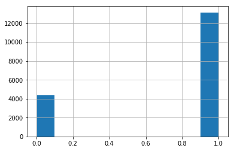
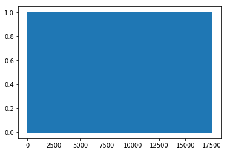

# Simple CNN

> Author: https://www.kaggle.com/mariammohamed

> From: https://www.kaggle.com/mariammohamed/simple-cnn

> License: [Apache 2.0](http://www.apache.org/licenses/LICENSE-2.0)

> Score: 0.9995

In [1]:

```py
# This Python 3 environment comes with many helpful analytics libraries installed
# It is defined by the kaggle/python docker image: https://github.com/kaggle/docker-python
# For example, here's several helpful packages to load in 

import numpy as np # linear algebra
import pandas as pd # data processing, CSV file I/O (e.g. pd.read_csv)

# Input data files are available in the "../input/" directory.
# For example, running this (by clicking run or pressing Shift+Enter) will list the files in the input directory

import os
print(os.listdir("../input"))

# Any results you write to the current directory are saved as output.

```

```
['train', 'test', 'train.csv', 'sample_submission.csv']

```

In [2]:

```py
import numpy as np
import pandas as pd
import matplotlib.pyplot as plt
import matplotlib.image as mpimg
import glob
import scipy
import cv2

import keras

```

```
Using TensorFlow backend.

```

In [3]:

```py
import random

```

**Exploration**

In [4]:

```py
train_data = pd.read_csv('../input/train.csv')

```

In [5]:

```py
train_data.shape

```

Out[5]:

```
(17500, 2)
```

In [6]:

```py
train_data.head()

```

Out[6]:

|  | id | has_cactus |
| --- | --- | --- |
| 0 | 0004be2cfeaba1c0361d39e2b000257b.jpg | 1 |
| --- | --- | --- |
| 1 | 000c8a36845c0208e833c79c1bffedd1.jpg | 1 |
| --- | --- | --- |
| 2 | 000d1e9a533f62e55c289303b072733d.jpg | 1 |
| --- | --- | --- |
| 3 | 0011485b40695e9138e92d0b3fb55128.jpg | 1 |
| --- | --- | --- |
| 4 | 0014d7a11e90b62848904c1418fc8cf2.jpg | 1 |
| --- | --- | --- |

In [7]:

```py
train_data.has_cactus.unique()

```

Out[7]:

```
array([1, 0])
```

In [8]:

```py
train_data.has_cactus.hist()

```

Out[8]:

```
<matplotlib.axes._subplots.AxesSubplot at 0x7fedb9b7a080>
```

In [9]:

```py
train_data.has_cactus.value_counts()

```

Out[9]:

```
1    13136
0     4364
Name: has_cactus, dtype: int64
```

In [10]:

```py
train_data.has_cactus.plot()

```

Out[10]:

```
<matplotlib.axes._subplots.AxesSubplot at 0x7fedb9aa7f98>
```



**Model**

In [11]:

```py
def image_generator2(batch_size = 16, all_data=True, shuffle=True, train=True, indexes=None):
    while True:
        if indexes is None:
            if train:
                if all_data:
                    indexes = np.arange(train_data.shape[0])
                else:
                    indexes = np.arange(train_data[:15000].shape[0])
                if shuffle:
                    np.random.shuffle(indexes)
            else:
                indexes = np.arange(train_data[15000:].shape[0])

        N = int(len(indexes) / batch_size)

        # Read in each input, perform preprocessing and get labels
        for i in range(N):
            current_indexes = indexes[i*batch_size: (i+1)*batch_size]
            batch_input = []
            batch_output = [] 
            for index in current_indexes:
                img = mpimg.imread('../input/train/train/' + train_data.id[index])
                batch_input += [img]
                batch_input += [img[::-1, :, :]]
                batch_input += [img[:, ::-1, :]]
                batch_input += [np.rot90(img)]

                temp_img = np.zeros_like(img)
                temp_img[:28, :, :] = img[4:, :, :]
                batch_input += [temp_img]

                temp_img = np.zeros_like(img)
                temp_img[:, :28, :] = img[:, 4:, :]
                batch_input += [temp_img]

                temp_img = np.zeros_like(img)
                temp_img[4:, :, :] = img[:28, :, :]
                batch_input += [temp_img]

                temp_img = np.zeros_like(img)
                temp_img[:, 4:, :] = img[:, :28, :]
                batch_input += [temp_img]

                batch_input += [cv2.resize(img[2:30, 2:30, :], (32, 32))]

                batch_input += [scipy.ndimage.interpolation.rotate(img, 10, reshape=False)]

                batch_input += [scipy.ndimage.interpolation.rotate(img, 5, reshape=False)]

                for _ in range(11):
                    batch_output += [train_data.has_cactus[index]]

            batch_input = np.array( batch_input )
            batch_output = np.array( batch_output )

            yield( batch_input, batch_output.reshape(-1, 1) )

```

In [12]:

```py
positive_examples = train_data[train_data.has_cactus==1]
negative_examples = train_data[train_data.has_cactus==0]

```

In [13]:

```py
def augment_img(img):
    batch_input = []
    batch_input += [img]
    batch_input += [img[::-1, :, :]]
    batch_input += [img[:, ::-1, :]]
    batch_input += [np.rot90(img)]

    temp_img = np.zeros_like(img)
    temp_img[:28, :, :] = img[4:, :, :]
    batch_input += [temp_img]

    temp_img = np.zeros_like(img)
    temp_img[:, :28, :] = img[:, 4:, :]
    batch_input += [temp_img]

    temp_img = np.zeros_like(img)
    temp_img[4:, :, :] = img[:28, :, :]
    batch_input += [temp_img]

    temp_img = np.zeros_like(img)
    temp_img[:, 4:, :] = img[:, :28, :]
    batch_input += [temp_img]

    batch_input += [cv2.resize(img[2:30, 2:30, :], (32, 32))]

    batch_input += [scipy.ndimage.interpolation.rotate(img, 10, reshape=False)]

    batch_input += [scipy.ndimage.interpolation.rotate(img, 5, reshape=False)]

    return batch_input

```

In [14]:

```py
def image_generator(batch_size = 8, all_data=True, shuffle=True, train=True, indexes=None):
    while True:
        if indexes is None:
            if train:
                indexes = positive_examples.index.tolist()
                neg_indexes = negative_examples.index.tolist()
                if shuffle:
                    np.random.shuffle(indexes)
                    np.random.shuffle(neg_indexes)

        N = int(len(indexes) / (batch_size/2))
        neg_N = int(len(neg_indexes) / (batch_size/2))

        j = 0

        # Read in each input, perform preprocessing and get labels
        for i in range(N):
            current_indexes = indexes[i*(batch_size//2): (i+1)*(batch_size//2)]
            current_neg_indexes = neg_indexes[j*(batch_size//2): (j+1)*(batch_size//2)]
            j = (j + 1) % neg_N
            batch_input = []
            batch_output = [] 
            for ind in range(len(current_indexes)):
                index = current_indexes[ind]
                neg_index = current_neg_indexes[ind]

                img = mpimg.imread('../input/train/train/' + train_data.id[index])
                batch_input.extend(augment_img(img))
                for _ in range(11):
                    batch_output += [train_data.has_cactus[index]]

                neg_img = mpimg.imread('../input/train/train/' + train_data.id[neg_index])
                batch_input.extend(augment_img(neg_img))
                for _ in range(11):
                    batch_output += [train_data.has_cactus[neg_index]]

#                 factor = 0.05
#                 new_img = factor*neg_img + (1-factor)*img
#                 batch_input.append(new_img)
#                 batch_output += [factor*train_data.has_cactus[neg_index]+(1-factor)*train_data.has_cactus[index]]

#                 factor = 0.95
#                 new_img = factor*neg_img + (1-factor)*img
#                 batch_input.append(new_img)
#                 batch_output += [factor*train_data.has_cactus[neg_index]+(1-factor)*train_data.has_cactus[index]]

            batch_input = np.array( batch_input )
            batch_output = np.array( batch_output )

            yield( batch_input, batch_output.reshape(-1, 1) )

```

In [15]:

```py
model = keras.models.Sequential()
model.add(keras.layers.Conv2D(64, (5, 5), input_shape=(32, 32, 3)))
model.add(keras.layers.BatchNormalization())
model.add(keras.layers.LeakyReLU(alpha=0.3))

model.add(keras.layers.Conv2D(64, (5, 5)))
model.add(keras.layers.BatchNormalization())
model.add(keras.layers.LeakyReLU(alpha=0.3))

model.add(keras.layers.Conv2D(128, (5, 5)))
model.add(keras.layers.BatchNormalization())
model.add(keras.layers.LeakyReLU(alpha=0.3))

model.add(keras.layers.Conv2D(128, (5, 5)))
model.add(keras.layers.BatchNormalization())
model.add(keras.layers.LeakyReLU(alpha=0.3))

model.add(keras.layers.Conv2D(256, (3, 3)))
model.add(keras.layers.BatchNormalization())
model.add(keras.layers.LeakyReLU(alpha=0.3))

model.add(keras.layers.Conv2D(256, (3, 3)))
model.add(keras.layers.BatchNormalization())
model.add(keras.layers.LeakyReLU(alpha=0.3))

model.add(keras.layers.Conv2D(512, (3, 3)))
model.add(keras.layers.BatchNormalization())
model.add(keras.layers.LeakyReLU(alpha=0.3))

model.add(keras.layers.Flatten())

model.add(keras.layers.Dense(100))
model.add(keras.layers.BatchNormalization())
model.add(keras.layers.LeakyReLU(alpha=0.3))

model.add(keras.layers.Dense(1, activation='sigmoid'))

```

```
WARNING:tensorflow:From /opt/conda/lib/python3.6/site-packages/tensorflow/python/framework/op_def_library.py:263: colocate_with (from tensorflow.python.framework.ops) is deprecated and will be removed in a future version.
Instructions for updating:
Colocations handled automatically by placer.

```

In [16]:

```py
model.summary()

```

```
_________________________________________________________________
Layer (type)                 Output Shape              Param #   
=================================================================
conv2d_1 (Conv2D)            (None, 28, 28, 64)        4864      
_________________________________________________________________
batch_normalization_1 (Batch (None, 28, 28, 64)        256       
_________________________________________________________________
leaky_re_lu_1 (LeakyReLU)    (None, 28, 28, 64)        0         
_________________________________________________________________
conv2d_2 (Conv2D)            (None, 24, 24, 64)        102464    
_________________________________________________________________
batch_normalization_2 (Batch (None, 24, 24, 64)        256       
_________________________________________________________________
leaky_re_lu_2 (LeakyReLU)    (None, 24, 24, 64)        0         
_________________________________________________________________
conv2d_3 (Conv2D)            (None, 20, 20, 128)       204928    
_________________________________________________________________
batch_normalization_3 (Batch (None, 20, 20, 128)       512       
_________________________________________________________________
leaky_re_lu_3 (LeakyReLU)    (None, 20, 20, 128)       0         
_________________________________________________________________
conv2d_4 (Conv2D)            (None, 16, 16, 128)       409728    
_________________________________________________________________
batch_normalization_4 (Batch (None, 16, 16, 128)       512       
_________________________________________________________________
leaky_re_lu_4 (LeakyReLU)    (None, 16, 16, 128)       0         
_________________________________________________________________
conv2d_5 (Conv2D)            (None, 14, 14, 256)       295168    
_________________________________________________________________
batch_normalization_5 (Batch (None, 14, 14, 256)       1024      
_________________________________________________________________
leaky_re_lu_5 (LeakyReLU)    (None, 14, 14, 256)       0         
_________________________________________________________________
conv2d_6 (Conv2D)            (None, 12, 12, 256)       590080    
_________________________________________________________________
batch_normalization_6 (Batch (None, 12, 12, 256)       1024      
_________________________________________________________________
leaky_re_lu_6 (LeakyReLU)    (None, 12, 12, 256)       0         
_________________________________________________________________
conv2d_7 (Conv2D)            (None, 10, 10, 512)       1180160   
_________________________________________________________________
batch_normalization_7 (Batch (None, 10, 10, 512)       2048      
_________________________________________________________________
leaky_re_lu_7 (LeakyReLU)    (None, 10, 10, 512)       0         
_________________________________________________________________
flatten_1 (Flatten)          (None, 51200)             0         
_________________________________________________________________
dense_1 (Dense)              (None, 100)               5120100   
_________________________________________________________________
batch_normalization_8 (Batch (None, 100)               400       
_________________________________________________________________
leaky_re_lu_8 (LeakyReLU)    (None, 100)               0         
_________________________________________________________________
dense_2 (Dense)              (None, 1)                 101       
=================================================================
Total params: 7,913,625
Trainable params: 7,910,609
Non-trainable params: 3,016
_________________________________________________________________

```

In [17]:

```py
opt = keras.optimizers.SGD(lr=0.0001, momentum=0.9, nesterov=True)
model.compile(optimizer=opt, loss='binary_crossentropy', metrics=['accuracy'])

```

In [18]:

```py
def step_decay_schedule(initial_lr=1e-3, decay_factor=0.75, step_size=10):
    '''
 Wrapper function to create a LearningRateScheduler with step decay schedule.
 '''
    def schedule(epoch):
        return initial_lr * (decay_factor ** np.floor(epoch/step_size))

    return keras.callbacks.LearningRateScheduler(schedule)

lr_sched = step_decay_schedule(initial_lr=1e-3, decay_factor=0.75, step_size=2)
early_stop = keras.callbacks.EarlyStopping(monitor='loss', patience=3)

model.fit_generator(image_generator(), steps_per_epoch= train_data.shape[0] / 8, epochs=30, callbacks=[lr_sched, early_stop])

```

```
WARNING:tensorflow:From /opt/conda/lib/python3.6/site-packages/tensorflow/python/ops/math_ops.py:3066: to_int32 (from tensorflow.python.ops.math_ops) is deprecated and will be removed in a future version.
Instructions for updating:
Use tf.cast instead.
Epoch 1/30
2188/2187 [==============================] - 86s 39ms/step - loss: 0.0982 - acc: 0.9642
Epoch 2/30
2188/2187 [==============================] - 81s 37ms/step - loss: 0.0414 - acc: 0.9855
Epoch 3/30
2188/2187 [==============================] - 80s 37ms/step - loss: 0.0200 - acc: 0.9931
Epoch 4/30
2188/2187 [==============================] - 80s 37ms/step - loss: 0.0122 - acc: 0.9961
Epoch 5/30
2188/2187 [==============================] - 80s 37ms/step - loss: 0.0066 - acc: 0.9982
Epoch 6/30
1897/2187 [=========================>....] - ETA: 10s - loss: 0.0050 - acc: 0.9988
```

In [19]:

```py
# def step_decay_schedule(initial_lr=1e-3, decay_factor=0.75, step_size=10):
#     '''
#     Wrapper function to create a LearningRateScheduler with step decay schedule.
#     '''
#     def schedule(epoch):
#         return initial_lr * (decay_factor ** np.floor(epoch/step_size))

#     return keras.callbacks.LearningRateScheduler(schedule)

# lr_sched = step_decay_schedule(initial_lr=1e-3, decay_factor=0.75, step_size=2)

# model.fit_generator(image_generator(), steps_per_epoch= train_data.shape[0] / 8, epochs=20, callbacks=[lr_sched])

```

In [20]:

```py
model.evaluate_generator(image_generator2(), steps=train_data.shape[0]//16)

```

Out[20]:

```
[0.009791018411583233, 0.9962779681069635]
```

In [21]:

```py
# model.evaluate_generator(image_generator(), steps=train_data.shape[0]//8)

```

In [22]:

```py
# keras.backend.eval(model.optimizer.lr.assign(0.00001))

```

In [23]:

```py
# model.fit_generator(image_generator(), steps_per_epoch= train_data.shape[0] / 16, epochs=15)

```

In [24]:

```py
indexes = np.arange(train_data.shape[0])
N = int(len(indexes) / 64)   
batch_size = 64

wrong_ind = []
for i in range(N):
            current_indexes = indexes[i*64: (i+1)*64]
            batch_input = []
            batch_output = [] 
            for index in current_indexes:
                img = mpimg.imread('../input/train/train/' + train_data.id[index])
                batch_input += [img]
                batch_output.append(train_data.has_cactus[index])

            batch_input = np.array( batch_input )
#             batch_output = np.array( batch_output )

            model_pred = model.predict_classes(batch_input)
            for j in range(len(batch_output)):
                if model_pred[j] != batch_output[j]:
                    wrong_ind.append(i*batch_size+j)

```

In [25]:

```py
len(wrong_ind)

```

Out[25]:

```
28
```

In [26]:

```py
indexes = np.arange(train_data.shape[0])
N = int(len(indexes) / 64)   
batch_size = 64

wrong_ind = []
for i in range(N):
            current_indexes = indexes[i*64: (i+1)*64]
            batch_input = []
            batch_output = [] 
            for index in current_indexes:
                img = mpimg.imread('../input/train/train/' + train_data.id[index])
                batch_input += [img[::-1, :, :]]
                batch_output.append(train_data.has_cactus[index])

            batch_input = np.array( batch_input )

            model_pred = model.predict_classes(batch_input)
            for j in range(len(batch_output)):
                if model_pred[j] != batch_output[j]:
                    wrong_ind.append(i*batch_size+j)

```

In [27]:

```py
len(wrong_ind)

```

Out[27]:

```
60
```

In [28]:

```py
indexes = np.arange(train_data.shape[0])
N = int(len(indexes) / 64)   
batch_size = 64

wrong_ind = []
for i in range(N):
            current_indexes = indexes[i*64: (i+1)*64]
            batch_input = []
            batch_output = [] 
            for index in current_indexes:
                img = mpimg.imread('../input/train/train/' + train_data.id[index])
                batch_input += [img[:, ::-1, :]]
                batch_output.append(train_data.has_cactus[index])

            batch_input = np.array( batch_input )

            model_pred = model.predict_classes(batch_input)
            for j in range(len(batch_output)):
                if model_pred[j] != batch_output[j]:
                    wrong_ind.append(i*batch_size+j)

```

In [29]:

```py
len(wrong_ind)

```

Out[29]:

```
71
```

In [30]:

```py
!ls ../input/test/test/* | wc -l

```

```
4000

```

In [31]:

```py
test_files = os.listdir('../input/test/test/')

```

In [32]:

```py
len(test_files)

```

Out[32]:

```
4000
```

In [33]:

```py
batch = 40
all_out = []
for i in range(int(4000/batch)):
    images = []
    for j in range(batch):
        img = mpimg.imread('../input/test/test/'+test_files[i*batch + j])
        images += [img]
    out = model.predict(np.array(images))
    all_out += [out]

```

In [34]:

```py
all_out = np.array(all_out).reshape((-1, 1))

```

In [35]:

```py
all_out.shape

```

Out[35]:

```
(4000, 1)
```

In [36]:

```py
sub_file = pd.DataFrame(data = {'id': test_files, 'has_cactus': all_out.reshape(-1).tolist()})

```

In [37]:

```py
sub_file.to_csv('sample_submission.csv', index=False)

```