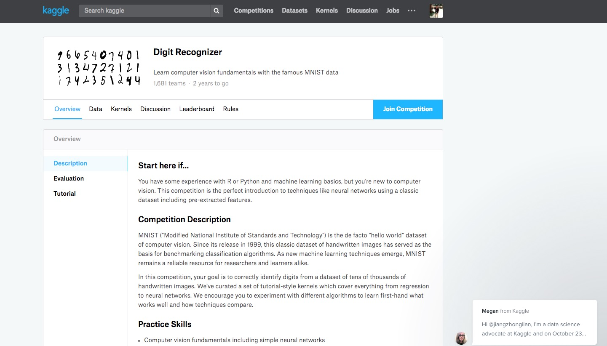

# [Kaggle](https://www.kaggle.com) 入门操作指南

## [注册](https://www.kaggle.com/?login=true)

1. 首先注册账号
2. 关联 GitHub 账号


## [比赛 - competitions](https://www.kaggle.com/competitions)

* [选择 - All 和 Getting Started](https://www.kaggle.com/competitions?sortBy=deadline&group=all&page=1&pageSize=20&segment=gettingStarted)


* [选择 - Digit Recognizer（数字识别器）](https://www.kaggle.com/c/digit-recognizer)


* [阅读资料 - Digit Recognizer（数字识别器）](https://www.kaggle.com/c/digit-recognizer)



**后面会持续更新**

## GitHub 使用

<video id="video" controls="" preload="none" poster="http://media.w3.org/2010/05/sintel/poster.png">
      <source id="mp4" src="http://media.w3.org/2010/05/sintel/trailer.mp4" type="video/mp4">
      <p>Your user agent does not support the HTML5 Video element.</p>
</video>

> fork apachecn/kaggle 项目


> jiangzhonglian/kaggle 第一次初始化

可以使用 vscode 进行可视化操作

```
clone 自己的 repo 仓库  （这个是自己的地址， jiangzhonglian是我的，别弄错了）
$ git clone https://github.com/jiangzhonglian/kaggle.git

## 进入该仓库的文件夹
$ cd kaggle

## 查看该仓库远程 repo
$ git remote

## 添加 apachecn 的远程 repo 仓库（添加一次以后就不用使用了）
$ git remote add origin_online https://github.com/apachecn/kaggle.git
```

> jiangzhonglian/kaggle 文件更新（修改文件后，第二次要进行提交）

```
# 用于 pull 保持和 apachecn 同步
$ git pull origin_online master

#上传到 自己的 repo 仓库
$ git push origin master
```

> pull requests 到 apachecn/kaggle

