# 一、从零扩展到数百万用户

设计一个支持数百万用户的系统极具挑战性，这是一个需要不断改进和完善的旅程。在这一章中，我们构建了一个支持单个用户的系统，并逐步将其扩展到服务数百万用户。读完这一章，你将掌握一些技巧，帮助你解决系统设计面试问题。

## 单服务器设置

千里之行始于足下，构建一个复杂的系统也不例外。从简单的开始，一切都运行在一台服务器上。图 1-1 展示了一个单一的服务器设置，所有的东西都在一个服务器上运行:web 应用程序、数据库、缓存等等。

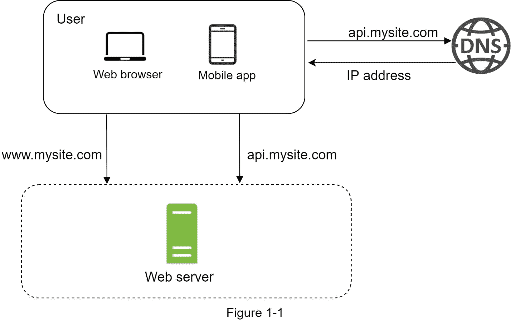

为了理解这种设置，研究请求流和流量源是有帮助的。让我们首先看看请求流程(图 1-2)。

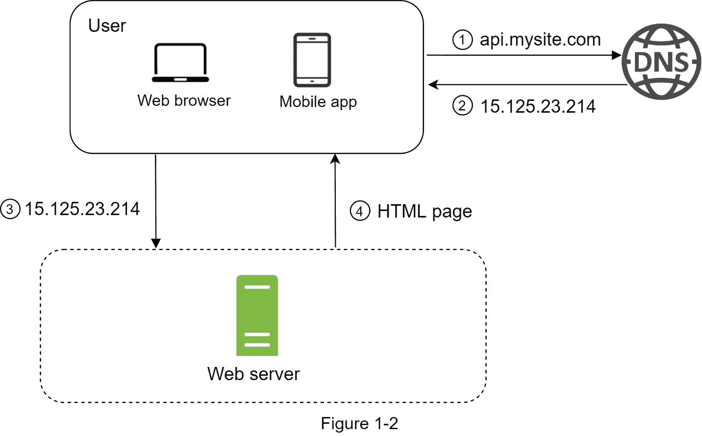

1。用户通过域名访问网站，如 api.mysite.com。通常，域名系统(DNS)是由第三方提供的付费服务，而不是由我们的服务器托管。

2。互联网协议(IP)地址返回给浏览器或移动应用程序。在本例中，返回了 IP 地址 15.125.23.214。

3。一旦获得 IP 地址，超文本传输协议(HTTP) [1]请求就直接发送到您的 web 服务器。

4。web 服务器返回 HTML 页面或 JSON 响应进行呈现。

接下来，我们来考察一下流量来源。web 服务器的流量来自两个来源:web 应用程序和移动应用程序。

Web 应用:使用服务器端语言的组合(Java、Python 等。)来处理业务逻辑、存储等。，以及用于表示的客户端语言(HTML 和 JavaScript)。

手机应用:HTTP 协议是手机 app 与 web 服务器之间的通信协议。JavaScript Object Notation (JSON)因其简单性而成为传输数据的常用 API 响应格式。JSON 格式的 API 响应示例如下所示:

GET/users/12–检索 id = 12 的用户对象

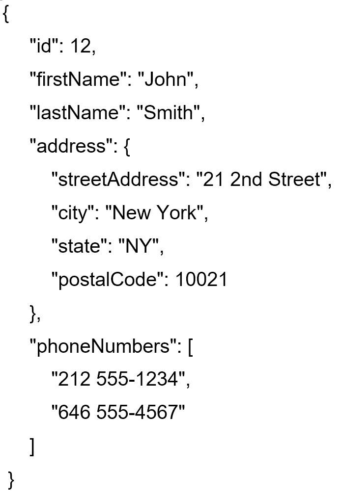

## 数据库

随着用户群的增长，一台服务器是不够的，我们需要多台服务器:一台用于 web/移动流量，另一台用于数据库(图 1-3)。将 web/移动流量(web 层)和数据库(数据层)服务器分开，可以使它们独立扩展。

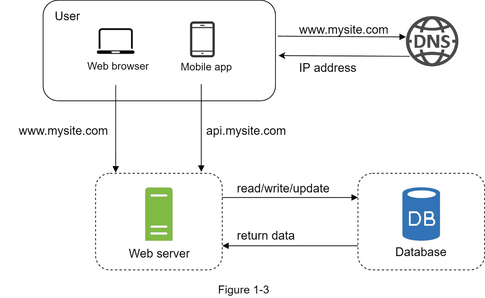

### 使用哪些数据库？

您可以在传统的关系数据库和非关系数据库之间进行选择。让我们来看看他们的不同之处。

关系数据库也称为关系数据库管理系统(RDBMS)或 SQL 数据库。最受欢迎的有 MySQL、Oracle 数据库、PostgreSQL 等。关系数据库在表和行中表示和存储数据。您可以使用 SQL 跨不同的数据库表执行连接操作。

非关系数据库也称为 NoSQL 数据库。比较流行的有 CouchDB，Neo4j，Cassandra，HBase，Amazon DynamoDB 等。[2].这些数据库分为四类:键值存储、图形存储、列存储和文档存储。非关系数据库中通常不支持连接操作。

对于大多数开发人员来说，关系数据库是最好的选择，因为它们已经存在了 40 多年，而且从历史上看，它们工作得很好。但是，如果关系数据库不适合您的特定用例，那么探索关系数据库之外的内容是至关重要的。非关系数据库可能是正确的选择，如果:

您的应用需要超低延迟。

您的数据是非结构化的，或者您没有任何关系数据。

你只需要序列化和反序列化数据(JSON、XML、YAML 等)。).

你需要存储海量的数据。

## 垂直缩放与水平缩放

垂直扩展，简称“纵向扩展”，是指增加更多功能(CPU、RAM 等)的过程。)到您的服务器。水平扩展，也称为“横向扩展”，允许您通过向资源池中添加更多服务器来进行扩展。

当流量较低时，垂直扩展是一个很好的选择，垂直扩展的简单性是其主要优势。不幸的是，它有严重的局限性。

垂直缩放有硬限制。不可能给单个服务器添加无限的 CPU 和内存。

垂直扩展不具备故障转移和冗余。如果一台服务器宕机，网站/应用程序也会随之完全宕机。

由于垂直缩放的局限性，水平缩放更适合大规模应用。

在以前的设计中，用户是直接连接到 web 服务器的。如果 web 服务器离线，用户将无法访问网站。在另一种情况下，如果许多用户同时访问 web 服务器，并且达到了 web 服务器的负载极限，用户通常会经历较慢的响应或无法连接到服务器。负载平衡器是解决这些问题的最佳技术。

## 负载均衡器

负载平衡器在负载平衡集中定义的 web 服务器之间均匀地分配传入流量。图 1-4 显示了负载均衡器是如何工作的。

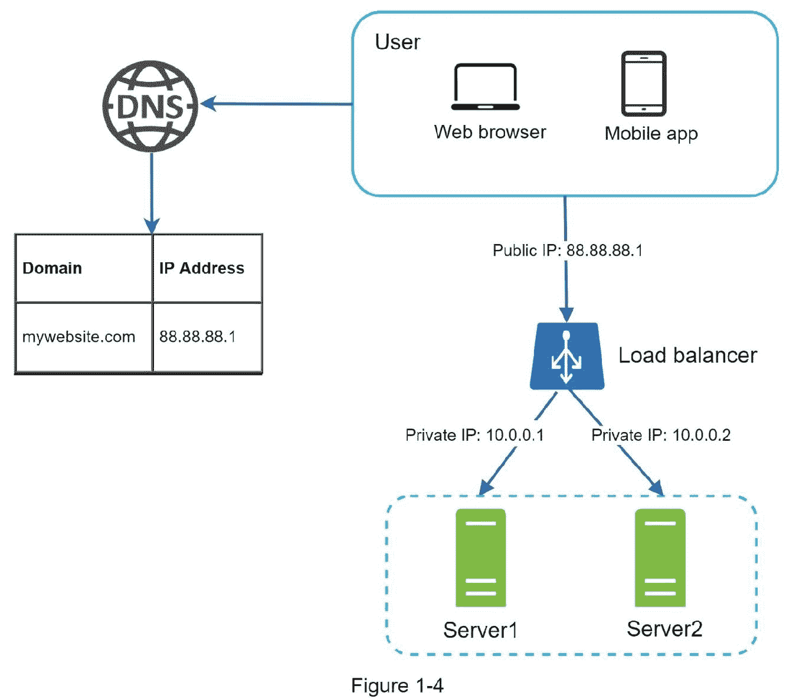

如图 1-4 所示，用户直接连接到负载均衡器的公共 IP。有了这个设置，客户端就不能直接访问 web 服务器了。为了更好的安全性，私有 IP 用于服务器之间的通信。专用 IP 是只能在同一网络中的服务器之间到达的 IP 地址；但是，它无法通过互联网访问。负载平衡器通过私有 IP 与 web 服务器通信。

在图 1-4 中，在添加了负载平衡器和第二台 web 服务器后，我们成功地解决了无故障转移问题，并提高了 web 层的可用性。详细解释如下:

如果服务器 1 离线，所有流量将被路由到服务器 2。这可以防止网站脱机。我们还将在服务器池中添加一个新的健康的 web 服务器来平衡负载。

如果网站流量快速增长，两台服务器不足以处理流量，负载均衡器可以优雅地处理这个问题。您只需要向 web 服务器池中添加更多的服务器，负载平衡器就会自动开始向它们发送请求。

现在 web 层看起来不错，那么数据层呢？当前设计只有一个数据库，因此不支持故障转移和冗余。数据库复制是解决这些问题的常用技术。让我们来看看。

## 数据库复制

引自维基百科:“数据库复制可以用在很多数据库管理系统中，通常在原件(主)和副本(从)之间存在主/从关系”[3]。

主数据库通常只支持写操作。从数据库从主数据库获取数据的副本，并且只支持读操作。所有数据修改命令，如插入、删除或更新，都必须发送到 master 数据库。大多数应用程序需要更高的读写比率；因此，系统中从数据库的数量通常大于主数据库的数量。图 1-5 显示了一个主数据库和多个从数据库。

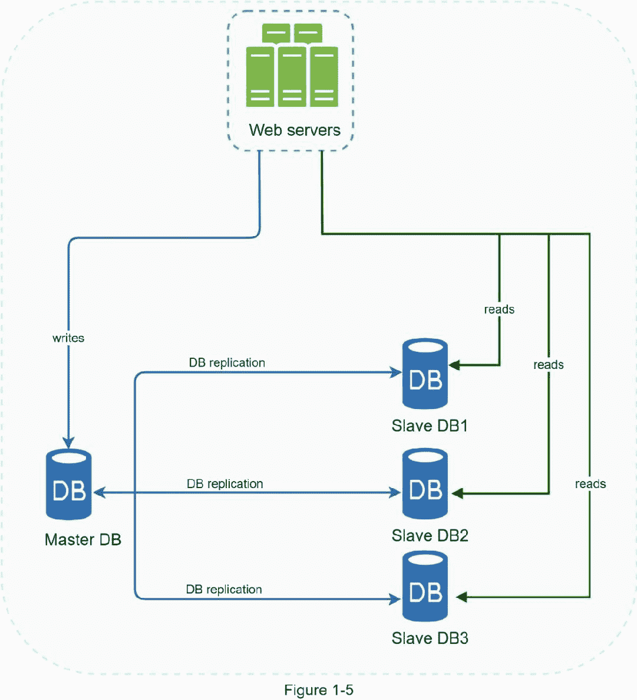

数据库复制的优势:

更好的性能:在主从模式下，所有的写入和更新都发生在主节点；而读取操作分布在从节点上。该模型提高了性能，因为它允许并行处理更多的查询。

可靠性:如果你的一个数据库服务器被自然灾害摧毁，比如台风或地震，数据仍然保存。您不必担心数据丢失，因为数据是跨多个位置复制的。

高可用性:通过跨不同位置复制数据，即使一个数据库离线，您的网站也能保持运行，因为您可以访问存储在另一个数据库服务器中的数据。

在上一节中，我们讨论了负载平衡器如何帮助提高系统可用性。我们在这里问同样的问题:如果其中一个数据库离线了怎么办？图 1-5 中讨论的架构设计可以处理这种情况:

如果只有一个从数据库可用，并且它脱机，读取操作将临时定向到主数据库。一旦发现问题，新的从数据库将替换旧的从数据库。如果有多个从数据库可用，读取操作将被重定向到其他健康的从数据库。新的数据库服务器将取代旧的。

如果主数据库离线，从数据库将升级为新的主数据库。所有数据库操作都将临时在新的主数据库上执行。一个新的从属数据库将立即替换旧的数据库进行数据复制。在生产系统中，提升新的主数据库更加复杂，因为从数据库中的数据可能不是最新的。需要通过运行数据恢复脚本来更新丢失的数据。虽然其他一些复制方法，如多母盘和循环复制可能会有所帮助，但这些设置更复杂；他们的讨论超出了本书的范围。感兴趣的读者应该参考列出的参考资料[4] [5]。

图 1-6 显示了添加负载均衡器和数据库复制后的系统设计。

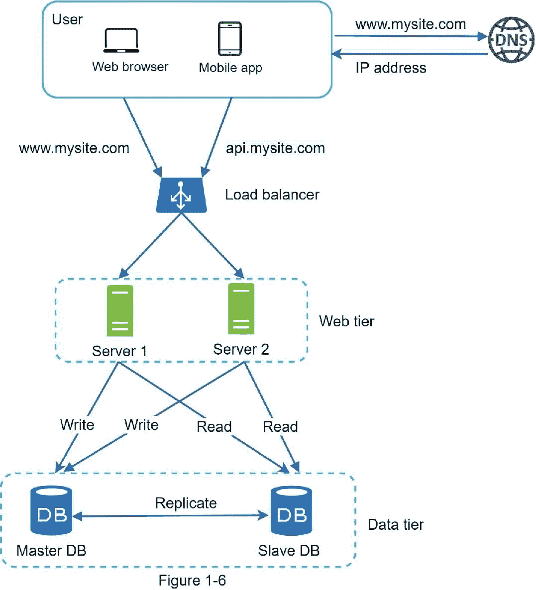

让我们来看看设计:

用户从 DNS 获取负载均衡器的 IP 地址。

用户使用此 IP 地址连接负载平衡器。

HTTP 请求被路由到服务器 1 或服务器 2。

web 服务器从从数据库读取用户数据。

网络服务器将任何数据修改操作路由到主数据库。这包括写入、更新和删除操作。

现在，您已经对 web 和数据层有了深入的了解，是时候改善加载/响应时间了。这可以通过添加缓存层并将静态内容(JavaScript/CSS/图像/视频文件)转移到内容交付网络(CDN)来实现。

## 缓存

缓存是一个临时存储区域，它将昂贵的响应结果或频繁访问的数据存储在内存中，以便更快地处理后续请求。如图 1-6 所示，每次加载新的网页时，都会执行一个或多个数据库调用来获取数据。重复调用数据库会极大地影响应用程序的性能。缓存可以缓解这个问题。

### 缓存层

缓存层是一个临时数据存储层，比数据库快得多。拥有单独的缓存层的好处包括更好的系统性能、减少数据库工作负载的能力以及独立扩展缓存层的能力。图 1-7 显示了一个缓存服务器的可能设置:

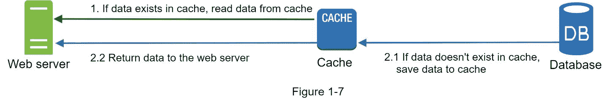

web 服务器收到请求后，首先检查缓存是否有可用的响应。如果有，它会将数据发送回客户端。如果没有，它查询数据库，将响应存储在缓存中，并将其发送回客户端。这种缓存策略称为通读缓存。根据数据类型、大小和访问模式，还可以使用其他缓存策略。之前的一项研究解释了不同的缓存策略是如何工作的[6]。

与缓存服务器交互很简单，因为大多数缓存服务器都提供了通用编程语言的 API。下面的代码片段展示了典型的 Memcached API:

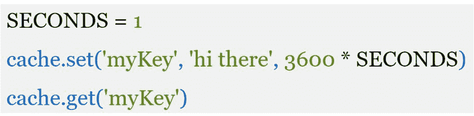

### 使用缓存的注意事项

这里有一些使用缓存系统的注意事项:

决定何时使用缓存。当数据经常被读取但很少被修改时，可以考虑使用缓存。由于缓存数据存储在易失性内存中，缓存服务器并不适合持久化数据。例如，如果缓存服务器重新启动，内存中的所有数据都会丢失。因此，重要的数据应该保存在持久数据存储中。

到期政策。实现过期策略是一个很好的做法。缓存的数据一旦过期，就会从缓存中删除。如果没有过期策略，缓存的数据将永久存储在内存中。建议不要将到期日期设置得太短，因为这会导致系统过于频繁地从数据库中重新加载数据。同时，建议不要让到期日期太长，因为数据可能会变得陈旧。

一致性:这涉及到保持数据存储和缓存同步。由于数据存储和缓存上的数据修改操作不在单个事务中，因此可能会发生不一致。当跨多个区域扩展时，维护数据存储和缓存之间的一致性是一项挑战。要了解更多细节，请参考脸书发表的题为“在脸书扩展 Memcache”的论文[7]。

减轻故障:单个缓存服务器代表潜在的单点故障(SPOF)，在维基百科中定义如下:“单点故障(SPOF)是系统的一部分，如果它发生故障，将停止整个系统的工作”[8]。因此，建议跨不同数据中心的多个缓存服务器来避免 SPOF。另一个推荐的方法是按照一定的百分比过度配置所需的内存。这在内存使用增加时提供了一个缓冲。

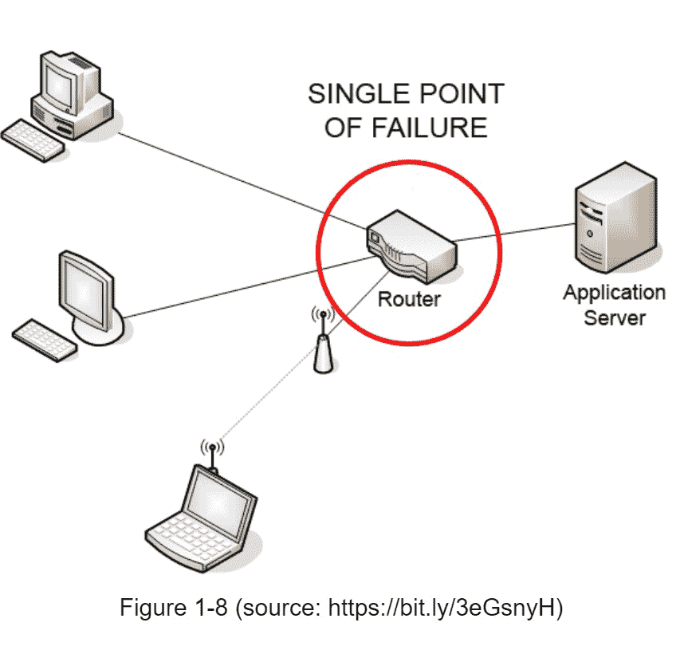

驱逐策略: 一旦高速缓存已满，任何向高速缓存添加项目的请求都可能导致现有项目被移除。这被称为缓存回收。最近最少使用(LRU)是最流行的缓存回收策略。可以采用其他驱逐策略，如最不常用(LFU)或先进先出(FIFO)，以满足不同的使用情况。

## 【内容交付网络(CDN)

CDN 是地理上分散的服务器网络，用于交付静态内容。CDN 服务器缓存静态内容，如图像、视频、CSS、JavaScript 文件等。

动态内容缓存是一个相对较新的概念，超出了本书的范围。它支持基于请求路径、查询字符串、cookies 和请求头的 HTML 页面的缓存。有关这方面的更多信息，请参考参考资料[9]中提到的文章。本书重点讲述如何使用 CDN 缓存静态内容。

下面是 CDN 在高层的工作方式:当用户访问一个网站时，离用户最近的 CDN 服务器将提供静态内容。直觉上，用户离 CDN 服务器越远，网站加载越慢。例如，如果 CDN 服务器在旧金山，洛杉矶的用户将比欧洲的用户更快地获得内容。图 1-9 是一个很好的例子，展示了 CDN 如何改善加载时间。

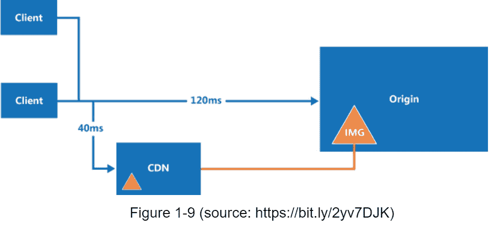

图 1-10 演示了 CDN 

1。用户 A 试图通过使用图像 URL 来获取 image.png。URL 的域由 CDN 提供商提供。下面两个图片 URL 是用来演示亚马逊和 Akamai CDNs 上的图片 URL 是什么样子的示例:

【https://mysite.cloudfront.net/logo.jpg】T2

【https://mysite.akamai.com/image-manager/img/logo.jpg】T2

2。如果 CDN 服务器的缓存中没有 image.png，CDN 服务器会从源服务器请求文件，源服务器可以是 web 服务器或在线存储，如亚马逊 S3。

3。原点将 image.png 返回给 CDN 服务器，其中包括可选的 HTTP 报头生存时间(TTL ),它描述了图像被缓存的时间。

4。CDN 缓存图像并将其返回给用户 a。图像会一直缓存在 CDN 中，直到 TTL 过期。

5。用户 B 发送一个请求来获得相同的图像。

6。只要 TTL 没有过期，就会从缓存中返回图像。

### 使用 CDN 的考虑事项

费用:CDN 由第三方提供商运营，进出 CDN 的数据传输向您收费。缓存不经常使用的资产不会带来显著的好处，因此您应该考虑将它们移出 CDN。

设置适当的缓存过期时间:对于时间敏感的内容，设置缓存过期时间很重要。 缓存到期时间不能太长也不能太短。如果太长，内容可能不再新鲜。如果太短，可能会导致内容从源服务器重复加载到 CDN。

CDN 回退:你应该考虑你的网站/应用如何应对 CDN 故障。如果有一个临时的 CDN 中断，客户端应该能够检测到问题，并从源请求资源。

使文件失效:您可以通过执行以下操作之一，在文件到期前将其从 CDN 中删除:

使用 CDN 厂商提供的 API 使 CDN 对象失效。

使用对象版本化来服务对象的不同版本。要对对象进行版本控制，可以向 URL 添加一个参数，如版本号。例如，版本号 2 被添加到查询字符串:image.png？v=2。

图 1-11 显示了添加 CDN 和缓存后的设计。

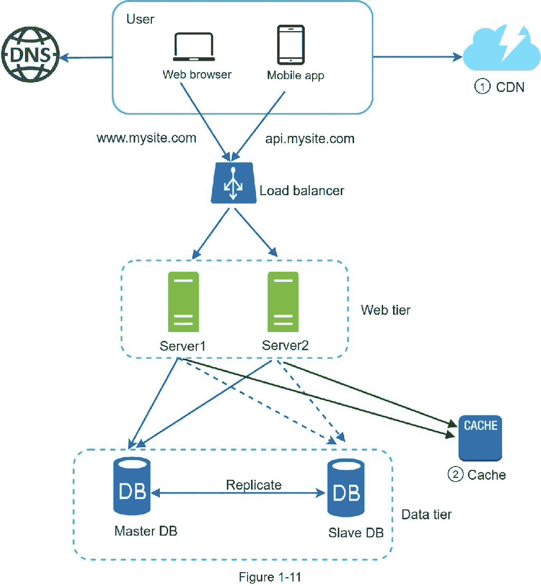

1。静态资产(JS、CSS、图片等。，)不再由 web 服务器提供服务。为了更好的性能，它们从 CDN 中取出。

2。通过缓存数据减轻了数据库负载。

## 无状态 web 层

现在是时候考虑横向扩展 web 层了。 为此，我们需要将状态(例如用户会话数据)移出 web 层。一个好的做法是将会话数据存储在持久存储中，如关系数据库或 NoSQL。群集中的每个 web 服务器都可以访问数据库中的状态数据。这被称为无状态 web 层。

### 有状态架构

有状态服务器和无状态服务器有一些关键的区别。有状态服务器从一个请求到下一个请求记住客户机数据(状态)。无状态服务器不保存状态信息。

图 1-12 显示了一个有状态架构的例子。

在图 1-12 中，用户 A 的会话数据和个人资料图像存储在服务器 1 中。要对用户 A 进行身份验证，HTTP 请求必须路由到服务器 1。如果请求被发送到其他服务器，如服务器 2，身份验证将失败，因为服务器 2 不包含用户 A 的会话数据。类似地，来自用户 B 的所有 HTTP 请求都必须路由到服务器 2；来自用户 C 的所有请求都必须发送到服务器 3。

问题是来自同一个客户端的每个请求都必须被路由到同一个服务器。这可以通过大多数负载平衡器中的粘性会话来实现[10]；然而，这增加了开销。使用这种方法添加或删除服务器要困难得多。处理服务器故障也是一项挑战。

### 无状态架构

图 1-13 显示了无状态架构。

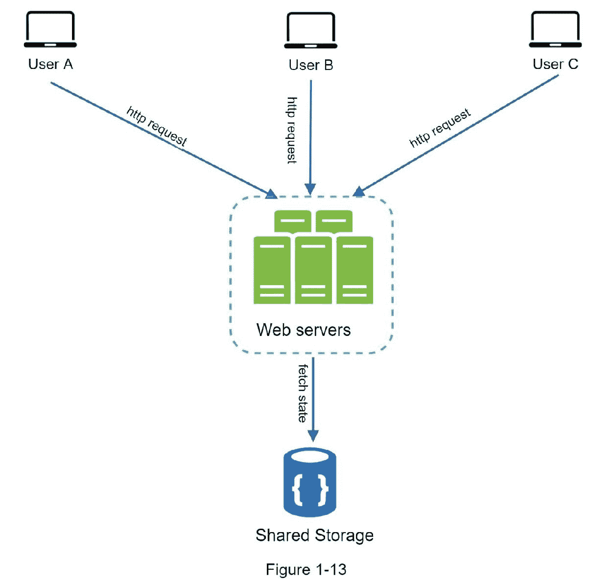

在这种无状态架构中，来自用户的 HTTP 请求可以发送到任何 web 服务器，这些服务器从共享数据存储中获取状态数据。状态数据存储在一个共享数据存储中，并远离 web 服务器。无状态系统更简单、更健壮、可伸缩。

图 1-14 显示了无状态 web 层的更新设计。

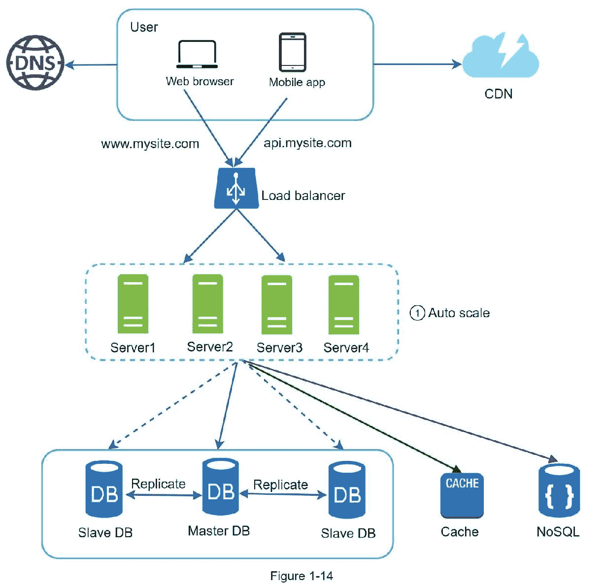

在图 1-14 中，我们将会话数据移出 web 层，并将它们存储在持久数据存储中。共享数据存储可以是关系数据库、Memcached/Redis、NoSQL 等。选择 NoSQL 数据存储是因为它易于扩展。自动缩放意味着根据流量负载自动添加或删除 web 服务器。从 web 服务器中删除状态数据后，可以根据流量负载添加或删除服务器，从而轻松实现 web 层的自动伸缩。

你的网站发展迅速，吸引了大量国际用户。为了提高可用性并在更广泛的地理区域提供更好的用户体验，支持多个数据中心至关重要。

## 数据中心

图 1-15 显示了两个数据中心的设置示例。在正常操作中，用户通过 geoDNS 路由(也称为地理路由)到达最近的数据中心，分流流量为美国东部的(100–x)%。geoDNS 是一种 DNS 服务，允许根据用户的位置将域名解析为 IP 地址。

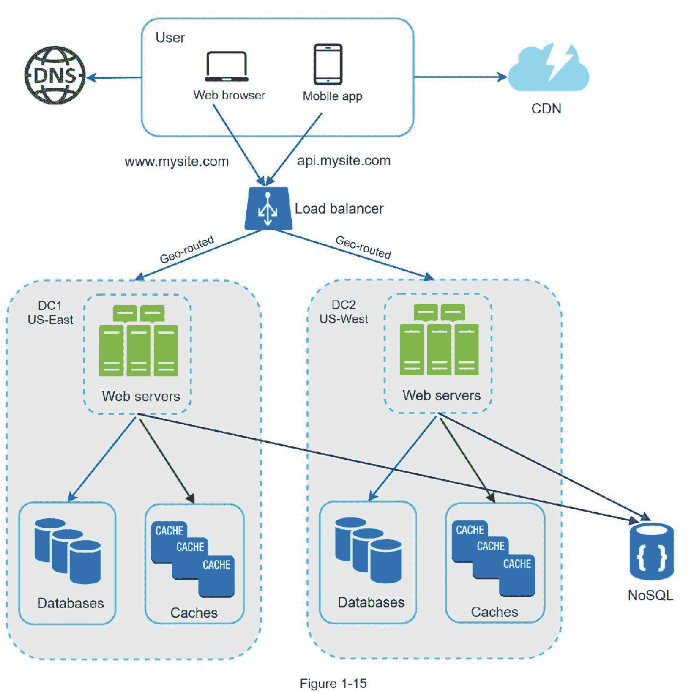

如果发生任何重大数据中心故障，我们会将所有流量导向健康的数据中心。在图 1-16 中，数据中心 2(美国西部)离线，100%的流量被路由到数据中心 1(美国东部)。

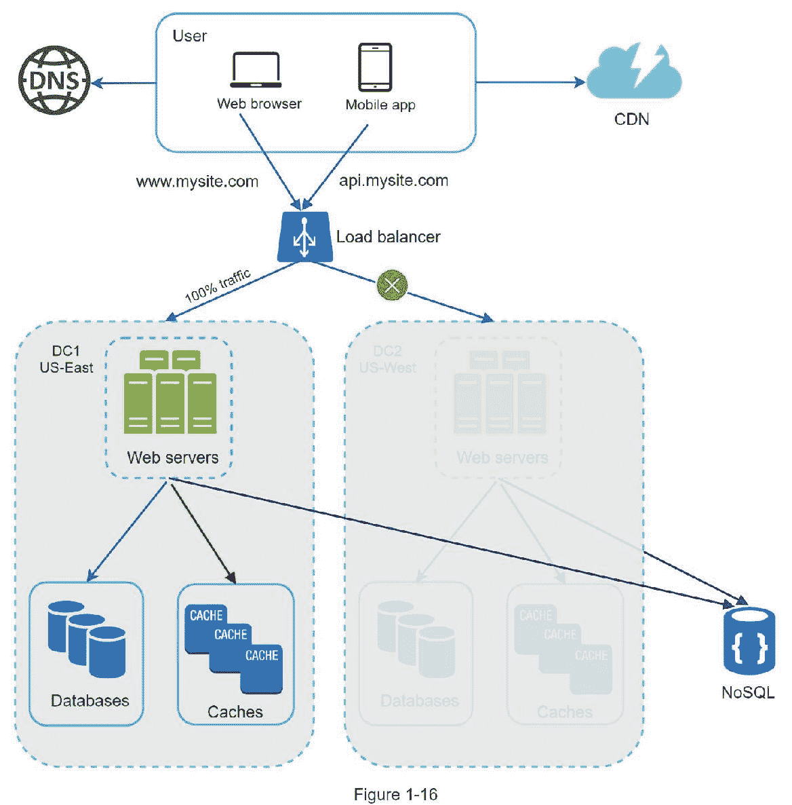

要实现多数据中心设置，必须解决几个技术难题:

流量重定向:需要有效的工具将流量定向到正确的数据中心。根据用户所在的位置，GeoDNS 可用于将流量导向最近的数据中心。

数据同步:不同地区的用户可以使用不同的本地数据库或缓存。在故障转移的情况下，流量可能会被路由到数据不可用的数据中心。一种常见的策略是跨多个数据中心复制数据。之前的一项研究展示了网飞如何实施异步多数据中心复制[11]。

测试和部署:对于多数据中心设置，在不同位置测试您的网站/应用程序非常重要。自动化部署工具对于保持所有数据中心的服务一致性至关重要[11]。

为了进一步扩展我们的系统，我们需要分离系统的不同组件，以便它们可以独立扩展。消息队列是许多现实世界的分布式系统用来解决这个问题的关键策略。

## 消息队列

消息队列是一个持久的组件，存储在内存中，支持异步通信。它充当缓冲区并分发异步请求。消息队列的基本架构很简单。称为生产者/发布者的输入服务创建消息，并将它们发布到消息队列。其他服务或服务器(称为消费者/订户)连接到队列，并执行消息定义的操作。该模型如图 1-17 所示。

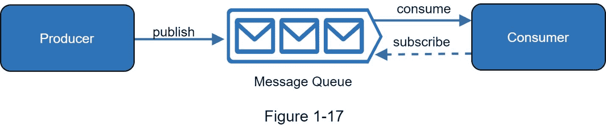

解耦使得消息队列成为构建可伸缩且可靠的应用程序的首选架构。使用消息队列，生产者可以在消费者无法处理消息时将消息发送到队列。即使生产者不可用，消费者也可以从队列中读取消息。

考虑以下用例:你的应用支持照片定制，包括裁剪、锐化、模糊等。这些定制任务需要时间来完成。在图 1-18 中，web 服务器将照片处理作业发布到消息队列中。照片处理人员从消息队列中选取作业，并异步执行照片定制任务。生产者和消费者可以独立伸缩。当队列变大时，会添加更多的工人来减少处理时间。但是，如果队列大部分时间都是空的，那么可以减少工人的数量。

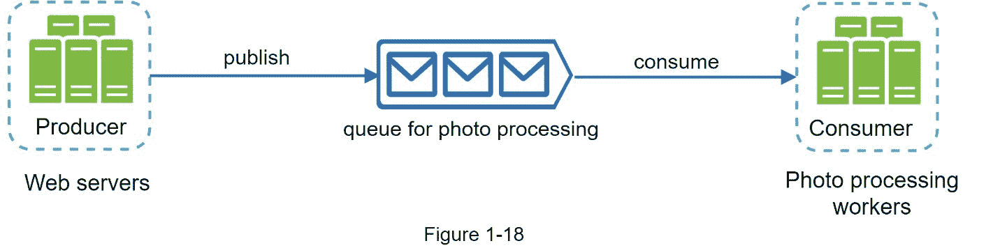

## 日志记录、指标、自动化

当处理一个运行在几台服务器上的小型网站时，日志、指标和自动化支持是很好的实践，但不是必须的。然而，现在你的网站已经成长为一个大企业服务，投资这些工具是必不可少的。

日志记录:监控错误日志很重要，因为它有助于识别系统中的错误和问题。您可以在每个服务器级别监控错误日志，或者使用工具将它们聚合到一个集中的服务中，以便于搜索和查看。

度量:收集不同类型的度量有助于我们获得业务洞察力并了解系统的健康状态。以下一些指标是有用的:

主机级指标:CPU、内存、磁盘 I/O 等。

聚合级指标:例如，整个数据库层、缓存层等的性能。

关键业务指标:日活跃用户、留存、收入等。

自动化:当一个系统变得庞大而复杂时，我们需要构建或利用自动化工具来提高生产率。持续集成是一个很好的实践，其中每个代码签入都通过自动化来验证，允许团队尽早发现问题。此外，自动化您的构建、测试、部署过程等。可以显著提高开发人员的工作效率。

添加消息队列和不同的工具

图 1-19 显示了更新后的设计。由于空间限制，图中仅显示了一个数据中心。

1。该设计包括一个消息队列，这有助于使系统更加松散耦合和具有故障恢复能力。

2。包括日志记录、监控、指标和自动化工具。

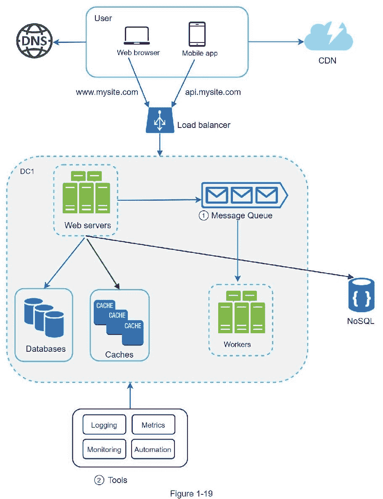

随着数据每天的增长，您的数据库变得更加超载。是时候扩展数据层了。

## 数据库缩放

数据库扩展有两种主要方法:垂直扩展和水平扩展。

### 垂直缩放

垂直扩展，也称为纵向扩展，是通过增加更多能力(CPU、RAM、磁盘等)来进行的扩展。)到现有的机器上。有一些强大的数据库服务器。根据亚马逊关系数据库服务(RDS) [12]，你可以得到一个 24 TB 内存的数据库服务器。这种功能强大的数据库服务器可以存储和处理大量数据。例如，stackoverflow.com 在 2013 年每月有超过 1000 万的独立访问者，但它只有一个主数据库[13]。然而，垂直缩放有一些严重的缺点:

可以添加更多的 CPU、RAM 等。到您的数据库服务器，但有硬件限制。如果您有大量用户，单个服务器是不够的。

更大的单点故障风险。

纵向扩展的整体成本很高。功能强大的服务器要贵得多。

### 水平缩放

水平扩展，也称为分片，是添加更多服务器的实践。图 1-20 比较了垂直缩放和水平缩放。

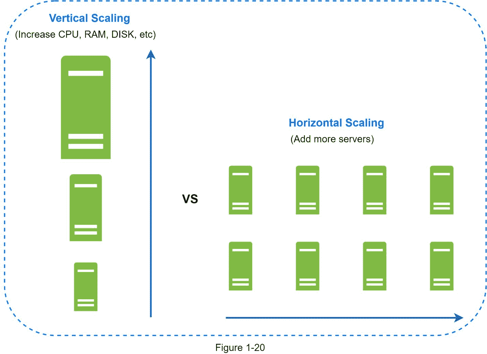

分片将大型数据库分成更小、更容易管理的部分，称为分片。每个分片共享相同的模式，尽管每个分片上的实际数据对于该分片是唯一的。

图 1-21 显示了一个分片数据库的例子。用户数据根据用户 id 分配给数据库服务器。每当您访问数据时，都会使用哈希函数来查找相应的碎片。在我们的例子中， user_id % 4 被用作哈希函数。如果结果等于 0，shard 0 用于存储和获取数据。如果结果等于 1，则使用碎片 1。同样的逻辑也适用于其他碎片。

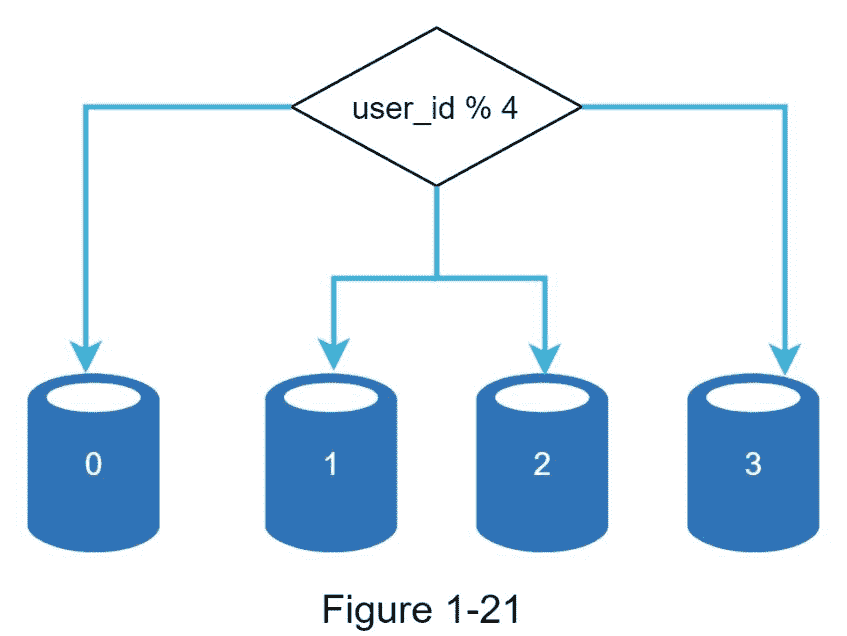

图 1-22 显示了分片数据库中的用户表。

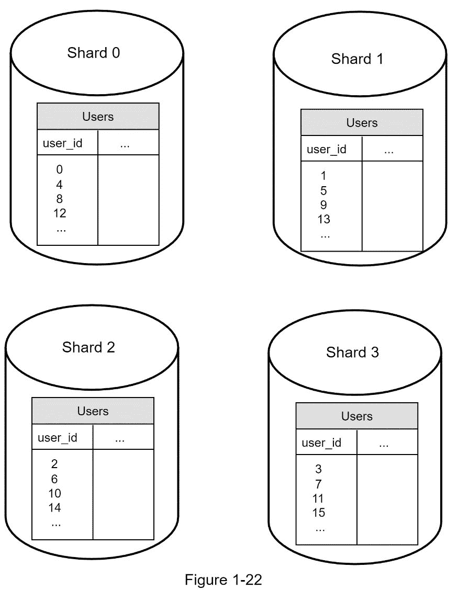

在实施分片策略时，要考虑的最重要的因素是分片密钥的选择。分片键(也称为分区键)由一列或多列组成，这些列决定了数据的分布方式。如图 1-22 所示， 【用户 id】是分片键。通过将数据库查询路由到正确的数据库，分片键允许您高效地检索和修改数据。在选择分片密钥时，最重要的标准之一是选择一个可以均匀分布数据的密钥。

分片是扩展数据库的一项伟大技术，但它远非完美的解决方案。它给系统带来了复杂性和新的挑战:

重新共享数据 :当 1)由于快速增长，单个碎片无法再容纳更多数据时，需要重新共享数据。2)由于数据分布不均匀，某些碎片可能比其他碎片更快耗尽。当分片耗尽时，需要更新分片函数并四处移动数据。将在第五章讨论的一致哈希法是解决这个问题的常用技术。

名人问题 :这也叫热点关键问题。对特定碎片的过度访问可能会导致服务器过载。想象一下凯蒂·佩里、贾斯汀比伯和 Lady Gaga 的数据都出现在同一个碎片上。对于社交应用来说，这个碎片将会被读操作淹没。为了解决这个问题，我们可能需要为每个名人分配一个碎片。每个碎片甚至可能需要进一步的划分。

连接和解规范化 :一旦一个数据库被分割到多个服务器上，就很难执行跨数据库分片的连接操作。一种常见的解决方法是对数据库进行反规范化，以便可以在单个表中执行查询。

在图 1-23 中，我们共享数据库来支持快速增长的数据流量。与此同时，一些非关系功能被转移到 NoSQL 数据库，以减少数据库负荷。这里有一篇文章涵盖了 NoSQL 的许多用例[14]。

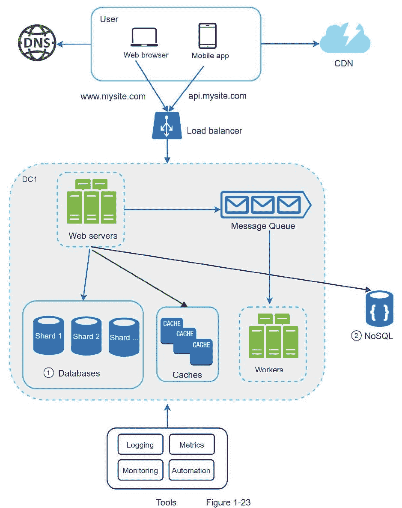

## 百万用户及以上

扩展系统是一个迭代的过程。重复我们在这一章学到的东西可以让我们走得更远。要超越数百万用户，需要更多的微调和新策略。例如，您可能需要优化您的系统并将系统解耦到更小的服务。本章学习的所有技术应该为应对新的挑战提供一个良好的基础。在本章的结尾，我们总结了如何扩展我们的系统来支持数百万用户:

保持 web 层无状态

在每一层建立冗余

尽可能多地缓存数据

支持多个数据中心

在 CDN 中托管静态资产

通过分片扩展您的数据层

将层级划分为单独的服务

监控您的系统并使用自动化工具

祝贺你走到这一步！现在给自己一个鼓励。干得好！

参考资料

【1】超文本传输协议:

[2]你应该超越关系数据库吗？:

[https://blog . teamtreehouse . com/should-you-go-beyond-relational-databases](https://blog.teamtreehouse.com/should-you-go-beyond-relational-databases)

【3】复制:[https://en . Wikipedia . org/wiki/Replication _(计算)](https://en.wikipedia.org/wiki/Replication_(computing))

[4]多主复制:

[https://en.wikipedia.org/wiki/Multi-master_replication](https://en.wikipedia.org/wiki/Multi-master_replication)

【5】NDB 集群复制:多主和循环复制:[https://dev . MySQL . com/doc/ref man/5.7/en/MySQL-Cluster-Replication-Multi-Master . html](https://dev.mysql.com/doc/refman/5.7/en/mysql-cluster-replication-multi-master.html)

【6】缓存策略及如何选择合适的策略:

[https://codeahoy . com/2017/08/11/caching-strategies-and-how-to-choose-the-right-one/](https://codeahoy.com/2017/08/11/caching-strategies-and-how-to-choose-the-right-one/)

[7] R. Nishtala，“脸书，扩展 Memcache at，”第十届 USENIX 网络系统设计与实现研讨会(NSDI 13)。

【8】单点故障:

【9】亚马逊 CloudFront 动态内容交付:

[https://aws.amazon.com/cloudfront/dynamic-content/](https://aws.amazon.com/cloudfront/dynamic-content/)

[10]为您的传统负载平衡器配置粘性会话:

[https://docs . AWS . Amazon . com/elastic load balancing/latest/classic/elb-sticky-sessions . html](https://docs.aws.amazon.com/elasticloadbalancing/latest/classic/elb-sticky-sessions.html)

[11]主动-主动多区域弹性:

[https://netflixtechblog . com/active-active-for-multi-regional-resiliency-c 47719 f 6685 b](https://netflixtechblog.com/active-active-for-multi-regional-resiliency-c47719f6685b)

【12】亚马逊 EC2 高内存实例:

[https://aws.amazon.com/ec2/instance-types/high-memory/](https://aws.amazon.com/ec2/instance-types/high-memory/)

[13]运行堆栈溢出需要什么:

[http://nick craver . com/blog/2013/11/22/what-it-take-to-run-stack-overflow](http://nickcraver.com/blog/2013/11/22/what-it-takes-to-run-stack-overflow)

[14]你到底在用 NoSQL 做什么:

[http://high scalability . com/blog/2010/12/6/what-the-heck-you-actually-using-no SQL-for . html](http://highscalability.com/blog/2010/12/6/what-the-heck-are-you-actually-using-nosql-for.html)