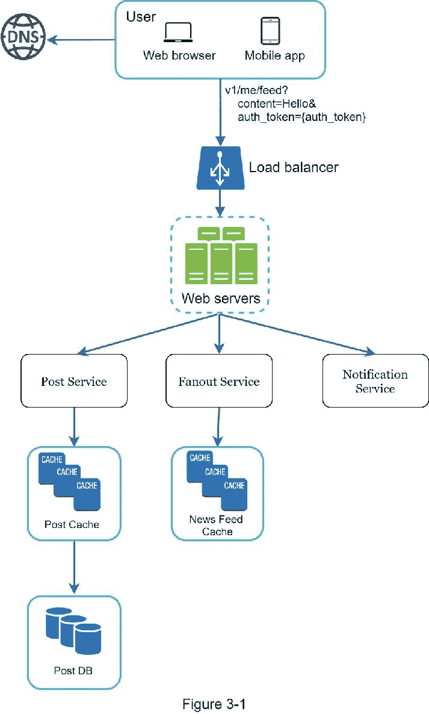
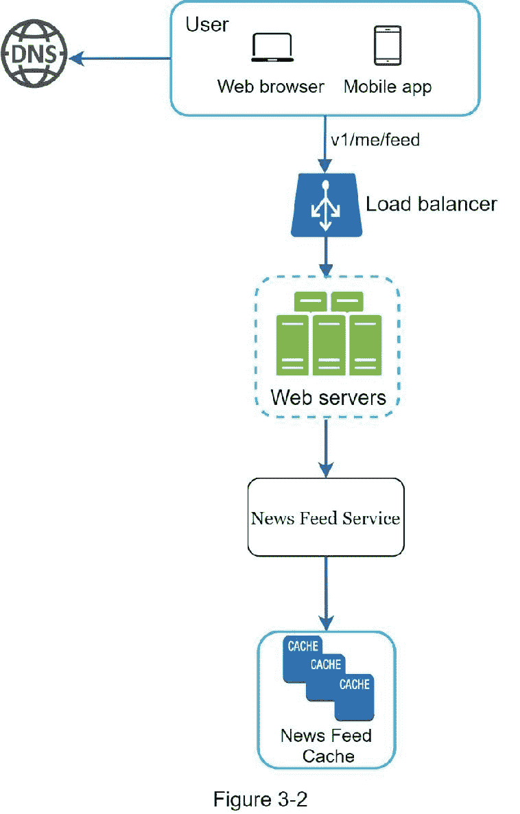
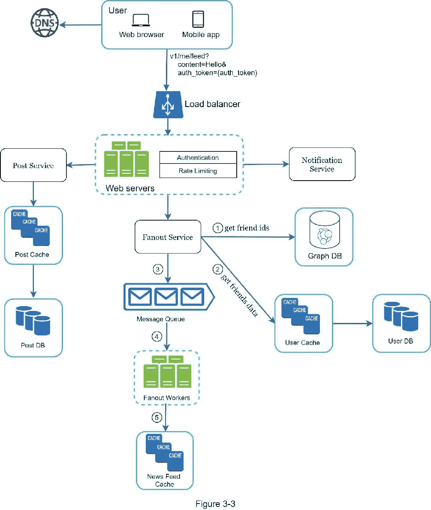
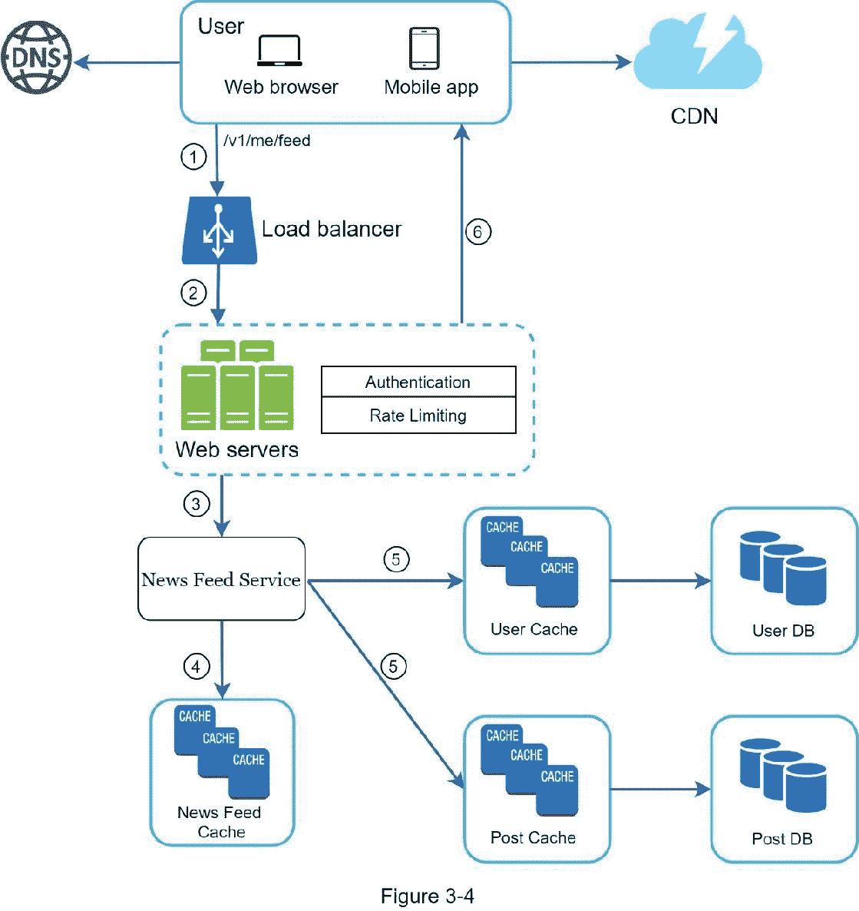

# 三、系统设计面试的框架

你刚刚获得了梦寐以求的理想公司的现场面试机会。招聘协调员会给你发一份当天的日程表。浏览列表，你会感觉很好，直到你的目光落在这个面试环节——系统设计面试。

系统设计面试通常令人生畏。它可以像“设计一个知名产品 X？”。这些问题模棱两可，而且似乎过于宽泛。你的疲倦是可以理解的。毕竟，怎么可能有人在一个小时内设计出一款流行的产品，而这需要数百甚至数千名工程师来完成？

好消息是没人期望你这么做。现实世界的系统设计极其复杂。例如，谷歌搜索看似简单；然而，支撑这种简单性的技术数量确实令人吃惊。如果没有人期望你在一个小时内设计出一个真实世界的系统，那么系统设计面试有什么好处呢？

系统设计面试模拟现实生活中的问题解决，两名员工合作解决一个模糊的问题，并提出一个符合他们目标的解决方案。这个问题是开放式的，没有完美的答案。与你在设计过程中所做的工作相比，最终的设计没有那么重要。这允许你展示你的设计技巧，捍卫你的设计选择，并以建设性的方式回应反馈。

让我们把桌子翻过来，想想面试官走进会议室见你时脑子里在想什么。面试官的首要目标是准确评估你的能力。她最不希望的就是给出一个不确定的评价，因为会议进行得很糟糕，没有足够的信号。在系统设计面试中，面试官想要的是什么？

许多人认为系统设计面试是关于一个人的技术设计技能。远不止如此。一次有效的系统设计面试会给出一个人的合作能力、在压力下工作的能力以及建设性地解决歧义的能力的强烈信号。问出好问题的能力也是一项必备技能，许多面试官专门寻找这项技能。

一个好的面试官也会寻找危险信号。过度工程是许多工程师的真正疾病，因为他们喜欢设计的纯粹性，而忽视权衡。他们常常意识不到过度设计系统的复合成本，许多公司为这种无知付出了高昂的代价。你肯定不希望在系统设计面试中表现出这种倾向。其他危险信号包括心胸狭窄、固执等。

在本章中，我们将复习一些有用的技巧，并介绍一个简单有效的框架来解决系统设计面试问题。

## 有效系统设计面试的 4 步流程

每个系统设计面试都不一样。伟大的系统设计面试是开放式的，没有放之四海而皆准的解决方案。然而，每个系统设计面试都有一些步骤和共同点。

### 第一步——了解问题并确定设计范围

“老虎为什么要吼叫？”

教室后面突然伸出一只手。

“是的，吉米？”，老师回应道。

“因为他饿了”。

“非常好的吉米。”

在童年时代，吉米总是第一个回答班上的问题。每当老师提问时，教室里总有一个孩子爱试着回答这个问题，不管他是否知道答案。那是吉米。

吉米是个优等生。他以很快知道所有答案而自豪。在考试中，他通常是第一个做完题目的人。他是教师参加任何学术竞赛的首选。

不要像吉米一样。

在系统设计面试中，不假思索地快速给出答案不会给你加分。没有完全理解要求的回答是一个巨大的危险信号，因为面试不是一个琐事竞赛。没有正确的答案。

因此，不要马上给出解决方案。慢点。深入思考，提出问题，明确需求和假设。这是极其重要的。

作为工程师，我们喜欢解决难题，一头扎进最终的设计中；然而，这种方法很可能会导致您设计错误的系统。作为一名工程师，最重要的技能之一是提出正确的问题，做出适当的假设，并收集构建系统所需的所有信息。所以，不要害怕提问。

当你提问时，面试官要么直接回答你的问题，要么让你做出假设。如果是后者，在白板或纸上写下你的假设。你以后可能需要它们。

问什么样的问题？提出问题，了解确切的要求。这里有一个帮助你开始的问题列表:

我们要构建什么样的特性？

产品有多少用户？

公司预计扩大规模的速度有多快？3 个月、6 个月和一年后的预期规模是多少？

公司的技术栈是什么？您可以利用哪些现有服务来简化设计？

#### 例子

如果你被要求设计一个新闻订阅系统，你会问一些有助于你阐明需求的问题。你和面试官之间的对话可能是这样的:

考生 :这是手机 app 吗？还是一个 web app？还是两者都有？

面试官 :都有。

候选人 :产品最重要的特点是什么？

面试官 :发帖和查看好友动态的能力。

候选人 : 新闻提要是按时间倒序排序还是按特定顺序排序？这种特殊的顺序意味着每个帖子被赋予不同的权重。例如，来自你亲密朋友的帖子比来自一个团体的帖子更重要。

面试官 : 为了简单起见，我们假设提要是按时间倒序排序的。

候选人 : 一个用户可以有多少好友？

面试官 : 5000

候选人 :车流量是多少？

面试官 :日活跃用户 1000 万(DAU)

候选:feed 可以包含图片、视频，或者只是文字？

面试官 :可以包含媒体文件，包括图片和视频。

以上是你可以问面试官的一些问题。理解需求和澄清歧义很重要

### 第二步——提出高水平的设计并获得认同

在这一步，我们的目标是开发一个高层次的设计，并与面试官就设计达成一致。在面试过程中与面试官合作是个好主意。

拿出最初的设计蓝图。寻求反馈。把你的面试官当成队友，一起努力。许多优秀的面试官喜欢交谈和参与。

在白板或纸上画出关键部件的方框图。这可能包括客户端(移动/web)、API、web 服务器、数据存储、缓存、CDN、消息队列等。

进行粗略计算，评估你的蓝图是否符合规模限制。大声思考。在深入调查之前，如果有必要的话，和面试官交流一下。

如果可能的话，浏览几个具体的用例。这将帮助您构建高层次的设计。用例也有可能帮助您发现您还没有考虑的边缘用例。

我们应该在这里包括 API 端点和数据库模式吗？这个要看问题。对于“设计谷歌搜索引擎”这样的大型设计问题来说，这有点太低级了。对于像为多人扑克游戏设计后端这样的问题，这是一个公平的游戏。与你的面试官交流。

#### 例子

让我们用“设计一个新闻反馈系统”来演示如何进行高级设计。在这里 你不需要了解系统实际上是如何工作的。所有细节将在第 11 章解释。

在高层次上，设计分为两个流程:提要发布和新闻提要构建。

Feed 发布:当用户发布帖子时，相应的数据被写入缓存/数据库，该帖子将被填充到好友的新闻 Feed 中。

新闻提要构建:新闻提要是通过按时间倒序聚合朋友的帖子来构建的。

图 3-1 和图 3-2 分别展示了提要发布和新闻提要构建流程的高级设计。

### 第三步——设计深潜

在这一步，你和你的面试官应该已经达到了以下目标:

商定总体目标和功能范围

勾画出总体设计的高层次蓝图

从你的面试官那里获得了关于高层设计的反馈

根据她的反馈，对深度探索中需要关注的领域有了一些初步想法

你应该和面试官一起确定架构中组件的优先级。值得强调的是，每次面试都是不同的。有时候，面试官可能会暗示她喜欢关注高层次的设计。有时，对于高级候选人面试，讨论可能是关于系统性能特征，可能集中在瓶颈和资源估计上。在大多数情况下，面试官可能希望你深入了解一些系统组件的细节。对于 URL shortener，深入研究将长 URL 转换成短 URL 的哈希函数设计是很有趣的。对于一个聊天系统来说，如何减少延迟和如何支持在线/离线状态是两个有趣的话题。

时间管理是必不可少的，因为人们很容易被无法展示你能力的微小细节冲昏头脑。你必须准备好向面试官展示的信号。尽量不要陷入不必要的细节。例如，在系统设计面试中详细讨论脸书 feed 排名的 EdgeRank 算法是不理想的，因为这会花费很多宝贵的时间，并且不能证明你设计可扩展系统的能力。

#### 例子

至此，我们已经讨论了新闻订阅系统的高级设计，面试官对你的提议很满意。接下来，我们将研究两个最重要的用例:

1。订阅源发布

2。新闻提要检索

图 3-3 和图 3-4 显示了两个用例的详细设计，这将在第 11 章中详细解释。

### 第四步——总结

在这最后一步，面试官可能会问你几个后续问题，或者给你讨论其他要点的自由。这里有几个方向可以遵循:

面试官可能希望你找出系统的瓶颈并讨论潜在的改进。永远不要说你的设计是完美的，没有什么可以改进的。总有需要改进的地方。这是一个展示你批判性思维并留下好的最终印象的好机会。

给面试官回顾一下你的设计可能会有帮助。如果你提出了一些解决方案，这一点尤为重要。在长时间的谈话后，刷新面试官的记忆会很有帮助。

错误案例(服务器故障、网络丢失等。)都是很有意思的话题。

运营问题值得一提。如何监控指标和错误日志？如何铺开系统？

如何处理下一个比例曲线也是一个有趣的话题。例如，如果您当前的设计支持 100 万用户，您需要做哪些更改来支持 1000 万用户？

如果你有更多的时间，提出你需要的其他改进。

作为总结，我们总结了一系列该做和不该做的事情。

Dos

总是要求澄清。不要假设你的假设是正确的。

理解问题的要求。

没有正确的答案，也没有最好的答案。旨在解决年轻初创公司问题的解决方案不同于拥有数百万用户的老牌公司。确保你理解这些要求。

让面试官知道你在想什么。和你的面试沟通。

如有可能，建议多种方法。

一旦你和面试官就蓝图达成一致，就要详细讨论每一部分。首先设计最关键的部件。

向面试官反映想法。一个好的面试官像队友一样和你一起工作。

永不放弃。

不要做

不要对典型的面试问题毫无准备。

在没有明确需求和假设的情况下，不要急于找到解决方案。

不要一开始就对单个组件进行过多的细节描述。首先给出概要设计，然后再向下钻取。

如果你卡住了，不要犹豫，寻求提示。

再次沟通。不要在沉默中思考。

不要以为一旦你给出了设计，你的面试就结束了。直到你的面试官说你结束了，你才算结束。尽早并经常寻求反馈。

### 每一步上的时间分配

系统设计面试问题通常非常宽泛，45 分钟或者一个小时都不足以涵盖整个设计。时间管理至关重要。每一步应该花多少时间？以下是在 45 分钟的面试中分配时间的粗略指南。请记住这是一个粗略的估计，实际的时间分布取决于问题的范围和面试官的要求。

第一步了解问题并确定设计范围:3 - 10 分钟

步骤 2 提出高级设计并获得认同:10 - 15 分钟

第三步设计深潜:10 - 25 分钟

第四步包装:3 - 5 分钟
