# 六、设计键值存储

键值存储，也称为键值数据库，是一种非关系数据库。每个唯一标识符都存储为一个键及其相关值。这种数据配对被称为“键-值”对。

在键-值对中，键必须是唯一的，与键相关联的值可以通过键来访问。键可以是纯文本或哈希值。出于性能原因，短键效果更好。钥匙长什么样？下面举几个例子:

纯文本密钥:“上次登录时间”

哈希键:253 dec 4

键值对中的值可以是字符串、列表、对象等。在键值存储中，值通常被视为不透明的对象，如 Amazon dynamo [1]、Memcached [2]、Redis [3]等。

下面是键值存储中的一个数据片段:

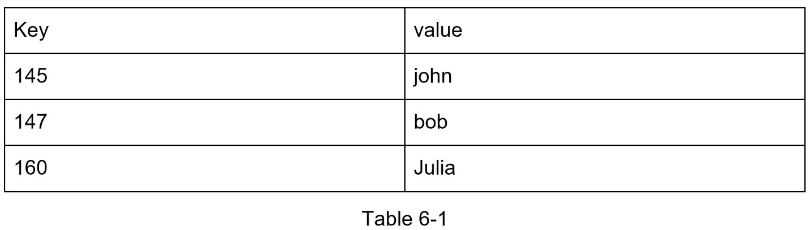

在本章中，要求你设计一个支持以下操作的键值存储:

- put(key，value) //插入与“key”关联的“value”

- get(key) //获取与【键】关联的【值】

## 了解问题并建立设计范围

没有完美的设计。每种设计都在读取、写入和内存使用之间取得了特定的平衡。另一个需要权衡的是一致性和可用性。在这一章中，我们设计了一个键值存储，它包括以下特征:

键-值对的大小很小:小于 10 KB。

存储大数据的能力。

高可用性:即使在故障期间，系统也能快速响应。

高可扩展性:系统可以扩展以支持大数据集。

自动伸缩:服务器的添加/删除应根据流量自动进行。

可调一致性。

低潜伏期。

## 单服务器键值存储

开发驻留在单个服务器上的键值存储很容易。一种直观的方法是将键值对存储在哈希表中，将所有内容保存在内存中。尽管内存访问速度很快，但由于空间限制，将所有内容都放入内存可能是不可能的。可以进行两种优化，以便在单个服务器中容纳更多数据:

T2】数据压缩

仅将常用数据存储在内存中，其余数据存储在磁盘上

即使进行了这些优化，单台服务器也能很快达到其容量。支持大数据需要分布式键值存储。

## 分布式键值存储

分布式键值存储也称为分布式哈希表，它将键值对分布在许多服务器上。在设计分布式系统时，理解 CAP ( C 一致性， A 可用性， P 分区容差)定理是很重要的。

### 上限定理

CAP 定理指出，分布式系统不可能同时提供三个保证中的两个以上:一致性、可用性和分区容差。让我们建立几个定义。

一致性 :一致性是指所有客户端同时看到相同的数据，无论它们连接到哪个节点。

可用性: 可用性意味着任何请求数据的客户端都可以得到响应，即使某些节点出现故障。

分区容错: 一个分区表示两个节点之间的通信中断。分区容差意味着尽管存在网络分区，系统仍能继续运行。

CAP 定理指出，必须牺牲三个属性中的一个来支持三个属性中的两个，如图 6-1 所示。

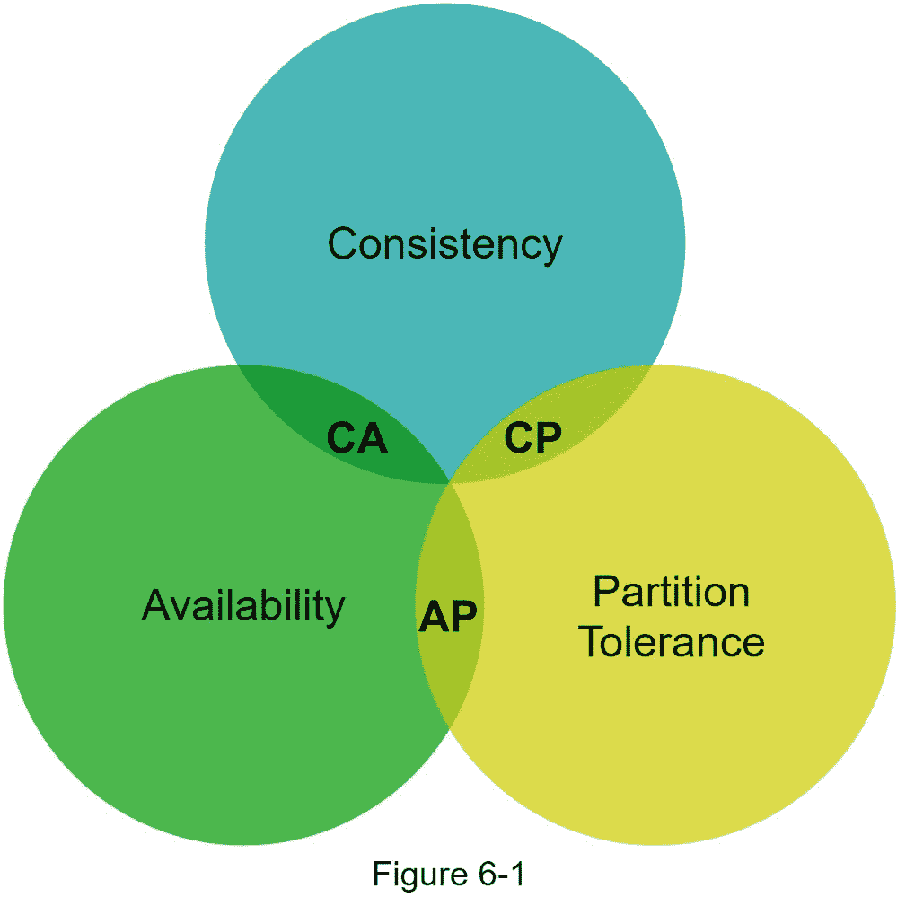

现在，键值存储是根据它们支持的两个 CAP 特征来分类的:

CP(一致性和分区容差)系统:CP 键值存储支持一致性和分区容差，但牺牲了可用性。

AP(可用性和分区容差)系统:AP 键值存储支持可用性和分区容差，但牺牲了一致性。

CA(一致性和可用性)系统:CA 键值存储支持一致性和可用性，同时牺牲分区容差。由于网络故障不可避免，分布式系统必须容忍网络分区。因此，CA 系统不能存在于现实世界的应用程序中。

你上面读到的大多是定义部分。为了更容易理解，让我们看一些具体的例子。在分布式系统中，数据通常被复制多次。假设数据复制在三个副本节点上， n1 ， n2 和 n3 如图 6-2 所示。

理想情况

在理想世界中，网络分区永远不会发生。写入 n1 的数据自动复制到 n2 和 n3 。实现了一致性和可用性。

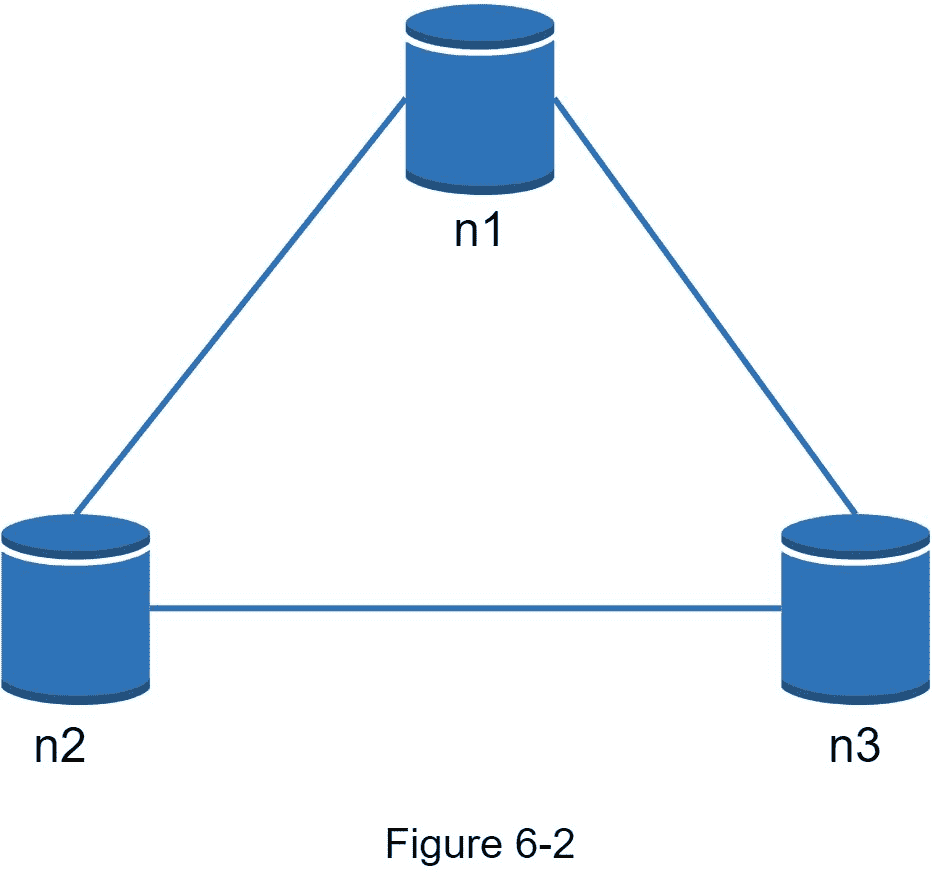

现实世界的分布式系统

在分布式系统中，分区是不可避免的，当出现分区时，我们必须在一致性和可用性之间做出选择。图 6-3 中， n3 下行，无法与 n1 和 n2 通信。如果客户端向 n1 或 n2 写入数据，数据无法传播到 n3。如果数据被写入到【n3】但是没有被传播到 n1 和 n2 ， n1 和 n2 就会有陈旧数据。

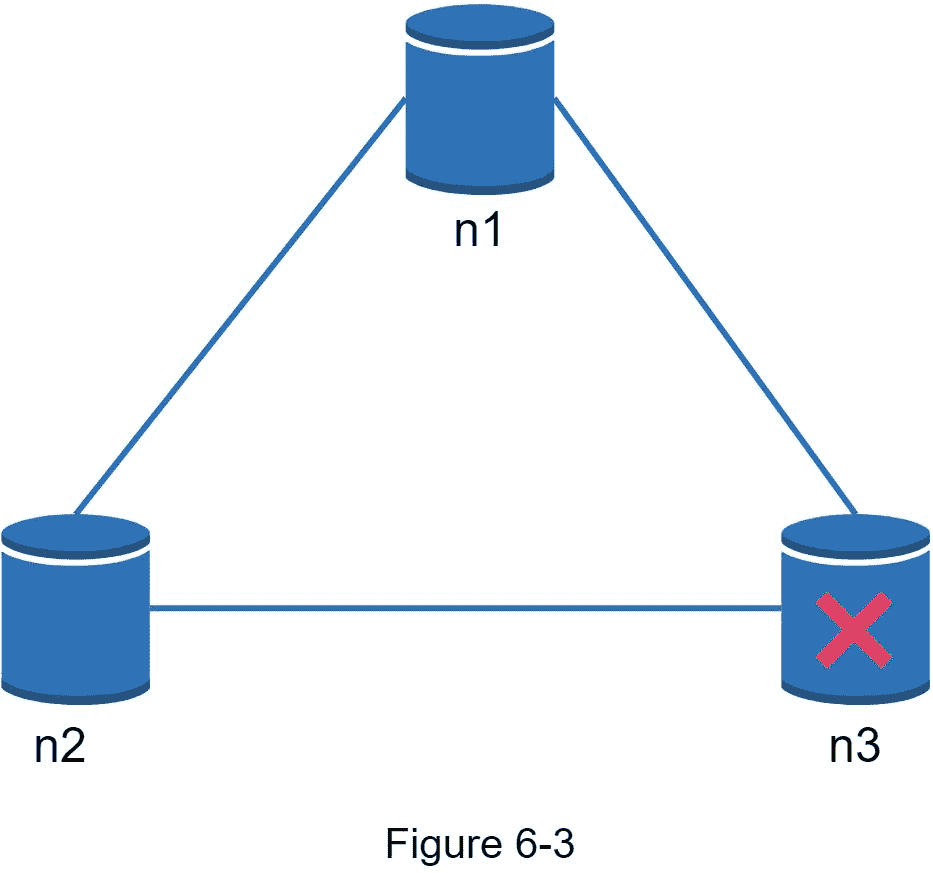

如果我们选择一致性而不是可用性(CP 系统)，我们必须阻止对 n1 和 n2 的所有写操作，以避免这三个服务器之间的数据不一致，从而导致系统不可用。银行系统通常有极高的一致性要求。例如，对于银行系统来说，显示最新的余额信息至关重要。如果由于网络分区而出现不一致，银行系统会在解决不一致之前返回一个错误。

然而，如果我们选择可用性而不是一致性(AP 系统)，系统会继续接受读取，即使它可能会返回过时的数据。对于写入， n1 和 n2 将继续接受写入，并且当网络分区被解析时，数据将被同步到 n3 。

选择适合您的用例的正确 CAP 担保是构建分布式键值存储的重要一步。你可以和你的面试官讨论这个问题，并据此设计系统。

### 系统组件

在本节中，我们将讨论以下用于构建键值存储的核心组件和技术:

数据分区

数据复制

一致性

不一致性解决

处理故障

系统架构图

写路径

读取路径

下面的内容主要基于三个流行的键值存储系统:Dynamo [4]、Cassandra [5]和 BigTable [6]。

### 数据分区

对于大型应用程序，将完整的数据集放在一台服务器上是不可行的。实现这一点的最简单方法是将数据分割成更小的分区，并将它们存储在多个服务器中。对数据进行分区时有两个挑战:

将数据均匀分布在多台服务器上。

添加或删除节点时，尽量减少数据移动。

第五章中讨论的一致哈希法是解决这些问题的一个很好的技术。让我们从高层次上重新审视一下一致性哈希是如何工作的。

首先，服务器被放置在一个哈希环上。在图 6-4 中，八个服务器，分别用 s0，s1，…，s7 表示，放置在哈希环上。

接下来，一个密钥被哈希到同一个环上，并存储在顺时针方向移动时遇到的第一个服务器上。例如， key0 使用此逻辑存储在 s1 中。

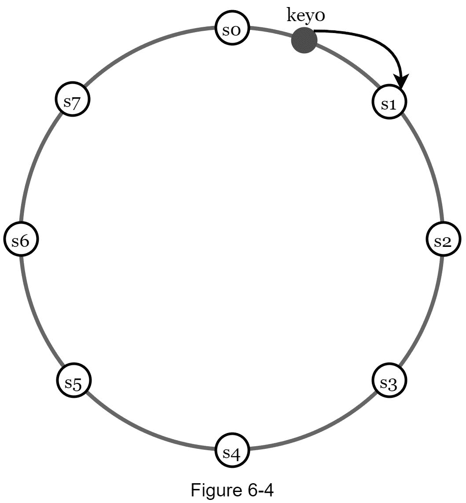

使用一致哈希对数据进行分区有以下优点:

自动扩展: 可以根据负载自动添加和删除服务器。

异构: 一台服务器的虚拟节点数量与服务器容量成正比。例如，为容量较高的服务器分配更多的虚拟节点。

### 数据复制

为了实现高可用性和可靠性，数据必须通过 N 服务器异步复制，其中 N 是一个可配置的参数。使用以下逻辑选择这些 N 服务器:在将一个键映射到哈希环上的一个位置之后，从该位置顺时针行走，选择环上的第一个 N 服务器来存储数据副本。在图 6-5 中( N = 3 )， key0 被复制在 s1、 和 s3 。

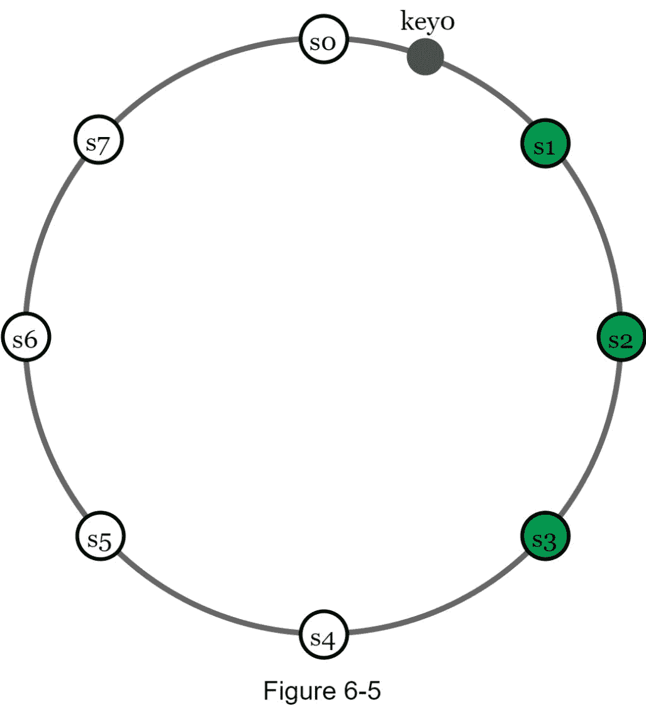

有了虚拟节点，环上的第一个 N 个 节点可能归少于 N 个 物理服务器所有。为了避免这个问题，我们在执行顺时针遍历逻辑时只选择唯一的服务器。

由于停电、网络问题、自然灾害等原因，同一数据中心的节点经常同时发生故障。为了更好的可靠性，副本被放置在不同的数据中心，并且数据中心通过高速网络连接。

### 一致性

由于数据在多个节点上复制，因此必须跨副本进行同步。仲裁共识可以保证读写操作的一致性。让我们先确立几个定义。

N = 副本数量

W =一写法定人数 W 。为了使写入操作被认为是成功的，必须从 W 副本确认写入操作。

R =一读法定人数大小 R 。为了使读取操作被认为是成功的，读取操作必须等待来自至少 R 个副本的响应。

考虑下面图 6-6 所示的例子，其中 N = 3 。

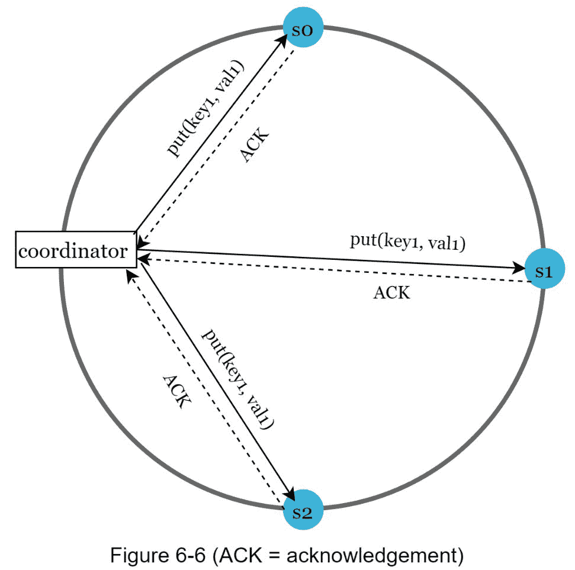

W = 1 并不意味着数据写在一台服务器上。例如，在图 6-6 的配置中，数据在 s0 、 s1、 和 s2 被复制。 W = 1 表示在写入操作被认为成功之前，协调器必须收到至少一个确认。例如，如果我们从 s1 得到确认，我们就不再需要等待来自 s0 和 s2 的确认。协调器充当客户端和节点之间的代理。

W，RN的配置是典型的延迟和一致性的权衡。如果 W = 1 或 R = 1 ，操作会快速返回，因为协调器只需等待来自任何副本的响应。如果 W 或 R > 1 ，系统提供更好的一致性；但是，查询会比较慢，因为协调器必须等待最慢的副本的响应。

If W + R > N 强一致性得到保证，因为必须至少有一个重叠节点具有最新数据以确保一致性。

如何配置 N，W ，以及 R 来适应我们的用例？以下是一些可能的设置:

如果 R = 1 且 W = N ，则系统为快速读取而优化。

如果 W = 1 且 R = N ，则系统针对快速写入进行优化。

如果 W + R > N ，则保证强一致性(通常 N = 3，W = R = 2 )。

如果 W + R < = N ，强一致性得不到保证。

根据需求，我们可以调整 W，R，N 的值，以达到所需的一致性水平。

#### 一致性模型

一致性模型是设计键值存储时要考虑的另一个重要因素。一致性模型定义了数据一致性的程度，并且存在多种可能的一致性模型:

强一致性:任何读操作都返回一个与最近更新的写数据项的结果对应的值。客户端永远不会看到过时的数据。

弱一致性:后续的读操作可能看不到最新的值。

最终一致性:这是弱一致性的一种具体形式。如果有足够的时间，所有更新都会传播，并且所有副本都是一致的。

强一致性通常通过强制副本不接受新的读/写操作来实现，直到每个副本都同意当前的写操作。这种方法对于高可用性系统并不理想，因为它可能会阻塞新的操作。Dynamo 和 Cassandra 采用最终一致性，这是我们为键值存储推荐的一致性模型。对于并发写入，最终一致性允许不一致的值进入系统，并迫使客户端读取这些值进行协调。下一节解释了协调如何与版本控制一起工作。

### 不一致解决方案:版本控制

复制提供了高可用性，但会导致副本之间的不一致。版本控制和向量时钟用于解决不一致性问题。版本化意味着将每个数据修改视为数据的一个新的不可变版本。在我们谈论版本控制之前，让我们用一个例子来解释不一致是如何发生的:

如图 6-7 所示，两个副本节点 n1 和 n2 具有相同的值。让我们称这个值为原来的 值。服务器 1 和 服务器 2 对【name】操作获取相同的值。

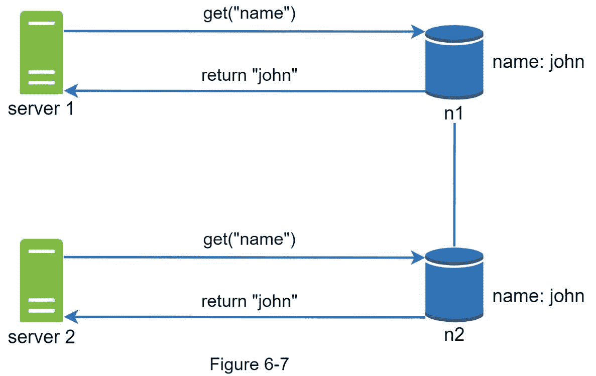

接下来， 服务器 1 将名称改为“johnSanFrancisco”， 服务器 2 将名称改为“johnNewYork”，如图 6-8 所示。这两种变化是同时进行的。现在，我们有相互冲突的值，叫做版本 v1 和 v2 。

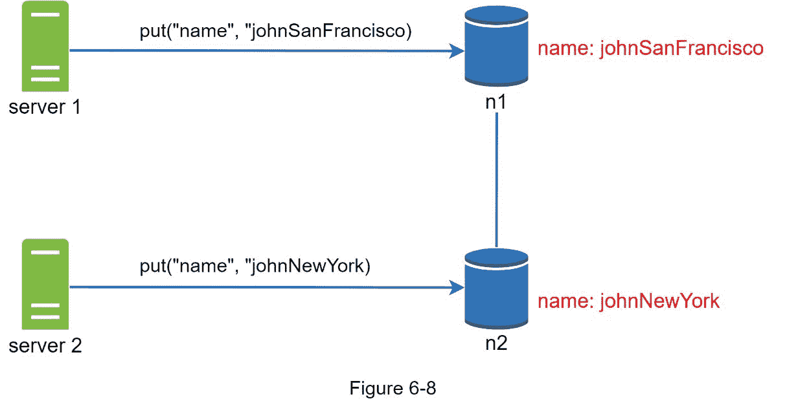

在这个例子中，原始值可以被忽略，因为修改是基于它的。但是，没有明确的方法来解决后两个版本的冲突。为了解决这个问题，我们需要一个能够检测冲突并协调冲突的版本控制系统。矢量时钟是解决这一问题的常用技术。让我们来看看矢量时钟是如何工作的。

向量时钟是与数据项相关联的 【服务器，版本】 对。它可用于检查一个版本是否领先、成功或与其他版本冲突。

假设一个矢量时钟用D(【S1，v1】，【S2，v2】，…，【Sn，VN】)表示，其中 D 为数据项， v1 为版本计数器， s1 为服务器号等。如果数据项 D 被写入服务器 Si ，系统必须执行以下任务之一。

增量 vi 如果【Si，VI】存在。

否则，新建一个条目【Si，1】。

以上抽象的逻辑用一个具体的例子来说明，如图 6-9 所示。

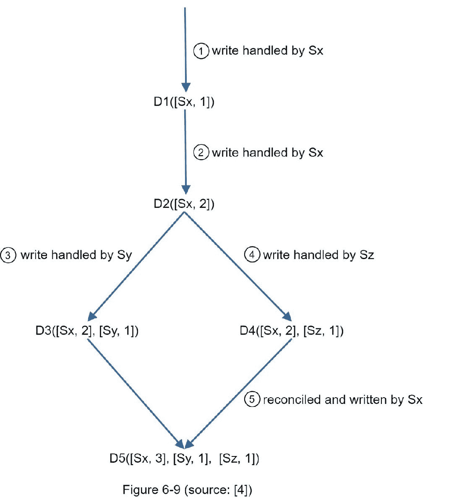

1。一个客户端向系统写一个数据项，这个写由服务器 Sx 处理，它现在有了向量时钟【D1[(Sx，1)】。

2。另一个客户端读取最新的 D1 ，更新为 D2 ，并写回。 D2 是 D1 的后代，所以它覆盖了 D1 。假设写操作由同一个服务器【Sx】处理，该服务器现在有向量时钟【D2(【Sx，2】)。

3。另一个客户端读取最新的，更新为 D3 ，并写回。假设写操作由服务器【Sy】处理，它现在有向量时钟 D3([Sx，2]，[Sy，1])。

4。另一个客户端读取最新的 D2 ，更新为 D4 ，并写回。假设写操作由服务器处理，它现在有【D4】([Sx，2]，[Sz，1])。

5。当另一个客户端读取 D3 和 D4 时，发现一个冲突，这个冲突是由于数据项【D2】被和 Sz 同时修改引起的。客户端解决冲突，并将更新的数据发送到服务器。假设写的是由【Sx】处理的，这里面现在有【D5】(【Sx，3】，【Sy，1】，【Sz，1】)。我们将很快解释如何检测冲突。

使用矢量时钟，很容易判断出一个 版本 X 是一个【Y版本的祖先(即没有冲突)，如果 版本的计数器对于的矢量时钟中的每个参与者都大于或等于版本 X 中的计数器。比如向量时钟 D([s0，1]，[s1，1])】就是 D([s0，1]，[s1，2]) 的一个祖先。因此，不会记录冲突。

同样，如果【Y的向量时钟中有任何参与者的计数器小于其在【X中对应的计数器，则可以看出版本 X 是 Y 的兄弟(即存在冲突)。比如下面两个向量时钟表示有冲突: D([s0，1]，[s1，2]) 和 D([s0，2]，[s1，1])。

尽管矢量时钟可以解决冲突，但也有两个明显的缺点。首先，向量时钟增加了客户端的复杂性，因为它需要实现冲突解决逻辑。

第二， 【服务器:版本】 成对出现在向量时钟中的可能迅速增长。为了解决这个问题，我们为长度设置了一个阈值，如果它超过了限制，最早的对将被删除。这可能导致协调效率低下，因为后代关系无法准确确定。但是基于迪纳摩纸业[4]，亚马逊在生产中还没有遇到这个问题；所以，对于大多数公司来说，大概是可以接受的解决方案。

### 处理故障

正如任何大规模的大型系统一样，故障不仅不可避免，而且很常见。处理故障场景非常重要。在本节中，我们首先介绍检测故障的技术。然后，我们回顾常见的故障解决策略。

#### 故障检测

在一个分布式系统中，仅仅因为一个服务器说另一个服务器关闭了，就认为这个服务器关闭了是不够的。通常，至少需要两个独立的信息源来标记服务器停机。

如图 6-10 所示，所有对所有的多播是一个简单的解决方案。然而，当系统中有许多服务器时，这是低效的。

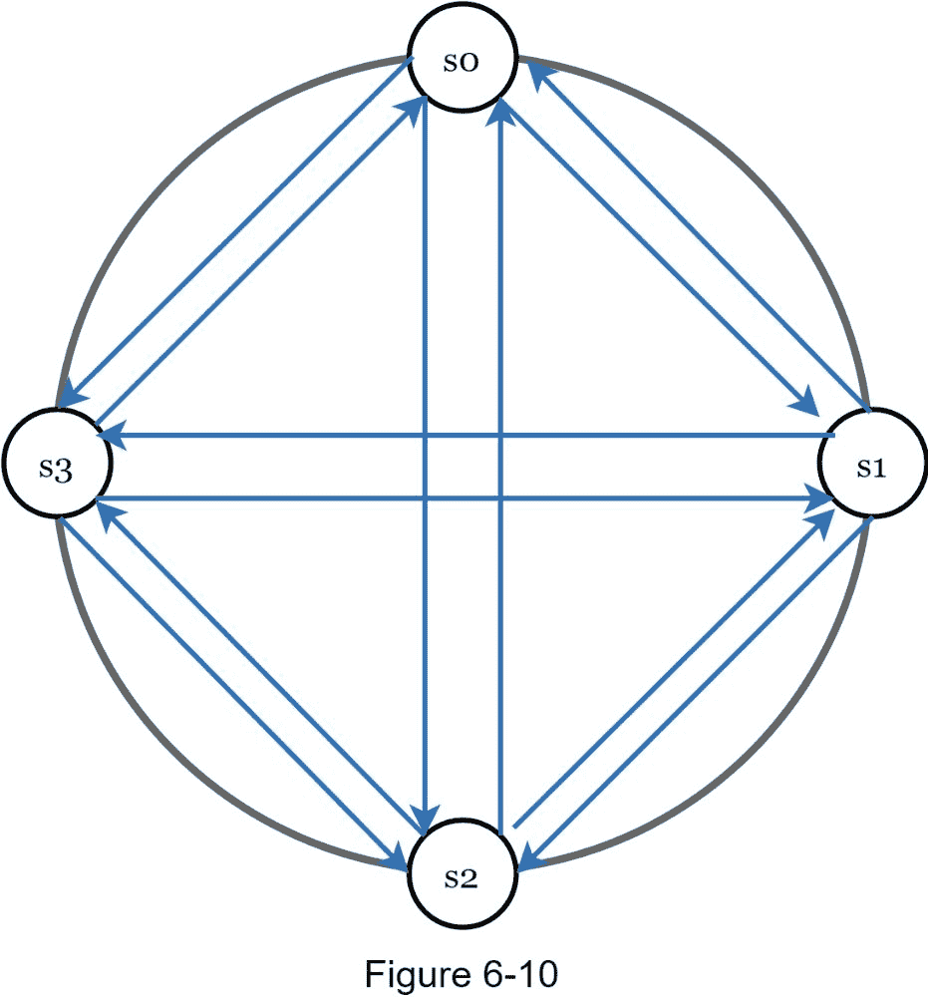

更好的解决方案是使用分散式故障检测方法，如 gossip 协议。八卦协议的工作原理如下:

每个节点维护一个节点成员列表，其中包含成员 id 和心跳计数器。

每个节点周期性地递增其心跳计数器。

每个节点周期性地向一组随机节点发送心跳，心跳又传播到另一组节点。

一旦节点接收到心跳，成员列表将更新为最新信息。

如果心跳没有增加超过预定义的时间段，则该成员被视为离线。

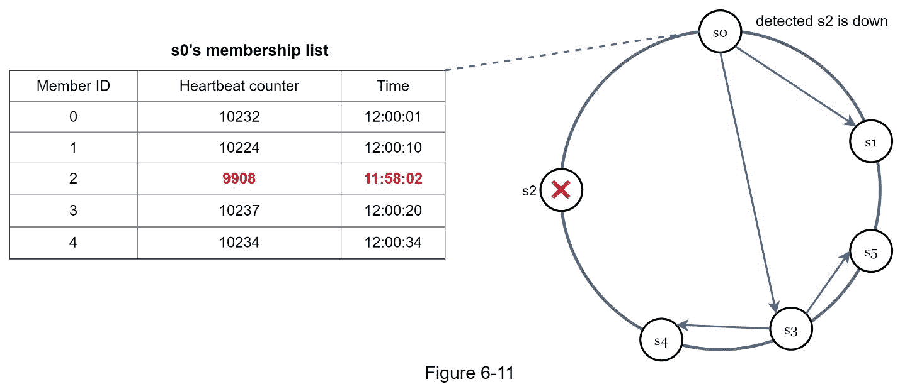

如图 6-11 所示:

节点 s0 维护左侧显示的节点成员列表。

节点 s0 注意到节点 s2(成员 ID = 2)的心跳计数器长时间没有增加。

节点 s0 向一组随机节点发送包含 s2 信息的心跳。一旦其他节点确认【S2】的心跳计数器长时间没有更新，节点 s2 被标记为 down，这个信息被传播到其他节点。

#### 处理临时故障

通过 gossip 协议检测到故障后，系统需要部署某些机制来确保可用性。在严格仲裁方法中，读写操作可能会被阻止，如仲裁共识部分所示。

一种被称为“草率法定人数”的技术[4]被用来提高可用性。系统选择第一个 W 健康服务器进行写操作，第一个 R 健康服务器进行哈希环上的读操作，而不是强制执行定额要求。脱机服务器被忽略。

如果一个服务器由于网络或服务器故障而不可用，另一个服务器将临时处理请求。当关闭的服务器启动时，更改将被推回以实现数据一致性。这个过程被称为提示切换。由于 s2 在图 6-12 中不可用，读写将暂时由 s3 处理。当 s2 重新上线时， s3 会将数据交还给 s2 。

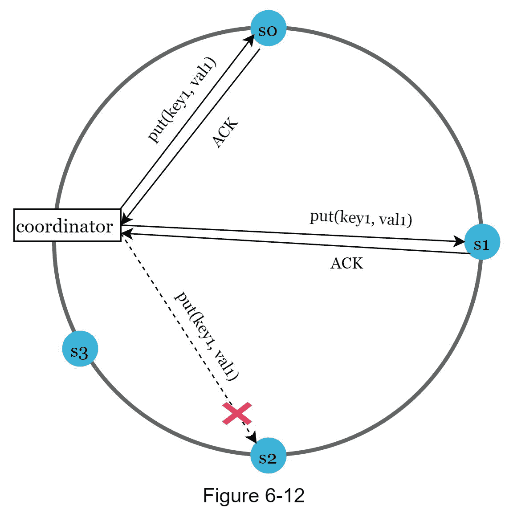

#### 处理永久性故障

提示切换用于处理临时故障。如果副本永久不可用怎么办？为了处理这种情况，我们实现了一个反熵协议来保持副本同步。反熵包括比较副本上的每一条数据，并将每个副本更新到最新版本。Merkle 树用于不一致性检测和最小化传输的数据量。

引自维基百科[7]:“hash 树或 Merkle 树是 中的树，其中每个非叶节点都用其子节点的标签或值(在叶的情况下)的哈希来标记。哈希树允许高效和安全地验证大型数据结构的内容”。

假设密钥空间从 1 到 12，下面的步骤展示了如何构建 Merkle 树。突出显示的方框表示不一致。

步骤 1:将键空间划分成桶(在我们的例子中是 4 个),如图 6-13 所示。一个存储桶被用作根级节点，以保持树的有限深度。

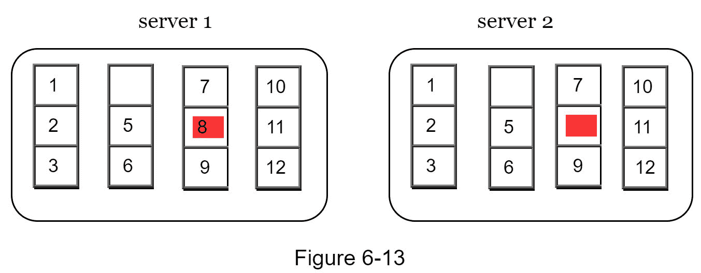

步骤 2:一旦创建了存储桶，使用统一的哈希方法对存储桶中的每个关键字进行哈希(图 6-14)。

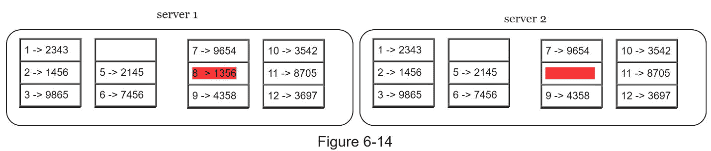

第三步:为每个桶创建一个哈希节点(图 6-15)。

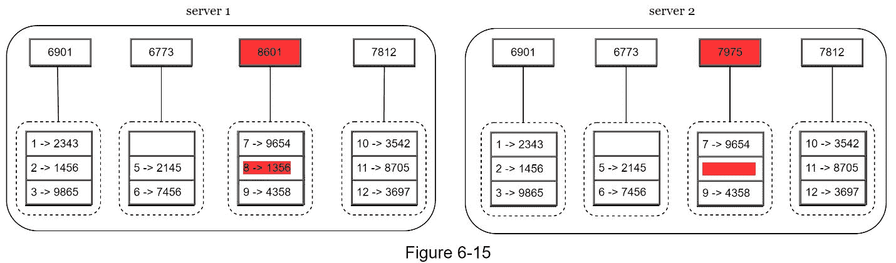

第四步:通过计算子节点的哈希值，向上构建树直到根节点(图 6-16)。

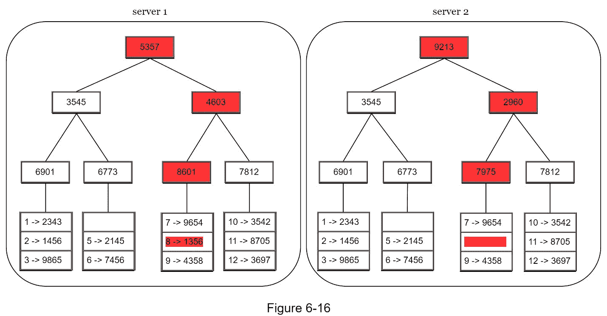

要比较两个 Merkle 树，先从比较根哈希开始。如果根哈希匹配，两台服务器具有相同的数据。如果根哈希不一致，则先比较左边的子哈希，然后比较右边的子哈希。您可以遍历树来查找哪些存储桶没有同步，并只同步那些存储桶。

使用 Merkle 树，需要同步的数据量与两个副本 、 之间的差异成正比，而与它们包含的数据量无关。在现实世界的系统中，桶的大小相当大。例如，一种可能的配置是每十亿个键有一百万个存储桶，所以每个存储桶只包含 1000 个键。

#### 处理数据中心故障

停电、网络中断、自然灾害等都可能导致数据中心中断。要构建能够处理数据中心停机的系统，跨多个数据中心复制数据非常重要。即使一个数据中心完全离线，用户仍然可以通过其他数据中心访问数据。

### 系统架构图

既然我们已经讨论了设计键值存储时不同的技术考虑，我们可以把注意力转移到架构图上，如图 6-17 所示。

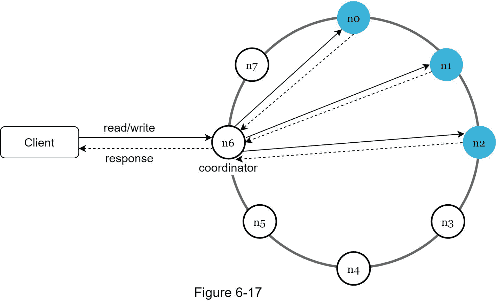

该架构的主要特点如下:

客户端通过简单的 API 与键值存储进行通信: get(key) 和 put(key，value) 。

协调器是充当客户端和键值存储之间的代理的节点。

使用一致哈希法将节点分布在环上。

系统是完全分散的，因此添加和移动节点可以是自动的。

数据在多个节点复制。

没有单点故障，因为每个节点都有相同的职责。

由于设计是分散的，每个节点执行许多任务，如图 6-18 所示。

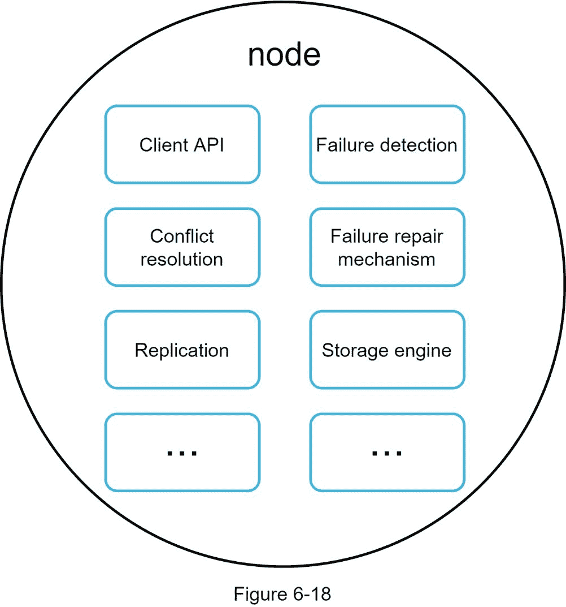

### 写路径

图 6-19 解释了写请求指向特定节点后会发生什么。请注意，建议的写/读路径设计主要基于 Cassandra [8]的架构。

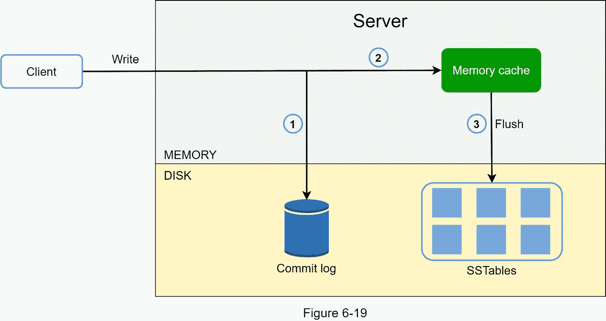

1。写请求保存在提交日志文件中。

2。数据保存在内存缓存中。

3。当内存缓存已满或达到预定义的阈值时，数据将被刷新到磁盘上的 SSTable [9]中。注意:排序字符串表(SSTable)是一个由<键、值>对组成的排序列表。对于有兴趣了解 SStable 更多信息的读者，请参考参考资料[9]。

### 阅读路径

将读取请求定向到特定节点后，它首先检查数据是否在内存缓存中。如果是，数据将返回给客户端，如图 6-20 所示。

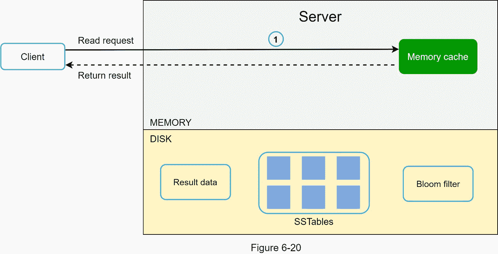

如果数据不在内存中，将从磁盘中检索。我们需要一种有效的方法来找出哪个表包含密钥。布鲁姆过滤器[10]通常用于解决这个问题。

当数据不在内存中时，读取路径如图 6-21 所示。

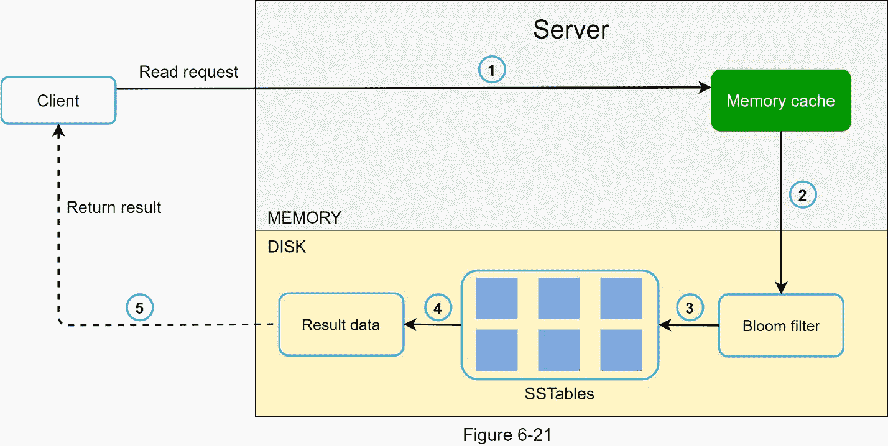

1。系统首先检查数据是否在内存中。如果没有，请转到步骤 2。

2。如果数据不在内存中，系统会检查布隆过滤器。

3。布隆过滤器用于确定哪些表可能包含该密钥。

4。SSTables 返回数据集的结果。

5。数据集的结果被返回给客户端。

## 总结

本章涵盖了许多概念和技术。为了提醒您，下表总结了分布式键值存储所使用的功能和相应的技术。

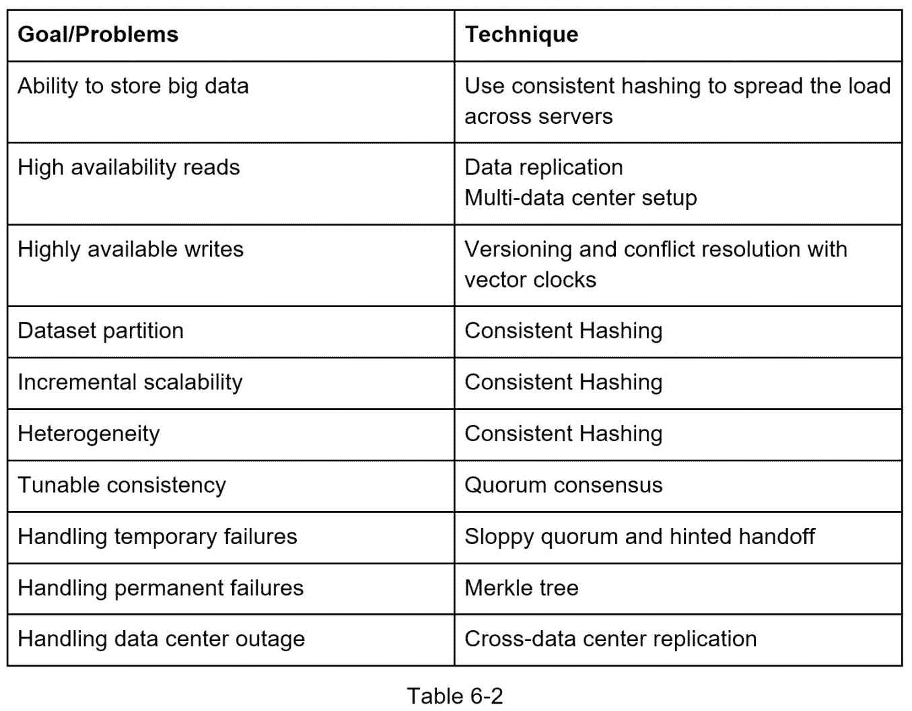

参考资料

【1】亚马逊 DynamoDB:[【https://aws.amazon.com/dynamodb/】](https://aws.amazon.com/dynamodb/)

【2】memcached:[【https://memcached.org/】](https://memcached.org/)

【3】雷迪斯:[【https://redis.io/】](https://redis.io/)

【4】迪纳摩:亚马逊高可用键值商店:[https://www . all things distributed . com/files/Amazon-Dynamo-sosp 2007 . pdf](https://www.allthingsdistributed.com/files/amazon-dynamo-sosp2007.pdf)

【5】卡珊德拉:[【https://cassandra.apache.org/】](https://cassandra.apache.org/)

【6】Bigtable:结构化数据的分布式存储系统:[https://static . Google user content . com/media/research . Google . com/en//archive/Bigtable-osdi 06 . pdf](https://static.googleusercontent.com/media/research.google.com/en//archive/bigtable-osdi06.pdf)

【7】默克尔树:[【https://en.wikipedia.org/wiki/Merkle_tree】](https://en.wikipedia.org/wiki/Merkle_tree)

【8】卡珊德拉建筑:【https://cassandra.apache.org/doc/latest/architecture/】

【9】SStable:[https://www . igvita . com/2012/02/06/SStable-and-log-structured-storage-level db/](https://www.igvita.com/2012/02/06/sstable-and-log-structured-storage-leveldb/)

【10】布鲁姆滤镜[【https://en.wikipedia.org/wiki/Bloom_filter】](https://en.wikipedia.org/wiki/Bloom_filter)