# 十四、设计 YouTube

在这一章中，你被要求设计 YouTube。这个问题的解决方案可以应用于其他面试问题，比如设计一个视频分享平台，如网飞和 Hulu。图 14-1 显示了 YouTube 主页。

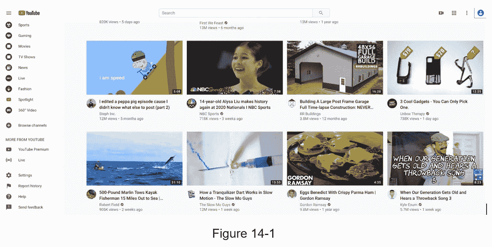

YouTube 看起来很简单:内容创作者上传视频，观众点击播放。真的这么简单吗？不完全是。简单的背后有很多复杂的技术。让我们看看 2020 年 YouTube 的一些令人印象深刻的统计数据、人口统计数据和有趣的事实[1] [2]。

月活跃用户总数:20 亿。

每天观看的视频数量:50 亿。

73%的美国成年人使用 YouTube。

YouTube 上 5000 万创作者。

2019 年全年，YouTube 的广告收入为 151 亿美元，比 2018 年增长 36%。

YouTube 负责所有移动互联网流量的 37%。

YouTube 有 80 种不同的语言版本。

从这些统计数据中，我们知道 YouTube 是巨大的，全球化的，赚了很多钱。

## 步骤 1 -了解问题并确定设计范围

如图 14-1 所示，除了看视频，你还可以在 YouTube 上做很多事情。例如，评论、分享或喜欢视频、将视频保存到播放列表、订阅频道等。在 45 分钟或 60 分钟的采访中不可能设计出所有的东西。因此，提问以缩小范围是很重要的。

候选 : 什么特征重要？

面试官 : 上传视频和观看视频的能力。

候选人 : 我们需要支持哪些客户？

面试官 : 手机应用、网页浏览器、智能电视。

候选人 : 我们有多少日活跃用户？

面试官:500 万

候选 : 平均每天花在产品上的时间是多少？

面试官 : 30 分钟。

候选 : 我们需要支持国际用户吗？

面试官 : 是的，很大比例的用户是国际用户。

候选 : 支持的视频分辨率有哪些？

面试官 : 系统接受大部分的视频分辨率和格式。

候选 : 需要加密吗？

面试官 :是

候选 : 对视频文件大小有什么要求吗？

面试官 : 我们平台专注于中小视频。允许的最大视频大小为 1GB。

候选人 : 我们能否利用亚马逊、谷歌或微软提供的一些现有云基础设施？

面试官 : 这个问题问得好。对于大多数公司来说，从头开始构建一切是不现实的，建议利用一些现有的云服务。

在本章中，我们重点设计一个具有以下特点的视频流服务:

能够快速上传视频

流畅视频流

能够改变视频质量

基础设施成本低

高可用性、可扩展性和可靠性要求

支持的客户端:移动应用、网络浏览器和智能电视

### 信封估算的背面

下面的估计是基于许多假设，所以与面试官沟通以确保她同意是很重要的。

假设产品有 500 万日活跃用户(DAU)。

用户每天观看 5 个视频。

10%的用户每天上传 1 个视频。

假设平均视频大小为 300 MB。

每日所需总存储空间:500 万* 10% * 300 MB = 150TB

CDN 费用。

当云 CDN 提供视频时，你要为从 CDN 传输出去的数据付费。

让我们用亚马逊的 CDN CloudFront 进行成本估算(图 14-2) [3]。假设 100%的流量来自美国。每 GB 的平均成本为 0.02 美元。为简单起见，我们只计算视频流的成本。

每天 500 万* 5 个视频* 0.3 GB * 0.02 美元= 15 万美元。

从粗略的成本估算中，我们知道从 CDN 提供视频服务要花费很多钱。尽管云提供商愿意为大客户大幅降低 CDN 成本，但成本仍然很高。我们将深入探讨降低 CDN 成本的方法。

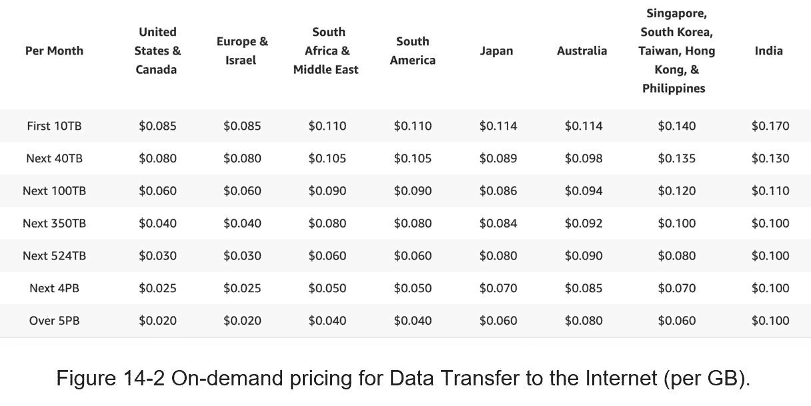

## 第二步-提出高层次设计并获得认同

如前所述，采访者建议利用现有的云服务，而不是从头开始构建一切。CDN 和 blob 存储是我们将利用的云服务。有些读者可能会问，为什么不自己动手建造一切呢？原因如下:

系统设计面试不是从零开始构建一切。在有限的时间内，选择正确的技术来正确地完成工作比详细解释技术如何工作更重要。例如，提到用于存储源视频的 blob 存储就足够了。谈论 blob 存储的详细设计可能有些矫枉过正。

构建可扩展的 blob 存储或 CDN 极其复杂且成本高昂。即使像网飞或脸书这样的大公司也不会自己建造所有的东西。网飞利用亚马逊的云服务[4]，脸书使用 Akamai 的 CDN [5]。

从高层次来看，该系统由三个部分组成(图 14-3)。

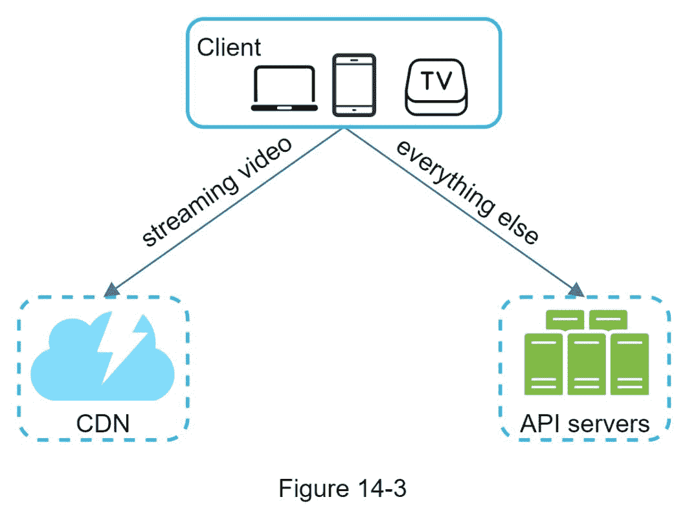

客户端 :可以在电脑、手机、智能电视上看 YouTube。

CDN :视频存储在 CDN 中。当您按下播放按钮时，视频将从 CDN 中流出。

API 服务器 :除了视频流，其他都通过 API 服务器。这包括提要推荐、生成视频上传 URL、更新元数据数据库和缓存、用户注册等。

在问答环节，面试官表现出对两个流程的兴趣:

视频上传流程

视频流

我们将探讨其中每一个的高层设计。

### 视频上传流程

图 14-4 显示了视频上传的概要设计。

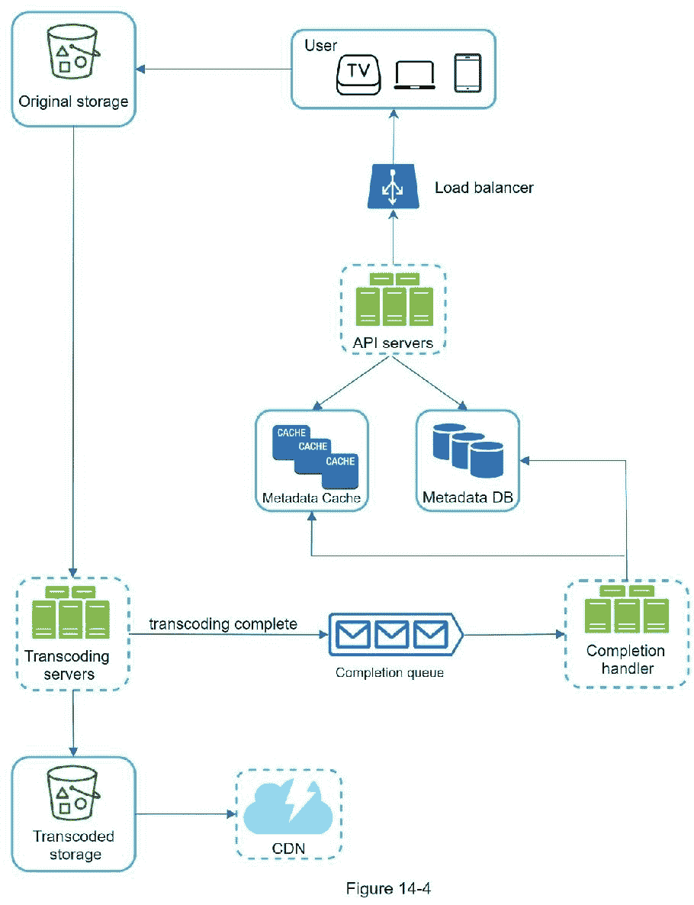

它由以下部件组成:

用户:用户在电脑、手机、智能电视等设备上观看 YouTube。

负载平衡器:负载平衡器在 API 服务器之间平均分配请求。

API 服务器:除了视频流，所有用户请求都要经过 API 服务器。

元数据 DB:视频元数据存储在元数据 DB 中。它经过分片和复制，以满足性能和高可用性要求。

元数据缓存:为了更好的性能，缓存视频元数据和用户对象。

原始存储:blob 存储系统用于存储原始视频。维基百科中关于 blob 存储的一段引文显示:“二进制大型对象(BLOB)是在数据库管理系统中作为单个实体存储的二进制数据的集合”[6]。

转码服务器:视频转码也叫视频编码。它是将一种视频格式转换为其他格式(MPEG、HLS 等)的过程，可以为不同的设备和带宽能力提供最佳的视频流。

转码存储:是一个 blob 存储，存储转码后的视频文件。

CDN:视频缓存在 CDN 中。当您单击播放按钮时，视频将从 CDN 流出。

完成队列:存储视频转码完成事件信息的消息队列。

完成处理程序:它由从完成队列中提取事件数据并更新元数据缓存和数据库的工作者列表组成。

现在我们已经分别了解了每个组件，让我们来看看视频上传流程是如何工作的。该流程分为两个并行运行的流程。

a .上传实际视频。

b .更新视频元数据。元数据包含视频 URL、大小、分辨率、格式、用户信息等信息。

#### 流程 a:上传实际视频

图 14-5 显示了如何上传实际视频。解释如下:

1。视频被上传到原始存储器。

2。转码服务器从原始存储中获取视频并开始转码。

3。一旦代码转换完成，并行执行以下两个步骤:

3a。转码后的视频被发送到转码后的存储器。

3b。代码转换完成事件在完成队列中排队。

3a.1 .转码后的视频分发到 CDN。

3b.1 .完成处理程序包含一群从队列中持续提取事件数据的工人。

3b.1.a .和 3b.1.b .完成处理器在视频转码完成时更新元数据数据库和缓存。

4。API 服务器通知客户端视频已成功上传，可以进行流式传输。

#### 流程 b:更新元数据

当一个文件被上传到原始存储器时，客户端并行发送一个更新视频元数据的请求，如图 14-6 所示。该请求包含视频元数据，包括文件名、大小、格式等。API 服务器更新元数据缓存和数据库。

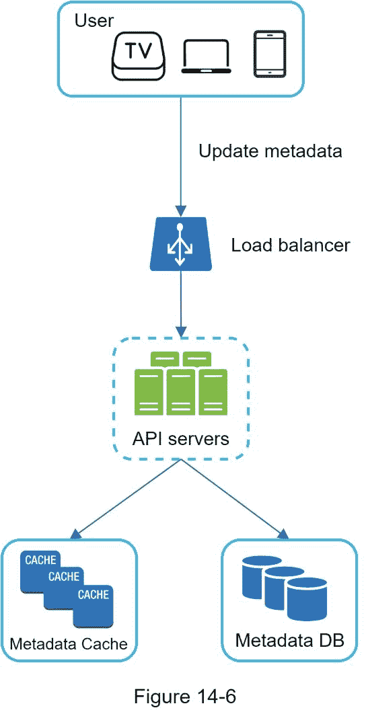

### 视频流流量

每当你在 YouTube 上观看视频时，它通常会立即开始播放，而不是等到整个视频下载完毕。下载意味着整个视频被复制到您的设备，而流意味着您的设备不断地从远程源视频接收视频流。当您观看流媒体视频时，您的客户端会一次加载一点数据，以便您可以立即连续观看视频。

在讨论视频流之前，我们先来看一个重要的概念:流协议。这是控制视频流数据传输的标准化方式。流行的流媒体协议有:

MPEG-DASH。MPEG 代表“运动图像专家组”，DASH 代表“HTTP 上的动态自适应流”。

苹果 HLS。HLS 代表“HTTP 直播流”。

微软流畅流媒体。

Adobe HTTP 动态流媒体(HDS)。

您不需要完全理解甚至记住这些流媒体协议名称，因为它们是需要特定领域知识的低级细节。这里重要的是理解不同的流协议支持不同的视频编码和回放播放器。当我们设计视频流服务时，我们必须选择正确的流协议来支持我们的用例。要了解更多关于流协议的信息，这里有一篇优秀的文章[7]。

视频直接从 CDN 流出。离你最近的边缘服务器会传送视频。因此，延迟非常小。图 14-7 显示了视频流的高级设计。

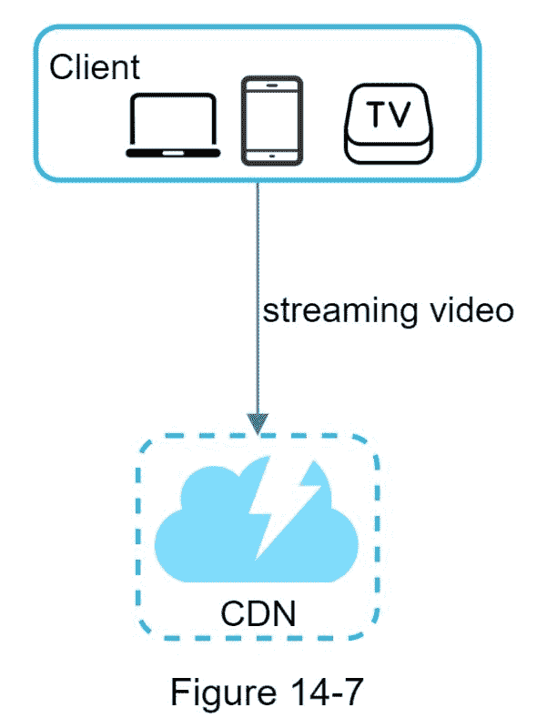

## 第三步——设计深潜

在高层设计中，整个系统被分解为两部分:视频上传流程和视频流传输流程。在这一节中，我们将通过重要的优化改进这两个流，并引入错误处理机制。

### 视频转码

录制视频时，设备(通常是手机或相机)会赋予视频文件某种格式。如果希望视频在其他设备上流畅播放，则必须将视频编码为兼容的比特率和格式。比特率是一段时间内处理比特的速率。更高的比特率通常意味着更高的视频质量。高比特率流需要更多的处理能力和快速的互联网速度。

视频转码很重要，原因如下:

原始视频消耗大量存储空间。以每秒 60 帧的速度录制的长达一小时的高清视频可能会占用数百 GB 的空间。

许多设备和浏览器只支持特定类型的视频格式。因此，出于兼容性原因，将视频编码为不同的格式是很重要的。

为了确保用户观看高质量的视频，同时保持流畅的播放，一个好主意是向具有高网络带宽的用户提供较高分辨率的视频，而向具有低带宽的用户提供较低分辨率的视频。

网络条件可能会发生变化，尤其是在移动设备上。为了确保视频连续播放，根据网络条件自动或手动切换视频质量对于流畅的用户体验至关重要。

许多类型的编码格式可用；但是，它们大多包含两个部分:

容器:这就像一个篮子，里面装着视频文件、音频和元数据。可以通过文件扩展名来判断容器格式，比如。avi，。mov 或. mp4\.

编解码器:这些是压缩和解压缩算法，旨在减少视频大小，同时保持视频质量。最常用的视频编解码器是 H.264、VP9 和 HEVC。

### 有向无环图(DAG)模型

对视频进行代码转换在计算上既昂贵又耗时。此外，不同的内容创作者可能有不同的视频处理要求。例如，一些内容创建者要求在他们的视频上添加水印，一些内容创建者自己提供缩略图，一些内容创建者上传高清视频，而其他内容创建者则不需要。

为了支持不同的视频处理管道并保持高并行性，添加某种程度的抽象并让客户端程序员定义要执行的任务是很重要的。例如，脸书的流媒体视频引擎使用有向无环图(DAG)编程模型，该模型分阶段定义任务，因此它们可以顺序或并行执行[8]。在我们的设计中，我们采用了类似的 DAG 模型来实现灵活性和并行性。图 14-8 显示了一个用于视频转码的 DAG。

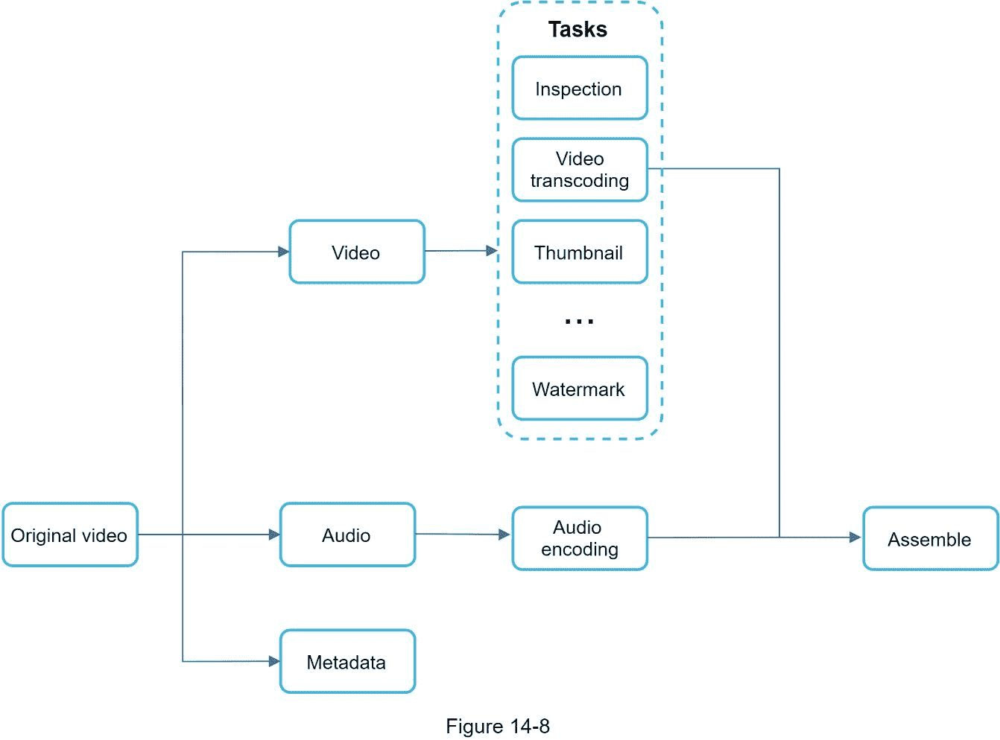

在图 14-8 中，原始视频被分成视频、音频和元数据。以下是一些可以应用于视频文件的任务:

检查:确保视频质量良好，没有畸形。

视频编码:视频被转换以支持不同的分辨率、编解码器、比特率等。图 14-9 显示了一个视频编码文件的例子。

。缩略图可以由用户上传，也可以由系统自动生成。

水印:覆盖在视频顶部的图像包含视频的识别信息。

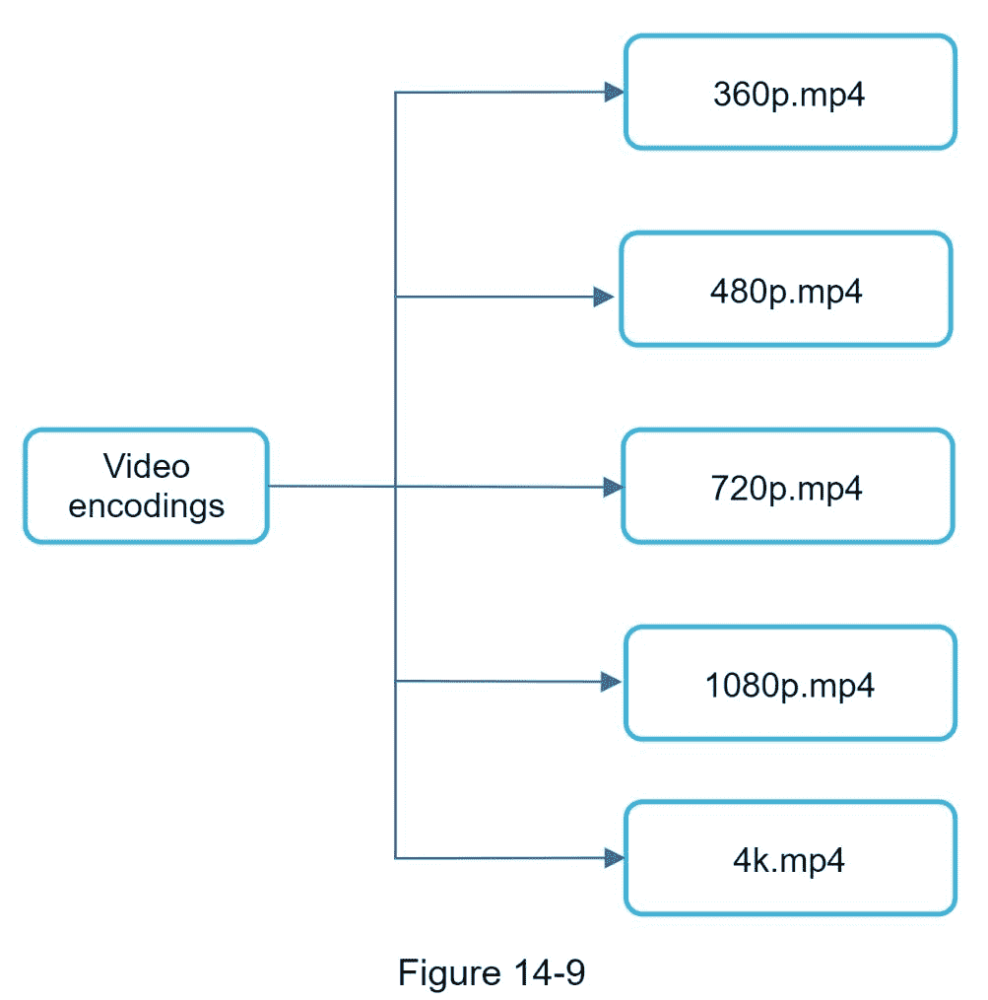

### 视频转码架构

图 14-10 显示了提议的利用云服务的视频转码架构。

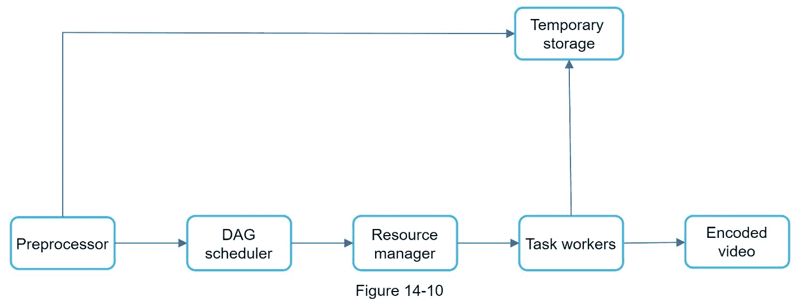

该架构有六个主要组件:预处理器、DAG 调度器、资源管理器、任务工作器、临时存储器和作为输出的编码视频。让我们仔细看看每个组件。

#### 预处理器

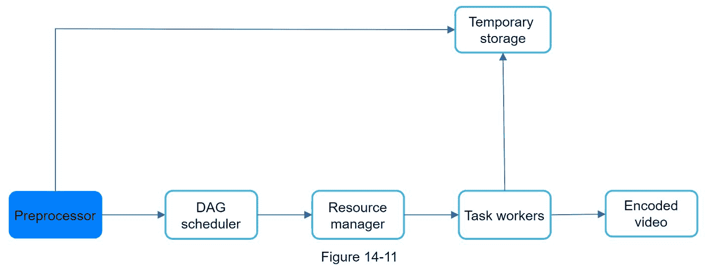

预处理器有 4 个职责:

1。视频分割。视频流被分割或进一步分割成较小图像组(GOP)排列。GOP 是按特定顺序排列的一组/一大块帧。每个区块都是一个独立的游戏单元，长度通常只有几秒钟。

2。一些旧的移动设备或浏览器可能不支持视频分割。预处理器分割视频的 GOP 对齐老客户端。

3。DAG 一代。处理器基于客户端程序员编写的配置文件生成 DAG。图 14-12 是一个简化的 DAG 表示，它有两个节点和一条边:

这个 DAG 表示由下面的两个配置文件生成(图 14-13):

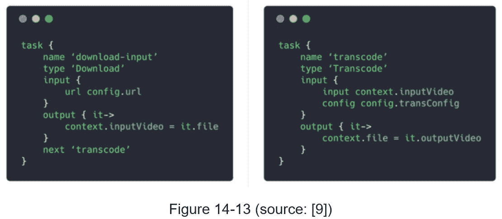

4。缓存数据。预处理器是分段视频的缓存。为了提高可靠性，预处理器将 GOP 和元数据存储在临时存储中。如果视频编码失败，系统可以使用持久数据进行重试操作。

#### 天调度器

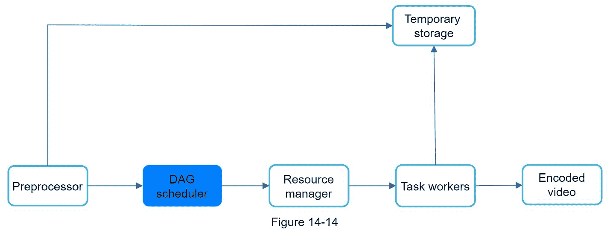

DAG 调度程序将 DAG 图分割成任务阶段，并将它们放入资源管理器的任务队列中。图 14-15 显示了 DAG 调度程序如何工作的示例。

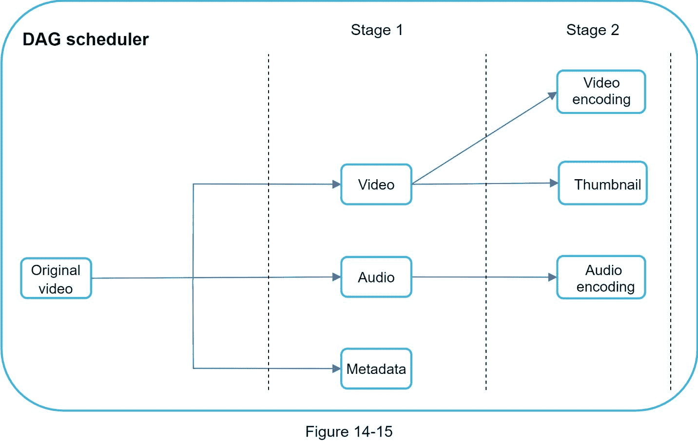

如图 14-15 所示，原始视频被分成两个阶段:阶段 1:视频、音频和元数据。在阶段 2 中，视频文件被进一步分成两个任务:视频编码和缩略图。作为阶段 2 任务的一部分，音频文件需要音频编码。

#### 资源经理

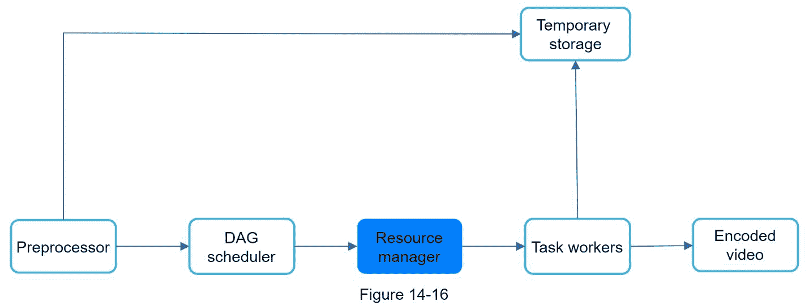

资源经理负责管理资源分配的效率。它包含 3 个队列和一个任务调度器，如图 14-17 所示。

任务队列:是一个优先级队列，包含要执行的任务。

工人队列:包含工人使用信息的优先队列。

运行队列:包含当前正在运行的任务以及运行这些任务的工作人员的信息。

任务调度器:挑选最优的任务/工作者，并指示所选的任务工作者执行作业。

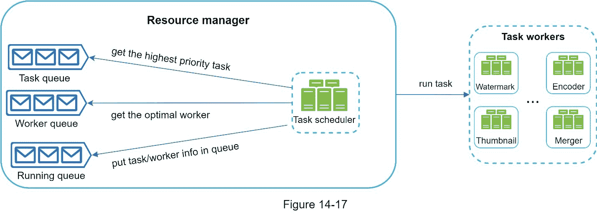

资源管理器的工作方式如下:

任务调度器从任务队列中获取优先级最高的任务。

任务调度器从工作者队列中获取最优的任务工作者来运行任务。

任务调度器指示选择的任务工作者运行任务。

任务调度器绑定任务/工作者信息，放入运行队列。

一旦任务完成，任务调度器就将任务从运行队列中删除。

#### 任务工人

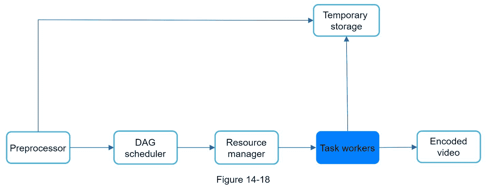

任务工作者运行 DAG 中定义的任务。不同的任务工作者可能运行不同的任务，如图 14-19 所示。

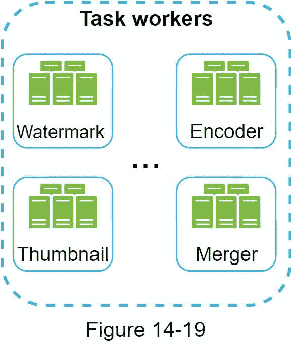

#### 临时存储

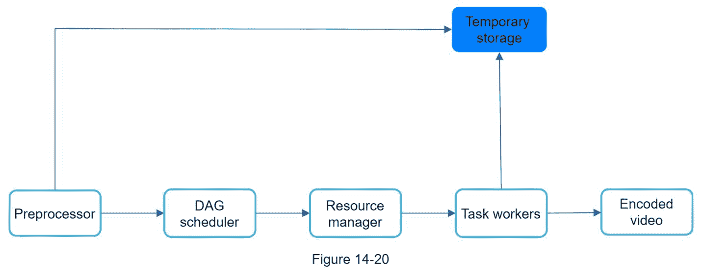

这里使用了多个存储系统。存储系统的选择取决于数据类型、数据大小、访问频率、数据生命周期等因素。例如，工作人员经常访问元数据，并且数据大小通常很小。因此，在内存中缓存元数据是一个好主意。对于视频或音频数据，我们将它们放在 blob 存储中。一旦相应的视频处理完成，临时存储器中的数据被释放。

#### 编码视频

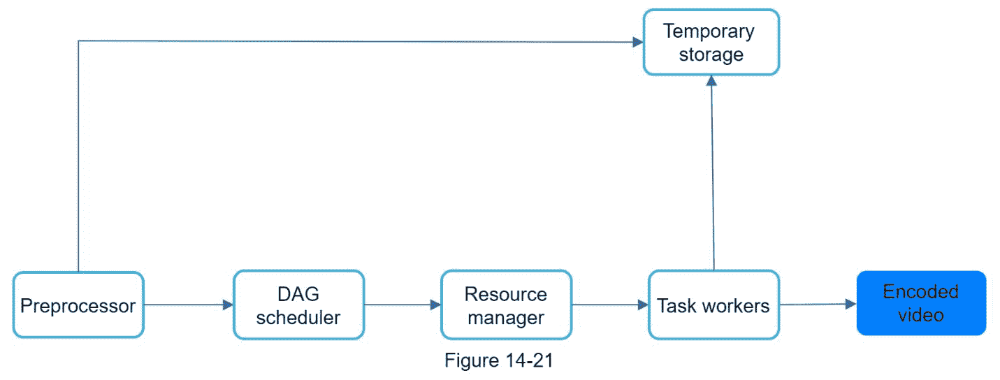

编码视频是编码管道的最终输出。下面是一个输出的例子: 滑稽 _720p.mp 4 。

### 系统优化

至此，你应该对视频上传流程、视频流流程和视频转码有了很好的理解。接下来，我们将优化系统，包括速度、安全和成本节约。

#### 速度优化:并行上传视频

整体上传一个视频效率很低。我们可以通过 GOP 对齐将一个视频分割成更小的块，如图 14-22 所示。

这允许在先前上传失败时快速恢复上传。按 GOP 分割视频文件的工作可以由客户端实现，以提高上传速度，如图 14-23 所示。

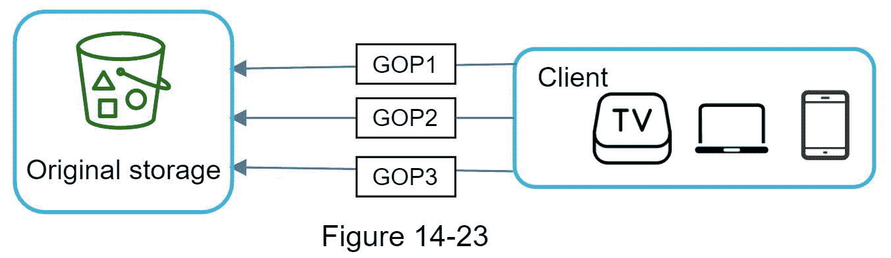

#### 速度优化:将上传中心放在离用户近的地方

另一种提高上传速度的方法是在全球设立多个上传中心(图 14-24)。美国的人可以上传视频到北美上传中心，中国的人可以上传视频到亚洲上传中心。为了实现这一点，我们使用 CDN 作为上传中心。

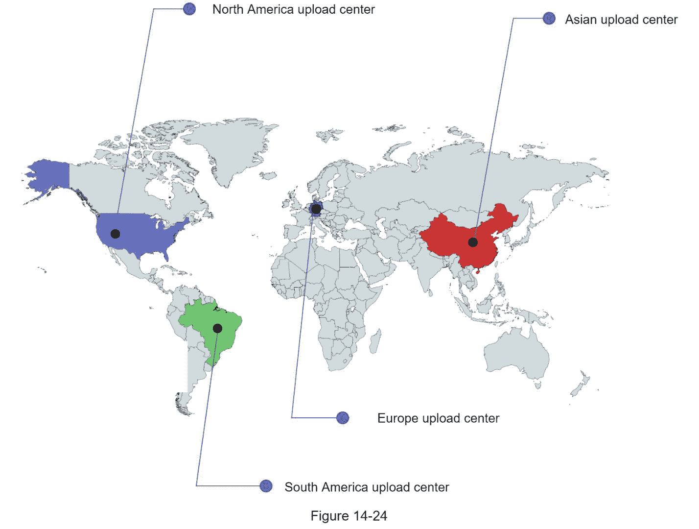

#### 速度优化:并行无处不在

实现低延迟需要付出巨大努力。另一个优化是构建一个松散耦合的系统，并实现高并行性。

我们的设计需要一些修改来实现高并行性。让我们放大视频从原始存储转移到 CDN 的流程。流程如图 14-25 所示，显示了输出依赖于前一步的输入。这种依赖性使得并行变得困难。

为了使系统更加松散耦合，我们引入了消息队列，如图 14-26 所示。让我们用一个例子来解释消息队列是如何使系统更加松散耦合的。

在消息队列引入之前，编码模块必须等待下载模块的输出。

引入消息队列后，编码模块不再需要等待下载模块的输出。如果消息队列中有事件，编码模块可以并行执行这些作业。

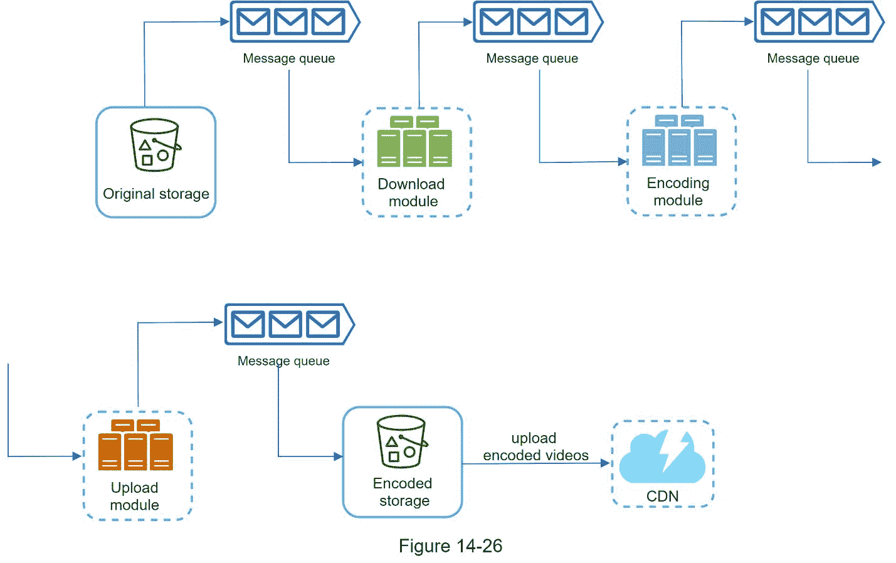

#### 安全优化:预签名上传 URL

安全是任何产品最重要的方面之一。为了确保只有授权用户上传视频到正确的位置，我们引入了预先签名的 URL，如图 14-27 所示。

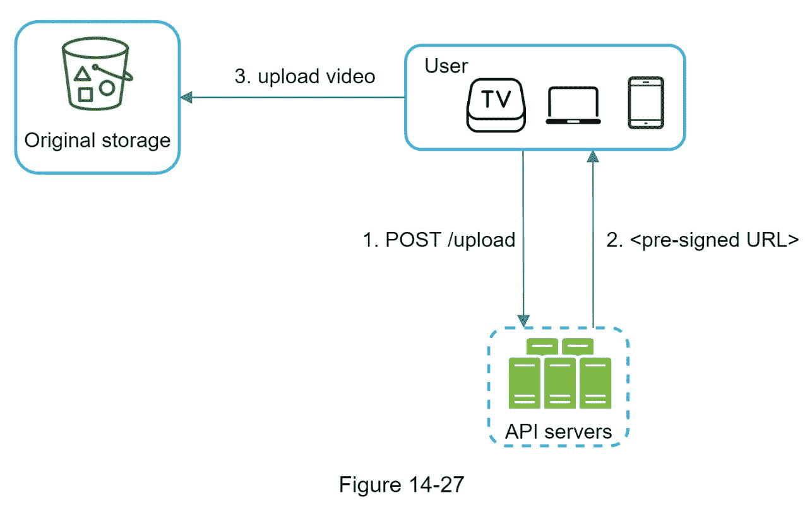

上传流程更新如下:

1。客户端向 API 服务器发出一个 HTTP 请求，以获取预先签名的 URL，这为 URL 中标识的对象提供了访问权限。术语预签名 URL 用于将文件上传到亚马逊 S3。其他云服务提供商可能会使用不同的名称。例如，微软 Azure blob 存储支持相同的功能，但称之为“共享访问签名”[10]。

2。API 服务器用一个预先签名的 URL 进行响应。

3。一旦客户端收到响应，它就使用预先签名的 URL 上传视频。

#### 安全优化:保护你的视频

许多内容制作者不愿意在网上发布视频，因为他们担心自己的原创视频会被窃取。为了保护有版权的视频，我们可以采用以下三种安全选项之一:

数字版权管理(DRM)系统:三大 DRM 系统分别是苹果 FairPlay、谷歌 Widevine、微软 PlayReady。

AES 加密:可以加密视频，配置授权策略。加密的视频将在播放时解密。这确保了只有授权用户才能观看加密视频。

视觉水印:这是覆盖在视频上的图像，包含视频的识别信息。它可以是你的公司标志或公司名称。

#### 节约成本优化

CDN 是我们系统的重要组成部分。它确保了全球范围内的快速视频传输。然而，从信封计算的后面，我们知道 CDN 是昂贵的，尤其是当数据量很大时。怎样才能降低成本？

先前的研究表明，YouTube 视频流遵循长尾分布[11] [12]。这意味着一些受欢迎的视频被频繁访问，但许多其他视频很少或没有观众。基于这个观察，我们实现了一些优化:

1。仅提供来自 CDN 的最受欢迎的视频和来自我们高容量存储视频服务器的其他视频(图 14-28)。

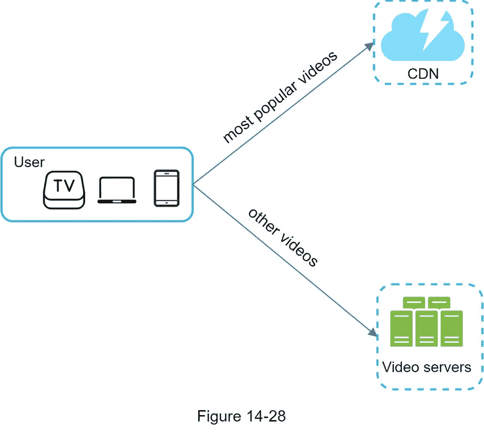

2。对于不太受欢迎的内容，我们可能不需要存储许多编码视频版本。短视频可以按需编码。

3。有些视频只在某些地区受欢迎。没有必要将这些视频分发到其他地区。

4。像网飞一样建立自己的 CDN，并与互联网服务提供商(ISP)合作。建设你的 CDN 是一个巨大的工程；然而，这对大型流媒体公司来说可能是有意义的。ISP 可以是康卡斯特、威瑞森 T2 电信公司或其他互联网提供商。ISP 遍布世界各地，离用户很近。通过与 ISP 合作，您可以改善观看体验并降低带宽费用。

所有这些优化都基于内容受欢迎程度、用户访问模式、视频大小等。在进行任何优化之前，分析历史观看模式是很重要的。以下是一些关于这个话题的有趣文章:[12] [13]。

### 错误处理

对于一个大型系统来说，系统误差是不可避免的。为了建立一个高度容错的 - 系统，我们必须优雅地处理错误并快速恢复。存在两种类型的错误:

可恢复的错误。对于可恢复的错误，如视频片段无法转码，一般的想法是重试几次操作。如果任务继续失败，并且系统认为它是不可恢复的，它将向客户端返回一个适当的错误代码。

不可恢复的错误。对于不可恢复的错误，如格式错误的视频格式，系统会停止运行与视频相关的任务，并将正确的错误代码返回给客户端。

每个系统组件的典型错误包含在以下行动手册中:

上传错误:重试几次。

分割视频错误:如果旧版本的客户端不能通过 GOP 对齐来分割视频，则整个视频被传递到服务器。分割视频的工作是在服务器端完成的。

转码错误:重试。

预处理器错误:重新生成 DAG 图。

DAG 调度程序错误:重新调度任务。

资源管理器排队:使用副本。

任务工作线程关闭:在新的工作线程上重试任务。

API 服务器关闭:API 服务器是无状态的，因此请求将被定向到不同的 API 服务器。

元数据缓存服务器宕机:数据被 多次复制。如果一个节点出现故障，您仍然可以访问其他节点来获取数据。我们可以启用一个新的缓存服务器来替换失效的服务器。

元数据数据库服务器关闭:

主人被打倒了。如果主服务器关闭，提升其中一个从服务器作为新的主服务器。

建奴被打倒了。如果一个从属服务器关闭，您可以使用另一个从属服务器进行读取，并启动另一个数据库服务器来替换关闭的服务器。

## 第四步——总结

在本章中，我们介绍了 YouTube 等视频流服务的架构设计。如果面试结束还有额外的时间，这里补充几点:

伸缩 API 层:因为 API 服务器是无状态的，所以很容易横向伸缩 API 层。

伸缩数据库:可以说说数据库复制和分片。

流媒体直播:指视频如何实时录制和播放的过程。虽然我们的系统不是专门为直播设计的，但直播和非直播有一些相似之处:都需要上传、编码和流式传输。显著的区别是:

直播流媒体的延迟要求更高，因此可能需要不同的流媒体协议。

直播对并行性的要求较低，因为小块数据已经被实时处理。

直播需要不同的错误处理集合。任何花费太多时间的错误处理都是不可接受的。

视频删除:侵犯版权、色情或其他非法行为的视频将被删除。有些可以在上传过程中被系统发现，而有些则可能通过用户标记被发现。

祝贺你走到这一步！现在给自己一个鼓励。干得好！

参考资料

【1】YouTube by the numbers:[【https://www.omnicoreagency.com/youtube-statistics/】](https://www.omnicoreagency.com/youtube-statistics/)

[2] 2019 年 YouTube 人口统计:

[https://blog.hubspot.com/marketing/youtube-demographics](https://blog.hubspot.com/marketing/youtube-demographics)

【3】云锋定价:

【4】AWS 上的网飞:[T3】https://aws.amazon.com/solutions/case-studies/netflix/T5】](https://aws.amazon.com/solutions/case-studies/netflix/)

【5】Akamai 主页:

【6】双星大天体:

[7]以下是你需要了解的流媒体协议:

[https://www.dacast.com/blog/streaming-protocols/](https://www.dacast.com/blog/streaming-protocols/)

【8】SVE:脸书规模的分布式视频处理:

【9】微博视频处理架构:[【https://www.upyun.com/opentalk/399.html】](https://www.upyun.com/opentalk/399.html)

[10]使用共享访问签名委托访问:

[https://docs . Microsoft . com/en-us/rest/API/storage services/delegate-access-with-shared-access-signatureT3】](https://docs.microsoft.com/en-us/rest/api/storageservices/delegate-access-with-shared-access-signature)

【11】YouTube 早期员工谈 YouTube 可扩展性:[【https://www.youtube.com/watch?v=w5WVu624fY8】](https://www.youtube.com/watch?v=w5WVu624fY8)

[12]了解互联网短视频分享的特点:基于 youtube 的测量研究。

[13]开放连接的内容流行度:

[https://netflixtechblog . com/content-popularity-for-open-connect-b 86d 56 f 613 b](https://netflixtechblog.com/content-popularity-for-open-connect-b86d56f613b)