# 十五、设计谷歌云盘

近年来，Google Drive、Dropbox、微软 OneDrive、苹果 iCloud 等云存储服务变得非常流行。在这一章中，你被要求设计 Google Drive。

在开始设计之前，让我们花点时间了解一下 Google Drive。Google Drive 是一种文件存储和同步服务，可以帮助您在云端存储文档、照片、视频和其他文件。您可以从任何电脑、智能手机和平板电脑上访问您的文件。您可以轻松地与朋友、家人和同事分享这些文件[1]。图 15-1 和 15-2 分别显示了 Google drive 在浏览器和移动应用上的样子。

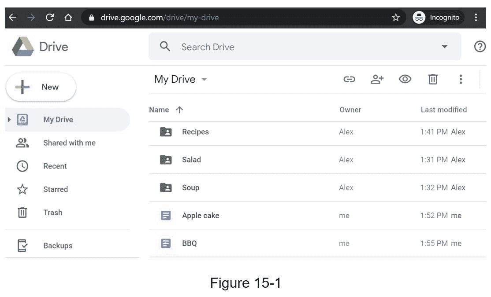

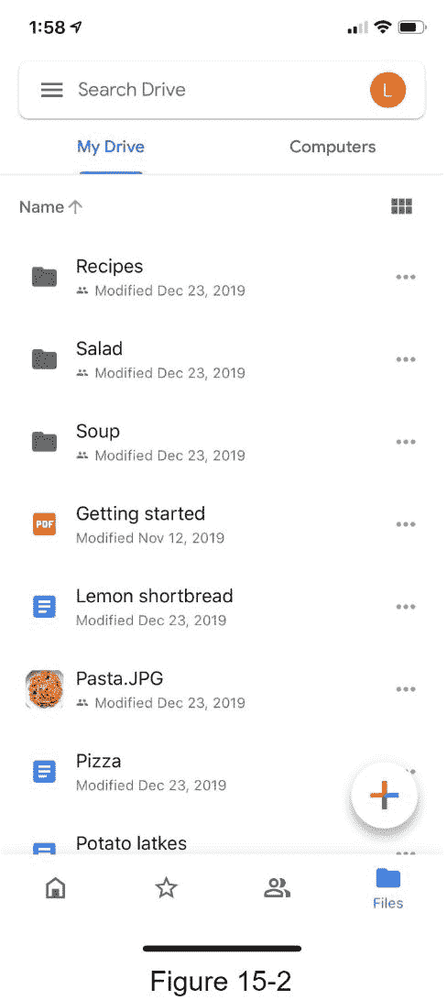

## 步骤 1 -了解问题并确定设计范围

设计 Google drive 是一个大项目，所以提问来缩小范围是很重要的。

候选 : 最重要的特征是什么？

面试官 :上传下载文件，文件同步，通知。

候选人 : 这是一款手机 app，还是一款 web app，还是两者都有？

面试官 :都有。

候选人 :支持哪些文件格式？

面试官 :任何文件类型。

考生 :文件需要加密吗？

采访 :是的，存储中的文件必须加密。

候选人 :文件大小有限制吗？

采访 :是的，文件必须是 10 GB 或者更小。

候选人 : 产品有多少用户？

面试官 : 10M DAU。

在本章中，我们重点介绍以下特性:

添加文件。添加文件最简单的方法是将文件拖放到 Google drive 中。

下载文件。

跨多个设备同步文件。当文件添加到一个设备时，它会自动同步到其他设备。

参见文件修订。

与朋友、家人和同事分享文件

当文件被编辑、删除或与您共享时，发送通知。

本章未讨论的特性包括:

谷歌文档编辑与协作。Google doc 允许多人同时编辑同一个文档。这超出了我们的设计范围。

除了阐明需求，理解非功能性需求也很重要:

可靠性。可靠性对于存储系统来说极其重要。数据丢失是不可接受的。

同步速度快。如果文件同步花费太多时间，用户会变得不耐烦并放弃产品。

带宽使用率。如果一个产品占用了大量不必要的网络带宽，用户会不高兴，特别是当他们使用移动数据计划时。

扩展性。这个系统应该能够处理大量的交通流量。

高可用性。当某些服务器脱机、速度变慢或出现意外网络错误时，用户应该仍然能够使用系统。

### 信封估算的背面

假设该应用拥有 5000 万注册用户和 1000 万 DAU。

用户获得 10 GB 免费空间。

假设用户每天上传 2 个文件。平均文件大小为 500 KB。

1:1 读写比。

总分配空间:5000 万* 10gb = 500 Pb

QPS 上传 API:1000 万* 2 次上传/ 24 小时/ 3600 秒= ~ 240

巅峰 QPS = QPS * 2 = 480

## 第二步-提出高层次设计并获得认同

我们将使用稍微不同的方法，而不是从一开始就展示概要设计图。我们将从简单的事情开始:在单个服务器中构建一切。然后，逐步扩大规模，支持数百万用户。通过做这个练习，它将刷新你对书中涉及的一些重要话题的记忆。

让我们从下面列出的单个服务器设置开始:

上传和下载文件的网络服务器。

跟踪元数据的数据库，如用户数据、登录信息、文件信息等。

存储文件的存储系统。我们分配 1TB 的存储空间来存储文件。

我们花了几个小时设置了一个 Apache web 服务器，一个 MySql 数据库，以及一个名为 drive/ 的目录作为根目录来存储上传的文件。在 drive/ 目录下，有一个目录列表，称为名称空间。每个名称空间包含该用户的所有上传文件。服务器上的文件名与原始文件名保持一致。通过连接命名空间和相对路径，可以唯一地标识每个文件或文件夹。

图 15-3 显示了左侧的 /drive 目录及其右侧的展开视图。

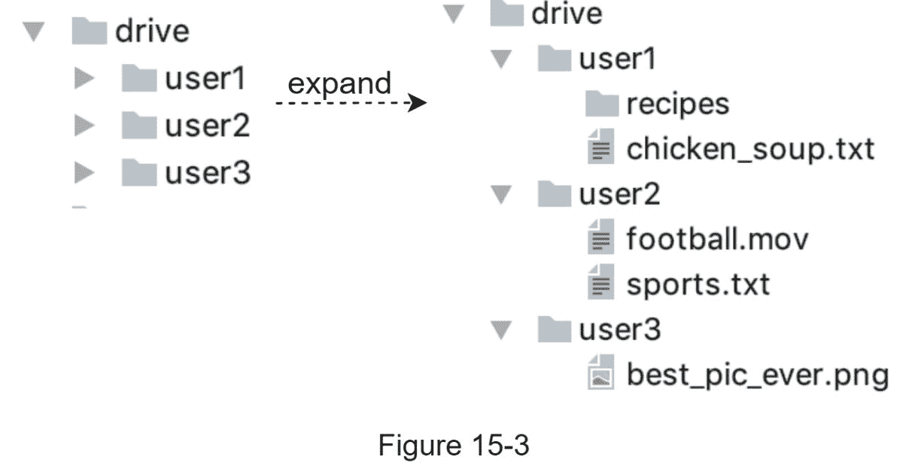

### API

API 看起来像什么？我们主要需要 3 个 API:上传文件、下载文件和获取文件修订。

1。将文件上传到 Google Drive

支持两种上传类型:

简单上传。当文件较小时，使用此上传类型。

可恢复上传。当文件很大并且网络中断的可能性很高时，使用此上传类型。

下面是一个可恢复上传 API 的例子:

https://api.example.com/files/upload?uploadType=resumable

参数:

上传类型=可恢复

数据:要上传的本地文件。

可恢复上传通过以下 3 个步骤实现【2】:

发送初始请求以检索可恢复的 URL。

上传数据并监控上传状态。

如果上传中断，恢复上传。

2。从 Google Drive 下载文件

示例 API:https://api.example.com/files/download

参数:

路径:下载文件路径。

示例参数:

{

" path ":"/recipes/soup/best _ soup . txt "

}

3。获取文件修订版

示例 API:https://api.example.com/files/list_revisions

参数:

路径:您想要获取修订历史的文件的路径。

限制:返回的最大修订数。

示例参数:

{

"路径":"/recipes/soup/best_soup.txt "，

【极限】:20

}

所有的 API 都需要用户认证并使用 HTTPS。安全套接字层(SSL)保护客户端和后端服务器之间的数据传输。

### 远离单一服务器

随着更多的文件上传，最终你会得到如图 15-4 所示的空间已满的警告。

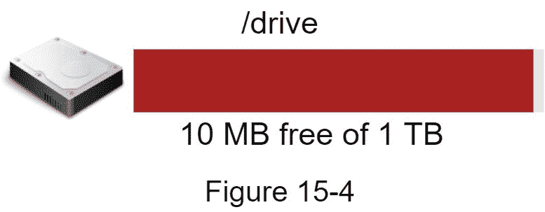

只剩下 10 MB 的存储空间了！这是一个紧急情况，因为用户不能再上传文件。我想到的第一个解决方案是对数据进行分片，这样就可以将数据存储在多个存储服务器上。图 15-5 显示了基于 user_i d 的分片示例。

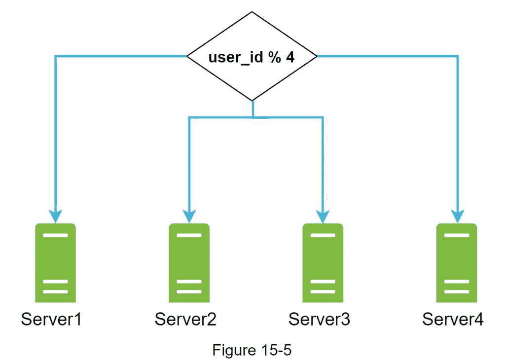

你熬了一整夜来建立数据库分片并密切监控它。一切又顺利了。您已经扑灭了大火，但是您仍然担心万一存储服务器停机，可能会丢失数据。你四处打听，你的后台专家朋友 Frank 告诉你，许多领先的公司，如网飞和 Airbnb，都使用亚马逊 S3 进行存储。“亚马逊简单存储服务(亚马逊 S3)是一种对象存储服务，提供行业领先的可扩展性、数据可用性、安全性和性能”[3]。你决定做一些研究，看看它是否是一个很好的适合。

经过大量阅读，你对 S3 的存储系统有了很好的了解，并决定在 S3 存储文件。亚马逊 S3 支持同区域和跨区域复制。区域是亚马逊网络服务(AWS)拥有数据中心的地理区域。如图 15-6 所示，数据可以在同一区域(左侧)和跨区域(右侧)复制。冗余文件存储在多个区域，以防止数据丢失并确保可用性。存储桶就像文件系统中的文件夹。

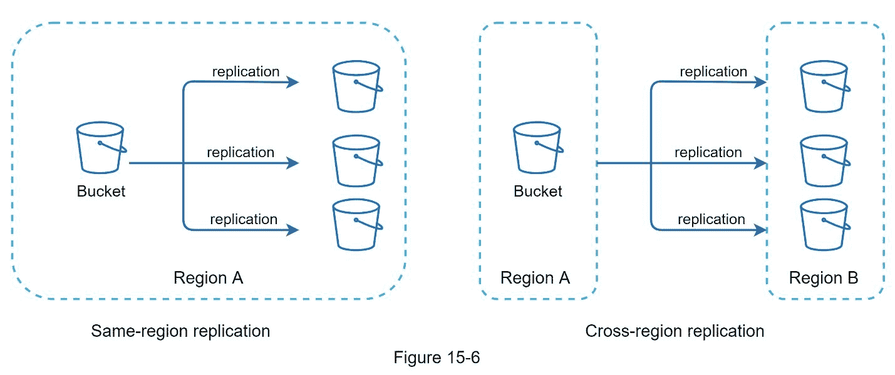

把文件放到 S3 后，你终于可以睡个好觉，不用担心数据丢失了。为了防止将来发生类似的问题，你决定对你可以改进的地方做进一步的研究。以下是你能找到的几个领域:

负载均衡器:添加一个负载均衡器来分配网络流量。负载平衡器确保流量均匀分布，如果 web 服务器出现故障，它将重新分配流量。

Web 服务器:添加负载均衡器后，可以根据流量负载轻松添加/删除更多 Web 服务器。

元数据库:将数据库移出服务器，避免单点故障。同时，设置数据复制和分片，以满足可用性和可伸缩性要求。

文件存储:亚马逊 S3 用于文件存储。为了确保可用性和持久性，文件在两个不同的地理区域进行复制。

在应用了上述改进之后，您已经成功地将 web 服务器、元数据数据库和文件存储从单个服务器中分离出来。更新后的设计如图 15-7 所示。

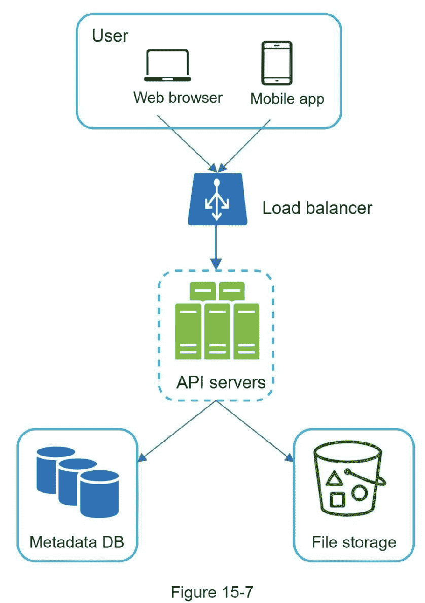

### 同步冲突

对于 Google Drive 这样的大型存储系统，同步冲突时有发生。当两个用户同时修改同一个文件或文件夹时，就会发生冲突。我们如何解决冲突？这是我们的策略:第一个被处理的版本获胜，后面被处理的版本受到冲突。图 15-8 显示了一个同步冲突的例子。

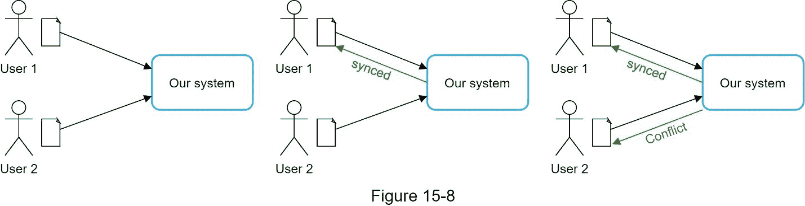

在图 15-8 中，用户 1 和用户 2 试图同时更新同一个文件，但是用户 1 的文件首先被我们的系统处理。用户 1 的更新操作成功，但是用户 2 遇到了同步冲突。我们如何解决用户 2 的冲突？我们的系统提供了同一个文件的两个副本:用户 2 的本地副本和来自服务器的最新版本(图 15-9)。用户 2 可以选择合并两个文件，或者用一个版本覆盖另一个版本。

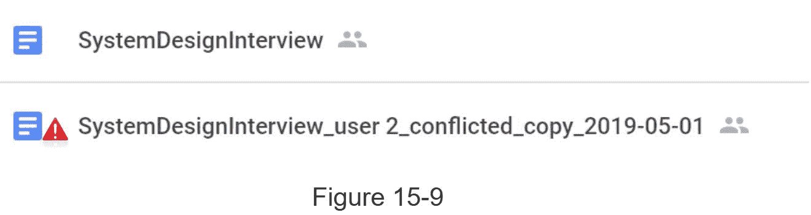

当多个用户同时编辑同一个文档时，保持文档同步是一项挑战。感兴趣的读者可以参考参考资料[4] [5]。

### 高层设计

图 15-10 说明了建议的高层设计。让我们检查一下这个系统的每个组成部分。

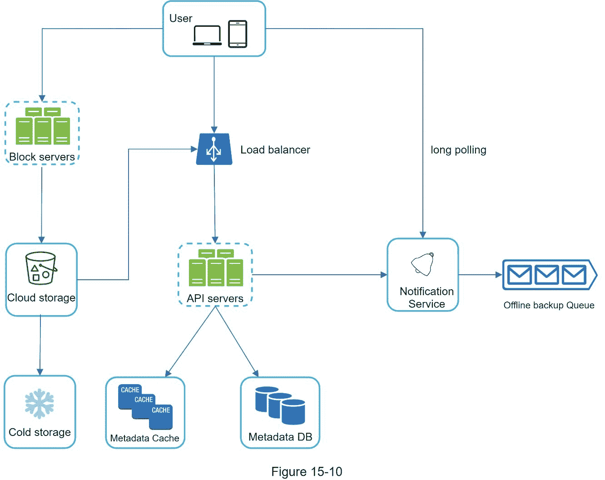

用户 : 用户通过浏览器或移动应用程序使用应用程序。

块服务器: 块服务器上传块到云存储。块存储，也称为块级存储，是一种在基于云的环境中存储数据文件的技术。一个文件可以分成几个块，每个块都有一个唯一的哈希值，存储在我们的元数据数据库中。每个数据块都被视为一个独立的对象，存储在我们的存储系统(S3)中。为了重建文件，块以特定的顺序连接。至于块大小，我们使用 Dropbox 作为参考:它将块的最大大小设置为 4MB [6]。

云存储: 一个文件被分割成更小的块，存储在云存储中。

冷存储: 冷存储是一种计算机系统，用于存储非活动数据，即长时间不访问的文件。

负载均衡器 :负载均衡器在 API 服务器之间平均分配请求。

API 服务器: 这些负责除了上传流程以外的几乎所有事情。API 服务器用于用户认证、管理用户配置文件、更新文件元数据等。

元数据数据库: 存储用户、文件、块、版本等元数据。请注意，文件存储在云中，元数据数据库只包含元数据。

元数据缓存 :一些元数据被缓存以便快速检索。

通知服务 :这是一个发布者/订阅者系统，当某些事件发生时，它允许数据从通知服务转移到客户端。在我们的具体案例中，当文件在其他地方被添加/编辑/删除时，通知服务会通知相关的客户端，以便他们可以获取最新的更改。

离线备份队列 :如果客户端离线，无法获取最新的文件更改，离线备份队列会存储信息，以便在客户端在线时同步更改。

我们已经在高层讨论了 Google Drive 的设计。有些部件很复杂，值得仔细检查；我们将在深潜中详细讨论这些。

## 步骤 3 -设计深度潜水

在本节中，我们将详细了解以下内容:块服务器、元数据库、上传流程、下载流程、通知服务、节省存储空间和故障处理。

### 块服务器

对于定期更新的大文件，每次更新时发送整个文件会消耗大量带宽。提出了两种优化来最小化正在传输的网络流量:

增量同步。当文件被修改时，使用同步算法[7] [8]，仅同步修改的块，而不是整个文件。

压缩。对块应用压缩可以显著减小数据大小。因此，使用取决于文件类型的压缩算法来压缩块。例如，gzip 和 bzip2 用于压缩文本文件。压缩图像和视频需要不同的压缩算法。

在我们的系统中，块服务器承担上传文件的繁重工作。块服务器通过将文件分割成块、压缩每个块并加密来处理从客户端传来的文件。不是将整个文件上传到存储系统，而是只传输修改过的数据块。

图 15-11 显示了添加新文件时块服务器的工作方式。

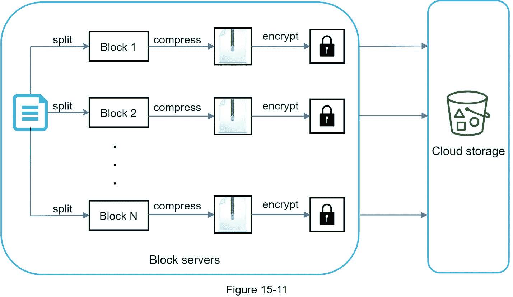

一个文件被分割成更小的块。

使用压缩算法压缩每个块。

为了保证安全，每个块在发送到云存储之前都会进行加密。

块被上传到云存储。

图 15-12 说明了增量同步，这意味着只有修改过的数据块被传输到云存储。突出显示的块“块 2”和“块 5”代表已更改的块。使用增量同步，只有这两个块被上传到云存储。

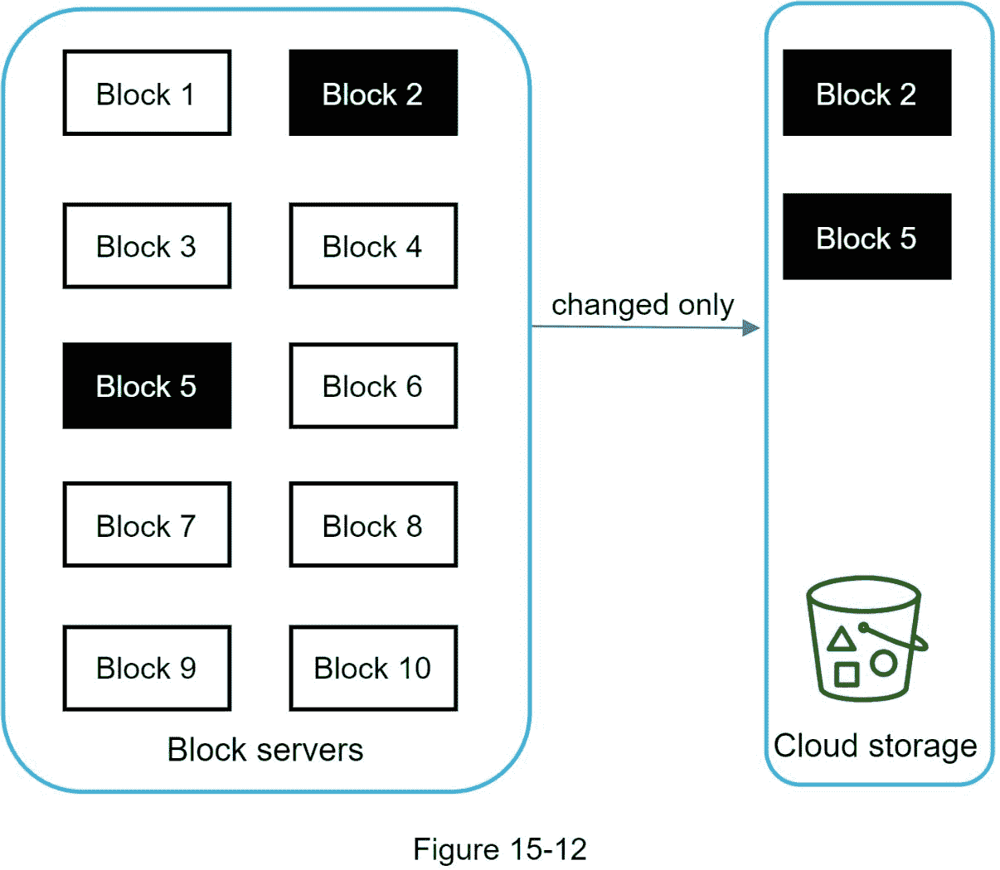

块服务器允许我们通过提供增量同步和压缩来节省网络流量。

### 高一致性要求

默认情况下，我们的系统需要强一致性。不同的客户端同时以不同的方式显示一个文件是不可接受的。系统需要为元数据缓存和数据库层提供强一致性。

默认情况下，内存缓存采用最终一致性模型，这意味着不同的副本可能有不同的数据。为了实现强一致性，我们必须确保以下几点:

缓存中的数据副本和主副本是一致的。

在数据库写入时使高速缓存无效，以确保高速缓存和数据库保存相同的值。

在关系数据库中实现强一致性很容易，因为它保持了 ACID(原子性、一致性、隔离性、持久性)属性[9]。但是，默认情况下，NoSQL 数据库不支持 ACID 属性。ACID 属性必须以编程方式合并到同步逻辑中。在我们的设计中，我们选择关系数据库，因为 ACID 本身就受支持。

### 元数据数据库

图 15-13 显示了数据库模式设计。请注意，这是一个高度简化的版本，因为它只包括最重要的表和有趣的字段。

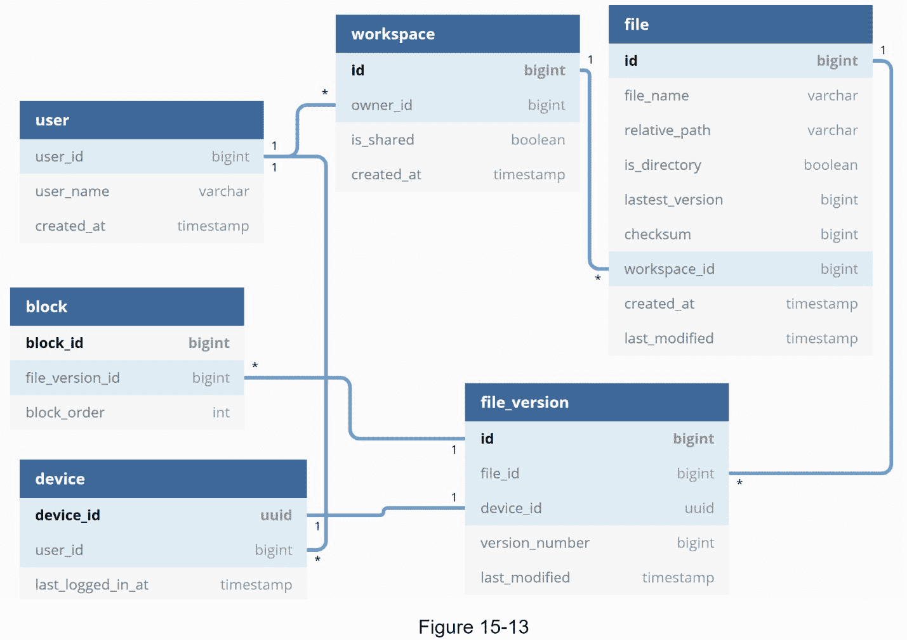

用户 :用户表包含用户的基本信息，如用户名、邮箱、个人资料照片等。

设备 :设备表存储设备信息。 Push_id 用于发送和接收移动推送通知。请注意，一个用户可以拥有多台设备。

命名空间 :命名空间是用户的根目录。

文件: 文件表存储了与最新文件相关的一切。

File_version :存储文件的版本历史。现有行是只读的，以保持文件修订历史的完整性。

Block :存储与一个文件块相关的一切。任何版本的文件都可以通过以正确的顺序连接所有的块来重建。

### 上传流量

让我们讨论一下当客户端上传文件时会发生什么。为了更好地理解流程，我们绘制了如图 15-14 所示的序列图。

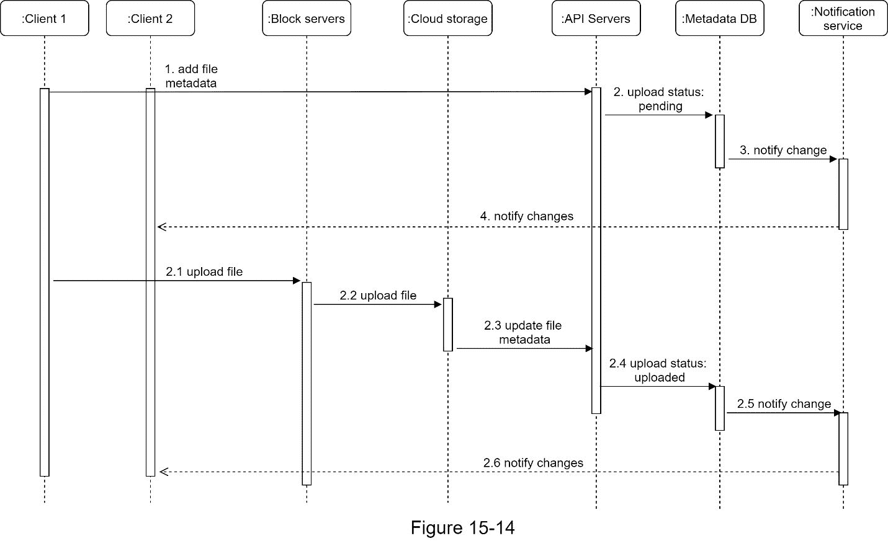

在图 15-14 中，并行发送两个请求:添加文件元数据和上传文件到云存储。两个请求都来自客户端 1。

添加文件元数据。

1。客户端 1 发送添加新文件的元数据的请求。

2。将新的文件元数据存储在元数据数据库中，并将文件上传状态更改为“待定”

3。通知通知服务正在添加新文件。

4。通知服务通知相关客户端(客户端 2)正在上传文件。

上传文件到云存储。

2.1 客户端 1 将文件内容上传到块服务器。

2.2 块服务器将文件分块，压缩，加密，上传到云存储。

2.3 文件上传后，云存储触发上传完成回调。请求被发送到 API 服务器。

2.4 元数据数据库中的文件状态更改为“已上传”。

2.5 通知通知服务，文件状态已更改为“已上传”

2.6 通知服务通知相关客户端(客户端 2)文件上传完毕。

编辑一个文件的时候，流程差不多，就不赘述了。

### 下载流量

在别处添加或编辑文件时触发下载流。客户端如何知道文件是否被另一个客户端添加或编辑？客户端可以通过两种方式获知:

如果客户端 A 在线，而另一个客户端更改了文件，通知服务将通知客户端 A 某处发生了更改，因此它需要获取最新数据。

如果客户端 A 离线，而文件被另一个客户端更改，数据将被保存到缓存中。当脱机客户端再次联机时，它会提取最新的更改。

一旦客户端知道文件被更改，它首先通过 API 服务器请求元数据，然后下载块来构建文件。图 15-15 显示了详细的流程。请注意，由于篇幅限制，图中仅显示了最重要的组件。

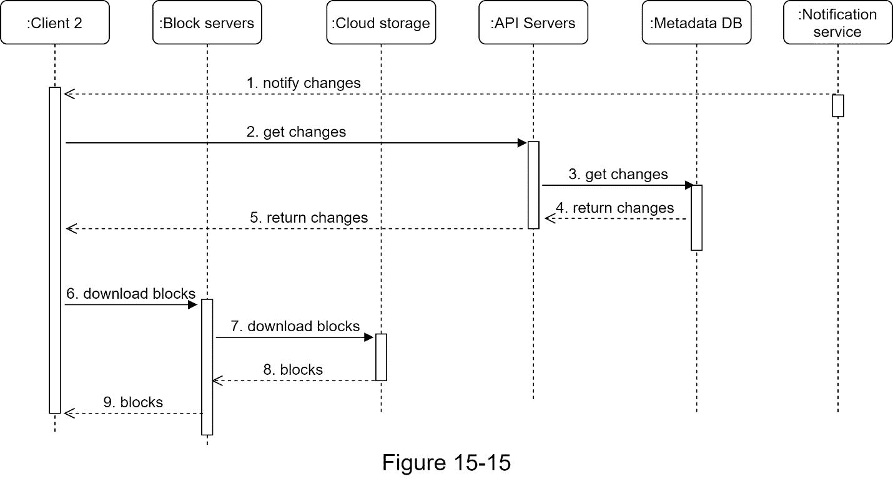

1。通知服务通知客户端 2 文件在其他地方被改变。

2。一旦客户机 2 知道有新的更新可用，它就发送一个获取元数据的请求。

3。API 服务器调用元数据数据库来获取变更的元数据。

4。元数据被返回给 API 服务器。

5。客户端 2 获取元数据。

6。客户端收到元数据后，会向数据块服务器发送下载数据块的请求。

7。块服务器首先从云存储中下载块。

8。云存储将块返回给块服务器。

9。客户端 2 下载所有新块来重建文件。

### 通知服务

为了保持文件的一致性，在本地执行的文件的任何变化都需要通知其他客户端以减少冲突。通知服务就是为此而构建的。在高层次上，通知服务允许在事件发生时将数据传输到客户端。下面是几个选项:

长轮询。Dropbox 使用长轮询[10]。

网络插座。WebSocket 提供了客户端和服务器之间的持久连接。交流是双向的。

尽管这两个选项都工作得很好，但我们选择长轮询有以下两个原因:

通知服务的通信不是双向的。服务器向客户端发送有关文件更改的信息，但反之亦然。

web socket 适用于实时双向交流，比如聊天应用。对于 Google Drive，通知很少发送，没有数据突发。

使用长轮询，每个客户端建立一个到通知服务的长轮询连接。如果检测到对文件的更改，客户端将关闭长轮询连接。关闭连接意味着客户端必须连接到元数据服务器才能下载最新的更改。收到响应或连接超时后，客户端会立即发送新的请求来保持连接打开。

### 节省存储空间

为了支持文件版本历史并确保可靠性，同一文件的多个版本存储在多个数据中心。频繁备份所有文件修订会很快填满存储空间。提出了三种技术来降低存储成本:

删除重复数据块。在帐户级别消除冗余块是节省空间的简单方法。如果两个块具有相同的哈希值，则它们是相同的。

采用智能数据备份策略。可以应用两种优化策略:

设置限制:我们可以设置存储版本数量的限制。如果达到限制，旧版本将被新版本替换。

只保留有价值的版本:有些文件可能会经常编辑。例如，为大量修改的文档保存每个编辑过的版本可能意味着该文件在短时间内被保存 1000 次以上。为了避免不必要的拷贝，我们可以限制保存版本的数量。我们更重视最近的版本。实验有助于找出要保存的最佳版本数量。

将不常用的数据移动到冷存储。冷数据是几个月或几年没有活动的数据。像亚马逊 S3 冰川[11]这样的冷库比 S3 便宜多了。

### 故障处理

大规模系统中会出现故障，我们必须采用设计策略来解决这些故障。你的面试官可能有兴趣听听你是如何处理以下系统故障的:

负载均衡器故障:如果一个负载均衡器出现故障，辅助负载均衡器将变为活动状态，并接管流量。负载平衡器通常使用心跳来相互监控，心跳是负载平衡器之间发送的周期性信号。如果负载平衡器在一段时间内没有发送心跳信号，则被视为失败。

块服务器故障:如果一个块服务器发生故障，其他服务器会接管未完成或未完成的任务。

云存储失败:S3 桶在不同地区多次复制。如果文件在一个区域不可用，可以从不同的区域获取。

API 服务器故障:是无状态服务。如果一个 API 服务器出现故障，负载均衡器会将流量重定向到其他 API 服务器。

元数据缓存故障:元数据缓存服务器被多次复制。如果一个节点出现故障，您仍然可以访问其他节点来获取数据。我们将启用一个新的缓存服务器来替换出现故障的服务器。

元数据数据库故障。

主节点关闭:如果主节点关闭，提升其中一个从节点作为新的主节点，并启动新的从节点。

从服务器宕机:如果一个从服务器宕机，您可以使用另一个从服务器进行读取操作，并使用另一个数据库服务器来替换出现故障的服务器。

通知服务失败:每个在线用户与通知服务器保持长时间的轮询连接。因此，每个通知服务器都与许多用户连接。根据 Dropbox 2012 年的报告[6]，每台机器上有超过 100 万个连接处于打开状态。如果服务器关闭，所有长轮询连接都将丢失，因此客户端必须重新连接到不同的服务器。即使一台服务器可以保持许多打开的连接，它也不能一次重新连接所有丢失的连接。与所有丢失的客户重新联系是一个相对缓慢的过程。

离线备份队列失败:队列被多次复制。如果一个队列失败，该队列的使用者可能需要重新订阅备份队列。

## 第四步——总结

在本章中，我们提出了一个支持 Google Drive 的系统设计。强一致性、低网络带宽和快速同步的结合使设计变得有趣。我们的设计包含两个流程:管理文件元数据和文件同步。通知服务是系统的另一个重要组成部分。它使用长轮询来使客户端及时了解文件更改。

和任何系统设计面试问题一样，没有完美的解决方案。每个公司都有其独特的限制，你必须设计一个系统来适应这些限制。了解设计和技术选择的权衡非常重要。如果还有几分钟，你们可以谈谈不同的设计选择。

例如，我们可以从客户端直接将文件上传到云存储，而不是通过块服务器。这种方法的优点是它使文件上传更快，因为文件只需要传输一次到云存储。在我们的设计中，文件首先传输到块服务器，然后传输到云存储。然而，新方法有一些缺点:

首先，必须在不同的平台(iOS、Android、Web)上实现相同的分块、压缩、加密逻辑。它容易出错，需要大量的工程工作。在我们的设计中，所有这些逻辑都在一个集中的地方实现:块服务器。

其次，由于客户端很容易被黑客攻击或操纵，在客户端实现加密逻辑并不理想。

系统的另一个有趣的发展是将在线/离线逻辑转移到一个独立的服务中。让我们称之为现场服务。通过将在线服务移出通知服务器，在线/离线功能可以很容易地被其他服务集成。

祝贺你走到这一步！现在给自己一个鼓励。干得好！

参考资料

[https://www.google.com/drive/](https://www.google.com/drive/)

【2】上传文件数据:

【3】亚马逊 S3:[T3】https://aws.amazon.com/s3T5】](https://aws.amazon.com/s3/)

【4】差分同步

【5】差分同步 YouTube talk[https://www.youtube.com/watch?v=S2Hp_1jqpY8](https://www.youtube.com/watch?v=S2Hp_1jqpY8)

【6】我们如何缩放 Dropbox:[【https://youtu.be/PE4gwstWhmc】](https://youtu.be/PE4gwstWhmc)

[7]特里吉尔，a .，&麦克拉斯，P. (1996)。rsync 算法。

【8】Librsync。(未注明)。检索 2015 年 4 月 18 日，来自[【https://github.com/librsync/librsync】](https://github.com/librsync/librsync)

【9】酸:

【10】Dropbox 安全白皮书:[https://www . Dropbox . com/static/business/resources/Security _ white paper . pdf](https://www.dropbox.com/static/business/resources/Security_Whitepaper.pdf)

【11】亚马逊 S3 冰川:[T3】https://aws.amazon.com/glacier/faqs/T5】](https://aws.amazon.com/glacier/faqs/)

T2】