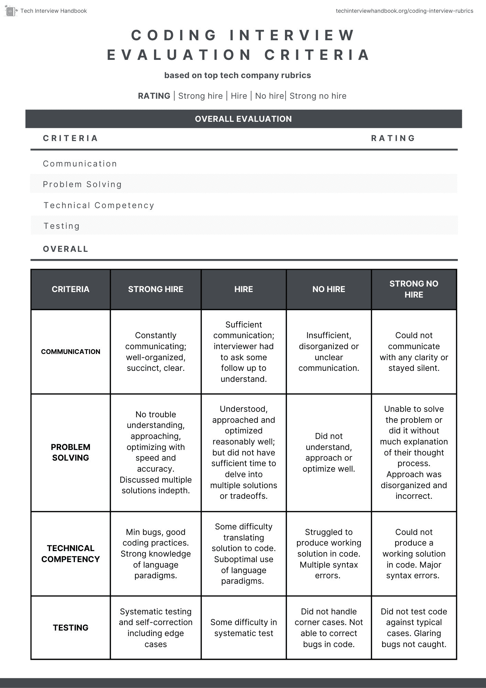

# 顶尖科技公司如何在编码面试中评估候选人

> 原文：<https://www.techinterviewhandbook.org/coding-interview-rubrics/>

<header>

想知道像谷歌、亚马逊、苹果和网飞这样的顶级科技公司是如何评估编码面试的吗？

在顶级科技公司中，编码面试评估标准实际上并没有很大的不同。虽然标题中使用的确切术语可能不同，但评估的维度大致相似。

在本指南中，我将详细介绍大型科技公司的通用编码面试评估流程。我还附上了一个[示例标题](/coding-interview-rubrics/)，你可以在自己练习或与同伴练习时使用。

如果你还没有这样做，请参考我的[编码面试最佳实践备忘单](/coding-interview-cheatsheet/)，它基本上综合了候选人应该做些什么来满足编码面试中的评估标准。

## 候选人评分方法

一般来说，在 FAANG / MANGA 公司中，编码面试评估标准可以大致分为 4 个维度:

1.  交流——候选人在编码的时候有没有做出澄清，交流他们的方法和解释？
2.  解决问题——候选人是否表明他们理解问题，并能够提出一个合理的方法，进行权衡分析并优化他们的方法？
3.  技术能力-实施的速度和准确性如何？有语法错误吗？
4.  测试——代码是否针对常见情况和极端情况进行了测试？他们有没有自我修正 bug？

在编码面试中有两种候选人评分的一般方法:

1.  为每个维度提供一个分数(如 1-4 分),并将它们相加得到一个总分
2.  根据各方面的总体表现给出总分(如 1-4 分)

无论使用何种方法，评分等级通常为:

*   强势雇佣
*   雇用
*   不雇佣
*   强烈不雇佣

当面试官觉得候选人需要更多的评估时，一些公司可能会犹豫不决。

## 你的分数如何影响结果？

无论采用何种评分方法，最终得分都是基于评估标准的整体表现(而不是纯粹通过某个数学截止值)。

对于每一轮电话筛选，通常只有一个面试官，因此，如果他们不给你相当于“优先录用”或以上的“通过”，你就不会进行整个面试循环。如果这一轮没有获得明确的信号，您可能会被要求进行后续的电话筛查。

大多数顶级科技公司都允许应聘者在做出最终决定之前，在整个面试过程中经历每一轮面试。如果候选人在不同轮次中收到不同的结果(有些“通过”，有些“失败”)，面试官将根据你展示的信号召集讨论。这就是为什么你在整个面试过程中的表现很重要。

在某些情况下，如后续电话筛选轮次，候选人可能会被邀请参加额外的评估轮次，如果:

*   评估中遗漏了一些方面，例如，两轮编码面试者给出了非常相似的问题
*   候选人在特定区域显示混合信号，需要额外的回合以获得更可靠的信号

一般来说，所有面试官都可以看到你每一轮的分数和反馈。有时，面试官甚至可以看到你过去在同一家公司面试的反馈，以避免再次问同样的问题。公司希望看到你比过去有所成长。所以，如果你过去被一家公司拒绝了，反思一下可能的原因，并在你再次面试这家公司时解决这些问题。

## 每个评估标准的详细说明

### 1.通信

基本通信信号:

*   询问适当的澄清问题
*   传达方法、原理和权衡
*   不断沟通，即使是在编码的时候
*   组织良好、简洁、清晰的沟通

| 得分 | 综合评价 |
| --- | --- |
| 强势雇佣 | 在整个面试过程中，就思维过程而言，沟通是彻底的、组织良好的、简洁的和清晰的——包括他们如何理解问题、他们的方法、取舍。面试官在跟踪和理解求职者的思维过程方面没有任何挑战。 |
| 倾斜雇佣 | 在整个面试过程中，沟通是充分的、清晰的、有条理的。然而，面试官不得不问一些后续问题来了解应聘者的某些方面，比如他们的方法或思维过程。 |
| 倾向于不雇佣 | 在整个面试过程中，沟通不畅(以下一项或多项):(1)不充分(例如，没有解释就开始编码)，(2)组织混乱或不清楚
面试官很难跟上应聘者的思维过程。 |
| 强烈不雇佣 | 无法清晰地交流，甚至在被面试官询问时也保持沉默。面试官很难理解应聘者的思维过程。 |

### 2.解题

基本问题解决信号:

*   通过提出好的澄清性问题，迅速理解问题
*   系统而有逻辑地研究这个问题
*   能够提出一个优化的解决方案
*   精确确定时间和空间复杂度
*   不需要面试官的任何重要暗示

高级问题解决信号:

*   想出了多种解决方案
*   清楚而正确地解释了每种解决方案的利弊，总结出哪种解决方案最适合当前场景
*   有时间讨论后续问题/延期

| 得分 | 综合评价 |
| --- | --- |
| 强势雇佣 | 完成所有基本的问题解决信号没有问题，并且有足够的时间完成最高级的问题解决信号。 |
| 倾斜雇佣 | 设法获得所有基本问题解决信号，但没有足够的时间获得高级问题解决信号。 |
| 倾向于不雇佣 | 只显示了一些基本的解决问题的信号，未能实现其余的。 |
| 强烈不雇佣 | 无法解决问题，或者在没有对他们的思维过程进行解释的情况下解决了问题。方法混乱且不正确。 |

### 3.技术能力

基本技术能力信号:

*   将讨论的解决方案转化为工作代码，并尽量减少或消除错误
*   干净直接的实现，没有语法错误和不必要的代码，良好的编码实践，例如 DRY(不要重复自己)，使用适当的抽象
*   整洁的编码风格(适当的缩进、间距、变量命名等)

高级技术能力信号:

*   比较几种编码方法
*   展示了对语言结构和范例的丰富知识

| 得分 | 综合评价 |
| --- | --- |
| 强势雇佣 | 轻松展示基本和高级能力信号。 |
| 倾斜雇佣 | 仅展示了基本的技术能力信号，在将方法转化为代码方面存在一些困难。语言范式的次优用法。 |
| 倾向于不雇佣 | 努力用代码写出一个可行的解决方案。多种语法错误和语言范例的错误使用。 |
| 强烈不雇佣 | 无法用代码产生一个可行的解决方案。主要的语法错误和非常糟糕的语言范例的使用。 |

### 4.测试

测试信号

*   想出了更多的典型案例，并针对这些案例测试了他们的代码
*   发现并处理角落案例
*   识别并自我纠正代码中的错误
*   能够以系统的方式验证代码的正确性(例如，像调试器一样运行并单步执行每一行，在每一步更新程序的状态)

| 得分 | 综合评价 |
| --- | --- |
| 强势雇佣 | 轻松演示测试信号。 |
| 倾斜雇佣 | 在演示测试信号时遇到一些困难，比如不能识别所有相关的极限情况。 |
| 倾向于不雇佣 | 进行测试，但不处理边角案例。无法识别或纠正代码中的错误。 |
| 强烈不雇佣 | 甚至没有针对典型情况测试代码。没有发现代码中明显的错误，并宣布他们已经完成 |

<figure>

<figcaption>Sample coding interview evaluation rubric, for practice</figcaption>

</figure>

</header>