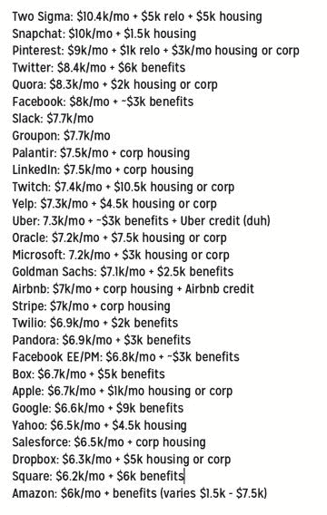

# 风景

> 原文：<https://www.techinterviewhandbook.org/landscape/>

这里涵盖的大部分内容都是针对湾区的。因地理位置而产生的景观差异在下面的[中简单提及。](#geographical-location)

## 软件工程师的职业前景

### 高需求

几乎每个领域都利用技术，因此几乎每个行业都需要软件工程师。对工程师的需求高于供给，导致一般高薪工作。此外，需求还在持续增长。

### 稳定的职业

计算机科学正在迅速普及，工程是一个备受推崇的职业。与创意行业不同，你不必成为行业中的前 1%才能过上舒适的生活。一名刚从大学毕业、在硅谷公司(大公司和初创公司)工作的工程师，起薪有望超过 10 万美元，而且还会越来越好。

### 需要终身学习

科技行业是一个发展极其迅速的行业。今天使用的许多技术在十年前甚至还不存在/不流行；2009 年，移动应用开发和区块链几乎是闻所未闻的。工程师需要不断提升自己的技能，以适应就业市场的需求。对于热爱学习的人来说，工程是一个伟大的职业。

### 灵活

就时间、地点和环境而言，软件工程工作可能是最灵活的工作。物理位置通常不是问题，许多科技公司都位于偏远地区。没有正式服装可穿，工作时间通常很灵活。如果你穿着衬衫打着领带去上班，你的同事会奇怪地盯着你。

## 实习 vs 全职

如果你梦想有一天在一家顶级科技公司工作，通过实习生转正获得聘用是实现这一梦想最简单的方式。实习面试非常短(通常只有两轮，而全职职位的面试通常是 4-5 轮)。实习可以让你在一家公司工作很短的时间(3 个月左右)，并有助于获得对公司和工程文化的第一手了解。公司也倾向于给高表现的实习生更高回报的工作机会，因为他们已经证明在工作中是有效的，并且可以和现有的员工一起工作；因此雇佣他们被认为是相对低风险的。

顶级科技公司甚至会为初级候选人支付高得离谱的费用:

### 美国

2016 年美国顶尖科技实习生的薪水([来源](https://twitter.com/rodneyfolz/status/724787290824798209)

### 新加坡

我们进行了一项调查，以了解新加坡著名的科技公司在 2022 年为新员工支付的薪酬，以下是调查结果的样本。查看[完整数据集](https://docs.google.com/spreadsheets/d/1QtC8efWw0mVkGXW4QA9bX4f0nJhGbmFqCfVLSumMZ0I/)或[贡献您的数据](https://forms.gle/9oNNJJwespqWBZGw6)！

| 公司 | 实习(每月在新加坡发展局) | 应届毕业生年度总数(新加坡元) |
| --- | --- | --- |
| 种类 | $6000 | $150,000 |
| Meta/Facebook | $6000 | $140,000 |
| 谷歌 | $5400 | $110,000 |
| Shopee | $4200 | $100,000 - $140,000 |
| 字节跳动 | $4000 | $85,000 |
| 夺取 | $2500 | 尚无数据 |
| 签证 | $2200 | $75,000 |

注意:应届毕业生的年度总数是近似值，包括基本工资、股票和目标奖金。

## 公司规模

公司根据所处的阶段有不同的关注点，要做的工作类型也可能大不相同。在尚未找到适合市场的产品的早期阶段，公司会快速迭代产品和功能，而已经找到合适产品的大公司会专注于扩展基础设施和增加用户。由于股权不值钱，初创公司的流动薪酬也较低，但如果/当公司首次公开募股或被收购时，有可能赚得更多。

| 尺寸 | 早期启动 | 后期启动 | 大型公司 |
| --- | --- | --- | --- |
| 公司规模 | <100 | 100-1000 | >1000 |
| 补偿 | 底薪比大公司高一点。更高的股本金额，但其价值很难判断，因为该公司的估值不清楚，股票还不值钱。高风险，高回报。 | 底薪比大公司高一点。公司估值更清晰，股票更有机会值钱。 | 取决于公司的声望。补偿通常是市场标准或更好。如果公司上市了，股票就值钱了。 |
| 工作类型 | 主要是产品开发。工程师必须身兼数职——前端、后端、开发、设计等。 | 产品开发和一些基础设施。 | 多样化的角色和专业化的工作；每个角色都有敬业的人。基础设施和生产基础设施工作更为常见。更多的内部调动机会，有时甚至是全球范围的调动。 |
| 职业阶梯 | 无结构。没有(或非常模糊的)职业水平。没有太多正式的指导和培训。 | 有点结构化。 | 非常有条理。定义明确的职业水平。 |
| 迭代速度 | 速度极快。努力寻找适合市场的产品。 | 适中。已经找到适合市场的产品，试图扩大用户群。 | 拥有广泛用户基础的稳定产品。逐步推出变更并进行大量试验。 |

需要注意的是，以上只是一般趋势，也有例外。

## 地理位置

|  | 美国(硅谷/纽约) | 新加坡 |
| --- | --- | --- |
| 起薪 | 10 万美元 | 每月 5243 美元(中位数)，6316 美元(第 75 百分位) |
| 人才准入 | 全球人才、多样化的国籍和背景 | 通常是地区性的，大部分是亚洲人 |
| 公司类型 | 大公司(脸书、亚马逊、苹果、谷歌、微软等)的总部，初创公司 | 大公司、初创公司的分支机构 |
| 工程工作的类型 | 取决于办公室/公司的规模 | 产品和基础设施(构建新的编程语言、框架和工具) |

*新加坡薪资数据来自[新加坡国立大学 GES 分校，2020 年](https://www.moe.gov.sg/-/media/files/post-secondary/ges-2020/web-publication-nus-ges-2020.pdf)。*

