# 方十字应试学习观（完整版）[本质论，认识论，方法论]

> 原文：[https://zhuanlan.zhihu.com/p/97019856](https://zhuanlan.zhihu.com/p/97019856)

7k+字学习观长文，**包爽**，甭管看没看完，都记得**点赞** ~（想要个高赞呀）

我相信很多小伙伴**了解了很多学习方法，看了很多答案，但依然有一种“迷茫”的感觉。**这是因为很多小伙伴**学习经验不足**，同时学习的方法都是**零散**的，难以形成一套完善的应用体系。这篇文章带你**从根本上了解应试学习的本质，建立起一套实用的学习观**。

原创文章，翻版必究。

我之前写过一篇应试学习观，由于货太干了，很多人反应看不懂。接下来这篇文章很宏观，很长，也很“湿”，**期望大家看完之后，对应试学习，乃至学习都有一个全新的认识。**之前的干货文章大家有兴趣可以简单看一看，本文会讲解这篇干货的来龙去脉。

[方十字学习观](https://www.zhihu.com/question/50343728/answer/911297120)

开始。

* * *

## 一.实践观（理论基础，大致看看就行，以后会详细扩充为应试实践观）

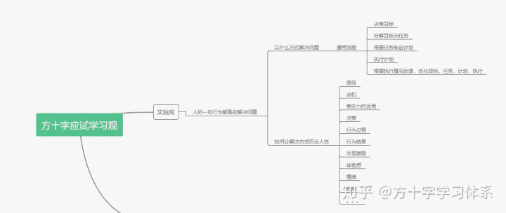

实践观导图

应试学习是一种学习。

学习是人的一种行为。

人的一切行为，都是将意识转化成物质的实践过程。这个过程可以称之为”解决问题“。

解决问题，是处理目标与现状的矛盾，目标不存在于现实世界，仅存在于意识世界。现状即现存的物质世界，处理即实践。应试学习也是解决问题，解决”拥有获得高分的能力“与”目前能力很差“之间的矛盾。

既然应试学习是在解决问题，那么以人为主体解决问题，不管是什么问题，皆有其共性。以人为主体解决问题，我们分析其共性的时候，有两个角度，一是客体角度，即客观上以什么样方式解决问题。二是主体角度，即实践方式如何符合人性。

从客体角度来说，人类经过长期的实践，有一套经典而通用的解决问题的基本流程，即：**决策目标，分解目标（制定任务），制定计划，执行计划，建立反馈（根据执行情况优化目标，任务，计划，执行方式）**。

那么如何合理的决策目标，制定任务，制定计划，执行计划，建立反馈？每一步我们都可以在知乎里找到很多文章，很多理论，我这里只是揭示它们的关系，先不细讲，未来我会筛选并分享较优的相关思路。

从主体角度来说，就是如何让执行主体持续产生动机将”解决问题“这个行为高效率的执行下去，并尽可能的通过反馈提升动机。其中涉及的问题包括如何建立信仰，如何建立动机，意志力该如何使用，如何让执行过程符合人性（时间管理，精力管理，建立正反馈，峰终定律等），如何建立良好的体验感，减少负反馈，如何调整情绪与身体状态等。

从主体角度来说，就是如何让执行主体持续产生动机将”解决问题“这个行为高效率的执行下去，并尽可能的通过反馈提升动机。其中涉及的问题包括如何建立信仰，如何建立动机，意志力，外部管理该如何使用，如何让执行过程符合人性（时间管理，精力管理，建立正反馈，峰终定律等），如何建立良好的体验感，减少负反馈，如何调整情绪与身体状态等。

关于主体角度，请详见该文章：

二.应试学习观（详细研读，必有收获）

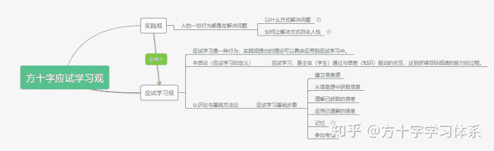

应试学习观基础框架图

应试学习是在解决问题，上述解决问题的共性同样适用于应试学习。除了共性，应试学习做为解决问题的子集，有其个性。

分析万事有三论，本质论，认识论，方法论。

从本质上来说，**应试学习，是主体（学生）通过与信息（知识）能动的交互，达到获得目标成绩的能力的过程。**

接下来让我们去认识这一过程。想看干货的，直接读这篇：[应试学习观](https://www.zhihu.com/question/50343728/answer/911297120)。如果你**回来了**，就继续往下读。

### 步骤1.建立信息源与获取信息

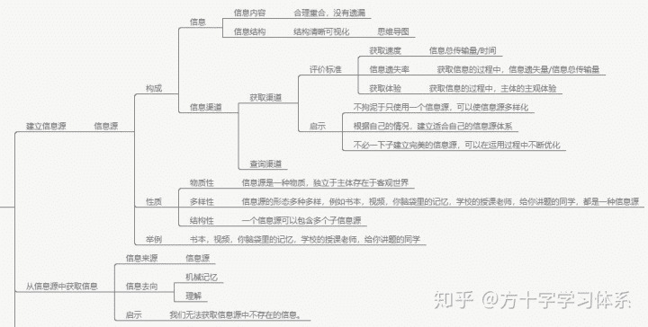

关于信息源的建立与信息获取的详细导图

如果我们现在是一个一无所知的小白，要准备一门考试，那么首先做什么？

**报班，买书，查知乎，找网课。。。**

**班，书，知乎，网课等等是什么呢**？我们为什么要这么做呢？因为我们现在**脑袋空空**，我们想要**迫切**获取相关信息。

但信息不是空穴来风，不能凭空变出来。所以我们要从各种信息的“源头”来获取信息，即**信息源**。

所以不管我们学什么考什么，一般的，我们第一步，都是**建立合适的信息源**。

信息源由信息与信息渠道构成。

信息是抽象的，信息源是具体的。

信息源是一种物质，独立于主体存在于客观世界，其形态多种多样，例如**书本，视频，你脑袋里的记忆，学校的授课老师，给你讲题的同学，都是一种信息源**（尤其需要理解自身记忆作为信息源的客观性）。一个信息源可以包含多个子信息源。

信息渠道即信息源与主体的连接途径。信息通过信息渠道从信息源流入主体。

信息渠道包括获取渠道与查询渠道。

获取渠道即主体获取信息的方式，查询渠道即主体查询信息的方式。

两个渠道既可以重合，又可以相异。

**举例说明:**

**以家教老师为信息源，不论是获取信息还是查询信息，都是通过家教老师的声音与书写内容来获取信息。**

**以教材为信息源，我们平时学习教材是逐页翻看，这里教材的文字与图片就是获取渠道:我们通过教材的图片与文字获取信息。当我们给教材一些重点页数贴了便签后，我们想要使用某个知识点，直接通过便签就翻到了对应页数，这里便签−教材便是查询渠道。**

评价一个信息源的优劣，可以从信息与信息渠道两个角度来评价。

从信息上来说，我们可以将信息分解为两个角度，即信息内容，与信息的逻辑结构。

从信息内容的角度来说，相对于应试，一个好的信息源，内容最好是”存在合理重合，没有遗漏“。

虽然MECE原则（不重合不遗漏）可以使信息源最简化，但会为后续应用增加难度，不符合实用性。

**举例说明，比如我们学数学，一般都是听课讲，看教材，做题练，课堂信息与教材信息必然存在重合，如果因为看了教材而不去上课，或光听课不看教材，必然都是荒谬的。**

但我们更需要重视的是”**没有遗漏**“。在实际操作中，我们初期建立的信息源内容大概率是有遗漏的，而有时这种遗漏是后续应用出现障碍的根本原因。**很多学生甚至老师没有分析出这一原因，而简单的将后续的应用障碍归结为”智商问题"，显然是不合理的。**

举例说明，还是学数学，**老师上课讲了公式，学生很认真的听了课，但做作业的时候题不会做。**这里就存在了信息的缺失。缺失点在哪里呢？学生没有获取“**固定题型的解题套路**”这个信息。好比**老师给了你零件和工具箱，让你去制造一个机器，但却没给你说明书**。那么“解题套路”这个信息可能存在于网课，家教老师教辅，习题答案，课外补习班，学霸等信息源当中，你没有将它们纳入你的信息源，这个信息就被遗漏了。

所以在建立信息源的过程中，“没有遗漏”是最值得重视的。**当然，不必强求一口气建立一个没有遗漏的信息源，我们可以初步建立一个信息源，在实践的过程中不断地补充，完善，优化。**

从信息的逻辑结构的角度来说，一个好的信息源，必然是结构清晰，最好可视。

目前来说，最好的展现信息结构的工具，就是思维导图。

**过去的思维导图只能绘制在纸面上，绘制效率低，内容少，难以容纳巨大结构。**如今可以使用**思维导图软件**来绘制导图，有效克服了纸质导图的缺陷，并伴随着很多新的优势。关于思维导图和相关理论，可以阅读我这篇文章：

[思维导图真的有效吗？](https://www.zhihu.com/question/20273625/answer/581746943)

从信息渠道的角度来说，对信息源的评价标准有两个：易于获取信息，易于查询信息。

查询信息后续讲到应用的时候会说明，这里先讲易于获取。

什么叫易于获取信息？对于主体，有三个角度：获取速度，获取体验，信息遗失率。获取速度越快，体验越好，遗失率越低，越易于获取。

主体从信息源获取信息，必然通过获取渠道来获取。同样的信息，获取渠道可以不同。

举例说明，同样是**《斗破苍穹》**，有的人读文字，有的人听书，有的人看漫画，有的人看改编的动漫。这里的“文字，听，图画，动画”便是获取渠道。

三十年河东，三十年河西，莫欺少年穷!

主体不同，适用的获取渠道不同，渠道的适用性具有主体个性。

举例说明，同样是数学，有的人自学教材效率高，有的人可以很好的在学校听讲，有的人在学校听不进去，回去看网课却没有障碍，有的人可以通过与家教的互动很好的学数学，**有的人甚至不愿意听老师讲，女朋友讲一遍就乖乖的听了**。。。

这里为什么要强调建立易于获取的信息源呢？因为**很多学生的思路没有打开，将信息源与获取渠道限制在有限的种类当中，比如上课必须认真听课，必须好好研究教材，课下必须认真完成老师的作业等等。**在现实中，由于老师的讲课进度大致符合班级的平均水平，那么后半部分学生就会“**跟不上**”，前半部分学生“**吃不饱**”。如果把“上课认真听讲”当作一个权威真理与唯一的信息源的话，由于多种原因（**比如没认真听讲，没跟上，困了**），很多学生在获取的过程中就会出现信息的遗失。

如果我们能认识到这一点，便可以使用更适用于自己的信息源补充，取代原信息源。

比如我们使用**网课**做为信息源来获取所需信息。网课可以暂停，倒退，倍速播放，截图，可以**有效弥补线下课堂跟不上，专注时间较短等缺陷，并且可以选择更优秀的信息内容**。遇见不会的题，我们可以用线上家教答疑来取代问学校老师，可以有效避免“**由于老师生气而不敢去问**”的缺点。但网课没时间上，存在缺乏现场氛围，需要主动学习，需要较强自控力，在线家教存在反馈速度较慢等问题。对于主体，不同的信息源必然优劣共存，**需要多加尝试，组合，扬长避短。建立适合自己的信息源。**

总的来说，我们要理论结合实际，灵活的建立有合理的重合，但尽可能不遗漏，结构清晰可视，易于查询，易于获取（获取速度快，体验感好，遗失率低）的信息源，并不断的在学习过程当中对信息源体系的子信息源构成，信息内容，信息结构，获取渠道等加以优化。

同时，**不要陷入完美主义，初期的信息源大致符合要求即可，可以不用那么完美，关键在于在应用信息源的过程中不断对其加以优化，使之日趋实用。**

当我们有了一个较为合理的信息源体系之后，我们通过信息渠道来获取信息。被我们获取的信息有两个去处：1.输入海马体，直接被机械记忆。2.输入大脑，被我们尝试理解。**一般来说，一个合理的学习过程，是以“获取，理解，应用，记忆”四步走为主，以机械记忆为补充的过程。**

### 步骤2.理解信息

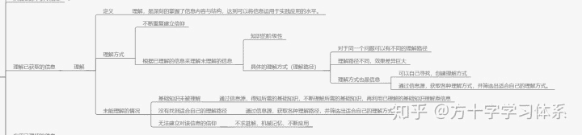

关于理解信息的详细导图

**理解，是深刻的掌握了信息内容与结构，达到可以将信息运用于实践应用的水平**。

总的来说，理解的方式主要有两种，一是不断重复建立信仰，二是根据已理解的信息来理解未理解的信息。

少数基础信息必需通过方式一来理解，比如自然公理，生活经验等。对于应试学习所涉及的绝大多数信息，我们需要方式二来理解。

在现实中，应试学习涉及的信息存在“**阶级**”。我们需要不断通过低阶信息来理解高阶信息。有时候理解一个高阶信息的必要条件是对多个低阶信息的理解，缺一不可。低阶信息一般被我们称为“基础知识”。但具体的理解信息的方式（路径）通常不是唯一的，所需的低阶信息也可以是应试信息之外的，**比如我们既可以用“奔跑的小球”来理解电流，也可以拿“水流”来理解电流。**

理解路径不同，对于主体来说，理解难度和体验感截然不同。比如用**定义法理解微积分，与用图示法理解微积分，难度和体验感差异巨大，不论难度还是体验感，图示法都远优于定义法。**

对应的，如果我们无法理解信息，存在3种情况：

1.理解该信息所必须的低阶信息（基础知识）未被理解。

2.没有找到适合自己的理解路径。

3.无法建立对该信息的信仰。

对于情况1，应对方案为从信息源获取理解该信息需要哪些低阶信息，并对尚未理解的低阶信息加以理解。如果某低阶信息仍然因为情况1无法理解，就回到开头，进一步理解更低阶信息，直到所有必须的低阶信息被理解。

用人话举例，比如你没办法理解贝叶斯公式（高阶信息），你问问老师（信息源）理解这个贝叶斯公式需要理解什么，老师告诉你需要理解全概率公式（低阶信息），接下来你发现全概率公式你也理解不了(低阶信息依然无法被理解），老师告诉你需要理解条件概率，与概率的乘法公式，最后你发现**你连概率的定义都不是很理解**。当你理解了概率的定义后，再逐步理解各阶信息，最后将贝叶斯公式理解。

我在这里做一个猜想性的定义，各位可以加以思考：在应试学习中，学习已被理解的信息为舒适区，学习比已被理解的信息高一个阶级的信息为学习区，学习高于一个阶级的信息，为恐慌区。

对于情况2，可以自己寻找理解路径，也可以通过信息源，获取各种理解路径，并筛选出适合自己的理解方式。**理解路径也是一种信息**。

情况3较少，一般存在于初次接触某学科的学习过程中。客观来说，情况3的出现有三种可能性，一是公理性知识，二是某学科的基础概念构成与来源过于复杂，比如极限的ε-δ定义（数学系轻喷，对于小白来说确实难理解）。三是公理性的知识，或未解之谜，比如观测行为为什么会改变电子双缝干涉实验的结果。感兴趣的可以看看这个：

不论是什么原因，如果是情况3，我们可以直接把相关信息机械记忆，并在应试领域中不断应用即可，不必完全理解。**比如你永远也无法完全理解“三角形的内角和等于180度”，你只是记住了它并且做题会用。**

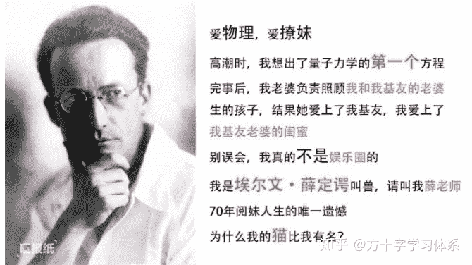

真正的智慧之巅

在现实中，一般三种情况会混合出现。一般来说，通过建立合理的信息源并从中获取完整的信息可以同时处理这三种情况，一个内容完整的信息源，必然包含了“如何理解”这一信息。

可以被获取的信息才可以被理解。信息源中不存在的信息不可被获取，自然不可被理解。再次强调优化信息源的必要性。被理解的信息，才可以被应用。

### 步骤3.应用信息

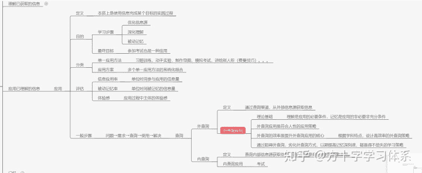

**应用，本质上是使用信息完成某个目标的实践过程。应用既是学习步骤，又是最终目标。**

做为学习步骤，其目标是通过应用优化信息源，加深对信息的理解，最重要的是达成对信息的被动记忆。

做为最终目标，我们整个应试学习过程，都是为了达到可以仅通过记忆完成考题的能力。

具体的单一应用方法有很多，比如习题训练，动手实验，制作导图，模拟考试，讲给别人听（**费曼技巧**）等等。

一个应用方案可以组合多种单一的应用方法，比如**为了掌握某章数学内容，你做了相关习题，然后把这章的知识点与习题讲给别人听，最后针对这章做了一篇高考模拟题。**

对于不同的应用方案，评估方式为信息应用率，被动记忆率，体验感。

信息应用率，即单位时间可以应用多少信息。

被动记忆率，即单位时间可以被动记忆多少信息。

体验感，即在应用过程中的主观体验感。

信息应用率越高，被动记忆率越高，体验感越好，应用方案越优秀。**一般来说，多方法，系统化构成的应用方案优于单一应用方法构成的应用方案。**

不论是什么样的应用，一般的，应用都由如下步骤构成：**问题→需求→查询→使用→解决**。

其中，查询分为内查询与外查询。

外查询，即通过查询渠道，从外部信息源获取信息，在应试领域中，**包括查教材，问老师，查字典等。**

内查询，即查询内部信息源获取信息，即从主体记忆中获取信息，**说白了就是把记住的东西拿来用。**

理解是应用的必要条件，记忆是应用的非必要非充分条件，理解这句话非常重要。这句话说白了，**一个信息，只要你能理解了，即使你暂时没记住，你也可以用于实践当中。而如果一个知识，你只是简单的记住了，机械记忆，但没有理解，那也无法应用于实践当中**。

为什么要强调这句话呢？因为在实际的学习当中，存在着大量的“必须先记住，再应用”的低效率学习过程。**比如有的英语老师告诉你，只有把几千词背下来，才能去做阅读训练，结果到最后你单词都没背完，还很痛苦。比如有的数学老师告诉你，必须把这些公式死记硬背下来，才能去做题，结果花了大量时间背公式，做题少，公式还没背扎实。**

而实际上，你不背单词也可以做阅读，不背公式（但必须理解公式）也可以做数学，只不过你需要查字典，翻教材查公式。

上述过程，一般的，称之为通过外查询应用。通过外查询应用是一种广泛而重要的应用方式。一般的，被理解的信息难以被直接记忆（**比如你理解了一个数学公式，知道怎么用，但就是记不住**），应用这样的信息必须借助外查询。通过不断的外查询应用，被应用的信息将会逐渐被记忆，转化为通过内查询应用。内查询应用，即把被记忆的信息从大脑内部的信息源（海马体）提取出来应用。

外查询应用向内查询应用的转化过程，是“**被动记忆**”的核心过程。

举例说明，一个**复杂**的数学公式，你直接记忆较为**困难**，但你把它**摆在眼前**，然后以合理的频率做用到这个公式的习题，**想不起来了就抬眼看一下**，然后给别人**讲解**这个公式的来龙去脉，最后你就会“**惊奇**”的发现这个公式已经“**自然而然**地”被记住。**英语单词**也是同理。

实际上，我们的**母语学习**便是外查询应用过程。好奇的你想知道那个让你开心的东西是什么，但你不知道（问题与需求），于是你求助于你的妈妈（信息源），你大眼睛望向你妈妈，闪了闪，指了指那个让你开心的东西，啊啊啊的叫，你妈妈告诉你那个叫“玩具”（查询过程），你便知道了那个是玩具。当然这样的过程发生了好几次（多次应用），直到有一天你说出来：“玩具”，再经过多次主动应用，“玩具”这个概念便深深的刻在了你的小脑瓜里。以后你想用到“玩具”这个概念，便直接从记忆中提取。通过外查询应用的学习过程，是**符合人性**的学习过程。

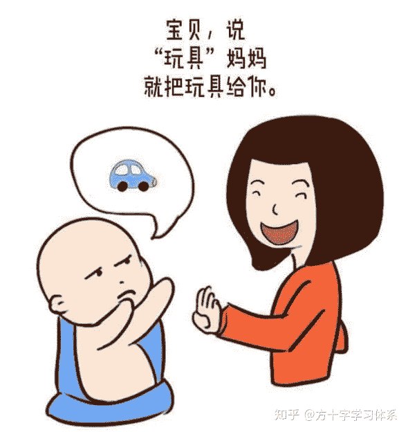

小孩子学说话

外查询应用的核心，在于外查询的效率。优化查询方法，提升查询效率，是提升外查询应用效果的核心。若查询效率不高，则学习效率未必优于“先机械记忆，后应用”。这就要求我们建立易于查询的信息源。

实际上，这也是低效的传统英语学习方法存在的道理。

因为过去查询英语生词只能通过纸质英语字典，**查询一个生词大概需要1到2分钟**，查询效率过低，导致“通过读文章记单词”的效率不如“先背单词，后读文章”。

而如今，采用手机词典查询一个单词大概需要**20秒**，如果将英语文章录入电脑，用wps的划词翻译查询，或者采用专门的手机APP阅读文章，通过点击的方式查词，查询时间**仅有1到2秒**。这就使“通过外查询应用达成被动记忆”这一**兼顾效率与体验感**的学习方式成为了更好的选择。

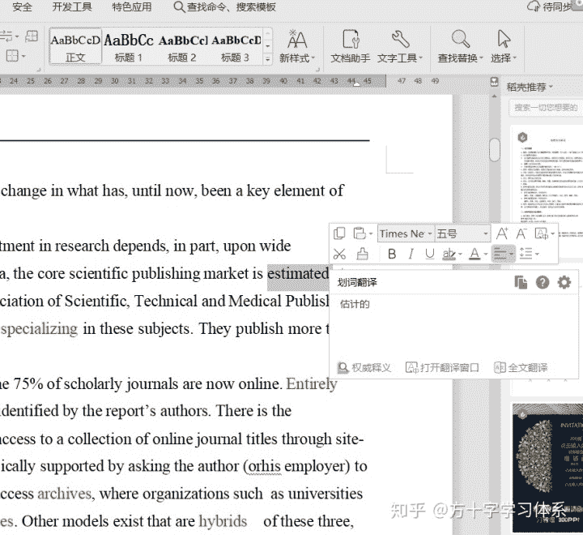

wps的双击译词

在这样的背景下，**有的老师没有脱离传统的学习思维，鼓励学生“不用电子词典，而是用纸质词典”查单词**，以追求单次查单词的记忆深刻度，便是得不偿失了。

**一般来说，在应试学习领域，通过阻碍外查询，劣化外查询方式，以期提高记忆深刻度，都是得不偿失的学习策略**，最典型的，除了上述的英语学习之外，还有**数学老师让学生碰到不会的题，不要翻答案/不给答案，让学生憋着，有的甚至鼓励憋一礼拜，最后自己找到答案。**虽然这道题印象深刻了，但也因此**耽误**了大量的学习其他习题，甚至其他科目的时间。虽然被动记忆率提升，但弥补不了信息应用率与**体验感**的低下，最终导致总效率的低下。

古人虽然说“**不愤不启，不悱不发**”，但这是为了深刻的体悟人生道理。考试只考你记没记住，不管你深不深刻，所以**该启启，该发发，又愤又悱，那就废了**。应试学习是个系统工程，要目标导向，追求总体效率。

所以说，优化查询方法，提升查询效率，是提升外查询应用效果的核心。

如何提升外查询效率？可以从两个角度提升:

一是回到信息源，优化信息源，提高信息源的易查询性，比如**原来用教材查公式，现在我用思维导图查公式**（详见此文:[思维导图真的有效吗？](https://www.zhihu.com/question/20273625/answer/581746943)）。

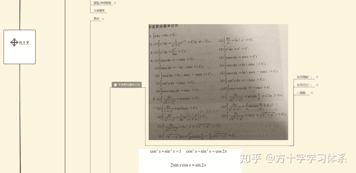

利用导图查询公式定理

二是优化查询渠道，比如上文英语查单词方式的进化。

一般来说，针对同一信息，应用方式越多，熟练度越高，频率越高，理解越深刻，记忆率越高。

### 步骤4.记忆信息

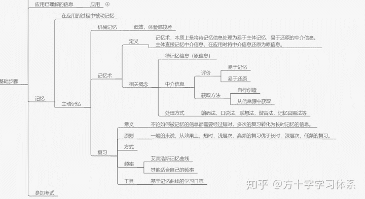

通过应用达到对被应用的信息的记忆，称为”被动记忆“。

不论如何，信息最终流入了你的海马体并被长期存储，你就“记忆了”信息。记忆是应试学习的终点。记忆除了被动记忆，还有主动记忆。主动记忆包括机械记忆，记忆术，主动复习。

一般的，被动记忆效果与体验感优于主动记忆。在合理的学习体系中，应以被动记忆为主要记忆方式，主动记忆作为补充。

机械记忆就是将从信息源获取的信息不加任何处理的直接记忆，是一种**低效的，体验感较差**的记忆方式。一般的表现形式为通过不断重复，复述信息的方式记忆。

记忆术，本质上是将待记忆信息处理为易于主体记忆，易于还原的中介信息。主体直接记忆中介信息，在应用时将中介信息还原为原信息。

举例说明：比如如下待记忆信息：

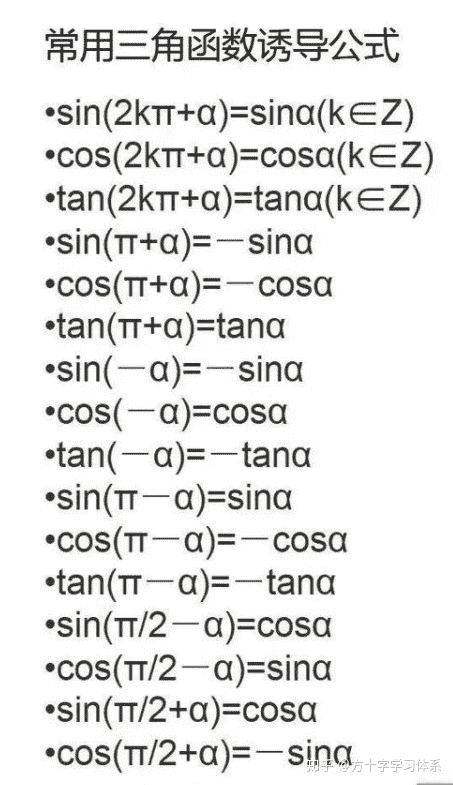

如果直接记忆，将会非常困难。如果我们总结规律，记忆口诀：**奇变偶不变,符号看象限**，那么不仅口诀很好记忆，而且我们也可以很好的将口诀还原成上述所有公式。这里诱导公式便是待记忆信息，口诀便是中介信息。这个口诀很容易便可以记住（易于主体记忆），也很容易还原成原公式（易于还原）。

将原信息处理为中介信息的方式很多，包括但不限于编码法，口诀法，联想法，谐音法，记忆宫殿法。具体的记忆术相关的知识不是本文重点，有很多知乎文章有详细介绍，感兴趣的各位可以去学习了解。

中介信息亦为信息，可以直接创造并将其纳入信息源，也可以从信息源获取所需的中介信息。一个好的应试用信息源，其内容最好包含“如何记忆”。

举例说明，你在知乎搜索“怎么记忆XXX”，然后筛选出了一个自己没想到，但适合自己的联想法。之后你又偶然创造出一个更适合自己的口诀来记忆XXX，你便可以把这个方法记录在自己的学习笔记上，分享到知乎里，甚至讲给自己的老师听。。。

不论机械记忆，通过应用的被动记忆，还是通过记忆术记忆，被短时记忆的信息都需要经过短时，多次的复习转化为长时记忆的信息。

一般的来说，从效果上，短时，浅层次，高频的复习优于长时，深层次，低频的复习。

复习不是首次学习的简单重复，可以采取不同的方式，不同的角度对同一信息进行复习。

比如第一次是做题，第二次复习可以把题讲给别人听，第三次复习可以尝试编制记忆方法，以此类推。但**不必要教条的追求每次复习不同的学习方式，一切以学习效率为导向**。

最经典的复习频率，是**艾宾浩斯记忆曲线**。该曲线是针对机械记忆的平均曲线，相对于有意义的学习与记忆，以该曲线为指导的复习频率高于实际需求，但效果仍然是较好的。在没有探索出更适合自己的复习频率之前，可以采取该频率复习。

面向采取艾宾浩斯曲线进行复习的同学，我这里有一个很好的工具，是一种**基于记忆曲线的学习日志**（**专利号201910263892.7，盗版必究**），操作便捷度，用途，适用范围**显著优于传统的表格法**。有兴趣的同学可以加入Q方十字学习方法交流群：933781493，在群文件中下载电子版，自行打印装订。只允许自用，不得用于其它商业用途。详细使用方法请移步：[学习日志说明书](https://www.zhihu.com/question/30178891/answer/908483868)。

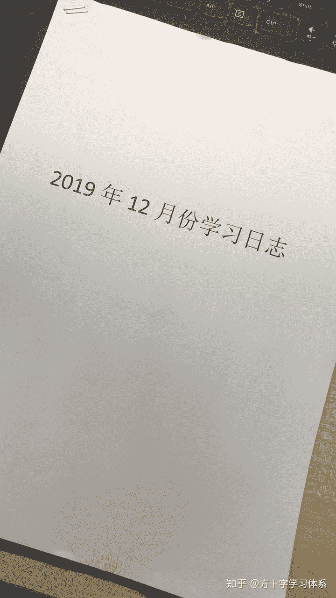

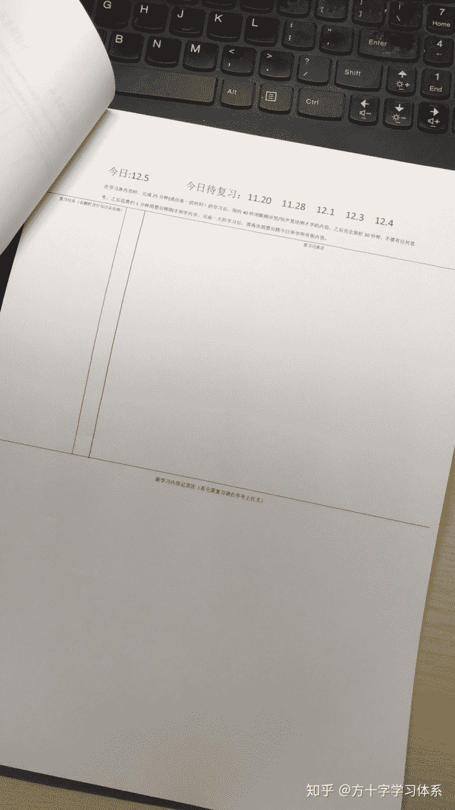

### 步骤5.参加考试（终点）

在考试当天，能够根据考题需求，采取合理的临场应试策略与心态，完成内查询应用，即为应试成功。

* * *

写到这里，基本就是一个较朴素，实用，完善的应试学习观。

读懂此文，**最起码可以在应试学习的过程中大致知道我在做什么，我该做什么。**虽然本文没有给出很多具体的学习方法，但各位在了解学习方法的过程当中，可以较为清晰的了解具体方法在自己的学习体系的位置，背后的原理，**不至于东一榔头西一棒子**。

如果想要成为大学霸，还要继续深入学习，基于基础原理，在实践中积累经验教训。

本文的理论是**开放**的，希望大家**辨证，灵活运用**。在建立自己的学习体系的过程当中，也**不要一开始就追求完美，要允许不完美的因素出现，并在不断的实践过程中不断优化，成长，最终建立起属于自己的，实用的应试学习体系。**

再次强调，这篇是湿货。想看干货的，移步：[方十字学习观](https://www.zhihu.com/question/50343728/answer/911297120)。

以上。

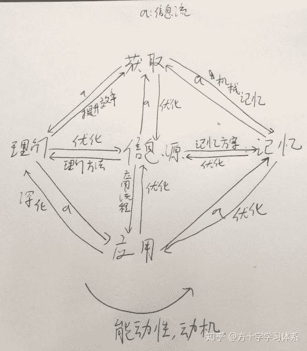

LOGO的来历

* * *

文中导图：[https://www.processon.com/view/link/5de64c1be4b0df12b4b3592e](https://link.zhihu.com/?target=https%3A//www.processon.com/view/link/5de64c1be4b0df12b4b3592e)

欢迎阅读并点赞其他文章（这篇也别忘了点赞）：

关于学习日志法与如何应用记忆曲线进行复习：

[有哪些让人欲罢不能的学习方法？](https://www.zhihu.com/question/30178891/answer/908483868)

关于思维导图：

[思维导图真的有效吗？](https://www.zhihu.com/question/20273625/answer/581746943)

关于数学应试（强推5级习题训练法）：

[新高一对学数学感到难怎么办？](https://www.zhihu.com/question/298472587/answer/579427158)

关于信仰：

[如果亚伯拉罕诸教中的上帝实际存在，无神论者怎么办？](https://www.zhihu.com/question/264330904/answer/568098084)