# 思维导图的本质与全内容思维导图[认识论，方法论]

> 原文：[https://zhuanlan.zhihu.com/p/97023871](https://zhuanlan.zhihu.com/p/97023871)

原创内容，翻版必究。

## **1.传统思维导图的本质**

传统思维导图的本质是：

*信息结构的可视化。*

### ***1.1信息的二维性***

**信息是客体。**

任何信息，都包含着信息的**内容**和信息的逻辑**结构。**

信息是二维的。可以从两个角度来理解：

*（1）信息分为信息的内容和信息的逻辑结构。*

*（2）描述信息的逻辑结构多采用二维结构（三维结构可读性较差）。*

### ***1.2自然语言是信息的载体之一***

我们阅读，听讲，思考，讲授，等等行为，都是与信息进行交互。

我们的大脑通过**自然语言**与信息进行交互。

举例说明，当我们思考：“什么是思维导图”。我们一定在使用自然语言进行思考。

自然语言是信息的载体之一。

### ***1.3自然语言的缺陷***

信息是二维的。自然语言是一维的。自然语言可以完美的呈现信息的所有内容。但无法直观的呈现信息的结构。在自然语言中，信息的结构“隐藏”于信息的内容。

当我们通过自然语言与信息交互时，大脑对自然语言做如下处理：

*（1）理解或回忆包含信息的语词的内涵和外延。*

*（2）提取，整理信息的结构。*

同时，因为：

*（1）不通过任何工具，大脑只能处理被记忆的信息。*

*（2）对于多数人，短期记忆能力有限。*

所以：**对于多数人，人脑难以在短时间内处理信息量过大，逻辑结构较复杂的自然语言。遗忘导致了信息结构的丢失。**

### ***1.4思维导图是信息结构的可视化***

记录+查询有效对抗遗忘。

记录是一种可视化。

自然语言有效的可视化信息的内容，思维导图有效的可视化信息的结构。

思维导图，可以将隐藏在自然语言内部的信息结构分离出来，用图形化的方式让人直观了解。

**传统的思维导图就是可视化的信息结构。**

通过思维导图，人们可以有效的处理难提取，易遗忘的信息结构。当我们应用思维导图的时，会觉得混乱的内容突然变得清晰，一目了然。是因为思维导图将信息的结构补充完整，从而更充分地还原信息本身。

## **2.全内容思维导图**。

***2.1传统思维导图的缺陷及原因***

自然语言长于展现信息的内容，短于展现信息的结构。传统思维导图长于展示信息结构，短于展示信息的内容。

由于载体（纸张）限制，传统思维导图无法容纳大量信息内容。

实体纸张，其最大的局限性在于，**它无法通过展开-折叠的方式，压缩信息，信息存储量过小。**

***2.2思维导图软件改变了思维导图的建构规则***

如今我们可以**通过软件制作思维导图**。

思维导图软件，实际上已经深刻的改变了思维导图的建构规则：

*（1）通过展开与折叠，我们可以实现信息的完全压缩与释放，可以在直观的获取信息结构同时通过展开来获取信息内容。*

*（2）由于软件存在几乎无限的二维空间，足以容纳全部的信息内容。*

*（3）不限于自然语言，我们可以插入图片，视频。特殊的，通过插入网络链接，思维导图可以形成更开放的信息体系。*

<figure data-size="normal">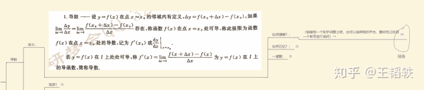</figure>

***2.3人们对思维导图的理解现状***

对于绝大多数人来说，思维导图是一个*黑箱*，人们会觉得思维导图有用，却不知道为什么有用，从而导致了人们对思维导图产生了很多“仪式化”的规矩。

上文已经提到了，思维导图实际上就是可视化的信息结构。将信息结构可视化，是思维导图的核心和魔力的来源。反过来说，只要将信息的结构表现清晰，就是好的导图，而不必拘泥于传统思维导图的“仪式”。

在“仪式化”的影响下，当电脑思维导图出现之后，人们在使用电脑制作思维导图的时，依然采用纸质思维导图的仪式和规矩，割裂了信息的内容与结构。

***2.4全内容思维导图的定义***

**全内容思维导图，就是将信息的结构与全部内容，整合在一张思维导图里。**

以前通过纸张制作思维导图难以实现全内容思维导图，但通过思维导图软件，我们完全可以实现全内容思维导图的制作。

自然语言是信息内容的可视化，传统思维导图是信息结构的可视化。

**全内容思维导图，是信息本身的可视化。**

***2.5.全内容思维导图与传统书籍的对比***

由于我的研究领域是应试教育学习方法，所以我从我研究的范围内为大家展示全内容思维导图的用处。大家也可以从中受到启发，**去思考全内容思维导图更多的用处**。

在应试领域内，全内容思维导图可以做什么？实际上，全内容思维导图可以重构教材和学习方式，将一维自然语言的传统纸质教材重构成MECE的二维全内容思维导图。以数学教材为例，这是对比：

传统教材：

<figure data-size="normal">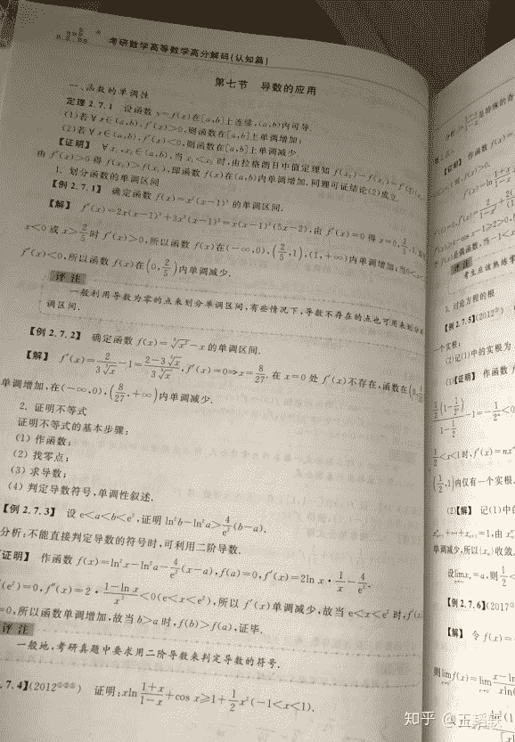</figure>

全内容思维导图：

<figure data-size="normal">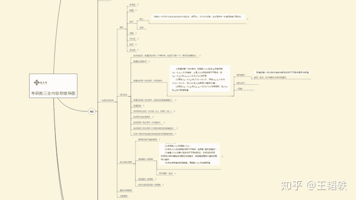</figure>

<figure data-size="normal">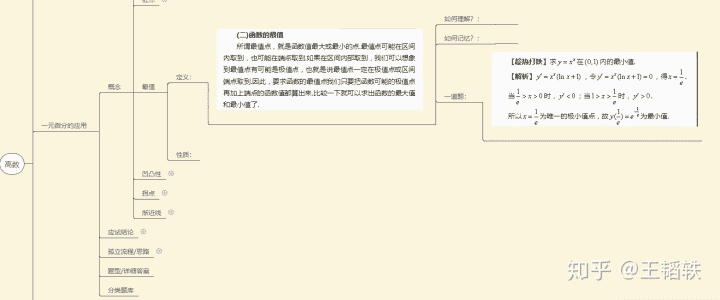</figure>

<figure data-size="normal">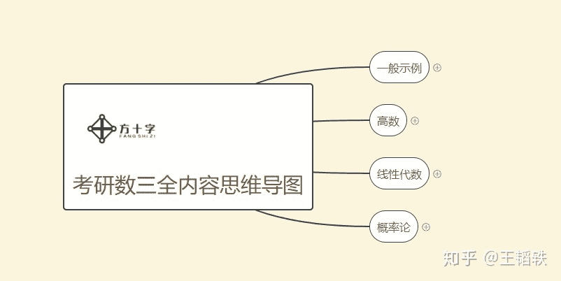</figure>

教材与传统的思维导图无法做到图示导图的高压缩性与全内容性。

用于示例的思维导图，主要是考研数学三的高数部分，欢迎各位参观使用。

### *2.6如何制作与使用**全内容的思维导图***

2.6.1 使用

实际上这样的全内容思维导图最好由专业机构进行制作，当然你也可以自己制作，**难度非常低，会截图就会做**。

2.6.2 全内容思维导图对各个学习环节的优化与应用:

*（1）**获取信息**。*

实际上，你可以通过任何渠道获取学习信息的内容，比如阅读，听讲，讨论查百度等等方式，但你只能通过思维导图这一类工具来获取学习信息的结构。而通过全内容思维导图，你可以MECE（不重合不遗漏）的一站式获取你所需要的全部学习信息的内容与结构。你的信息获取效率和质量，要远高于使用纸质书籍的同学。

***（2）理解已获取的信息***

所谓理解，在上文中提到过，实际上包括了两个事情，一是理解和回忆构成信息的语词的内涵和外延，二是整合信息的结构。对于整合结构，实际上你已经不用去做了，思维导图已经将信息结构摆在你面前。相较于那些使用自然语言获取学习信息的同学而言，你节省了“运用大脑整理信息结构”的时间，实际上在运用传统的方法学习的过程中，由于存在一个“短期记忆转化成长期记忆的过程”，通过大脑整合信息结构的过程实际上是非常漫长的。你能将它节省下来，对学习效率的提升实际上是巨大的。

而相较于理解语词而言，理解语词的本质过程实际上是使用你所熟悉的概念组合，来类比陌生的概念，从而理解一个陌生或抽象的概念。比如我们在理解电流的时候我们实际上是把电流想象成了水流，我们才能有效的理解。这里的“水流”就是我们所谓的“思维钩子”。但是，由于概念的组合方式数目过大，所以实际上我们绝大多数情况下都在借用“外脑”来帮助我们理解，比如上课，阅读等。但是，上课，阅读所提供的信息是一个封闭体系，换句话说，只能为你提供固定的理解方式，未必适用于你。但是，通过全内容思维导图所提供的互联网链接功能，我们完全可以把理解方式做成一个开放的系统，产生大量的理解方式供你挑选，其对学习内容的理解效率，也将远高于传统的方式。

<figure data-size="normal">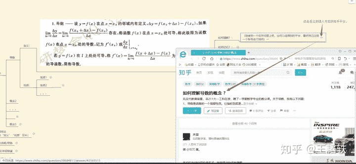</figure>

***（3）应用已获取和理解的学习信息。***

我们应用知识，不论是解题还是解决实际问题，都遵循着如下步骤：

**需求→查询→应用→解决**

若被需求的信息已被大脑记忆，我们从大脑内部查询，称之为“内查询”。

若未被记忆，需要从外部信息源查询，称之为“外查询”。

在应试学习训练的过程中，存在着大量的外查询行为。应用全内容思维导图，在某些领域可以有效的优化外查询流程，提高外查询效率，从而提高信息的应用频率，使信息更快的被记忆，从而将外查询转化为内查询。

这里以考研数学习题训练为例。

过去，对于绝大多数学习者而言，在数学习题练习的前期和中期都要花费大量的时间。为什么？原因很多，这里举个很典型的场景：你做着这道题，突然有一个公式想不起来，或者有一个性质定理的概念很模糊。如果你试图自己硬想，就真的是浪费时间了，因为最高效的记忆是“短时多次”，而不是“长时少次”。更有效的做法肯定是立即查询。如果你去查询纸质书本，由于你对书本的结构认识不足，可能需要花费大量时间才能查询到你想要的知识信息，尤其是一些不起眼的“二级结论”，你要花费更多的时间去寻找。

<figure data-size="normal">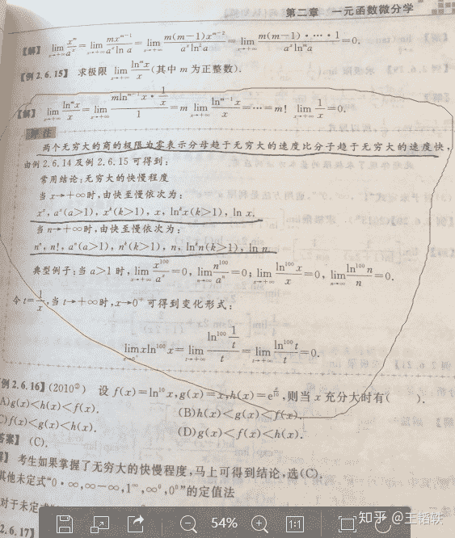</figure>

类似“常用无穷大快慢程度”这样的二级结论，无法通过目录寻找，只有通过**逐页翻找**才能发现，而且有的教材未必有相关内容。

通过应用全内容思维导图，仅需要三步点击，即可寻找到你所需要的知识信息内容。通过四步点击，你还可以复习相关的知识内容。若导图中没有相关内容，首次通过其他方式查询到相关信息后，也可以及时补充进导图，便于下次查询。

<figure data-size="normal">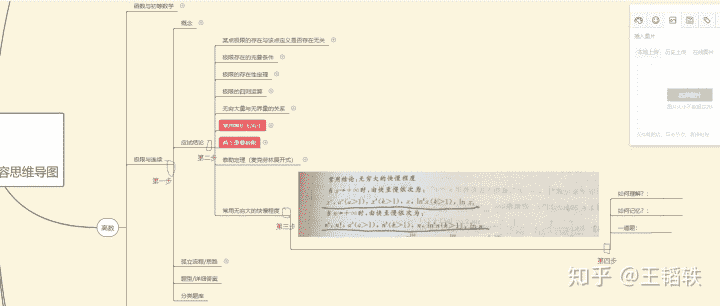</figure>

查询速度，甚至要优于搜索引擎。通过这样的工具，有效缩减了外查询对学习效率的影响。同时，查询这个行为本身，也是对知识结构的一个应用过程。你通过不断的查询，实际上你的大脑就会被动的记忆整个知识结构。

如果进一步细化，流程化习题的训练过程，各位可以移步至我的另一篇回答，学习习题训练当中的“**五级分类法**”，相信各位会对刷题和应试有一个全新的认识。

在“五级分类系统”中，在二级升三级的时候，把电脑摆在面前，并使用“全内容思维导图”辅助学习，有奇效。

***（4）记忆信息。***

我们的考试，考的无非就是我们对学习信息的记忆。记忆分被动记忆和主动记忆。上文提到的“外查询”转化为“内查询”便是被动记忆的基本过程。主动记忆的核心在于对信息的再处理，将其转化为易于人脑记忆，同时易于还原成原信息的新信息。比如采用口诀法记忆数学公式等。 对于主动记忆，全内容思维导图也提供了较为“粗暴”的解决方案：

<figure data-size="normal">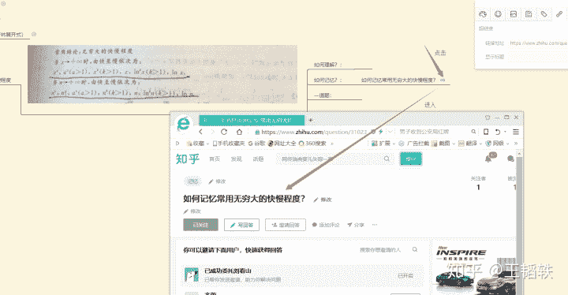</figure>

## 3.思维导图的分类

最后，关于思维导图的制作，我主要从**制作目的**的角度提三个一般性方法，帮助大家清晰的了解思维导图的制作思路。

### ***3.1第一类思维导图：***

**目的**：整理，发散自己的思维，寻找灵感。

**方法**：按照东尼博赞的仪式，从中心图出发，在一条思维路线上，想到什么，就填写什么。

**举例**：

<figure data-size="normal">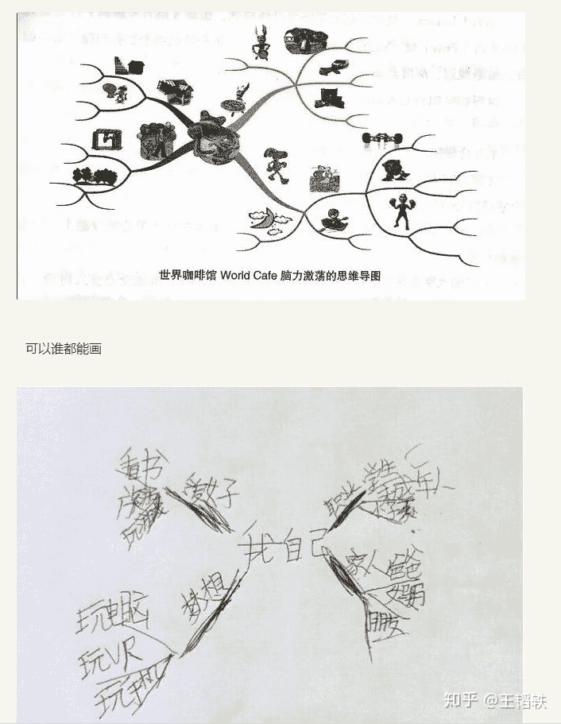</figure>

### ***3.2第二类思维导图：***

**目的**：复现，整理已知信息的内容和结构。

**方法**：采用“全内容思维导图”，严格复刻已知信息当中包含的结构，并按照该结构填入全部内容。

**举例**：

<figure data-size="normal"></figure>

### ***3.3第三类思维导图：***

**目的**：根据使用需求重新建立一个MECE信息结构，并将原有的信息内容填入新的结构当中，以达到方便查询，记忆等目的。

**方法**：采用“全内容思维导图”，根据需求首先建立一个MCEC的信息结构，再将原有信息内容按照结构提供的分类填入对应的结构当中。

**举例**：

<figure data-size="normal">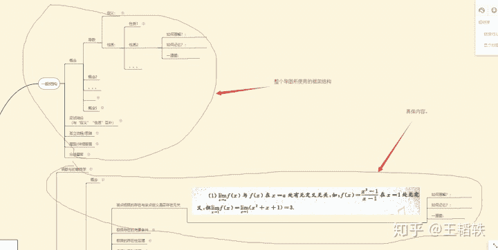</figure>

**实际上将制作第三类思维导图的过程复现在大脑中，就是所谓的结构化思维。**

绝大多数人的思维模式是**先理解自然语言内容，后整理思考结构（多数达不到这里）。**

而**结构化思维是先有结构模型，再用将内容填入结构模型当中。**

除了我上文提到的应用方式，全内容思维导图还将有更多神奇的应用方式，等待大家去进行二次开发。

## 4.总结

### 信息是二维的。

### **自然语言是一维的。**

### **自然语言是信息内容的可视化。**

### **传统思维导图是信息结构的可视化。**

### **全内容思维导图是信息本身的可视化。**

最后，欢迎各位来到“方十字费曼技巧社1群”，共同探讨，实践应试教育领域更高效的学习方式。QQ群号：933781493。

以上。