# 基于艾宾浩斯记忆曲线的学习日志说明书[应试方法论]

> 原文：[https://zhuanlan.zhihu.com/p/97031299](https://zhuanlan.zhihu.com/p/97031299)

提前声明，本工具**已申请专利，专利号：201910263892.7**。工具的电子版每月分享在QQ群：933781493方十字学习方法交流群中。只允许打印自用，不得私自用于商业用途。想要在商业上合作的请知乎私信与我联系。

我知道，你们在使用记忆曲线的时候，是有一些**痛点**的。

只能用来记单词，想在**别的学科**应用较为困难；不能保证严格按照曲线复习，复习任务**越堆积越多**，看着头大；表格法操作起来**麻烦极了**，app的限制又太大，我不可能所有学习任务都通过app完成吧。。。

为此，我经过了一系列的实验与设计，化繁为简，研发了一本“**记忆曲线学习日志**",并开发了完整的使用流程。

<figure data-size="normal">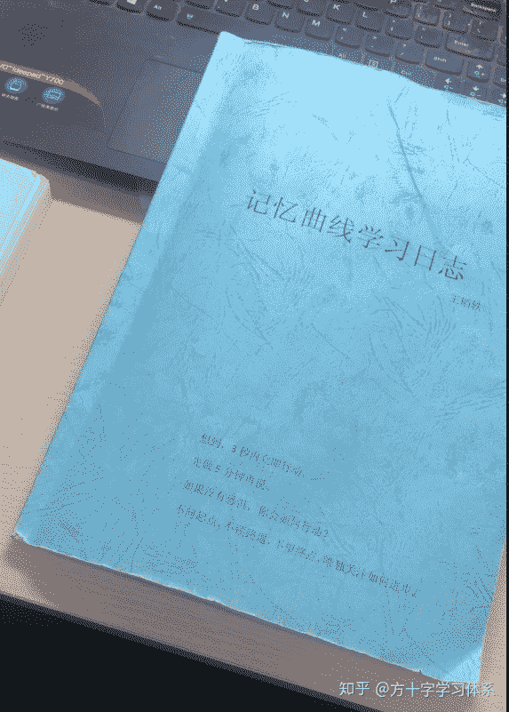

<figcaption>胶装封皮，用的有点旧了</figcaption>

</figure>

<figure data-size="normal">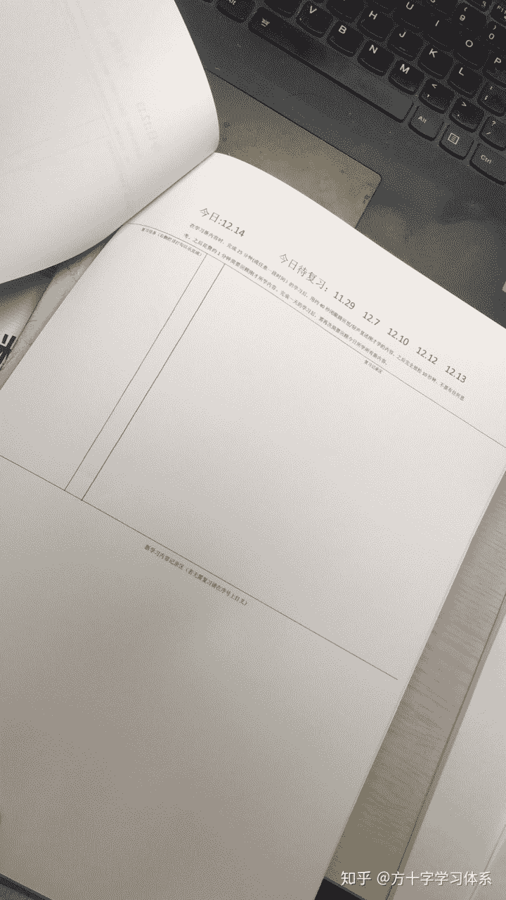

<figcaption>日志内容/格式（第二版）</figcaption>

</figure>

**这个学习日志大大的好，也大大的好用，除了方便的应用记忆曲线之外，还有诸多特别棒的优点。**

## **废话不多说，我亲自操作，一步一步教你怎么用。**

（以下示例以第一版学习日志为例，但操作流程与第二版日志相同）

我们现在穿越时空，不用穿越太远。现在我们回到了2019年的9月30日清晨，你洗漱完毕，**信心满满的准备今天的学习。**你坐在自习室，打开了**娱乐APP**知乎，呸，打开了**学习日志**，翻到了9月30日，就像这样：

<figure data-size="normal">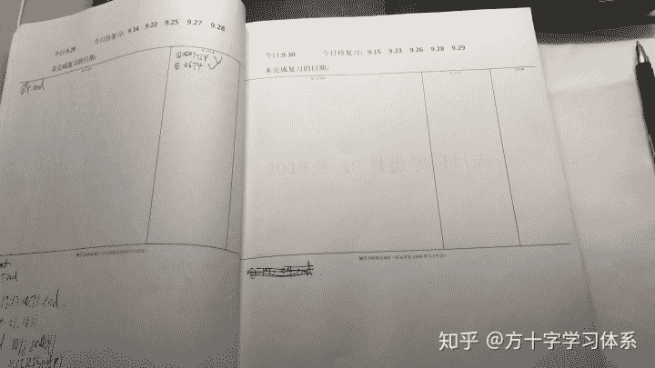</figure>

你热血沸腾，**今天一定要把这页日志填满！！！**

好了，不灌鸡血了，首先你要完成所有的复习任务。毕竟时间充足，旧的知识没记住，就学新知识，那不是熊瞎子掰苞米嘛~那怎么制定复习任务呢？你的目光聚焦在了这里：

<figure data-size="normal">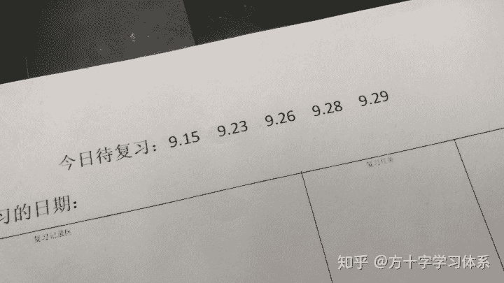

<figcaption>按照记忆曲线排布的待复习日期</figcaption>

</figure>

这是什么意思呢？也就是说，**根据记忆曲线的指示，你需要复习9月15号，9月23号，9月26号，9月28号，9月29号学过的内容**。那这几天我都学了什么呢？让我们**翻到对应的天数看一看**：

**9月15号：**

这里是我自己的简写符号，m代表数学，e代表英语，p代表政治，z代表专业课，05T3代表英语2005年真题第三篇文章，(2,4,8)代表第二段第四行第8个词，r代表read，Q代表问题，end代表结束。。。各位也可以自创属于自己的简写符号

<figure data-size="normal">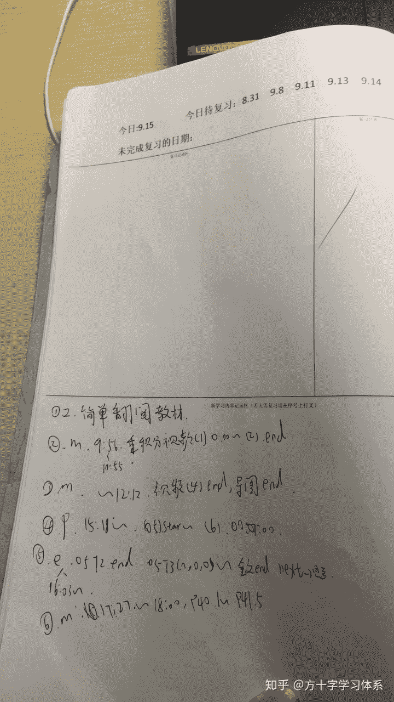</figure>

**9月23号：**

<figure data-size="normal">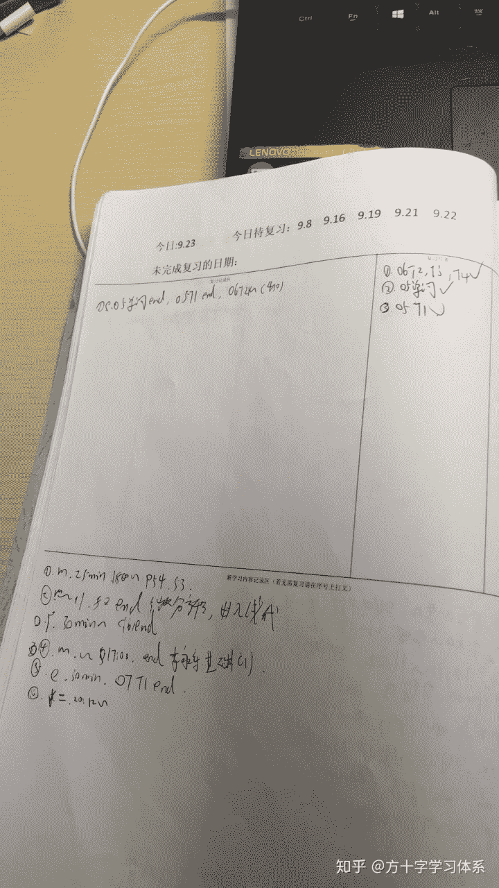</figure>

**9月26号**：

<figure data-size="normal">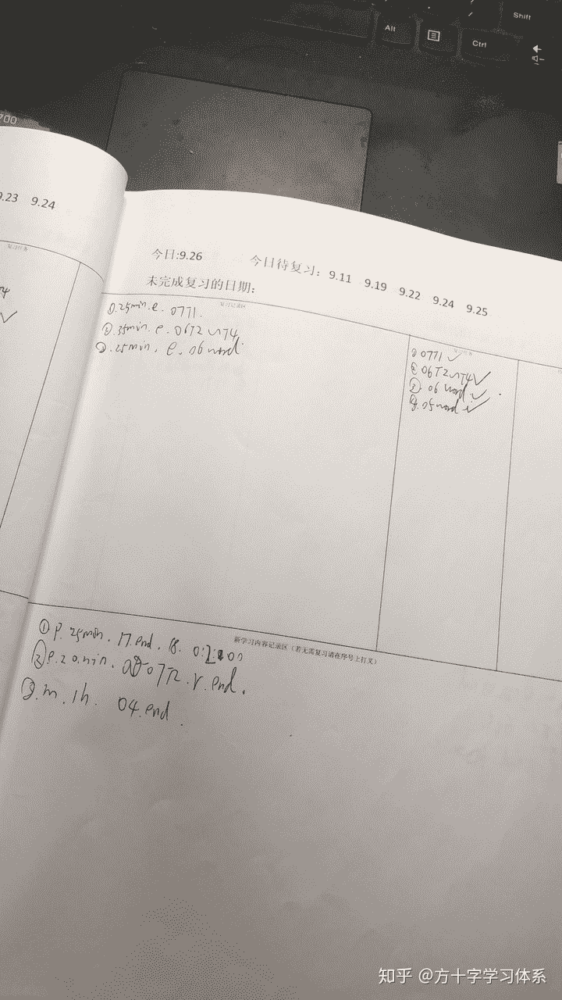</figure>

**9月28号**：

<figure data-size="normal">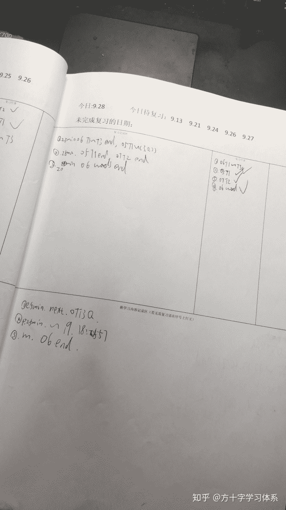</figure>

**9月29号**：

<figure data-size="normal">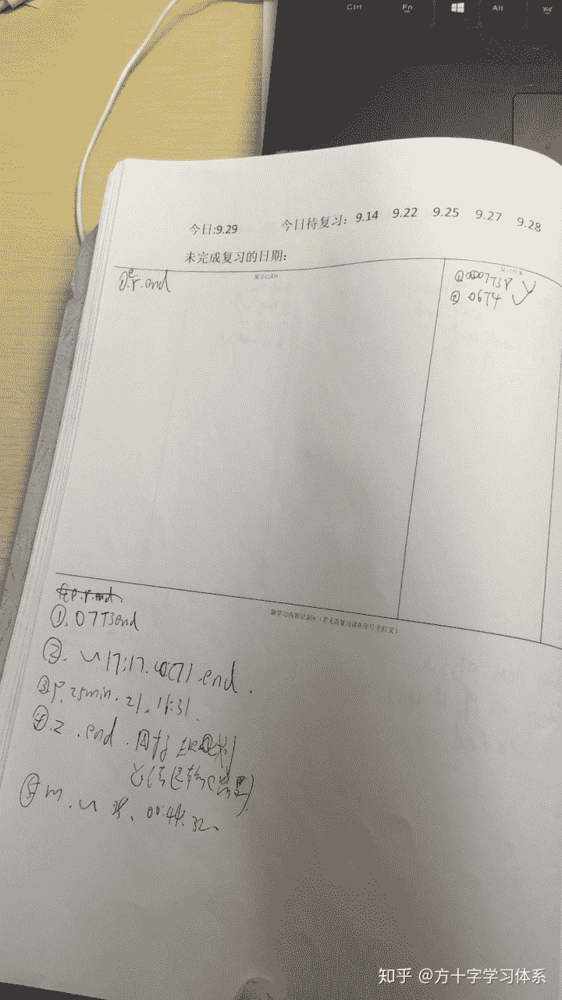</figure>

接下来，我们就要汇总一下这几天都学了什么东西，从而**制定出一个学习任务。**

注意啦，这里有两个记录区，一个是记录当天在复习过程中的学习内容，一个是记录当天新学习的内容。**当我们制定学习任务的时候，只需要复习各天新学习的内容即可！**同时，**不是每一个内容都需要复习**，我这里主要对数学和英语进行复习，政治与专业课先不作复习。各位可以根据自己的实际情况自行制定。

汇总，合并的待复习内容如下：

<figure data-size="normal">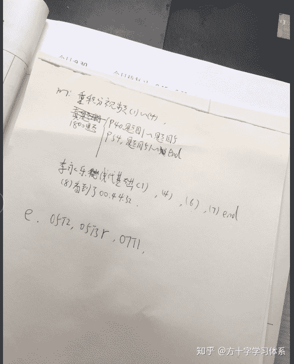

<figcaption>可以事先在草纸上汇总，合并需要复习的内容</figcaption>

</figure>

我们据此制定复习任务：

<figure data-size="normal">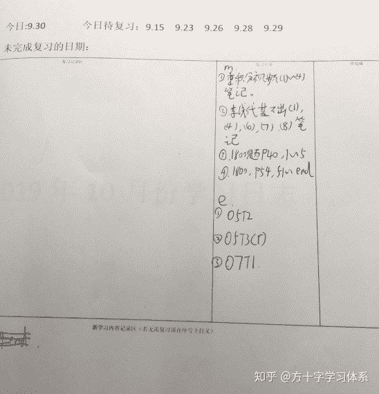

<figcaption>在“复习任务”一栏中填入今日的复习任务</figcaption>

</figure>

好了，我们首先开始完成复习任务吧！可以像我这样，采用番茄钟法进行学习，也可以按照自己舒服的频率学习。

再次强调，完成复习任务时，学习记录要记录在上面那个“复习记录区”中，每完成一个复习任务，就打一个勾，就像这样：

<figure data-size="normal">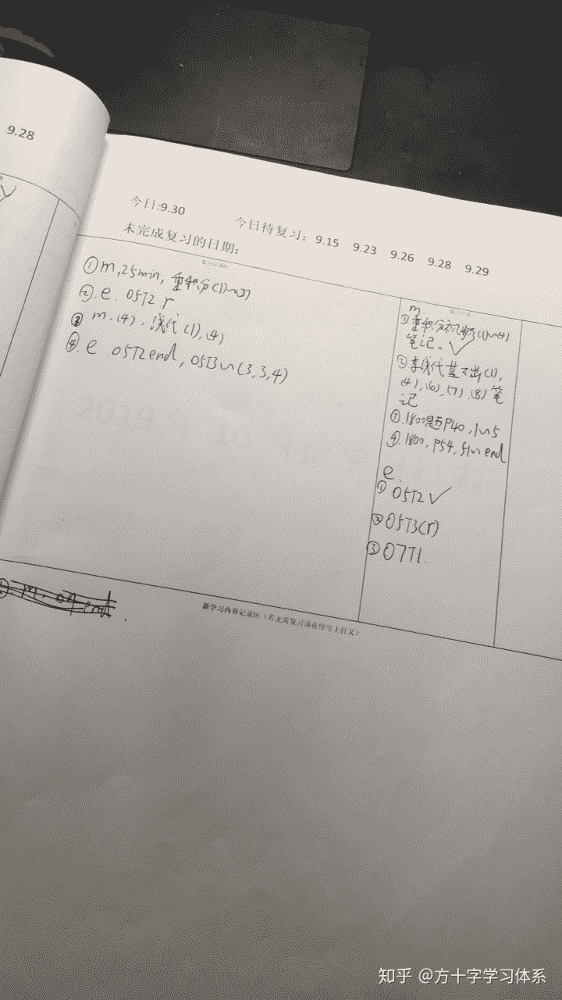

<figcaption>每完成一项复习任务，就打个勾，成就感max！</figcaption>

</figure>

当我们完成所有复习任务后，便可以开始学习新知识。当然你也可以根据自己的需求，放弃一部分复习任务。学习的新知识要记录在下方“新学习内容记录区”当中，像这样（以9月26号记录为例）：

<figure data-size="normal">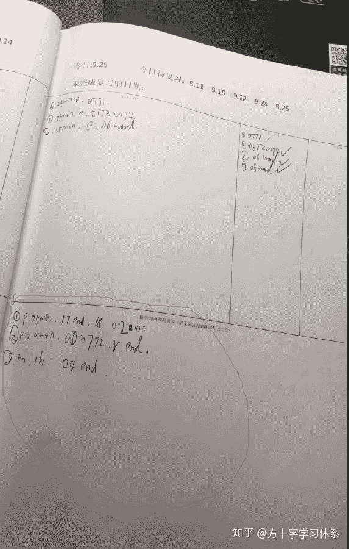

<figcaption>在新学习内容记录区记录新学习的内容</figcaption>

</figure>

当然这是比较顺利的情况。但如果，今天有事情了，或者之前学的东西太多，导致今天积累的复习任务太多了，可怎么办呢！

首先，引用一段方十字学习观的原文（对方十字学习观感兴趣的同学可以直接点击该段文字进入）**：**[复习不是首次学习的简单重复，可以采取不同的方式，不同的角度对同一信息进行复习。比如第一次是做题，第二次复习可以把题讲给别人听，第三次复习可以尝试编制记忆方法，以此类推。但不必要教条的追求每次复习不同的学习方式，一切以学习效率为导向](https://www.zhihu.com/question/20416520/answer/920498567)**。**一般的来说，从效果上，**短时，浅层次，高频的复习优于长时，深层次，低频的复习**，所以单次复习实际上**不用过于深入。**

其次，如果时间紧迫，可以根据实际情况放弃一部分复习任务。

最后，如果今天所有的时间都用在了复习，但仍然没有复习完，那也非常简单：只需要把未完成的复习任务顺延至第二天的复习任务即可。具体操作示范如下：

若如下图，当天学习结束时未完成全部复习任务：

<figure data-size="normal">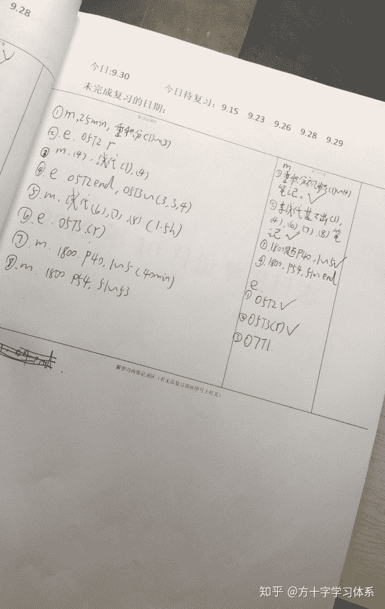

<figcaption>今天用尽了洪荒之力学习，但（1）数学1800题P54第54题~该章结束。（2）英语的07T1。这两个复习任务没有完成复习</figcaption>

</figure>

那么只需把未完成的复习任务置入明日的复习任务就可以，像这样操作：

<figure data-size="normal">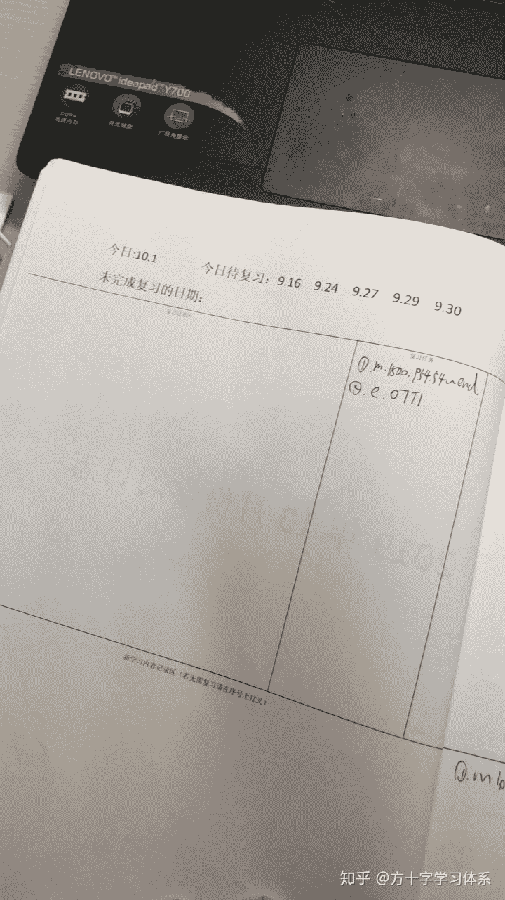

<figcaption>注意了，这是10月1日的学习日志页，9月30日之后就是10月1日。</figcaption>

</figure>

那有人会问了，如果这样，我10月1号的复习任务不就更多了吗？

**不会。**

这正是这本学习日志最精妙的地方所在：**学习进度的自动调节**。

你会发现，当9月30号你把所有的时间都用于复习的时候，当日你实际上没有学习任何新的内容。换句话说：

## **每一次复习到9月30日的时候，复习内容为空！**

查看上图，会发现，10月1号就需要复习9月30号的内容。那么相对于9月30号，10月1号的复习任务就会少了一天的任务量。

于此同时，如果某天复习任务过少，总学习时间与效率固定，你就会有更多的时间学习更多新知识，对应的，接下来的复习任务会增加。

所以，只要你坚持使用这本学习日志，你的**复习任务量会自动匹配你的学习状况。**

**是不是妙极了。**

这个学习日志的通用性极强，包括**背单词**也可以使用。有的人不喜欢app，喜欢用单词书背单词，那么只需要在日志中用自己看的懂的方式记录一下，背了哪本单词书，哪页，第几个词到哪页第几个词。在以后制定复习任务时，能定位出今天学了哪些单词即可。

<figure data-size="normal">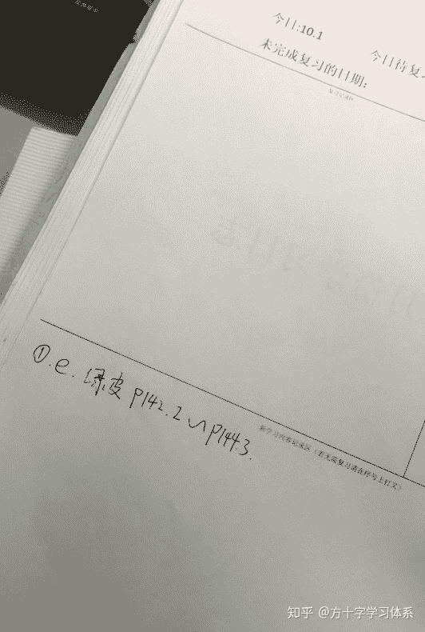

<figcaption>像这样记录，意思是这25分钟我背了新东方绿皮书从P142第二个单词到P144第三个单词的所有单词。这种记录方式灵活程度要远优于某些表格法按照list记录。</figcaption>

</figure>

这个日志还有很多其他优点和用途，比如你可以通过这本日志监控自己的学习时间，速度与进度，这样当你制定学习计划的时候便有了更加可靠的依据，**而不是瞎制定一些无法执行，挫折满满的计划。**

不仅如此，你还可以根据这本日志**预测自己的学习进度，知道大概一周，或者一个月之后能学到哪里。**你可以根据通过这个信息，**统筹优化自己的学习体系**。

记录日志，完成任务，都可以给你带来刚刚好的“**舒适感**”，看到满满的日志，**成就感**也是满满。

这本日志还可以**用于第三方管理**。比如学生记录日志，家长/老师定时检查。家长/老师还可以通过抽查日志记录与学习痕迹（比如练习册上做题的痕迹）是否吻合，来确定日志记录的真实性，从而**了解学生的学习状况**，**优化教学方式与作业量**，**根据日志的记录设置排名与奖励。**

除此之外，这本日志一定还有我所不知道的优点，用途与能量，有待大家的开发。

除了艾宾浩斯记忆曲线，在知乎上还看到了一个概念叫“Spaced repetition”，大致的意思是根据自己对知识的记忆情况调节复习频率。实际上绝大多数单词app软件应用的就是这个原理，集大成者为ANKI。有兴趣的同学可以去自行了解。

以上。

* * *