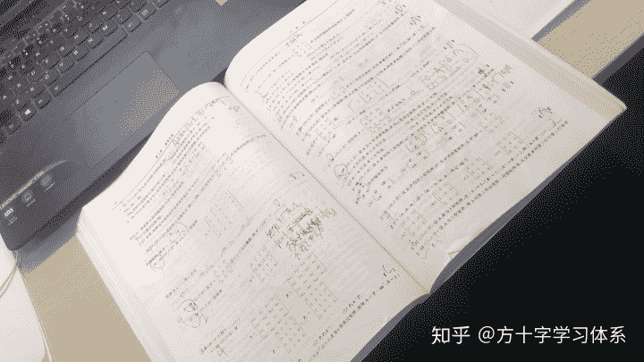
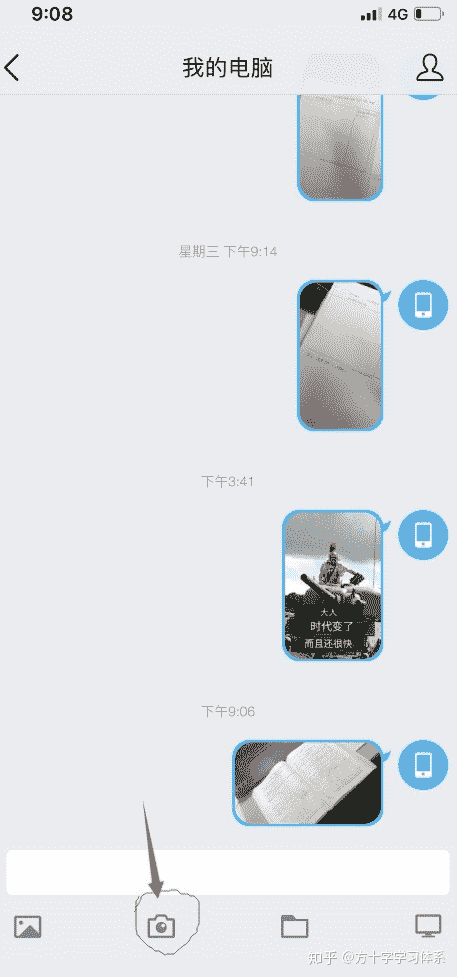
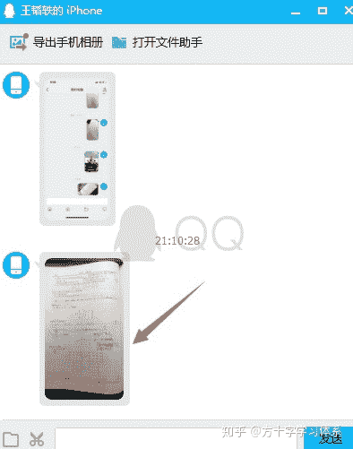
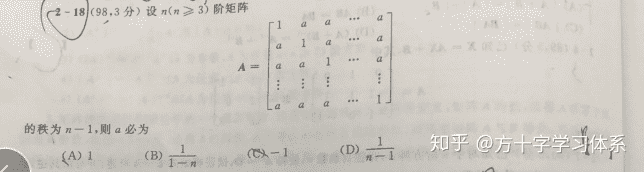
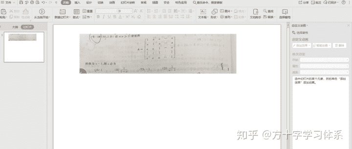
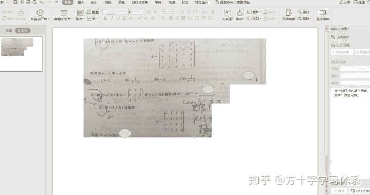
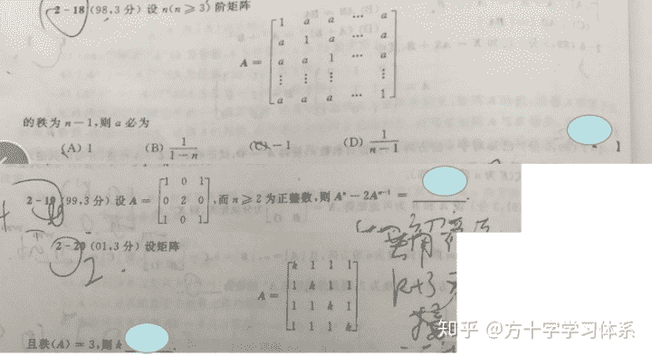

# 一种便捷的错题本制作方法[应试方法论]

> 原文：[https://zhuanlan.zhihu.com/p/97032347](https://zhuanlan.zhihu.com/p/97032347)

## 我知道你们不想手抄错题本。

## 也不想剪卷子，又剪又粘，想想就烦。

## 可能，也不想下载乱七八糟的app，买乱七八糟的打印机。。。

## 好吧，废话不多说，我亲自操作一个错题的整理方式，就用你们手头有的东西。

开始。

* * *

必备工具：手机，电脑。选备工具：打印机。

第一步：翻开你们的卷子，或者练习册。

第二步：打开手机QQ，打开“我的电脑”聊天界面，用自带的相机，把一整页拍下来，发到电脑里。

点击

第三步：双击打开图片，点击Ctrl+Alt+A开启QQ截图，把错题截下来，双击复制。

第四步：打开电脑软件PPT，点击Ctrl+V，将错题粘贴在PPT中。可以根据需要调整图片大小。

第五步：重复第三步与第四步，将该页所有错题都粘贴至PPT中，并在PPT中进行整理加工。若PPT被填满，再添加一页空白PPT即可。

可以自由拼接，答案可自行添加图形遮盖。

第六步：打印PPT并归纳整理，或整理至思维导图软件中。（下例采用的是在线思维导图processon）

直接在PPT中进行QQ截图

直接粘贴至导图中

注：可以集中作业，分工作业，多人作业。比如你可以首先把所有的卷面都拍到手机QQ里，回家之后再用电脑集中处理。还可以用手机拍完之后，请你爸妈，朋友，或付费的兼职（目前还没有这项服务）帮你处理。

以上。