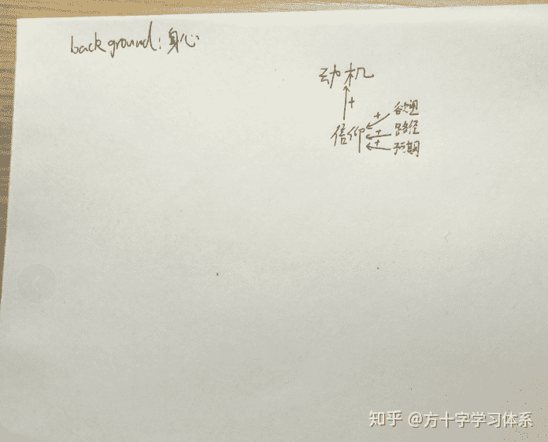
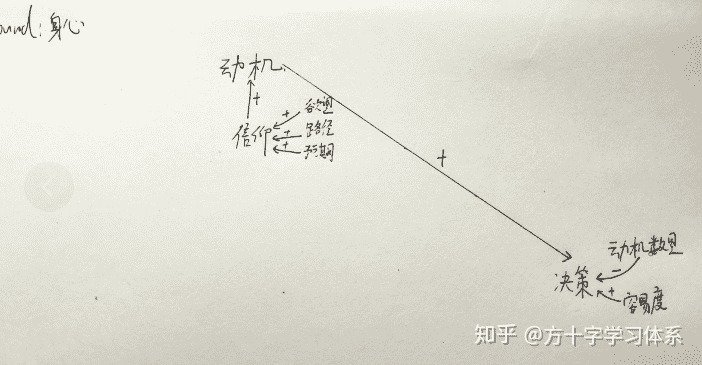
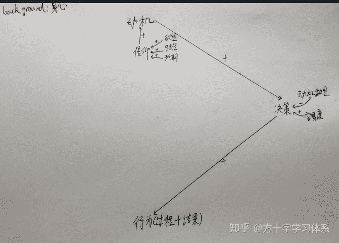
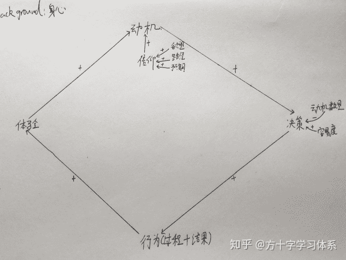
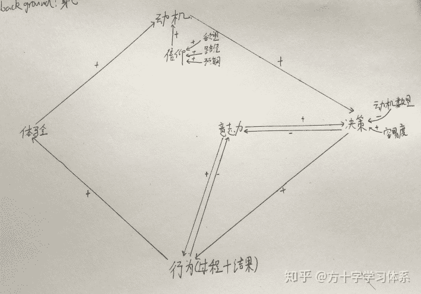
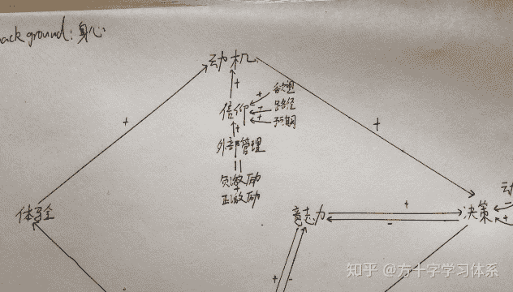
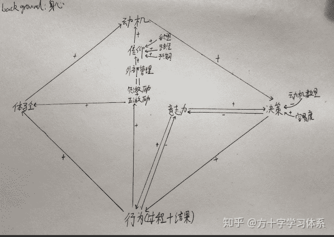
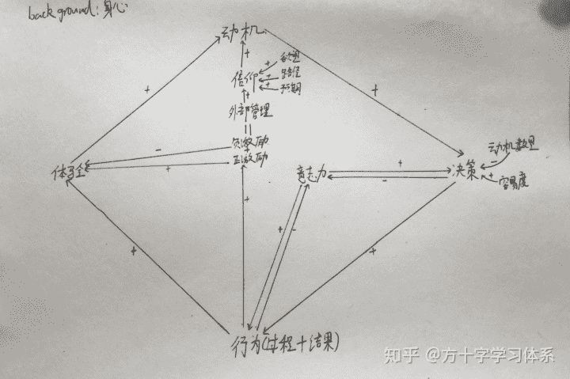

# 方十字主观实践认识论[认识论]

> 原文：[https://zhuanlan.zhihu.com/p/97236375](https://zhuanlan.zhihu.com/p/97236375)

<figure data-size="normal"></figure>

**学习，是一种实践。**

人的实践过程，从一般性的角度来说，可以从两个方面去看待：

一是一般性的客观过程。根据人类经验，一个科学合理的一般性的客观实践过程，包括决策目标，分解任务，制定计划，执行计划，复盘优化。

二是主体(人）的意识运动过程。人只有在意识层面调动主观能动性，才能通过合理的实践过程将意识转化为物质，将理想转变为现实。

学习做为人的一种实践行为，有其一般性与特殊性。在之前的文章：***[方十字应试学习观](https://www.zhihu.com/question/20416520/answer/920498567)*** 当中，着重讨论了应试学习的特殊性，提出了对于应试学习的一般性的认识论与少量的本质论，方法论。

**本文将从较为宏观的角度，揭示人在实践过程中与意识相关的各要素之间的主要关系，并试图获取一些更为一般性的认识与方法。**关于一般性的客观实践过程，将在其他文章予以讨论。

本文主要以人的实践过程为讨论对象，**应试学习做为人的实践过程必然适用，也必须使用。**

本文不会过多探讨具体的方法与策略，但**尽可能做到通过理解本文，可以让你更深入的理解市面上所有的具体的方法与策略背后的关系与原理。**

开始。

* * *

## 方十字主观实践认识论

### 1.正反馈循环

首先，让我们从一张白纸开始。

<figure data-size="normal"></figure>

不论我们做什么，**身体，心理，情绪健康**永远会对我们的实践行为的所有要素产生直接影响，但除了极端情况，影响程度不是特别高。

除了极端的不健康与超常的基因天赋，一般人的身心健康都处在一个一般水平。我们只需要保持一个健康的生活习惯，锻炼频率，作息规律即可。长期不可牺牲身心健康来做事情（否则不仅失去健康，做事的效率也会变低），也不必过度追求身体强健过分牺牲做其他事情的时间，精力。

身心健康，是我们进行实践的“背景”。

<figure data-size="normal"></figure>

不论是什么实践，只要以人类为主体，**首个要素就是:动机。**

**动机，即引发人从事某种行为的力量和念头。**

**信仰，是动机的源动力。**信仰越强烈，动机越强烈。

这个信仰并非宗教信仰，而是一种“**相信自己通过最优路径实现某个欲望**”的意识。

信仰，包含三个要素:**欲望**，**路径**，**预期**。

欲望，即“我想要什么”。欲望越强烈，信仰越强烈。

欲望源于人的本能，一般需要体验激发。关于欲望，可以参考“马斯洛需求理论”。

举例说明：我想要钱/权/名/色，我想要打赢游戏，我想要好朋友，我想被社群接纳，我不想被批评，我不想别的，就想取得好成绩，上好大学，都是欲望。

路径，即达成欲望的观念**最优路径**，即我认为：我选择的这个实现欲望的路径是唯一的，或者最优的。

观念最优，不等价于客观最优。最优不完全等价于最短，一般来说，观念的最优指的是体验感最好。

预期，即我对“通过路径可以实现欲望”的概率的评估。评估概率越大，预期越大，信仰越强烈。

<figure data-size="normal">

<figcaption>+表示同向影响，-表示反向影响</figcaption>

</figure>

一般来说，作为人类，同一时间会存在多个动机，但由于时间，精力有限，同一段时间人只能进行一个主要行为，所以人需要在多个动机之间做出**决策**。

决策的难易程度，取决于动机数量，强烈程度，行为容易度。

动机越多，决策难度越高。

某一动机越强烈，越容易被选中，否则更难被决策。

一个事情越容易做，越容易被决策首先执行。容易度足够高，容易度优先于动机强烈程度。

<figure data-size="normal"></figure>

当人做出决策之后，会进行所决策的行为。决策越坚定，行为的执行过程越坚定。

行为分为行为过程，行为结果。

<figure data-size="normal"></figure>

在执行行为的过程中与行为结束后，都会产生体验。

一般来说，过程越顺利，结果越好，体验感越好。

**体验感并不稳定，精确。针对指定行为的体验感，可以扩大至指定行为所在的大类中，或临近的人，事，物中。**

再细致一些，根据“峰终定律”，对体验的记忆由两个因素决定:高峰(无论是正向的还是负向的)时与结束时的感觉。

> 峰终定律：诺贝尔奖得主，心理学家DanielKahneman，经过深入研究，发现对体验的记忆由两个因素决定:高峰(无论是正向的还是负向的)时与结束时的感觉，这就是峰终定律(Peak-EndRule)。这条定律基于潜意识总结体验的特点:对一项事物的体验之后，所能记住的就只是在峰与终时的体验，而在过程中好与不好体验的比重、好与不好体验的时间长短，对记忆差不多没有影响。而这里的"峰"与"终"其实这就是所谓的"关键时刻MOT"，MOT(MomentofTruth)是服务界最具震撼力与影响力的管理概念与行为模式。

体验感可以直接影响动机。体验感越好，动机越强烈。

<figure data-size="normal"></figure>

至此，对于人的行为，我们构建了一个正反馈循环。

在理想情况下，我们对于一个指定的行为，拥有足够强烈的信仰与动机，坚定的决策执行，并采用科学合理的步骤执行，产生良好的体验感。我们执行该行为的动机便会更强烈，决策更坚定，行为更轻松，体验感更好。。。

我们的最终目标，就是让我们指定的行为（比如应试学习）进入到这个循环当中。一旦启动该循环，人的行为会自觉自动的进行下去，无需所谓的“意志力”或外部压力进行强制推动。

**内部启动循环的核心在于足够坚定的信仰，维系循环运转的核心在于足够良好的体验感。**

有意思的一点，在于人在行为过程中，会不断地产生体验，也存在其他动机，不断地决策要不要继续进行下去，直到循环“聚焦”在人当下所做的事情上，人便可以专心执行当下所做之事（心流）。

不论从整体来观察，还是观察局部行为，上图循环依然存在。该循环具有分形性。

* * *

### 2.意志力与外部管理

少数幸运儿可以在指定的实践活动中顺利进入该循环，但**绝大多数人由于各种原因，难以顺利将指定的实践活动纳入循环中。**

为此，我们首先应该从客观上保证整个过程的科学性，合理性。一般性的内容将在另一些文章详谈，关于应试学习，详见：[方十字应试学习观](https://www.zhihu.com/question/20416520/answer/920498567) 。

在该前提下，**有两个外部工具可以帮我们启动循环：意志力与外部管理**。

**2.1意志力**

意志力，即一个人自觉地确定目的，并根据目的来支配、调节自己的行动，克服各种困难，从而实现目的的品质。

意志力是一种内部管理。

关于如何提升意志力，这个问题下有很多不错的方法论，包括锻炼身体，冥想，放松活动等：

[如何提升意志力？](https://www.zhihu.com/question/21769016)

但我这里不是强调意志力的重要性，而是摆正意志力的位置，强调对意志力的合理应用，**批判两种片面的观点：“全程使用坚持，毅力，意志力。”“做事情无需意志力。”**

如果说信仰是循环的源动力，体验感是循环运行的关键，那么意志力是循环的启动剂。

如果把做事情比作开车，意志力就是发动汽车的电火花。我们需要电火花来启动汽车，但不能光靠电火花的能量开车。

**意志力是一种有限的资源。**

意志力可以影响决策与行为过程。

意志力越强，决策过程对动机的依赖越弱。继续行为过程对行为过程的良好体验感的依赖越弱。

同时，指定活动的动机越弱，行为过程体验感越差，对该活动的决策与执行越消耗意志力。

换句话说，如果我们在意志力不足之前，提升信仰，动机，或通过优化行为过程来优化体验感，我们便可以进入该循环，反之则无法进入该循环，也无法通过意志力持续维持有效的决策与行为。

这也是很多学生光凭意志力只能“三分钟热血”，无法有效进入学习节奏的原因。

<figure data-size="normal"></figure>

**2.2外部管理**

除了意志力，我们也可以借助**外部管理**来启动循环。

外部管理比意志力更复杂，更不可控，同时功能更多，更持久，可以在更长的时间段内从外部推动循环。

对于学生来说，父母，老师，同学，社群，补课机构，甚至手机的自律软件等都是一种外部管理。

**外部管理对外的主要手段，包括观念上的许诺与威胁，以及实际上的奖励与惩罚。许诺与奖励，统称“正激励”，威胁与惩罚，统称“负激励”。**

**外部管理，作为一个整体，可以对信仰产生影响。**通过对信仰的影响，外部管理间接的影响了动机。

外部管理者可以通过如下**三个手段**来控制主体的信仰：

1.许诺主体所期待的奖励，并让主体通过执行指定行为以获取管理者的奖励为获取该奖励的最优路径。

2.威胁主体所恐惧的惩罚，并让主体通过执行指定行为以避免管理者的惩罚为避免惩罚的最优路径。

3.通过控制主体所接收的物质与信息，通过不断的重复，反复铭刻，让主体以达成某一指定目标为第一欲望。

方法1与方法2，核心在于“最优路径”。

举例说明，如果家长许诺学生学习10小时，奖励1小时的手机游戏时间，但对于学生来说，晚上在被窝里可以偷偷玩好几个小时的游戏，那么相对于玩游戏来说，学习10个小时便不是最优路径。有时自我管理的失效，也源于有时执行指定行为并非实现自我奖励的最优路径。

方法3，常见于宗教与传销组织，群体对个人的影响亦有此因素。我们可以通过合理应用方法3直接建立信仰，或克服瘾症。

<figure data-size="normal"></figure>

**正激励通过许诺调整主体的信仰。当主体完成指定行为并得到某一结果，正激励通过恰当的奖励提升主体的体验感。**

奖励的类型多种多样，包括各类物质，鼓励，尊重与认可，被社群接纳，归属感等。

有多种因素影响奖励的体验感，包括奖励的类型，额度，匹配度，不确定性等。奖励与体验感之间存在大量的非线性关系。甚至在已运转的循环中添加不恰当的奖励，对循环会起到破坏作用。

> 有一项研究找来了一些喜欢绘画上色的孩子，给他们设定3种情况，有一种情况是，颗孩子们坚持绘画上色，就会获得“优秀玩家”的奖励。而另外两种情况分别是：要么不给孩子们奖励，要么事先不告诉孩子们会获得奖励，但等活动结束后给他们发奖。研究人员发现，因为上色获得明确奖励的孩子，上色时间反倒比那些没有获得奖励，不因为上色获得奖励的孩子要少。——《如何想到又做到》[美]肖恩.扬

<figure data-size="normal"></figure>

**负激励通过威胁调整主体的信仰。当主体未完成指定行为，或未达成指定结果，负激励通过惩罚降低偏差行为的体验感。**

但由于体验感的不精确性，负向的体验感可能会扩大化，造成主体对指定行为的体验感降低。短期内运用负激励可以提升主体对指定行为的决策与执行，长期大概率会破坏循环的形成。

同时，由于主体的适应性，当惩罚对主体失效时，负激励即失效。

这也是为什么要“多用胡萝卜，少用大棒”，以及“打骂教育难以长期维持学生的好成绩”的原因。

当然，也不是片面的否定负激励。当管理者掌握科学的帮助主体进入循环的方法，通过短时，适当的负激励，鞭策主体决策并执行指定行为，帮助主体进入循环，也是一种有效方法。

<figure data-size="normal">

<figcaption>哈哈哈，是不是依然像文章开头的LOGO呢？</figcaption>

</figure>

至此，一个主观实践认识论基本构建完成。这是一个较为宏观的认识论。更加具体细致的认识论与方法论，我将在其他答案中逐渐分享，也会将其集中在我的专栏：方十字学习体系。

最后，不许评论我的字丑。哼。

以上。