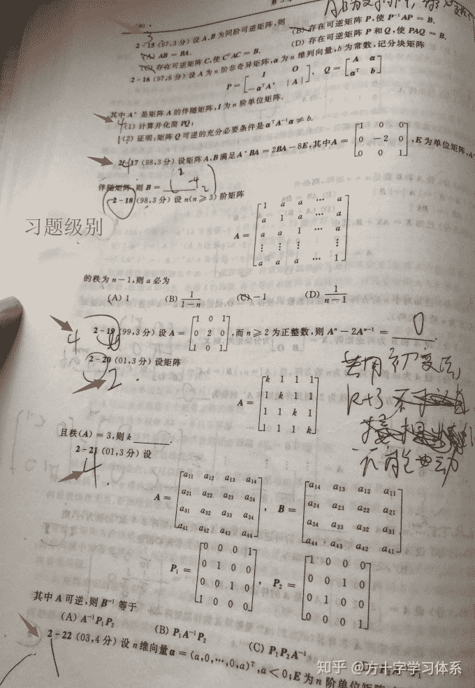

# 高考/考研数学的5级习题评级系统配套的模块化刷题策略[应试方法论]

> 原文：[https://zhuanlan.zhihu.com/p/98352152](https://zhuanlan.zhihu.com/p/98352152)

## **一.5级习题评级系统**

0级:无法看懂答案思路。

1级:首次看懂答案思路。

2级:首次你模仿（**不是抄写，而是先看看答案，把答案合上，自己做，卡壳了再看看答案，直到把题做完**）着答案，动笔把题做对了。

3级:首次你不翻看答案，仅通过翻看其他学习资料（公式定理啥的）动笔把题做对了。

4级:首次不查找任何资料，独立解题，动笔把题做对。

5级:这题你看到就知道解题流程和答案了/这题我都快做吐了。（首次口算，得出正确答案，或记忆该题目的全部详细的解题流程，甚至相关数值）

注：习题训练时可以把题目级别写在题号旁边，根据需要进行更改。

## 二.学习模块

**1.基础学习模块**

完成基础知识的线上/线下课程学习，并记录笔记/导图。

**2.首次刷题**

**模块1（初学者推荐）**

第一步：拿出练习册，直接看题和答案，不要有任何迟疑，不要试图自己做题。

第二步：把每道题都刷到2级（不小心或者时间充裕，刷到3，4级也行）。若出现0级题，则进行线下/线上答疑，搞懂答案。

第三步：刷题完毕/休息间歇，将学习进度记录在**记忆曲线学习日志**。

第四步:按照**记忆曲线学习日志**的指示进行**复习**。

**模块2（有一定基础的同学推荐）**

第一步：拿出练习册，独立解题，可以查询笔记，碰见没有思路的题，1min之后即放弃；碰到冥思苦（并非计算量大）想得不出答案的题，5min之后即放弃，不要迟疑。

第二步：把每道题都刷到2级（不小心或者时间充裕，刷到3，4级也行）。若出现0级题，则进行线下/线上答疑，搞懂答案。

第三步：刷题完毕/休息间歇，将学习进度记录在**记忆曲线学习日志**。。

第四步:按照**记忆曲线学习日志**的指示进行**复习**。

**3.复习路线**

**模块1（时间充裕，推荐）**

第一步：打开**记忆曲线学习日志，查询对应日期的学习内容并制定复习任务。**简要规划该阶段完成多少道题的复习。（比如计划40分钟复习10道题，今天学4个40分钟的数学）。

第二步：不看任何资料。开始独立解题。

第三步：若解题毫无思路，则立即做下一道题，不做任何的思索。

若有思路，但存在遗忘的公式定理，则做特殊标注（比如标注遗忘了什么公式）。

若有思路，且不存在遗忘的公式定律，则直接解题。

若有思路，且贼TM熟悉，答案都背下来那种，标注5级。

直至完成该阶段所计划的所有习题。

第四步:完成一个阶段的复习后（比如在40分钟内做完了10道题之后），翻看笔记，通过查询公式定理，将有思路但遗忘公式定理的题完成。

第五步：参照答案，在答案正确的习题中，无特殊标注的习题标4级，有特殊标注的习题标3级。没有思路/计算错误的习题经过模仿答案后维持/退回2级。

第六步（选做）：学习基本结束后，当晚将标注2级的习题具体的解题思路，步骤讲给自己或别人听。将标注3级的习题所涉及的公式定理讲给自己或别人听，讲一讲这个公式/定理怎么来的，你怎么理解它们，你将怎样记住它们。

第七步：按照**记忆曲线学习日志**的指示完成下一次复习，回到第一步。

第八步：若某习题多次未能升级，则可以将该习题的学习情况记录至**记忆曲线学习日志**的“新学习内容记录区”，再来一轮复习。

**模块2（时间一般）**

第一步：打开**记忆曲线学习日志，查询对应日期的学习内容并制定复习任务。**简要规划该阶段完成多少道题的复习。（比如计划40分钟复习10道题，今天学4个40分钟的数学）。

第二步：为每一道题升级。

事先看过答案之后，原2级题目尝试仅通过查询公式定理完成全部解题流程，升至3级。

原3级题目尝试记忆题目涉及的公式定理并完成全部解题流程，升至4级。

4级题目尝试不动笔，仅在大脑中构思解题流程与步骤，越清晰越好。

升级过程中可以多次查询答案。只要保证一次符合级别的完整流程，即可升级。

举例：某2级题升3级题的过程中，我做着做着又卡壳了。那么我看过答案之后，再合上答案，紧接着仅通过参考公式即完成完整的解题流程，亦为升级成功。

直至完成该阶段所计划的所有习题。

第三步：按照**记忆曲线学习日志**的指示完成下一次复习，回到第一步。

**模块3（时间紧迫)**

第一步：打开**记忆曲线学习日志，查询对应日期的学习内容并制定复习任务。**简要规划该阶段完成多少道题的复习。（比如计划40分钟复习10道题，今天学4个40分钟的数学）。

第二步：直接维持2级题目的2级评级（即对照答案，手算一遍2级题目）。3，4，5级直接对照答案，在大脑中理解并构思解题流程。

直至完成该阶段所有习题。

第三步：按照**记忆曲线学习日志**的指示完成下一次复习，回到第一步。

**模块4（时间极度紧迫）**

第一步：打开**记忆曲线学习日志，查询对应日期的学习内容并制定复习任务。**简要规划该阶段完成多少道题的复习。（比如计划40分钟复习10道题，今天学4个40分钟的数学）。

第二步：所有题目直接对照答案，在大脑中理解并构思解题流程。

直至完成该阶段所有习题。

第三步：按照**记忆曲线学习日志**的指示完成下一次复习，回到第一步。

**4.迁移练习**

当通过上述流程完成一本或多本练习册的练习后，即可使用其他练习册或真题卷，模拟卷进行迁移练习。迁移练习可以直接模拟考试，不必按照上述5级习题流程进行。

## 三.使用方法

按照基础学习→首次刷题→复习→迁移练习这4个大步骤安排学习。在这4个大步骤下，根据自己的情况选择对应的模块流程。

## 四.注意

由于复习频率较高，按照这个方法刷题或学习，在学习时间一致的前提下，初期进度会慢于大多数人。不用着急。之后当别人在二轮，甚至三轮复习都存在很多薄弱知识点的时候，你已经对一些知识点写在书的哪页哪行都能清楚的记住。不要计较一城一地的得失，我们要为了最后的胜利而奋斗。加油各位，奥利给~