# 【总论】方十字应试学习矛盾分析体系

> 原文：[https://zhuanlan.zhihu.com/p/108866182](https://zhuanlan.zhihu.com/p/108866182)

<figure data-size="normal">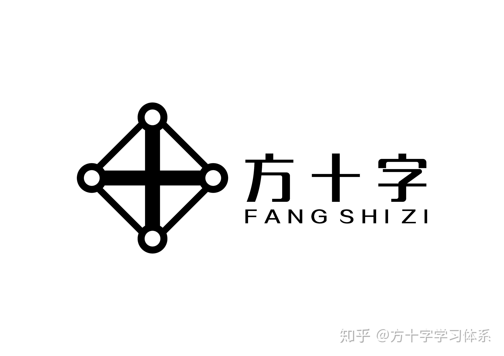

<figcaption>打破旧体系，建立新体系，方十字，专注应试。</figcaption>

</figure>

> 你是因为想学习了，才收起的手机。但你不会因为被收起了手机而想去学习。——方十字学习体系

<figure data-size="normal"></figure>

开始。

* * *

**ps.应各位读者的要求，给全文做了一个导图目录。大家可以将其保存至手机相册，阅读下文时配合食用~**

<figure data-size="normal">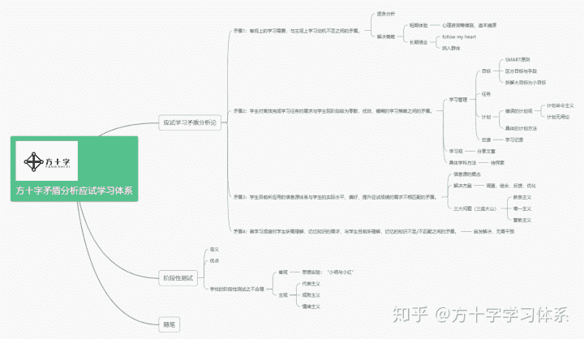

<figcaption>文字有点小，点开看噢~</figcaption>

</figure>

首先**实际上“自律性”是一个很“伪”的命题**，或者可以说，只是表面问题的表面解决方案，没有深入到本质。题主想要表达的意思应该不仅仅是“**自律性差**”，而是“**整体的学习效果不好，包括了不愿意去学习**”。**把问题完整的还原出来，有助于问题的解决**。

那么，为什么对于很多人，在家学习，整体的学习效果没有学校好呢？

**凡事都要抓住主要矛盾**，对于不同的学生来说，主要矛盾是不同的。**如果只关注次要矛盾，而不花时间，精力去解决主要矛盾，那么问题仍然难以解决**。比如收拾好屋子，如果学生没有学习动机，沉迷游戏，那么屋子收拾的再整洁，他也不会去学习，同理，屋子再脏乱差，也不会耽误他打游戏。

那么，排在第一位的主要矛盾，是什么呢？

## 实际上是**客观上的学习需要，与主观上学习动机不足之间的矛盾**。下文简称**矛盾1**。

当学生处在矛盾1的状态时，给予学生任何NB的学习策略，什么做计划，费曼技巧之类的，都是难以生效的。**因为学生根本不愿意去学习，他自然也不会去执行这些学习策略。**这也是叶老师为什么在文章打头，就说“原本就不愿意学习的学生先不说”。

客观上来说，当矛盾1为学生的主要矛盾时，**在校学习的效果一定好于在家学习**，但**只要矛盾1不解决，不管在校学习还是在家学习，效率都是极低的，只是在校学习的效果“没那么差”。**

为什么呢？随我一起分析一下。

首先，我们都知道，**学习行为才会产生学习成果，不管学习行为中所采用的方法是否合理，动机是否充分，但不学习，一定没有成果。**

<figure data-size="normal">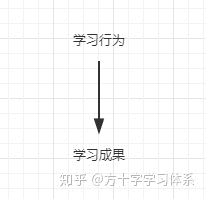</figure>

那么，学习行为从哪里来呢？它是由一个**决策**来的。学生时时刻刻都在做决策，决定接下来是执行学习计划，还是起来休息休息，还是去打会王者，还是去泡妞。。。

<figure data-size="normal">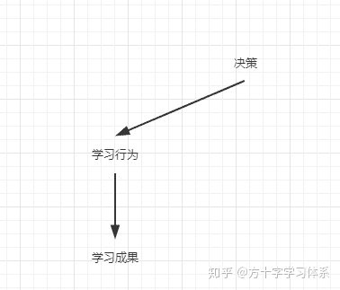</figure>

很多人提出的解决问题的思路，实际上是在“**削减可供决策的行为数量**”上做文章，比如把手机锁起来，减少屋子里跟学习无关的东西等等。这个思路对问题的解决**有帮助**，但当**没有抓住主要矛盾时，仍然无法从根本上解决问题**。

> 比如你喜欢的人突然跟你表白并邀请你去约会，不管你的屋子里有手机还是游戏机，都不耽误你做出“立即去约会”的决策。实际上“约会”和“学习”都是人类的行为，都是肢体和思维的运动，那么为什么手机可以影响你学习的决策，却影响不了你约会的决策呢？

那么，接下来，我们要思考的是，都有什么影响着学生的决策。

学生，是一个人。任何一个人，都有内在思维与外在环境。而内在思维，又分为感性，与理性。感性和理性的关系，有一个解释非常好：

> 人类的情感与理智，就如大象和骑象人：骑象人（理智）希望走向自己的目的地，但存在惰性的大象（情感）却不听使唤仍在原地踯躅不前。 头脑（骑象人）是生活的方向盘，情感（大象）则是生活的动力源,而环境则是生活的公路，给骑象人提供方向。三者结合，改变就能发生。——[美]Jonathan Haidt《象与骑象人》

<figure data-size="normal">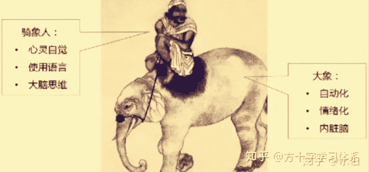

<figcaption>象与骑象人示意图</figcaption>

</figure>

对于人来说，感性，理性，外在环境共同影响着人的决策。

具体到对于学生来说，感性就是“**我想干嘛**”，理性就是“**我应该干嘛**”，外在就是“**管理**”，包括**管教**（父母的管教，学校的管教，同学的监督），**亲身示范**，**咨询建议**，**沟通引导**，**支持陪伴**等方式。**对于目前的学校，家长来说，管理方式以管教为主。**

“我想干嘛”就是动机，“我想（不想）去学习”便是学习动机。而“我应该干嘛”，便是由所谓的“自律，意志力”等理性思维所控制的范围。

从上面的“大象和骑象人”之间的关系，我们也可以理解，为什么人的意志力，自律影响有限。**让一个“不想学习”的人，靠理智的自律，意志力去学习，无异于让人去与大象角力，是不可能赢的。**

> 大象走偏了一点点，人是可以直接用力拽回来的，但大象如果完全走反了，那人光凭蛮力一定会输，就需要动用智慧，想办法**引导**大象转回来。

<figure data-size="normal">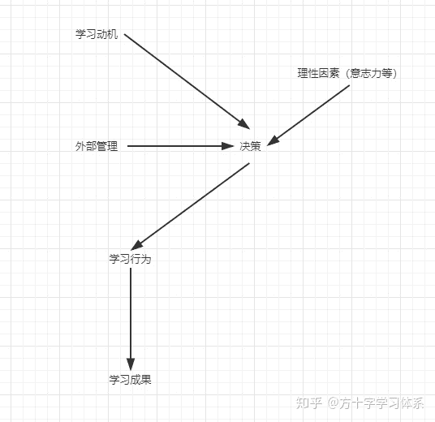</figure>

对于影响决策的三个方面，我们可以知道，**学习动机，实际上是最要紧的问题**。但在实际生活中，很少有人关注学生的学习动机，包括学生自己。因为**“学习动机”这个问题隐藏在学生的心灵深处，发现与干涉都比较困难**（有时需要专业的心理支持）。很多人（包括学生自己）想要学生做出学习的决策，便主要采取了另外两种措施：

**1.要求学生自律（本质上是内部管教，是外部管教的延伸与投射）。**

**2.外部管教。**

对于自律的功效，上文已经通过“大象与骑象人”做了生动的比喻，相信大家心中有数。那么外部管教效果如何呢？

首先，我们承认，**合理的外部管教多数情况下比要求学生自己自律更有效果**。这也就是在家学习的效果不如在校学习的效果的原因之一：**缺乏了学校管教，外部管教被大大削弱，在学习动机不足的前提下，对学生的“意志力”要求大大提升，而人的意志力是有限资源，难以短时间内增长。**

<figure data-size="normal">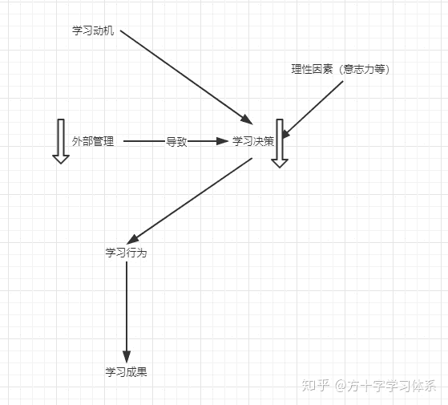</figure>

但我们一定要注意到一个问题：**当学习动机不足时，即使有外部管教（注意，此处是管教，而非管理。管教是管理的手段之一，但并非唯一手段），学习成果的提升也是低水平的提升。而当学习动机充足时，外部管教对学生学习成果的提升影响不大，甚至过于不合理的外部管教最终会负面影响学习成果。**

这是为什么呢?

首先我们要认识到，**外部管教是如何影响学生的决策的**。

不论管教来自父母，老师，同学，学校组织，**管教的本质**只有两个字：**赏罚**。

**赏的本质**，**在于某项被学生所需要的资源，其分配的权力由管教者所掌握。**

比如老师的夸奖，同学的崇拜，异性的倾慕，家长的奖金。。。

学生为了**获得相应的资源**，便会听从管教者的命令，从而管教者客观上掌握了对学生的权力。

**罚的本质**，**在于管教者掌握了对学生的“合法伤害权”，可以通过某种暴力伤害到学生，并且几乎没有被学生伤害的风险。**

比如老师的批评，同学的鄙视，异性的厌恶，家长的混合双打。。。

学生为了**避免潜在的，讨厌的，难以承受的暴力**，便会听从管教者的命令，从而管教者客观上掌握了对学生的权力。

总而言之，学校通过复杂的组织，多方面的掌握了对学生的管教权，**学生即使不愿意去学习，为了获得奖励/避免惩罚，也不得不决策去执行学习行为。**而文章开篇就指明了一个常识:**只要学习了，就会有效果，总比不学习强。**

而当脱离学校，管教被削弱，没有学习动机的学生便不去学习了。

这也是本题的答案之一：**在家学习不是不自律，而是脱离外部管教之后，为实现同等的学习行为，对你的自律程度提高了要求。**

但再次强调：**学习动机不足，从自律和管教入手，只是低水平的提升。**

毕竟：

*   不学习
*   被逼着学习
*   我讨厌学习，但我不得不逼着自己学习
*   我想学习，我喜欢学习

**这完全是不同的境界，差异巨大。**

而且实际上，**“外部管教”的能力也是有限的**。为什么呢？我们从“**有无学习动机**”与“**赏罚**”所构成的4个角度来分析：

<figure data-size="normal">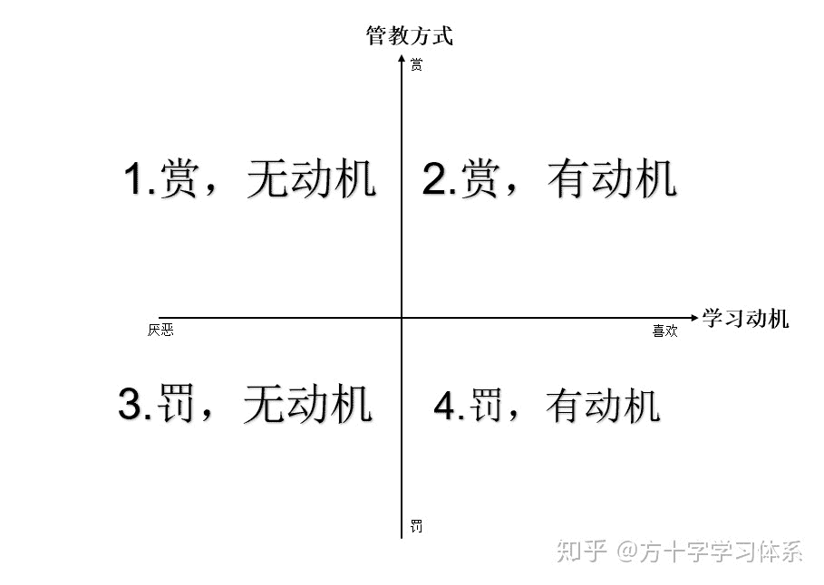</figure>

1.**对于没有学习动机的同学来说，“赏”短期生效的理由在于被学生需要的，通过能力范围内的学习可得的“赏”**。

假如“赏”的内容：

*   并不被学生需要（比如戴高帽式的表扬，或者有限的金钱奖励，学生并不渴望）
*   触发赏的条件过难（比如要求一个年级倒数的学渣在一个月内考进全校前十，才能获得的奖励）
*   与学习无关（比如学生喜欢的异性只看颜值不看才华）

那么赏对学习决策的影响，便会失效。

2.**对于充满学习动机的同学来说，学习本身就是快乐的，根本不需要赏。学习本身就是奖赏。不适当的外部奖赏反而会破坏学习动机。**

> 1973年由Mark Lepper主持了一个著名的教育实验，实验内容是安排学龄前儿童画画。
> 孩子们被一只一只地给以不同颜色的彩笔，当给到第三只笔的时候，实验者拿出一张漂亮的“好孩子奖励”卡片，卡片上面有金色的星星和红色的缎带。问孩子们是不是想要“好孩子奖励”卡片的时候，所有孩子都想要。
> 然后孩子们被告知，他们如果想得到更多的奖励，用这些彩笔画画6分钟就好了，最后孩子们画完6分钟，“好孩子奖励”卡片被挂到墙上的一个”荣誉榜“上。看看，这个情景多熟悉呀。
> 而另外两组的测试学生都没有预先告知有奖励，第二组是画画6分钟后，给了孩子们一个出乎意料的“好孩子奖励”卡片。第三组是孩子们就是被告知画画6分钟，没有任何奖励。
> 然后，一组评判者来评估画的创造性。
> 这个实验有两个结果：
> 一个是第一组学生的画的质量要比第二组和第三组普遍低。
> 第二个结果是，几周之后观察这三组学生，第一组期待奖励的学生，用彩笔的频率比他们以前要低得多，比第二组，第三组学生们频率少一半。
> 这个实验的结论是，如果期待奖励去参与学生平时喜欢的活动，会导致参与过程中创造性的降低，以及活动之后主动参与活动积极性降低。

3.**学习动机不足**，反过来说就是厌恶学习，也就是目前学习会给他带来痛苦。**那么，在惩罚的条件下，如果下列公式成立，那么对于学生来说，决定不学习，将是理性行为**。

<figure data-size="normal"></figure>

当然，这里还有一个更严重的问题。不管奖励还是惩罚，**重复次数越高，人的耐受性越强**，同样的惩罚行为，次数越多，学生的短期痛苦值越低，对惩罚的“抵抗力”也就越高。也就是所谓的“越打越皮”。

4.**如果学习动机充足，再施加惩罚**，那就纯粹是**搞破坏**。当然，有不少老师，家长的确在这么做：本来学生学的很开心，因为一点点学习上的错误和挫折（比如暂时低的阶段性成绩，或某些学科学习遇到困难），甚至单纯的为了**发泄情绪，表达权力**，就对孩子**施加暴力**。**实际上这也是很多学生难以面对暂时的失败，难以面对自己在学习中遇到的困难，最后学习动机消耗殆尽，转为厌恶学习的根源之一。**

> （**小彩蛋，不要太在意**）当然了，还有一个特殊情况，就是学生渴望暴力惩罚**。**卢梭（对，就是那个写《忏悔录》的卢梭）儿时因家庭变故被送到日内瓦附近的一位姑妈家中寄养。姑妈对他的管教很严厉，尽管 从来没有受过这样的责责罚，又生性敏感，所以一直心中揣揣不安。直到8岁时有一次他真正遭受到这一责罚，才发现它并不如想象中那样可怕。最为奇怪是，这一责罚激起了卢梭对施加惩罚者的感情。他竭尽全力才抑制住自己要故意犯错以便再次受到姑妈鞭笞的内心冲动。他在惩罚所带来的羞耻和疼痛中发现了一种极为复杂的兴奋感，渴望一再受到出自这双 手的责罚。而如果是同样的责罚，但不是出于姑妈而是出于姑父之手，就毫无快乐可言。因此卢梭从自己的感觉中得出鞭笞与快感有关的结论。后来，姑妈发现了卢梭对鞭笞的反常反应，便不再使用这种责罚方式。——李银河《虐恋亚文化》

除了上述结构性分析之外，不管是赏还是罚，**外部管教作为一个整体，都是试图直接控制人的行为，限制人的自由**。而**当人的自由受到威胁时，绝大多数人都会去试图恢复自由。**因此，甚至即使学生本已决策出一件自己想要做的事情，但当外部管教同时试图要求学生做同样的事情时，学生可能会反而决策拒绝执行，或变“想要执行”为“勉强执行”。这根本不是对执行内容的反抗，而是对独立自由的争取。这也是所谓的“**逆反心理**”的根源所在：**青春期相比儿童时期，独立与自由的意识开始觉醒**。

> 比如你本来打算好了，想写作业，但这时你妈突然叫你去写作业，你就一下子不想写作业了。实际上，你反抗的对象，根本不是写作业，而是你妈对你的直接控制。这种直接控制对你来说是危险的，因为一旦你接受了你妈的命令去写作业，也就相当于承认了你妈对你的控制权，而你妈对你的控制权，可以用于操控你的人生的各个项目：上哪个大学，去哪里工作，去和谁结婚，去过什么样的生活，即使这一切都不是你想要的。而这将为你带来无限的痛苦。潜意识中，你为了避免这样危险的可能性，所以才会有所反抗，争取自由。如果你妈没有以命令的方式，而是以轻松愉悦的建议的方式，对你说：娃呀，快开学了，你这作业可咋整呀，到时候老师又得烦着你老娘了。这样，你可能就不会心生抗拒心，而是笑着答应她去写作业。

其实，除了绝大多数人所采用的**管教管理**思路，还有很多其他的管理思路，比如引导，咨询，沟通，支持，陪伴等。但这些思路对智能和耐心程度的要求较高，需要较为成熟的心灵状态，很多人难以理解，应用，因此很少有人采纳这些思路。除外部管教之外的管理思路，我将在以后的文章中逐渐加以收集，解读。

<figure data-size="normal">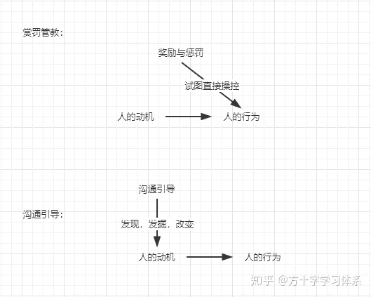

<figcaption>赏罚管教与沟通引导的差异</figcaption>

</figure>

说完外部管教的效用与局限性，让我们回到这张图：

<figure data-size="normal">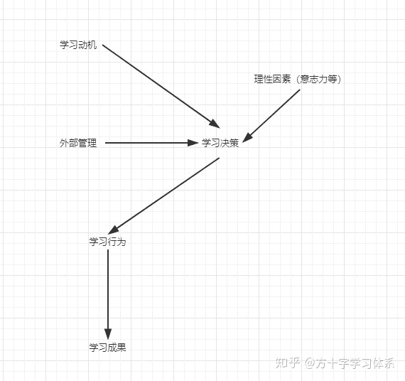</figure>

> 外因的作用再大，也是第二位的原因，而决不能撇开内因独立地起作用。内因是事物变化发展的根据，是事物发展的源泉，是事物发展的根本原因，决定着事物的性质和发展方向。

我们已经知道了，**学习动机才是根本中的根本，是矛盾的内因。没有学习动机，一切外在措施都只能缓解，而非根本性的解决问题**。那么，是什么在影响学习动机呢？

说白了：你为啥想学习？

实际上，影响动机的主要因素，可以从**短期**，**长期**两个角度进行考量。

短期的**，影响学习动机的因素，是短期的学习体验及其体验的经验所带来的预期，也就是“我对学习有什么感觉”**。

<figure data-size="normal">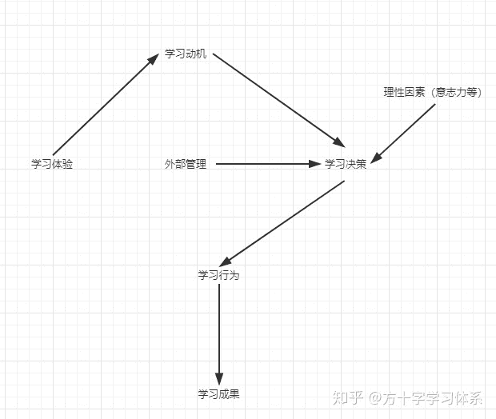</figure>

这个道理很简单，**我学的爽了，舒服了，快乐了，就想继续学下去。我学的不爽了，就不想继续学了。由于之前学的一直很爽/不爽，所以我想/不想开始学习。**

那么什么影响着学习体验呢？

最直接的，**学习行为，客观上带来学习成果，主观上带来学习体验**。

<figure data-size="normal">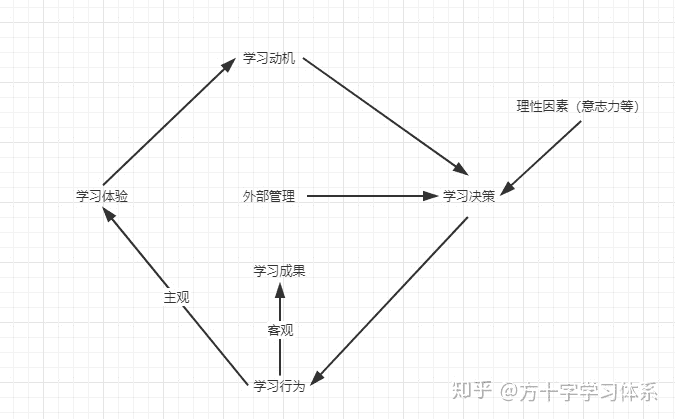</figure>

其次，外部管理也影响着学习体验。比如，外部管教通过观测学习成果（比如老师，家长看你题会不会做，分数高不高），来决定赏罚的方式，从而影响你的学习体验。当然，外部管理的影响方式是复杂的，因为除了以赏罚为基础的管教措施之外，在外部管理中，还有引导，建议，探讨等方式。我们可以这样讲：**外部管理的方式，是学习成果与学习体验的函数**。**学习成果一定，函数不同，学习体验不同。**

学习体验=f（学习成果），f：外部管理方式。

> 同样是考了很低的成绩：（1）家长对孩子打骂。（2）家长对孩子以温柔，支持的态度表示理解，安慰孩子的不开心，并愿意陪孩子客观的分析这次考试失利的原因，如何改进下一个阶段的学习。第一种便是管教的思路，第二种便是无条件的支持，客观细致的引导的思路。输入的同样是低学习成绩，两种管理方式所造成的的孩子的学习体验必然不同。

<figure data-size="normal">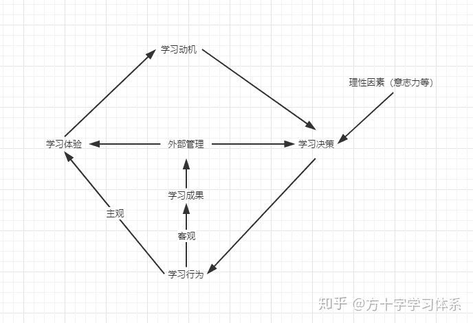</figure>

这种影响是普遍存在的，甚至在现实生活中，外部管理最终会内化为内部管理，而且可以说，**外部管理向内部管理的转化，是决定学习行为会产生何种学习体验的根源**。

自律本质上也是**外部管理中的外部管教转化为内部管理中的内部管教的过程**。**不管是自律的概念，还是对自律的评价，学生都是从外界获取的，而非天生出现的**。由于外界对自律的评价是“厉害的，精英的，NB的”等积极评价（奖励），而对不自律的评价是“穷，馋，懒，傻，笨”等消极评价（惩罚），所以当学生接受自律这个概念并运用时，对自己自律行为的评价便是积极的，不自律行为（不管是因为什么）的评价是消极的。可以说，这种自律生效的本质，实际上是源于自己内在对自己的赏罚。当这种赏罚失效时，自律也将失效。除了自律外，还有内在引导，清空冥想等内部管理方式。所以我们可以把内部管理与外部管理统一起来，统称“管理”。

<figure data-size="normal">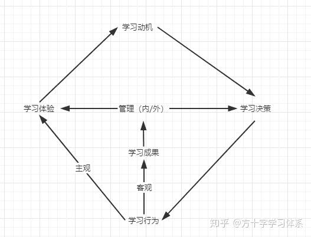</figure>

<figure data-size="normal">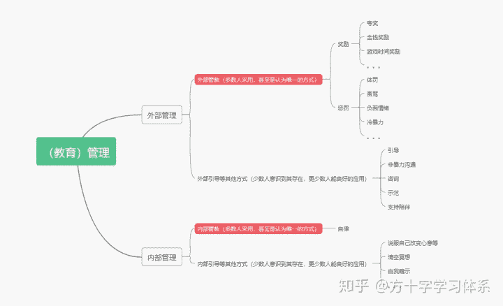</figure>

虽然**表面上看**，**学习行为直接影响学习体验**，**但学生本由白纸婴儿成长而来，其对世界各要素，包括学习在内的认识一定是源于外部**，**学生曾经与现在所接受的管理方式，往往是学习行为对学习体验的影响的根源所在**。这里举2个例子：

*   A同学小时候做数学题，碰到不会的，就去问家长，家长讲了一会，A同学还是不会，家长便非常生气，打了A同学一顿，骂A同学笨，傻，这么简单的题都不会（实际上这是错觉，对于成年人容易的问题，对于小孩，由于没有相关概念，的确难以理解）。从此，A同学就觉得，自己不会做数学题，是因为自己笨，自己傻，而且会把数学题和挨打联系在一起，不敢轻易的寻求他人帮助。长此以往，A同学的数学越来越差，数学越差，A同学的家长越是打骂。从此A同学对数学心生恐惧，并产生悲观，厌学等情绪，与抑郁症等疾病。对于A来说，学数学便是极端痛苦的。

*   B同学小时候做数学题，碰到不会的，就去问家长，家长讲了一会儿，B同学还是不会，家长耐心的讲解，陪B同学共同查资料，问更厉害的老师，并告诉B同学，这题不会挺正常，没什么大不了的，而且不断称赞B同学在求知过程中所作出的努力。当B同学短期的成绩不如意时，B同学的家长也表示理解，并共同陪B同学分析问题，补充遗漏的知识，当取得进步后，虽然排名仍然靠后，但仍对B同学所取得的进步加以表扬。长此以往，B同学觉得学习的体验是非常好的，自己在学习过程中取得的进步成就感十足，即使碰到困难，失败，暂时受挫，也能得到家人的理解与支持，并且认为有困难，突破困难，变错误为正确，是学习成长的必由之路。从此，B同学有着强烈的学习动机，愿意克服学习中的困难，坦然面对学习中的失败，不断进步。对于B来说，学习就是平静的，愉悦的，体验感良好的。

所以说，通过合理的学习策略与规划（比如合理的学习计划，难度适中的学习资料，良好的学习环境等）有助于提高学习体验，**但如果想要从根本上变负向学习体验为正向，还需要更专业的人来帮助学生追本溯源，修复与重建对学习的认识，改造那些导致学生出现负面学习体验的根本原因（比如老师/家长不当的管理方式等），从根源上解决问题。**

而**长期的，影响学习动机的因素，是“信念”，也就是“为什么我想”，“我最终想要实现什么”。**

> **我想读书，是学习动机。我想为中华之崛起而读书，是学习信念。其信念就是:“我想让中华崛起，我读书可以为中华之崛起做出贡献”。**

**信念，既可以由欲望而来，自发的生成；又可以源于群体对个体的异化**。这里“异化”是中性的。有组织的群体对个体信念的异化，也是组织对个体施加控制的方式之一，因为**个体被异化后，其需求是实现组织所要求的目标，而组织，则掌握了目标是否实现的最终解释权**。

> 比如一个人在入教之前，是一个自私的人。而入教之后，宗教组织的宣传与群体活动，潜移默化的影响这个人的信仰，最终变成了一个“敬神”的人。而宗教组织告诉他，献出全部身家，或者去某个地方打仗，便是对神的尊敬，他就会真的捐出全部身家，去某个地方献出生命，因为他渴望“敬神”，而执行组织的命令，组织便会承认他是“敬神”的。
> 同理，如果在学校中，两个班级存在激烈的学习竞争（由学校组织），那么班级中深度参与班级的同学也可能会为了所谓班级荣誉，去努力学习，从而帮助班级赢得竞争，获取全班级的认可与荣誉。

<figure data-size="normal">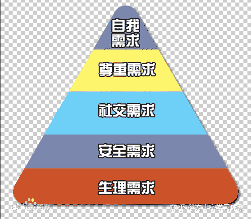

<figcaption>马斯洛需求层次理论。由欲望而来的长期信念，多发生在自我实现需求层面。</figcaption>

</figure>

<figure data-size="normal">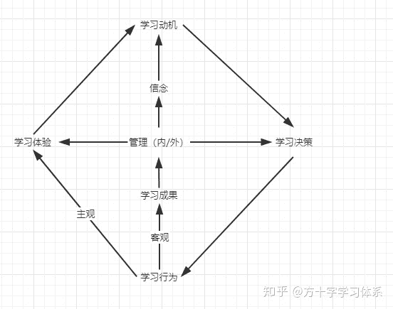

<figcaption>像不像方十字的LOGO</figcaption>

</figure>

强烈的信念，可以极大增强人的“意志力”，使人愿意为了一个伟大的意义，去经受苦难，甚至以此为乐。充分的信念可以极大的增强人的内部管理能力。

对于学习来说，只能通过学习来实现的信念，可以带来持久而强烈的学习动机，某种程度上甚至可以扭转“学习行为——负向学习体验——学习动机减弱——不做学习决策——无学习行为——体验更差。。。”这一恶性循环。

**除追本溯源的心理咨询之外，为学习建立起强大的信念，是优化学习动机的另一条可行之路**。建立信念的过程，其复杂程度因人而异，一般来说，越理智，越聪明，欲望越低，越难以建立信念。不能通过学习实现的高欲望，也对学习信念的建立有着极大的阻碍和破坏。

> 比如你喜欢的异性只看颜值不看才华。

而具体如何建立信念，上文已经指出了路线。实际上就是两个方案：

*   引导学生发现自己深层次的欲望（最好是自我实现层面的），并将此欲望与学习建立关联，也就是“follow my heart”。
*   通过群体影响并异化学生个体，使其信念与群体信念一致，而达成群体信念的必由之路是“学习”。

> 未必需要专业的，大型的群体组织，一个紧密联系的学习小组也可以起到很好的效果。

**至此，我们系统性的认识到了一些“不愿意学习”的根本原因，并提出了一些系统化的解决方案。**

> 注意，在解决矛盾1的时候，后面的几个矛盾也同时存在，我们不能视而不见，只是说，在矛盾1为主要矛盾的这一阶段，所有次要矛盾的处理方式，都要围绕着主要矛盾的解决来制定。比如，在帮助学生建立学习动机的时候，也要适当的传授学习策略，建立适当的学习资料，让学生适当的学习。但这一切工作，要围绕着“帮助学生建立学习动机”展开。比如先传授一些简单，成就感较强的学习策略，虽然不深度，但趣味性较强的学习资料等。

<figure data-size="small">

<figcaption>双击红圈为领导戴上口罩</figcaption>

</figure>

那么到这里，叶老师没说的“原本就不愿意学习的学生”我在这里说完了。接下来，**对于动机充分，愿意学习的学生，我也来分析分析为什么学习效果没有在学校好**。

实际上，当矛盾1解决之后，便会分阶段依次出现如下3个主要矛盾：

## **矛盾2：学生对高效完成学习任务的需求与学生现阶段较为零散，低效，模糊的学习策略之间的矛盾。**

## **矛盾3：当矛盾2解决之后，主要矛盾就变为学生当前的学习条件（包括学习资料，学习时间，学习工具，学习环境，学习伙伴等）与学生的实际需求不相匹配之间的矛盾**

**3.1：矛盾3最主要的方面，是学生当前所采用的的学习资料与学生的实际水平和提升成绩的需求不相匹配的矛盾。**

## **矛盾4：当矛盾3解决之后，主要矛盾就变为高学习成绩对学生所需理解，记忆知识的需求，与学生目前所理解，记忆的知识不足/不匹配之间的矛盾。**

**矛盾4解决的越好，学习成绩越高。但矛盾4之前的主要矛盾若未得到充分解决，则矛盾4无法充分解决。**

而叶老师所提出的“学习计划”的问题，实际上是包含在‘矛盾2’当中的，是学习策略问题。

从上文我们可以得知，“制定计划”只是促进学习动机提升的方法之一，但并不是根本上的解决之道。当没有充分的学习动机，制定再完美的计划，学生也不会愿意去学习，甚至没有动机去制定学习计划。当学习动机充分了，制定学习计划是一个可以让学习更高效的学习策略之一，并且计划的制定会反作用于动机，使学习动机进一步提升。

**制定计划，绝不仅仅是简简单单的复制学校的课程表。**

**制定计划**，作为一个**学习策略**，是包含在一个**策略体系**当中的。**不谋全局，不足以谋一域。想要认识计划，就要对体系全局有所把握。**

## 那这个体系是什么呢？

**不论我们是学习，工作，甚至盖楼，战争，其本质都是人类的实践过程，是人类将观念中的世界转化为现实世界的过程。**

而对于如何实践，人们形成了一套这样的方法论：

<figure data-size="normal">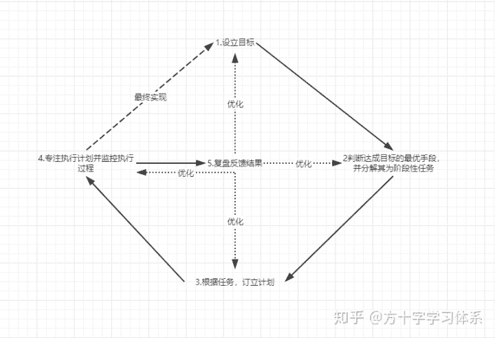</figure>

学习，也是人们的一个实践过程。那么具体到学习，是一个什么过程呢？很简单呀，每个过程之前加上学习就好了（笑）：

<figure data-size="normal">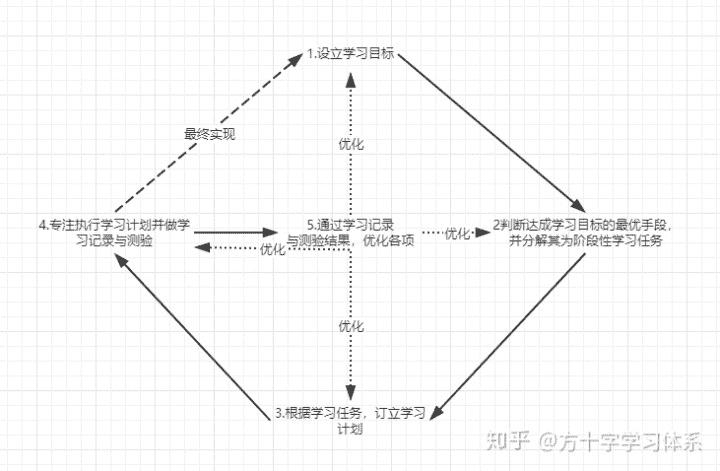</figure>

不谋全局者，不足谋一域。接下来，我们逐一分析一下这个实践体系中每一项的作用与制定方式。

> 注意了，下面这种重大目标的制定与分解，最好能寻找一位有经验的专业人士（比如有经验的老师，生涯规划师等）协助你完成。

## 1.设立学习目标

对于学习目标的设立，有两项需要注意：

*   遵循**“SMART”原则。**
*   区分**目标**与**手段**，找到**终极目标**。
*   **拆解大目标为小目标**。

**（1）遵循SMART原则**

这里以学习目标的设定为例，来讲解如何改造一个不合理的学习目标。

比如，我定的目标是“上个好大学”。那么我这个目标有什么问题呢？

首先，这条目标不具备“SMART”原则中的“S”原则，即“**Specific，明确的，具体的**”。“上个好大学”这个目标很好，但好大学很多，不同的好大学所需要做的准备完全不同，那么你就并不知道怎样才能上个好大学。根据“S原则”，我们把这个目标改为“我要高考考好，考进哈工大”，这样就明确了。

好，现在我们有了一个目标：我要高考考好，考进哈工大。这个目标符合了“S”，但不符合"M"原则，即"**Measurable，可衡量的**"。高考考好，有多好呢？我们需要一个具体的数据衡量。因此，我们查了哈工大的录取分数线：

<figure data-size="normal">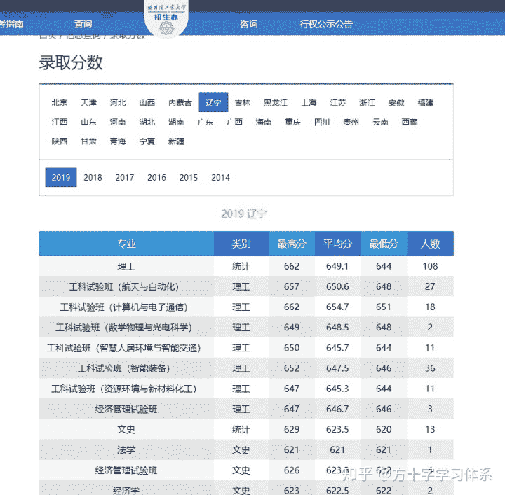</figure>

我们发现，想考进哈工大，高考卷大概需要拿650分左右。这样，目标就变成了一个可衡量的目标：我要高考拿到至少650分，考进哈工大。

假如我们刚上高一，那么我们要给这个目标订立一个时限，以使其满足"T原则（Time-bound，有时间限制的）"，这很简单，3年之后。

这样，我们的的目标就变成：3年之后，我高考至少要拿到650分，考进哈工大。

那么，你真的那么渴望考进哈工大么？3年之后，高考达到650分，考进哈工大，这个目标对你来说，可以实现么？

对应的是目标制定中的"Achieveable（可独立完成）"与"Rewarding（完成后有满足感的）"。

假如你完全不喜欢哈工大，那么该目标对你来说，就不符合"R原则"，而假如你只剩一个月就要高考了，你的分数在300分左右徘徊，那么考进哈工大，对你来说便不符合"A原则"。

那么，假如你就贼想去哈工大，非哈工大不可，并且有3年的时间可以充分学习，那么“**3年之后，高考达到650分，考进哈工大**”这个总目标便是一个合格的总目标，符合了"SMART”原则。

> ps.对于R，另一个解释是：R代表相关性(Relevant），指绩效指标是与工作的其它目标是相关联的；绩效指标是与本职工作相关联的。学生不处在工作岗位，一般来说，目标较为单纯，就是想考个好大学，而不会去思考太多“我去这个大学是为了什么”，因此暂不考虑这个角度。

**（2）区分目标与手段。**

我们时常把目标与手段相混淆，多是把手段当目标，常常手段是具体的，目标是模糊的，或者没有目标。

比如这样一个“目标”：我要在半年内背3000个单词。

假如你是个意志力非常强大的人，你真的半年内背完了3000个单词，结果呢？似乎没什么结果，英语题该做错还是做错，也没办法和外国人交流。

为什么会这样？

因为**背单词是手段，而不是目的。**

你应该问：为了什么，我要背单词？

*   可能是想在提升英语的应试能力，阅读题的准确度更高。
*   可能是想跟外国人交流。
*   可能是想挑战一下自己，训练记忆力。
*   。。。

背单词，是你达成这些目的的手段（未必是最佳手段），带着这些目标去背单词，效果会更好。

但有时，目标和手段的确难以区分。这里**给大家一个思维框架，帮助大家识别目标与手段**，并找出潜在的更优手段：

1.  多问几个“为什么我要。。。”，直到问不下去为止，即达到了“终极目标”。
2.  到达终极目标后，根据自己的现实条件，回推最优路径。

> 举例说明，比如原“目标”是“半年内背下3000个单词”，那么，为什么我要半年内背下3000个单词？假如说，因为我要跟外国人对话。为什么我要跟外国人对话？因为我觉得跟外国人对话够装币，有优越感。为什么我要装币，有优越感？不为什么。这样就问不下去了，我的终极目标是想要装币，有优越感。
> 那么往回推，为了装独特的币，有独特的优越感，结合自己的现状，能和外国人对话是最好的方法么？假如对我来说是。那么，为了和外国人对话，背单词是最好的方法么？假如我是一个知乎子弟，结合我的条件，不是。最好的方法是直接去美国的亲戚家生活半年。这样，为了达成我们的真实目的，我们就找到了一个更优秀的方法。（当然，假如不是知乎子弟，直接刻意背单词一般来说也未必是最好的方法。更好的方法比如朗读，学美剧，甚至STEAM翻墙和外国人打游戏，都是可能会。）

**（3）拆解大目标为小目标**

当你有了明确的学习目标，比如“3年之后，高考达到650分，考进哈工大”，你便需要对这样的大的学习目标进行拆解。

为什么？

因为，你面对的这个大目标时间跨度太长，执行难度太大，你一下子会不知道该怎么做，更不知道我现在应该去做什么，明天应该学什么。

因此，你需要先将其拆分为多个小的学习目标，让每个小的学习目标看上去都有可实现的路径，然后，你通过集中精力，依次攻克每个小的学习目标，最终组合成大目标的实现。这样，就可以有效降低目标实现的难度。

<figure data-size="normal">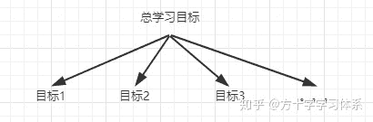</figure>

那么我们该如何拆解目标呢？

**首先，我们按空间来分解**：

想要考650分，每科要拿到多少分，每科要拿到这些分，哪些题要做对，想要做对这些题，都需要掌握哪些知识点。

这样我们就可以将“高考拿650分”这个总目标分解为“分别需要熟练掌握哪些具体的知识点”。

**然后，我们按时间来分解：**

比如你发现有500个知识点需要掌握，你计划2年内全部掌握，那么平均每年需要掌握250个知识点，平均每个月你需要掌握大概21个知识点，每周约5个。。。（当然，**前提既然是熟练掌握，那么知识点的一次学习，效果肯定不好，需要配合复习。而复习最好的工具之一，是艾宾浩斯记忆曲线，这个工具在后文会有所提及**。）

如此，当我们把学习目标分解的足够精细与精准，我们就需要把这些目标拆解为学习任务。

这里，建议把每个月的学习目标记录下来，以供参考。

<figure data-size="normal">

<figcaption>方十字记忆曲线学习日志</figcaption>

</figure>

> 学习动机，与制定学习目标是既有区别又有联系的两个概念。学习动机，是内在的追求，是存在于内心的终极需要，而制定学习目标，是把它写出来，是一个可视化的过程，好比电脑主机与显示屏的关系。没有学习动机，也就没有学习目标可供制定，有了学习动机，才能根据学习动机制定学习目标。同时，制定目标可以帮助学生更清晰，更深入的认识自己的学习动机，从而强化学生的学习动机。制定目标是表象，学习动机的存在是根本。学习动机决定了学习目标的制定，学习目标的制定反作用于学习动机。在没有学习动机的前提下，只顾研究如何制定学习目标，只顾形式主义的制定学习目标，便是无根之木，无源之水。试图片面的通过学习如何制定目标来建立学习动机，必然是归于失败的，这也是很多知乎文章分享了学习目标的很多制定方法，实则不能生效的根源所在。

## 2.制定学习任务

所谓制定学习任务，就是**把“具体的学习目标”转化为“实现学习目标的步骤”**。

比如你的阶段性学习目标，是你本周要熟练掌握某5个知识点，那么制定本周的学习任务，就是规划一下，为了熟练掌握这5个知识点，你需要学什么，怎么学，看哪些书，上哪些课，做哪些题，怎么复习。。。

这里，建议每周订立一个周任务清单，以供参考。

<figure data-size="normal">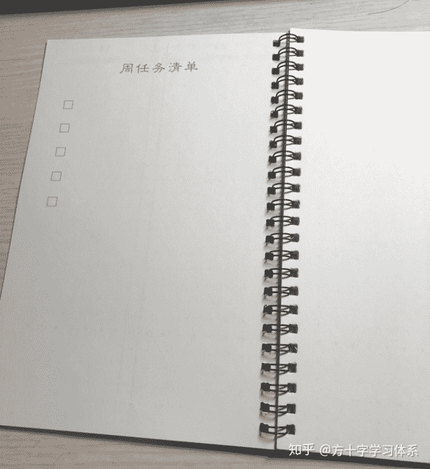

<figcaption>方十字记忆曲线学习日志</figcaption>

</figure>

## 3.根据学习任务，制定学习计划

**计划，是实现目标的路径参考。除此之外，再无其他含义。**

**学习任务，就是你“应该做什么”，是单纯的根据目标拆解而来。而学习计划，则规划出了“具体怎么做”，为你的实际执行提供真正的重要参考。制定任务时，只考虑了对目标的拆解，而制定计划时，既要考虑到应做的任务，又要考虑到计划周期内自己具体的现实情况。**

一提到计划，好多同学的感觉是这样的：因为心血来潮/老师，家长要求，模仿学霸制定了计划表，甚至细致到了“几点到几点上厕所”，结果无法执行，挫败感强烈，因此而放弃定计划。

这种状况下，当学生处于在校学习的状态时，的确如叶老师所言，学校制定了一套教学计划，通过管理的方式推给学生，学生只需要被动执行。所谓的要求学生听课，记笔记，做作业，都在这一范围内。

当学生在家学习之后，由于学生不制定计划，乱学一气，这样的学习效果肯定不如在学校有计划的学，哪怕执行学校的计划是被动的。

**但学校所安排的学习计划，一定好么？**

一个学校数千名学生，每个学生的具体情况都不一样，目前的学校，实际上根本无法根据每个学生的具体情况，制定合理的学习计划**（比如老师不可能根据每个学生的具体情况给每个学生单独留作业）**，而是根据教育局的规定，过去的经验，或者全校学生大概的平均情况来制定教学计划。这样的计划，大概率是不适合大部分的学生个体的，只有少量学生个体可以从这样的学习计划中获益颇丰。

所以，对于学生来说，不论是在校学习还是在家学习，要想进一步提升，**一定要掌握自己制定合理学习计划的能力**。而**目前对于大多数学生来说，最大的两个问题，就是看不清计划与现实的关系**，从而陷入“**计划命令主义**”或“**计划无用论**”。

## 1.计划命令主义

**所谓的“计划命令主义”，就是认为计划是绝对的，不能更改的，必须执行的，现实必须与计划相符。如果执行失败，就是自己的能力不行/不自律/没毅力。。。**

**计划，是实现目标的路径参考。除此之外，再无其他含义。**

计划是什么，**计划就是一张地图。地图只有参考意义，但绝对没有命令的意义**。假如你按照地图走，突然前面有一个沟，地图上没画，那么你需要做的事情，应该是把沟在地图上标出来，并重新规划路线。**而不是不管这条沟，严格按照地图走，直接走进沟里；或者因为自己没按照地图穿过这条沟而谴责自己，这些都是荒诞的。**

> 哪怕是制定自己给自己的计划，学生们也默认计划是带有命令性的。为什么呢？实际上是因为目前学生在管教中所面对的命令，都是以计划的形式呈现的。比如老师留的课后作业，便是以计划形式呈现的命令。而且，当学生获得计划之后，往往老师，家长会进行监督，一旦偏离计划，老师，家长便会责备学生，久而久之，学生便认为计划是强制性的，一定要严格完成的，否则会遭受惩罚。即使某一天，计划是由学生自己制定，不存在外部管教，但学生的“计划命令主义”观念已经形成，一旦偏离计划，过去老师，家长的惩罚便会内化为学生自己对自己的惩罚。

## 2.计划无用论

**所谓的“计划无用论”，就是完全否定计划的价值，认为由于现实的不断变化，制定计划时无法充分预测到现实的变化，因而制定计划是浪费时间的，完全没有用的，无法执行的。从而完全抛弃计划。**

实际上，计划就是一张地图，即使是有卫星加持的百度导航，也可能会出错。但我们不能因为局部的模糊与错误，就否定地图整体的价值。因为，虽然地图可能会出错，但是，当目标确定，但前路不明时，拥有一张相对合理的地图做参考，总归好于没有地图的无头乱撞。

> 实际上，许多学生的“计划无用论”，是源于“计划命令主义的”。由于学生错误的认为计划是绝对的，命令性的，因此，当计划的执行出现一点偏差时，学生便认为整个计划的执行都是失败的。而由于制定计划的过程中，对未来预测的有限性，与现实（包括学生自己的身心状态）存在一定的不确定性，学生执行计划时，几乎一定会出现一些偏差，因此，学生便会不断的全盘否定自己对计划的执行，久而久之，便形成了“计划无用论”。其本质，便是把计划执行的局部偏差，在观念中放大为对整个计划的否定。

那么，正确的观念是什么样的呢？再次回到对计划的定义上：**计划，是实现目标的路径参考。除此之外，再无其他含义**。因此，**计划本身完全不具备命令性**（再无其他含义）**，计划本身只具备参考性**。计划是你的工具，你的地图，你的参谋，你的秘书，你的老朋友，绝对不是你的上司领导。**计划只能是向你提供建议，而无权命令你必须遵从它的指示。**

有人便会提出疑问，说，如果计划不具备强制性（命令性），那学生制定完的计划，一定不会去执行呀，学生制定再好的学习计划，最后肯定是玩手机去了，而不是执行学习计划。

这个疑问背后的思路，实际上便是试图用命令主义的管理，来强制学生执行学习行为。而在上文中，我们已经分析出了命令主义式的管理的局限性，以及不合理的管理所带来的危害。

<figure data-size="normal"></figure>

而学生坚定的不去执行学习计划，而是去玩手机，其背后的主要矛盾，一定是**矛盾1**，也就是“**客观上的学习需要，与主观上学习动机不足之间的矛盾**。”

当矛盾1作为主要矛盾时，试图通过在学生的观念中给学习计划增添命令性来强制学生执行学习计划，便是一个不合理的，不解决主要矛盾的，扬汤止沸的方案，其结果必然是适得其反，令学生陷入“计划命令主义”与“计划无用论”当中，从而对自己的学习能力产生消极评价，反而会更加削弱学习动机。

而当**矛盾1作为主要矛盾得到充分的解决之后**，**学生渴望学习，渴望在学习中取得良好的学习成绩**，那么学习计划作为一个有效的学习工具，即使不含有任何强制性（即**理论上，学生获得这个学习计划，也可以自由的选择不执行/瞎执行/有选择性的执行**），**只要学生能够正确的认识计划的参考性价值**，那么学生一定会选择合理的参考学习计划，执行学习行为，当在出现偏差的时候并不会谴责自己或机械的执行学习计划，而是随机应变，具体问题具体分析，并根据这次的偏差情况合理的优化手中的学习计划。

上述，便是一个合理的计划观。

当我们有了合理的计划观之后，我们该如何制定学习计划呢？

很多人在制定学习计划时，存在一个误区：**错把学习任务搬运作为学习计划**，结果参考意义不大，难以执行，为什么呢？

从上文我们可以发现，学习任务完全是由客观的学习目标分解而来。**学习任务本身的生成，并未考虑到目前学生的具体情况**，并未考虑到学生目前的执行能力能否胜任这样的学习任务。如果单纯的搬运学习任务为学习计划，那么这样的学习计划大概率与学生本身的情况是不匹配的。

> 以上文拆解出的任务为例：你的阶段性学习目标，是你本周要熟练掌握某5个知识点。比如客观上来说，掌握这5个知识点，需要把《53高考》从P10做到P30，但由于现阶段你尚未建立起足够强的刷题能力，以你的能力每天最多做1页题，也就是每周最多做7页题。此时你机械的搬运周任务来制定日计划，制定“每天要做3页题”这样的学习计划，便是不合理的。
> 但你的能力是不断进步的，所以初期你制定计划，每天根据自己的实际情况，做半页或一页题，并在做题过程中不断优化自己的做题方法，做题速度，知识熟练度。随着你的能力的提升，慢慢的你就能做到每天做3页题，甚至5页题，10页题。这时，你所制定的学习计划就可以与学习任务的内容类似，甚至超额完成。

所谓“**知己知彼，百战不殆**”，这种**以纯分解来的任务做的计划，便是只考虑到了学习目标这个“彼”，而没有考虑到自己实际情况这个“己”**。

一个合理的学习计划的制定过程，一定是既考虑到客观的学习任务，又考虑到当前自身的实际情况而制定的。学习任务是制定可执行的学习计划的参考，而非学习计划本身。

**那作为学生，应该如何合理的制定计划呢？**

相信很多学生制定过这样的计划：根据学习任务，制定很长远的计划，比如每天学XXX，或者接下来的30天，几点到几点做XXX，几点到几点做XXX。。。

这样的计划有什么问题呢？

首先，从**客观**上来说，你虽然能大致预测你今天的状态如何，会发生什么事情，但你难以预测一个月，一礼拜每一天的状态如何，每天会发生什么事情。**甚至你难以预测到明后天会发生什么事情**。从上文我们得知，合理的计划，既要考虑到任务需求，又要考虑到自己的实际状况。因为你无法对长时间的每一天建立有效的预测，你也难以得知每一天自己的具体情况，所以这样的长远计划一般是不具有合理性的。

而从**主观**上来说，结合大家思维中普遍存在的“计划命令主义”，这种长远计划**剥夺了我们的自由感。**

> 当我们的自由感受到威胁时，我们会努力去恢复它。——杰克·布雷姆《社会性动物》

大家想想，比如坚持50天，每天几点起床，几点到几点学什么，每天背多少单词，看多少课，玩多久手机。。。。如此这样繁杂的规定，会感觉自己的身心在很长时间以内都要被束缚，就像蹲监狱一样，因此就会**抗拒**，**拖延**，**不愿意开始**。是啊，**谁愿意开始蹲监狱呢**？

因此：根据计划的本质与学生的实际情况，我在这里推荐一个计划的制定时间尺度：

## 每天开始学习之前，制定当天的学习计划。制定完毕后，命令自己立即开始执行10分钟。10分钟结束后，自由决定是否继续执行。（制定计划是每天启动学习的仪式）

**不要去制定明天的计划，后天的计划，周计划，月计划，都不要。只在当天制定当天的计划。周有周任务清单，月有每月目标，就足够作为每天学习计划的制定参考了。**

> 注意，这里没有任何要求你早起制定计划的含义。只需要在你开始学习之前临时制定当天的学习计划即可。即使你下午3点起床，4点坐在书桌前，准备学到10点。那你也可以好好计划一下，接下来的6个小时要怎么分配。

那么每天的学习计划，具体的制定格式是什么呢？这个，我要放在下文，与“**学习记录**”这一概念一起讲，因为这两者是紧密关联的。

## 4.执行学习计划并做学习记录与测验+日计划的制定格式+优化反馈

关于如何执行学习计划，**干就完了**，没什么好说的。

如何做测验，学名“**检索练习**”，可以有效的通过模拟测试帮助你认知你目前的学习状况，这在别的很多文章中都有详细介绍，此处不做赘述。更有兴趣的同学，可以去阅读《认知天性》。

此处重点介绍一下“**学习记录**”这一概念。

实际上，学习记录特别简单，就像航海日志，飞行日志，实验记录一样，**学习记录就是记录自己的学习过程。**但不知道为什么，目前很少有人重视这一学习方法，包括在知乎中也很少见到。实际上，**做学习记录包括但不限于如下优点**：

1.  *直观了解自己每天学习时间的长短与分布，为学习计划的制定与学习时间的统筹优化提供重要参考。*
2.  *通过记录，可以测算自己的学习速度，比如做题的速度或背东西的速度，结合学习时间与学习任务，有助于制定出更符合自己实际情况的学习计划。*
3.  *以学习记录为参考，优化自己的学习策略并监控优化的效果。*
4.  *可以作为管理的依据，比如用于打卡群打卡等。*
5.  *主观上查看学习记录会有成就感等正向反馈。*
6.  *（方十字记忆曲线学习日志独有的功能）学习记录是按照艾宾浩斯记忆曲线做复习管理的必要前提。*
7.  *。。。*

那么学习记录怎么做呢？非常简单。

比如2020年2月18号，从15：10~15：50，你背了新东方红宝书的单词，从第112页的第三个单词开始背，背到了115页的第二个单词。假如你15：50结束学习，准备休息，那么在你休息之前，便可以拿出一个普通的本子做如下记录：

<figure data-size="normal">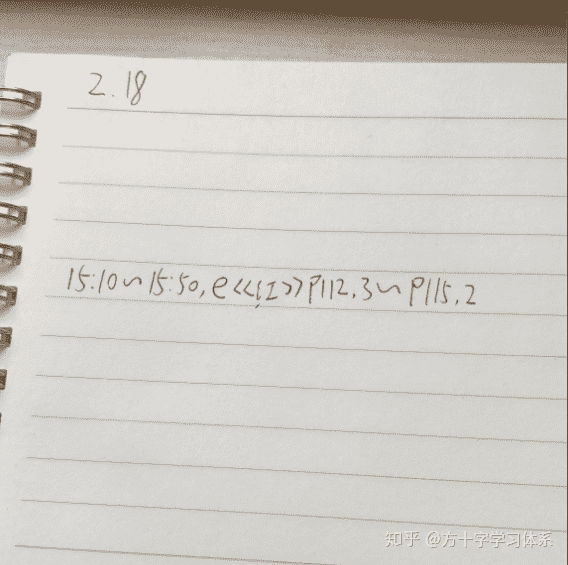</figure>

这条记录中，“e”代表“english”，即学了英语。《红》代表《红宝书》，P112,3代表112页的第三个单词。

做这样的学习记录，不需要具体的记录下来，自己都学了哪些单词，只需要记录一下自己在哪里学的即可，类似于一个目录。记录只需要保证自己能看懂即可，至少在15天之后，当你重新查到这条记录时，可以还原出这条记录的完整含义，并复原当时的学习行为。

当然，如果使用的是**方十字记忆曲线学习日志**，记录时间的方式会较为独特：

<figure data-size="normal">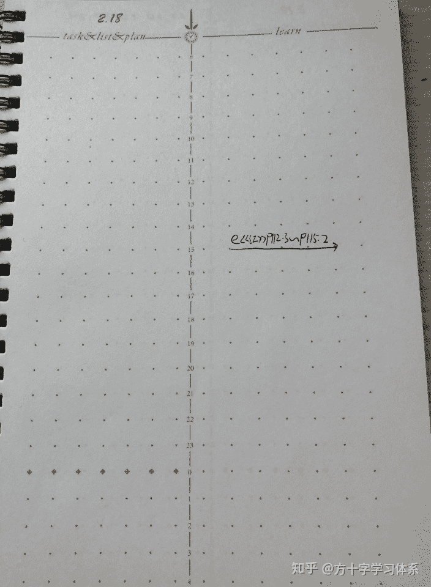

<figcaption>方十字记忆曲线学习日志</figcaption>

</figure>

> 这里右侧为记录区，中间的纵轴代表小时，记录区中的点阵，每排有7个点，每个点代表10分钟。因此，用画箭线的方式，即可表示时间，图示的时间便是：15：10~15：50 。当学习记录以这种形式记录后，相比于数字时间记录，可以更直观的看出当天的学习时间长短与在一天之内的分布。

**当你把每天每个小阶段的学习都做了记录之后，你便可以从记录中获得如下信息：**

*   了解自己每天总共能学多长时间。
*   了解自己经常在什么时间学习。
*   了解自己有多久没学习，在什么时间不学习。
*   了解自己的学习进度，结合学习时间，即可测算出自己某一项的学习速度，进而了解自己的学习能力。（比如在记录中，30分钟完成了50个单词的学习，20分钟完成了40个单词的学习，那么你就可以估算出，平均每分钟的学习你可以掌握大概1.7个单词，这就是你学单词的能力）
*   了解自己对每学科学习时间的分配
*   。。。

那这些信息有什么用呢？

## **当然有用了！**

## **这就是自己的具体情况，也就是在计划制定中，“知己知彼”中的“知己”呀！！**

**这些信息，也可以充分的解决学生们在制定计划时的一大痛点：**

由于不清楚自己每天几点开始学习，每天能学多长时间，自己的学习能力到底如何：比如不知道自己能做多少题，或能背多少个单词，因此盲目的制定出难以执行下去的计划。。。

**而当你有了这些信息之后，你便可以更加充分的了解自己的学习情况（包括学习时间长度，学习时间的分布，平均的学习速度，每个时间段内每学科的学习速度等），从而根据自己目前的学习情况，制定出更合理的计划。而当你执行计划并记录之后，你便可以根据记录，全面的了解自己对计划的执行，从而进一步优化自己的学习计划，以及时间分配，学习策略等具体的执行问题。甚至你可以根据自己的实际情况适当的调整学习任务，乃至学习目标。**

**这就是学习记录的优化反馈价值。**

<figure data-size="normal">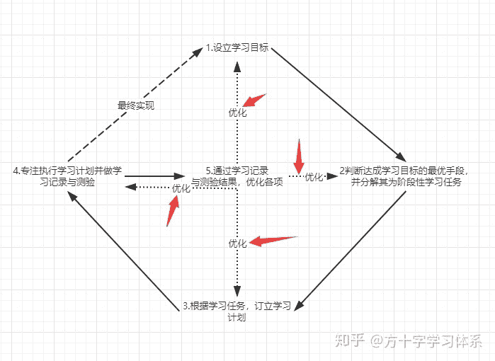</figure>

**那么，以什么格式订当天的学习计划比较好呢？**

不同人，计划管理的能力是不一样的。比如让一个从未使用过计划的小白去制定一个像学霸那样的时间作息表，小白很难去制定，执行。因为小白对自己的学习情况没有充分了解，学习习惯也尚未稳定建立。

<figure data-size="normal">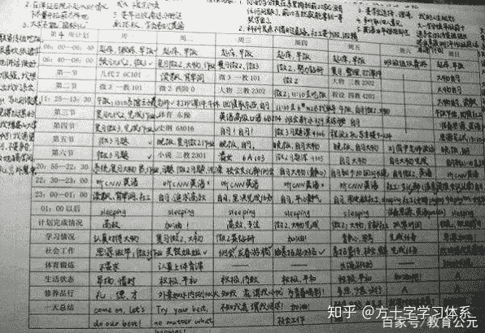

<figcaption>比如类似这样的作息表，对小白来说几乎完全没有参考价值。学霸是因为从小白成长为学霸，才用的这样的作息表，而并非因为用了这样的作息表，才成长为学霸。</figcaption>

</figure>

针对不同人不同的计划管理能力，我分了三个阶段：**小白期**，**习惯建立期**，**稳定期**。

## **1.小白期**

小白期的同学，既没有计划管理的经验，又没有稳定的学习习惯，也不清楚自己的具体情况。针对小白期的同学，我建议各位这样做日计划：

**大致参考学习任务的方向，不看任务的具体要求，计划一下“花多长时间，学什么，设置具体的学习内容，但不设置内容终点，只设置时间终点。”**

举个例子：比如今天是2月18号，我坐在书桌前准备今天的学习。我看了一下周任务清单，发现本周的任务是背红宝书的英语单词（**先不要在意任务要求你背多少单词，这就是只看方向，不看具体要求**），那么，我做出了如下计划：

<figure data-size="normal">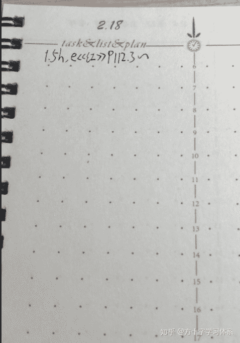

<figcaption>方十字记忆曲线学习日志</figcaption>

</figure>

注意了：**这条计划的含义是：我要今天总共要花1.5小时，背英语红宝书的单词，从112页的第三个单词开始背，背到哪算哪。**

**那么，小白期的同学为什么要以这种方式制定计划呢？**

**（1）为什么只参考学习任务的方向，不参考要求？**

一般来说，小白期的同学的学习能力不足，难以完成学习任务的要求，但小白期同学的学习能力会不断发展进步，所以这一阶段，不能强求小白达成学习任务，而是尽可能的通过执行学习了解与提升自己的能力。所以，**在参考学习目标与学习任务时，只参考方向，不参考要求。**

**（2）为什么要以时间长度作为计划完成的标志，节点？**

这条计划，本质上是**以时间长度为节点的计划**，也就是“**不管背多少个单词，只要背了1.5个小时，就算达成计划**”。除了以时间为节点的计划之外，还有：

*   **以目标的达成为节点的计划**。比如“计划今天背50个单词”便是以目标达成为节点：背下来这50个单词意味着达成计划。
*   **无节点计划**：比如：我计划今天背单词，做数学题，背课文。这就是无节点的计划。
*   **以具体时间为节点的计划**：比如“计划9：20~10：30，背英语单词”。这就是以具体时间为节点的计划
*   **复合计划：**比如“计划9：20~10：30，背50个英语单词”，便复合了具体时间节点和目标达成。同时满足“9：20~10：30我去背了英语单词”，以及“背下来50个以上的英语单词”，才算是完成这样的计划。

之所以给小白选择“以时间长度为节点的计划”，是因为相对于小白来说，**这样的计划在可控性与具体性之间取得了较好的平衡**。相对于无节点计划，更具有**可执行性**，相对于以具体时间为节点的计划，更具有**灵活性**，而相对于以目标达成为节点的计划与复合计划，更具有**可实现性**。

> 当然，由于小白的计划管理能力一般过弱，这种以时间长度为节点的计划往往也会出现较大的执行偏差，比如本来计划学1.5h的单词，最后因为种种原因，只学了0.5h。但我们要记住，计划不是命令，计划只是参考。那么，当明天，乃至以后制定计划的时候，小白便可以根据现实情况，更加合理的安排各项的学习时间。

（3）**为什么只设置具体内容，不设置具体目标**？

首先，设置出具体的学习内容是非常必要的。比如，你的计划就是“我要花1.5h学英语”，那么，学英语的什么呢？这就是模糊的，难以执行的计划。因此，**具体的计划出学习内容，是非常有必要的，也有助于立即启动，减少拖延**。

其次，因为**小白所要学习的知识都是未知的**，同时，**小白对自己的学习能力也没有充分的认识**。因此，小白根本无法预测自己在单位时间内的学习进度。同时，一个学习项目总体的平均难度一定，但阶段性的难度有难有易，这是小白无法把控的。因此，**若想让学习计划对于小白来说有足够的可执行性，现阶段就不要设置具体目标了**。而后期，**当进入稳定期后，学生对自己的学习速度有充分的了解，便可以计算出自己想要学完这些知识，需要花费大概多长时间。那么，对于那个阶段的学生来说，制定目标节点的计划，与制定时间长度节点的计划，便没有差别。**

> **对于小白，可能不知道自己每半个小时能背多少个单词。假如他的英语学习能力特别弱，实际上每半个小时只能背10个单词，但小白并不知道。看人家学霸每天背200个单词，便机械的照搬学霸的计划，计划自己每天要背200个单词。结果导致每天要花10个小时背单词，这显然是荒谬的。**
> **而对于稳定期的同学，在学习记录的帮助下，他知道自己每天最多能背2个小时的单词，现在每半个小时大概能背50个单词。那么对他来说，他计划今天背100个单词，与他计划今天背1个小时的单词，便是等效的。**

**除此之外，还有一个小问题：多条计划如何排布。**

一般来说，有如下排布方式：

*   随机排布
*   重要紧急度
*   容易度（先难后易，或先易后难）
*   要事优先（important list）
*   艾.维利时间管理法
*   。。。

不同的学生对于不同的计划项排布方案各有偏好，大家可以都尝试一下，然后采用自己最喜欢的执行计划的顺序。在“**方十字记忆曲线学习日志本**”中，可以兼容各种各样的计划排布与计划制定方式。

<figure data-size="normal">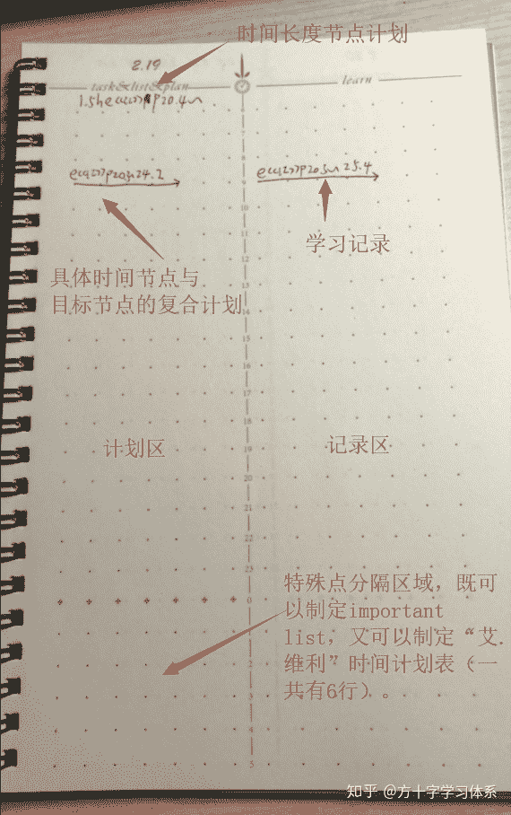

<figcaption>方十字记忆曲线学习日志</figcaption>

</figure>

## **2.习惯建立期**

当你掌握上文的**学习记录能力**与**日计划的制定能力**之后，你便进入了习惯建立期。

在习惯建立期的过程当中，由于你较为熟练的掌握日计划的制定和学习记录能力，你一定已经初步的了解了自己的现状。比如自己一般的学习时间的长度，分布，自己的学习能力，学习速度等。而此时，你的学习能力随着你不断的学习，会有较快的增长。

在习惯建立期，你便需要**正视自己的学习能力与客观的学习任务要求之间的差距**，并作出改进。改进思路一共有三个：

**（1）认识到学习能力的自然进步。**

以数学题为例，同样的题型，第一次学习，或第一次碰见，可能需要花费很长时间才能学会。而对于你来说，第二次，第三次再碰见，你可能就可以很快的将题做出来。

对应到学习速度上，便是即使你什么都不改变，你数学做题的速度，也会是先特别缓慢，然后急剧加快，最后稳定在一个水平上。

那么，你就会意识到，当你计划数学题的学习时，你要做好心理准备：前期可能会大大的落后于学习任务要求，而中后期会不断的超额完成任务。

**（2）增加学习时间**

这是最直接的方法，一般来说，也是效果最差的方法。**一定要在合理的范围内统筹学习时间的安排，不能顾此失彼，更不能盲目的增加时间以追求阶段性的学习任务的完成。**过长的学习时间可能反而会导致学习效率的降低，最终导致学习效果不佳，而主观上来说，（非心流状态的）过长的学习时间会降低学习行为的体验，最终损害学习动机。

**（3）改进学习策略，创造有利条件**

这是大家需要额外学习思考的方法，一般来说，也是效果最好的方法。我们都知道：**学习效果=学习时间x学习效率**，而学习策略越适合你， 学习效率越高，学习时间一定，学习效果越好。在合理的认识到自己学习能力的自然进步的基础上，建立更加科学合理的学习观念与学习方法，是比盲目的增加学习时间更有效的方案。

除此之外，学习当中的所有环节都可以进行思考，优化，比如在哪学习，用什么文具学习，和谁学习(可以参考5W1H）等等细枝末节的问题，都可以进行优化，最终都会对学习效果的提升有帮助。这种优化过程，统称为“创造有利条件”

**别忘了，矛盾2是学生对高效完成学习任务的需求与学生现阶段较为零散，低效，模糊的学习策略之间的矛盾，而不是学习时间长短之间的矛盾。**

对于方十字的学习观与背后所包含的学习策略，分享在文末的文章链接中。知乎上也有很多大神分享了很多不错的学习策略，各位不要盲从，可以根据自己的实际情况参考试验。

当学生在这个阶段，通过不断的调整改进，使每天的学习计划逐渐符合合理的任务要求，不断深化对自己的学习情况的认识并不断优化自己的学习策略、时间安排后，学生会逐渐养成固定的学习习惯，学习情况也趋于稳定。这时，**可以通过“尝试预测”的方式来检验自己是否进入了下一个阶段。即尝试根据过往的记录和计划管理经验，来预测明天，后天，甚至一周之后，会在什么时间学习，每天学多长时间，学到哪里。如果可以稳定的建立起对明天，甚至一周之内的学习情况的预测，那么就说明已经进入了下一个阶段：稳定期。**

## **3.稳定期**

处于稳定期的同学，拥有了较为稳定的学习习惯，较为良好的计划管理能力，对学习任务要求与自己的具体情况都有较为深入的认识，掌握较为合适的学习策略。这一阶段，可采用的计划形式大大增加，同时，在充分认识计划的本质的前提下，也可以根据自己的实际需求，适当的制定更长期的计划，逐步形成类似“学霸作息表”那样的计划。

> 此处千万不能教条主义，要抓住问题的本质。采取“当天制定当天的计划”这一时间尺度，其本质是在于你难以建立起对一天之后的稳定预测。如果你的作息，学习规律非常稳定，那么如果你可以稳定预测你明天，后天，甚至这一周的每一天的具体状况，预测准确率非常高，那么你据此制定多天的计划，甚至一周，一个月每天的计划，便是合理的，有很强参考意义的。同时，客观上来说，计划时间跨度越大，出现偏差的概率也一定越大，这不可避免。此时，万万不可陷入“计划命令主义”与“计划无用论”的错误观念中，牢牢抓住“计划是学习实践的参考”这一理念，当出现偏差时，灵活应对，具体问题具体分析，并不断优化计划。

在日计划的制定中，依然可以遵循“小白期”的计划制定格式。但计划效果，已与小白期完全不同。由于对“敌我双方”充分了解，虽然格式相同，但计划对现实学习的掌控力更强，可以更好的实现更精细的学习任务。

除“小白期”的计划格式之外，也可以根据需求，制定“以具体时间为节点”的计划，甚至"复合计划"。

<figure data-size="normal">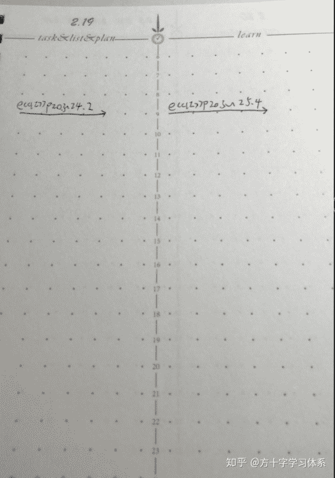

<figcaption>方十字记忆曲线学习日志</figcaption>

</figure>

比如上图所示：**左侧是计划，右侧是实际的学习记录**。这里便是一个**复合计划**。计划了在2月19日的9：00~9：40，背完英语《红宝书》的20页第3个单词至24页第二个单词。而在实际的学习中，我在9：00~9：40这段时间内，背完了20页第三个单词到25页第四个单词，超额完成了计划。**制定这样的计划，一定是建立在我对自己的学习时间规律，英语单词的记忆速度，英语单词的学习任务等信息充分了解的前提下，才能有效制定并执行。**

**处在这个阶段，可以进一步优化学习策略。当学习时间相对于完成学习任务过分充裕时，便可以适当的缩减学习时间，增加健康的娱乐活动与休息。而充分的休息，又有助于提高学习效率，从而提升学习效果，进一步的缩短所需要的学习时间，进而步入“学神般的正反馈循环”。**

<figure data-size="normal">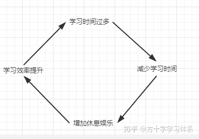

<figcaption>大概这就是学霸吃好喝好玩好也能学好的原因吧</figcaption>

</figure>

上述，基本就是一个完善的**学习管理方案**，包含于**方十字的学习策略**中。除此之外，方十字的学习策略还包含着**具体的应试学习观**与**一些具体学科特殊的应试学习与训练方案**。对于应试学习观，各位可以阅读这篇文章：

而对于具体的一些应试学习训练方案，可以进入我的主页，查看往期的文章，方十字也将随着发展实践，不断补充。

**ps.**图中不断出镜的**方十字记忆曲线学习日志**，最NB的并不是**记录**与**计划**功能，

## **而是可以非常便捷的利用艾宾浩斯记忆曲线对任意学习内容建立复习管理！！！**

<figure data-size="small">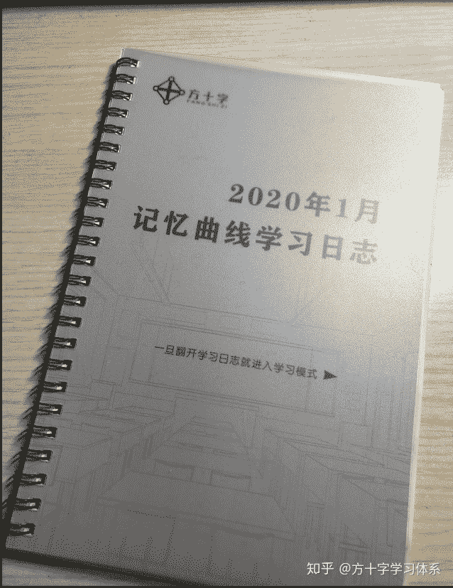</figure>

<figure data-size="normal">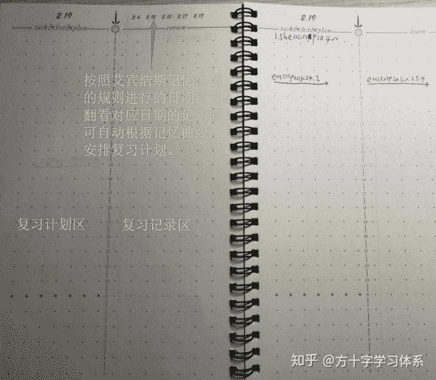

<figcaption>方十字记忆曲线学习日志</figcaption>

</figure>

对于方十字记忆曲线学习日志感兴趣的同学，可以移步这篇文章：

**至此，对于矛盾2，对于如何做计划等学习策略方面的问题，上文提出了一些较为完整，系统的解决方案。**

<figure data-size="normal"></figure>

当矛盾2得以充分解决后，让我们回顾一下矛盾3与矛盾4：

## **矛盾3：当矛盾2解决之后，主要矛盾就变为学生当前的学习条件（包括学习资料，学习环境，学习时间，学习伙伴等）与学生的实际需求不相匹配之间的矛盾**

**3.1：矛盾3最主要的方面，是学生当前所采用的的学习资料与学生的实际水平和提升成绩的需求不相匹配的矛盾。**

## **矛盾4：当矛盾3解决之后，主要矛盾就变为高学习成绩对学生所需理解，记忆知识的需求，与学生目前所理解，记忆的知识不足/不匹配之间的矛盾。**

**矛盾4解决的越好，学习成绩越高。但矛盾4之前的主要矛盾若未得到充分解决，则矛盾4无法充分解决。**

我们都知道，要抓住主要矛盾，而且要抓住主要矛盾的主要方面。为什么矛盾3的主要方面是学习资料的矛盾呢？因为应试学习其本质过程的第一步，便是从合理的资料中获取所需要的知识。其他的条件，都是对这个过程的辅助。因此，在动机充分的前提下，即使学生没有好的学习场地，好的学习伙伴，没有好听的音乐等条件，学生也能完成学习。有了这些好的条件，只能说是锦上添花。但如果学生没有合适的学习资料，那么其他条件再好，矛盾3也无法得以解决。因此，可以说“学习资料的矛盾”是矛盾3的主要方面。下文，我们也将主要讨论该方面，而不去探讨学习环境，伙伴等其他条件的影响。

实际上，在矛盾1，2，3得到充分解决的前提下，矛盾4的解决便是学生主动的，自发的，无需干预的一个过程。**它是矛盾1，2，3得到充分解决的一个结果，而并非是一个强制性的过程（也难以强制）**。因此，我们完全无需讨论矛盾4 。上文我们已经讨论完了矛盾1，矛盾2，**接下来，我要讨论讨论矛盾3 。**在接下来的文章里，我要**提出一个概念**，**讨论一个学习环节**。

首先，我要做一些铺垫性的工作，借用一些“[方十字应试学习观](https://www.zhihu.com/question/20416520/answer/920498567)”当中的内容，来讲解一下矛盾3是怎么来的。

所谓应试学习，是什么一个过程？

**本质上，应试学习的过程就是从各种学习资料中获取考试所需的知识，然后不断的理解，应用，复习，最后达成记忆。考试，考察的是你对所考察的知识的理解与记忆水平。**

<figure data-size="normal">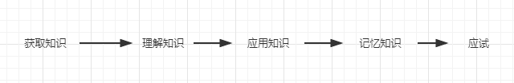</figure>

**这是一个动态的过程，而由人来执行的动态过程，必然需要人的主观能动性。**

矛盾1，就是讨论了人的主观能动性的问题。如果没有主观能动性，这个过程难以运行，那么过程中的每一个环节都是无意义的。

而矛盾2，讨论的是各个阶段如何更有效的运行。如果各个阶段的运行是低效的，那么即使运转时间再长，给予的知识再有效，其最后的效果也是不好的。如何理解知识，如何应用知识（包括模拟自测，费曼技巧等“学习技巧”，便属于应用知识的范畴），如何记忆知识（包括应用过程中的被动记忆，需要的主动记忆，以及主动记忆中的记忆术与复习），如何从整体上对整个过程进行管理，这些都隶属于学习策略的范畴。

而矛盾3，便是回到最开头，学什么东西呢？学习策略再好，如果学生用的学习资料不好，那最终的效果也一定不好。好比说，一个工厂，生产设备再精良，如果原材料不好，那最后出产的产品，也一定是次品。

那所谓的“学习资料”，都有什么呢？也就是说，**目前，全面的来看，学生都从哪里学的习呢？**我们试着列举一下：

*   学校课堂老师
*   课外补习班老师
*   其他同学
*   学校教材
*   教辅书
*   习题册
*   视频直播课
*   视频录播课
*   知乎，b站等网络平台
*   。。。

这些学习资料，它们的共性是什么？实际上，**它们的共性，都是承载了知识，可供学生获取。**

**我们所学习的一切“知识”，本质上都是“信息”。**

**而这些“学习资料”，承载了学生所需要的信息，就像是这些信息的“源泉”一样。因此，我们管他们统称为“信息源”。信息源，由信息的集合与信息渠道共同构成。而每个单一的信息源相互组合，便构成了“信息源体系”。**所谓**信息源体系**，就是我要提出的“**一个概念**”。

## 对于应试，信息源与信息源体系只有唯一一个功能：输出信息。除此之外，再无其他。

> 比如数学教材是一个信息源，学校数学老师是一个信息源，数学教辅书是一个信息源，数学练习册是一个信息源，数学家教老师是一个信息源。这5个信息源，便共同构成了某个学生数学学习的信息源体系。

<figure data-size="normal">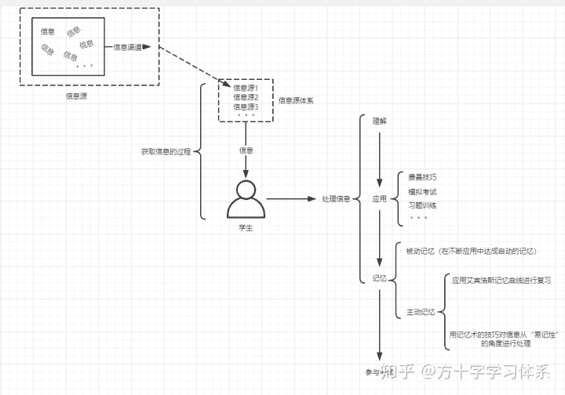

<figcaption>信息渠道，就是你通过什么途径获取的信息源中的信息。比如老师讲课，声音便是渠道。看教材，文字与图案便是渠道。</figcaption>

</figure>

实际上，从本质来说，疫情导致大家从在校上课学习变为在家看直播学习，就是一个信息源发生变化的过程（信息没变，但信息渠道发生了变化）。而信息源的变化，势必会影响学生客观的学习效果，以及主观的学习体验。当然，这种影响有好有坏，我们不能一味的认为视频课必定劣于线下课，而是各有优劣，对于不同的学生来说，效果各有不同。

**因此，当我们建立“信息源体系”这一概念之后，矛盾3便可以这样描述：**

## 矛盾3：学生目前所应用的信息源体系与学生的实际水平、偏好、提升应试成绩的需求不相匹配的矛盾。

而解决这一矛盾，从方法上来说，实际上非常简单：首先通过细致的调查与测试，了解学生的实际水平，然后根据学生的实际水平，各信息源的优劣，现实条件，学生对信息渠道的偏好（比如有的学生擅长听讲，有的学生擅长看文字，有的学生喜欢听女朋友讲。。。）等实际信息，为学生搭配出一套适合他的信息源体系。再通过学习记录与后续的测试，不断优化这一体系，最后达到客观上高效，适用，主观上学生对该体系满意的效果。

<figure data-size="normal">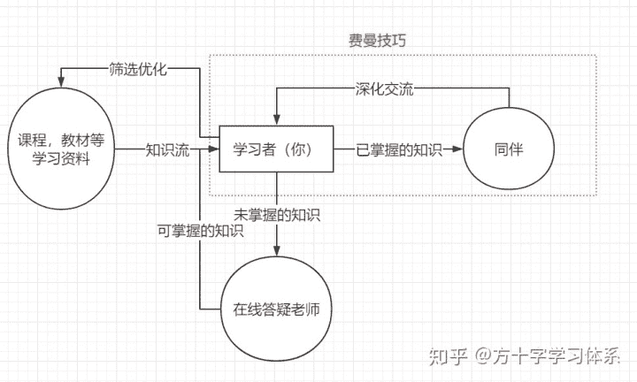

<figcaption>在“考研数学怎么学”一问中，方十字所构建的一套信息源体系。</figcaption>

</figure>

从理论上来说，不论是信息源的概念，功能，还是如何建立信息源，都是简单，直观的。也就是说，**从理论上来讲，解决“矛盾3”，是较为直观，容易的。**但在实践过程中，会遇见诸多困难。目前普遍存在于当前教育体系参与者（尤其是学生）的观念中的三大实际问题，是对信息源的“**唯一主义**”，“**教条主义**”与“**管教主义**”。这三大问题，犹如**三座大山**，**严重的阻碍了矛盾3的解决。**下面，让我们一一分析。

首先，再次强调正确的观念：**对于应试，信息源与信息源体系只有唯一一个功能：输出信息。除此之外，再无其他。**

> *如无必要，勿增实体。——*奥卡姆剃刀定律

## **1.教条主义（权威主义）**

所谓“教条主义”，便是**不加甄别的认为，某一信息源所输出的所有信息都是对的，都是应试中用的上的，都是需要全盘接收的。**

比如学生认为，老师说的话全都是对的，老师上课讲的每个东西，都要承认，都要全盘学习，根本不会质疑老师所输出的信息是否有错误。

实际上，任何信息源所输出的信息：

1.  **未必是全对的。**
2.  **未必是为你的应试目标所需求的。**

对于第1点，一般来说，具体的学科知识很难出现错误，更多的是不正确的学习观念与学习方法，**比如我们经常听老师说的：只要学不死，就往死里学，或“生前何必久睡，死后必将长眠”。包括下一条“唯一主义”，其生效的根本原因也来源于这样的“教条主义”。**

对于第2点，则更多的出现在信息源所输出的具体学科信息上。比如教材中所写的某个公式的具体推导过程非常难，但考试只考这个公式本身如何应用，考察的也很简单。那么实际上，**教材中“公式推导"这一信息，实际上是为了完善教材中知识体系的逻辑链条的完整，而非专门为了应试**。**如果你的目的是为了应试分数，就应该直接获取该公式以及其考察方式，而非浪费时间去学习，记忆它如何被推导出来。**

## **2.唯一主义**

所谓“唯一主义”，便是**认为，某些信息只能从某一个信息源获取，除此之外，再无其他获取方式。**

举例说明：老师上课经常说：“**大家认真听讲，这个知识点我只讲一遍，不听就学不会了，别想着能从别的地方学**”。老师的本意，是**希望学生听他讲课**，但学生**信以为真**，一旦**走神**，或者整堂课的**听讲效果不好**，便真的认为，这些知识只有这个老师讲，而且只讲一遍，如果听不懂就真的学不会了。因此，**客观**上学生**放弃了从其他信息源搜索这些知识的努力**（哪怕老师讲的东西明明白白的写在了教材上），**主观**上不断的**谴责，否定自己**，产生严重的**负面学习体验，乃至产生“习得性无助”，放弃学习。**

**实际上，万万不要迷信老师所说的“只能听我讲”等概念。我们在应试学习中所学习的知识，一定都是人类早就已知的，可以从许多信息源中获取的知识。一般来说，学校老师并不创造知识，老师只是知识的中介之一。比如数学老师上课讲的让你惊艳的解题方法，实际上在许多教辅书中都可以轻松获取，或者你在b站的视频课中，也可以学到一样的，类似的，甚至更好的解题方法。**

不同学生适合的信息源不同，有的学生真的难以在线下课堂的听讲中有效的获取信息，而是擅长通过文字书籍，视频课程，习题训练等其他信息源获取与掌握知识。因此，**学校课堂没听懂，没听进去，甚至一堂课都不听，实际上不是什么大不了的事。同样的信息，你只要找到适合你的信息源或信息源体系来获取即可。比如同样的数学知识点，如果你上课没听懂，那么课后（甚至课上）你完全可以，且应该看教材，看教辅，甚至去b站听网课来学习。**

但很多学生会说，自己没办法那样去做，比如课后时间太短，课后作业太多，学校不让拿手机等等。这些理由是客观存在的，其本质原因，便是下一条：**管教主义**。

> 实际上，单就信息源输出信息的角度来说，视频录播课在一定程度上是优于线下课与直播课的。因为视频可以随时开始，随时结束，随时快进，随时暂停记笔记，无限重播，并且有更多的教学资源可供选择，学生完全可以根据自己的实际情况选择适合自己的教学视频，而这些功能，线下面授课，网络直播课（不包括对直播课的录播），则几乎完全不具备。
> 从信息源的角度来说，视频课的缺陷主要在于缺乏互动，信息输出方无法根据学生的实时状态动态的调整教学内容。但这并不是大问题，大多数线下老师也无法做到。
> 实际上，目前可汗学院，慕课等录播课，总体效果不如线下课的根本原因在于：绝大多数学生尚未解决矛盾1与矛盾2，尚未建立充分的学习动机，而视频录播课完全不具备管教性。因此，对于这部分学生，他们根本不会去主动看视频，主动从视频中获取信息，也就没有学习效果。**但其根源不在于视频课不优秀，而是在于矛盾1，矛盾2尚未得到充分解决**。如果不解决根本矛盾，只是为信息源增添管教性，便陷入了下文所要介绍的“管教主义”当中。
> 在阅读下文之前，让我们放松一下，欣赏一个精彩的数学视频课。

## **3.管教主义**

> “上课认真听讲”这一理念，既包含了“唯一主义”，又包含了“管教主义”。

**管教主义，就是信息源在“输出信息”这一功能的基础上，增添了“管教性”，从而“绑架”了学生的学习，取消了学生自主学习的权力。管教主义存在的根本基础，在于教师，学校等信息源掌握了针对学生的“合法伤害权与“”资源分配权”，从而在一定程度上获取了控制学生的权力。管教主义是这三座大山中最复杂，最难以处理的大山，也是“教条主义”与“唯一主义”存在的根本原因。**

管教主义，本质上是某些信息源（老师，学校等）取得了对学生的权力，而具体的表现上，是普遍的，多样的，甚至已经被全社会默认为正确的，道德的。

比如“要求学生必须完成作业”，便是一个典型的管教主义观念。如果你认真的阅读上文，便可以知道，**作业的本质是学校的计划，以命令的形式要求学生，而非完全适合每个学生实际学习情况**。再比如，要求学生上课必须认真听讲，不许开小差，不许看课外书，不许吃东西，不许喝水，种种规矩，便是管教主义。甚至，**老师拿学生发泄情绪，乱用惩罚，竖立权威，满足自己的权利欲，其本质也是管教主义的生效。**比如因为一点小错误的“罚抄，罚写”，比如学生去问老师问题时，被老师怒骂“这么简单的题怎么都不会”便是管教主义的典型场面。

> 实际上一个好的答疑老师只负责客观的告诉学生答案，解答学生想要知道的任何问题，就像作业帮APP一样，根本不会因为学生“问了蠢问题”而“大加责骂”。比如你在淘宝找答疑老师，他要是骂你，你可以分分钟骂回去，还可以给个差评。

**从本质上来说，对于应试，信息源与信息源体系只有唯一一个功能：输出信息。除此之外，再无其他。对已经解决了矛盾1，矛盾2的学生来说，除了“输出信息”这一功能外，若增添了“管教性”，则纯属附赘悬疣，画蛇添足。**

不过不得不说，从整体上，从学生群体，而非学生个体的角度来说，管教主义一定程度上的确能够提升学生群体的学习效果。为什么呢？

因为，由于落后的家庭教育观念，落后的应试学习观念，落后的学习方法，对学生学习动机的不重视与破坏等种种复杂的原因，可以这么说，**目前学生群体中，绝大多数学生连矛盾1都未能充分的解决，更别说矛盾2，矛盾3了**。当这两个矛盾没能解决时，我们可以很轻易的理解，**如果放任学生不管，这些学生便不想学，也不会学。**而**由于**“**有学习行为，学习效果一定优于无学习行为**”，通过管教主义的命令强行要求学生执行学习行为，在学生没有学习动机的前提下，其客观的学习效果，一定好于无管教的放任。这也是疫情期间，普遍在家上网课，学习效果下降的原因之一：管教程度被削弱了。

> 衡中，毛坦厂等，便是管教主义的极致。

但如果仔细阅读过全文，我们知道如下两个结论：

*   **管教本身只缓解问题的表面，不解决问题的本质。管教带来的“好”，也是低水平的好。**
*   **不当的管教会破坏学习动机，使矛盾1更难以解决。当矛盾1足够强大时，管教也将完全失去作用。**

<figure data-size="normal"></figure>

对于这样的学生，合理的做法，实际上首先应该系统性的解决矛盾1和矛盾2，尤其是矛盾1。而不是急于用管教的手段强制其执行学习行为。急于用管教的手段强制其执行学习行为，好比因骨折而疼痛，却不治骨折，只吃止痛药一般荒谬。其效果必然是低效的，短期的，乃至最终无效的。

而对于矛盾1，矛盾2已得到充分解决的同学来说，除了少部分学习情况刚好与学校的教学计划相匹配的幸运儿（也就是那些上课能认真听讲，课后能认真完成作业，最后考高分的“标准的好学生”）之外，“管教主义”对于这样的学生，几乎完全是负面作用。为什么这么说呢？请看下图：

<figure data-size="normal">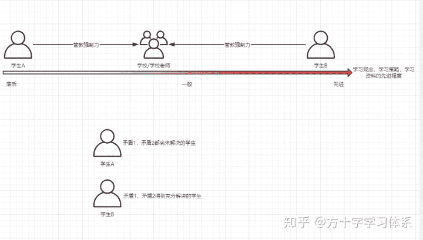</figure>

> 由于当前绝大多数学校，班级的资源有限，认识不足。学校，班级只能大其概的照顾群体，而非解决每个学生的个体问题，个性化的“因材施教”（比如，老师只能给全班留作业，不可能充分调查并根据给每个同学的具体情况留不同的作业）。因此，对于解决了主要矛盾的高层次学习者来说，学校所推行的教学计划，学习策略，信息源体系等要素，大概率是零散的，低层次的，不适合自己的。因此，在图示中，处在学生B的左侧。

由此图可见，管教主义可以将毫无学习动机，毫无学习策略的同学拉向学校的平均水平，因此学生A会得到低水平的提升。但与此同时，管教主义也会把**拥有更先进的，更适合自己的学习观念，策略的学生B拉向学校的平均水平**。因此，**对B来说，这种管教主义，几乎没有任何正面意义**。

> 注意了，此处的“先进”，指的是学生的学习观念，学习策略，所选择的学习资料适合自己，并非目前的学习知识量已高于学校的平均水平。比如一个刚入学的高中生，其学习知识量为0，但由于他在初中阶段，找到了完全适合自己的学习方法，在大神的帮助下，找到了适合自己当前水平的学习资料，那么他大概率，是比学校“先进”的。
> 比如对于学生B来说，学校某一科的授课速度过快，老师的讲课过于无聊等原因，导致学习状况不佳，不适合自己，那么理论上，B在该科，就应该在一定程度上脱离学校的教学，采用适合自己的方案学习。但由于管教主义的存在，B可能完全无法脱离学校的教学，比如由于学校不让带手机，作业过多，难以迅速完成，但又必须写完等原因，B同学没有额外的时间和资源来从其他信息源中获取所需信息，因此B只能硬着头皮听学校的课，最终效果不佳。

**那么，对于矛盾1，矛盾2已得到充分解决的同学来说，如何解决这一问题呢？如何削弱，乃至取消这种管教主义对自己的阻碍呢？**

首先，管教主义源于学校，老师对学生的**控制权**，而这种控制权的背后，本质是**暴力**。这种暴力，**未必是肉体的暴力**（体罚目前已被禁止），更多的是**情绪暴力**，**语言暴力**，**精神暴力**，由老师所引导的**舆论暴力**（由于被老师轻视，而被同学孤立），以及当老师与家长联合之后，老师**间接的肉体暴力与精神暴力**（老师找家长，家长打骂孩子）等等。认清这一点，我们便知道，解决这个问题的方案，必然是充满**斗争性**的，**博弈性**的方案。

在没有第三方参与的前提下，方十字对该问题的解决提出了3个要点：

*   **坚定科学的认识**
*   **开展合理的斗争**
*   **进行适当的妥协**

其中，**坚定科学的认识，是解决这一问题的必要条件。**学生自己一定要**清醒的认识到**，**这种管教主义对自己接下来的学习是有巨大阻碍的，是需要解决的。**能够认识到，**信息源不应该是你的上司，你的领导。信息源应该是你的工具，是那你随时可以调用和利用的工具。**信息源**只能为你提供信息，无权对你施加任何管教**，包括是否从该信息源中获取信息，也是完全由你自己决定。（想想，如果视频课老师因为你暂停了视频，突然跳出来骂你一顿，这是不是个挺荒谬的事。实际上，学校老师因为你没听进去课，把你骂了一顿，也是一件一样很荒谬的事，只不过发生的多了，大家也就见怪不怪的默认了，甚至认为“本该如此”）

接着，我们要根据具体情况，开展合理的斗争。**斗争是解决这一问题的核心步骤。**当然这里的斗争，并不是要求学生对老师施加对等的暴力（这是不合理的，情绪化的斗争方式），而应该是这样的思路:**坚定科学的认识，并联合一切能联合的资源，包括老师本身，从而逐步削减学校老师可采取的暴力手段，使其暴力程度与种类下降至自己可接受的范围之内，乃至消解暴力。**

> 上兵伐谋，其次伐交，其次伐兵，其下攻城。故善用兵者，屈人之兵而非战也。——《孙子兵法·谋攻篇》

坚定科学认识，可以提升自己对暴力的“抵抗力”。而联合一切能联合的资源，是你所能采取的最合理的斗争手段。

坚定科学认识，便是你自己与科学的学习观念相联合，这样，老师便无法通过“不管你”这样的“精神冷暴力手段”伤害你。正好你还不需要老师管呢！

如果你可以和父母陈明利弊，达成共识，与父母建立统一战线，那么老师便无法通过“找家长”的方式伤害你，并且父母可以帮助你与老师展开谈判。

如果你可以在班级广交好友，那么，老师便无法通过舆论暴力伤害你。

最后，如果你可以和老师开展谈判，陈明利弊，达成共识，则在某种程度上，算是从源头消解了暴力。

**毕竟，你和父母，老师存在着一个共识作为基础：都希望你的成绩提升。只不过路线出现了分歧罢了。这是可以以“外交”作为主要斗争方式的共识基础。**

当然了，这是最理想的情况。实际过程中，你爸妈可能不听你的，你的老师完全理解不了你的意图，你也不善于和同学打交道。最终你的战友只有你自己。。。

## **不止你自己，方十字永远和学生们站在同一条战线上。**

## **未来，方十字将作为强力的第三方学习策略咨询公司，帮助大家与学校，老师，家长展开谈判，为学生们争取自主学习的权力。**

但不好意思，现在的方十字连毛都没长齐。。。那可怎么办呢？

那就需要大家进行**适当的妥协。怎么妥协呢？**

首先，在坚定科学认识的前提下，希望各位同学可以清醒的认识到头脑中一切的“**学习道德**”的本质，并根据自己的实际情况，有所扬弃。什么是学习道德？便是那些老师判定你为好学生的行为准则，诸如“上课必须认真听讲”，“课后作业必须独立完成，不许抄作业”，“考试不得抄袭”等观念。

在这个基础上，意识到，老师的监管能力绝对不是百分之百的，一定是有很多漏洞的。那么，这些漏洞，就可以为我们所利用。比如作业太多，我们便可以找答案，尽快的把作业抄完，或者付费请人代写那些过于机械，繁杂，不合理的作业。比如课堂时间过多，过长，我们可以利用本科目的课堂去学习自己所需要的知识，比如利用语文课堂学习数学知识，或利用数学课堂学习之前数学落下的知识。比如阶段性的考试，诸如周考，由于自己的真实学习情况尚未能达到周考拿高分的水平，而若周考分数过低，可能会引起老师与父母的暴力，那么适当的抄袭，便是妥协的，必要的手段。

当然，这里的抄作业，不听讲，考试抄袭，和一般的抄作业，不听讲，考试抄袭是有本质区别的。以抄作业为例，一般的抄作业，是因为矛盾1尚未解决，学生讨厌学习，因此试图通过抄作业来缩减学习时间，增加娱乐时间。而此处的抄作业，处在矛盾1和矛盾2都得以充分解决的前提下。学生有充足的学习动机，高效的学习策略，但遭受到了学校老师管教主义的限制，无法充分的采取适合自己的策略，信息源，节奏来学习，因此通过抄作业的手段来为自己争取自主学习的时间与精力，减少可能遭受的暴力的干扰。**手段相同，但其目的，有本质上的差别。**

当一个学生由于老师，家长开明，或较为自我，自身较能抵抗暴力等原因，可以**避免管教主义的影响**时，**当他的矛盾1，矛盾2得以充分解决，他便可以根据自身的真实情况，自由的选择适合自己的学习策略与信息源体系，从而充分的解决矛盾3** 。虽然可能与学校的正常模式不同，但绝对是适合他自己的。因此，从外界观察，这样的学生的表现一般都是**上课爱听不听，作业爱写不写，吃喝玩乐搞对象样样不落，但考试分数非常高**。由上文分析，我们便可得知，这是一个非常正常的，而且值得每个学生学习，追求的状态。但**由于历史原因，绝大多数人对应试学习的认知陷入到了教条主义与管教主义当中**，因此无法理解这些学生为何取得如此高的学习成绩，便只能归其为天赋。

> 实际上，受疫情影响在家学习，对于有高效学习策略与充分学习动机的同学来说，是一个非常好的事情：因为管教被削弱了，可以有更充足的时间与精力，根据自己的实际情况，开展更高效的学习。但后来，**当钉钉被应用于在线教学后，学校老师对学生的管教程度增加，对这样的学生便是不利的**。当然，**这怪不到钉钉，钉钉只是一个工具**。而是整个教育体系的教学思路，对于学生个体来说，只抓住了次要矛盾，不解决主要矛盾，试图以“管教主义”包办一切。钉钉只是管教主义这一观念下的工具而已，好比屠夫手中的菜刀，屠夫有罪而菜刀无罪。但对于教育体系来讲，整个教育体系的目的，并不是为了让每一个学生个体考高分，而可能会是维持整体的稳定，并为社会筛选出更多“天才”与“听话”的人。**群体的目标与个体的目标往往是相悖的，作为一个学生个体，乃至家长，老师等教育参与者个体，一定要认识到这一点。**

[@支付宝](https://www.zhihu.com/people/52437d958fb6c7a5a746e6374aa63d49)

[@阿里钉钉](https://www.zhihu.com/people/b4886a18440298b2388a19e9c4d9e755)

**至此，对于矛盾3，上文从理论层面，提出了一个较为完整，系统的解决方案，并从实际出发，详细分析了目前在实际学习中普遍存在的问题，以及如何应对。**

**而对于矛盾4，我们也强调了，它的解决过程，是矛盾1，2，3得到充分解决的结果，是我们无需讨论，无需干预，学生自发的高效的学习过程。**

## **至此，应试学习各阶段的主要矛盾与相应的大致解决方案，已讨论完毕。上述理论体系不是封闭的，而是一个随时可以根据实践与实际情况而不断补充，修改的理论体系，是一个开放的，发展的理论体系。欢迎各位的建议，补充与质疑。**

最后，我要讨论一个在现有教育体系中，在人们的普遍观念里，至关重要的一个环节：

## **阶段性测试。**

<figure data-size="normal"></figure>

> 没有失败，只有反馈。——谢春霖《认知红利》

阶段性测试是啥？学生们的模考，期末考试，期中考试，月考，乃至班级的周考，随堂小测验，都是阶段性测试。在学生的应试学习阶段，除最终的考试外（中考，高考，考研，雅思等），所有的考试，都是阶段性测试。

而阶段性测试的**本质**是什么？

**阶段性测试，其本质，是反馈一个阶段的学习效果的工具，是学生学习水平的“显示屏”。除此之外，不再有任何其他含义。**

<figure data-size="normal">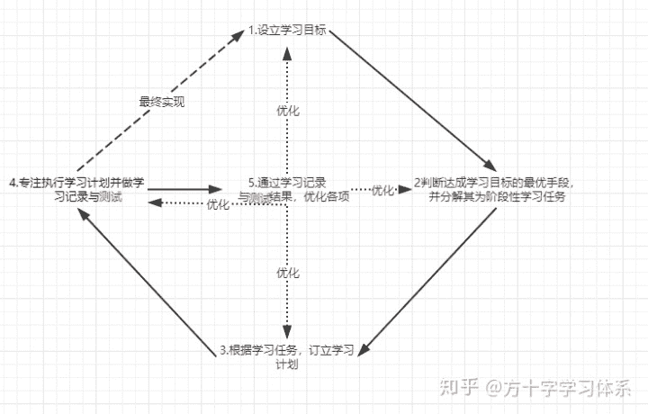

<figcaption>阶段性测试在学习管理中的位置与价值</figcaption>

</figure>

> 本质中，任何一个“不再有其他含义”，其背后都是要肃清人们混乱的认知与误解。

**合理的阶段性测试本身，是非常有意义的**。它不仅可以**反馈你上一个阶段的学习效果，从而为下一个阶段的学习管理（目标，任务，计划，策略，信息源）的优化改进提供重要参考**，同时，阶段性测试本身，也是一个**非常好的学习策略**，经大量认知心理学家测试与认证，可以**有效的提升对测试知识的理解与记忆，从而有效提升学习效果。**

> 在诸多研究成果中，有一项发现非常重要：考试，可以强化记忆，而且考试花费的心思越多，受益就越多。考试有两大显著的好处，一是这能告诉你什么是你知道的，什么是你不知道的，然后你就可以判断以后要把精力放在哪个薄弱的环节上，加以改进；二是回想起已经学过的东西会让大脑重新巩固记忆，强化新知识与已知之间的联系，方便你今后进行回忆。考试，可以有效的终止遗忘。研究人员做过这样一个实验：在伊利诺伊州哥伦比亚市的一所中学里，他们安排八年级的学生接受不重要的小测验（同时安排反馈），内容是科学课上的部分知识点。小测验成绩只占3个学分。另一部分知识点不会出现在小测验中，但是会安排学生复习3遍。在一个月的大考时，哪部分知识点会被记得更牢？**在考察小测验涉及的知识点时，学生们的平均成绩是“A-”,而在考察那些仅做复习但未做小测验的知识点时，学生们的分数变成了“C+”**。——《认识天性》

但注意前提，这是**理想的，合理的阶段性测试，而非不合理的，被附加许多多余意义的阶段性测试。**我们所面对的阶段性测试，大多数是**学校的阶段性测试**，包括随堂测验，周考，月考，期中考试，期末考试，模考等等。而**学校的阶段性测试，其合理性如何呢？我们是如何认知和利用学校的阶段性测试的呢？**下文，我将**从实际出发**，从**客观**与**主观**的角度加以分析。

先放结论，**从客观上来说，传统的，大多数的学校阶段性测试，其本质上，是管教主义的延伸，依据，工具。其设置方式，与大多数学生适合自身的学习策略，学习计划不相匹配。其参考意义是有限的。**

当然，有人会说，不对呀，在现实中，学校成绩排名的参考意义很大呀，一般来说，学生排多少名，高考就是考到对应的分数呀。

为什么会出现这样的现象呢？

因为对于绝大多数学生来说，矛盾1与矛盾2尚未得到充分解决，学校的测试，作为管教主义的延伸，对于这些学生来说，客观上是有帮助和提升的。但这种帮助和提升，是低层次，低水平的提升。即使在全国最好的考试高中里，对于绝大多数这样的学生来说，也是低层次，低水平的帮助和提升，因为主要矛盾尚未得以充分解决，而绝大多数学生，直至高考，其主要矛盾也未能得到充分解决（否则大学为什么有那么多同学不学习呢？）。只要主要矛盾未能充分解决，那么学生的学习便会在这个低层次中打圈圈，无法取得突破。在同一个低层次中，低层次的理念和工具都是生效的，学生最终的考试成绩也的确和平时的考试成绩挂钩，因为二者互为因果。

但我们也见过高层次的，解决了主要矛盾的学生，比如：高一高二成绩平平，高三的成绩突然突飞猛进。当前环境下，绝大多数人认识不到这些主要矛盾，无法深入分析这种现象的本质原因，便只好将其归结于“鸡汤”，“天分”，“幸运”，“顿悟”等玄学因素。

**我们接下来讨论的，正是这种学生出现这种学习现象的本质原因。**

**学生**，参加**学校的考试**。

**知己知彼。**

首先，我们来认识一下**学校的考试**，是怎么设置的，以**高中学校的期末考试**为例：

假设，这个横轴代表高考全部的知识范围：

<figure data-size="normal">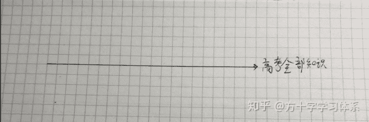</figure>

一般来说，学校在高一高二的期末考试，会根据教学计划，对这条横轴的大部分做等分，然后考察每个等分中相对基础和中等难度的知识。高三时，会学习少部分的新知识，并以综合性的模拟测试为主。

<figure data-size="normal"></figure>

**而问题，就出在了“阶段性”和“等分性”上。**

让我们做一个**思想实验。**

**首先，我们都知道，一个合理的应试学习策略中，必然包含着复习。采用复习的学习策略，必然是优于不采用复习的策略，这一点是毋庸置疑的。**

**现在，我们来设置两个学生：小明与小红，作为实验对象。假设小明与小红同时入学，同时开始学习，学习时间相同，天赋相同，上同样的补课班，做同样的习题册，采取几乎同样的学习策略学习。。。总之两个人是一样的。接下来，我们要求，小明不做复习，直接学习。小红进行完善的复习管理。那么，结果会是什么样呢？实验开始。**

首先，如果学习时间相同，要么把学习时间全部用来学习新知识，要么一部分学习新知识，一部分用于复习，甚至需要大部分用于复习。

<figure data-size="normal">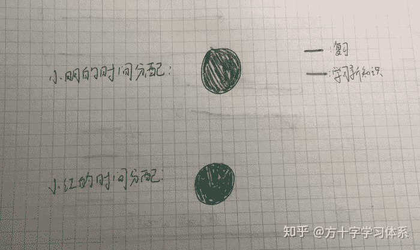</figure>

因此，**当一学期结束后**，小红的学习进度，远远赶不上小明的进度。小明学到的知识，短期内还不至于遗忘。因此，第一个学期的期末考试，小明的成绩会高于小红。

<figure data-size="normal">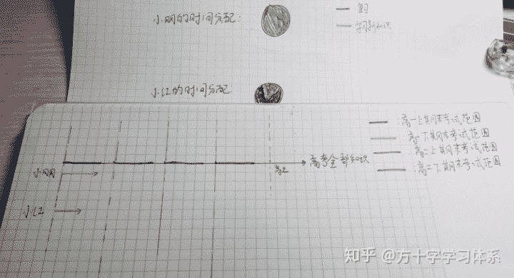

<figcaption>第一学期期末考试时：小红学的没小明多嘛，成绩自然没小明高</figcaption>

</figure>

我们假设，小红是一个极其重视自己所应该学的基础知识的同学，是一个解决了矛盾1，2，3的同学，是一个愿意根据自己实际情况来学习的同学。

那么，第二学期开始学习时（假设他们假期开始学习），小红不仅需要不断的开展复习管理，还要弥补自己第一学期没学会的知识。而小明急于学习下学期的知识，意图“吊打同学”，那么当第二学期结束，小明和小红的实际学习情况，便分别是这样的：

<figure data-size="normal">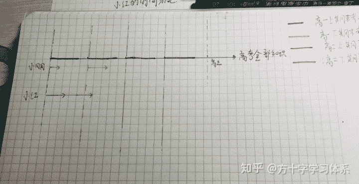

<figcaption>第二学期期末考试时</figcaption>

</figure>

由于遗忘，当第二学期期末考试时，小明已经大量的遗忘了第一学期学到的知识，而由于后面知识的学习往往会以前面的学习为基础，因此，小明的学习速度会略有减慢，反之，小红的学习速度会略有加快，而且由于小红充分的复习管理，所学的知识不会遗忘。

但我们可以直观的看出，**由于学校期末考试的“阶段性”**，第二学期期末考试，只考第二学期的学习内容，在学习时间一定的前提下小红虽然扎实的掌握了第一学期的知识，但第二学期的知识的掌握情况相比小明来说，反而更落后了。**从期末成绩的表现来看，则是“小红与小明的成绩差距越拉越大”**。

第三学期，第四学期的表现不会有太大改变：每个学期，小明的期末成绩虽略有下降，但都会高于小红。而且小红成绩可能仅仅勉强维持一个相对固定的低排名，或略有进步。

<figure data-size="normal">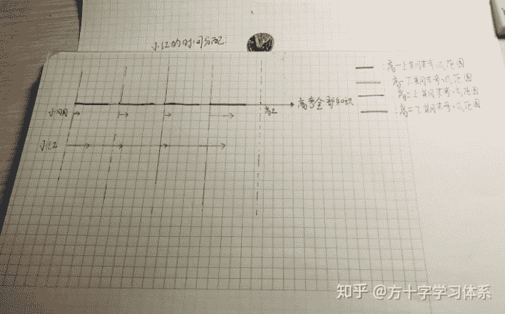

<figcaption>高二下学期期末考试。由于复习，小红的基础知识扎实，学习新知识的速度越来越快。反之，小明越来越慢，而且前几个学期遗忘的知识越来越多。但由于阶段性的进度领先，小明的期末成绩仍然高于小红。</figcaption>

</figure>

从上述实验过程中，我们发现了一个反常识的结论：**扎实基础知识并不断复习的同学，其在学校的期末考试中所取得的成绩，会在很长一段时间内落后于普通的，只知道跟着学校的进度学，不懂得扎实基础知识与复习的同学。甚至可能会出现“差距越来越大”的现象。**

而我们都知道，**根据自己的实际情况开展学习并重视复习，对于学习整体来说，必定是一个优秀，先进的学习策略。**

因此，问题一定出现在了学校的阶段性测试的方式上。而我们可以很轻易的从中看出，**学校的阶段性测试的问题，正是出在了“等分性”和“阶段性”上**。

**等分性的教学计划所带来的测试方式，没能考虑到不同学生实际的学习曲线。**而**阶段性的测试方式，忽略了对以往知识的考察，而只是“本学期考本学期”的知识**。好比两个施工队分别修一条1000米的路，一个施工队从0米处修到了400米处，而另一个施工队从300米处修到了500米处，因而判断后者是更好的施工队，这显然是非常荒谬的，**但这正是当前学校的阶段性测试所做的事情。**

**更有甚者，个别学校为了片面的追求区分度，盲目的加快教学与测试进度，提升测试难度。其阶段性测试的参考意义更低。**

回到实验中，**小红可能已经受尽了委屈，但仍在坚持正确的学习观念。是时候得到回报了。**

**高三了。**

高三，就没有太多的新知识需要学习了，从整体上，进入了“复习阶段”。在高三第一学期的月考，期中考试中，小明可能还可以最后的辉煌一下：最后考察一些新知识的学习。

<figure data-size="normal">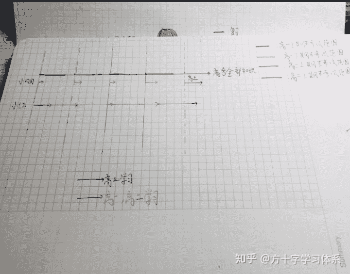</figure>

但是，当新知识学完后，**学校整体的教学计划便由“赶进度”变成了“几轮复习”。**而学校的测试方式，也由“阶段性测试”转变为“综合性测试”。其考察逻辑发生了巨大的转变：由对阶段性的知识掌握情况的考察，转变为对从高一到高三所有的知识的掌握情况的考察。

**学校测试中的阶段性与等分性都消失了，转化为了综合性。**

这时，对于学校中绝大多数的小明们来说，这一阶段做的事情是几轮复习，修补之前遗忘的知识。

## 但小红NB了。

<figure data-size="normal">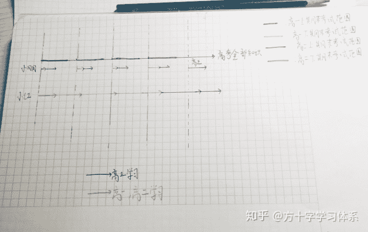</figure>

对比上图，我们发现，同样的时间，小明需要**不断的查漏补缺**，去修复**之前遗忘的知识**。并且，由于小明**尚未建立复习管理能力**，其**复习频率不科学，复习效率低**。

而与此同时，由于小红**坚持科学的学习策略**，**重视科学的复习管理**，**基础知识非常扎实，已经处于长期记忆状态**。而且，**扎实的基本功对重难点知识的学习帮助很大**，因此，小红最终可以**很快的弥补进度差距，并直接开展重难点的攻坚**。而由于**测试逻辑的转变**，相比于其他同学，小红可以**更轻易的在综合性测试中取得更高的，甚至是远超于其他同学的成绩**。**高考本身并非阶段性测试，而是综合性测试**，因此，小红将在高考中取得不错的成绩。

## **这不就是传说中的高一高二成绩平平，高三的成绩突然突飞猛进的同学嘛~看懂了没？**

由上述实验我们可以得出结论，**从客观上来说，传统的，大多数的学校阶段性测试，其本质上，是管教主义的延伸，依据，工具。其设置方式，与大多数学生适合自身的学习策略，学习计划不相匹配。对于学生来说，作为反馈学习效果的工具，其参考意义是有限的。**

因此才会出现“**采用科学先进的学习策略，期末考试的成绩反而会退步**”这样荒谬的事情。

在实际学习生活中，**情况要复杂的很多**，很多学生会无意识的采取各种各样的学习策略，**每个学生的具体情况也不尽相同，比如真的有学生可以在半个月内学完高中所有课程：**

<figure data-size="normal">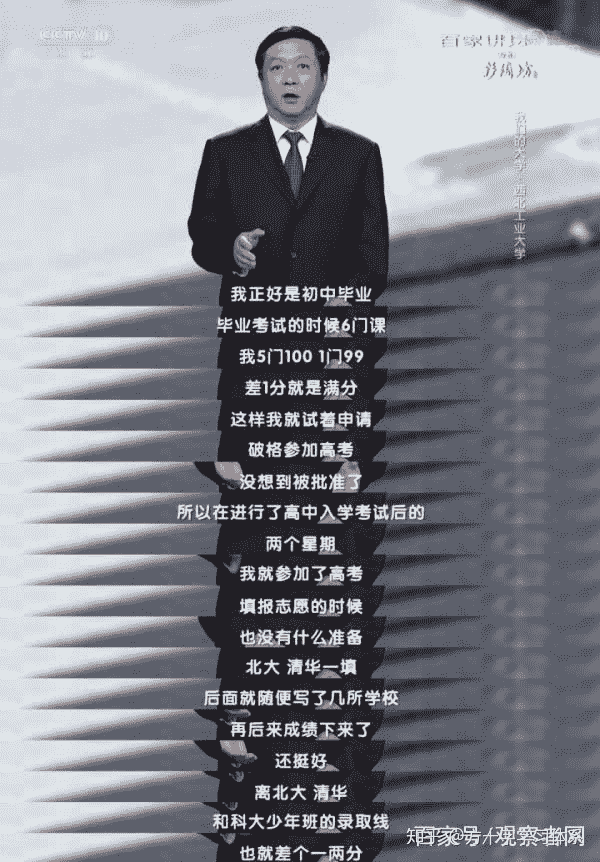

<figcaption>歼20的总设计师：杨伟</figcaption>

</figure>

<figure data-size="normal">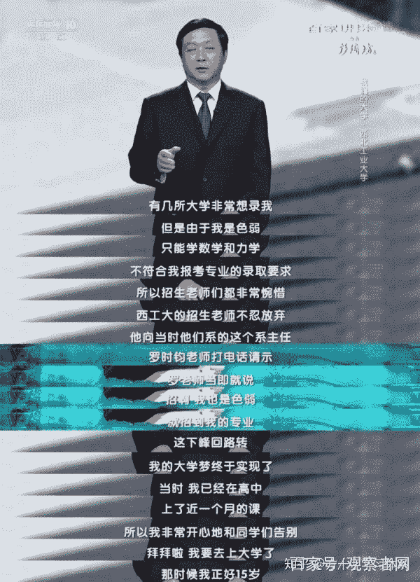

<figcaption>歼20的总设计师：杨伟</figcaption>

</figure>

<figure data-size="normal">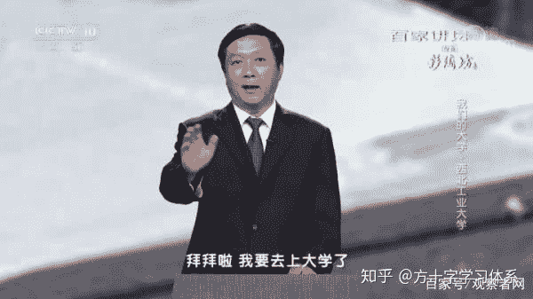

<figcaption>歼20的总设计师：杨伟</figcaption>

</figure>

但极端情况毕竟是少数，绝大多数学生的资质实际上都是类似的。**虽然上述思想实验做了很多假设与简化，但其过程与结论是具有很大的参考价值的，与现实学习生活中的一些实际情况也很对应。**

总之，**我们要科学的认识到学校阶段性测试的本质与局限性，充分的认识，分析不同学习策略与学校阶段性测试结果的复杂关系（而不是单纯的认为好的学习策略一定可以很快提升学习成绩，或认为能快速提升学习成绩的策略便是好的策略），进而根据我们真正的应试目标，坚定的执行适合我们的学习策略，而不是盲目的被阶段性测试结果牵着鼻子走。**

但在实际学习中，学生，老师，家长，乃至市面上的教培机构，都在被这阶段性的测试结果牵着鼻子走。**学生即使想要采取更先进的学习策略，也难以承受来自外界巨大的压力与质疑。**这种压力与质疑，本质上是“**管教主义**”的生效。**从主观上来说，“管教主义”在“学校阶段性测试”中的生效，源自于各应试教育参与者（学生本人，家长，同学，老师，学校，教培机构等）对阶段性测试的一些不当观念，最典型的有3个：代表主义，成败主义，情绪主义。**

> 当然了，不同参与者的诉求并不相同。学生最终目标是在最终的考试（中高考/考研等）中取得高分，家长的诉求可能是通过阶段性测试的成绩进行炫耀/脸面，老师/学校的诉求是绩效/总体升学率，大多数教培机构的诉求是金钱。但**本文完全是站在学生的立场上，与学生处在同一战线中**，因此，凡是对学生实现最终目标有害的观念，都是不对的。

**首先，放正确观念：**

## **阶段性测试，其本质，是反馈一个阶段的学习效果的工具，是学生学习水平的“显示屏”。除此之外，不再有任何其他含义。**

**然后，来看看不当观念。**

## 1.代表主义

**代表主义，即认为阶段性测试的结果，其本身，代表了最终的应试结果。**

比如，学生，老师，家长**认为学生在阶段性测试的学校排名，代表了学生的高考将会达到什么程度**。甚至**很多学生在自己利用卷子做模拟测试时，会不自觉认为模拟测试的分数就是高考中自己所要取得的分数**。

这种“代表主义”，是非常有现实土壤的观念。因为学校的绝大多数学生尚未充分解决各主要矛盾，其学习完全是被学校牵着鼻子走的，**当大家在同一个低层次中竞争时，阶段性测试，测试排名与测试成绩这一在低层次策略中出现的工具，便的确几乎可以代表这些学生最后的排名，水平。因为大家都处在同样的学习策略，学习计划当中嘛**。

但对于**主要矛盾得以充分解决的，高层次的，有较强主观能动性与较先进的学习策略，信息源的同学**来说，目前**大多数学校不合理的阶段性测试结果往往难以直观，客观的反映出他们真实的学习水平，参考意义偏低**，这是我们在上文的**思想实验**中可以轻易得出的结论。

假如这一类同学没有意识到代表主义的错误性，而是误认为学校期末考试成绩退步了，代表着自己的学习没戏了，那么就会对自己的学习策略产生动摇，最终退化为被学校前者鼻子走的低层次学习者。可悲的是，当退化为低层次学习者后，他们的阶段性测试的成绩反而会真的得以提升，最后的考试成绩，也真的会符合他们平时的成绩排名，反而证明了“代表主义”的“正确性”。

**即使他们本来可以考的更好**。

**想要破解观念中的代表主义**，首先要清醒的认识到，**阶段性测试，其本质，是反馈一个阶段的学习效果的工具，是学习水平的“显示屏”。除此之外，不再有任何其他含义。**

理论上来说，**合理的阶段性测试**的结果，在一定程度上只代表了你上一个阶段的学习情况，指出了你上一个阶段的学习问题，它并不能直接代表最终结果：因为当上一个阶段的问题被指出后，你便可以有的放矢的，更好的解决学习问题，这在前文已有过详细介绍。

而**不合理的阶段性测试**，相对于合理的学习过程来说，其结果是荒谬的，不具有太大参考价值的，更遑论代表了。这是**我们在上文的思想实验中**已经论证出的一个观点。

**代表主义，其本质是片面的认为学习是静止的，而不是运动的，是停滞的，而不是发展的，混淆了发展的过程与结果，是一种典型的形而上学观念。**

## **2.成败主义**

**成败主义，即认为阶段性测试，代表了学生的成功，或失败。**

比如，老师，家长，学生自己等**，都认为，学生在阶段性测试中取得了好的分数，对其评价，便是成功的好学生，反之，则是失败的差学生**。**这种成败主义的评价，往往不局限于应试学习范畴内，而是往往蔓延为对学生的整个人的肯定/否定。**

这种**成败主义**与**情绪主义**相结合，便**导致了学生，家长对短期阶段性测试分数的提升的盲目追求**，从而导致了当前的教培机构不解决主要矛盾，而是用提前学习，突击，分析学校在期末考试中出的卷子，做出类似的题型训练，押题等并将其传授给学生等方式来**迎合学生与家长的不当需求**，从而在客观上**干扰了学生的学习节奏**，于此同时，**干扰了学校的教学计划**，当学校片面的追求区分度时，便会使用更加不合理的阶段性测试，从而陷入了一种“囚徒困境”，“恶性循环”当中。

实际上，在应试学习的范畴中，**只有一个要素是可以用“成败”来评价的**，那就是：**最终的考试分数**。也就是你的中考分数，高考分数，考研分数等是否达到或超过了你的预期目标。

而**阶段性测试，实际上只是一个学习环节**，它和你上课，刷题，列学习计划的地位是一样的。你上课，刷题，列学习计划，有成败么？没有的。同理，阶段性测试只是一个学习的过程，一个环节，一个反馈，一个将你上一阶段的学习问题可视化的工具，它实际上同样没有成败。

实际上，**单从反馈的角度来说，阶段性测试的排名与分数反倒是一个多余的项目**，其存在误导性强，弊大于利，是可以取消的事物。当然，当前的教育体系**无法脱离低层次的管教主义**，而阶段性测试的排名与分数是管教主义的重要工具，其无法取消，亦有坚实的现实基础。**但作为高层次的学习参与者（学生，家长，老师），我们可以在深刻认识阶段性测试的本质上，从观念中取消他们。**

**成败主义，其本质上在于混淆了阶段性测试与最终的考试，混淆了过程与结果，某种程度上是代表主义的延伸。**

> 当然，虽然在矛盾已得到充分解决的层次中，成败主义是一个多余的观念。但在解决矛盾1时，成败主义观念倒是有一些可利用的价值：通过肯定学生在合理的阶段性测试中所取得的成绩，为学生优化学习体验，从而有助于学习动机的提升。但这个价值背后的风险就是，一旦学生未能取得较高的测试分数，学生自身对测试“失败”的评价，便会大大降低学生的学习体验，损害学习动机，不利于矛盾1的解决。作为“五分神药，五分毒药”，慎用。

## 3.情绪主义

**即由于阶段性的测试结果所引发的应试教育参与者，包括学生，家长，老师，尤其是老师与家长的各种过度的情绪，包括喜悦，悲伤，愤怒，恐惧等。**

最典型的场景，便是学生期末考试失利后，有的家长了解到了学生的学习成绩，**感到十分的恐惧和愤怒**。可能会在情绪的作用下，对学生施加打骂等肉体与精神暴力来**宣泄情绪**。有的家长为了避免这种情绪，便会**对学生的学习成绩不闻不问不关心**，其**本质也是情绪主义的生效**。

**针对阶段性测试成绩的情绪主义，是一个非常普遍而严重的问题。**

学生**自婴儿而来**，他对学习的情绪本是**白纸**。而老师，家长对学生的**情绪，攻击**，将很容易的**内化**为**学生自己对自己的情绪，攻击**（比如数学考试成绩低，老师/家长骂学生笨。学生便会真的认为自己笨，不配学会数学，并将数学的学习与老师/家长骂自己时的负面情绪关联起来，形成条件反射）。**这是许多学生厌恶学习，恐惧学习，对学习抱有负面体验与负面评价的重要原因之一，甚至是根本原因。**

矛盾1的解决，大概率会**伴随着对这种情绪主义的斗争**。情绪主义源于对阶段性测试不当的认识，诸如代表主义，成败主义（人对成败有情绪是自然而然的），同时，情绪主义加强这些不当认识并将其传播出去。

而实际上，当我们建立起正确的认知时，我们知道：**阶段性测试，其本质，是反馈一个阶段的学习效果的工具，是学习水平的“显示屏”。除此之外，不再有任何其他含义。**它**没有成败**，**不代表结果**，只是一个**工具**。当我们使用一个工具时，完全**没必要带着情绪**去使用它，而是**理智**的，**冷静**的，**客观**的利用工具去**解决学习中存在的问题**。**不必要的情绪，反而会干扰问题的解决。**

一个**高水平的老师、家长**，在面对学生的低学习成绩时，一定是**帮助学生，客观的分析出试卷所反应的，上一阶段的学习问题，理智的探讨解决方案，并不断地向学生传递正确的认知**。当然，在面对不合理/不适合学生的阶段性测试时，也能够**清醒的认识到问题的所在并无条件的对学生予以支持和帮助**。这样教导出来的学生，**其面对阶段性测试的结果，便是冷静的，理智的，可以不受干扰的利用其反馈参考价值，其对学习本身的评价，也将是积极的，正面的**。对于这样的**幸运儿**来说，**矛盾1**与**矛盾2**可能会是**早已得到充分解决的**。

实际上，情绪主义也有**积极的一面**：良好的阶段性测试成绩所带来的正面情绪有助于提升学生的学习体验，从而增强学生的学习动机，有助于矛盾1的解决。

但是，由**不合理的阶段性测试**的偶发的，**好的成绩**所引起的**正面情绪**，也是**危险**的：**它会引导学生在接下来的学习过程中迎合这种不合理的阶段性测试，而非根据自己的实际情况进行学习**。

实际上，最NB的状态，应该是**既能认识到阶段性测试的本质**，**辩清其对于自己具体情况的适合性与合理性**，又能**在获得良好成绩时体验到积极情绪**，同时**在获得不良成绩时避免情绪主义**，**只做理智客观的分析**。这种状态，**同时需要各应试教育参与者**在**观念中**可以**同时顺畅运转数套观念体系**，各观念体系**不同**，甚至**相悖**，却要求人能**同时容纳，按需采用**。这是一种**高级的智能**，**难度过大，不具有普遍性**。因此，还是推荐各教育参与者**取消对阶段性测试的情绪主义**，冷静，理智，客观的利用阶段性测试这一学习工具优化学习。

以上。

* * *

## 一点随笔。

首先，我来探讨一下文中频繁出现的“低层次”与“高层次”。

从理论上来探讨，太枯燥无趣，我分享一段文字，大家来体会一下：

> 成吉思汗的骑兵，攻击速度与二十世纪的装甲部队相当；北宋的床弩，射程达一千五百米，与二十世纪的狙击步枪差不多；但这些仍不过是古代的骑兵与弓弩而已，不可能与现代力量抗衡。——刘慈欣《三体2：黑暗森林》

在这里，“现代力量”便是高层次的，而“古代军队”便是低层次的。

**在应试学习中，“不解决主要矛盾，管教主义包办一切”便是低层次的。而“系统性的解决各主要矛盾”便是高层次的。**

高层次的学习体系，与低层次的学习体系，其差距，就像“现代力量”与“古代军队”那样巨大。

从短期学习成绩的对比来看，极致的低层次体系的学习者的学习成绩，是可以赶得上，甚至在一定情况下，会超过高层次体系的学习者。

正如射程1500米的北宋床弩，其射程普遍高于21世纪的制式步枪。

但低层次就是低层次，最终被高层次吊打的命运，是注定的。

现在很多学校，越来越重视管教，乃至出现了“衡中”，“本高”，“毛坦”这样的高考工厂与超级中学。

这些超级中学，的确比一般的中学厉害，成绩高。

正如古代战场中，身披铁甲，手拿宝刀的将军，一定是比衣不遮体，手拿劣质匕首的小兵厉害很多的。

别的学校见状，便去效仿，奈何资源不足，武艺不精，败下阵来。

有的学生个体，也去效仿，试图用学霸作息表来规范自己的学习，认为自己用了学霸作息表，便会成为学霸。奈何难以执行，最终归纳为自己的自律，意志力不如学霸，徒增“失败”之感。

所谓“自律”，“意志力”，本质上也是管教主义，只不过管教者与被管教者，都是自己。

目前越来越多的先进工具被应用于管教主义应试教育中，便于更有效的管理。庚子年，

[@阿里钉钉](https://www.zhihu.com/people/b4886a18440298b2388a19e9c4d9e755)

首当其冲。

越来越完善的管教理念，越来越先进的管教工具，正如古代战场中，越来越锋利的宝刀，越来越精良的铠甲，越来越复杂的武术。

都是在低层次打圈圈。

再精良的古代武装，面对现代军队，都是一枪撂倒。而被撂倒的将军，可能至死也不知道自己为什么会被打败。

正如绝大多数的学生，家长，老师无法理解，为什么有的学生不听课，不写作业，吃喝玩乐处对象样样不落，学习成绩还能那么高，或有的学生一开始成绩平平，突然在高三的时候爆发，一骑绝尘。他们无法理解，便会将其统一归纳为“**天赋**”。

就像古代将军，如果被现代步枪射杀，他听到了枪声，看到了火光，临死之前，应该会觉得对手是召唤了**天雷**吧。

这篇文章作于2020年2月。

我想，就现在，真正的高层次体系的学习者大概就是十中无一，百中有三。

他们并不会完全集中在某些学校，因为目前没有一个学校可以拥有那么充分的认识与充足的资源来提供高层次的学习体系。

而是散落在各个学校，班级中，就像万绿丛中一点红。

在未来方十字壮大之前，他们是真正的幸运儿。

在他们的成长阶段，恰恰好同时碰见了好父母，好老师，保护并优化了他们的学习动机，而不像绝大多数父母，老师在学生的成长阶段不断的摧毁其学习动机。

恰恰好其天生性格又没那么乖，那么听话，有自己的想法，不会完全被学校牵着鼻子走。

又恰恰好探寻到了某些适合自己的学习策略。甭管这些策略是否科学合理，但起码比没有策略强。

满足这些条件，真的挺难的。同时满足这些条件，真的是幸运中的幸运儿。

他们愿意学习，知道怎么学习，知道学什么最适合自己。他们完全按照适合自己的学习节奏，有可能一开始还是落后于学校进度的，但一不小心，就远超了学校的进度。

低层次的学习者，会被迫拙劣的模仿他们的行为。但即使已经模仿的惟妙惟肖了，也远远达不到他们的效果。

如果一个古代军人，用射击的姿势拿刀，大概率只会把自己划伤罢了，依然不可能打得过手拿步枪的对方。

实际上，在应试学习的竞争中，当各位参与者处于低层次当中，其竞争必然是伴随着巨大的痛苦的。

家长，老师付出了管教的巨大努力与心血，最后换来的可能依然是效果不佳。

有的老师，甚至病倒在了讲台上；有的家长，被孩子气出了脑溢血。

而老师，家长，包括学生自己，由于缺乏正确的，深入的，系统的学习观，他们便只能利用那些自己可以直接控制的方式来强化学习效果。

比如盲目的延长学习时间，盲目的增加习题训练数量，盲目的给学生增添大量的限制与不合理的规则。。。这必然是使人痛苦的。因此而不痛苦，乃至很快乐的受虐狂，毕竟是少数。

而当百中有九十七的学生采取这样的竞争方式时，其推崇的竞争方式便成为了某种社会共识，乃至成为了一种道德观念。

> 生前何必久睡，死后必将长眠！
> 凌晨4点30依然灯火通明的哈佛图书馆！
> 学霸不仅比你聪明，还比你努力！你看这学霸作息表，就是你与学霸的差距！
> 。。。

就像古代武侠们在比谁的武功高强一样，该一枪撂倒，还是一枪撂倒。

都是在低层次打圈圈。

由于这种低层次的学习体系，已经成为了社会共识。但其反人类性，是客观存在的。结果导致了痛苦的参与者们，不去反思自己的学习体系，而是否定了整个应试教育，并试图呼唤所谓的“素质教育”。

实际上，如果真的搞素质教育了，学习体系是旧的，低层次的，搞素质教育，依然是痛苦的。就像好多人对小时候学乐器的回忆是痛苦的一样。

而且，你有钱搞么？

所以，痛苦的根本原因，根本不是应试教育这个游戏规则本身，而是玩游戏的方式，是你主动，或被迫在应试学习中采用的低层次的学习体系，导致的痛苦。

这就是为什么，方十字的两句slogan分别是：

**方十字，专注应试。**

**打破旧体系，建立新体系。**

那么，接下来，我对未来的应试学习的竞争方向与竞争格局，做如下猜测：

首先，很长一段时间内，**低层次学习体系内部的竞争与竞争模式，仍然是应试学习的主流竞争模式**，各方仍然会不断“打磨手中的刀剑”。但越来越多的人将会认识到，除了低层次内部的竞争这一维度外，还有层次体系之间的竞争维度，认识到，高层次学习体系对低层次学习体系，是降维打击，就像有了手枪，再锋利的刀剑也是无用的。

接着，在诸如方十字这样的策略组织机构的推动下，**学生们的竞争方式，由低层次体系内部竞争，转变为了体系与体系的竞争**。矛盾充分解决的高层次体系学习者，将会吊打矛盾部分解决的中层次学习者，而矛盾部分解决的中层次学习者，将会吊打纯管教主义的低层次学习者。好比现代的步枪，近代的火绳枪，古代的弓弩之间的关系。

当然，上述是在“方十字应试学习矛盾分析体系”这一大的应试学习体系范畴内。不排除会出现更先进的大体系。假设，未来没能出现更先进的大体系，那么最终的结果，一定是绝大多数学生，都成为了矛盾充分解决的高层次学习者，那么，接下来的主流竞争，就会**又从体系间转变为体系内部的竞争，只不过已经是高层次体系内部的竞争**，好比现代各国相互比拼谁的飞机棒，谁的战舰猛一样。

> 否定之否定规律是哲学的基本规律之一。它揭示了事物发展的前进性与曲折性的统一，表明了事物的发展不是直线式前进而是螺旋式上升的。否定之否定规律的原理对于人们正确认识事物发展的曲折性和前进性，具有重要的指导意义。

而**高层次体系内部的竞争逻辑，与低层次体系内部的竞争逻辑，将会完全不同。高层次体系内部的竞争，将完全是智慧的，人性的，积极的竞争**，而非类似低层次体系机械的，痛苦的，反人性的竞争。

在高层次体系的竞争中，**比拼的是谁的动机更充分，谁能找到更适合自己的学习策略，谁能建立更适合自己的学习管理(目标，任务，计划，执行，反馈），谁能找到更优秀的，更适合自己的信息源体系，谁能按照适合自己的合理的时间安排自己的学习与休息，谁能更有效的管理自己的健康与精力**。。。

> 实际上，传统的观念认为，学习时间越长，学习效果越好，是有很大问题的。当学习时间过分延长后，大脑的机能降低，学习效率会随之降低，超过一定阈值，其学习效果可能反而不如合理安排学习时间与休息的同学，而且主观体验上相当痛苦。牺牲睡眠去学习（写作业）更是不可取的，这是一种明显得不偿失的学习策略，却在低层次的学习体系中被普遍接受甚至大加推广。

高层次体系内部的竞争，将是和谐的，稳定的，人性的，有益于每一位受教育者的身心健康与未来工作学习能力的建立的。它将会作为未来很长一段时间内主流的学习竞争模式，同时适用于应试教育，素质教育，以及各式各样的教育之中。

直到脑机芯片与强人工智能的出现。。。

至此，方十字想说的事情，都说完了。林林总总，刚好有4w字了。最后，以方十字的slogan作为全文的结尾吧：

## 方十字，专注应试！

## 打破旧体系，建立新体系！！！

* * *

## **创作不易，求个赞呀~**