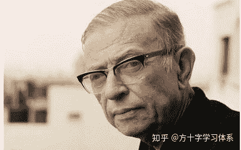
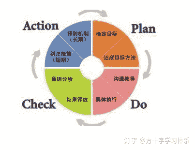

# 方十字参考主义计划观

> 原文：[https://zhuanlan.zhihu.com/p/115607259](https://zhuanlan.zhihu.com/p/115607259)

> 打破旧体系，建立新体系。方十字，专注应试。

## 1.现状

一提到做计划，很多同学都会想起自己做计划的经历：

**信心满满做了计划→短期执行的很好→因为一些事情耽搁/自己“偷懒”，有计划没执行下去→后面的计划被打乱→后续难以执行→自我否定，同时你的朋友/父母/老师/自媒体们都会拿着大喇叭，说你不自律，坚持不下去，没毅力，不成功。。。→更严重的自我否定→强行尝试执行并失败→自暴自弃**。。。

而目前市面上几乎所有的文章与书籍，都在探讨具体怎么做计划。他们往往是总结了成功的自己，或前人的计划方式，并向大家鼓吹：**只要按照这个方式制定计划，便可以获得成功**。当然了，最后绝大多数人，都会复制一遍上面的经历。。。

“学霸”计划表

其实，并不一定是他们的计划方式有问题，也不是人们没有自律性，而**是很少有人思考，计划到底是什么，我们应该怎么样看待计划**。虽然有各种各样的计划方式，但没有一个科学的计划观，人就难以与计划有效的结合，让计划发挥应有的价值，反而会产生一些新的问题。

因此接下来，方十字试图对一些传统的，深入人心，但有些落后的计划观展开批判，并提出一个新的计划观，力图在消解掉传统计划观下应用计划的缺陷的同时，保留计划的优势，以便于同学们更好的利用计划。

## 2.传统计划观的困境

**2.1.表象**

做好了学习计划，结果因为某件不得不做的事情耽搁了。这很常见，因此你的计划也被打乱了。

出现这种情况，因为你在制定计划的时候，只能对未来建立有限的预测，而且时间越长，预测准确率越低，出现意外的情况越大。

因此，人们提出了“计划要灵活”。

但是，在对未来预测有限的前提下，计划的灵活度怎么设置呢?比如你定了一个第二天的日学习计划，结果第二天你阑尾炎犯了，要去做手术，这个计划再灵活，也就不能被执行了。

当然了，有人会说，这是不可抗力，要原谅。那么，灵活的边界在哪里呢？

不是阑尾炎，只是感冒了，该终止计划么？心上人邀请的约会，该终止学习计划去约会么？或者只是一天太困倦了，该终止学习计划么？。。。

有人会说，困，累就终止计划，是没有意志力的表现。

我们都知道，我们的学习只是我们的手段，我们最终目标是取得好成绩。那么，在困，累的状态下坚持学习，挤占了休息时间，导致之后一连几天的学习效率低下。意志力有了，可结果呢？

。。。

混乱吧，困惑吧，相信这是大家常见的问题与疑虑。

**2.2.传统计划观的本质：命令主义**

**一言以蔽之：计划是用来完成的。**

这句话，耳熟能详了，但却是造成上述问题真正的根源所在。

“计划是用来完成的”，背后的含义，便是，你定了计划，没有特殊情况下，你必须要完成这个计划。

当然了，如果你不完成这个计划，外人对你的批评，便是不自律，没有纪律性，没有意志力。。。久而久之，也就转化成了你自己对自己的批评。

一旦你开始制定计划，这种批评，就犹如枷锁一般，套在了你的心里，限制了你的自由，所谓的“计划”，也变异为了一种命令：不完成就会被惩罚。

这是命令主义。

这种命令主义在实践中，会出现两个问题：

1.制定计划，一定是面向未来制定计划，而人对未来的预测是有限的，经常会有意料不到的情况出现。因此，不管以什么形式制定计划，必然存在人无法完成的概率，而这与命令的强制性相冲突。最终在人难以应用计划的同时，还意外的导致了应用计划的人必然存在概率受到自己或他人的惩罚。

2.执行计划的主体是人，而非机器。人有其特殊性：**人追求自由**。杰克·布雷姆在他的著作《社会性动物》中提到：**当我们的自由感受到威胁时，我们会努力去恢复它。**

因此，对于任何一个存在独立人格的人来说，“计划”以命令的形式，限制了人的自由。因此，“计划”会被人所厌恶，反抗。我们制定了计划，反而削弱了做事情的动力。这也是“拖延症”的原因之一。

综上所述，我们就可以较为全面的认识到了传统计划观的局限性。但是，光破旧不立新，那是耍流氓。既然大家所信奉的这么多年的“计划是用来完成的”有这么大的局限性，那新的计划观是什么呢？

别着急，在讨论新的计划观之前，我们要做一个哲学层面的准备。

## 3.参考主义计划观

**3.1.哲学准备：存在主义**

存在主义（Existentialism），是当代西方哲学主要流派之一。该词最早由法国天主教哲学家加布里埃尔马塞尔提出，是一个很广泛的哲学流派。存在主义以人为中心、尊重人的个性和自由。人是在无意义的宇宙中生活，人的存在本身也没有意义，但人可以在原有存在的基础上自我塑造、自我成就，活得精彩，从而拥有意义。影响力最为广泛的代表作，便是让.保罗.萨特的《存在与虚无》**。方十字计划观的主要哲学基础，便是萨特的存在主义中“绝对自由”的理念。**

让.保罗.萨特

对于“绝对自由”的理念，可以有这几句话来概括：

*   人命定是自由的（自由是必然的，无可逃脱的）
*   自由选择是绝对的，无条件的。
*   选择是没有先验标准的。
*   选择不受必然性制约
*   选择是个别的，特殊的
*   选择是思想上的自主性
*   必然要为选择负责任

当然了，我们大可不必像哲学家一样，深究每一句话的深意，来源，我们实用主义式的去用他们就可以。你，投入到应试学习中，你可以这样理解你的处境：

安静下来，想象：

你，独自一人，身处名为应试学习的黑暗森林中，周围迷雾重重。你可以自由的选择前进的方向（包括停止不动），你也注定要自由的选择前进的方向，同时，不论你向哪个方向前进，你都注定要承担相应的后果，为自己选择的方向负责。你知道，在终点，有一个宝藏，你也知道终点大致的方向，但前方的迷雾，让你被黑暗所裹挟。

这时，你最需要什么？命令么？

选择是个别的，特殊的。在应试学习中，每个人所面对的“黑暗森林”都是不一样的，毕竟世界上没有两个完全相同的个体。因此，即使是这个世界上最有经验的人来命令你，由于他不可能窥探到你的“黑暗森林”，只是根据他自己穿越“黑暗森林”的经验来对你下达命令。而由于命令的强制性，你不得不按照他所下的命令去执行。这样就会出现一个问题：即使面前就是一条毒蛇，由于命令的强制性，你不得不走下去，最后被毒蛇所咬伤。

同理，你预知不到前方的所有情况，你所能借鉴的，也是别人穿越他们的“黑暗森林”的经验。因此，当你自己命令自己时，同样会出现上述情况。这也是传统计划观出现困境的根本原因所在。

那该怎么办呢？瞎走么？四处乱逛么？

当然不是。

想一想，你在这种处境下，最需要的东西是什么。我想应该是一个地图，或者导航仪。

地图不会命令你吧，你对地图拥有绝对的权力。你不按照地图走，地图也不会把你怎么样。而且地图还有可能出错呢！

那为什么我们会想要地图呢？为什么我们觉得有地图总比没地图好呢？这里，地图的价值是什么呢？

**参考。**

**3.2.参考主义计划观的本质：参考主义**

**一言以蔽之：计划是用来参考的。**

实际上，计划是什么？

**计划，是实现目标的路径参考。除此之外，再无其他任何含义。**

参考与命令的最大区别就在于，参考只有建议权，而不具备决策权。而命令具有决策权。

换句话说，你拿着地图来选择前进的方向，地图不会因为你最终选择的方向与地图不同，就把你臭骂一顿。地图只是给你一个信息，让你对迷雾中所隐藏的未知多几分了解，你仍然可以行使你的绝对自由，地图对你的自由毫无威胁。

实际上，地图完完全全是一个加分的工具。虽然理论上你的行动完全自由，但有了地图后，你的行动便有了参考，知道了达到终点的可能的最佳路径。**即使你最终没有完全按照地图走，但你不可否认地图对你的价值：如果没有地图，你会彻底抓瞎。**

而通过上文我们也看到了，虽然在命令中，客观上来说你的选择仍然是自由的，但如果你最终所选择的方向与命令不同，命令真的会把你臭骂一顿。这既伤害了自由，也造成了困扰，最起码有减分项。

而实际上，这种参考主义的还有一个优势：**无压力的随时调整优化计划**。

当采用“命令主义”去看待计划时，计划是不可以随时灵活调整的，否则命令便失去了意义：怎么能因为执行的一点小问题就修改计划呢？你做不下去，便修改计划，是一种逃避。

而实际上，当采用“参考主义”去看待计划时，你会意识到，你手里拿的这个地图（学习计划），大概率是不太准确的，只能给你一个大致的参考。因此，在大方向上你需要看看地图（学习计划），而在具体的执行中，会有大量的地图（学习计划）上没有标识出来的意外情况出现，是需要临场发挥，随机应变的。这也是“绝对自由”的一种体现。好在“应试学习”这个黑暗森林中，好多道路都是相似的。因此，你需要做的事情，便是在执行时做好监控（学习记录），根据监控数据（记录）随时调整这张地图（计划），使之更便于你的后续使用。

反过来说，完全不必追求一开始就制定一份详尽，完美的计划。计划可以不完美，只需要在实践的过程中不断的根据复盘反馈进行优化改进即可。

## 4.对参考主义计划观的批判

这种绝对自由基础下的参考主义计划观，一定会受到这种**质疑**：取消了计划的命令性之后，学生根本就不会去学习呀！

比如给学生一个学习计划，却告诉他不用完成，看看就可以，那么根据我们的常识，我们会认为这个学生继续打游戏摸鱼睡懒觉，根本不会鸟这个计划。。。而给他一个命令式计划，不完成就骂他，他大概率会磨磨蹭蹭的起床，磨磨蹭蹭的学会儿习，偷偷的玩玩手机电脑。。。总比一天什么都不干强。。。

这是典型的看问题未能抓住主要矛盾。

一个人主动学习，与被逼迫学习，其学习动机云泥之别，学习效率，效果也必定大不相同。使用命令逼迫学生学习，的确可以收获短期效果，但远不如学生在喜欢学习的条件下主动学习。

所以，**问题的关键，根本不在于怎样通过外部的手段逼迫学生学习，那只是对问题表象的解决，并未深入根本；而怎样帮助学生修复，建立，保护学习动机，让学生喜欢学习，才是深入本质的解决问题的思路。动机问题，才是主要矛盾。**

> 外因的作用再大，也是第二位的原因，而决不能撇开内因独立地起作用。内因是事物变化发展的根据，是事物发展的源泉，是事物发展的根本原因，决定着事物的性质和发展方向。

那么，更根本的问题是：**为什么学生会讨厌学习。**

学生是人。而对于人来说，人的绝对自由并非主观意愿，而是一种客观必然，也就是所谓“人命定是自由的”。在绝对自由的条件下，一个人的思想与行为存在几乎无限的选择。

命令生效的本质，是通过暴力胁迫人来执行指定的行为：虽然人仍然有无限的选择，但一旦选择非指定行为，就会遭受暴力。人天然的，既讨厌暴力，又讨厌这种自由的消损。因此，人虽然会为了规避无法承受的暴力去执行指定行为，但不会心甘情愿，乃至会在这种命令中，愈加的厌恶指定的行为，即使指定的行为可以给人带来一定的快感。

一个人，好奇心是一种天然存在。学习，并应用所学的知识去解决问题，从本能上来说，本来是快乐的。这是人类与生俱来的能力：人天然有学习的欲望，就像食欲，性欲一样。而在后天的成长过程中，**人对学习的评价由先天的快乐转变为后天的痛苦，必然是一个经过后天训练的过程，而非先天的发展**。

那么什么样的训练会让学生由先天的喜欢学习转变为后天的讨厌学习呢？

通过现在普遍的早教，忽视孩子大脑发育规律的鸡娃，盲目的追求进度，孩子学习遇到挫折（题不会做，知识学不会，单词背不下来，分数低）家长/老师便会打骂孩子等现象，人们会逐渐有一些答案。

包括用命令主义的形式使用计划，也会让学生更加讨厌学习。原因在上文。

因此，学习动机问题一定要抓住根源，然后由专业的人士从根本上解决问题，而非只看到了学生不愿行动的表象，便试图用命令逼迫学生，那样只会扬汤止沸，乃至适得其反。

而如何系统性的解决学生学习动机方面的问题，便不在本文的讨论范围之内，有兴趣的同学可以在这篇里找找看：[受疫情影响在家学习，如何提高学习效率，延长专注学习的时间？](https://www.zhihu.com/question/370957284/answer/1027300586) 。

比如给学生一个学习计划，却告诉他不用完成，看看就可以。如果这个学生是喜欢学习的，但暂时还没有计划。那么他拿到这个计划后，绝对不是不鸟这个计划，而是先看一看，如果觉得有合理性，便会参考着用一用，改一改，用爽了就会一直用下去。。。

最后一个观念：**计划不是用来完成的，但人可以选择完成计划**。

当采用参考主义来使用计划时，不代表你不能追求计划的完成。

换句话说，计划没有一丝权力来逼迫你完成它，但你有权主动选择完成这个计划。因此，在参考主义计划观中，计划的“激励性”是可以被保留下来的：

你完全可以在动机充足的前提下，“坚持着克服困难”来完成计划，比如虽然很累了，但还是想要多背几个单词或多做两道题以追求计划的完成。

这里与命令主义的最大差别在于：命令主义要求你为了计划的完成去“坚持着克服困难”，这种“坚持”并非发自内心，而是源于命令的暴力胁迫。参考主义计划的“坚持”则完全发自内心，是内在动机的产物。命令主义计划中，你无权“不坚持”，而参考主义计划中，你有充分的自由选择“不坚持”。但实际上，这种发自于内在动机的“坚持”，其时长，效果，一定是由于外在胁迫下的“坚持”的。

因此，参考主义计划在不胁迫人的同时，反而会达到更好的激励效果，几乎没有减分项。

## 5.总结

学生们苦计划久矣，书里都在讲怎么做计划，都在讲学霸是怎么做计划的，手账里都试图规定一种计划的形式并强迫使用者使用。但没人思考到底该怎么看待计划，怎么用计划，没人思考“计划是用来完成的”这句话的局限性。

而参考主义计划观，几乎在保留并发扬了传统计划观所有的优势同时，消解了几乎所有的劣势，更加便于学生将计划用于应试学习管理中。

通过本文，方十字参考主义计划观，希望大家可以有一些新的思路，对计划以及计划的使用产生一些新的认识。

本文的核心，可以总结为如下三句话：

*   **人命定是自由的，自由选择是绝对的。**
*   **参考，而非命令。**
*   **内在动机，而非外在强制。**

实际上，除计划观之外，这种绝对自由理念+动机论+参考主义，可以拓展到包括家庭管理，企业管理等很多领域。管理的终极奥秘“无为而治”的道理，也包含在这3个理论的组合中。这是一道思考题，大家可以多想想，本文便不再讨论。

以上。