# 如何在应试学习中理解信息

> 原文：[https://zhuanlan.zhihu.com/p/145069068](https://zhuanlan.zhihu.com/p/145069068)

在方十字学习观中，具体的应试学习过程可以分为5大主要的步骤：

1.  建立信息源体系
2.  获取信息
3.  **理解信息**
4.  应用信息
5.  记忆信息

下文将着重讨论其中的“**理解信息**”。

## 
**0.对旧观念的批判**

对知识的理解是应试学习中非常重要的一个环节。

当前，不论是教学者还是学生，大家对“理解”的重视程度存在一定的不足。从**整体**上来看，主要存在两大问题：

**1.重记忆不重理解。**

这在文科等记忆量较大的科目中更为严重。

由于考试的考察方向偏向于记忆，因此大家在学习中都试图“走捷径”，直接去记忆，片面的认为“理解”是一种多余的，浪费时间的过程，却忽略了理解对记忆的巨大促进作用。

脱离理解的记忆从客观上来说难度较大，效率较低，而从主观上来说体验感不好，对学习动机将会产生一定的负面影响。

<figure data-size="normal"></figure>

**2.认为只有先记忆才能理解。**

我们经常可以看到一种观念，比如认为“记不住怎么理解呢？”

这实际上是不妥当的。虽然记忆有助于理解的深化，但记忆并非理解的必要条件。

这种观念往往源于“必须独立解题，独立训练，不许在习题训练的时候查询外部资料”的应用方法导致的。

实际上对于初学者来说，查询外部的资料无可厚非，而多次的查询也对理解和记忆有所帮助。

<figure data-size="normal">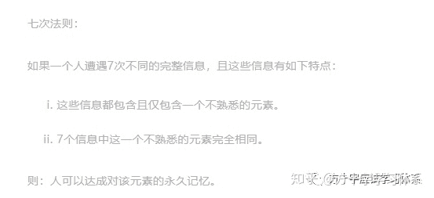</figure>

**除此之外**，当前的教学各方更重视对内容的输出，却忽略了对理解的认识与有效的理解方法。

学生在学习中即使知道要“理解”，也往往缺乏成体系的理解方法，从而按照过去的，零散的，模糊的经验去理解知识点，效率一般较为低下。

<figure data-size="normal"></figure>

**而从信息源与获取信息的角度来说**，当前的信息源体系对于学生的理解并不友好。这种不友好主要体现在两个方面：

**1.信息源的设计只注重知识体系本身的完整性和正确性，缺乏对“让初学者更为轻易的理解”这样的目标的追求。**

比如很多国内的数学教材，内容丰富，逻辑严密，但初学者看着就有如天书一般难以掌握，且存在着很多“编写者认为读者一定会明白因此而省略”的情况。

很多课堂也存在着类似的问题。

<figure data-size="normal"></figure>

**2.当前线下课堂作为学生获取与理解信息的主要渠道，但线下课堂的统一性导致部分学生难以实时理解。**

由于客观原因，课堂老师不可能照顾每一个学生的理解进度，而不同学生的理解进度一定是不一样的。因此导致部分学生难以在课堂上对老师所讲授的内容建立理解。

这在理科等长逻辑链的课堂中更为普遍：一处不理解，便处处不理解。

<figure data-size="normal"></figure>

理解是应试学习中非常重要的一个环节，而由上文我们可以看出在旧体系中学生的理解存在诸多问题。

因此，下文我们将深入的认识应试学习中的“理解”环节，并提出一系列有助于理解的方法体系。

## **1.理解与学习观各环节的关系**

*   **理解与信息源的关系**

获取信息是理解信息的必要条件，学生无法理解未曾获取的信息（学生无法获取信息源中不存在的信息）。【大佬评注：信息源对理解的影响中，覆盖率是最基本也最重要的因素。获取信息是理解信息的必要条件，学生无法理解未曾获取的信息，因此覆盖率的下降必然导致学生理解的下降。】

一个好的信息源可以帮助学生更加轻易的建立对某知识点的理解（比如一本好书或一堂好课，学生在其中对知识的理解会更好）。【大佬评注：信息源的质量是另一个重要因素。】

而学生在学习中的理解可以被补充入h学生自己的信息源体系（学生的笔记也是信息源之一），从而优化，完善学生的信息源体系。【大佬评注：理解可以促进信息源的整合。】

*   **理解与应用的关系**

初步的理解是能够应用的必要条件。没有建立理解，即使已经完成记忆，也没办法进行应用。

比如让一个4岁的小孩将微分的定义死记硬背下来，小孩也没办法去解微分。

理解程度越深，能够完成的应用范围越广。

比如对学生建立对公式的初步理解后，便可以进行基础题的训练。而当学生对公式建立起更加深入，全面的理解后，在难题中对公式的使用也将变得游刃有余。

而对知识的应用反过来也对理解具有较强的促进效果。

*   **理解与记忆的关系**

理解并非记忆的必要条件，因为可以死记硬背。

记忆也并非理解的必要条件，比如学生理解了一个复杂的数学公式，却未必记得住它。

理解可以有效地促进记忆，提升记忆的效率。理解的越深入，记忆的越容易。

记忆可以有效地促进理解，建立记忆后理解也将更加深刻。

<figure data-size="normal">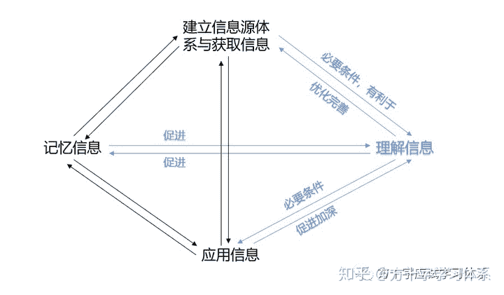</figure>

综上所述，理解是学习中非常重要的一个环节。下文我们将对理解建立更为深入的认识。

## **2.认识理解**

**（1）什么是理解**

根据《布卢姆教育目标分类学》的记载，理解即是需要在将要获得的“新”知识和已有知识之间建立联系。更为具体的说，理解是新获得的知识与现有的心理图式和认知框架的整合。

**通俗的来说，理解就是“看懂了，看明白了”。**

<figure data-size="normal">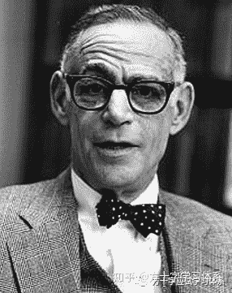

<figcaption>布卢姆（B·S·BLOOM，1913～1999），曾任芝加哥大学名誉教授。他是泰勒的学生助手和同事。他继承了泰勒的研究成果，率先建立了教育目标分类系统</figcaption>

</figure>

**（2）对理解的分类**

理解，可以分为客观的理解，与主观的理解感。

**客观的理解，即客观上正确的理解，是新知识与已有知识建立的正确的链接。**

比如学生能够用正确的方式解释某个新的知识点，便是学生对该知识点已经建立起客观的理解的表现之一。

**主观的理解，即理解感，本质上是一种感受。**就是学生在学习中所体会到的“我明白了”，“我顿悟了”的感觉。

客观的理解与主观的理解存在一定的**独立性**。

对于有的学生来说，即使已经可以很好地解释该知识点，但头脑中对这种理解方式仍然充满怀疑，便是“**客观上已理解，主观上没有理解感**”。

这种情况下，学生难以在应用中顺利的调取该知识点，也难以完成对该知识点的记忆。

因为学生会不断的怀疑“这么理解是不是对的”并对错误产生恐惧感，分心陷入怀疑中，从而用于应用和记忆的智力资源大大减少，大大降低了应用与记忆的效率。

<figure data-size="normal"></figure>

而对于有的学生来说，他可能在以某种错误的方式解释某个知识点而不自知。这种情况下，**他主观上的感受是“我懂了”，但客观上却没有建立正确的理解**。

这种情况下，盲目的记忆将会强化错误，而当投入应用时也将出现差错。

<figure data-size="normal"></figure>

因此，当我们说到“理解”时，必然是主观的理解感与客观的正确理解的统一，缺一不可。

**（3）理解的原理**

从神经科学的角度来说，理解是把一个新的刺激引起的神经反应，与以往已经建立的神经环路连接起来的过程。

<figure data-size="normal"></figure>

从认知科学的角度来说，**理解是新知识的全部与学生已有的知识结构建立连接的过程。**

知识结构，就是一系列紧密联系的知识。

假如你学的是高中数学，那么对于你来说，关于高中数学的知识结构就是你所知道的所有关于高中数学的知识及其联系的总和。

我们可以把知识结构比作学生思想中的一座城市，一个个知识点便是其中的一栋栋高楼。而连接，便是高楼间四通八达的大马路。

<figure data-size="normal"></figure>

而理解，便是用这些已有的知识去链接新知识的过程，好比一个城市中，一栋新的高楼落成之后，与其他的高楼要有马路相联通。

根据《布卢姆教育目标分类学》的记载，这种“链接”的方式包括了解释，举例，分类，总结，推断，比较，说明。

而在斯科特.杨的《如何高效学习》中，这种“链接”包括了比喻，拓展，应用。

<figure data-size="normal">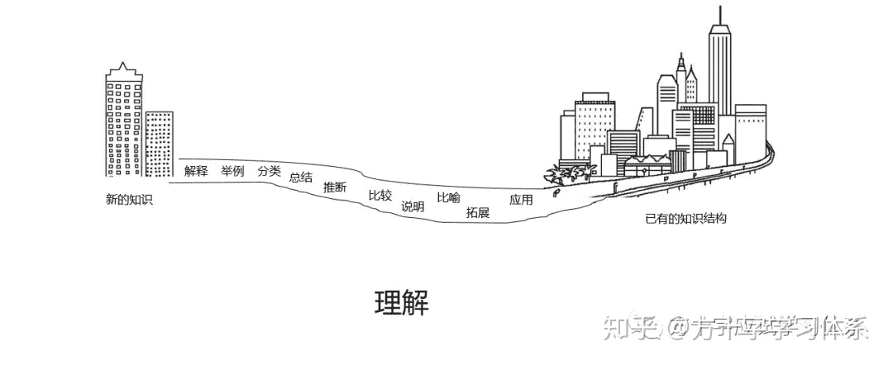</figure>

比如有的学生在理解电流的概念时，用水流作比，取得了很好的理解效果，便是比喻的方法。这里就是将学生已有知识结构中“水流”的概念与新的知识“电流”相链接的过程。

对于已经进入应试学习阶段的学生来说，**每个学生都已经具备了一系列基础的知识结构**，比如生活经验，基础的学科知识，常识观念等等。我们对后续学科知识的理解，便是建立在这种知识结构的起点之上。

比如上文中“水流”的概念实际上便是生活经验中的知识。

<figure data-size="normal">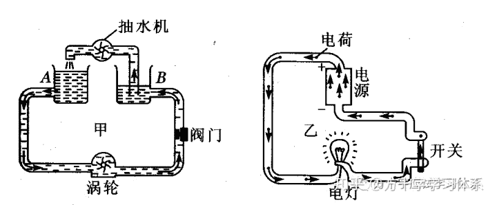</figure>

根据原理模型，从整体上来看，所谓的强化理解，可以分为3个方向：

*   扩充知识结构。知识结构越庞大复杂，可供连接的知识点便越多。从方法论的层面来说，就是多学，多经历。即使是应试之外的知识，也会对应试学习的理解有所帮助，而且其作用不容小觑（虽然考试不考水流，但如果学生对水流没有概念，便无法用水流去理解电流）。

*   建立尽可能多的连接。连接越多，理解的越深刻，也就越有助于之后的应用，记忆，以及以该知识点为基础的其他知识点的理解。

*   尽可能的建立更强的连接。虽然归纳，比喻这样的弱连接可以有效的帮助理解，但最后我们还是需要将所有的知识点以科学稳定的逻辑结构相关联，从而形成更加高效有序的学科知识体系。

**（4）理解的层次**

理解存在层次，所谓“初步理解”，“深入理解”，所描述的便是理解的层次。

从本质上来说，理解的层次的加深便是新知识与已有知识结构建立愈加复杂，强壮的链接的过程。

这种理解层次加深的原因，既是新知识与当前知识结构逐步建立更多，更强的连接的结果，也是随着知识结构本身的扩充，新知识与不断发展的知识结构中的扩充部分逐步建立更多，更强的连接的结果。

<figure data-size="normal">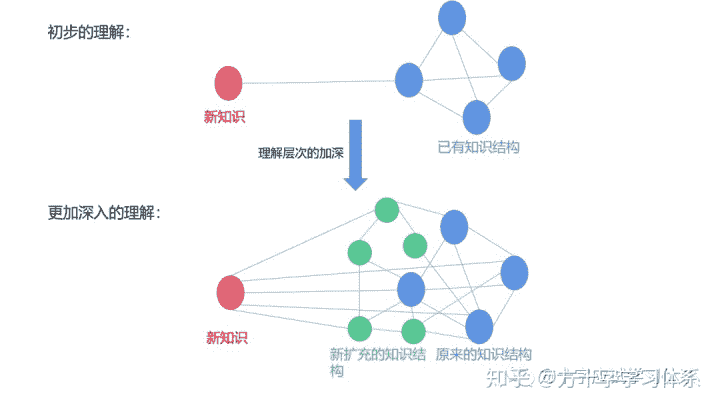</figure>

好比在城市外围，一幢新的高楼建成后，与其相连的马路不断增多，变宽。

而城市本身的发展壮大也让人从这幢高楼出发，可以到达更多的地方；同时从更多的地方出发，也可以便捷的到达这幢高楼。

高楼逐渐由新的高楼变为了城市的一部分。

<figure data-size="normal"></figure>

**（5）应试学习中理解的度**

从客观的角度来说，宇宙中所有的知识都是相互连接的。人类的全体认知只是宇宙中所有知识的一部分。

因此可以说：近似来看，理解永无止境，理解永不完美。

而对于参与应试的学生来说，无需对所学的所有知识建立过于深入的理解。过于深入的理解既不必要，也不合理，会在徒增学习难度的同时降低学习效率，浪费时间。

比如一个高中学生对加法的理解，仅需要知道加法的运算法则即可。如果让他去学习诸如“加法是一个阿贝尔群”这样的知识，便是荒谬的。

对于参与应试学习的学生来说，理解的层次当以应试的需求为度。

> 笑话一则：
> 小朋友们，我们今天来学习加法，加法是阿贝尔群……
> 小朋友们，我们今天学习自然数，自然数是皮亚诺公理……
> 小朋友们，在学习加法之前，我们先打开高等数学第二章，朴素集合论……
> …………………………
> 宝贝，今天学校数学课都学了些啥啊？
> 老师教了我们好多外国人的名字，阿贝尔、皮亚诺，康托尔、欧拉、希尔伯特、拉格朗日、高斯、哥德尔……
> 宝贝，你们开始学习加法了吗？
> 还没，老师说我们要先学习朴素集合论、公理化集合论、皮亚诺公理、整数集、群论、阿贝尔群，然后才能理解加法的本质，加法现在已经改到高中课程了。

## **3.为什么会不理解？**

**（1）对“不理解”的分类**

我们的目标是希望学生把知识从不理解变为理解。而在现实中，我们也会发现有的学生对有的知识点一直不理解，或理解层次不够。

因此，我们首先需要明白当学生不理解某一知识点的时候，问题出在了哪里。

<figure data-size="normal">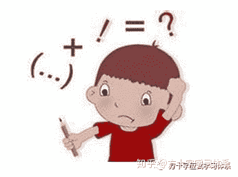</figure>

首先我们需要意识到，学生对知识的不理解，可以分为短时间的，**暂时的不理解**，以及**长期的不理解**。

**暂时的不理解，类似于课没听懂，书没看懂，今天学的有点迷糊的情况。**

**长期的不理解，就是存在了很久的对某些知识点的不理解。**

<figure data-size="normal">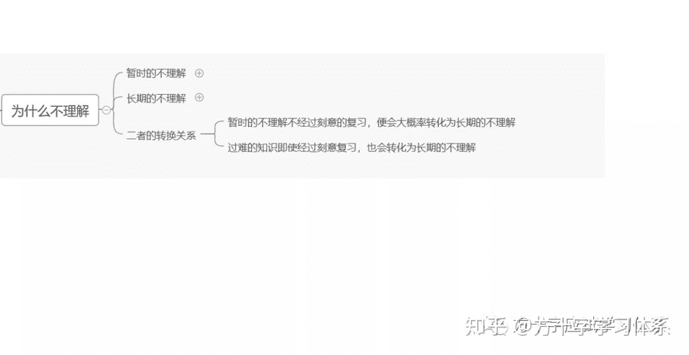</figure>

一般来说，暂时的不理解经过刻意的复习与训练后，便会转变为理解。而不经过上述步骤，便会大概率转化为长期的不理解。

某些相对于某些学生理解难度过大的信息，也会在暂时的不理解后，即使经过了刻意的复习与训练也难以建立理解，从而转化为长期的不理解。

比如我们难以让一个3岁的小孩去理解微积分。而普通学生在学习中一味的赶进度，忽视基础知识的学习，也会出现类似的问题。

**（2）暂时不理解的原因**

一般来说，暂时的不理解最主要的原因实际上是”信息过载“。

当我们上课的时候，一开始还能跟得上，后面就越听越不懂。

或者当我们看书的时候，一开始还能看懂，后面越看越看不懂，经常看了后面就忘了前面说的是什么。

这就是”**信息过载**“的典型表现。

<figure data-size="normal"></figure>

而就本质而言，想要明白”**信息过载**“，首先我们需要明白”**组块**“的概念。

**组块是根据意义将信息碎片组成的集合。**

比如我们可以把数字0，5，2，3，1，4，1视作7个信息碎片，而由这7个碎片所构成的数字串”5201314“便具有了一个意义：”我爱你一生一世“。这个数字串便是一个组块。

我们建构整体的知识结构时，组块便是我们思维的砖瓦。同时，**组块也是短期记忆容量的信息单位。**

<figure data-size="normal"></figure>

我们在学习过程中，一般都会追求“上课听懂”，“看书看懂”。其本质便是希望当我们从信息源中获取信息之后，立刻建立对信息的理解。

所谓的”暂时不理解”，就是我们在获取信息后，未能立刻建立对信息的理解。

在局部的学习中（比如一堂课，或正在看一本书），**我们所获取的信息会首先进入短时记忆中形成一个个的组块，并接受大脑的处理**。

<figure data-size="normal">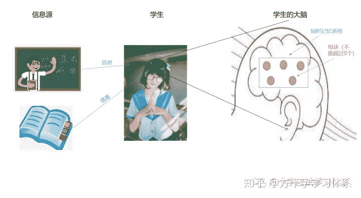</figure>

根据科学研究，人的短时记忆的容量有限，能够被容纳与处理的信息基本在4~5个组块左右。

而当待处理的组块超过了5个，达到更多的数目，大脑短时间内便由于无法处理这么多信息量，从而出现“信息过载”，从而表现为“学不进去，听不懂”。

<figure data-size="normal">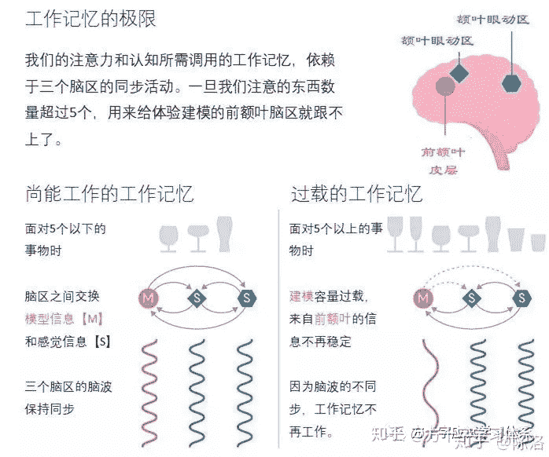</figure>

虽然暂时的不理解可以通过后续的复习与应用训练得以有效的解决，但这种暂时的不理解仍然带来了较为不良的学习体验，对学习动机有一定的不良影响。

因此，我们需要尽可能的避免该情况的出现，并在该情况出现后有较完善的解决方案。

**（3）暂时不理解的解决方案**

**从主观层面来说**，首先我们需要认识到“听不懂”，“看不懂”是很容易出现的现象，并对它的本质建立一定的认识，从而接纳它的存在，避免因为它的出现而产生“自我否定”的情绪。

其次，我们要对学习的进度建立合理的期望，尽可能的避免“赶进度”，“超前学习”，让我们的学习曲线尽可能的符合人的认知规律。

<figure data-size="normal">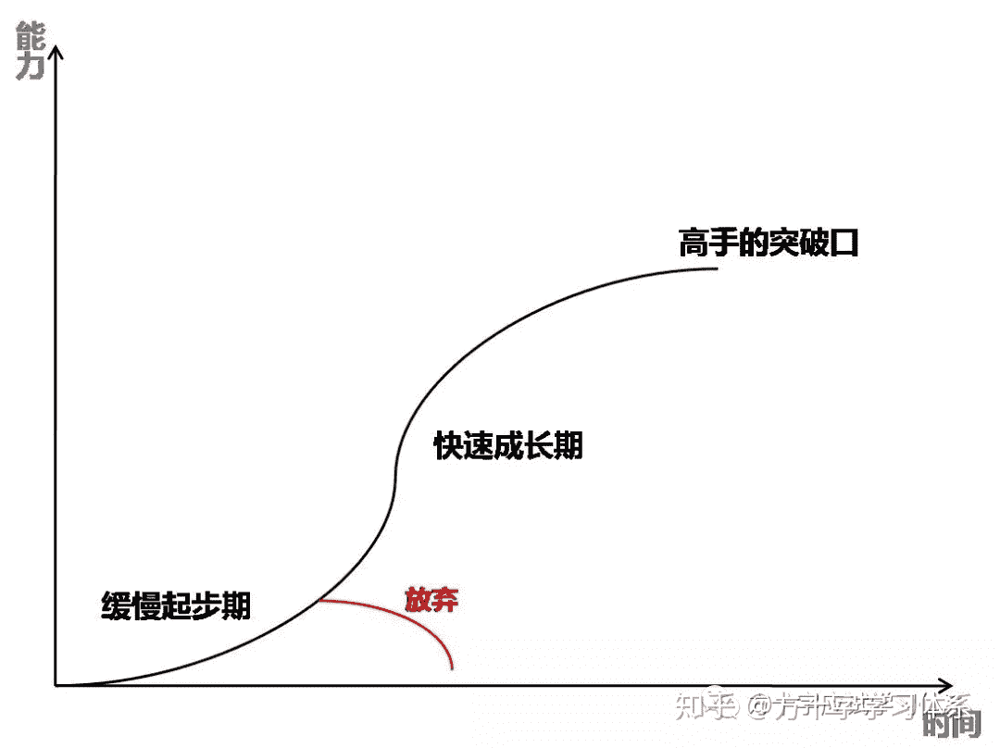</figure>

而**从客观的层面上来说**，**我们首先需要做的是找到“理解友好型”的信息源**。

理解友好型信息源，即学习者可以从该信息源中获取易于理解的信息。

比如“将水流比作电流”往往是老师教的，这便是信息源对理解的重要作用的体现。如果让学生自己找到这种类比，难度便是较大的。

以课程内容为例，有的老师讲课虽然专业，但进度快，难度大，省略内容多，对于初学者来说很容易“跟不上”。

而有的老师讲课幽默风趣，深入浅出，举例恰当好玩。相比前者，初学者在后者的课堂中一定会产生更好的理解效果。

<figure data-size="normal"></figure>

而从课堂形式来说，线下课的理解效果往往不如线上课。

线上课独到的优势在于：如果学生感到自己没能理解，便可以跳回去重新听，直到自己理解为止。这在线下课中是难以实现的。

所以从课堂的角度来说，一个好老师的视频课，便是一种“理解友好型”的信息源。

<figure data-size="normal"></figure>

除课程之外，也可以从书本，多媒体，给你答疑的同学等信息源中挑选其中的“理解友好型”信息源。

**其次，当学生完成一次信息的获取后，一定要有后续的应用训练与按时复习。**

往往学生刚开始还会有“不理解”之感，而在之后的应用与复习中产生“顿悟”的感觉，从而完成对知识点的有效理解。

其本质便是原有的零散的知识点结为组块，并与原有知识结构产生了有效的链接。

这个本质过程往往并非由学生主动控制，而是大脑自发的运转，甚至会发生在睡眠中。

而主动的应用与复习将会对该过程具有极大的促进作用。

<figure data-size="normal"></figure>

除此之外，当学生无法找到“理解友好型”的信息源时，便需要妥协的采取一些策略，比如“课前预习”，“记好笔记”，“课后复习”等。这些方法大家都耳熟能详，下文便不再赘述。

但需要强调的是，这些方法只是缺乏更好的信息源基础之下的妥协方案，更为基础的工作仍然是优化信息源体系。

**（3）长期不理解的原因**

从主观上来说，长期的不理解主要是缺乏理解感，存在对“这种理解方式是否正确”的怀疑感，或者单纯的觉得“总有什么地方没搞明白”。

从客观上来说，长期的不理解主要存在2个原因：

*   知识结构中缺乏必要的信息。
*   尚未建立必要的链接。

<figure data-size="normal">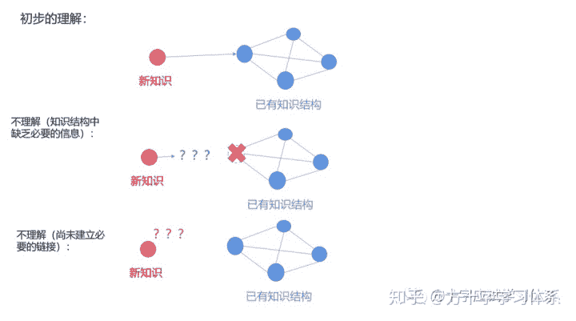</figure>

比如让一个2岁的小孩去理解“三角形的内角和等于180度”，当这个2岁的小朋友尚未建立对“三角形”，“角度”的概念时，他就无法理解这个定理。这就是知识结构中缺乏必要的信息。

<figure data-size="normal">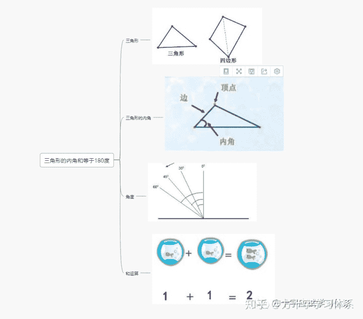

<figcaption>需要在理解上述概念的基础上，才能初步理解“三角形内角和等于180度”这个定理</figcaption>

</figure>

而对于后者，则是学生的知识结构中已存在了可以用于理解的信息，但学生尚未将这些信息与待理解的知识建立链接，学生便也会有“不理解”之感。

比如有的学生一开始学习“电流”的概念及相关定理的时候感到难以理解，但当有老师告诉他“可以用水流的规律类比电流的规律”时，这个学生可能就会突然明白，产生“顿悟”的感觉。

这里“水流的规律”便是已存在于学生知识结构中的信息，只需要将其建立链接即可。

<figure data-size="normal">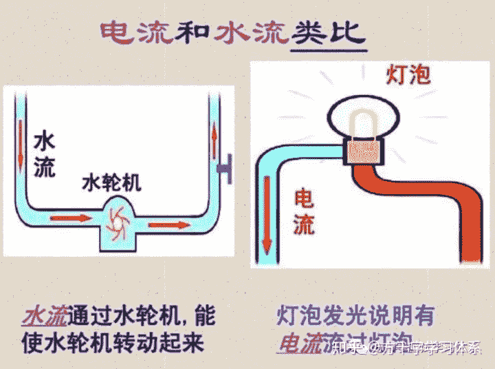</figure>

当我们通过上文认识到“不理解”的原因之后，下文方方在参考各学习大家的文献资料的基础上，提出了一系列帮助学生理解知识的解决方案。

## **4.如何理解？**

**（1）什么时候需要进行刻意的理解训练？**

首先需要强调的是，**下文中所提及的所有方法并不需要全盘运用。**

对于学生来说，有很多知识理解起来很容易，无需特殊的方法即可建立有效的理解。对于这部分知识来说，仅需要进行后续的应用以及记忆即可。

主要是两类知识需要我们用后文的方法进行刻意的理解训练：

1.**困难知识**，即上文所描述的“未能建立必要的理解”的知识。

2.**关键知识**，即后续学科知识结构建设的基础，或考试重点考察的知识点，需要理解的越深入越好的知识。

当然这并非绝对，学生也可以在学有余力的情况下，凭兴趣对其他的知识建立更加深入的理解，这将对学习整体都有良好的促进作用，也可以灵活的运用与搭配下文提出的部分方法去理解新的知识。

但一定要在学有余力的基础上，尽量不要在主业尚未完成的基础上钻牛角尖。

<figure data-size="normal">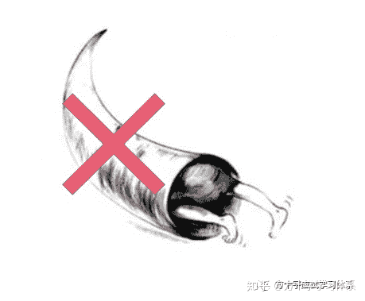

<figcaption>在学习中不要钻牛角尖</figcaption>

</figure>

**（2）如何提升主观的理解感？**

上文我们提到，**“理解”必然是主观的理解感与客观的有效理解的统一，缺一不可。**

对于**主观的理解感**需要建立在客观的正确理解的基础之上。

提升主观的“理解感”主要有两个思路：

**1.在大量的理解与应用训练中获取足够多的正反馈。**

**2.寻求权威的确认，包括权威的人士，书籍，文献等。**

提升主观理解感的思路较为简单，因此不做过多探讨。

下文主要探讨如何建立**客观的有效理解**。

**（3）如何建立客观的有效理解？**

首先，从**学习整体战略**的角度来说，有4个大思路可供参考：

**1.找到“理解友好型”的信息源并将其纳入学习者的信息源体系中。**

这个是最重要，最基础性的工作。由于上文已有详细讨论，此处不再赘述。

**2.事先建立对学科整体结构与大致内容的认识**

在正式的学科学习开始之前，我们需要在学习目标（也就是应试）的指导下，首先通过阅读目录，导论，大致翻阅相关书籍文献等方法，来完成对学科内容与结构的大致认识与理解。

这种大致的认识和理解很容易内化为学生的内在知识结构的一部分，并从整体上对后续具体学科知识的理解过程起到良好的促进效果。

<figure data-size="normal"></figure>

**3.从基础开始，按部就班的进行扎实的学习**

许多学生在学习中存在着“赶进度”，“不重视前期基础知识”，“重方法不重原理”等问题。

在这些错误思路的指导下，虽然学生可以在短期内取得较快的进步，但由于其知识结构存在较大缺陷，学生很容易就会碰见“瓶颈”，难以理解更为深入的知识点，也难以对之前的知识点进行更加灵活的迁移应用。

因此，从整体上来看，从基础开始，按部就班的进行扎实学习仍然是学习的大道。

虽然一开始学习速度会比较慢，但由于基础扎实，知识结构完整，后续的学习会随着理解力的提升越来越高效，其学习效果也将呈加速度的增长。

因此从整体上来说，不必追求短期快速的进步，而是要意识到，“慢即是快”。

<figure data-size="normal">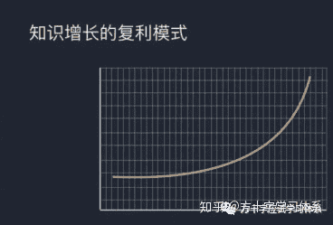</figure>

**4.认识到如下事实：理解并非一次完成，而是在多次学习（复习）中逐渐加深理解的层次。**

许多学生，包括许多教师在指导学生的过程中，都存在着“贪全求快”的问题，寄希望于学生通过一次性的连续学习，即建立起对相关知识深刻，全面的理解。

即使是麻省理工的学习高手斯科特.杨，在他的作品《如何高效学习》中所构建的整体性学习模型中，也试图要求学生一次性完成尽可能深入的理解（初步理解后即进行拓展学习）。

<figure data-size="normal">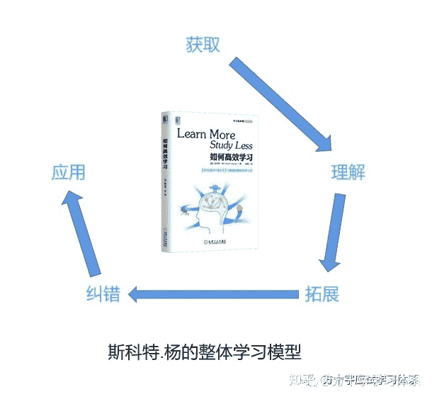

<figcaption>。。。纵向拓展有相当的难度，也是最有创造性的学习方式。但是，如果运用得当，其速度要比深度拓展中探究知识背景快得多。。。 ——斯科特.杨《如何高效学习》</figcaption>

</figure>

在该模型中，“拓展"即代表着更为深入的理解。

而从他的原文我们可以发现，即使对于他这样的学习高手，这种深入理解尚有一定难度，因此对于一般的初学者来说，初步理解后紧接着就进行诸如拓展这样的深入理解训练，便是一种不太恰当的方式。

实际上，人的知识结构作为一个不断发展的系统，有其内在的发展规律，如同一个小树苗不断的成长一般。如果罔顾学生的认知发展规律，一味的”拔苗助长“，便会最终效果不佳，得不偿失。

<figure data-size="normal"></figure>

其实从整体上来说，学生的认知过程符合事物发展的一般过程，即“曲折发展，螺旋上升”的一般规律。学生对知识的理解也是同理。

初学者无法一次性就对知识点建立完全深刻的理解，只有在不断的有效学习中，其对知识点的理解才能逐渐完善，深刻。这是由人的认知发展的一般规律所决定的。

如果用图表示，一个学生的理解层次将大致以如下方式加深：

<figure data-size="normal">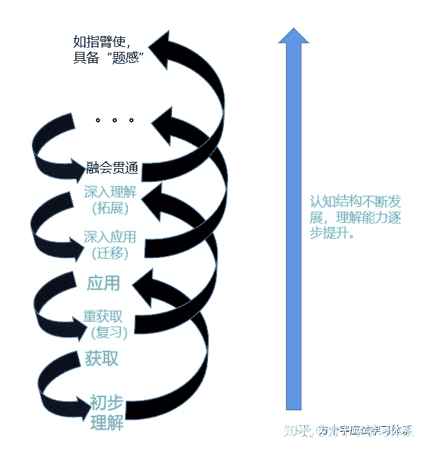</figure>

从某种程度上来说，斯科特杨的整体性学习模型是这个较为真实的认知过程模型的俯视图。

<figure data-size="normal">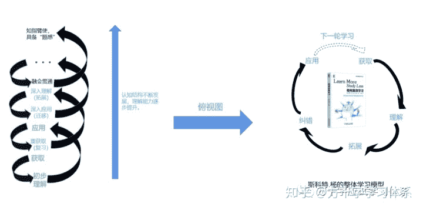</figure>

当我们建立起这样的观念之后，就可以在学习中对知识的理解过程有一个相对正确的期望，**允许自己在特定阶段内对知识建立必要而不完美的理解**，从而避免“短期无法建立更为深刻的理解”所造成的困惑与自我否定。

<figure data-size="normal"></figure>

而**从具体的知识理解过程**而言，可以大致分为3个主要阶段。每个阶段并非相邻，而是如上文的认知过程模型所示，依次排布在不同层次的螺旋线上。

每个阶段都有其适用的目标，理解层次，以及一系列的促进理解的方法。

下文我们将对3个主要阶段进行逐步讨论。

## **第一阶段：**

**首先需要将知识初步理解至可以应用的程度，即可进行初步的应用训练**

在第一阶段，我么们首先要认识一个概念：**非内容记忆**。

首先，我们需要认识到一句“废话”：学生在应试学习中所需要理解的知识点都是为了解决应试中的某类问题。

**而在应试学习中，所谓的“非内容记忆”，就是理解并记住知识点与考试问题的对应关系，也就是“记关系”，而不是“记内容”。**

<figure data-size="normal">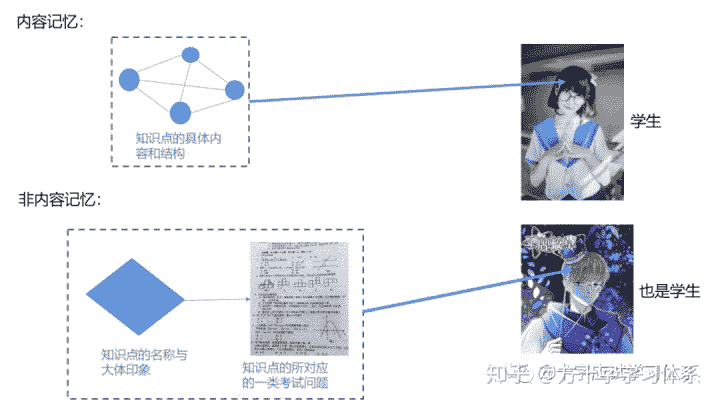</figure>

比如勾股定理的内容是：“*在平面上的一个直角三角形中，两个直角边边长的平方加起来等于斜边长的平方。如果设直角三角形的两条直角边长度分别是a和b，斜边长度是c，那么可以用数学语言表达：a²+b²=c²*”

那么在“非内容记忆”的学习过程中，我们只需要知道知道**“勾股定理”是用来解决“直角三角形三边关系相关的问题”**即可，而无需对勾股定理的具体内容开展事先深入的理解和记忆，只需要建立初步的理解，”会用“，能看懂相关习题的答案即可。

在后续初步的应用训练中，也无需要求学生必须像考试一样独立完成习题训练。

当对应的知识点没有记住时，只需要查询资料即可。而经过多次的训练与查询后，相关的知识点将会自然而然的达成更为深入的理解与记忆。

<figure data-size="normal"></figure>

这样做的好处，便是可以快速的帮助初学者建立对学科知识的初步认识理解。且这种学习方式难度不大，学习曲线较为友好，也更容易获得较为良好的学习体验，为后续的深入学习打下良好的基础。

## 
**第二阶段：**

第二阶段是初学者向高手进阶的重头戏。

当学生在第一阶段对知识完成了初步的理解与记忆，在学有余力的基础上（或者复习的时候），学生便可以有意识的对知识的内涵与外延进行更为深度的拓展，并在应用中进行有意识的迁移训练。

其目标在于尽可能多的建立新的知识与已有知识结构的联系，为最终目标打下基础。

<figure data-size="normal"></figure>

第二阶段的理解，可以分为“**理性层面**”的理解与“**感性层面**”的理解。

从**理性层面**的角度来说，”**拓展**“是该阶段的核心方法论。

其目标在于**将新知识与已有的学科知识结构建立链接，并围绕着新知识有意识的增加学科知识结构与内容并与新知识相链接，从而对新知识建立更为深刻的理解。**

从总目标来看，我们的拓展工作需要实现两个分目标：

**1.深入拓展知识的内涵（内容与结构）与外延，以及尽可能的围绕新的知识，获取并理解相关信息。这个过程本质上是对知识结构的扩充。**

**2.将新知识与已有知识结构建立链接。**

<figure data-size="normal">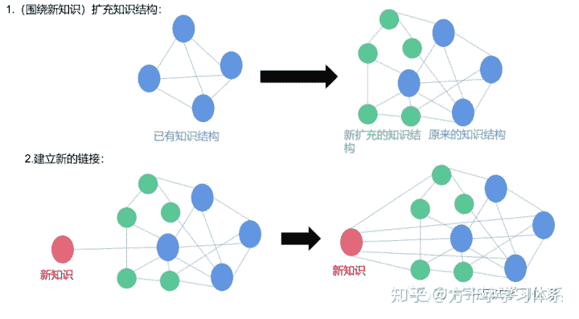</figure>

对于**前者**，核心的方法论是”**深度拓展**“与”**横向拓展**“。

*   **深度拓展**：

深度拓展即探究知识背景。比如该知识从何而来？如何得出的？

比如在数学中去追问某公式背后数学家的故事，或者去探索该公式是如何由其他公式推导而来，便是一种深度拓展。

深度拓展可以简单的理解为“追根溯源”。

深度拓展的缺点在于需要的线索较多，耗时较长。但通过深度拓展可以帮助学生建立更为深入的理解与记忆。

*   **横向拓展**

在一个知识体系中会有大量的类似结论，那么去探寻与新知识相类似的知识有哪些，或者新知识所对应的案例都有什么，便是一种横向拓展。

横向拓展可以简单的理解为“找类似”。

横向拓展意味着将新知识与其周围的知识建立链接。

<figure data-size="normal"></figure>

而对于**后者**，核心的方法论是”**纵向拓展**“。

*   **纵向拓展**

知识都遵循着一定的内在规律，同样的规律在其他知识中也会见到。纵向拓展，便是将内在规律相同或大体相似的知识建立链接。

比喻法是纵向拓展最好的方法之一，当然从整体上来说也是理解的最好方法之一。

比如我们在上文再三提到的“用水流比作电流”便是纵向拓展的典型案例，其效果我们也是有目共睹。

<figure data-size="normal">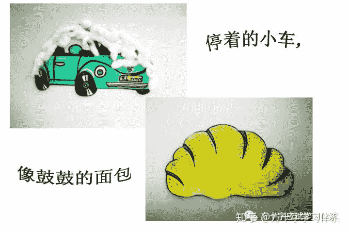</figure>

与理性层面的目标不同，**感性层面**的目标在于建立对知识的感觉，也就是将新知识与感性体验建立链接。

通俗的来说，就是去“感受”知识，比如在想象中“看到，听到，甚至闻到，尝到，摸到”知识，从而对知识建立起更为丰富的理解。

从**感性层面**的角度来说，”**内在化**“与“**图表法**”可以有效的发挥作用。

*   **内在化**

所谓内在化，就是去想象知识的图像，声音，触觉，情感等。

一般来说，一幅图就足够了，但是能够调动更多的感知与知识联系在一起，甚至与情感相连，得到的关联一定比单一的图像更强。

在斯科特.杨的《如何高效学习》中，作者记载了一套内在化的流程，在此分享出来以供参考：

（1）明确你要内在化的概念。

（2）从在脑海中建立图像开始，也可以辅之以纸上的草图。

（3）想办法让图像动起来。

（4）加上其他的感官，尝试去用手拿它，摸它，打开它，闻它的味道（你能闻到数学公式的味道么？），听它的声音，动用你身体的所有感官，将所有的感觉与动态的图像相联系。

（5）尝试加入更多感觉与情感（喜怒哀乐忧思恐等）。

（6）不断重复与优化。

<figure data-size="normal">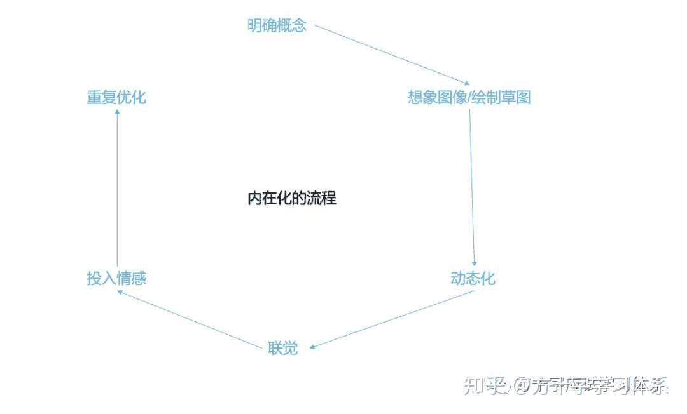</figure>

> 。。。内在化行列式的过程，首先要想象一个2x2的表格，其中有4个数字，然后想象我的右手从左上的数字挪动到右下的数字，同时想象在表格上留下了一条蓝色的条纹，而且因为我手上抓了数字而变得沉重。接着再想象我的左手从右上的数字划到左下的数字，同时留下了红色的条纹，而右手感到重量减轻。。。 ——斯科特.杨《如何高效学习》

*   **图表法**

图表法是内在化的一种纸面上的简化，相对内在化而言，其优势在于可以将抽象的知识可视化，从而填补了内在化方法的短板。

一般来说，应试学习中可以用得上的图表类型主要有3种：**流程图**，**概念图**，**图像**。三种类型的适当组合可以帮助学生理解几乎所有的概念。

所谓**流程图**，就是以特定的图形符号加上说明，表示算法，流程的图。

一个专业的流程图大概长成这个样子：

<figure data-size="normal">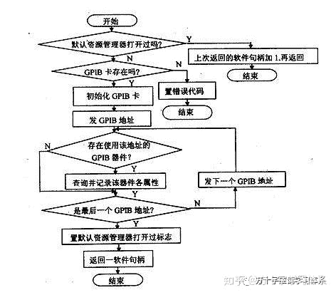</figure>

当然，相对于用图表法理解知识来说，我们不需要建立如此专业的流程图，只要能正确的表现出知识，并且自己可以看懂即可。

实际上文的“内在化流程”的配图就是一个简单的流程图，做成那个样子即可。

<figure data-size="normal">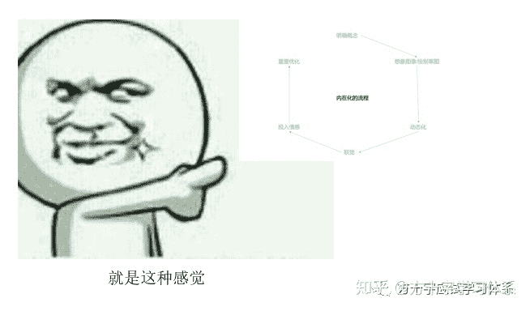</figure>

所谓**概念图**，是一种用节点代表概念，连线表示概念间关系的图示法，如下图所示：

<figure data-size="normal">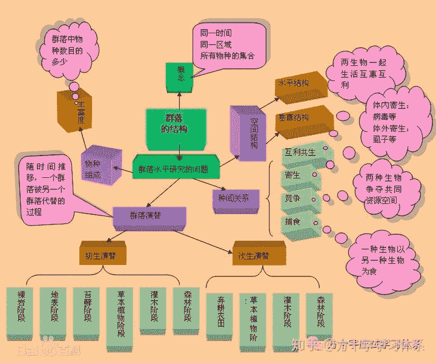</figure>

思维导图，也是一种概念图。

而“**图像**”没有明确的定义，在笔记，草纸上对概念印象的简单涂鸦代替文字以及观点之间的联系都可以称之为图像。图像可以视作流程图与概念图之外的补充。

图像相比文字更加生动形象，易于理解和记忆。

<figure data-size="normal">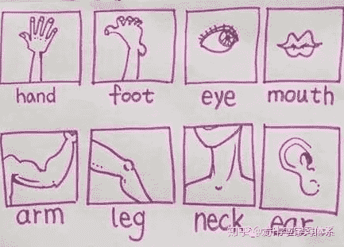</figure>

## **第三阶段：**

第三阶段的目标，是把知识变成一种“感觉”，建立“题感”。

在该阶段，我们的重点不再是对单一知识点的深入理解，而是对整个内在知识结构的维护与优化，使之更紧密，更高效，达到“如臂使指”的程度。

从方法的角度来说，并没有什么特殊的方法可以帮助学生直达第三阶段。第三阶段并非强求而来，而是在第一阶段与第二阶段的反复学习训练中逐步达成的效果。

<figure data-size="normal"></figure>

因此，从客观的角度来说，达成第三阶段的方法就是“**按照科学合理的方法多学多练**”，无他，唯手熟尔。

当然，在该阶段的应用训练思路与初学者的训练思路肯定有所差异，方方将在后续的文章中加以讨论。

而从主观的角度来说，最重要的就是放平心态，扎实学习，不要着急，合理期望，避免拔苗助长，意识到“慢即是快”。

## **5.总结**

本文围绕着“如何理解知识”进行讨论，归为方十字矛盾分析体系——矛盾2——方十字学习观——理解信息中，服从矛盾分析体系与学习观所述一切原理。

本文从本质，认识，具体方法这几个层面完整的阐释了如何帮助学生建立对新知识的理解，对学生本人，未来的应试咨询团队，以及组织工作都有一定的参考意义。

上文所述一切理论仅为参考，在实践中仍需具体问题具体分析，结合实际不断优化。