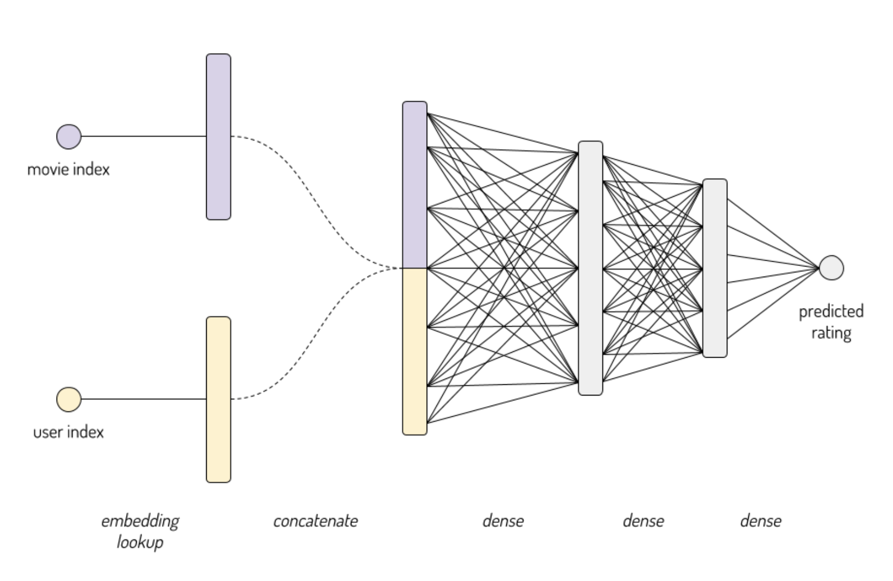
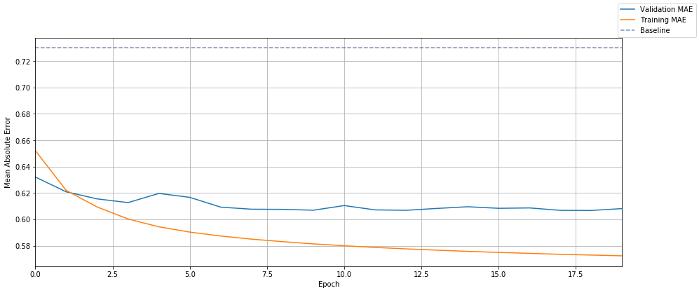
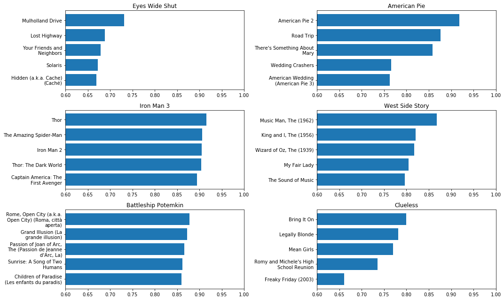
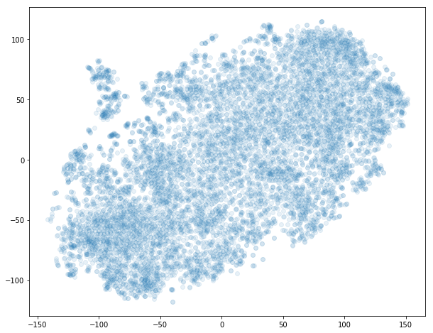
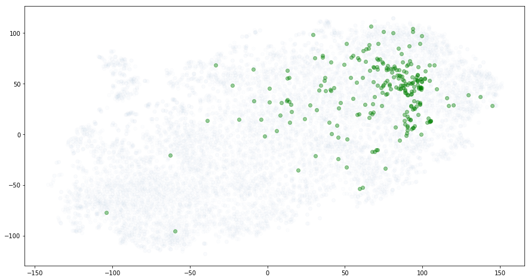
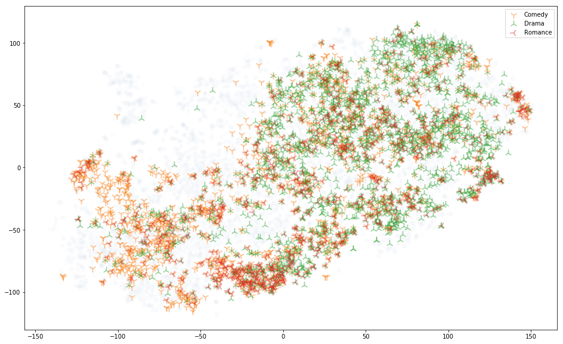

# Kaggle 官方教程：嵌入

> 原文：[Embeddings](https://www.kaggle.com/learn/embeddings)
> 
> 译者：[飞龙](https://github.com/wizardforcel)
> 
> 协议：[CC BY-NC-SA 4.0](http://creativecommons.org/licenses/by-nc-sa/4.0/)

P.S...

本课程仍处于测试阶段，因此我很乐意收到你的反馈意见。 如果你有时间填写[本课程的超短期调查](https://form.jotform.com/82826168584267)，我将非常感激。 你也可以在下面的评论中或在[学习论坛](https://www.kaggle.com/learn-forum)上留下公开反馈。

## 一、嵌入层

欢迎阅读嵌入主题的第一课。 在本课程中，我将展示如何使用`tf.keras` API 实现带嵌入层的模型。 嵌入是一种技术，使深度神经网络能够处理稀疏的类别变量。

### 稀疏类别变量

我的意思是一个具有许多可能值（高基数）的类别变量，其中少数（通常只有 1）存在于任何给定的观察中。 一个很好的例子是词汇。 英语中的词汇是成千上万的，但一条推文可能只有十几个词。 词嵌入是将深度学习应用于自然语言的关键技术。 但其他例子还有很多。

例如，[洛杉矶餐馆检查](https://www.kaggle.com/meganrisdal/la-county-restaurant-inspections-and-violations)的这个数据集有几个稀疏的分类变量，包括：

+   `employee_id`：卫生部门的哪些员工进行了这次检查？ （约 250 个不同的值）
+   `facility_zip`：餐厅的邮政编码是什么？ （约 3,000 个不同的值）
+   `owner_name`：谁拥有餐厅？ （约 35,000 个不同的值）

对于将任何这些变量用作网络的输入，嵌入层是个好主意。

在本课程中，我将使用 [MovieLens 数据集](https://www.kaggle.com/grouplens/movielens-20m-dataset)作为示例。

### MovieLens

MovieLens 数据集由用户给电影的评分组成。这是一个示例：


| | userId | movieId | rating | y | title | year |
| --- | --- | --- | --- | --- | --- | --- |
| 12904240 | 85731 | 1883 | 4.5 | 0.974498 | Labyrinth | 1986 |
| 6089380 | 45008 | 1221 | 4.5 | 0.974498 | Femme Nikita, La (Nikita) | 1990 |
| 17901393 | 125144 | 3948 | 4.0 | 0.474498 | The Alamo | 1960 |
| 9024816 | 122230 | 3027 | 3.5 | -0.025502 | Toy Story 2 | 1999 |
| 11655659 | 21156 | 5202 | 3.0 | -0.525502 | My Big Fat Greek Wedding |

评分范围是 0.5 到 5。我们的目标是预测由给定用户`ui`给出的，特定电影`mj`的评分。 （列`y`只是评分列的副本，减去了平均值 - 这在以后会有用。）

`userId`和`movieId`都是稀疏分类变量。 它们有许多可能的值：

```
138,493 个独立用户评分了 26,744 个不同的电影（总评分是 20,000,263 个）
```

### 在 Keras 中创建评分预测模型

我们想要构建一个模型，它接受用户`ui`和电影`mj`，并输出 0.5-5 的数字，表示我们认为该用户将为该电影评分多少星。

> 注：你可能已经注意到`MovieLens`数据集包含每部电影的信息，例如标题，发行年份，一组流派和用户指定的标签。 但就目前而言，我们不会试图利用任何额外的信息。

我说我们需要一个嵌入层来处理这些输入。 为什么？ 让我们回顾一些替代方案，看看为什么它们不起作用。

### 坏主意 #1：使用用户和电影 ID 作为数值输入

为什么不将用户 ID 和电影 ID 作为数值来输入，然后添加一些密集层？即：

```py
model = keras.Sequential([
    # 2 input values: user id and movie id
    keras.layers.Dense(256, input_dim=2, activation='relu'),
    keras.layers.Dense(32, activation='relu'),
    # A single output node, containing the predicted rating
    keras.layers.Dense(1)
])
```

用最简单的术语来说，神经网络的原理是对输入进行数学运算。 但分配给用户和电影的 ID 的实际数值是没有意义的。《辛德勒的名单》的 id 为 527，而《非常嫌疑犯》的 id 为 50，但这并不意味着《辛德勒的名单》比《非常嫌疑犯》大十倍。

### 坏主意 #2：独热编码的用户和电影输入

如果你不熟悉单热编码，可能需要查看我们的课程[“使用独热编码处理类别数据”](https://www.kaggle.com/dansbecker/using-categorical-data-with-one-hot-encoding)。

在该课程中，我们说独热编码是“类别数据的标准方法”。 那么为什么这是一个坏主意呢？ 让我们看看模型是什么样子，它接受独热编码的用户和电影。

```py
input_size = n_movies + n_users
print("Input size = {:,} ({:,} movies + {:,} users)".format(
    input_size, n_movies, n_users,
))
model = keras.Sequential([
    # One hidden layer with 128 units
    keras.layers.Dense(128, input_dim=input_size, activation='relu'),
    # A single output node, containing the predicted rating
    keras.layers.Dense(1)
])
model.summary()
'''
Input size = 165,237 (26,744 movies + 138,493 users)
_________________________________________________________________
Layer (type)                 Output Shape              Param #   
=================================================================
dense_3 (Dense)              (None, 128)               21150464  
_________________________________________________________________
dense_4 (Dense)              (None, 1)                 129       
=================================================================
Total params: 21,150,593
Trainable params: 21,150,593
Non-trainable params: 0
_________________________________________________________________
'''
```

这里的一个基本问题是扩展和效率。 我们模型的单个输入是包含 165,237 个数字的向量（其中我们知道 165,235 是零）。 我们整个 2000 万个评分实例数据集的特征数据，将需要一个大小为 20,000,000 x 165,237 或大约 3 万亿个数字的二维数组。 但愿你能把这一切都放进内存中！

此外，在我们的模型上进行训练和推断将是低效的。 为了计算我们的第一个隐藏层的激活，我们需要将我们的 165k 输入乘以大约 2100 万个权重 - 但是这些乘积的绝大多数都将为零。

对于具有少量可能值的分类变量，例如`{Red, Yellow, Green}`或`{Monday, Tuesday, Wednesday, Friday, Saturday, Sunday}`，独热编码是合适的。 但在像我们的电影推荐问题的情况下，它并不是那么好，其中变量有数十或数十万个可能的值。

### 好主意：嵌入层

简而言之，嵌入层将一组离散对象（如单词，用户或电影）中的每个元素映射到实数的密集（嵌入）向量。

> 注：一个关键的实现细节是嵌入层接受被嵌入实体的索引作为输入（即我们可以将`userId`和`movieId`作为输入）。 你可以将其视为一种“查找表”。 这比采用独热向量并进行巨大的矩阵乘法要有效得多！

例如，如果我们为电影学习大小为 8 的嵌入，则《律政俏佳人》（`index = 4352`）的嵌入可能如下所示：

```
[1.624,−0.612,−0.528,−1.073,0.865,−2.302,1.745,−0.761]
```

它们来自哪里？ 我们使用随机噪声为每个用户和电影初始化嵌入，然后我们将它们训练，作为整体评分预测模型训练过程的一部分。

他们的意思是什么？ 如果对象的嵌入有任何好处，它应该捕获该对象的一些有用的潜在属性。 但这里的关键词是潜在，也就是隐藏的。 由模型来发现实体的任何属性，并在嵌入空间中对它们编码，对预测任务有用。 听起来很神秘？ 在后面的课程中，我将展示一些解释习得的嵌入的技术，例如使用 t-SNE 算法将它们可视化。

### 实现它

我希望我的模型是这样：



需要注意的一个关键点是，这个网络不仅仅是从输入到输出的一堆层级。 我们将用户和电影视为单独的输入，只有在每个输入经过自己的嵌入层之后才会聚集在一起。

这意味着[`keras.Sequential`](https://www.tensorflow.org/api_docs/python/tf/keras/Sequential)类（你可能从我们的[图像数据深度学习课程](https://www.kaggle.com/learn/deep-learning)中熟悉它）将无法工作。 我们需要使用[`keras.Model`](https://www.tensorflow.org/api_docs/python/tf/keras/Model)类转向更强大的“函数式 API”。 函数式 API 的更多详细信息，请查看 [Keras 的指南](https://keras.io/getting-started/functional-api-guide/)。

这是代码：

```py
hidden_units = (32,4)
movie_embedding_size = 8
user_embedding_size = 8

# Each instance will consist of two inputs: a single user id, and a single movie id
user_id_input = keras.Input(shape=(1,), name='user_id')
movie_id_input = keras.Input(shape=(1,), name='movie_id')
user_embedded = keras.layers.Embedding(df.userId.max()+1, user_embedding_size, 
                                       input_length=1, name='user_embedding')(user_id_input)
movie_embedded = keras.layers.Embedding(df.movieId.max()+1, movie_embedding_size, 
                                        input_length=1, name='movie_embedding')(movie_id_input)
# Concatenate the embeddings (and remove the useless extra dimension)
concatenated = keras.layers.Concatenate()([user_embedded, movie_embedded])
out = keras.layers.Flatten()(concatenated)

# Add one or more hidden layers
for n_hidden in hidden_units:
    out = keras.layers.Dense(n_hidden, activation='relu')(out)

# A single output: our predicted rating
out = keras.layers.Dense(1, activation='linear', name='prediction')(out)

model = keras.Model(
    inputs = [user_id_input, movie_id_input],
    outputs = out,
)
model.summary(line_length=88)
'''
________________________________________________________________________________________
Layer (type)                 Output Shape       Param #   Connected to                  
========================================================================================
user_id (InputLayer)         (None, 1)          0                                       
________________________________________________________________________________________
movie_id (InputLayer)        (None, 1)          0                                       
________________________________________________________________________________________
user_embedding (Embedding)   (None, 1, 8)       1107952   user_id[0][0]                 
________________________________________________________________________________________
movie_embedding (Embedding)  (None, 1, 8)       213952    movie_id[0][0]                
________________________________________________________________________________________
concatenate (Concatenate)    (None, 1, 16)      0         user_embedding[0][0]          
                                                          movie_embedding[0][0]         
________________________________________________________________________________________
flatten (Flatten)            (None, 16)         0         concatenate[0][0]             
________________________________________________________________________________________
dense_5 (Dense)              (None, 32)         544       flatten[0][0]                 
________________________________________________________________________________________
dense_6 (Dense)              (None, 4)          132       dense_5[0][0]                 
________________________________________________________________________________________
prediction (Dense)           (None, 1)          5         dense_6[0][0]                 
========================================================================================
Total params: 1,322,585
Trainable params: 1,322,585
Non-trainable params: 0
________________________________________________________________________________________
'''
```

### 训练

我们将编译我们的模型，来最小化平方误差（'MSE'）。 我们还将绝对值误差（'MAE'）作为在训练期间报告的度量标准，因为它更容易解释。

> 需要考虑的事情：我们知道评分只能取值`{0.5,1,1.5,2,2.5,3,3.5,4,4.5,5}` - 所以为什么不将其视为 10 类的多类分类问题 ，每个可能的星级评分一个？

```py
model.compile(
    # Technical note: when using embedding layers, I highly recommend using one of the optimizers
    # found  in tf.train: https://www.tensorflow.org/api_guides/python/train#Optimizers
    # Passing in a string like 'adam' or 'SGD' will load one of keras's optimizers (found under 
    # tf.keras.optimizers). They seem to be much slower on problems like this, because they
    # don't efficiently handle sparse gradient updates.
    tf.train.AdamOptimizer(0.005),
    loss='MSE',
    metrics=['MAE'],
)
```

让我们训练模型：

> 注：我传入`df.y`而不是`df.rating`，作为我的目标变量。`y`列只是评分的“中心”版本 - 即评分列减去其在训练集上的平均值。 例如，如果训练集中的总体平均评分是 3 星，那么我们将 3 星评分翻译为 0, 5星评分为 2.0 等等，来获得`y`。 这是深度学习中的常见做法，并且往往有助于在更少的时期内获得更好的结果。 对于更多详细信息，请随意使用我在 MovieLens 数据集上执行的所有预处理来检查[这个内核](https://www.kaggle.com/colinmorris/movielens-preprocessing)。

```py
history = model.fit(
    [df.userId, df.movieId],
    df.y,
    batch_size=5000,
    epochs=20,
    verbose=0,
    validation_split=.05,
);
```

为了判断我们的模型是否良好，有一个基线是有帮助的。 在下面的单元格中，我们计算了几个虚拟基线的误差：始终预测全局平均评分，以及预测每部电影的平均评分：

+   训练集的平均评分：3.53 星
+   总是预测全局平均评分，结果为 MAE=0.84，MSE=1.10
+   预测每部电影的平均评分，结果为 MAE=0.73，MSE=0.88


这是我们的嵌入模型的绝对误差随时间的绘图。 为了进行比较，我们的最佳基线（预测每部电影的平均评分）用虚线标出：



与基线相比，我们能够将平均误差降低超过 0.1 星（或约 15%）。不错！

### 示例预测

让我们尝试一些示例预测作为健全性检查。 我们首先从数据集中随机挑选一个特定用户。

```
用户 #26556 评分了 21 个电影（平均评分为 3.7）
```

| | userId | movieId | rating | title | year |
| --- | --- | --- | --- | --- | --- |
| 4421455 | 26556 | 2705 | 5.0 | Airplane! | 1980 |
| 14722970 | 26556 | 2706 | 5.0 | Airplane II: The Sequel | 1982 |
| 7435440 | 26556 | 2286 | 4.5 | Fletch | 1985 |
| 16621016 | 26556 | 2216 | 4.5 | History of the World: Part I | 1981 |
| 11648630 | 26556 | 534 | 4.5 | Six Degrees of Separation | 1993 |
| 14805184 | 26556 | 937 | 4.5 | Mr. Smith Goes to Washington | 1939 |
| 14313285 | 26556 | 2102 | 4.5 | Strangers on a Train | 1951 |
| 13671173 | 26556 | 2863 | 4.5 | Dr. No | 1962 |
| 13661434 | 26556 | 913 | 4.0 | Notorious | 1946 |
| 11938282 | 26556 | 916 | 4.0 | To Catch a Thief | 1955 |
| 2354167 | 26556 | 3890 | 4.0 | Diamonds Are Forever | 1971 |
| 16095891 | 26556 | 730 | 4.0 | Spy Hard | 1996 |
| 16265128 | 26556 | 3414 | 3.5 | Network | 1976 |
| 13050537 | 26556 | 1414 | 3.5 | Waiting for Guffman | 1996 |
| 9891416 | 26556 | 2907 | 3.5 | Thunderball | 1965 |
| 3496223 | 26556 | 4917 | 3.5 | Gosford Park | 2001 |
| 1996728 | 26556 | 1861 | 3.0 | On the Waterfront | 1954 |
| 15893218 | 26556 | 1082 | 2.5 | A Streetcar Named Desire | 1951 |
| 13875921 | 26556 | 3445 | 2.5 | Keeping the Faith | 2000 |
| 13163853 | 26556 | 1225 | 2.0 | The Day the Earth Stood Still | 1951 |
| 7262983 | 26556 | 2348 | 0.5 | A Civil Action | 1998 |

用户 26556 给电影《空前绝后满天飞》和《空前绝后满天飞 II》打了两个完美的评分。很棒的选择！ 也许他们也会喜欢《白头神探》系列 - 另一系列由 Leslie Nielsen 主演的恶搞电影。

我们没有那么多关于这个用户讨厌什么的证据。 我们不根据他们的少数低评分做推断，用户不喜欢什么的更好推断是，他们甚至没有评价的电影类型。 让我们再举几个电影的例子，根据用户的评分历史记录，他们似乎不太可能看过。

```py
candidate_movies = movies[
    movies.title.str.contains('Naked Gun')
    | (movies.title == 'The Sisterhood of the Traveling Pants')
    | (movies.title == 'Lilo & Stitch')
].copy()

preds = model.predict([
    [uid] * len(candidate_movies), # User ids 
    candidate_movies.index, # Movie ids
])
# NB: Remember we trained on 'y', which was a version of the rating column centered on 0. To translate
# our model's output values to the original [0.5, 5] star rating scale, we need to 'uncenter' the
# values, by adding the mean back
row = df.iloc[0] # The difference between rating and y will be the same for all rows, so we can just use the first
y_delta = row.rating - row.y
candidate_movies['predicted_rating'] = preds + y_delta
# Add a column with the difference between our predicted rating (for this user) and the movie's
# overall average rating across all users in the dataset.
candidate_movies['delta'] = candidate_movies['predicted_rating'] - candidate_movies['mean_rating']
candidate_movies.sort_values(by='delta', ascending=False)
```

|  | title | year | mean_rating | n_ratings | predicted_rating | delta |
| --- | --- | --- | --- | --- | --- | --- |
| movieId |  |  |  |  |  |  |
| 366 | Naked Gun 33 1/3: The Final Insult | 1994 | 2.954226 | 13534.0 | 3.816926 | 0.862699 |
| 3776 | The Naked Gun 2 1/2: The Smell of Fear | 1991 | 3.132616 | 4415.0 | 3.946124 | 0.813508 |
| 3775 | The Naked Gun: From the Files of Police Squad! | 1988 | 3.580381 | 6973.0 | 4.236419 | 0.656037 |
| 5347 | Lilo & Stitch | 2002 | 3.489323 | 4402.0 | 3.971318 | 0.481995 |
| 10138 | The Sisterhood of the Traveling Pants | 2005 | 3.369987 | 773.0 | 2.041227 | -1.328760 |

看起来很合理！ 对于《白头神探》系列中的每部电影，我们对此用户的预测评分，大约比数据集中平均评分高一星，而我们的“out of left field”使它们的预测评分低于平均值。

### 你的回合

前往[练习笔记本](https://www.kaggle.com/kernels/fork/1598432)，进行嵌入层的实践练习。

## 二、用于推荐问题的矩阵分解

在上一课中，我们训练了一个模型来预测在 MovieLens 数据集中，用户给电影的评分。 提醒一下，模型看起来像这样：


我们为电影和用户查找嵌入向量，将它们连接在一起。 然后我们添加一些隐层。 最后，这些在一个输出节点汇集在一起来预测评分。

在本节课中，我将展示一个更简单的架构，来解决同样的问题：矩阵分解。 更简单可以是一件非常好的事情！ 有时，简单的模型会快速收敛到适当的解决方案，一个更复杂的模型可能会过拟合或无法收敛。

这是我们的矩阵分解模型的样子：


### 点积

让我们回顾一下数学。 如果你是线性代数专家，请跳过本节。

两个长度为`n`的向量`a`和`b`的点积定义为：


结果是单个标量（不是向量）。

点积仅为相同长度的矢量而定义。 这意味着我们需要为电影嵌入和用户嵌入使用相同的大小。

例如，假设我们已经训练了大小为 4 的嵌入，并且电影 Twister 由向量表示：

```
m_Twister=[ 1.0 −0.5 0.3 −0.1 ]
```

用户 Stanley  表示为：

```
u_Stanley=[ −0.2 1.5 −0.1 0.9 ]
```

我们认为 Stanley 会给 Twister 什么评分？ 我们可以将模型的输出计算为：

```
m_Twister · u_Stanley 
= (1.0·−0.2)+(−0.5·1.5)+(0.3·−0.1)+(−0.1·0.9)
= −1.07
```

因为我们正在在评分列的中心版本上训练，所以我们的模型输出的比例为 0 等于训练集中的总体平均评分（约 3.5）。 因此我们预测 Stanley 将给 Twister `3.5+(−1.07)=2.43`星。

### 为什么

有一个直观的解释，支持了以这种方式组合我们的嵌入向量的决定。 假设我们的电影嵌入空间的维度对应于以下变化的轴：

维度 1：多么令人激动？
维度 2：多么浪漫？
维度 3：目标受众有多成熟？
维度 4：多么好笑？

因此，Twister 是一部令人激动的灾难电影，`m1`的正值为 1.0。

简单来说，`u1`告诉我们“这个用户对动作片的看法如何？”。 他们喜欢它吗？讨厌它？还是不喜欢也不讨厌？

Stanley 的向量告诉，我们他是浪漫和喜剧的忠实粉丝，并且略微不喜欢动作和成熟的内容。 如果我们给他一部类似于最后一部的电影，除了它有很多浪漫元素，会怎么样？

```
m_Titanic=[ 1.0 1.1 0.3 −0.1 ]
```

不难预测这会如何影响我们的评分输出。 我们给 Stanley 更多他喜欢的东西，所以他的预测评分会增加。

```
predicted_rating(Stanley,Titanic)
= m_Titanic·u_Stanley+3.5
=(1.0·−0.2)+(1.1·1.5)+(0.3·−0.1)+(−0.1·0.9)+3.5
=4.83 stars
```

> 注：在实践中，我们的电影嵌入的维度的含义不会那么明确，但我们的电影嵌入空间和用户嵌入空间的含义从根本上联系在一起，这仍然是正确的：`ui`总是代表“这个用户多么喜欢某个电影，其质量由`mi`代表？“ （希望这也提供了一些直觉，为什么电影嵌入空间和用户嵌入空间在这个技巧中必须大小相同。）

### 实现它

创建此模型的代码，类似于我们在上一课中编写的代码，除了我使用点积层来组合用户和电影嵌入层的输出（而不是连接它们，并输入到密集层）。

```py
movie_embedding_size = user_embedding_size = 8

# Each instance consists of two inputs: a single user id, and a single movie id
user_id_input = keras.Input(shape=(1,), name='user_id')
movie_id_input = keras.Input(shape=(1,), name='movie_id')
user_embedded = keras.layers.Embedding(df.userId.max()+1, user_embedding_size, 
                                       input_length=1, name='user_embedding')(user_id_input)
movie_embedded = keras.layers.Embedding(df.movieId.max()+1, movie_embedding_size, 
                                        input_length=1, name='movie_embedding')(movie_id_input)

dotted = keras.layers.Dot(2)([user_embedded, movie_embedded])
out = keras.layers.Flatten()(dotted)

model = keras.Model(
    inputs = [user_id_input, movie_id_input],
    outputs = out,
)
model.compile(
    tf.train.AdamOptimizer(0.001),
    loss='MSE',
    metrics=['MAE'],
)
model.summary(line_length=88)
'''
________________________________________________________________________________________
Layer (type)                 Output Shape       Param #   Connected to                  
========================================================================================
user_id (InputLayer)         (None, 1)          0                                       
________________________________________________________________________________________
movie_id (InputLayer)        (None, 1)          0                                       
________________________________________________________________________________________
user_embedding (Embedding)   (None, 1, 8)       1107952   user_id[0][0]                 
________________________________________________________________________________________
movie_embedding (Embedding)  (None, 1, 8)       213952    movie_id[0][0]                
________________________________________________________________________________________
dot (Dot)                    (None, 1, 1)       0         user_embedding[0][0]          
                                                          movie_embedding[0][0]         
________________________________________________________________________________________
flatten (Flatten)            (None, 1)          0         dot[0][0]                     
========================================================================================
Total params: 1,321,904
Trainable params: 1,321,904
Non-trainable params: 0
________________________________________________________________________________________
'''
```

让我们训练它。

```py
history = model.fit(
    [df.userId, df.movieId],
    df.y,
    batch_size=5000,
    epochs=20,
    verbose=0,
    validation_split=.05,
);
```

让我们将这个模型随时间的误差，与我们在上一课中训练的深度神经网络进行比较：


我们新的，更简单的模型（蓝色）看起来非常好。

然而，即使我们的嵌入相当小，两种模型都会产生一些明显的过拟合。 也就是说，训练集上的误差 - 实线 - 明显好于看不见的数据。 我们将在练习中尽快解决这个问题。

### 你的回合

前往[练习笔记本](https://www.kaggle.com/kernels/fork/1598589)，进行矩阵分解的实践练习。

## 三、使用 Gensim 探索嵌入

早些时候，我们训练了一个模型，使用一个网络，它带有为每个电影和用户学习的嵌入，来预测用户为电影提供的评分。 嵌入是强大的！但他们实际如何工作？

以前，我说嵌入捕获了它们所代表的对象的“含义”，并发现了有用的潜在结构。 让我们来测试吧！

### 查询嵌入

让我们加载我们之前训练过的模型，这样我们就可以研究它学到的嵌入权重。

```py
import os

import numpy as np
import pandas as pd
from matplotlib import pyplot as plt
import tensorflow as tf
from tensorflow import keras

input_dir = '../input/movielens-preprocessing'
model_dir = '../input/movielens-spiffy-model'
model_path = os.path.join(model_dir, 'movie_svd_model_32.h5')
model = keras.models.load_model(model_path)
```

嵌入权重是模型内部的一部分，因此我们必须进行一些挖掘才能访问它们。 我们将获取负责嵌入电影的层，并使用`get_weights()`方法获取其学习的权重。

```py
emb_layer = model.get_layer('movie_embedding')
(w,) = emb_layer.get_weights()
w.shape
# (26744, 32)
```

对于那么多电影，我们的权重矩阵有 26,744 行。 每行是 32 个数字 - 我们的电影嵌入的大小。

我们来看一个示例电影向量：

```py
w[0]
'''
array([-0.08716497, -0.25286013, -0.52679837, -0.2602235 , -0.4349191 ,
       -0.48805636, -0.30346015, -0.1416321 ,  0.08305884, -0.17578898,
       -0.36220485,  0.14578693,  0.37118354, -0.02961254, -0.063666  ,
       -0.5223456 ,  0.0526049 ,  0.47991064, -0.19034313, -0.3271599 ,
        0.32792446, -0.3794548 , -0.55778086, -0.42602876,  0.14532137,
        0.21002969, -0.32203963, -0.46950188, -0.22500233, -0.08298543,
       -0.00373308, -0.3885791 ], dtype=float32)
'''
```

这是什么电影的嵌入？ 让我们加载我们的电影元数据的数据帧。

```py
movies_path = os.path.join(input_dir, 'movie.csv')
movies_df = pd.read_csv(movies_path, index_col=0)
movies_df.head()
```


| | movieId | title | genres | key | year | n_ratings | mean_rating |
| --- | --- | --- | --- | --- | --- | --- | --- |
| 0 | 0 | Toy Story | Adventure|Animation|Children|Comedy|Fantasy | Toy Story | 1995 | 49695 | 3.921240 |
| 1 | 1 | Jumanji | Adventure|Children|Fantasy | Jumanji | 1995 | 22243 | 3.211977 |
| 2 | 2 | Grumpier Old Men | Comedy|Romance | Grumpier Old Men | 1995 | 12735 | 3.151040 |
| 3 | 3 | Waiting to Exhale | Comedy|Drama|Romance | Waiting to Exhale | 1995 | 2756 | 2.861393 |
| 4 | 4 | Father of the Bride Part II | Comedy | Father of the Bride Part II | 1995 | 12161 | 3.064592 |

当然，这是《玩具总动员》！ 我应该在任何地方认出这个向量。

好吧，我很滑稽。此时很难利用这些向量。 我们从未告诉模型如何使用任何特定嵌入维度。 我们只让它学习它认为有用的任何表示。

那么我们如何检查这些表示是否合理且连贯？

### 向量相似度

测试它的一种简单方法是，查看嵌入空间中电影对有多么接近或远离。 嵌入可以被认为是智能的距离度量。 如果我们的嵌入矩阵是良好的，它应该将类似的电影（如《玩具总动员》和《怪物史莱克》）映射到类似的向量。

```py
i_toy_story = 0
i_shrek = movies_df.loc[
    movies_df.title == 'Shrek',
    'movieId'
].iloc[0]

toy_story_vec = w[i_toy_story]
shrek_vec = w[i_shrek]

print(
    toy_story_vec,
    shrek_vec,
    sep='\n',
)
'''
[-0.08716497 -0.25286013 -0.52679837 -0.2602235  -0.4349191  -0.48805636
 -0.30346015 -0.1416321   0.08305884 -0.17578898 -0.36220485  0.14578693
  0.37118354 -0.02961254 -0.063666   -0.5223456   0.0526049   0.47991064
 -0.19034313 -0.3271599   0.32792446 -0.3794548  -0.55778086 -0.42602876
  0.14532137  0.21002969 -0.32203963 -0.46950188 -0.22500233 -0.08298543
 -0.00373308 -0.3885791 ]
[ 0.0570179   0.5991162  -0.71662885  0.22245468 -0.40536046 -0.33602375
 -0.24281627  0.08997302  0.03362623 -0.12569055 -0.2764452  -0.12710975
  0.48197436  0.2724923   0.01551001 -0.20889504 -0.04863157  0.39106563
 -0.24811408 -0.05642252  0.24475795 -0.53363544 -0.2281187  -0.17529544
  0.21050802 -0.37807122  0.03861505 -0.27024794 -0.24332719 -0.17732081
  0.07961234 -0.39079434]
'''
```

逐个维度地比较，这些看起来大致相似。 如果我们想为它们的相似度分配一个数字，我们可以计算这两个向量之间的欧氏距离。 （这是我们传统的“乌鸦飞过的”两点之间的距离的概念。容易在 1,2 或 3 维上进行研究。在数学上，我们也可以将它扩展到 32 维，虽然需要好运来可视化它。）

```py
from scipy.spatial import distance

distance.euclidean(toy_story_vec, shrek_vec)
# 1.4916094541549683
```

这与我们认为非常不同的一对电影相比如何？

```py
i_exorcist = movies_df.loc[
    movies_df.title == 'The Exorcist',
    'movieId'
].iloc[0]

exorcist_vec = w[i_exorcist]

distance.euclidean(toy_story_vec, exorcist_vec)
# 2.356588363647461
```

更远了，和我们期待的一样。

### 余弦距离

如果你看看[`scipy.spatial`模块的文档](https://docs.scipy.org/doc/scipy-0.14.0/reference/spatial.distance.html)，你会发现人们用于不同任务的距离，实际上有很多不同的衡量标准。

在判断嵌入的相似性时，使用[余弦相似性](https://en.wikipedia.org/wiki/Cosine_similarity)更为常见。

简而言之，两个向量的余弦相似度范围从 -1 到 1，并且是向量之间的角度的函数。 如果两个向量指向同一方向，则它们的余弦相似度为 1。如果它们指向相反的方向，它为 -1。 如果它们是正交的（即成直角），则它们的余弦相似度为 0。

余弦距离定义为 1 减去余弦相似度（因此范围从 0 到 2）。

让我们计算电影向量之间的几个余弦距离：

```py
print(
    distance.cosine(toy_story_vec, shrek_vec),
    distance.cosine(toy_story_vec, exorcist_vec),
    sep='\n'
)
'''
0.3593705892562866
0.811933159828186
'''
```

> 注：为什么在使用嵌入时常用余弦距离？ 与许多深度学习技巧一样，简短的答案是“凭经验，它能用”。 在即将进行的练习中，你将进行一些实践调查，更深入地探讨这个问题。

哪部电影与《玩具总动员》最相似？ 在嵌入空间中哪些电影落在 Psycho 和 Scream 之间？ 我们可以编写一堆代码来解决这样的问题，但这样做非常繁琐。 幸运的是，已经有一个库可以完成这类工作：Gensim。

## 使用 Gensim 探索嵌入

我将使用我们的模型的电影嵌入和相应电影的标题，来实例化`WordEmbeddingsKeyedVectors`。

> 注：你可能会注意到，Gensim 的文档及其许多类和方法名称都指的是词嵌入。 虽然库最常用于文本领域，但我们可以使用它来探索任何类型的嵌入。

```py
from gensim.models.keyedvectors import WordEmbeddingsKeyedVectors

# Limit to movies with at least this many ratings in the dataset
threshold = 100
mainstream_movies = movies_df[movies_df.n_ratings >= threshold].reset_index(drop=True)

movie_embedding_size = w.shape[1]
kv = WordEmbeddingsKeyedVectors(movie_embedding_size)
kv.add(
    mainstream_movies['key'].values,
    w[mainstream_movies.movieId]
)
```

好的，哪个电影与《玩具总动员》最相似？

```py
kv.most_similar('Toy Story')
'''
/opt/conda/lib/python3.6/site-packages/gensim/matutils.py:737: FutureWarning: Conversion of the second argument of issubdtype from `int` to `np.signedinteger` is deprecated. In future, it will be treated as `np.int64 == np.dtype(int).type`.
  if np.issubdtype(vec.dtype, np.int):
[('Toy Story 2', 0.9583659172058105),
 ('Toy Story 3', 0.9159570932388306),
 ('Finding Nemo', 0.882755696773529),
 ('Monsters, Inc.', 0.8684015870094299),
 ("A Bug's Life", 0.8322919607162476),
 ('The Incredibles', 0.8271597623825073),
 ('Ratatouille', 0.8149864673614502),
 ('Up', 0.802034318447113),
 ('WALL·E', 0.7794805765151978),
 ('The Iron Giant', 0.7664535641670227)]
'''
```

哇，这些都很棒！ 《玩具总动员 2》是与玩具总动员最相似的电影，这是完全合理的。 其余大多数都是具有类似计算机动画风格的动画儿童电影。

所以它学到了关于三维动画儿童电影的一些东西，但也许这只是一个侥幸。 让我们来看看几个不同类型的电影的最近邻居：

```
/opt/conda/lib/python3.6/site-packages/gensim/matutils.py:737: FutureWarning: Conversion of the second argument of issubdtype from `int` to `np.signedinteger` is deprecated. In future, it will be treated as `np.int64 == np.dtype(int).type`.
  if np.issubdtype(vec.dtype, np.int):
```



小众的性爱剧，风骚的半吊子喜剧，老派音乐剧，超级英雄电影......我们的嵌入能够支持各种各样的电影类型！

### 语义向量数学

`most_similar`方法接受可选的第二个参数`negative`。 如果我们调用`kv.most_similar(a, b)`，那么它将找到最接近`a-b`的向量，而不是找到最接近`a`的向量。

你为什么想这么做？ 事实证明，对嵌入向量进行加法和减法通常会产生令人惊讶的有意义的结果。 例如，你将如何填写以下等式？

```
Scream = Psycho + ________
```

Scream 和 Psycho 的相似之处在于它们是恐怖片和惊悚片之间的某个地方的暴力恐怖电影。 最大的区别是 Scream 有喜剧元素。 因此，如果你将 Psycho 与喜剧结合起来，我会说 Scream 就是你所得到的。

但我们实际上可以通过向量数学（在重新排列之后）让 Gensim 为我们填补空白：

```
________ = Scream - Psycho
```

```py
kv.most_similar(
    positive = ['Scream'],
    negative = ['Psycho (1960)']
)
'''
/opt/conda/lib/python3.6/site-packages/gensim/matutils.py:737: FutureWarning: Conversion of the second argument of issubdtype from `int` to `np.signedinteger` is deprecated. In future, it will be treated as `np.int64 == np.dtype(int).type`.
  if np.issubdtype(vec.dtype, np.int):
[('Scream 3', 0.6535503268241882),
 ('Scream 2', 0.6417772769927979),
 ('Piranha (Piranha 3D)', 0.6411199569702148),
 ('Freddy vs. Jason', 0.6275623440742493),
 ('Final Destination 5', 0.6264907121658325),
 ('Booty Call', 0.6207411289215088),
 ("Charlie's Angels", 0.6146069765090942),
 ('Mortal Kombat', 0.6145076155662537),
 ('Deuce Bigalow: Male Gigolo', 0.6140967607498169),
 ('Final Destination 2', 0.612423300743103)]
'''
```

如果你熟悉这些电影，你会发现，从 Psycho 到 Scream 的缺失成分是喜剧（也是 90 年代后期的青少年电影）。

### 类比解决

用于进入美国大学和学院的 SAT 考试提出了类似的问题：

```
shower : deluge :: _____ : stare
```

（意思是“shower”（淋浴）对于“deluge”（洪水），相当于“_____”对于“stare”（凝视））

为了解决这个问题，我们找到了“deluge”和“shower”之间的关系，并将其应用于“stare”。 “shower”是一种温和的“deluge”形式。 什么是温和的“stare”的形式？ 这里一个好的答案是“glance”（一瞥）或“look”（看）。

令人惊讶的是，这种方法很有效，但人们发现这些通常可以通过单词嵌入的简单向量数学来有效地解决。 我们可以通过嵌入来解决电影类比问题吗？ 我们试试吧。这样如何：

```
Brave : Cars 2 :: Pocahontas : _____
```

答案不明确。 一种解释是，《勇敢传说》（Brave）就像《赛车总动员 2》（Cars 2），除了后者主要针对男孩，而前者可能对女孩更具吸引力，因为它是女性主角。 所以也许答案应该像《风中奇缘》（Pocahontas）一样，90 年代中期的传统动画儿童电影，但更像是一部“男孩电影”。《大力士》？《狮子王》？

让我们问一下他们的想法。

在向量数学方面，我们可以将其构建为......

```
Cars 2 = Brave + X
_____  = Pocahontas + X
```

重新排列之后，我们得到：

```
____ = Pocahontas + (Cars 2 - Brave)
```

我们可以通过将两部电影（《风中奇缘》和《赛车总动员 2》）传递给`most_similar`的`positive`，将《勇敢传说》作为`negative`参数，来解决这个问题：

```py
kv.most_similar(
    ['Pocahontas', 'Cars 2'],
    negative = ['Brave']
)
'''
/opt/conda/lib/python3.6/site-packages/gensim/matutils.py:737: FutureWarning: Conversion of the second argument of issubdtype from `int` to `np.signedinteger` is deprecated. In future, it will be treated as `np.int64 == np.dtype(int).type`.
  if np.issubdtype(vec.dtype, np.int):
[("A Kid in King Arthur's Court", 0.8660464882850647),
 ('Land Before Time III: The Time of the Great Giving', 0.8655920624732971),
 ('Free Willy 2: The Adventure Home', 0.8606677651405334),
 ('3 Ninjas Knuckle Up', 0.8496973514556885),
 ('3 Ninjas Kick Back', 0.8479241132736206),
 ('The Return of Jafar', 0.8474882245063782),
 ("Beethoven's 2nd", 0.8443870544433594),
 ('Air Bud: Golden Receiver', 0.84358811378479),
 ('Meet the Deedles', 0.8370730876922607),
 ('All Dogs Go to Heaven 2', 0.8368842601776123)]
'''
```

这与我们的预测无关：4 部最接近的电影确实是 90 年代的儿童动画电影。 在那之后，结果有点令人困惑。

我们的模型是错的，还是我们是错的？ 在《赛车总动员 2》和《勇敢传说》之间，我们未能解释的另一个区别是前者是续集，而后者则不是。 我们的结果中有 7/10 也是续集。 这告诉我们关于我们学习的嵌入的一些有趣内容（最终，关于预测电影偏好的问题）。 “Sequelness”是我们模型的一个重要特性 - 这表明我们数据中的一些变化，是因为有些人倾向于比其他人更喜欢续集。

### 你的回合

前往[练习笔记本](https://www.kaggle.com/kernels/fork/1598893)，进行一些动手实践，使用 gensim 探索嵌入。

## 四、将 t-SNE 用于可视化

在上一课中，我们查看了我们学习的电影嵌入的一些示例，测量了电影对之间的距离，查找了与某些电影最相似的电影，并且通过向量数学组合了电影语义。 这些是调试嵌入模型或理解嵌入模型的好方法。 但它也非常耗时。

在本课程中，你将学习如何使用 t-SNE 算法可视化嵌入。 这是一种很好的廉价技术，用于理解嵌入的本质。

### t-SNE

可视化 1 维或 2 维的数据很容易 - 但目前尚不清楚如何可视化 8 维或 32 维的嵌入。 t-SNE 是一种降维算法，通常用于可视化。 它学习从一组高维向量到较小维数（通常为 2）的空间映射，这有望很好地表示高维空间。

是什么让映射成为“良好的表示”？ 简而言之，t-SNE 试图确保如果高维向量`u`和`v`靠近在一起，则`map(u)`和`map(v)`在 2d 映射空间中靠近在一起。

### 代码

首先，我们将加载我们的预训练嵌入，就像之前一样。

```py
%matplotlib inline
import random
import os

import numpy as np
import pandas as pd
from matplotlib import pyplot as plt
import tensorflow as tf
from tensorflow import keras

input_dir = '../input/movielens-preprocessing'
model_dir = '../input/movielens-spiffy-model'
model_path = os.path.join(model_dir, 'movie_svd_model_32.h5')

model = keras.models.load_model(model_path)
emb_layer = model.get_layer('movie_embedding')
(w,) = emb_layer.get_weights()

movies_path = os.path.join(input_dir, 'movie.csv')
movies_df = pd.read_csv(movies_path, index_col=0)
```

正如我们在前面的课程中看到的那样，我们的数据集中有很多不起眼的电影，评分很少（有时只有一个）。 我们对这些电影知之甚少，因为它们的嵌入效果和随机一样。 我们可以通过仅仅选择满足一定流行度阈值的电影，来弄清楚我们的可视化。

```py
threshold = 100
mainstream_movies = movies_df[movies_df.n_ratings >= threshold].reset_index(drop=True)
print("Went from {} to {} movies after applying threshold".format(
    len(movies_df), len(mainstream_movies),
))
w_full = w
w = w[mainstream_movies.movieId]
df = mainstream_movies
# Went from 26744 to 8546 movies after applying threshold
```

我们将使用 scikit-learn 的 t-SNE 实现。

我提到 t-SNE 在特征空间中试图保持实体之间的“接近度”。 我们在之前的课程中看到，有许多竞争性的距离概念。 默认情况下，t-SNE 使用欧氏距离。 但是因为已知余弦距离适用于嵌入，我们将在创建模型时传递`metric ="cosine"`。

```py
from sklearn.manifold import TSNE

# The default of 1,000 iterations gives fine results, but I'm training for longer just to eke
# out some marginal improvements. NB: This takes almost an hour!
tsne = TSNE(random_state=1, n_iter=15000, metric="cosine")

embs = tsne.fit_transform(w)
# Add to dataframe for convenience
df['x'] = embs[:, 0]
df['y'] = embs[:, 1]
```

这是我们将电影映射到的二维向量样本：

```py
embs[:5]
'''
array([[ -93.78184  ,   74.296936 ],
       [ -78.09159  , -107.294334 ],
       [  27.506392 ,  -73.33844  ],
       [  -7.8512335,  -82.217896 ],
       [ -10.345706 ,  -71.288704 ]], dtype=float32)
'''
```

这种降维的全部意义在于可视化，所以让我们使用 matplotlib 绘制我们电影的散点图，使用我们新的二维映射。

```py
FS = (10, 8)
fig, ax = plt.subplots(figsize=FS)
# Make points translucent so we can visually identify regions with a high density of overlapping points
ax.scatter(df.x, df.y, alpha=.1);
```



### 它有效嘛

单凭形状很难判断。 良好的理智检查是识别，我们强烈认为应该靠近的一些电影分组，看看它们是否在二维空间中接近。

例如，所有的哈利波特电影都应该互相接近，对吧？

```py
# This and several other helper functions are defined in a code cell above. Hit the "code"
# button above if you're curious about how they're implemented.
plot_by_title_pattern('Harry Potter', figsize=(15, 9), bg_alpha=.05, text=False);
```


上面的绘图中，8 个哈利波特电影中的每一个都有一个绿点 - 但它们是如此接近，它们无法在这个刻度上区分。 是个好的标志！

让我们放大一下，仔细看看。

```py
plot_region_around('Harry Potter and the Order of the Phoenix', 4);
```


哈利波特的电影不仅紧密聚集在一起，而且大致按发布顺序排列！

### 局部和全局结构

t-SNE 的一个关键特性使它非常适合可视化，它擅长在多个尺度上捕获簇。 我们已经看到，我们的映射成功捕获了小而紧凑的局部结构。 那些包含更多松散的相关电影的大型结构呢？

我们在上面已经看到了这方面的一个小例子：与哈利波特电影最接近的邻居是饥饿游戏系列的电影 - 另一组基于一系列青年幻想小说的电影。这说得通！

小众流派如何？ 纪录片落在哪里？

```py
docs = df[ (df.genres == 'Documentary') ]
plot_with_annotations(docs.index, text=False, alpha=.4, figsize=(15, 8));
```



太好了！ 它不是一个紧密的簇，但这里肯定有较强的规律。

并且重申一下：我们从未真正将类型展示给模型作为特征。 它无法读取标题，并看到《哈利波特和魔法石》和《哈利波特和密室》属于同一系列。 它设法获取这些潜在的模式并将它们合并到嵌入空间中，只需看到数据点，例如“用户 5299 给电影 806 评分为 4.5”。 非常好！

这是另一个稍微复杂的类型实验：可视化所有电影，其类型是`{喜剧，戏剧，浪漫}`的一部分（即喜剧，戏剧，浪漫，戏剧，浪漫剧，romcoms 和......我猜是“dromcoms”？）



这是最大规模的结构的一个很棒的例子。 戏剧主要在上半部分，而喜剧主要在另一半（浪漫片的分布更加分散）。

### 你的回合

前往[练习笔记本](https://www.kaggle.com/kernels/fork/1599029)进行一些实践练习，使用 t-SNE 可视化嵌入。

## 扩展阅读

我们使用 t-SNE 模型的开箱即用的默认参数取得了良好的效果，但根据你的数据特征，你可能不会那么幸运。

t-SNE 不是简单的闭式数学运算。 你正在训练模型，使用随机梯度下降来最小化一些非凸损失函数。 可能需要一段时间，需要一点折腾。 你甚至可以在使用相同参数训练的两个 t-SNE 模型之间看到非常不同的结果（如果你想要可重复性，则设置固定的`random_state`）。

如果你在尝试训练 t-SNE 模型时得到的结果不令人满意，或者你只是想了解更多数学基础和实现，那么下面的链接会提供一些你可能会觉得有用的信息。

+   如果你对 t-SNE 的更深入的数学细节感兴趣，我强烈建议你查看 [Laurens van der Maaten 和 Geoff Hinton 向世界介绍 t-SNE 的原始论文](http://www.jmlr.org/papers/volume9/vandermaaten08a/vandermaaten08a.pdf)。
+   [如何使用 t-SNE](https://distill.pub/2016/misread-tsne/) 有效地展示了一些令人难以置信的实时交互式示例，允许你将 t-SNE 应用于各种合成数据集并实时观察训练，并看到改变参数的效果，例如 perplexity。
+   [sklearn TSNE 文档](http://scikit-learn.org/stable/modules/generated/sklearn.manifold.TSNE.html)提供了每个参数含义的详细信息，以及一些设置它们的提示。
    +   另请参阅：[scikit-learn 的 t-SNE 用户指南](http://scikit-learn.org/stable/modules/manifold.html#t-sne)
+   [t-SNE FAQ](https://lvdmaaten.github.io/tsne/#faq) 由 Laurens van der Maaten 撰写
